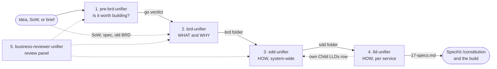
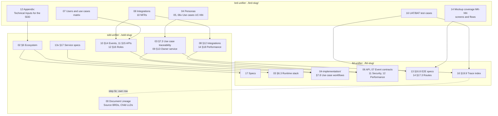
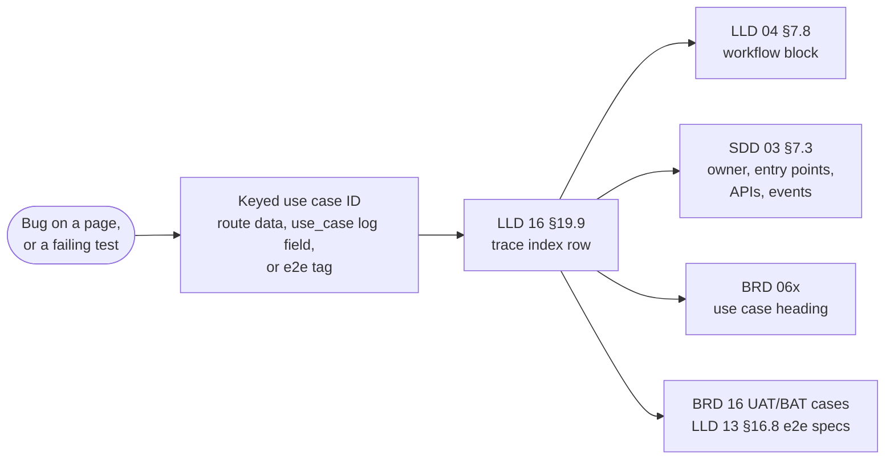
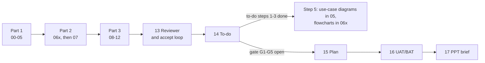

# Product Documentation Skill Suite

Five skills that take a product from a raw idea to an implementation-ready design. Four authoring skills each own one stage and write a folder of numbered Markdown chunks; the fifth reviews the chain. Each stage reads the folder of the stage before it, cites it by link and ID instead of copying it, and stops at gates you clear before it moves on.

- [The chain at a glance](#the-chain-at-a-glance)
- [Shared conventions](#shared-conventions)
- [How the skills link together](#how-the-skills-link-together)
- [1. pre-BRD](#1-pre-brd-pre-brd-unifier) · [2. BRD](#2-brd-brd-unifier) · [3. SDD](#3-sdd-sdd-unifier) · [4. LLD](#4-lld-lld-unifier) · [5. Business reviewer](#5-business-reviewer-business-reviewer-unifier)
- [Installation and usage](#installation-and-usage)
- [Suggested workflow](#suggested-workflow) · [Known gaps](#known-gaps)

---

## The chain at a glance



**Summary:** each solid arrow is a folder the next skill reads; a BRD can also start straight from a SoW, spec, or old BRD. The only write back up the chain is the LLD registering itself in its parent SDD, and the review panel can challenge the pre-BRD, BRD, and SDD at any point.

| Stage | Skill | Question it answers | You give it | It writes | It stops for you |
| ----- | ----- | ------------------- | ----------- | --------- | ---------------- |
| 1. Discovery | `pre-brd-unifier` | Is this worth building? | An idea, notes, or a brief | `./pre-brd-[slug]/`: master and 24 chunks; `.xlsx` on request | Before the Excel export, which runs only after you approve the Markdown |
| 2. Requirements | `brd-unifier` | What are we building, and why? | A pre-BRD, SoW, brief, product spec, RFP scope, old BRD, or notes | `./brd-[slug]/`: master and chunks 00-14; 15-17 once unlocked | After parts 1 and 2; on every open item; at the delivery gate (G1-G5) |
| 3. Solution design | `sdd-unifier` | How does the whole system work? | One or more finished BRDs, or an SDD to reshape | `./sdd-[slug]/`: master, chunks 00-18, one `13x` chunk per service; 19 once unlocked | Project type, architecture, and ecosystem choices; after parts 1 and 2; on every open item; at the e2e gate (E1-E4) |
| 4. Detailed design | `lld-unifier` | How is each service built? | An SDD, a codebase, or both | `./lld-[slug]/`: master, chunks 00-18, one `04-implementation/<service>.md` per service | The direction question (from-sdd, from-code, hybrid), always asked |
| Review | `business-reviewer-unifier` | Does the document chain hold up? | The documents to challenge | `review-comments-tracker.md` in the project root | On every review point, one at a time |

---

## Shared conventions

All skills follow the same house style, so output is interchangeable and tool-friendly across stages.

- **Markdown only.** No `.docx` or `.pdf` unless explicitly requested. The one exception is the pre-BRD `.xlsx` export, produced only on demand after the Markdown is approved.
- **Chunks or combined.** Every authoring skill takes `chunks` (the default: one file per section group) or `combined` (one file). The BRD and SDD also take `parts` (the default in chunks mode: three parts, with a stop for your review after parts 1 and 2) or `whole` (one run). The BRD, SDD, and LLD convert between the two layouts in both directions (merge and re-chunk); each skill's `chunking.md` holds the rules.
- **Stable file names.** `NN-kebab-name.md`, with a letter suffix where a chunk repeats (`06a`, `06b` per persona in the BRD; `13a`, `13b` per service in the SDD). The LLD puts one file per service in `04-implementation/`. Numbers never shift, so links stay valid.
- **Self-describing chunks.** BRD, SDD, and LLD chunks open with a `<!-- CHUNK: NN ... -->` comment and close with a `<!-- MASTER: ... | PREV: ... | NEXT: ... -->` footer. Each folder has a master index: `[project-slug]-brd-master.md`, `[project-slug]-sdd-master.md`, `[project-slug]-lld-master.md`, and `00-pre-brd-master.md`. The BRD and SDD masters also record generation progress, so an interrupted run resumes where it stopped.
- **What vs how.** The BRD is business language only (the WHAT). The SDD owns every technical decision (the HOW). The LLD owns implementation detail and the constitution-grade Specs chunk (Mission, Tech Stack, Roadmap, Project Type) that feeds SpecKit `/constitution`.
- **One fact, one home.** A downstream document cites upstream content by link and ID and adds only its delta; restating it is a review defect (Type `Duplication`). Inside the SDD, the registries (10 events, 11 APIs, 12 roles) are the single home of contract names; the service chunks and the LLD match them character for character.
- **IDs are stable and owned.** IDs are never renumbered once seen. Use case, test case, and mockup IDs belong to the BRD; service names, `API-NN`, `INT-NN`, and event names belong to the SDD. Every BRD ID cited downstream carries its BRD's short key, even when there is one BRD: `REFUNDS/UC-04`.
- **Gaps are flagged, never invented.** `[NEEDS CLARIFICATION: ...]` in the pre-BRD, BRD, and SDD; `[TBD - EXTERNAL: ...]` for provider-owned API fields in the SDD; `> Confirm:` and `> TODO:` confidence flags in the LLD.
- **Cleared-context review.** Every full generation ends with an independent reviewer subagent that writes an Open Items chunk (pre-BRD 24, BRD 13, SDD 18, LLD 18). Each item has options, a recommendation, and the reason it wins. The BRD and SDD then walk you through every item (accept, choose another option, or defer) and apply only what you accept; the pre-BRD and LLD leave the items for you and your team to decide.
- **Decision history lives in `decision-log.md`** (BRD and SDD), a companion file that is never merged. Content chunks state only the settled rule.
- **Diagrams are inline Mermaid,** each with a 1-2 sentence summary so the document reads without a renderer. Miro boards are created only on explicit request, and the board link is additive (`> Miro: <url>` under the Mermaid block), never a replacement.
- **No em dash characters** in generated documents. Use commas, colons, parentheses, or a short hyphen with spaces instead.
- **Tech defaults (SDD and LLD only).** Java 21, Spring Boot 3.5+, PostgreSQL 17+, UUIDv7 keys, Kafka on premises (SNS and SQS on AWS), Keycloak, Angular 17+ standalone with Tailwind and PrimeNG, UTC for all timestamps. The SDD proposes them and you confirm them; BRD Technical Inputs override them; the LLD follows the SDD's §6 over them.

---

## How the skills link together

The BRD, SDD, and LLD form one traceable chain. The diagram shows the main chunk-to-chunk handoffs; the tables after it list every one, with the file that holds the rules.



**Summary:** the BRD's use cases, matrix, integrations, NFRs, and technical inputs become the SDD's ownership, contracts, and ecosystem; the SDD's registries and service specs become the LLD's implementation, contracts, and Specs. The LLD also reads the BRD's screens, mockups, and test cases directly, and writes one row back into the SDD's lineage.

### Who owns what

| Fact | Home (the only place it is stated) | Cited by |
| ---- | ---------------------------------- | -------- |
| Personas, use cases (`UC-NN`), permissions | BRD 04, 05, `06x`, 07 | SDD 03 §7, 09, 12; LLD 04, 16 |
| Business NFRs and their measures | BRD 10 | SDD 14 §18, which quantifies them |
| Integration partners and purpose | BRD 08 | SDD 08 §12 (mechanisms, `INT-NN`), 11 §15 (`API-NN`) |
| Screens and mockups (`MK-NN`), UAT/BAT cases (`TC-[AREA]-NN`) | BRD 14 Mockup coverage, 16 | LLD 04, 13 §16.8, 14 §17.3, 16 §19.9 |
| Technology stack and version pins | SDD 02 §6 (seeded by BRD Technical Inputs) | LLD 03 §6.3, 17 Specs |
| Services and use-case ownership | SDD 09 §13 | SDD 03 §7.3; LLD master and `04-implementation/` files |
| Event, API, and role contracts (HTTP and in-process) | SDD 10 §14 (with §14.10 in-process events), 11 §15, 12 §16 | SDD `13x`; LLD 06, 07, 09, 11 |
| Classes, pseudocode, patterns, schema, runtime config | LLD 04, 05, 08, 09, 10 | Implementation |
| Specs (Mission, Tech Stack, Roadmap, Project Type) | LLD 17 | SpecKit `/constitution` |
| Source BRDs and child LLDs | SDD 00 § Document Lineage (each LLD writes only its own row) | The BRD key in every downstream ID |

### BRD to SDD (rules: `sdd-unifier/brd-to-sdd.md`)

| BRD chunk | SDD destination | How it moves |
| --------- | --------------- | ------------ |
| 00 Cover | 00 § Document Lineage, Source BRDs row | Each BRD gets a short capital key (`REFUNDS`) used on every BRD ID the SDD cites |
| 01 Executive summary, objectives | 01 §1 Executive summary | Recast as the technical summary; objectives become technical implications |
| 02 Glossary, assumptions, challenges, dependencies | 01 §3 Assumptions, §4 Risks, §5 Glossary; 08 §12 | Reference plus delta; challenges become risks; dependencies become integrations |
| 03 Domain concepts | 09 §13 service boundaries; `13x` business logic and data | Concepts suggest bounded contexts; lifecycles suggest state machines and events |
| 04 Scope, personas | 01 §2 Scope; 03 §7.1 Actors | Reference plus delta; each persona becomes an actor |
| 05, `06x` Use cases | 03 §7.2 and §7.3; 09 §13 owner; 05 §8.4 and §8.5 flows; `13x` business logic | Cited by keyed link (`[REFUNDS/UC-04](...)`), never restated; exactly one owner service per use case |
| 07 Users and use cases matrix | 12 §16 roles; 07 §11 security; `13x` authorization notes | Personas become roles, `Yes` cells become permissions, footnotes become conditional rules |
| 08 Integrations | 08 §12 (protocol, auth, timeouts); 11 §15 API contracts | The SDD adds the mechanism; partner contracts stay `TBD - external` until you supply the provider's documentation |
| 09 Reporting | `13x` Output; 14 §18 load context | |
| 10 NFRs | 14 §18 targets; 07 §11; 04 §8.1 style drivers | Quantified technically; a target the BRD does not imply is flagged |
| 11 UI/UX expectations | 07 §11 notes; §15.1 error model | Frontend technology is not taken from the BRD |
| 12 Appendix § Technical Inputs for the SDD | 02 §6 Ecosystem (shown as `BRD-mandated`), §9, §12, §18 | Read first; overrides the CLAUDE.md defaults |
| 12 Wishlist | 17 §22 Wishlist | Reference plus delta |
| 13 Open items; 15 Implementation plan; 16 UAT/BAT cases | Input context only | Never copied; deferred business decisions may become SDD risks |
| 14 To-do; 17 Presentation brief | Ignored | Working artifacts, not requirements |

The SDD refuses an unfinished BRD (a part still `Pending` or `In progress` in its master). With two or more BRDs, it reconciles them before the design starts and never resolves a conflict silently.

### SDD to LLD (rules: `lld-unifier/sdd-to-lld.md`)

| SDD chunk | LLD destination | How it moves |
| --------- | --------------- | ------------ |
| 00 § Document Lineage | 00 Related BRD(s); 16 §19.1; this LLD's own Child LLDs row | The row (Direction, version, link) is the LLD's only write outside its folder |
| 01 §1-§5 | 01 §1-§4; 17 Specs Mission and Project Type | Reference plus delta |
| 02 §6 Ecosystem | 03 §6.3 Runtime stack; 17 Specs Tech Stack | Version pins verbatim; the SDD wins over the CLAUDE.md defaults |
| 03 §7.3 Use case traceability | 04 §7.8, one `### KEY/UC-NN` block per use case; 16 §19.9 index | The trace spine: owner and entry points exactly as §7.3 states them |
| 04 §8.1-§8.3, 05 §8.4-§8.5 | 02 §5.4; 03 §6.1, §6.4; 04 §7.8 workflows and sequences | Operationalised per service, never restated |
| 06 §9-§10 principles and ADRs | Followed; linked from 16 §19.2 | |
| 07 §11 Cross-cutting | 09 §12 (all of it); 05 §8.4 | Defaults become concrete configuration |
| 08 §12 Integrations | 06, 07; 09 §12.3 resilience | Each becomes an outbound call or an event subscription |
| 09 §13 Services and modules | One `04-implementation/<service>.md` per row, module rows included; the master | `Use cases (BRD)` becomes the file's `Owns use cases (SDD 09):` line |
| 10 §14 Event hub | 07 §10 Event contracts (§14.10 in-process events: 07 §10.6); 09 outbox | Names match character for character; payloads are referenced, not copied; in-process events get no topic, outbox, or DLQ |
| 11 §15 API contracts | HTTP: 06 §9.1 (with the `API-NN`); in-process ports: 06 §9.6; 04 §7.7 error mapping | Names, URIs, and port operations match; bodies are referenced; `TBD - external` stays a `> TODO:`; internal HTTP calls carry the §15.1 token, checked against §16 |
| 12 §16 Roles | 11 §14 Security; 09 §12.1; 04 §7.7 | Role names and permission tokens match; the catalogue is referenced |
| `13x` §17.X Service specs | 04 §7.1-§7.8; 05 §8; 06; 07; 08 §11.1; 10; 11 §14.6 | The heaviest derivation step |
| 14 §18, 15 §19, 16 §20, 17 §21 | 12 §15; 10 §13.1 and §13.8; 16 §19 | SLO targets are referenced; the LLD adds how they are met |
| 19 §24 (when written) | 02 §5.4; saga narratives in 04 | Optional: the LLD does not wait for the SDD's e2e gate. HTTP edges become outbound calls with resilience settings; in-process edges become port calls |

The LLD refuses an unfinished SDD (a part still pending, or §7.3 still `Pending (part 2)`).

### BRD to LLD, directly (found through the SDD's lineage)

| BRD chunk | LLD destination |
| --------- | --------------- |
| 05 Use Case Summary and the `06x` use case headings | 04 §7.8 block headings and links; 16 §19.9 |
| 14 Mockup coverage (`MK-NN`, one row per screen or flow, with its use cases); a screen ID instead where the BRD text defines one | 14 §17.3 route rows (`Screen (BRD)`, `Use cases (BRD)`); the Screens field of each 04 traceability line |
| 16 UAT/BAT test cases | The UAT/BAT field of each 04 traceability line; 13 §16.8 e2e tags; 16 §19.9. While BRD chunk 16 is locked: `Pending (BRD 16 not written)` |

### Use-case traceability, end to end



**Summary:** every traced entry point, route, and e2e test carries the keyed use case ID, so a production bug or a failing test leads to one row of the LLD's trace index, and from there one click reaches the design, the requirement, and its acceptance tests.

### Lineage and change flow

- **One SDD, one or more parent BRDs, zero or more child LLDs.** SDD chunk 00 § Document Lineage lists each source BRD (key, version, link) and each child LLD (scope, direction, version, the SDD version it last read, link). Each LLD adds or updates only its own row; the SDD checks those rows on every run and marks a row out of date once the SDD has moved past the version that LLD read.
- **A new SDD version:** on its next run, the LLD compares the SDD version it recorded (16 §19.1) with the current one, lists the SDD changes since then, and offers a targeted refresh of the LLD chunks they affect. It never refreshes silently.
- **A new BRD version:** tell `sdd-unifier` "BRD `KEY` has a new version". It updates the lineage, derives the delta, reconciles contracts again, and marks chunk 19 `Stale`. Then ask `lld-unifier` to "refresh the trace".
- **BRD chunk 16 written later, or screens and mockups changed:** "refresh the trace" in the LLD updates the 04 lines, routes, e2e tags, and the index. Nothing else is rewritten.

---

## 1. pre-BRD (`pre-brd-unifier`)

**Purpose:** the discovery layer that runs before any requirements are written. It validates that an idea is worth building before effort goes into a full BRD, and it performs the analysis (market sizing, competitor scan, macro and internal factors) through multi-agent web research instead of only templating it.

**Usage:** `pre-brd-unifier [chunks|combined]` (chunks is the default).

**Chunks** (folder `./pre-brd-[slug]/`, index `00-pre-brd-master.md`; combined: `PRE-BRD-[ProjectName]-v1.1.md`):

| Chunks | Tier | Frameworks |
| ------ | ---- | ---------- |
| 01-05 | 1. Idea definition | Concept Sheet, Product Charter, Lean Canvas, Value Proposition Canvas, Empathy Map |
| 06-12 | 2. Market and competition | Market Comparison, Market Sizing, PESTLE, Porter's Five Forces, EFAS, IFAS, SWOT |
| 13-14 | 3. Prioritization | RICE, MoSCoW |
| 15-21 | 4. Strategy and planning | OKRs, BCG Matrix, Ansoff Matrix, VRIO, Product Strategy Canvas, Product Lifecycle, Roadmap and Project Plan |
| 22 | 5. Synthesis | Executive Summary Scoreboard: composite score and go / no-go thresholds |
| 23 | Investor pass | Investor Assessment: an independent Go, Conditional, or No-Go verdict, including go-to-market |
| 24 | Reviewer pass | Open Items and Assumptions Log: the reviewer's findings plus every material assumption with its basis and risk |

**How the chunks relate:** chunks 01-21 are filled tier by tier from one sourced research bundle; each shared fact (value proposition, target segment, roadmap) is stated once in its home chunk and linked elsewhere. Chunk 22 is computed from the tier 2-4 signals, chunk 23 is written by a separate investor agent after 22, and chunk 24 is written last by a cleared-context reviewer over 01-23.

**What to expect:**

| | |
| --- | --- |
| You provide | An idea, notes, or a brief. |
| It asks you | The output format if not given, then at most four intake questions (product idea, target segment, geography, currency and hard constraints). |
| It stops | After presenting the Markdown. Excel is produced only when you approve it ("export to Excel"). |
| It never | Invents a market figure without a source (unverifiable values become `[NEEDS CLARIFICATION: ...]`), hardcodes a value the formulas in `frameworks.md` compute, or produces Excel before your approval. |
| Done when | All 24 chunks and the master exist, and the handoff lists the clarification count, open items, sources, and the investor verdict. |

**Excel export:** `scripts/export_xlsx.py` clones the reference workbook `reference/PRE-BRD-v1.1.xlsx` (fonts, settings, sample columns, live formulas) using `reference/cell-map.json`. See `xlsx-export.md`. Tests live in `scripts/tests/`.

**Feeds into:** the BRD. A validated pre-BRD supplies the problem statement, target users, market context, and prioritized scope. Give `brd-unifier` the pre-BRD folder as its source: it maps each framework chunk to its BRD home (`sow-transformation.md`), links the market figures and scores instead of copying them, and names a No-Go or Conditional verdict in its handoff.

---

## 2. BRD (`brd-unifier`)

**Purpose:** generate, or transform an existing document (SoW, old-format BRD, loose notes) into, a Business Requirements Document in the house template. The BRD is business language only and written in plain language (`writing-style.md`): short sentences, common words, every number and rule kept.

**Usage:** `brd-unifier [chunks|combined] [parts|whole]`.

- `parts` (default in chunks mode): three parts, stopping for your review after parts 1 and 2 (`parts-mode.md`). Part 1 settles scope, personas, and the use case list; part 2 writes the detailed use cases and the matrix; part 3 writes the rest, runs the review and the open items loop, and writes the to-do.
- `whole`: everything in one run. Combined mode is always `whole`.

**Chunks** (folder `./brd-[slug]/`, index `[slug]-brd-master.md`; rules: `chunking.md`):

| # | File | Content | Written | In merged BRD |
| - | ---- | ------- | ------- | ------------- |
| 00 | `00-cover-and-changelog.md` | Title block, Changes Log, table of contents, figure and table indexes | Part 1 | Yes |
| 01 | `01-executive-summary-and-context.md` | Executive summary, background and problem, business objectives | Part 1 | Yes |
| 02 | `02-glossary-assumptions-facts.md` | Glossary (business terms), assumptions and constraints, facts, challenges, dependencies | Part 1 | Yes |
| 03 | `03-definitions-and-domain-concepts.md` | Domain concepts in business terms (split into `03a`, `03b` when very large) | Part 1 | Yes |
| 04 | `04-scope-and-personas.md` | In and out of scope; personas | Part 1 | Yes |
| 05 | `05-user-journeys-overview.md` | One journey per persona, summarized workflow, Use Case Summary (the `UC-NN` list) | Part 1 | Yes |
| 06a, 06b, ... | `06a-use-cases-[persona].md` | Detailed `UC-NN` blocks, one chunk per persona | Part 2 | Yes |
| 07 | `07-users-use-cases-matrix.md` | Persona by use case matrix (`Yes` / `-`, footnotes for conditional access) | Part 2 | Yes |
| 08 | `08-integrations.md` | Business partners, purpose, information exchanged | Part 3 | Yes |
| 09 | `09-reporting-and-analytics.md` | What each report shows, audience, frequency | Part 3 | Yes |
| 10 | `10-nfrs.md` | NFRs as business expectations with business measures | Part 3 | Yes |
| 11 | `11-summary-and-uiux.md` | Summary, global UI/UX expectations | Part 3 | Yes |
| 12 | `12-appendix-and-wishlist.md` | Appendix, including Technical Inputs for the SDD (source mandates, verbatim); wishlist | Part 3 | Yes |
| 13 | `13-open-items-and-clarifications.md` | Reviewer findings `OI-NN`, each with options, a Recommended Answer, and the Why | Part 3, reviewer | Yes |
| 14 | `14-todo.md` | Product-manager to-do: open items register, consistency check, grill-me, mockups, diagrams, delivery gate | End of part 3 | No |
| 15 | `15-implementation.md` | Use cases as dependency-ordered tasks (`TASK-NN`) in waves, with a delivery status | Gated | Yes |
| 16 | `16-uat-bat-test-cases.md` | Business acceptance cases (`TC-[AREA]-NN`) traced to use cases, NFRs, and tasks | Gated | Yes |
| 17 | `17-for-ppt.md` | Executive slide sequence and 30-second use-case videos | Gated | No |
| - | `decision-log.md` | Decision history (companion file, created on the first decision) | As needed | No |

**How the chunks relate:**



**Summary:** the body is written in three reviewed parts, reviewed by an independent agent, and turned into a to-do; the gated diagrams and the three delivery chunks come on later runs, only once that to-do is cleared.

- Personas in 04 drive everything after them: one journey in 05, one `06x` chunk, and one matrix column each.
- The matrix (07) is derived from the use cases' actor fields and cross-checked both ways; a mismatch is fixed in the use case, never in the matrix.
- Accepted open items (13) are applied back into 00-12 and recorded in `decision-log.md`.
- The to-do (14) has five steps: resolve open items, consistency check, grill-me session, Figma mockups, and use-case diagrams with flowcharts (after steps 1-3, in parallel with step 4).
- The delivery gate opens only when every to-do step is `Complete` with evidence and every item is `Resolved` (conditions G1-G5 in `delivery-chunks.md`). `Deferred` counts as open, and there is no override. Chunks 15-17 cite 00-13 by ID and never add a requirement.

**What to expect:**

| | |
| --- | --- |
| You provide | A source (a pre-BRD, SoW, brief, product spec, RFP scope, old BRD, notes) or a topic. Optional: `AGENTS.md` and `ui-ux-global-constitution.md` in the project root, read automatically when present. |
| It asks you | The output format if not given; at most three intake questions (project name, source, personas); the brand or key color when there is no UI/UX constitution; a decision on every open item. |
| It stops | After parts 1 and 2 until you say "continue"; and for 15-17, until the delivery gate is open. |
| It never | Puts technology, protocols, or implementation terms in the body; invents measures, targets, or behaviour; writes 15-17 (not even a draft) while the gate is shut; applies an open item without your decision. |
| Done when | 00-14 exist, the open items are decided or explicitly left open, and the handoff reports the clarification markers, the matrix status, the to-do, and the gate state. |

**Reference files:** `chunking.md`, `modes.md`, `parts-mode.md`, `transform-detection.md`, `sow-transformation.md`, `mermaid-diagrams.md`, `use-case-quality.md`, `writing-style.md`, `decision-log.md`, `delivery-chunks.md`, `TEMPLATE-COMBINED.md`.

**Feeds into:** the SDD (derive-from-BRD) and, for use cases, screens, mockups, and test cases, the LLD.

---

## 3. SDD (`sdd-unifier`)

**Purpose:** the Solution Design Document. It owns the entire HOW. It can generate from scratch, transform an existing SDD, or derive an SDD from one or more BRDs (`brd-to-sdd.md`).

**Usage:** `sdd-unifier [chunks|combined] [parts|whole]`.

- `parts` (default in chunks mode): three parts, stopping for your review after parts 1 and 2 (`parts-mode.md`). Part 1 settles the architecture, ADRs, and service decomposition; part 2 writes the per-service specs and the three registries, then reconciles them; part 3 writes operations and the appendix, runs the review and the open items loop, then tries the e2e gate.
- `whole`: everything in one run. Combined mode is always `whole`.

**Chunks** (folder `./sdd-[slug]/`, index `[slug]-sdd-master.md`; rules: `chunking.md`):

| # | File | Sections | Content | Written |
| - | ---- | -------- | ------- | ------- |
| 00 | `00-cover-and-changelog.md` | Cover | Title block, Document Lineage (source BRDs with keys; child LLDs with the SDD version each read), Changes Log, indexes | Part 1 |
| 01 | `01-executive-summary-scope-risks.md` | §1-§5 | Executive summary (with Project Type), scope, assumptions, risks, glossary | Part 1 |
| 02 | `02-ecosystem-overview.md` | §6 | Full platform stack and ecosystem-level rules, from the ecosystem selection | Part 1 |
| 03 | `03-users-and-use-cases.md` | §7 | Actors, use case diagram, §7.3 Use Case Traceability (one row per BRD use case) | Part 1 (§7.3 columns completed in part 2) |
| 04 | `04-architecture-style-and-diagrams.md` | §8.1-§8.3 | Architecture style, context diagram, high-level architecture | Part 1 |
| 05 | `05-workflows-and-sequences.md` | §8.4-§8.5 | Workflow and sequence diagrams for the critical flows | Part 1 |
| 06 | `06-principles-and-decisions.md` | §9-§10 | Architecture principles, ADRs | Part 1 |
| 07 | `07-cross-cutting-concerns.md` | §11 | Data modeling, multi-tenancy, deployment, observability, configuration, security defaults | Part 1 |
| 08 | `08-integrations.md` | §12 | Every external integration with protocol, auth, timeout, retries, fallback | Part 1 |
| 09 | `09-services-summary.md` | §13 | One row per service or module (Type), with the BRD use cases it owns and its status | Part 1 |
| 10 | `10-events-hub.md` | §14 | Centralized Event Hub: topics, events, envelope, payload contracts, and in-process domain events (§14.10) (the event registry) | Part 2 |
| 11 | `11-api-contracts.md` | §15 | One `API-NN` contract per synchronous integration, HTTP or in-process port call (the API registry) | Part 2 |
| 12 | `12-centralized-user-roles.md` | §16 | Roles, permission tokens, capability and permission matrices (the role registry) | Part 2 |
| 13a, 13b, ... | `13a-service-[slug].md` | §17.X | Full spec of one service: boundaries, logic, data model, APIs, events, errors, observability | Part 2 |
| 14 | `14-performance-and-capacity.md` | §18 | Load estimates, throughput targets, peak scenarios, stress testing | Part 3 |
| 15 | `15-environments.md` | §19 | Dev, SIT, UAT, Prod | Part 3 |
| 16 | `16-operations-runbook.md` | §20 | Procedures, diagnostics, on-call | Part 3 |
| 17 | `17-appendix-and-wishlist.md` | §21-§22 | Appendix, wishlist | Part 3 |
| 18 | `18-open-items-and-clarifications.md` | §23 | Reviewer findings `OI-NN` with a Recommended Answer and the Why | Part 3, reviewer |
| 19 | `19-e2e-system-design.md` | §24 | End-to-end view consolidated from 09-13x: landscape, fan-out maps, sync edges, sagas | Gated (E1-E4) |
| - | `decision-log.md` | - | Ecosystem and questionnaire records, clarification history (companion file) | As needed |

**How the chunks relate:**


**Summary:** the service specs are drafted first, then consolidated into the three registries and reconciled against them; the review follows, and the end-to-end design is written last, only once every open item is closed.

- Chunks 10, 11, and 12 are the contract registries: topic and event names, API method and URI, role names and permission tokens in every `13x` chunk must match them character for character. Divergences go to §14.8, §15.5, or §16.12 and are never reconciled silently.
- §7.3 is a consolidated view: owner from 09, entry points from the `13x` List of APIs, flows from 05, APIs from §15.2, events from §14.5 and §14.10.
- The e2e gate opens only when every open item is closed (`Deferred` counts as open), no contract divergence is `Open`, no clarification marker is left in 09-13x or §7.3, and the reconciliation is newer than the last change (E1-E4, SKILL.md step 8b). There is no override.
- The SDD never writes a Specs chunk: the LLD owns Specs.

**What to expect:**

| | |
| --- | --- |
| You provide | One or more finished BRD folders or combined files (a BRD with a part still pending is refused), an existing SDD to transform, or a brief. |
| It asks you | The output format if not given; at most three intake questions; greenfield or brownfield; when deriving from a BRD, the architecture questionnaire (accept all, or walk through eight questions); the ecosystem selection (accept all, or walk through each layer); conflicts between BRDs; a decision on every open item. |
| It stops | After part 1 (architecture, ADRs, services) and part 2 (service specs and contracts) until you say "continue"; and for chunk 19, until the e2e gate is open. |
| It never | Fills the ecosystem silently; assumes microservices; invents an external API contract (it stays `TBD - external` until you supply the provider's documentation); creates or renumbers a BRD use case; writes into a child LLD. |
| Done when | 00-18 exist and are reconciled, the open items are decided or explicitly left open, and chunk 19 is written or reported `Locked` with the list of what is open. |

**Reference files:** `chunking.md`, `modes.md`, `parts-mode.md`, `architecture-questionnaire.md`, `decision-log.md`, `transform-detection.md`, `source-transformation.md`, `brd-to-sdd.md`, `sdd-quality.md`, `mermaid-diagrams.md`, `TEMPLATE-COMBINED.md`.

**Feeds into:** the LLD. By default one LLD covers every service in chunk 09 (one `04-implementation/` file each); a large system can be split into several LLDs, each registered in chunk 00.

---

## 4. LLD (`lld-unifier`)

**Purpose:** the Low-Level Design. It specifies services to an implementation-ready level that any AI agent or developer can build from.

**Usage:** `lld-unifier [chunks|combined]` (chunks is the default). The argument sets only the output shape; the skill always asks for the direction first:

- **from-sdd:** greenfield, design before code exists (`sdd-to-lld.md`).
- **from-code:** reverse-engineer an LLD from an existing codebase (`code-extraction.md`).
- **hybrid:** compare an SDD with complete code and mark the drift (`hybrid-drift.md`). When only some services have code, the built ones are read from code and the rest get a "not yet built" placeholder.

**Chunks** (folder `./lld-[slug]/`, index `[slug]-lld-master.md`; rules: `chunking.md`):

| # | File | Sections | Content |
| - | ---- | -------- | ------- |
| 00 | `00-metadata.md` | Metadata | Title block, direction, Related BRD(s) with keys, Related SDD, source code path, Changes Log, flag summary |
| 01 | `01-purpose-and-scope.md` | §1-§4 | Purpose, scope (the services this LLD covers), assumptions, glossary |
| 02 | `02-context.md` | §5 | Bounded context, upstream and downstream, cross-service dependencies |
| 03 | `03-architecture.md` | §6 | Component and deployment topology, runtime stack, the style as operationalised |
| 04 | `04-implementation/<service>.md` | §7 | One file per service: responsibility, class map with each entry point's authorization, pseudocode, patterns, DI graph, transactions, errors, use-case workflows (§7.8) |
| 05 | `05-data-model.md` | §8 | ERD, tables, indexes, multi-tenancy, Flyway plan, retention, encryption |
| 06 | `06-api-contracts.md` | §9 | Endpoint inventory with `API-NN` and permission tokens, request and response shapes, OpenAPI snippets, in-process port contracts (§9.6) |
| 07 | `07-event-contracts.md` | §10 | Topics, schemas, producer and consumer specs, DLQ strategy, in-process domain events (§10.6) |
| 08 | `08-state-and-rules.md` | §11 | State machines, cross-service rules, algorithms |
| 09 | `09-cross-cutting.md` | §12 | Auth and tenant, idempotency, resilience, outbox, saga, errors, logging, tracing (`use_case`), config, health |
| 10 | `10-operations.md` | §13 | Configuration, metrics, logs, dashboards, alerts, runbook, on-call |
| 11 | `11-security.md` | §14 | Data classification, PII, secrets, authorization, threats, compliance |
| 12 | `12-performance.md` | §15 | SLOs, caching, hot-path indexes, bulkheads, peak scenarios, load tests |
| 13 | `13-testing.md` | §16 | Test pyramid, Testcontainers, contract and e2e tests, e2e specs tagged with use case and test case IDs (§16.8) |
| 14 | `14-frontend.md` | §17 | Only when there is a UI: component tree, state, routes with their BRD screens and use cases (§17.3), i18n, RTL, a11y |
| 15 | `15-open-questions.md` | §18 | The author's own index of `> Confirm:` and `> TODO:` flags, drift markers, pending decisions |
| 16 | `16-references.md` | §19 | Source documents and their state, ADR links, schemas, runbooks, and the use-case trace index (§19.9) |
| 17 | `17-specs.md` | §20 in combined | Specs: Mission, Tech Stack, Roadmap, Project Type, synthesised after the body for SpecKit `/constitution` |
| 18 | `18-open-items-and-clarifications.md` | §21 in combined | Reviewer findings `OI-NN` the author did not flag, each with options, a Recommendation, and the Why |

**How the chunks relate:**


**Summary:** the body is written from the SDD, the code, or both; the use-case trace is checked, the Specs are synthesised from the finished body, the LLD registers itself in the SDD, and an independent reviewer writes chunk 18 last.

- Chunk 04 is the load-bearing split. Each `04-implementation/<service>.md` holds one `### KEY/UC-NN: Title` block with a traceability line for every use case its service owns.
- Chunk 15 is the author's own flag index; chunk 18 is the reviewer's external findings. They never duplicate each other.
- Chunk 16 §19.9 is the production-bug entry point: one row per SDD §7.3 row, each cell read from its home.
- Chunk 14 is omitted, not stubbed, when there is no UI.

**What to expect:**

| | |
| --- | --- |
| You provide | An SDD folder (from-sdd), a code path (from-code), or both (hybrid). The BRDs are found through the SDD's lineage. |
| It asks you | The output shape if not given; the direction (always, with a suggested default); at most three intake questions; the Project Type when the SDD lacks it; a missing version pin; roadmap phases when the SDD has no natural breaks; on an existing LLD whose SDD has moved on, whether to refresh the affected chunks (it lists the SDD changes first). |
| It stops | When the SDD is unfinished (a part still pending, or §7.3 still `Pending (part 2)`). |
| It never | Picks a direction silently; invents class names, columns, topics, or version pins (it flags them); creates a use case, test case, or screen ID; writes into the SDD beyond its own Child LLDs row. |
| Done when | The body, the Specs, and chunk 18 exist, and the handoff reports the flag and drift counts, the use-case trace per BRD, and the Child LLDs row. |

**Key behaviors:**

- from-code and hybrid dispatch two specialist agents: `feature-dev:code-explorer` for structural discovery and `code-documentation:docs-architect` for narrative synthesis (`agent-orchestration.md`).
- Confidence and pattern rules (`confidence-rules.md`, `pattern-rules.md`) govern how inferred facts are marked and which patterns apply.
- Reads a modular-monolith SDD too: each module gets its own `04-implementation/` file, in-process port contracts go to 06 §9.6 and in-process domain events to 07 §10.6, with no HTTP, broker, outbox, or retry settings for them.
- Every traced entry point carries `@UseCase("REFUNDS/UC-04")`, which puts a `use_case` attribute on its logs and spans; routes and e2e tests carry the same keyed IDs.

**Reference files:** `chunking.md`, `modes.md`, `transform-detection.md`, `sdd-to-lld.md`, `code-extraction.md`, `hybrid-drift.md`, `pattern-rules.md`, `confidence-rules.md`, `lld-quality.md`, `mermaid-diagrams.md`, `agent-orchestration.md`, `TEMPLATE-COMBINED.md`.

**Feeds into:** implementation, including SpecKit-driven and Claude Code-assisted builds.

---

## 5. Business reviewer (`business-reviewer-unifier`)

**Purpose:** a multi-angle adversarial review panel over business and design documents (pure-business docs, domain identification, service boundaries, project preparation, BRDs, SDDs), driven to resolution. It is the cross-document panel; it is separate from the single reviewer pass built into each authoring skill.

**Usage:** `business-reviewer-unifier [panel|walkthrough|apply|verify]`. With no argument, the phase is detected from the tracker.

| Phase | What happens |
| ----- | ------------ |
| `panel` | Dispatches the reviewer personas and builds `review-comments-tracker.md` in the project root. |
| `walkthrough` | Resumes point-by-point resolution with you. |
| `apply` | Applies decided points across the whole document chain. |
| `verify` | Cleared-context consistency re-review, then versioning and changelogs. |

**What to expect:** you point it at the documents; it asks you to decide each point; it never applies a point you have not decided. It is done when every point is decided, applied, and verified.

**Reference files:** `reviewer-personas.md`, `panel-orchestration.md`, `tracker-schema.md`, `walkthrough-protocol.md`, `apply-and-verify.md`.

---

## Installation and usage

These skills follow the open Agent Skills format (`SKILL.md` folders) and run in Claude (claude.ai and Claude Code), OpenAI Codex, and Kimi Code. Each `SKILL.md` has a "Running outside Claude Code" section that maps Claude-only tools to plain fallbacks.

### claude.ai (web or desktop)

Upload each skill through Settings, under Capabilities or Customize, then Skills. Each skill must be a folder containing its `SKILL.md` (plus any reference files), zipped and uploaded individually, then toggled on. Custom skills are private to your account; on Team or Enterprise plans an owner can optionally share them org-wide.

Note the 1024-character cap on the `description` frontmatter field. All descriptions are kept under it and written as YAML block scalars (`description: >-`) so strict parsers accept them; keep both rules when editing.

### Claude Code (CLI)

Install at user scope by extracting the skill into:

```text
C:\Users\<username>\.claude\skills\<skill-name>\
```

List installed skills with `/skills` inside a session, or this command in PowerShell outside one:

```powershell
dir $env:USERPROFILE\.claude\skills
```

Common failure causes if a skill does not appear: the session was not reloaded, Windows extraction created a double-nested folder, or the `SKILL.md` frontmatter is invalid. Two caveats for CLI use: the Miro MCP must be configured separately via `claude mcp add`, and the pre-BRD Excel export needs Python with `openpyxl` installed.

### Codex and Kimi Code

Both scan `~/.agents/skills` for user-level skills (Kimi also reads `~/.kimi-code/skills`; Codex also reads `.agents/skills` in a repo). Keep this repo as the single source and link each skill in with a junction, so edits here apply everywhere:

```powershell
$src = "$env:USERPROFILE\.claude\skills"; $dst = "$env:USERPROFILE\.agents\skills"
foreach ($s in 'pre-brd-unifier','brd-unifier','sdd-unifier','lld-unifier','business-reviewer-unifier') {
  New-Item -ItemType Junction -Path "$dst\$s" -Target "$src\$s"
}
```

| Agent | List skills | Invoke explicitly | Automatic |
| ----- | ----------- | ----------------- | --------- |
| Claude Code | `/skills` | `/brd-unifier chunks parts` | Yes, from the description |
| Codex (CLI, IDE, app) | `/skills` | `$brd-unifier chunks parts` | Yes, from the description |
| Kimi Code | ask "which skills do you have" | `/skill:brd-unifier chunks parts` | Yes, from the description |

Differences outside Claude Code: agents without sub-agents run the reviewer pass in the same context (weaker than Claude's fresh-context review), and questions are asked in chat instead of through a question tool. The pre-BRD Excel export needs Python with `openpyxl` in every runtime.

### How to use each skill

Call a skill by name with its arguments, or just describe the task in plain words and the agent picks the skill from its description. The prefix depends on the agent: `/` in Claude Code, `$` in Codex, `/skill:` in Kimi Code.

| Skill | Arguments | Claude Code | Codex | Kimi Code | Plain-words example |
| ----- | --------- | ----------- | ----- | --------- | ------------------- |
| pre-BRD | `[chunks\|combined]` | `/pre-brd-unifier chunks` | `$pre-brd-unifier chunks` | `/skill:pre-brd-unifier chunks` | "Validate this idea with a pre-BRD" |
| BRD | `[chunks\|combined] [parts\|whole]` | `/brd-unifier chunks parts` | `$brd-unifier chunks parts` | `/skill:brd-unifier chunks parts` | "Turn this SoW into a BRD" |
| SDD | `[chunks\|combined] [parts\|whole]` | `/sdd-unifier chunks parts` | `$sdd-unifier chunks parts` | `/skill:sdd-unifier chunks parts` | "Derive an SDD from the BRD in ./brd-acme" |
| LLD | `[chunks\|combined]` | `/lld-unifier chunks` | `$lld-unifier chunks` | `/skill:lld-unifier chunks` | "Write the LLD for the wallet service from the SDD" |
| Business reviewer | `[panel\|walkthrough\|apply\|verify]` | `/business-reviewer-unifier panel` | `$business-reviewer-unifier panel` | `/skill:business-reviewer-unifier panel` | "Review the BRD and SDD from different angles" |

Tips:

- Run from the project folder where the documents should be written; each skill writes its folder there, so sibling folders (`brd-*`, `sdd-*`, `lld-*`) link to each other with relative paths.
- Point each skill at its input: an idea or notes for pre-BRD, a SoW, old BRD, or pre-BRD folder for BRD, the BRD folder for SDD, the SDD folder or a code path for LLD.
- In `parts` mode the BRD and the SDD stop after parts 1 and 2; reply "continue" to go on, or "do the rest in one go".
- Say "export to Excel" after approving a pre-BRD to get the `.xlsx`.

---

## Suggested workflow

1. Run **pre-BRD** to validate the idea and get a go / no-go verdict.
2. If go, run the **BRD** skill on the validated concept (or an inbound SoW). Review after parts 1 and 2, decide the open items, then work through the to-do in chunk 14. Once the delivery gate is open, ask for the implementation plan, the UAT/BAT test cases, and the presentation brief.
3. Run **SDD** on the finished BRD folder(s). Confirm the architecture and the ecosystem, review after parts 1 and 2, and decide the open items; the end-to-end design follows once they are all closed.
4. Run **LLD** from the SDD, by default once for the whole system (or once per group of services): `from-sdd` before code exists, `hybrid` once it does. It registers itself in the SDD.
5. Run the **business reviewer** at any point to challenge the document chain from several angles.
6. Hand the LLD and its `17-specs.md` to SpecKit and Claude Code for the build. When the BRD changes later, update the SDD ("BRD `KEY` has a new version"); the SDD marks its child LLDs out of date, and each LLD offers a targeted refresh on its next run.

---

## Known gaps

- The newest paths have not been run on a sample project yet: the LLD's modular-monolith path, the BRD merge and re-chunk heading map, SDD version tracking, and the pre-BRD to BRD mapping.
- `business-reviewer-unifier` reviews BRDs and SDDs generically; it does not yet check the SDD's document lineage, §7.3 use case traceability, or contract registries.
