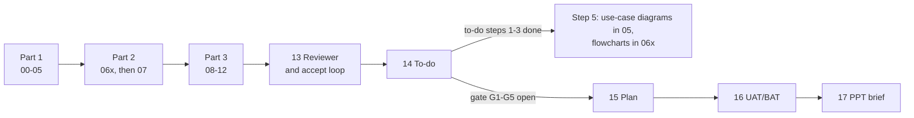

# Product Documentation Skill Suite

Five skills that take a product from a raw idea to an implementation-ready design. Four authoring skills each own one stage and write numbered Markdown chunks or a combined document; the fifth reviews the chain. Downstream stages read their source documents, cite them by link and ID, and add their own detail. The BRD and SDD stop at review checkpoints and gates.

- [The chain at a glance](#the-chain-at-a-glance)
- [Shared conventions](#shared-conventions)
- [How the skills link together](#how-the-skills-link-together)
- [1. pre-BRD](#1-pre-brd-pre-brd-unifier) · [2. BRD](#2-brd-brd-unifier) · [3. SDD](#3-sdd-sdd-unifier) · [4. LLD](#4-lld-lld-unifier) · [5. Business reviewer](#5-business-reviewer-business-reviewer-unifier)
- [Installation and usage](#installation-and-usage)
- [Suggested workflow](#suggested-workflow) · [Known gaps](#known-gaps)

---

## The chain at a glance


**Summary:** the solid arrows show the input and handoff flow; a BRD can also start straight from a SoW, spec, or old BRD. The only write back up the chain is the LLD registering itself in its parent SDD, and the review panel can challenge the pre-BRD, BRD, and SDD at any point.

| Stage | Skill | Question it answers | You give it | It writes | It stops for you |
| ----- | ----- | ------------------- | ----------- | --------- | ---------------- |
| 1. Discovery | `pre-brd-unifier` | Is this worth building? | An idea, notes, a brief, or an existing pre-BRD | `./pre-brd-[slug]/`: master and 24 chunks; `.xlsx` on request | Before the Excel export, which runs only after you approve the Markdown |
| 2. Requirements | `brd-unifier` | What are we building, and why? | A pre-BRD, SoW, brief, product spec, RFP scope, old BRD, or notes | `./brd-[slug]/`: master and chunks 00-14; 15-17 once unlocked | After parts 1 and 2; on every open item; at the delivery gate (G1-G5) |
| 3. Solution design | `sdd-unifier` | How does the whole system work? | One or more finished BRDs, an SDD to reshape, or a brief | `./sdd-[slug]/`: master, chunks 00-18, one `13x` chunk per service or module; 19 once unlocked | Project type, architecture, and ecosystem choices; after parts 1 and 2; on every open item; at the e2e gate (E1-E4) |
| 4. Detailed design | `lld-unifier` | How is each service built? | An SDD, a codebase, or both | `./lld-[slug]/`: master, chunks 00-18 (14 only with a UI), one `04-implementation/<service>.md` per service | The direction question (from-sdd, from-code, hybrid), always asked; on an existing LLD, one refresh offer for SDD and BRD changes |
| Review | `business-reviewer-unifier` | Does the document chain hold up? | The documents to challenge | `review-comments-tracker.md` and `review-panel-findings.md` in the project root, plus the decided changes in the reviewed documents | On every review point, one at a time |

---

## Shared conventions

The skills share a house style, with these output and handoff rules.

- **Markdown by default.** BRD, SDD, and LLD write other formats only on explicit request. The pre-BRD produces Markdown and, on demand after approval, an `.xlsx` export.
- **Chunks or combined.** Every authoring skill takes `chunks` (the default: one file per section group) or `combined` (one file). The BRD and SDD also take `parts` (the default in chunks mode: three parts, with a stop for your review after parts 1 and 2) or `whole` (one run). All four authoring skills convert between layouts in both directions (merge and re-chunk): pre-BRD uses `modes.md`; BRD, SDD, and LLD use `chunking.md`. A combined BRD still keeps 14 and 17 as separate files, and BRD and SDD decision logs stay separate.
- **Stable file names.** `NN-kebab-name.md`, with a letter suffix where a chunk repeats (`06a`, `06b` per persona in the BRD; `13a`, `13b` per service in the SDD). The LLD puts one file per service in `04-implementation/`. Numbers never shift, so links stay valid.
- **Self-describing chunks.** BRD, SDD, and LLD chunks open with a `<!-- CHUNK: NN ... -->` comment and close with a `<!-- MASTER: ... | PREV: ... | NEXT: ... -->` footer. Each folder has a master index: `[project-slug]-brd-master.md`, `[project-slug]-sdd-master.md`, `[project-slug]-lld-master.md`, and `00-pre-brd-master.md`. The pre-BRD instead uses a `PRE-BRD CHUNK:` comment block with `TITLE:`, `TIER:`, `PROJECT:`, and `PART OF:`, and no navigation footer. The BRD and SDD masters record part progress so interrupted runs can resume; the pre-BRD and LLD masters are indexes.
- **What vs how.** The BRD is business language only (the WHAT). The SDD owns every technical decision (the HOW). The LLD owns implementation detail and the constitution-grade Specs chunk (Mission, Tech Stack, Roadmap, Project Type) that feeds SpecKit `/constitution`.
- **One fact, one home.** A downstream document cites upstream content by link and ID and adds only its delta; restating it is a review defect (Type `Duplication`), except in an LLD derived view that names its SDD source on every row (the runtime stack, tables, port behaviour, resilience instances, configuration defaults, alerts, and SLOs). Inside the SDD, the registries (10 events, 11 APIs, 12 roles) are the single home of contract names; the service chunks and the LLD match them character for character.
- **IDs are stable and owned.** IDs are never renumbered once seen. Use case, test case, and mockup IDs belong to the BRD; service names, `API-NN`, `INT-NN`, and event names belong to the SDD. Every BRD ID cited downstream carries its BRD's short key, even when there is one BRD: `REFUNDS/UC-04`.
- **Gaps are flagged, never invented.** `[NEEDS CLARIFICATION: ...]` in the pre-BRD, BRD, and SDD; `[TBD - EXTERNAL: ...]` for provider-owned API fields in the SDD; `> Confirm:` and `> TODO:` confidence flags in the LLD.
- **Cleared-context review.** Every full generation includes an independent reviewer subagent that writes an Open Items chunk (pre-BRD 24, BRD 13, SDD 18, LLD 18). Each item has options, a recommendation, and the reason it wins. The BRD, SDD, and LLD then walk you through every item (accept, choose another option, defer, or reject) and apply only what you accept; the pre-BRD leaves the items for you and your team to decide. For BRD, SDD, and LLD, the full review runs once, on the first build; a BRD also gets it on its first substantive migration into the current template when earlier review evidence does not cover the risks, or when it has no chunk 13. BRD consistency checks stop after three runs in one request, SDD reviews after three review passes, and LLD reviews after two (the full or delta review, then one check of the answers applied in that request). A BRD gets a new full review only when you ask. What the last run finds is not applied in that request: it stays open. In the BRD, SDD, and LLD, a decision the owner gives on it is recorded as `Decided - pending application` and applied by the next request. A later SDD update that changes chunks 01-17, or an LLD update that changes content, gets a delta review of the changed chunks (an SDD update that only applies decisions left pending by an earlier request gets an application check of them instead); in a BRD update, the rerun consistency check is that review. Every write of SDD chunk 19 also gets a cleared-context faithfulness check against chunks 02-13x. An open item that a later upstream change or business review settles is closed in that update.
- **Answer policy and stand-ins.** Every skill accepts an answer policy you set for a run (for example "accept the recommended option"). It takes recommended options only: it never defers, rejects (one exception: a recommended rejection that changes no document, in the review panel, or a Recommended Answer that reads `No change: <evidence>`, in the BRD, SDD, and LLD), picks another option, or supplies a fact only a person or provider can give (a target the business sets, such as a time limit, is a choice, not a fact), and it never takes a decision your standing instructions for the project reserve (for example adopting a new dependency; proposing one, as a `Proposed` decision with its alternative, is not reserved), or a business rule a source document rules out. Each decision it takes is labelled `Policy: <policy> (set by <name>, <date>)`. A policy may name stand-ins (Product Owner, Mockup, SME, Approver) whose labelled confirmations count where a person's would; a stand-in never approves its own work, and the Approver stand-in signs only a latest version whose gate is met. With no policy, every rule stays as written. Each skill states the rule once: the pre-BRD and the review panel in § Answer policy, the BRD and SDD in step 8, the LLD in step 7a.
- **Light runs.** Every skill takes `light` for a lighter run that keeps templates, IDs, and hand-off contracts whole; each skill's § Light run lists what it skips.
- **Decision history lives in `decision-log.md`** (BRD and SDD), a companion file that is never merged. It includes the Clarification, Marker, and Business review registers. Content chunks state only the settled rule.
- **One update, one version** (BRD, SDD, LLD). An update is one request, up to its handoff; the first build is one update, at 1.0. Only a content change bumps the version: the update's first one moves it one minor step (1.0 to 1.1; a major step only when you ask) and opens one Changes Log row, which every later change in the update joins. Each row ends with `Chunks:`: the first build's row reads `Chunks: none (initial build)`; a later row names the chunks whose content changed in meaning (LLD service files by name; a combined document names its changed sections), not routine cover, navigation index, or footer updates. An update row is dated by the request's first content change; the first build's row by the build's completion. A BRD bumps only for changes to product content in 00-13; delivery tracking, refreshes, a merge or re-chunk, and rewording that changes no fact do not bump it. A BRD that already has versions moves into the current template as one update, one minor step above its last version. The master and chunk 00 carry the current version; every other chunk keeps the version its content last changed in, and a gated chunk (BRD 15-17, SDD 19) the version it was written at; SDD 19 keeps it when a later write changes none of its content. Status lines, Stale marks, links, footers, the SDD gate lines and E3 marker inventory, an SDD review's coverage rows when nothing else changed, and the Child LLDs rows bump nothing; so do Figma link-only edits, diagram splits that keep every rule, actor, and path, adding a missing BRD key to a citation, and setting an upstream version in an LLD link label to the one 16 §19.1 records.
- **BRD, SDD, and LLD diagrams are inline Mermaid,** each with a 1-2 sentence summary so the document reads without a renderer. Miro boards are created only on explicit request, and the board link is additive (`> Miro: <url>` under the Mermaid block), never a replacement.
- **No em dash characters** in the authoring skills' generated documents. Use commas, colons, parentheses, or a short hyphen with spaces instead.
- **Tech defaults (SDD and LLD only).** Java 21, Spring Boot 3.5+, PostgreSQL 17+, UUIDv7 keys, Kafka on premises (SNS and SQS on AWS), Keycloak, Angular 17+ standalone with Tailwind and PrimeNG, UTC for all timestamps. The SDD proposes them and you confirm them; BRD Technical Inputs override them; the LLD follows the SDD's §6 over them.

---

## How the skills link together

The BRD, SDD, and LLD form one traceable chain. The diagram shows the main chunk-to-chunk handoffs; the tables summarize the mappings, with the files that hold the full rules.


**Summary:** the BRD's use cases, matrix, integrations, NFRs, and technical inputs become the SDD's ownership, contracts, and ecosystem; the SDD's registries and service specs become the LLD's implementation, contracts, and Specs. The LLD also reads the BRD's screens, mockups, and test cases directly, and writes one row back into the SDD's lineage.

### Who owns what

| Fact | Home (the only place it is stated) | Cited by |
| ---- | ---------------------------------- | -------- |
| Personas, use cases (`UC-NN`), permissions | BRD 04, 05, `06x`, 07 | SDD 03 §7, 09, 12; LLD 04, 16 |
| Business NFRs and their measures | BRD 10 | SDD 14 §18.5, one technical target row per BRD NFR with its realisation link |
| Integration partners and purpose | BRD 08 | SDD 08 §12 (mechanisms, `INT-NN`), 11 §15 (`API-NN`) |
| Screens and mockups (`MK-NN`), UAT/BAT cases (`TC-[AREA]-NN`) | BRD 14 Mockup coverage, 16 | LLD 04, 13 §16.8, 14 §17.3, 16 §19.9 |
| Technology stack and version pins | SDD 02 §6 (seeded by BRD Technical Inputs) | LLD 03 §6.3, 17 Specs |
| Services and use-case ownership | SDD 09 §13 | SDD 03 §7.3; LLD master and `04-implementation/` files |
| Event, API, and role contracts (HTTP and in-process) | SDD 10 §14 (with §14.10 in-process events), 11 §15, 12 §16 | SDD `13x`; LLD 06, 07, 09, 11 |
| Table design and configuration defaults | SDD `13x` DB Modeling, 15 §19 | LLD 05 §8.2 and 10 §13.1, restated with a Source per row |
| Classes, pseudocode, patterns, and the tables, columns, and settings the LLD adds | LLD 04, 05, 08, 09, 10 | Implementation |
| Specs (Mission, Tech Stack, Roadmap, Project Type) | LLD 17 | SpecKit `/constitution` |
| Source BRDs and child LLDs | SDD 00 § Document Lineage (each LLD writes only its own row) | The BRD key in every downstream ID |

### BRD to SDD (rules: `sdd-unifier/brd-to-sdd.md`)

| BRD chunk | SDD destination | How it moves |
| --------- | --------------- | ------------ |
| 00 Cover | 00 § Document Lineage, Source BRDs row | Each BRD gets a short capital key (`REFUNDS`) used on every BRD ID the SDD cites |
| 01 Executive summary, objectives | 01 §1 Executive summary | Recast as the technical summary; objectives become technical implications |
| 02 Glossary, assumptions, facts, challenges, dependencies | 01 §1, §3-§5; 02 §6; 04 §8.1; 08 §12; 07 §11.3 | Reference plus delta; challenges and hard dependencies inform risks; external dependencies become integrations. `Needed before` names the build of a use case, BAT sign-off, or go-live; the last two also become promotion gates in §11.3 |
| 03 Domain concepts | 09 §13 service boundaries; `13x` business logic and data | Concepts suggest bounded contexts; lifecycles suggest state machines and events |
| 04 Scope, personas | 01 §2 Scope; 03 §7.1 Actors | Reference plus delta; each persona becomes an actor |
| 05, `06x` Use cases | 03 §7.2 and §7.3; 09 §13 owner; 05 §8.4 and §8.5 flows; `13x` business logic and List of APIs | Cited by keyed link (`[REFUNDS/UC-04](...)`), never restated; exactly one owner service per use case. Each owned use case that a request starts gets a proposed endpoint (method and path only, fields flagged), named for your review at the part 2 stop or in the handoff |
| 07 Users & Use Cases Matrix | 12 §16 roles; 07 §11 security; `13x` authorization notes | Personas become roles, `Yes` cells become permissions, footnotes become conditional rules |
| 08 Integrations | 08 §12 (protocol, auth, timeouts); 11 §15 API contracts | The SDD adds the mechanism; partner contracts stay `TBD - external` until you supply the provider's documentation |
| 09 Reporting | `13x` Output; 14 §18 load context | |
| 10 NFRs | 14 §18.5 NFR targets; 07 §11; 04 §8.1 style drivers | Quantified technically; a target the BRD does not imply is flagged |
| 11 Summary and UI/UX expectations | 01 §1 (when it adds a technical angle); 07 §11 notes; 02 §6 frontend context; 11 §15.1 error model | UX expectations inform the design; frontend technology comes from parked Technical Inputs, defaults, or architect input |
| 12 Appendix § Technical Inputs for the SDD | 02 §6 Ecosystem (shown as `BRD-mandated`), §9, §12, §18 | Read first; overrides the CLAUDE.md defaults |
| 12 Other appendix references; wishlist | 17 §21 Appendix; §22 Wishlist | Carry references; wishlist is reference plus delta |
| 13 Open items; 15 Implementation plan; 16 UAT/BAT cases | Input context only | Never copied; deferred business decisions may become SDD risks |
| 14 To-do; 17 Presentation brief | Ignored | Working artifacts, not requirements |

The SDD refuses an unfinished BRD (a part still `Pending` or `In progress` in its master). With two or more BRDs, it reconciles them before the design starts and never resolves a conflict silently.

### SDD to LLD (rules: `lld-unifier/sdd-to-lld.md`)

| SDD chunk | LLD destination | How it moves |
| --------- | --------------- | ------------ |
| 00 § Document Lineage | 00 Related BRD(s); 16 §19.1; this LLD's own Child LLDs row | The row (scope, Direction, version, the SDD version its content reflects, link) is the LLD's only write outside its folder |
| 01 §1-§5 | 01 §1-§4; 15 §18 for implementation risks; 17 Specs Mission and Project Type | Reference plus delta; the SDD risk register is not copied |
| 02 §6 Ecosystem | 03 §6.3 Runtime stack; 17 Specs Tech Stack | Version pins verbatim; the SDD wins over the CLAUDE.md defaults |
| 03 §7.3 Use case traceability | 04 §7.8, one `### KEY/UC-NN` block per active use case; 16 §19.9 index | The trace spine: owner and entry points exactly as §7.3 states them |
| 04 §8.1-§8.3, 05 §8.4-§8.5 | 02 §5.4; 03 §6.1, §6.4; 04 §7.8 workflows and sequences | Operationalised per service, never restated |
| 06 §9-§10 principles and ADRs | Principles followed and referenced from 03; ADR links in 16 §19.2 | |
| 07 §11 Cross-cutting | 09 §12 (all of it); 05 §8.4; 10 §13.3 and §13.6 (§11.4 Metrics and Dashboards) | Defaults become concrete configuration; metrics and dashboards are referenced with their implementation delta |
| 08 §12 Integrations | 06, 07; 09 §12.3 resilience | Each becomes an outbound call or an event subscription |
| 09 §13 Services and modules | One `04-implementation/<service>.md` per row, module rows included; the master; 17 Specs Roadmap | `Use cases (BRD)` becomes the file's `Owns use cases (SDD 09):` line |
| 10 §14 Event hub | 07 §10 Event contracts (§14.10 in-process events: 07 §10.6); 09 outbox | Names match character for character; payloads are referenced, not copied; in-process events get no topic or DLQ, and use the outbox only when the §14.10 Delivery line is durable |
| 11 §15 API contracts | HTTP: 06 §9.1 (with the `API-NN`); in-process ports: 06 §9.6; 04 §7.7 error mapping | Names, URIs, and port operations match; bodies are referenced; §9.6 carries the port's Idempotency and Transaction rows. `TBD - external` stays a `> TODO:`; internal HTTP calls carry the §15.1 client-credentials token, checked against the §16 permission token; port calls check the token at the port |
| 12 §16 Roles | 11 §14 Security; 09 §12.1; 04 §7.2 Authorization | Role names and permission tokens match; the catalogue is referenced |
| `13x` §17.X Service specs | 04 §7.1-§7.8; 05 §8; 06; 07; 08 §11.1; 09 §12.3; 10; 11 §14.6 | The heaviest derivation step. 05 §8.2 restates the Tables Design rows with a Source per row; the §8.1 ERD shows keys and relationships only |
| 14 §18, 15 §19, 16 §20, 17 §21-§22 | 12 §15; 10 §13.1 and §13.8; 16 §19; §18.5 targets also map to the place their `Realised in` cell names (12 §15.1 for a §18 row, 09 for a §11 default, the owner's 04 file for a §17.X section, or wherever an ADR's decision is implemented) | Targets are referenced with their implementation detail; environment configuration is a derived view with a Source per row; the §22 wishlist is not carried, except an item that informs near-term implementation, which goes to 15 §18.4 |
| Alerts: 07 §11.4 Alerting, or an 08 §12 integration row, 11 §15 error row, or `13x` section that raises one; the 16 §20 procedure each triggers | 10 §13.7 Alerts | A derived view with a Source per row: the metric and threshold that implement each SDD alert, and an Action that links its §20 procedure, or a `> TODO:` when §20 has none |
| 18 §23 Open items | Not carried: input context | A decided item reaches the LLD through the chunks it changed; an open or deferred one that an implementation choice depends on becomes a `> Confirm:` or `> TODO:` flag, and a `Decided - pending application` one a `> TODO:` with the decided option as its best guess; a refresh checks LLD chunk 18 against the change |
| 19 §24 (when written) | 02 §5.4; saga narratives in 04 | Optional: the LLD does not wait for the SDD's e2e gate. HTTP edges become outbound calls with resilience settings; in-process edges become port calls |

The LLD refuses an unfinished SDD (a part still pending, or §7.3 still `Pending (part 2)`).

### BRD to LLD, directly (found through the SDD's lineage)

| BRD chunk | LLD destination |
| --------- | --------------- |
| 05 Use Case Summary and the `06x` use case headings | 04 §7.8 block headings and links; 16 §19.9 |
| 14 Mockup coverage (one row per screen or flow, keyed `MK-NN` or a legacy screen ID; the row wins); a screen ID from the BRD text only when no chunk 14 row exists | 14 §17.3 route rows (`Screen (BRD)`, `Use cases (BRD)`); the Screens field of each 04 traceability line |
| 16 UAT/BAT test cases | The UAT/BAT field of each 04 traceability line; 13 §16.8 e2e tags; 16 §19.9. While BRD chunk 16 is locked: `Pending (BRD 16 not written)` |

### Use-case traceability, end to end


**Summary:** every traced entry point, route, and e2e test carries the keyed use case ID, so a production bug or a failing test leads to one row of the LLD's trace index, and from there one click reaches the design, the requirement, and its acceptance tests.

### Lineage and change flow

- **One SDD, one or more parent BRDs, zero or more child LLDs.** An SDD generated from a brief has no parent BRD: its register says `None - generated without a BRD`. SDD chunk 00 § Document Lineage lists each source BRD (key, version, link) and each child LLD (scope, direction, version, the SDD version its content reflects, link). Each LLD adds or updates only its own row; the SDD checks those rows on every run and marks a row out of date once the SDD has moved past the version that LLD reflects. Declining a refresh keeps the older version and the out-of-date note.
- **An upstream change on an existing LLD:** the LLD checks the SDD and BRD versions, BRD chunk 16 state, and mockup rows against its recorded state and routes. It reads each newer SDD Changes Log row's `Chunks:` list (mapping combined sections to chunks). It makes one offer covering the affected LLD chunks and trace changes, then runs one accepted update with one version bump for content changes and a delta review. For each field mapping row whose SDD source the change touched, the LLD places it maps to are checked against that whole source, not only the changed text. When SDD §1, §6, or §13 changed, the update also re-synthesises the Specs. In every case it settles, supersedes, or reopens the chunk 18 items the change answers, and removes the flags the change answers. If a BRD is newer than the SDD's register, the offer suggests updating the SDD first; that BRD's trace refresh waits. It never refreshes silently.
- **A new BRD version:** tell `sdd-unifier` "BRD `KEY` has a new version". It updates the lineage, derives the delta, back-fills what the change makes wrong, reconciles contracts, and marks chunk 19 `Stale` if it exists. It settles or supersedes the items and markers the change answers, reopens choices left undecided, runs a delta review, and then checks the e2e gate again (a chunk 19 whose source claims did not change keeps its body and version; when it was marked `Stale`, a faithfulness check must first find no mismatch). Several BRDs named in one request are one update, with one version bump when content changes. Then tell `lld-unifier` "the SDD has a new version"; its one offer also covers the required BRD trace changes.
- **BRD chunk 16 written later, or screens and mockups changed:** "refresh the trace" in the LLD updates the affected 04 lines, routes, e2e tags, the index, and 16 §19.1. It also settles, supersedes, or reopens affected chunk 18 items and removes the flags the change answers, then runs a delta review. A Figma link change alone needs no refresh: the LLD links the chunk 14 row, which carries the current link.
- **After a business review:** the panel changes content within each document's template and bumps each changed BRD or SDD once. It edits an SDD only where a decision targets it or makes its text wrong, and leaves deriving new BRD content into the SDD to the SDD hand-off. It never edits an LLD or gated content; it sets existing gated outputs `Stale` and repoints links after a file rename. The close lists the requests in chain order: `brd-unifier` "update the todo: decisions from the business review of [the tracker's Created date] ([tracker path])" for each changed BRD, including a BRD derived from a changed pre-BRD; then `sdd-unifier` "BRD [KEY] has a new version, after the business review of [the tracker's Created date] ([tracker path])", naming all changed source BRDs, or "the business review changed this SDD" when only the SDD changed; then `lld-unifier` "the SDD has a new version" for each child LLD. Each hand-off runs only when you ask; `brd-unifier` and `sdd-unifier` take a review's hand-off once, and a repeat changes nothing but its pending items. Owners close the items the decisions answer and raise the open remainders under their own rules (the SDD raises an open item only for a design choice a decision leaves to it; a fact, or a question for a BRD owner or a provider, stays a clarification marker); a pre-BRD remainder goes to its BRD. Owner runs bump again only for their own content changes.
- **Gated outputs after a change:** existing BRD 15-17 chunks are marked `Stale` when a change alters their source meaning, or when a new to-do item, open item, consistency finding, or clarification marker appears after they were written. The mark goes in their status lines, chunk 14's Downstream outputs, and the master's State cells (chunks mode). SDD 19 is marked on the master's E2E gate line, or the combined cover. The owners refresh these outputs only after checking their gates again; the review's close notes them separately from its hand-off rows.

---

## 1. pre-BRD (`pre-brd-unifier`)

**Purpose:** the discovery layer that runs before any requirements are written. It creates a pre-BRD from an idea or reshapes an existing one. It tests whether the idea is worth building before a full BRD, using sourced research for market sizing, competitors, and external factors. Internal factors come from your intake; research only supplies the benchmarks that rate them. A transform preserves supplied facts and researches only missing frameworks.

**Usage:** `pre-brd-unifier [chunks|combined] [light]` (chunks is the default; `light` fills a reduced framework set, `pre-brd-unifier/SKILL.md` § Light run).

**Chunks** (folder `./pre-brd-[slug]/`, index `00-pre-brd-master.md`; combined: `PRE-BRD-[ProjectName]-v1.1.md`):

| Chunks | Tier | Frameworks |
| ------ | ---- | ---------- |
| 01-05 | 1. Idea definition | Concept Sheet, Product Charter, Lean Canvas, Value Proposition Canvas, Empathy Map |
| 06-12 | 2. Market and competition | Market Comparison, Market Sizing, PESTLE, Porter's Five Forces, EFAS, IFAS, SWOT |
| 13-15 | 3. Prioritization | RICE, MoSCoW, OKRs |
| 16-21 | 4. Strategy and planning | BCG Matrix, Ansoff Matrix, VRIO, Product Strategy Canvas, Product Lifecycle, Roadmap, Project Plan and Go-To-Market |
| 22 | 5. Synthesis | Executive Summary Scoreboard: composite score and go / no-go thresholds |
| 23 | Investor pass | Investor Assessment: seven aspects scored, go-to-market among them, and an independent Go, Conditional, or No-Go verdict |
| 24 | Reviewer pass | Open Items and Assumptions Log: the reviewer's findings plus every material assumption with its basis and risk |

**How the chunks relate:** chunks 01-21 are filled tier by tier from one sourced research bundle; each shared fact (value proposition, target segment, roadmap) is stated once in its home chunk and linked elsewhere, and shared market figures and the USD exchange rate sit in the Canonical figures table of 07. Chunk 22 scores five signals from Market Sizing (07, the SAM in USD), Porter's (09), EFAS (10), and IFAS (11) by a fixed mapping, then computes the composite; chunk 23 is written by a separate investor agent after 22, and chunk 24 is written last by a cleared-context reviewer over 01-23.

**What to expect:**

| | |
| --- | --- |
| You provide | An idea, notes, a brief, a SoW, or an existing pre-BRD to transform. |
| It asks you | The output format if not given; generate or transform, when your input leaves it unclear; at most four intake questions (product idea, target segment, geography, currency and hard constraints); and the investor lens (venture or business case) when the intake does not show it. |
| It stops | After presenting the Markdown. Excel is produced only when you approve it ("export to Excel"). |
| It never | Invents a market figure without a source (unverifiable values become `[NEEDS CLARIFICATION: ...]`), hardcodes a value the formulas in `frameworks.md` compute, or produces Excel before your approval. |
| Done when | All 24 chunks and the master, or the equivalent combined sections, exist, and the handoff lists the chunks, the clarification count, the open item count, the source count (distinct source links), and the investor verdict with its composite. |

**Excel export:** `scripts/export_xlsx.py` clones the reference workbook `reference/PRE-BRD-v1.1.xlsx` (fonts, settings, sample columns, live formulas) using `reference/cell-map.json`. The scoreboard uses the same signal mapping as chunk 22. The workbook covers the 22 frameworks only: the investor assessment (23), the open items log (24), the go-to-market section of 21, and the canonical figures table of 07 stay in the Markdown. Money values go into the workbook in USD, at the exchange rate recorded in 07. See `xlsx-export.md`. Tests live in `scripts/tests/`.

**Reference files:** `modes.md`, `transform-detection.md`, `frameworks.md`, `research-orchestration.md`, `xlsx-export.md`.

**Feeds into:** the BRD. A validated pre-BRD supplies the problem statement, target users, market context, and prioritized scope. Give `brd-unifier` the pre-BRD folder as its source: it maps each framework chunk to its BRD home (`sow-transformation.md`), links the market figures and scores instead of copying them, and names a No-Go or Conditional verdict in its handoff.

---

## 2. BRD (`brd-unifier`)

**Purpose:** generate, or transform an existing document (SoW, old-format BRD, loose notes) into, a Business Requirements Document in the house template. The BRD is business language only and written in plain language (`writing-style.md`): short sentences, common words, every number and rule kept.

**Usage:** `brd-unifier [chunks|combined] [parts|whole] [light] [phase=N]` (`light`: `brd-unifier/SKILL.md` § Light run; `phase=N`: § Phase-based BRD).

- `parts` (default in chunks mode): three parts, stopping for your review after parts 1 and 2 (`parts-mode.md`). Part 1 settles scope, personas, and the use case list; part 2 writes the detailed use cases and the matrix; part 3 writes the rest, runs the review and the open items loop, and writes the to-do.
- `whole`: chunks 00-14 in one run; 15-17 stay behind the delivery gate. Combined mode, merges, re-chunks, and targeted updates always run `whole`.

**Chunks** (folder `./brd-[slug]/`, index `[slug]-brd-master.md`; rules: `chunking.md`):

| # | File | Content | Written | In merged BRD |
| - | ---- | ------- | ------- | ------------- |
| 00 | `00-cover-and-changelog.md` | Title block, Changes Log, table of contents, figure and table indexes | Part 1 | Yes |
| 01 | `01-executive-summary-and-context.md` | Executive summary, background and problem, business objectives | Part 1 | Yes |
| 02 | `02-glossary-assumptions-facts.md` | Glossary (business terms), assumptions and constraints, facts, challenges, dependencies with `Needed before` (`Build of UC-NN`, BAT sign-off, or go-live) | Part 1 | Yes |
| 03 | `03-definitions-and-domain-concepts.md` | Domain concepts in business terms (split into `03a`, `03b` when very large) | Part 1 | Yes |
| 04 | `04-scope-and-personas.md` | In and out of scope; personas | Part 1 | Yes |
| 05 | `05-user-journeys-overview.md` | One journey per persona, summarized workflow, Use Case Summary (the `UC-NN` list) | Part 1 | Yes |
| 06a, 06b, ... | `06a-use-cases-[persona-slug].md` | Detailed `UC-NN` blocks, one chunk per persona | Part 2 | Yes |
| 07 | `07-users-use-cases-matrix.md` | Persona by use case matrix (`Yes` / `-`, footnotes for conditional access) | Part 2 | Yes |
| 08 | `08-integrations.md` | Business partners, purpose, information exchanged | Part 3 | Yes |
| 09 | `09-reporting-and-analytics.md` | What each report shows, audience, frequency | Part 3 | Yes |
| 10 | `10-nfrs.md` | NFRs as business expectations with business measures | Part 3 | Yes |
| 11 | `11-summary-and-uiux.md` | Summary, global UI/UX expectations | Part 3 | Yes |
| 12 | `12-appendix-and-wishlist.md` | Appendix, including Technical Inputs for the SDD (source mandates, verbatim); wishlist | Part 3 | Yes |
| 13 | `13-open-items-and-clarifications.md` | Reviewer findings `OI-NN`, each with options, a Recommended Answer, and the Why; an applied item keeps a stub (heading, Status, Resolution Log link) and its full record moves to `decision-log.md`. Optional scope proposals sit in Reviewer Notes and block nothing unless you adopt them | Part 3, reviewer | Yes |
| 14 | `14-todo.md` | Product-manager to-do: open items register, consistency check, grill-me, mockups, diagrams, delivery gate | End of part 3 | No |
| 15 | `15-implementation.md` | Use cases, and stated report or other section capabilities with no use case, as dependency-ordered tasks (`TASK-NN`) in waves, with a delivery status | Gated | Yes |
| 16 | `16-uat-bat-test-cases.md` | Business acceptance cases (`TC-[AREA]-NN`) traced to use cases (or the owning requirement section when there is none), NFRs, and tasks | Gated | Yes |
| 17 | `17-for-ppt.md` | Executive slide sequence and 30-second use-case videos | Gated | No |
| - | `decision-log.md` | Clarification, Marker, and Business review registers (companion file, created on first use) | As needed | No |

For a new `whole` BRD with at most six use cases and one or two personas, 05 and `06x` may collapse into one chunk, `05-user-journeys-and-use-cases.md` (`chunking.md`). In `parts` and on a re-chunk, they stay separate.

**How the chunks relate:**



**Summary:** the body is written in three reviewed parts, reviewed by an independent agent, and turned into a to-do; the gated diagrams come once to-do steps 1-3 are done, and the three delivery chunks come on later runs, only once the whole to-do is cleared.

- Personas in 04 drive everything after them: one journey in 05, one `06x` chunk, and one matrix column each.
- The matrix (07) is derived from the use cases' actor fields and cross-checked both ways. The use case wins: a matrix cell that disagrees is corrected to match it, and an actor field that looks wrong becomes an open item.
- Accepted open items (13) are applied back into 00-12 and recorded in `decision-log.md`.
- The to-do (14) has five steps: resolve open items, consistency check, grill-me session, Figma mockups, and use-case diagrams with flowcharts (after steps 1-3, in parallel with step 4).
- The delivery gate requires all five steps `Complete` with evidence: to-do items resolved, open items closed, and no body markers; a current consistency check with no waiting finding; confirmed grill-me decisions; approved mockups and a confirmed prototype play-through; and diagrams checked against the use cases, with a consistency rerun (G1-G5 in `delivery-chunks.md`). `Deferred` and `Decided - pending application` count as open. A pending outside dependency needs a confirmed owner and `Needed before`, not delivery now. The gate is checked before each of 15-17; there is no override, and these chunks never add a requirement.

**What to expect:**

| | |
| --- | --- |
| You provide | A source (a pre-BRD, SoW, brief, product spec, RFP scope, old BRD, notes) or a topic. Optional: `AGENTS.md` and `ui-ux-global-constitution.md` in the project root, read automatically when present. |
| It asks you | The output format if not given; at most three intake questions (project name, source, personas); one short business-or-technical question for an unqualified "HLD" request unless context decides; the brand or key color, once, with the open items, when there is no UI/UX constitution (never under an answer policy); a decision on every open item. |
| It stops | After parts 1 and 2 until you say "continue"; and for 15-17, until the delivery gate is open. |
| It never | Puts technology, protocols, or implementation terms in the body; invents measures, targets, or behaviour; writes 15-17 (not even a draft) while the gate is shut; applies an open item without your decision; marks the BRD `Approved`, or fills Reviewed/Approved By, unless you name the approver, or an answer policy names an Approver stand-in and its sign-off conditions hold (a content change to an `Approved` BRD sets it back to `In Review`). |
| Done when | 00-14 exist (or 00-13 as combined sections plus the separate to-do), the open items are decided or explicitly left open, and the handoff reports the clarification markers, the matrix status, the to-do, the gate state, and any scope proposals for your choice. |

**Reference files:** `chunking.md`, `modes.md`, `parts-mode.md`, `transform-detection.md`, `sow-transformation.md`, `mermaid-diagrams.md`, `use-case-quality.md`, `writing-style.md`, `decision-log.md`, `delivery-chunks.md`, `TEMPLATE-COMBINED.md`.

**Feeds into:** the SDD (derive-from-BRD) and, for use cases, screens, mockups, and test cases, the LLD.

---

## 3. SDD (`sdd-unifier`)

**Purpose:** the Solution Design Document. It owns the entire HOW. It can generate from scratch, transform an existing SDD, or derive an SDD from one or more BRDs (`brd-to-sdd.md`).

**Usage:** `sdd-unifier [chunks|combined] [parts|whole] [light]` (`light`: `sdd-unifier/SKILL.md` § Light run).

- `parts` (default in chunks mode): three parts, stopping for your review after parts 1 and 2 (`parts-mode.md`). Part 1 settles the architecture, ADRs, and service decomposition; part 2 writes the per-service specs and the three registries, then reconciles them; part 3 writes performance and capacity, environments, the runbook, and the appendix, runs the review and the open items loop, then tries the e2e gate.
- `whole`: chunks 00-18 in one run; chunk 19 follows in the same run only if the e2e gate opens. Combined mode, merges, re-chunks, and targeted updates always run `whole`.

**Chunks** (folder `./sdd-[slug]/`, index `[slug]-sdd-master.md`; rules: `chunking.md`):

| # | File | Sections | Content | Written |
| - | ---- | -------- | ------- | ------- |
| 00 | `00-cover-and-changelog.md` | Cover | Title block, Document Lineage (source BRDs with keys; child LLDs with the SDD version each reflects), Changes Log, indexes | Part 1 |
| 01 | `01-executive-summary-scope-risks.md` | §1-§5 | Executive summary (with Project Type), scope, assumptions, risks, glossary | Part 1 |
| 02 | `02-ecosystem-overview.md` | §6 | Full platform stack and ecosystem-level rules, from the ecosystem selection | Part 1 |
| 03 | `03-users-and-use-cases.md` | §7 | Actors, use case diagram, §7.3 Use Case Traceability (one row per BRD use case) | Part 1 (§7.3 columns completed in part 2) |
| 04 | `04-architecture-style-and-diagrams.md` | §8.1-§8.3 | Architecture style, context diagram, high-level architecture | Part 1 |
| 05 | `05-workflows-and-sequences.md` | §8.4-§8.5 | Workflow and sequence diagrams for the critical flows | Part 1 |
| 06 | `06-principles-and-decisions.md` | §9-§10 | Architecture principles, ADRs | Part 1 |
| 07 | `07-cross-cutting-concerns.md` | §11 | Data modeling, multi-tenancy, deployment, observability, configuration, security defaults | Part 1 |
| 08 | `08-integrations.md` | §12 | Every external integration with protocol, auth, timeout, retries, fallback | Part 1 |
| 09 | `09-services-summary.md` | §13 | One row per service or module (Type), with the BRD use cases it owns and its status | Part 1 |
| 10 | `10-events-hub.md` | §14 | Centralized Event Hub: topics, events, envelope, payload contracts, and in-process domain events (§14.10) (the event registry) | Part 2 |
| 11 | `11-api-contracts.md` | §15 | One `API-NN` contract per synchronous domain or provider integration, HTTP or in-process port call (the API registry); standard database, Vault, and identity-provider client calls are infrastructure configuration | Part 2 |
| 12 | `12-centralized-user-roles.md` | §16 | Roles, permission tokens, capability and permission matrices (the role registry) | Part 2 |
| 13a, 13b, ... | `13a-service-[slug].md` | §17.X | Full spec of one service or module: boundaries, logic, data model, APIs, events, errors, observability | Part 2 |
| 14 | `14-performance-and-capacity.md` | §18 | Load estimates, throughput targets, peak scenarios, stress testing, NFR targets (one §18.5 row per BRD NFR) | Part 3 |
| 15 | `15-environments.md` | §19 | Dev, SIT, UAT, Prod | Part 3 |
| 16 | `16-operations-runbook.md` | §20 | Procedures, diagnostics, on-call | Part 3 |
| 17 | `17-appendix-and-wishlist.md` | §21-§22 | Appendix, wishlist | Part 3 |
| 18 | `18-open-items-and-clarifications.md` | §23 | Reviewer findings `OI-NN`, each with a Recommended Answer and the Why, plus the items the author must raise (a use-case overlap between BRDs, behaviour no BRD use case covers, a chunk 19 source problem that a chunk 19 claim depends on or that lies in text the request changed, a business review remainder). Optional scope proposals sit in Reviewer Notes and block nothing unless you adopt them; a chunk 19 check finding that no chunk 19 claim depends on, in text the request did not change, is noted there too, for its owner | Part 3, reviewer |
| 19 | `19-e2e-system-design.md` | §24 | End-to-end view consolidated from 02-13x and checked against them on every write: landscape, fan-out maps, sync edges, sagas | Gated (E1-E4) |
| - | `decision-log.md` | - | Ecosystem and questionnaire records; Clarification, Marker, and Business review registers (companion file) | As needed |

**How the chunks relate:**


**Summary:** the service specs are drafted first, then consolidated into the three registries and reconciled against them; the review follows, and the end-to-end design is written last, only when all four e2e gate conditions are met.

- Chunks 10, 11, and 12 are the contract registries: topic and event names, API method and URI, role names and permission tokens in every `13x` chunk must match them character for character. Divergences go to §14.8, §15.5, or §16.12 and are never reconciled silently.
- §7.3 is a consolidated view: owner from 09, entry points from the `13x` List of APIs (an `Event:` or `Schedule:` trigger from its Input table), flows from 05, APIs from §15.2, events from §14.5 and §14.10.
- Step 6a also checks each new or changed `13x` data model: the ERD and Tables Design show the same tables and keys, every shared-schema key and index includes `tenant_id`, a column a rule relies on is NOT NULL or its null case is stated, and retention covers every table.
- The e2e gate requires every open item to read `Accepted - applied`, `Adjusted - applied`, or `Rejected`; every divergence row `Fixed in vX.X`; no unresolved value that an end-to-end claim depends on, wherever its marker sits (every live `[NEEDS CLARIFICATION: ...]` marker is classified in the E3 marker inventory (in the master, or the combined cover), with its owner and why it blocks or not); and contract reconciliation after the final relevant change, recorded with its order, not a date alone (E1-E4, SKILL.md step 8b). `Deferred` and other unapplied items, and divergence rows with no Status, block it. A `[TBD - EXTERNAL: ...]` placeholder does not block while the external system is only a named black box with its API IDs. An SDD gated before the inventory existed builds it at its next gate check. There is no override.
- The SDD never writes a Specs chunk: the LLD owns Specs.

**What to expect:**

| | |
| --- | --- |
| You provide | One or more finished BRD folders or combined files (a BRD with a part still pending is refused), an existing SDD to transform, or a brief. |
| It asks you | The output format if not given or implied (an SDD already in the folder keeps its own mode); at most three intake questions; greenfield or brownfield; when deriving from a BRD, the architecture questionnaire (accept all, or walk through eight questions); the ecosystem selection (accept all, or walk through each layer); conflicts between BRDs; a decision on every open item; an optional walk through the gate-blocking markers that are design choices (a provider fact, legal basis, or business number stays marked and goes to its named owner as an exact question); once, whether to derive from a source BRD that is not `Approved`; one short business-or-technical question for an unqualified "HLD" request unless context decides. |
| It stops | After part 1 (architecture, ADRs, services) and part 2 (service specs and contracts) until you say "continue"; and for chunk 19, until the e2e gate is open. |
| It never | Fills the ecosystem silently; assumes microservices; invents an external API contract (provider fields stay `TBD` until documentation or your explicit answer supplies them); creates or renumbers a BRD use case; writes into a child LLD. |
| Done when | 00-18 (or their combined sections) exist and are reconciled, the open items are decided or explicitly left open, and chunk 19 is checked and `Open - Up to date`, or reported `Locked` or `Stale` with the blockers. The handoff reports contracts and lineage (with out-of-date child LLDs), the use-case trace per BRD, the gate state, the open items (including those decided and pending application), proposed endpoints, scope proposals, and the questions only a BRD owner can answer, as follow-ups for `brd-unifier`. |

**Reference files:** `chunking.md`, `modes.md`, `parts-mode.md`, `architecture-questionnaire.md`, `decision-log.md`, `transform-detection.md`, `source-transformation.md`, `brd-to-sdd.md`, `sdd-quality.md`, `mermaid-diagrams.md`, `TEMPLATE-COMBINED.md`.

**Feeds into:** the LLD. By default one LLD covers every service in chunk 09 (one `04-implementation/` file each); a large system can be split into several LLDs, each registered in chunk 00.

---

## 4. LLD (`lld-unifier`)

**Purpose:** the Low-Level Design. It specifies services to an implementation-ready level that any AI agent or developer can build from.

**Usage:** `lld-unifier [chunks|combined] [light]` (chunks is the default; `light`: `lld-unifier/SKILL.md` § Light run). The arguments set only the output mode and the light run; the skill always asks for the direction first:

- **from-sdd:** greenfield, design before code exists (`sdd-to-lld.md`).
- **from-code:** reverse-engineer an LLD from an existing codebase (`code-extraction.md`).
- **hybrid:** compare an SDD with complete code and mark the drift (`hybrid-drift.md`). When only some services have code, the built ones are read from code and the rest get a "not yet built" placeholder.

**Chunks** (folder `./lld-[slug]/`, index `[slug]-lld-master.md`; rules: `chunking.md`):

| # | File | Sections | Content |
| - | ---- | -------- | ------- |
| 00 | `00-metadata.md` | Metadata | Title block, direction, Related BRD(s) with keys, Related SDD, source code path, Changes Log, flag summary |
| 01 | `01-purpose-and-scope.md` | §1-§4 | Purpose, scope (the services this LLD covers), assumptions, glossary |
| 02 | `02-context.md` | §5 | Bounded context, upstream and downstream, cross-service dependencies |
| 03 | `03-architecture.md` | §6 | Component and deployment topology, runtime stack, the style as operationalised |
| 04 | `04-implementation/<service>.md` | §7 | One file per service: responsibility, class map with each entry point's authorization, pseudocode, patterns, DI graph, transactions, errors, use-case workflows (§7.8) |
| 05 | `05-data-model.md` | §8 | ERD (keys and relationships), tables (columns, with a Source per row), indexes, multi-tenancy, Flyway plan, retention, encryption |
| 06 | `06-api-contracts.md` | §9 | Endpoint inventory with `API-NN` and permission tokens, request and response shapes, OpenAPI snippets, in-process port contracts (§9.6) |
| 07 | `07-event-contracts.md` | §10 | Topics, schemas, producer and consumer specs, DLQ strategy, in-process domain events (§10.6) |
| 08 | `08-state-and-rules.md` | §11 | State machines, cross-service rules, algorithms |
| 09 | `09-cross-cutting.md` | §12 | Auth and tenant, idempotency, resilience (defaults, then one row per Resilience4j instance with its Source), outbox, saga, errors, logging, tracing (`use_case`), config, health |
| 10 | `10-operations.md` | §13 | Configuration, metrics, logs, dashboards, alerts, runbook, on-call |
| 11 | `11-security.md` | §14 | Data classification, PII, secrets, authorization, threats, compliance |
| 12 | `12-performance.md` | §15 | SLOs, caching, hot-path indexes, bulkheads, peak scenarios, load tests |
| 13 | `13-testing.md` | §16 | Test pyramid, Testcontainers, contract and e2e tests, e2e specs tagged with use case and test case IDs (§16.8) |
| 14 | `14-frontend.md` | §17 | Only when there is a UI: component tree, state, routes with their BRD screens and use cases (§17.3), i18n, RTL, a11y |
| 15 | `15-open-questions.md` | §18 | The author's own index of `> Confirm:` and `> TODO:` flags, drift markers, pending decisions, and policy findings, plus a confidence summary (§18.5) that counts the open flags in every section |
| 16 | `16-references.md` | §19 | Source documents and their state, ADR links, schemas, runbooks, and the use-case trace index (§19.9) |
| 17 | `17-specs.md` | §20 in combined | Specs: Mission, Tech Stack, Roadmap, Project Type, synthesised after the body for SpecKit `/constitution` |
| 18 | `18-open-items-and-clarifications.md` | §21 in combined | Reviewer findings `OI-NN` the author did not flag, each with options, a Recommended Answer, and the Why |

**How the chunks relate:**


**Summary:** the body is written from the SDD, the code, or both; the use-case trace is checked when applicable, the Specs are synthesised from the finished body, the LLD registers itself when its SDD has a Child LLDs table, and an independent reviewer writes chunk 18 last.

- Chunk 04 is the load-bearing split. Each `04-implementation/<service>.md` holds one `### KEY/UC-NN: Title` block with a traceability line per active use case it owns. Work requested by the BRD or SDD but covered by no use case gets a `### Workflow:` block, a link to what it realises, and no invented UC ID, `@UseCase`, or trace-index row.
- Chunk 15 is the author's own flag index; chunk 18 is the reviewer's external findings. They never duplicate each other.
- Chunk 16 §19.9 is the production-bug entry point: one row per SDD §7.3 row, each cell read from its home.
- Chunk 14 is omitted, not stubbed, when there is no UI. A route that serves a `### Workflow:` block reads `None - no BRD screen` in both BRD columns and carries no route data; when its screen has a BRD chunk 14 row, it cites that row instead, carries `screen` data only, and its use-case cell says `None - no BRD use case`.
- The BRD trace applies when a source SDD derives from BRDs. Without a source SDD or source BRD, the trace slots say so and workflows use names.

**What to expect:**

| | |
| --- | --- |
| You provide | An SDD folder or combined file (from-sdd), a code path (from-code), or both (hybrid). The BRDs are found through the SDD's lineage. |
| It asks you | The output mode if not given (an existing LLD keeps its own); the direction (always, with a suggested default); at most three intake questions; the Project Type when the SDD lacks it; roadmap phases when the SDD has no natural breaks; on an existing LLD, one offer covering changed SDD chunks, BRD versions, test-case state, and mockup rows. A missing version pin is flagged in §6.3 and routed to SDD §6 through `sdd-unifier`, never asked here. |
| It stops | When the SDD is unfinished (a part still pending, or §7.3 still `Pending (part 2)`). |
| It never | Picks a direction silently; invents class names, columns, topics, or version pins (it flags them); creates a use case, test case, or screen ID; writes into the SDD beyond its own Child LLDs row. |
| Done when | The body, the Specs, and chunk 18 (or their combined sections) exist, and the handoff reports flag and drift counts, the use-case trace per BRD when applicable, and the Child LLDs row when an SDD lineage table exists. On an existing LLD, it also names the SDD and BRD versions the LLD reflects and which chunks were refreshed or left. |

**Key behaviors:**

- from-code and hybrid dispatch two specialist agents: `feature-dev:code-explorer` for structural discovery and `code-documentation:docs-architect` for narrative synthesis (`agent-orchestration.md`).
- Confidence and pattern rules (`confidence-rules.md`, `pattern-rules.md`) govern how inferred facts are marked and which patterns apply.
- Reads a modular-monolith SDD too: each module gets its own `04-implementation/` file, in-process port contracts go to 06 §9.6 and in-process domain events to 07 §10.6. Broker, DLQ, and HTTP resilience rules apply only to integration traffic. An in-process event uses the outbox only when the SDD's §14.10 Delivery line is durable. The outbox carries every side effect that must follow a state change and must not be lost: integration events, writes to an external provider, and in-process events under a durable Delivery line.
- Every traced entry point carries `@UseCase("REFUNDS/UC-04")`, which puts a `use_case` attribute on its logs and spans; e2e tests carry the same keyed IDs, and routes carry their screen ID plus the use case IDs the BRD names for them.

**Reference files:** `chunking.md`, `modes.md`, `transform-detection.md`, `sdd-to-lld.md`, `code-extraction.md`, `hybrid-drift.md`, `pattern-rules.md`, `confidence-rules.md`, `lld-quality.md`, `mermaid-diagrams.md`, `agent-orchestration.md`, `TEMPLATE-COMBINED.md`.

**Feeds into:** implementation, including SpecKit-driven and Claude Code-assisted builds.

---

## 5. Business reviewer (`business-reviewer-unifier`)

**Purpose:** a multi-angle adversarial review panel over business and design documents (pure-business docs, domain identification, service boundaries, project preparation, a pre-BRD when there is one, BRDs, SDDs), driven to resolution. It is the cross-document panel; it is separate from the single reviewer pass built into each authoring skill.

**Usage:** `business-reviewer-unifier [panel|walkthrough|apply|verify] [light]` (`light`: the five default personas, no add-on offer). With no phase argument, the phase is detected from the tracker; a new review flows from `panel` into `walkthrough`. An explicit `panel` stops after the findings.

| Phase | What happens |
| ----- | ------------ |
| `panel` | Dispatches the reviewer personas and builds `review-comments-tracker.md` in the project root, with `review-panel-findings.md` (every raw finding, with its Why and Direction) next to it. |
| `walkthrough` | Resumes point-by-point resolution with you; each decided point is applied at once. |
| `apply` | Applies decided points not yet applied (for example when you decided several first) across the whole document chain. |
| `verify` | Cleared-context consistency re-review. It fixes confirmed remnants and asks you when one has two or more possible fixes, then writes the close and the hand-offs to the owning skills. |

**Panel:** Business Owner, Domain SME, Product Manager, Principal Architect, and Document Consistency. The SME's domain is the customer's business, confirmed before dispatch. Security, Finance/Legal, and UX join only on request. A pre-BRD is in scope only when one exists; LLD version records are lineage context, not review targets. Before the walkthrough, you may ask a reviewer for more once; new findings join both files. The raw findings file is fixed once the walkthrough starts.

**What to expect:** you point it at the documents and decide each point; it applies only decided changes. It keeps each document's template structure. Each point that changes a BRD or SDD gets one record in that document's `decision-log.md` Business review register, with a `Rule home:` link to the section that now states the rule; other documents note a supersession on both sides, and a pre-BRD's story stays in the tracker. A change needing a new structure is recorded for the skill owner. It never edits an LLD, owner-managed open items or lineage rows, BRD step 5 diagrams, or gated content. It marks existing gated outputs `Stale` and repoints links after file renames.

A changed BRD or SDD gets one minor version bump and one Changes Log row for the review session; that row's Reviewed and Approved By cells stay empty until the owner approves, and an `Approved` BRD or SDD goes back to `In Review`. A changed business document gets its own version bumped and a changelog entry in its header. In a pre-BRD it changes Answer cells and recomputes affected formulas; it adds no version or changelog, and the close notes that the unchanged investor verdict predates the edits. At the hand-off, `sdd-unifier` reruns the §7.3 and contract-registry checks, checks lineage and the e2e gate, and runs a delta review of the chunks the review changed; you decide any new open items it raises.

**Done when:** no points remain `Pending`, accepted changes are applied, partial acceptance, rejection, and deferral are recorded, and the verification pass and hand-offs are in the tracker. The close reports statuses, structural decisions, skill changes requested, touched files, versions, and hand-offs in chain order ([Lineage and change flow](#lineage-and-change-flow)).

**Reference files:** `reviewer-personas.md`, `panel-orchestration.md`, `tracker-schema.md`, `walkthrough-protocol.md`, `apply-and-verify.md`.

---

## Installation and usage

These skills follow the open Agent Skills format (`SKILL.md` folders) and run in Claude (claude.ai and Claude Code), OpenAI Codex, and Kimi Code. Each `SKILL.md` has a "Running outside Claude Code" section that maps Claude-only tools to plain fallbacks.

### claude.ai (web or desktop)

Upload each skill through Settings, under Capabilities or Customize, then Skills. Each skill must be a folder containing its `SKILL.md` (plus any reference files), zipped and uploaded individually, then toggled on. Custom skills are private to your account; on Team or Enterprise plans an owner can optionally share them org-wide.

Note the 1024-character cap on the `description` frontmatter field. All descriptions are kept under it and written as YAML block scalars (`description: >-`) so strict parsers accept them; keep both rules when editing.

### Claude Code (CLI)

Install at user scope by extracting the skill into:

```text
C:\Users\<username>\.claude\skills\<skill-name>\
```

List installed skills with `/skills` inside a session, or this command in PowerShell outside one:

```powershell
dir $env:USERPROFILE\.claude\skills
```

Common failure causes if a skill does not appear: the session was not reloaded, Windows extraction created a double-nested folder, or the `SKILL.md` frontmatter is invalid. Two caveats for CLI use: the Miro MCP must be configured separately via `claude mcp add`, and the pre-BRD Excel export needs Python with `openpyxl` installed.

### Codex and Kimi Code

Both scan `~/.agents/skills` for user-level skills (Kimi also reads `~/.kimi-code/skills`; Codex also reads `.agents/skills` in a repo). Keep this repo as the single source and link each skill in with a junction, so edits here apply everywhere:

```powershell
$src = "$env:USERPROFILE\.claude\skills"; $dst = "$env:USERPROFILE\.agents\skills"
foreach ($s in 'pre-brd-unifier','brd-unifier','sdd-unifier','lld-unifier','business-reviewer-unifier') {
  New-Item -ItemType Junction -Path "$dst\$s" -Target "$src\$s"
}
```

| Agent | List skills | Invoke explicitly | Automatic |
| ----- | ----------- | ----------------- | --------- |
| Claude Code | `/skills` | `/brd-unifier chunks parts` | Yes, from the description |
| Codex (CLI, IDE, app) | `/skills` | `$brd-unifier chunks parts` | Yes, from the description |
| Kimi Code | ask "which skills do you have" | `/skill:brd-unifier chunks parts` | Yes, from the description |

Differences outside Claude Code: agents without sub-agents run the reviewer pass in the same context (weaker than Claude's fresh-context review), and questions are asked in chat instead of through a question tool. The BRD to-do's grill-me step starts the runtime's way (`$grill-me` in Codex, `/skill:grill-me` in Kimi); with no grill-me skill, paste its prompt into a new chat. The pre-BRD Excel export needs Python with `openpyxl` in every runtime.

### How to use each skill

Call a skill by name with its arguments, or just describe the task in plain words and the agent picks the skill from its description. The prefix depends on the agent: `/` in Claude Code, `$` in Codex, `/skill:` in Kimi Code.

| Skill | Arguments | Claude Code | Codex | Kimi Code | Plain-words example |
| ----- | --------- | ----------- | ----- | --------- | ------------------- |
| pre-BRD | `[chunks\|combined]` | `/pre-brd-unifier chunks` | `$pre-brd-unifier chunks` | `/skill:pre-brd-unifier chunks` | "Validate this idea with a pre-BRD" |
| BRD | `[chunks\|combined] [parts\|whole]` | `/brd-unifier chunks parts` | `$brd-unifier chunks parts` | `/skill:brd-unifier chunks parts` | "Turn this SoW into a BRD" |
| SDD | `[chunks\|combined] [parts\|whole]` | `/sdd-unifier chunks parts` | `$sdd-unifier chunks parts` | `/skill:sdd-unifier chunks parts` | "Derive an SDD from the BRD in ./brd-acme" |
| LLD | `[chunks\|combined]` | `/lld-unifier chunks` | `$lld-unifier chunks` | `/skill:lld-unifier chunks` | "Write the LLD for the wallet service from the SDD" |
| Business reviewer | `[panel\|walkthrough\|apply\|verify]` | `/business-reviewer-unifier panel` | `$business-reviewer-unifier panel` | `/skill:business-reviewer-unifier panel` | "Review the BRD and SDD from different angles" |

Tips:

- Run from the project folder where the documents should be written; chunked output goes there, so sibling folders (`brd-*`, `sdd-*`, `lld-*`) link to each other with relative paths.
- Point each skill at its input: an idea, notes, or an existing pre-BRD for pre-BRD, a SoW, old BRD, or pre-BRD folder for BRD, the BRD folder for SDD, the SDD folder or a code path for LLD.
- In `parts` mode the BRD and the SDD stop after parts 1 and 2; reply "continue" to go on, or "do the rest in one go".
- Say "export to Excel" after approving a pre-BRD to get the `.xlsx`.

---

## Suggested workflow

1. Run **pre-BRD** to validate the idea and get a go / no-go verdict.
2. If go, run the **BRD** skill on the validated concept (or an inbound SoW). Review after parts 1 and 2, decide the open items, then work through the to-do in chunk 14. Once the delivery gate is open, ask for the implementation plan, the UAT/BAT test cases, and the presentation brief.
3. Run **SDD** on the finished BRD folder(s). Confirm the architecture and the ecosystem, review after parts 1 and 2, and decide the open items; settle the gate-blocking design choices and send owner-only questions to their owners; the end-to-end design follows once E1-E4 are met.
4. Run **LLD** from the SDD, by default once for the whole system (or once per group of services): `from-sdd` before code exists, `hybrid` once it does. It registers itself in the SDD.
5. Run the **business reviewer** at any point to challenge the document chain from several angles. It ends by handing the changed documents back to their skills (the BRD's to-do, the SDD's reconciliation, each LLD's refresh).
6. Hand the LLD and its `17-specs.md` to SpecKit and Claude Code for the build. When the BRD changes later, update the SDD ("BRD `KEY` has a new version"); the SDD marks its child LLDs out of date, and each LLD offers a targeted refresh on its next run.

---

## Known gaps

The step 6 chain completed BRD migration and delivery gates, SDD derivation, a five-module LLD, business review and all four owner handoffs. Claude Code then verified and repaired the work, reran the semantic E3 gate, and refreshed SDD 1.7 and LLD 1.3. The saved [reviewed regression baseline](_fixtures/chain/run-2026-10-07-review/) contains REFUNDS 1.9, LOYALTY 1.8, SDD 1.7 and LLD 1.3. All prescribed baseline checkers report zero problems. E2E is Open - Up to date with 67 owner-classified inventory rows and zero blockers. Every one of its 129 files matched the working review by SHA-256 before temporary evidence links in the saved tracker became plain text. See the [stage log](_fixtures/notes/step6-handoffs/codex-log.md) and [fixture results](_fixtures/README.md).

- **Accepted fixture limits remain.** The LLD has 38 TODO and 24 Confirm flags. Exact pins, contracts, hosting, security and release details still need owners; SDD R-09 remains a release gap. Application, integration, UAT and BAT tests are designed, not executed product tests. Test-fixture answers and mockup approvals do not establish production approval. Codex review stages used separate disk rereads in the same context. Mermaid was checked by heuristics and manual reading only, without rendering. E3 claim dependencies and nonblocking reasons still require source review; the checker cannot prove them.
- **Scenario reruns are saved.** S1 verified SDD version propagation and the targeted LLD refresh; its old fixture retains 37 explained SDD identifier/link problems and one historical Mermaid size issue. Its refreshed LLD trace has zero problems, with two legacy screen-ID notes. S2 preserved non-cover headings, links and body text through merge and re-chunk, with zero link/version/Mermaid issues. S3 mapped the approved-as-is pre-BRD to a fresh BRD with zero link/version/Mermaid issues, and both earlier defects are absent. The close-out review found two new S3 defects: the BRD drops the pre-BRD rule that hosting in Egypt needs a licensed provider, and its to-do register does not follow the template (generic Blocks text, chunk-only sources, merged decisions). Step 7 fixed both: its [S3 rerun](_fixtures/scenarios/pre-brd-to-brd/rerun-2026-10-07-s7/) carries the hosting rule as two numbered constraints and writes the to-do register to the template. Source questions remain open, and its delivery gate stays Shut. R2, R3d and LLD13 cover the modular-monolith direction on the five-module SDD. Details are in [Scenarios](_fixtures/README.md#scenarios).
- **Coverage still has limits.** From-code and hybrid LLD directions have never run as fixtures. No fresh end-to-end pre-BRD market research or Excel export ran in this Codex close-out; the saved pre-BRD was used as directed. Exporter and checker tests cover 14 and 31 cases. The final policy edits have scenario and refresh evidence, not a completely new full chain generated from scratch under every final rule.
- **Steps 7 and 8, the close-out, and what remains.** Step 7 fixed the [16 live skill findings, the two S3 hardening candidates, and the README-audit notes](_fixtures/notes/step6-handoffs/live-findings.md), then the 32 wording notes its proof runs raised ([triage](_fixtures/notes/step7-wording/)). Step 8 ran the final step 7 text once ([plan and scorecard](_fixtures/notes/step8-plan.md)): [S3](_fixtures/scenarios/pre-brd-to-brd/rerun-2026-10-07-s8/), and an SDD-then-LLD scenario on planted inputs in [run-2026-10-07-s8](_fixtures/chain/run-2026-10-07-s8/). It exercised an SDD update that only applies a pending decision, the carry of an applied decision, a confirmed faithfulness fix, the LLD retention mapping, flag removal, and how far an LLD refresh reaches; that run's SDD keeps three link and key misses as evidence. Step 8 then applied what its runs raised ([triage](_fixtures/notes/step8-triage/)), and no run has exercised those changes yet. Two of them change rules S3 measured: an assumption with a marker gets one to-do row, and a third-run fix that touches only chunk 14 or a companion record is applied at once. Two more extend what the LLD run measured: a refresh now also checks the LLD alert table against every SDD place that raises an alert, and a resolved item whose flag the change answers gets a `Settled by` row. No run triggered three cases: a review whose coverage rows alone change nothing, a BRD Reviewer Note needed to finish the BRD, and an LLD flag outside the chunks a change maps to. The plan closed without a third proof round: step 9 was planned ([plan](_fixtures/notes/step9-plan.md)) but not run. Two changes made at the close-out are unproven too: brd-unifier, like sdd-unifier, takes a business review's hand-off once, and SDD §11.4 Metrics and Dashboards now map to LLD 10 §13.3 and §13.6. Real-project use will test them, and the step 9 plan is ready if it shows trouble. The fixture design gaps were not in scope. The fixture backlog includes late membership notices, missing audit columns, publication/error naming, provider authentication and import/alert/idempotency details. In the baseline, LLD CONFIRM-23, CONFIRM-24 and TODO-38 remain routed to the SDD owner; the step 8 evidence run answers the first two. These gaps and the checker limits remain visible even though structural checks pass.
