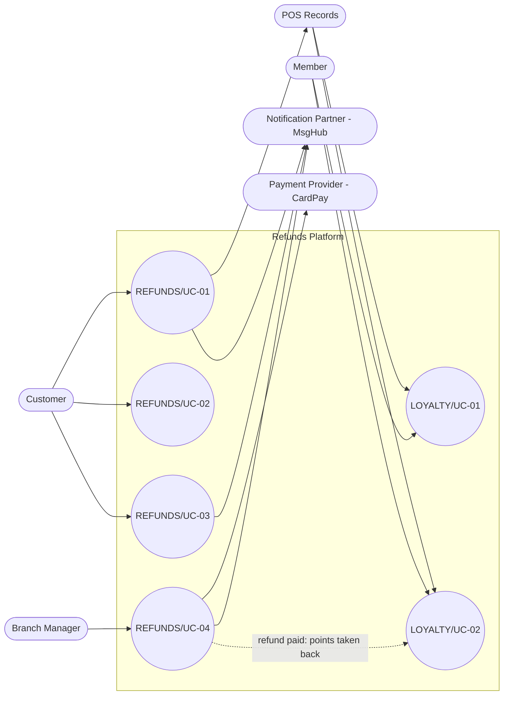

<!--
CHUNK: 03
TITLE: System Users & Use Cases
PROJECT: Refunds Platform
VERSION: 1.0
DEPENDS_ON: 01 (§7.3 also reads 05, 09, 10, 11, and 13x)
PART OF: SDD - Refunds Platform
-->

# 7. System Users & Use Cases

## 7.1 Actors

Personas are owned by the BRDs: [REFUNDS 04 § Personas / Actors](../brd-refunds-portal/04-scope-and-personas.md#personas--actors) and [LOYALTY 04 § Personas / Actors](../brd-loyalty-points/04-scope-and-personas.md#personas--actors). REFUNDS Customer and LOYALTY Member are two roles, not one: a member is a customer who joined the loyalty program ([LOYALTY 02 § Glossary](../brd-loyalty-points/02-glossary-assumptions-facts.md#glossary)), so they are two actors that share one end-customer identity (§16.3, ADR-07).

| Actor | Type (Human / System) | Description | Primary Interface |
|-------|-----------------------|-------------|-------------------|
| Customer | Human | REFUNDS Customer: requests refunds and follows their own requests | Responsive web app (customer area) |
| Member | Human | LOYALTY Member: views their own points balance and history; the same person can also be a Customer | Responsive web app (member area) |
| Branch Manager | Human | REFUNDS Branch Manager: decides on their own branch's refund requests and reads the daily branch report | Web app (branch manager area) |
| Payment Provider (CardPay Ltd) | System | Receives payout requests and returns payout results (REFUNDS 08) | API-02, API-03 |
| Notification Partner (MsgHub) | System | Delivers customer email and SMS (REFUNDS 08) | API-04 |
| POS Records (Retail IT team) | System | Answers receipt lookups (REFUNDS 08) and delivers member purchases (LOYALTY 08) | API-01, API-06 |

## 7.2 Use Case Diagram

**Figure 1: Use Case Diagram**

**Summary:** Customers drive the three customer refund use cases and branch managers the decision use case, which reaches CardPay; members drive the two loyalty use cases, fed by POS Records purchases and by the points taken back when a refund is paid. The partial-refund use case is merged into the decision use case in its BRD and is not drawn (§7.3).

## 7.3 Use Case Traceability (BRD → SDD)

One row per use case of every source BRD, grouped by BRD in the order of the Source BRDs register (chunk 00 § Document Lineage). Every column is read from its home: Owner from 09, Entry points from the owner's List of APIs (13x), Flows from the 05 `Use cases:` lines, APIs from 11 §15.2, Events from the 10 §14.5 "when" citations.

| Use case (BRD) | Title | Owner (§17.X) | Entry points | Flows (§8.4 / §8.5) | APIs (§15) | Events (§14) | Status |
|----------------|-------|---------------|--------------|---------------------|------------|--------------|--------|
| **[Refunds Portal v1.0](../brd-refunds-portal/refunds-portal-brd-master.md) (REFUNDS)** | | | | | | | |
| [REFUNDS/UC-01](../brd-refunds-portal/06a-use-cases-customer.md#uc-01-request-a-refund) | Request a Refund | [refund-service](./13a-service-refund.md) | `GET /v1/receipts/{receiptNumber}/refundable-items`, `POST /v1/refund-requests` | [§8.4.1](./05-workflows-and-sequences.md#841-workflow-refund-request-lifecycle), [§8.5.1](./05-workflows-and-sequences.md#851-sequence-submit-a-refund-request) | API-01, API-04, API-05 | `REFUND_SUBMITTED` | Active |
| [REFUNDS/UC-02](../brd-refunds-portal/06a-use-cases-customer.md#uc-02-track-refund-status-web-and-mobile) | Track Refund Status (Web and Mobile) | [refund-service](./13a-service-refund.md) | `GET /v1/refund-requests`, `GET /v1/refund-requests/{refundId}` | [§8.5.3](./05-workflows-and-sequences.md#853-sequence-track-and-cancel-a-refund-request) | - | - | Active |
| [REFUNDS/UC-03](../brd-refunds-portal/06a-use-cases-customer.md#uc-03-cancel-a-refund-request) | Cancel a Refund Request | [refund-service](./13a-service-refund.md) | `POST /v1/refund-requests/{refundId}/cancellation` | [§8.4.1](./05-workflows-and-sequences.md#841-workflow-refund-request-lifecycle), [§8.5.3](./05-workflows-and-sequences.md#853-sequence-track-and-cancel-a-refund-request) | API-04, API-05 | `REFUND_CANCELLED` | Active |
| [REFUNDS/UC-04](../brd-refunds-portal/06b-use-cases-branch-manager.md#uc-04-approve--reject-refund) | Approve / Reject Refund | [refund-service](./13a-service-refund.md) | `GET /v1/branches/{branchId}/refund-requests`, `POST /v1/refund-requests/{refundId}/decision` | [§8.4.1](./05-workflows-and-sequences.md#841-workflow-refund-request-lifecycle), [§8.5.2](./05-workflows-and-sequences.md#852-sequence-refund-decision-and-payout) | API-02, API-03, API-04, API-05 | `REFUND_APPROVED`, `REFUND_REJECTED`, `REFUND_PAID`, `REFUND_PAYOUT_FAILED`, `PAYOUT_SUCCEEDED`, `PAYOUT_FAILED` | Active |
| [REFUNDS/UC-05](../brd-refunds-portal/05-user-journeys-overview.md#use-case-summary) | Issue Partial Refund | - | - | - | - | - | Merged into UC-04 |
| **[Loyalty Points v1.0](../brd-loyalty-points/loyalty-points-brd-master.md) (LOYALTY)** | | | | | | | |
| [LOYALTY/UC-01](../brd-loyalty-points/06a-use-cases-member.md#uc-01-view-points-balance) | View Points Balance | [loyalty-service](./13d-service-loyalty.md) | `GET /v1/members/me/points-balance` | [§8.4.2](./05-workflows-and-sequences.md#842-workflow-points-movements-and-member-views) | API-06 | - | Active |
| [LOYALTY/UC-02](../brd-loyalty-points/06a-use-cases-member.md#uc-02-view-points-history) | View Points History | [loyalty-service](./13d-service-loyalty.md) | `GET /v1/members/me/points-movements`, `GET /v1/members/me/points-movements/{movementId}` | [§8.4.1](./05-workflows-and-sequences.md#841-workflow-refund-request-lifecycle), [§8.4.2](./05-workflows-and-sequences.md#842-workflow-points-movements-and-member-views), [§8.5.2](./05-workflows-and-sequences.md#852-sequence-refund-decision-and-payout) | API-06 | - | Active |

<!-- MASTER: refunds-platform-sdd-master.md | PREV: 02-ecosystem-overview.md | NEXT: 04-architecture-style-and-diagrams.md -->
