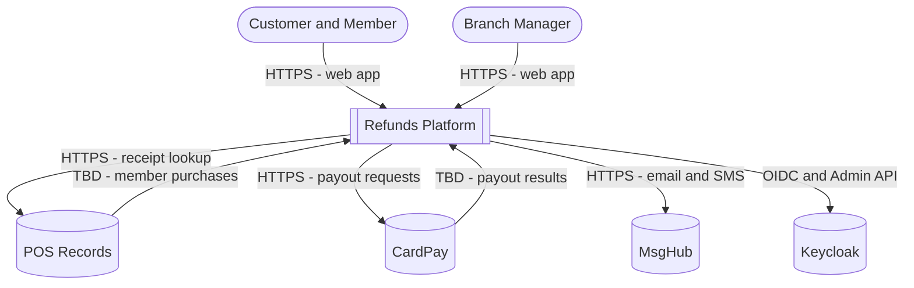
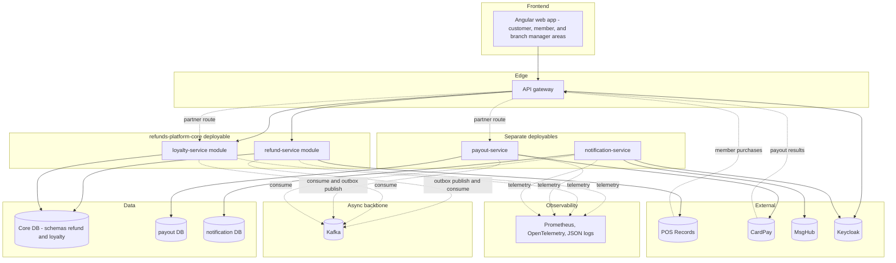

<!--
CHUNK: 04
TITLE: System Design - Architecture Style, Context & HLA Diagrams
PROJECT: Refunds Platform
VERSION: 1.0
DEPENDS_ON: 01, 02
PART OF: SDD - Refunds Platform
-->

# 8. System Design / High-Level Architecture

## 8.1 Architecture Style

### 8.1.1 What

A hybrid architecture (ADR-01). The core deployable `refunds-platform-core` is a modular monolith with two modules, refund-service and loyalty-service, each a DDD bounded context with a hexagonal structure and its own PostgreSQL schema. payout-service and notification-service are separate deployables with their own databases. The modules never call each other: every fact that leaves a module or service is published through a transactional outbox to Kafka and consumed with inbox deduplication, including the refund-to-points fact that loyalty-service consumes inside the same deployable. Synchronous REST is used only between the web app (through the API gateway) and the core, and between a deployable and an external provider.

### 8.1.2 Why

- **Stage and team:** a first production release (the paper process is replaced, [REFUNDS 01 § Executive Summary](../brd-refunds-portal/01-executive-summary-and-context.md#executive-summary); redemption is a later phase, [LOYALTY 04 § Out of Scope](../brd-loyalty-points/04-scope-and-personas.md#out-of-scope)) built by one delivery team (A-9) gains nothing from four release trains; a modular monolith keeps one deployable for the two business contexts.
- **Different failure needs at the provider edges:** payouts are retried within the ADR-10 retry window and must never be lost or paid twice ([REFUNDS/UC-04](../brd-refunds-portal/06b-use-cases-branch-manager.md#uc-04-approve--reject-refund) E1, REFUNDS/NFR-01), and customer messages fan out through MsgHub. Isolating them keeps a provider outage from exhausting threads or connections in the customer-facing core.
- **Moderate load with seasonal peaks:** about 1,200 requests a month with three-fold peaks for three weeks (REFUNDS 02 Facts, REFUNDS/NFR-03) are well within one deployable; the notification fan-out scales on its own.
- **Extraction-ready boundaries:** module schemas, ports, and broker-only communication let loyalty-service or refund-service become a service without a code change when an ADR-01 trigger fires.

### 8.1.3 How

- **Bounded contexts:** refund-service (module: refund requests, decisions, payout outcome tracking); loyalty-service (module: members, points movements, balances); payout-service (service: payouts and provider attempts); notification-service (service: customer messages).
- **Inter-service communication:** asynchronous events on Kafka between all four (§14); no synchronous call between modules or services. Synchronous HTTPS only for web app to core (via the API gateway) and for provider calls (§15, all external).
- **Data ownership:** core database with schemas `refund` and `loyalty` (no cross-schema reads or joins); payout-service database `payout`; notification-service database `notification`. Every table carries `tenant_id` (ADR-03).
- **Deployment model:** three container images and three Helm charts on on-premises Kubernetes: `refunds-platform-core`, `payout-service`, `notification-service` (§11.3).

## 8.2 Context Diagram

**Figure 2: System Context Diagram**

**Summary:** Customers, members, and branch managers use the platform through the web app. The platform looks up receipts in POS Records and receives member purchases from it, sends payouts to CardPay and receives their results, sends customer messages through MsgHub, and relies on Keycloak for sign-in and customer contact details; the transport of the two inbound flows is TBD until the provider documentation arrives (§15.6).

## 8.3 High-Level Architecture Diagram

**Figure 3: High-Level Architecture**

**Summary:** The web app reaches only the core through the API gateway; the core's two modules share a database server but not a schema. Kafka is the only link between modules and services, and each provider is called by exactly one module or service: POS Records by refund-service (lookup) and loyalty-service (purchases), CardPay by payout-service, MsgHub and the Keycloak Admin API by notification-service. Provider calls into the platform enter through the gateway's partner route (ADR-11).

<!-- MASTER: refunds-platform-sdd-master.md | PREV: 03-users-and-use-cases.md | NEXT: 05-workflows-and-sequences.md -->
