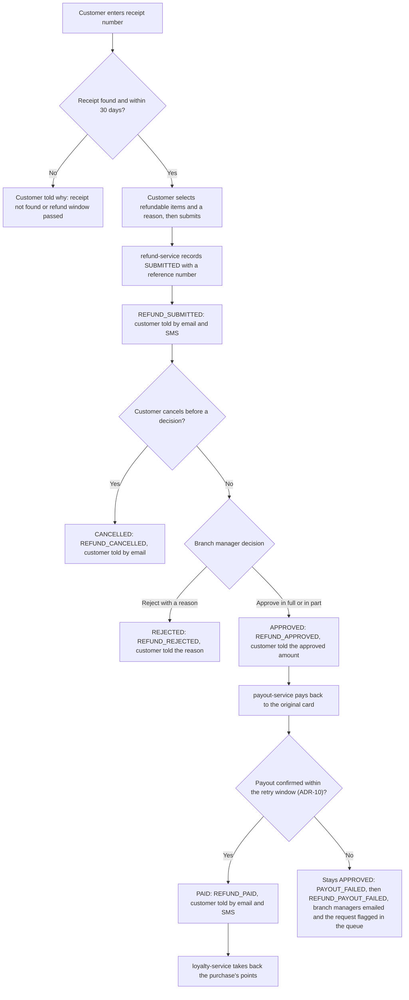
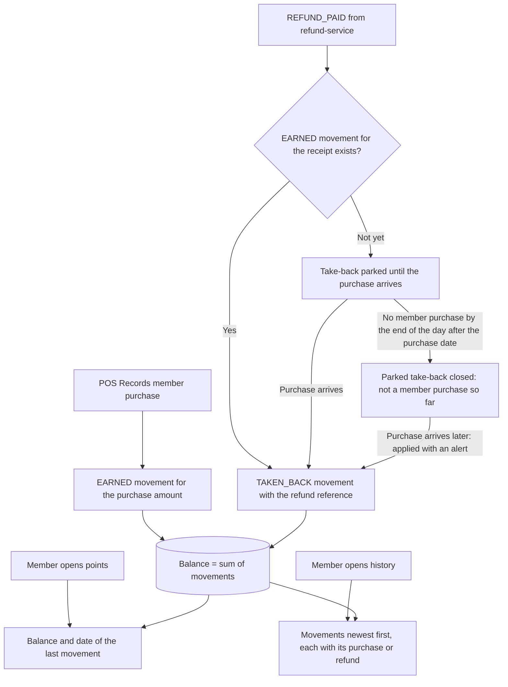
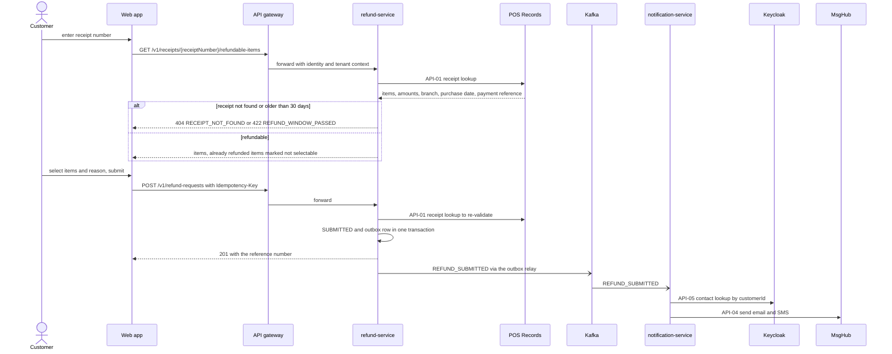
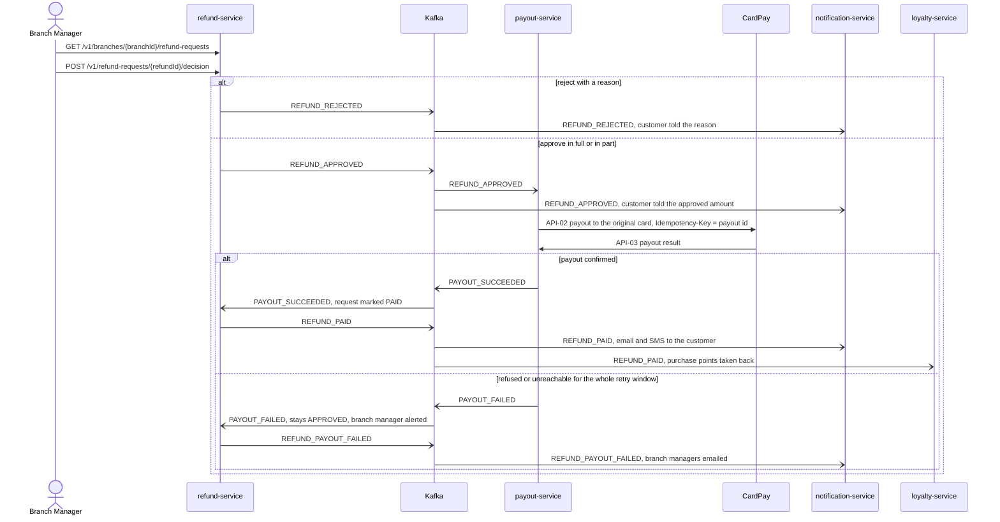
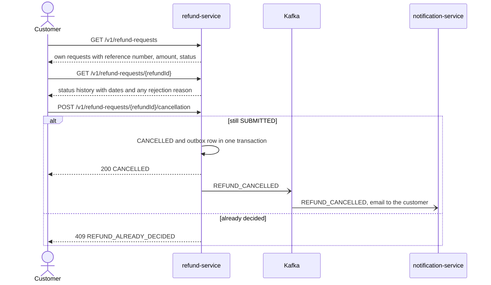

<!--
CHUNK: 05
TITLE: System Design - Workflow & Sequence Diagrams
PROJECT: Refunds Platform
VERSION: 1.0
DEPENDS_ON: 04
PART OF: SDD - Refunds Platform
-->

## 8.4 Workflow Diagrams

### 8.4.1 Workflow: Refund request lifecycle

**Use cases:** [REFUNDS/UC-01](../brd-refunds-portal/06a-use-cases-customer.md#uc-01-request-a-refund), [REFUNDS/UC-03](../brd-refunds-portal/06a-use-cases-customer.md#uc-03-cancel-a-refund-request), [REFUNDS/UC-04](../brd-refunds-portal/06b-use-cases-branch-manager.md#uc-04-approve--reject-refund), [LOYALTY/UC-02](../brd-loyalty-points/06a-use-cases-member.md#uc-02-view-points-history)

**Figure 4: Workflow - Refund request lifecycle**

**Summary:** A request moves from SUBMITTED to CANCELLED, REJECTED, or APPROVED, and the customer is told at each step, including the approved amount; an approved request becomes PAID when payout-service confirms the payout, which also triggers the customer message and the points take-back for the loyalty member. A payout that is still not confirmed at the end of its retry window (ADR-10) leaves the request APPROVED, flags it in the branch queue, and emails the branch's managers.

### 8.4.2 Workflow: Points movements and member views

**Use cases:** [LOYALTY/UC-01](../brd-loyalty-points/06a-use-cases-member.md#uc-01-view-points-balance), [LOYALTY/UC-02](../brd-loyalty-points/06a-use-cases-member.md#uc-02-view-points-history)

**Figure 5: Workflow - Points movements and member views**

**Summary:** Earn movements come from the POS Records member purchases and take-back movements from paid refunds; a take-back that arrives before its purchase is parked, then applied or closed, and a closed take-back is still applied, with an alert, if its purchase arrives later. The balance the member sees is the sum of the movements, and the history lists every movement with its purchase or refund reference.

## 8.5 Sequence Diagrams

### 8.5.1 Sequence: Submit a refund request

**Use cases:** [REFUNDS/UC-01](../brd-refunds-portal/06a-use-cases-customer.md#uc-01-request-a-refund)

**Figure 6: Sequence - Submit a refund request**

**Summary:** refund-service checks the receipt against POS Records twice, once to show the refundable items and once when the request is submitted, so amounts always come from the source. The request and its outbox row commit together, and notification-service turns the resulting event into an email and an SMS after resolving the contact details from Keycloak.

### 8.5.2 Sequence: Refund decision and payout

**Use cases:** [REFUNDS/UC-04](../brd-refunds-portal/06b-use-cases-branch-manager.md#uc-04-approve--reject-refund), [LOYALTY/UC-02](../brd-loyalty-points/06a-use-cases-member.md#uc-02-view-points-history)

**Figure 7: Sequence - Refund decision and payout**

**Summary:** The decision is the only synchronous step; everything after it is a choreographed chain of events in which each fact has one publisher. payout-service is the only caller of CardPay and re-publishes nothing about the refund itself: refund-service turns the payout outcome into `REFUND_PAID`, which drives both the customer message and the points take-back, or into `REFUND_PAYOUT_FAILED`, which emails the branch's managers (the API gateway hop is omitted for brevity).

### 8.5.3 Sequence: Track and cancel a refund request

**Use cases:** [REFUNDS/UC-02](../brd-refunds-portal/06a-use-cases-customer.md#uc-02-track-refund-status-web-and-mobile), [REFUNDS/UC-03](../brd-refunds-portal/06a-use-cases-customer.md#uc-03-cancel-a-refund-request)

**Figure 8: Sequence - Track and cancel a refund request**

**Summary:** Tracking is a read of the customer's own requests and their status history. Cancellation succeeds only while the request is SUBMITTED; optimistic locking makes a concurrent branch decision win cleanly, and the customer is told it can no longer be cancelled (the API gateway hop is omitted for brevity).

<!-- MASTER: refunds-platform-sdd-master.md | PREV: 04-architecture-style-and-diagrams.md | NEXT: 06-principles-and-decisions.md -->
