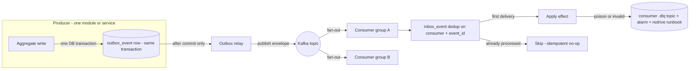
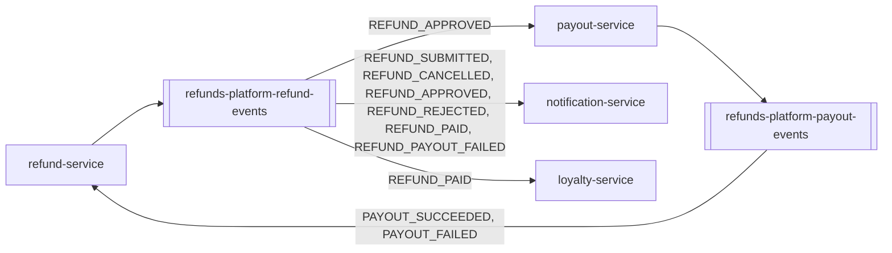

<!--
CHUNK: 10
TITLE: Centralized Event Hub (Platform Event Catalog & Payload Contracts)
PROJECT: Refunds Platform
VERSION: 1.0
DEPENDS_ON: 05, 07, 08, 09
RECONCILES_WITH: every per-service chunk (13a, 13b, 13c, 13d) - Event Model + Messaging Infra sub-sections
PART OF: SDD - Refunds Platform
PURPOSE: Single cross-service catalog of every platform event - name, producer, consumers, envelope, payload contract, business what/when/why - plus the centralized event-hub topology.
CONSISTENCY_RULE: This chunk is the platform contract registry. Topic names, event names, envelope fields, and payload contracts here MUST match the per-service chunks character-for-character. Consumer lists are reconciled from BOTH sides. Divergences are flagged in §14.8, never silently reconciled.
-->

# 14. Centralized Event Hub (Platform Event Catalog & Payload Contracts)

> **What this chunk is.** The one place that lists every event on the platform with its producer, consumers, key family, payload contract, and business meaning (what / when / why), plus the hub topology that carries them. It consolidates the Event Models of chunks 13a to 13d; implementers and the LLDs read it as the single event contract surface.

---

## 14.1 Purpose & Scope

Eventing posture: every state change that leaves a module or service travels as an asynchronous event on Kafka, published through a transactional outbox and consumed with inbox deduplication; synchronous calls are reserved for client requests and external providers (ADR-05). The four questions for the platform:

1. **What exists:** refund-service publishes the refund facts and payout-service the payout facts listed in §14.5; notification-service and loyalty-service publish nothing.
2. **Who produces and consumes:** §14.5, reconciled against the published and consumed tables of every `13x` chunk.
3. **What each carries:** the envelope (§14.3) plus the payload contract (§14.9).
4. **Why and when:** the "what · when · why" column of §14.5, citing the BRD use case step that fires each event.

Out of scope: in-process domain events that never leave a module; provider callbacks and feeds (CardPay payout results, POS member purchases), which are HTTP contracts in §15 and become platform events only after the owning service has applied them.

## 14.2 Hub Topology Decision

**Decision:** one Kafka cluster; one topic per producing bounded context (`refunds-platform-<context>-events`), keyed by `aggregate_id`; one consumer group per consuming module or service; one dead-letter topic per consumer (ADR-02).

What makes it *one hub* is the shared contract surface:

- **One envelope standard** (§14.3) on every event, on every topic.
- **One messaging pattern:** outbox -> relay -> topic -> consumer group -> inbox, in every publisher and consumer.
- **One schema registry:** JSON Schema subjects per event, additive-only, checked in CI (§6).
- **One event archive:** the topics' retention is the replay source. [NEEDS CLARIFICATION: long-term event archive destination beyond topic retention.]
- **One delivery semantic:** at-least-once delivery, exactly-once effect via `(consumer, event_id)` inbox dedup, per-aggregate ordering via `aggregate_version`.

| Dimension | Topic per producing context (chosen) | Topic per event type (rejected) |
|---|---|---|
| Access control | One write ACL per producer | One ACL per event, more to manage |
| Blast radius | A producer fault stays on its topic | Same, but spread over more topics |
| Archive / replay granularity | Replay a context's history in order per aggregate | Cross-event order per aggregate is lost |
| Ownership | Topic owner = the context owner | Ownership split per event |
| Cost / fan-out | Two topics; consumers filter by `event_type` | More topics and partitions for low volume |

### 14.2.1 Async Backbone (the universal per-event mechanism)

**Figure 9: Async backbone - outbox to inbox**

**Summary:** Every event is written to the producer's outbox in the same transaction as the state change, published by a relay after commit, and applied once per consumer through the inbox; anything a consumer cannot apply goes to that consumer's dead-letter topic.

### 14.2.2 Hub Topology & Fan-Out Landscape

**Figure 10: Hub topology and fan-out**

**Summary:** refund-service is the hub's centre: its topic feeds payout-service, notification-service, and loyalty-service, and it is the only consumer of the payout topic.

## 14.3 Standard Event Envelope (every event, every topic)

| Field | Type | Meaning |
|---|---|---|
| `event_id` | UUIDv7 | Globally unique; the inbox dedup key `(consumer, event_id)`. |
| `event_type` | string | SCREAMING_SNAKE_CASE past-tense fact (e.g., `REFUND_PAID`). |
| `schema_version` | semver | Schema version from the registry (additive-only). |
| `aggregate_id` | UUIDv7 | The producing aggregate instance: the refund id on the refund topic, the payout id on the payout topic. Also the Kafka record key. |
| `aggregate_type` | string | `RefundRequest` or `Payout`. |
| `aggregate_version` | int | Per-aggregate monotonic counter; the ordering guard. |
| `occurred_at` | timestamp (UTC) | When the fact happened. |
| `correlation_id` | UUIDv7 | Opaque request and trace correlation; no tenant data or PII. |
| `causation_id` | UUIDv7 (optional) | The event that caused this one (for example, `REFUND_PAID` carries the `event_id` of `PAYOUT_SUCCEEDED`). |
| `tenant_id` | UUIDv7 | Tenant key (ADR-03). |
| `payload{}` | JSON | Event-specific body; contract in §14.9. |

**Key-family variants:** one family, tenant-keyed domain events keyed by `aggregate_id`. No exceptions.

## 14.4 Topic Registry

| # | Topic | Owner (sole publisher) | Key family | Phase |
|---|---|---|---|---|
| 1 | `refunds-platform-refund-events` | refund-service | Tenant-keyed, key `aggregate_id` (refund id) | P1 |
| 2 | `refunds-platform-payout-events` | payout-service | Tenant-keyed, key `aggregate_id` (payout id) | P1 |

**No topic, no published events (consumers only):** notification-service, loyalty-service. The API gateway and the web app do not participate.

## 14.5 Platform Event Catalog

**Status legend:** `committed` / `candidate` / `Analytics-only` / `Pn` = phase.

### 14.5.1 refund-service - `refunds-platform-refund-events` (tenant-keyed; P1)

| Event | Consumers | Payload (beyond envelope) | Business: what · when · why | Status |
|---|---|---|---|---|
| `REFUND_SUBMITTED` | notification-service | `referenceNumber`, `customerId`, `branchId`, `receiptNumber`, `requestedAmount`, `submittedAt` | A refund request was recorded · [REFUNDS/UC-01](../brd-refunds-portal/06a-use-cases-customer.md#uc-01-request-a-refund) step 6 · the customer is told by email and SMS | committed |
| `REFUND_CANCELLED` | notification-service | `referenceNumber`, `customerId`, `branchId`, `cancelledAt` | The customer withdrew a SUBMITTED request · [REFUNDS/UC-03](../brd-refunds-portal/06a-use-cases-customer.md#uc-03-cancel-a-refund-request) step 5 · the customer is told by email | committed |
| `REFUND_APPROVED` | payout-service, notification-service | `referenceNumber`, `customerId`, `branchId`, `receiptNumber`, `originalPaymentRef`, `requestedAmount`, `approvedAmount`, `partial`, `decisionReason`, `approvedAt` | The branch manager approved in full or in part · [REFUNDS/UC-04](../brd-refunds-portal/06b-use-cases-branch-manager.md#uc-04-approve--reject-refund) step 6 (A1 for a partial amount) · payout-service pays the approved amount to the original card; the customer is told the approved amount ([REFUNDS 04 § Project Scope](../brd-refunds-portal/04-scope-and-personas.md#project-scope)) | committed |
| `REFUND_REJECTED` | notification-service | `referenceNumber`, `customerId`, `branchId`, `decisionReason`, `rejectedAt` | The branch manager rejected with a reason · [REFUNDS/UC-04](../brd-refunds-portal/06b-use-cases-branch-manager.md#uc-04-approve--reject-refund) A2 · the customer is told the reason | committed |
| `REFUND_PAID` | notification-service, loyalty-service | `referenceNumber`, `customerId`, `branchId`, `receiptNumber`, `purchaseDate`, `paidAmount`, `paidAt` | The payout of an approved refund is confirmed · [REFUNDS/UC-04](../brd-refunds-portal/06b-use-cases-branch-manager.md#uc-04-approve--reject-refund) step 7 · the customer is told by email and SMS; loyalty-service takes back the purchase's points ([LOYALTY/UC-02](../brd-loyalty-points/06a-use-cases-member.md#uc-02-view-points-history) BR-1) | committed |
| `REFUND_PAYOUT_FAILED` | notification-service | `referenceNumber`, `branchId`, `approvedAmount`, `attempts`, `failedAt` | The payout of an approved refund was not confirmed within the ADR-10 retry window · [REFUNDS/UC-04](../brd-refunds-portal/06b-use-cases-branch-manager.md#uc-04-approve--reject-refund) E1, when refund-service applies `PAYOUT_FAILED` · the branch's managers are told by email; the request stays APPROVED and flagged in the branch queue | committed |

### 14.5.2 payout-service - `refunds-platform-payout-events` (tenant-keyed; P1)

| Event | Consumers | Payload (beyond envelope) | Business: what · when · why | Status |
|---|---|---|---|---|
| `PAYOUT_SUCCEEDED` | refund-service | `refundId`, `paidAmount`, `providerPayoutRef`, `succeededAt` | CardPay confirmed the payout · [REFUNDS/UC-04](../brd-refunds-portal/06b-use-cases-branch-manager.md#uc-04-approve--reject-refund) step 7 · refund-service marks the request PAID | committed |
| `PAYOUT_FAILED` | refund-service | `refundId`, `amount`, `attempts`, `lastProviderCode`, `firstAttemptAt`, `failedAt` | The ADR-10 retry window closed without a confirmed payout · [REFUNDS/UC-04](../brd-refunds-portal/06b-use-cases-branch-manager.md#uc-04-approve--reject-refund) E1 · refund-service keeps the request APPROVED, flags it for the branch manager, and publishes `REFUND_PAYOUT_FAILED` | committed |

## 14.6 Cross-Cutting Event Guarantees

1. **Atomicity:** domain state and the outbox row commit in one transaction; the relay publishes only after commit (no dual-writes).
2. **Delivery:** at-least-once everywhere; consumers dedup on `(consumer, event_id)`.
3. **Ordering:** per aggregate: one active relay per publisher publishes in outbox order (§11.3) to a topic keyed by `aggregate_id`; refund-service and payout-service validate transitions with `aggregate_version`; notification-service skips a message whose `aggregate_version` is lower than one already sent for the same refund and channel (for example after a DLQ redrive). Not broker ordering across aggregates.
4. **Poison handling:** invalid transitions and undeserializable messages go to the consumer's dead-letter topic `<consumer>.dlq` (`refund-service.dlq`, `payout-service.dlq`, `notification-service.dlq`, `loyalty-service.dlq`) with an alarm and the §20.1.3 redrive; never silently dropped.
5. **Schema evolution:** additive-only, registry-enforced; a breaking change is a new event name.
6. **Replay:** from the topic (or the archive, once defined) into one consumer group, never republished to the topic.
7. **One payout per refund:** payout-service keys the payout on the refund id (unique), so a redelivered or replayed `REFUND_APPROVED` never pays twice (REFUNDS/NFR-01, ADR-10).
8. **No contact data on the bus:** events carry the pseudonymous `customerId` only (ADR-09).

## 14.7 Universal Subscribers & Cross-Service Doctrines

- **Universal subscribers:** none in this release; there is no analytics consumer.
- **Payout re-publication doctrine:** payout facts (`PAYOUT_SUCCEEDED`, `PAYOUT_FAILED`) are consumed only by refund-service, which re-publishes the refund-level facts (`REFUND_PAID` on success, `REFUND_PAYOUT_FAILED` when the retry window closes); notification-service and loyalty-service react to refund facts, never to payout facts.
- **Broker-only module doctrine:** loyalty-service consumes `REFUND_PAID` from Kafka even though it runs in the same deployable as refund-service, so either module can be extracted without a code change (ADR-01, ADR-05).

## 14.8 Consistency Notes & Open Flags

Full reconciliation achieved: every topic and event name in chunks 13a to 13d matches this chunk, every consumed event has exactly one producer, consumer lists agree from both sides, and every payload field a consumer relies on exists in §14.9. No open divergence.

| # | Where (chunks) | Divergence | Resolution / flag |
|---|---|---|---|
| - | - | None | - |

## 14.9 Payload Contract Samples

Type vocabulary per the registry: uuid, string, int, decimal(p,s), bool, timestamp (UTC ISO-8601), date (ISO-8601), enum{...}, ref(ValueObject). Required: R required, O optional, C conditional. The envelope is not repeated.

### 14.9.0 Common Value Objects

| Value object | Fields | Used by |
|---|---|---|
| `Money` | `amount decimal(19,4)`, `currency string(ISO-4217)` | `REFUND_SUBMITTED`, `REFUND_APPROVED`, `REFUND_PAID`, `REFUND_PAYOUT_FAILED`, `PAYOUT_SUCCEEDED`, `PAYOUT_FAILED` |

### 14.9.1 `REFUND_SUBMITTED` - committed

**Producer:** refund-service · **Topic:** `refunds-platform-refund-events` · **Key family:** tenant-keyed

| Field | Type | Required | Notes |
|---|---|---|---|
| `referenceNumber` | string | R | Reference shown to the customer |
| `customerId` | uuid | R | Keycloak subject; `pii` (pseudonymous); used by notification-service for the contact lookup |
| `branchId` | string | R | POS branch code |
| `receiptNumber` | string | R | Receipt of the purchase |
| `requestedAmount` | ref(Money) | R | Sum of the selected lines |
| `submittedAt` | timestamp | R | |

### 14.9.2 `REFUND_CANCELLED` - committed

**Producer:** refund-service · **Topic:** `refunds-platform-refund-events` · **Key family:** tenant-keyed

| Field | Type | Required | Notes |
|---|---|---|---|
| `referenceNumber` | string | R | |
| `customerId` | uuid | R | `pii` (pseudonymous) |
| `branchId` | string | R | |
| `cancelledAt` | timestamp | R | |

### 14.9.3 `REFUND_APPROVED` - committed

**Producer:** refund-service · **Topic:** `refunds-platform-refund-events` · **Key family:** tenant-keyed

| Field | Type | Required | Notes |
|---|---|---|---|
| `referenceNumber` | string | R | Sent to CardPay as the payout reference |
| `customerId` | uuid | R | `pii` (pseudonymous) |
| `branchId` | string | R | |
| `receiptNumber` | string | R | |
| `originalPaymentRef` | string | R | Reference of the original card payment (A-6); confidential, never logged |
| `requestedAmount` | ref(Money) | R | |
| `approvedAmount` | ref(Money) | R | Equals `requestedAmount` for a full approval |
| `partial` | bool | R | True when `approvedAmount` is below `requestedAmount` |
| `decisionReason` | string | C | Required when `partial` is true; `pii` (free text) |
| `approvedAt` | timestamp | R | |

### 14.9.4 `REFUND_REJECTED` - committed

**Producer:** refund-service · **Topic:** `refunds-platform-refund-events` · **Key family:** tenant-keyed

| Field | Type | Required | Notes |
|---|---|---|---|
| `referenceNumber` | string | R | |
| `customerId` | uuid | R | `pii` (pseudonymous) |
| `branchId` | string | R | |
| `decisionReason` | string | R | Shown to the customer; `pii` (free text) |
| `rejectedAt` | timestamp | R | |

### 14.9.5 `REFUND_PAID` - committed

**Producer:** refund-service · **Topic:** `refunds-platform-refund-events` · **Key family:** tenant-keyed

| Field | Type | Required | Notes |
|---|---|---|---|
| `referenceNumber` | string | R | Shown as the refund reference in the points history |
| `customerId` | uuid | R | `pii` (pseudonymous) |
| `branchId` | string | R | |
| `receiptNumber` | string | R | Matches the loyalty purchase reference (A-4) |
| `purchaseDate` | date | R | Bounds how long loyalty-service parks an unmatched take-back |
| `paidAmount` | ref(Money) | R | The amount paid back |
| `paidAt` | timestamp | R | Start of the LOYALTY/NFR-02 one-hour budget |

### 14.9.6 `PAYOUT_SUCCEEDED` - committed

**Producer:** payout-service · **Topic:** `refunds-platform-payout-events` · **Key family:** tenant-keyed

| Field | Type | Required | Notes |
|---|---|---|---|
| `refundId` | uuid | R | The refund the payout belongs to |
| `paidAmount` | ref(Money) | R | |
| `providerPayoutRef` | string | R | CardPay's reference; confidential |
| `succeededAt` | timestamp | R | |

### 14.9.7 `PAYOUT_FAILED` - committed

**Producer:** payout-service · **Topic:** `refunds-platform-payout-events` · **Key family:** tenant-keyed

| Field | Type | Required | Notes |
|---|---|---|---|
| `refundId` | uuid | R | |
| `amount` | ref(Money) | R | |
| `attempts` | int | R | Attempts made in the window |
| `lastProviderCode` | string | O | Last CardPay code, once the error mapping is known (API-02) |
| `firstAttemptAt` | timestamp | R | |
| `failedAt` | timestamp | R | |

### 14.9.8 `REFUND_PAYOUT_FAILED` - committed

**Producer:** refund-service · **Topic:** `refunds-platform-refund-events` · **Key family:** tenant-keyed

| Field | Type | Required | Notes |
|---|---|---|---|
| `referenceNumber` | string | R | Shown to the branch manager |
| `branchId` | string | R | Selects the managers to tell |
| `approvedAmount` | ref(Money) | R | The amount that could not be paid |
| `attempts` | int | R | From `PAYOUT_FAILED` |
| `failedAt` | timestamp | R | From `PAYOUT_FAILED` |

**Erasure-path mapping:** `customerId` and `decisionReason` live on retained topics; their erasure follows the retention decision flagged under Compliance in §17.1.

### 14.9.99 Coverage Matrix

| Event | Catalog (§14.5) | Contract (§14.9 / registry) | Status |
|---|---|---|---|
| `REFUND_SUBMITTED` | ✓ | §14.9.1 | committed |
| `REFUND_CANCELLED` | ✓ | §14.9.2 | committed |
| `REFUND_APPROVED` | ✓ | §14.9.3 | committed |
| `REFUND_REJECTED` | ✓ | §14.9.4 | committed |
| `REFUND_PAID` | ✓ | §14.9.5 | committed |
| `PAYOUT_SUCCEEDED` | ✓ | §14.9.6 | committed |
| `PAYOUT_FAILED` | ✓ | §14.9.7 | committed |
| `REFUND_PAYOUT_FAILED` | ✓ | §14.9.8 | committed |

<!-- MASTER: refunds-platform-sdd-master.md | PREV: 09-services-summary.md | NEXT: 11-api-contracts.md -->
