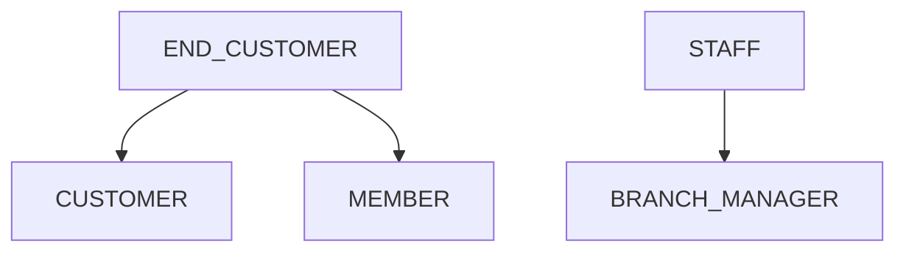
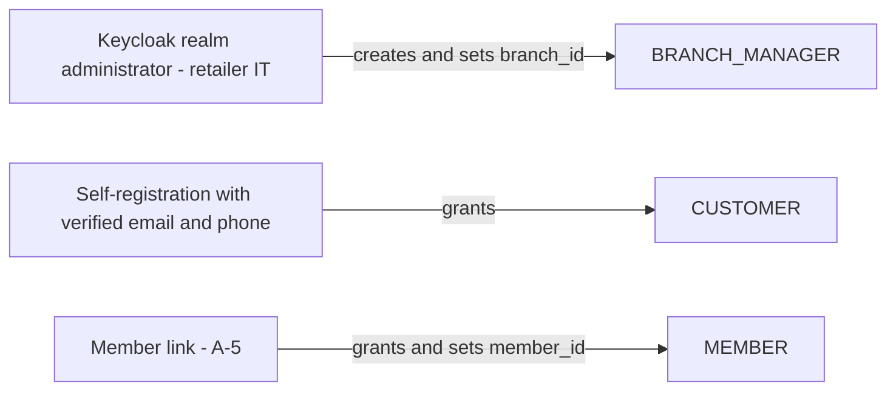
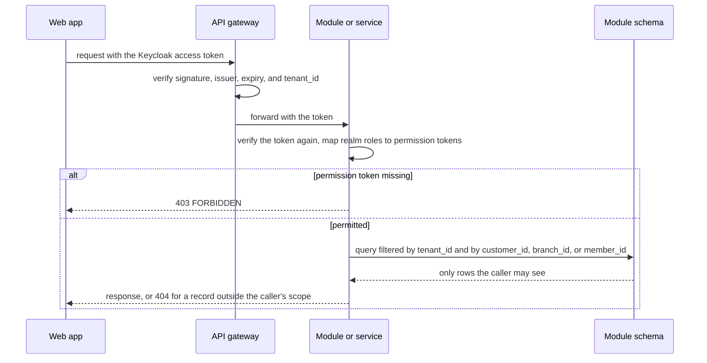

<!--
CHUNK: 12
TITLE: Centralized User Roles & Authorities (Platform-Wide)
PROJECT: Refunds Platform
VERSION: 1.0
DEPENDS_ON: 03, 07, 09 (+ per-service chunks 13a, 13b, 13c, 13d for per-service authorization notes)
PART OF: SDD - Refunds Platform
PURPOSE: Single platform-wide reference for user types, roles, and their authorities - who can do what, who can create whom, which services each role touches, and how a role resolves to an allowed action at request time. Consolidates the BRD Users & Use Cases Matrices and the per-service authorization notes.
CONSISTENCY_RULE: Role names, permission tokens, and per-service authorization notes in the 13x chunks MUST match this catalogue verbatim. Divergences are flagged in §16.12.3, never silently reconciled.
-->

# 16. Centralized User Roles & Authorities (Platform-Wide)

> **What this chunk is.** The one place that answers what user types exist, which roles they hold, what each role may do, who grants each role, and which services each role reaches. The identity and authorization implementation and the LLDs seed from it.

---

## 16.1 Business Overview

Two kinds of people use the platform. End customers buy in the retailer's branches: as customers they request and follow refunds ([REFUNDS 04 § Personas / Actors](../brd-refunds-portal/04-scope-and-personas.md#personas--actors)), and those who joined the loyalty program are also members who view their points ([LOYALTY 04 § Personas / Actors](../brd-loyalty-points/04-scope-and-personas.md#personas--actors)). Staff are branch managers who decide on their own branch's refunds. Customer and Member are two roles of one end-customer identity, so a person signs in once for both products (ADR-07).

All users live in the tenant of the retailer that operates the platform (A-3). There is no platform-operator role in the application; realm administration happens in the Keycloak admin console.

## 16.2 Resolution Model - How a Role Becomes an Allowed Action

1. **Identity:** the web app signs the user in with OIDC authorization code and PKCE; Keycloak issues an access token with realm roles and the `tenant_id`, `branch_id`, and `member_id` claims (ADR-07).
2. **Edge gate (API gateway):** signature, issuer, expiry, and a known `tenant_id`; rate limiting per user, with a dedicated limit on the receipt lookup (§17.1).
3. **Role to permission (module or service):** the token is verified again, and the realm roles map to the permission tokens of §16.11 through the module's versioned permission map; the endpoint's token (List of APIs, `Auth Scope`) must be present, otherwise 403.
4. **Contextual gates (module or service, application layer and repository):** own records (`customer_id` = token subject), own branch (`branch_id` claim = the record's branch), own points (`member_id` claim); every query also filters on `tenant_id`. A record outside the caller's scope is 404, except another branch's request, which is 403 ([REFUNDS/UC-04](../brd-refunds-portal/06b-use-cases-branch-manager.md#uc-04-approve--reject-refund) BR-1).

## 16.3 User Types (Tier 1)

| User type | Tenancy plane | Identity source | Description |
|---|---|---|---|
| `END_CUSTOMER` | End-customer | Keycloak realm, self-registration with verified email and phone | A person who buys in a branch; holds `CUSTOMER`, and `MEMBER` once linked to a loyalty member |
| `STAFF` | Tenant | Keycloak realm, accounts created by the retailer's IT administrators | A branch manager |

**Service identities:** each deployable has its own Keycloak client. No deployable calls another platform service, so none holds a §16 permission token; notification-service holds Keycloak's own user-read role for API-05 (customers, and the branch managers of a branch), which is the provider's scheme (§15.1).

## 16.4 Role Catalogue - Authorities & Related Services

### 16.4.1 END_CUSTOMER Roles

| Role | Scope | Core authorities | Related services |
|---|---|---|---|
| `CUSTOMER` | Own refund requests | Check a receipt, submit a refund request, list and read own requests, cancel an own SUBMITTED request | refund-service |
| `MEMBER` | Own points | Read own balance, read own movements | loyalty-service |

### 16.4.2 STAFF Roles

| Role | Scope | Core authorities | Related services |
|---|---|---|---|
| `BRANCH_MANAGER` | Own branch (`branch_id` claim) | Read the branch queue and the branch's requests, approve in full or in part, reject with a reason, read the daily branch refund report | refund-service |

### 16.4.3 Platform Plane (operator - outside tenant tenancy)

| Role | Scope | Core authorities | Related services |
|---|---|---|---|
| None in this release | - | Realm administration is done in the Keycloak admin console, not through an application role | - |

## 16.5 Capability Matrix (canonical)

| Capability | `CUSTOMER` | `MEMBER` | `BRANCH_MANAGER` |
|---|---|---|---|
| Check a receipt's refundable items | Yes | - | - |
| Submit a refund request | Yes | - | - |
| Track own refund requests | Yes¹ | - | - |
| Cancel an own SUBMITTED request | Yes¹ | - | - |
| Read the branch queue and a branch's request | - | - | Yes² |
| Approve or reject a refund | - | - | Yes² |
| Read the daily branch refund report | - | - | Yes² |
| View own points balance | - | Yes³ | - |
| View own points history | - | Yes³ | - |

¹ Own requests only (`customer_id` = token subject). ² Own branch only (`branch_id` claim). ³ Own points only (`member_id` claim).

## 16.6 Grant / Invitation Authority (who can create whom)

| Grantor role | May create / invite | Constraints |
|---|---|---|
| Keycloak realm administrator (retailer IT, outside the application) | `BRANCH_MANAGER` | Exactly one `branch_id` per manager; no BRD use case covers staff provisioning, so there is no in-app flow |
| Self-registration | `CUSTOMER` | Verified email and phone at registration (the phone is needed for SMS) |
| Member link (A-5) | `MEMBER` | Granted with the `member_id` attribute when the account is linked to a loyalty member number |

## 16.7 Role → Related-Services Matrix (platform-wide)

| Role | refund-service | payout-service | notification-service | loyalty-service |
|---|---|---|---|---|
| `CUSTOMER` | write | - | - | - |
| `MEMBER` | - | - | - | read |
| `BRANCH_MANAGER` | write | - | - | - |

## 16.8 Lifecycle, Scope & Revocation Rules

1. **Grant:** roles are granted as §16.6 states; no role is granted by another application user.
2. **Change:** a branch manager who moves branch gets a new `branch_id`; the change applies from the next token refresh, and the manager then sees only the new branch.
3. **Suspension and revocation:** disabling a Keycloak account stops access at the next token refresh. Work already committed stands: a decision already taken is paid out, and a disabled customer's SUBMITTED requests can still be decided and paid.
4. **Erasure:** deleting a customer's Keycloak account removes their contact details, so no further message can be sent (ADR-09); refund and loyalty records follow the retention decisions flagged in §17.1 and §17.4.

## 16.9 Diagrams

### 16.9.1 Role Taxonomy (user types → roles → sub-roles)

**Figure 11: Role taxonomy**

**Summary:** One end-customer identity can hold both customer roles; staff hold the branch manager role. There are no sub-roles.

### 16.9.2 Grant / Invitation Authority (who may create whom)

**Figure 12: Grant authority**

**Summary:** No application user grants another user a role: staff accounts come from realm administration, customer accounts from self-registration, and the member role from the member link.

### 16.9.3 Per-Request Authorization (how a role yields a decision)

**Figure 13: Per-request authorization**

**Summary:** The gateway authenticates and resolves the tenant; the module checks the permission token and applies the ownership gate in the query itself, so a caller can never read a row outside their scope.

## 16.10 Traceability

| Capability / rule | Source (BRD UC / matrix row / ADR / 13x chunk) |
|---|---|
| Check a receipt, submit a refund request | [REFUNDS/UC-01](../brd-refunds-portal/06a-use-cases-customer.md#uc-01-request-a-refund); matrix row in [REFUNDS 07](../brd-refunds-portal/07-users-use-cases-matrix.md#users--use-cases-matrix); 13a |
| Track own refund requests (own only) | [REFUNDS/UC-02](../brd-refunds-portal/06a-use-cases-customer.md#uc-02-track-refund-status-web-and-mobile) BR-1; matrix row in [REFUNDS 07](../brd-refunds-portal/07-users-use-cases-matrix.md#users--use-cases-matrix); REFUNDS/NFR-04; 13a |
| Cancel an own SUBMITTED request | [REFUNDS/UC-03](../brd-refunds-portal/06a-use-cases-customer.md#uc-03-cancel-a-refund-request) BR-1; matrix row in [REFUNDS 07](../brd-refunds-portal/07-users-use-cases-matrix.md#users--use-cases-matrix); 13a |
| Branch queue, approve or reject (own branch only) | [REFUNDS/UC-04](../brd-refunds-portal/06b-use-cases-branch-manager.md#uc-04-approve--reject-refund) BR-1; matrix row and footnote 1 in [REFUNDS 07](../brd-refunds-portal/07-users-use-cases-matrix.md#users--use-cases-matrix); 13a |
| Daily branch refund report | [REFUNDS 09 § Reporting / Analytics](../brd-refunds-portal/09-reporting-and-analytics.md#reporting--analytics) (audience: Branch Manager); 13a |
| View own points balance and history (own only) | [LOYALTY/UC-01](../brd-loyalty-points/06a-use-cases-member.md#uc-01-view-points-balance) BR-1, [LOYALTY/UC-02](../brd-loyalty-points/06a-use-cases-member.md#uc-02-view-points-history) BR-2; matrix rows and footnote (1) in [LOYALTY 07](../brd-loyalty-points/07-users-use-cases-matrix.md#users--use-cases-matrix); 13d |
| One identity for Customer and Member | ADR-07; [LOYALTY 02 § Glossary](../brd-loyalty-points/02-glossary-assumptions-facts.md#glossary) (a member is a customer who joined the program) |
| Enforcement model | ADR-08 |

## 16.11 Permission × Role Matrix (platform-wide)

| Permission token | `CUSTOMER` | `MEMBER` | `BRANCH_MANAGER` |
|---|---|---|---|
| `refund.receipt.read` | ✓ | - | - |
| `refund.request.create` | ✓ | - | - |
| `refund.request.read-own` | ✓¹ | - | - |
| `refund.request.cancel-own` | ✓¹ | - | - |
| `refund.request.read-branch` | - | - | ✓² |
| `refund.request.decide` | - | - | ✓² |
| `refund.report.read-branch` | - | - | ✓² |
| `loyalty.balance.read-own` | - | ✓³ | - |
| `loyalty.movement.read-own` | - | ✓³ | - |

Footnotes as in §16.5.

## 16.12 Implementation Seed & Reconciliation

### 16.12.1 Seed Strategy

Keycloak holds only the realm roles and the user attributes (`tenant_id`, `branch_id`, `member_id`), seeded by a versioned realm import in the deployment repository. The role-to-permission map lives in each module's configuration, versioned with its code; a change to a role's permissions is a code change reviewed against this chunk.

### 16.12.2 Per-Role Action Counts (drift baseline)

| Role | Seeded permission count |
|---|---|
| `CUSTOMER` | 4 |
| `MEMBER` | 2 |
| `BRANCH_MANAGER` | 3 |

### 16.12.3 Drift & Reconciliation Register

Every permission token in the `Auth Scope` columns of chunks 13a and 13d matches §16.11, and every BRD matrix cell has a capability row. No open divergence.

| # | Where | Divergence | Resolution / flag |
|---|---|---|---|
| - | - | None | - |

<!-- MASTER: refunds-platform-sdd-master.md | PREV: 11-api-contracts.md | NEXT: 13a-service-refund.md -->
