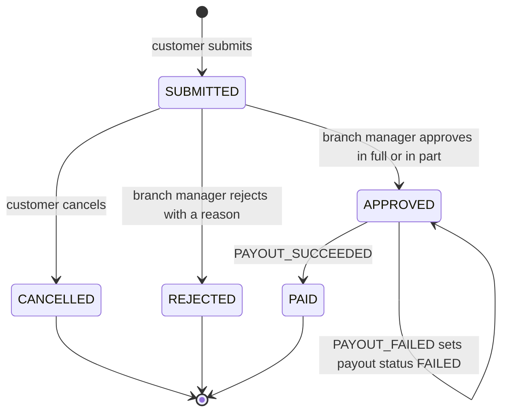
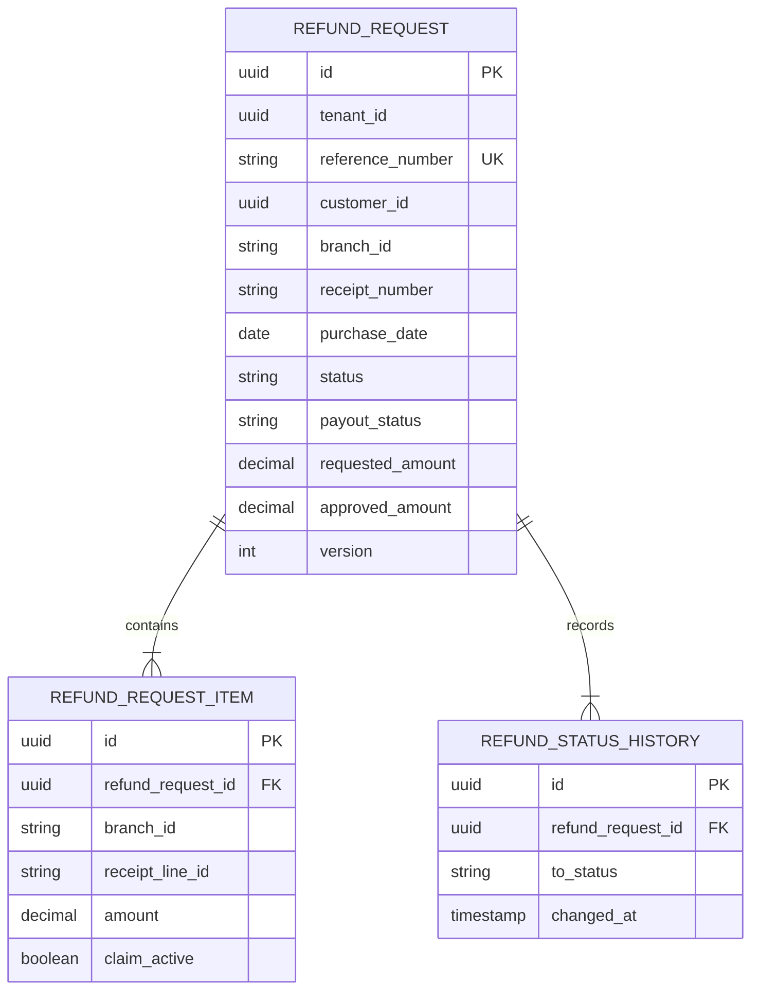
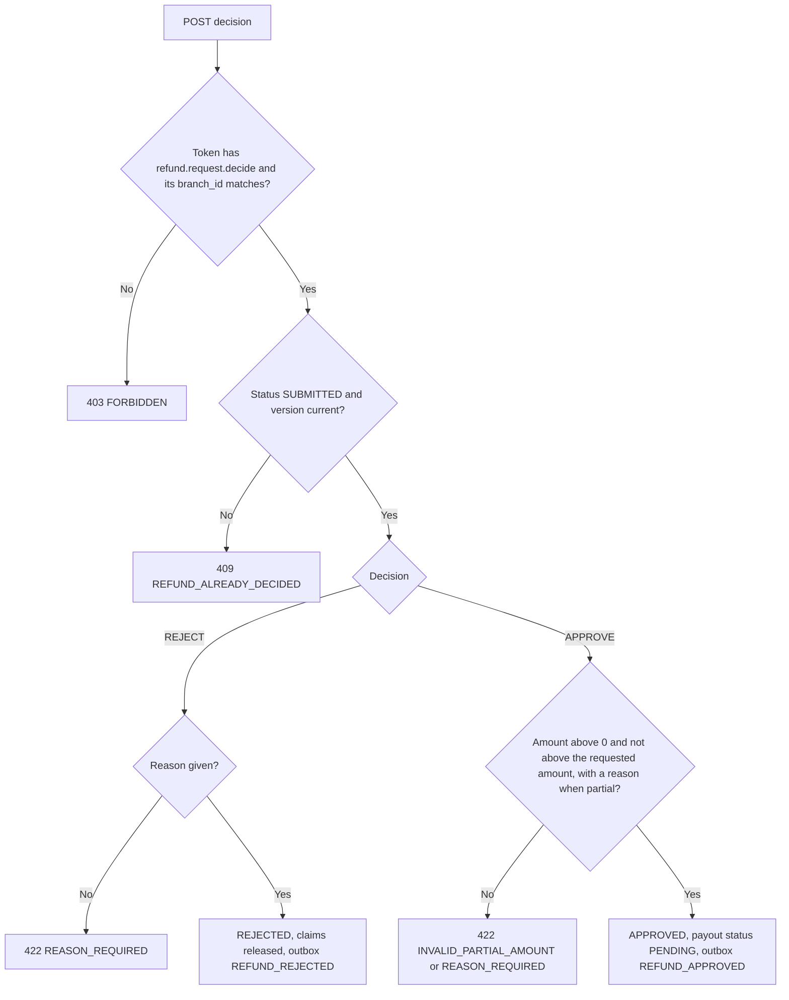

<!--
CHUNK: 13a
TITLE: Detailed Service Spec - refund-service
PROJECT: Refunds Platform
VERSION: 1.0
DEPENDS_ON: 09, 07, 10 (event hub - topic names, event names, and payload contracts match chunk 10 verbatim), 11 (API contracts - integration endpoints carry their API ID and match chunk 11 verbatim), 12 (roles - permission tokens match chunk 12 verbatim)
PART OF: SDD - Refunds Platform
-->

# 17. Detailed Service Specs

---

## 17.1 refund-service

### What

The refund request bounded context: receipt checks, refund requests and their items, cancellation, branch decisions, payout outcome tracking, and the daily branch refund report. A module of the core deployable `refunds-platform-core` (ADR-01), hexagonal inside: domain (aggregate and rules), application (commands, queries, ports), adapters (REST, PostgreSQL, Kafka, POS Records).

### Boundaries

- **Owns:** the `RefundRequest` aggregate (items, item claims, status history, decision, payout status), reference numbers, and the data behind the daily branch refund report.
- **Does not own:** payouts and CardPay attempts (payout-service), customer messages (notification-service), points (loyalty-service), receipts (POS Records), identities and contact details (Keycloak).
- **Upstream consumers:** the web app through the API gateway (customers and branch managers).
- **Downstream dependencies:** POS Records (API-01); Kafka (publishes refund events, consumes payout events).

### Input

| Type | Source | Description |
|------|--------|-------------|
| REST | Web app (customer) via the API gateway | Refundable items, submit, list own, detail, cancel |
| REST | Web app (branch manager) via the API gateway | Branch queue, request detail, decision, daily report |
| Event | payout-service: `PAYOUT_SUCCEEDED` on `refunds-platform-payout-events` | The payout for an approved request is confirmed |
| Event | payout-service: `PAYOUT_FAILED` on `refunds-platform-payout-events` | The payout's retry window (ADR-10) closed without success |
| External response | POS Records via API-01 | Receipt lines, amounts, branch, purchase date, original payment reference (A-6) |

### Business Logic

refund-service realises the four active REFUNDS use cases it owns (§13). Amounts always come from POS Records, never from the client, and every state change writes its status history row and its outbox row in the same transaction as the aggregate.

- **[REFUNDS/UC-01](../brd-refunds-portal/06a-use-cases-customer.md#uc-01-request-a-refund) steps 1-2, A1, E1, E2:** `GET /v1/receipts/{receiptNumber}/refundable-items` calls POS Records through the `ReceiptLookupPort` (API-01). An unknown receipt returns 404 `RECEIPT_NOT_FOUND` (E2). A purchase date more than 30 calendar days before today in the tenant's time zone (§6) returns 422 `REFUND_WINDOW_PASSED` (E1, BR-1). Lines holding an active item claim are returned with `refundable: false` (A1, BR-2). The response carries, per line, only the description, quantity, amount with currency, and the refundable flag, plus the branch name and purchase date; never the original payment reference or any member data.
- **[REFUNDS/UC-01](../brd-refunds-portal/06a-use-cases-customer.md#uc-01-request-a-refund) steps 3-6:** `POST /v1/refund-requests` (`Idempotency-Key` required) re-reads the receipt, re-applies BR-1 and BR-2, computes the requested amount as the sum of the selected lines (step 4), and in one transaction inserts the request (SUBMITTED, new reference number), its items with active claims, the first history row, and the `REFUND_SUBMITTED` outbox row (step 6). A partial unique index on active claims enforces BR-2 under concurrent submissions (409 `ITEM_ALREADY_REFUNDED`).
- **[REFUNDS/UC-02](../brd-refunds-portal/06a-use-cases-customer.md#uc-02-track-refund-status-web-and-mobile) steps 1-4, A1:** `GET /v1/refund-requests` lists the caller's own requests (filter `customer_id` = token subject, BR-1) with reference number, amount with currency, and status; an empty page is the A1 answer. `GET /v1/refund-requests/{refundId}` returns the status history with the date of each change and the rejection reason (step 4).
- **[REFUNDS/UC-03](../brd-refunds-portal/06a-use-cases-customer.md#uc-03-cancel-a-refund-request) steps 2-5, E1:** `POST /v1/refund-requests/{refundId}/cancellation` (`Idempotency-Key` required) moves SUBMITTED to CANCELLED (BR-1), releases the item claims, and writes `REFUND_CANCELLED` (step 5). The confirmation of step 3 is a web app dialog. The update carries the aggregate `version`; if a branch decision committed first, the call returns 409 `REFUND_ALREADY_DECIDED` (E1).
- **[REFUNDS/UC-04](../brd-refunds-portal/06b-use-cases-branch-manager.md#uc-04-approve--reject-refund) steps 1-2:** `GET /v1/branches/{branchId}/refund-requests` returns the SUBMITTED requests of the manager's own branch, oldest first, with amount and reason, followed by the APPROVED requests whose payout failed (E1). `branchId` must equal the token's `branch_id` claim (BR-1).
- **[REFUNDS/UC-04](../brd-refunds-portal/06b-use-cases-branch-manager.md#uc-04-approve--reject-refund) steps 3-6, A1, A2:** `POST /v1/refund-requests/{refundId}/decision` (`Idempotency-Key` required). APPROVE with `approvedAmount` equal to the requested amount is a full approval; a lower amount is a partial approval that needs a reason and must be above 0 and below the requested amount (A1, BR-2); the request becomes APPROVED with payout status PENDING and writes `REFUND_APPROVED` (step 6). REJECT needs a reason (A2, BR-3), releases the item claims, and writes `REFUND_REJECTED`. The confirmation of step 4 is a web app dialog showing the amount.
- **[REFUNDS/UC-04](../brd-refunds-portal/06b-use-cases-branch-manager.md#uc-04-approve--reject-refund) step 7:** on `PAYOUT_SUCCEEDED` the request moves APPROVED to PAID (payout status SUCCEEDED) and writes `REFUND_PAID`, which drives the customer message and the points take-back ([LOYALTY/UC-02](../brd-loyalty-points/06a-use-cases-member.md#uc-02-view-points-history) BR-1, realised by loyalty-service).
- **[REFUNDS/UC-04](../brd-refunds-portal/06b-use-cases-branch-manager.md#uc-04-approve--reject-refund) E1:** on `PAYOUT_FAILED` the request stays APPROVED, its payout status becomes FAILED, and it is listed, flagged, in the branch queue; refund-service writes `REFUND_PAYOUT_FAILED` in the same transaction, which tells the branch's managers by email; the flag in the branch queue stays. Retrying within the ADR-10 retry window is payout-service's job.
- **Daily branch refund report ([REFUNDS 09 § Reporting / Analytics](../brd-refunds-portal/09-reporting-and-analytics.md#reporting--analytics)):** `GET /v1/branches/{branchId}/refund-report` computes, for one calendar day in the tenant's time zone (§6), the requests per status, the amounts paid, and the average time from submission to decision, from this module's own tables.
- **Payout watchdog (REFUNDS/NFR-01):** a daily job flags APPROVED requests whose payout status is still PENDING when the ADR-10 retry window plus 1 hour has passed since `decided_at`.

**State machine:**

**Figure 14: refund-service - Refund request state machine**

**Summary:** SUBMITTED is the only state a customer or branch manager can change; APPROVED waits for the payout outcome, and a failed payout keeps the request APPROVED with a FAILED payout status for the branch manager to see. CANCELLED, REJECTED, and PAID are final.

### Output

| Type | Destination | Description |
|------|-------------|-------------|
| REST response | Web app | Refundable items, requests, history, decisions, daily report |
| Event | `refunds-platform-refund-events` | `REFUND_SUBMITTED`, `REFUND_CANCELLED`, `REFUND_APPROVED`, `REFUND_REJECTED`, `REFUND_PAID`, `REFUND_PAYOUT_FAILED` (§14.5.1) |

### Integrations

| Integration | Direction | Protocol | Purpose | Contract | Failure Handling |
|-------------|-----------|----------|---------|----------|------------------|
| POS Records | Outbound, sync | HTTPS | Receipt lookup ([REFUNDS/UC-01](../brd-refunds-portal/06a-use-cases-customer.md#uc-01-request-a-refund) steps 2 and 5) | API-01 (§15) | Timeout, retries, and circuit breaker per §12 INT-03; 503 `RECEIPT_LOOKUP_UNAVAILABLE` to the customer |
| Kafka | Outbound, async | Kafka | Refund facts | `REFUND_SUBMITTED`, `REFUND_CANCELLED`, `REFUND_APPROVED`, `REFUND_REJECTED`, `REFUND_PAID`, `REFUND_PAYOUT_FAILED` (§14) | Outbox relay retries until the broker acknowledges |
| Kafka | Inbound, async | Kafka | Payout outcomes | `PAYOUT_SUCCEEDED`, `PAYOUT_FAILED` (§14) | Inbox dedup; invalid transition to `refund-service.dlq` with an alarm |

### DB Modeling

#### Entity Relationship

**Figure 15: refund-service - Entity relationship**

**Summary:** A refund request owns its items and its status history; item claims live on the item rows. `outbox_event` and `inbox_event` follow the §11.1 standard and are not drawn.

#### Tables Design

| Table | Column | Type | Constraints | Notes |
|-------|--------|------|-------------|-------|
| `refund_request` | `id` | uuid | PK | UUIDv7; the `aggregate_id` of refund events |
| `refund_request` | `reference_number` | varchar(20) | NOT NULL; UNIQUE (`tenant_id`, `reference_number`) | Human-readable, shown to the customer |
| `refund_request` | `customer_id` | uuid | NOT NULL; INDEX (`tenant_id`, `customer_id`, `submitted_at`) | Keycloak subject of the customer |
| `refund_request` | `branch_id` | varchar(20) | NOT NULL; INDEX (`tenant_id`, `branch_id`, `status`, `submitted_at`) | POS branch code |
| `refund_request` | `receipt_number`, `purchase_date` | varchar(40), date | NOT NULL | From POS Records |
| `refund_request` | `original_payment_ref` | varchar(100) | NOT NULL | From POS Records (A-6); confidential |
| `refund_request` | `currency`, `requested_amount`, `approved_amount` | char(3), numeric(19,4), numeric(19,4) | requested > 0; approved NULL or (> 0 and <= requested) | Approved is set on APPROVE |
| `refund_request` | `status` | varchar(20) | CHECK in (SUBMITTED, APPROVED, REJECTED, PAID, CANCELLED) | State machine above |
| `refund_request` | `payout_status` | varchar(20) | CHECK in (NONE, PENDING, FAILED, SUCCEEDED) | FAILED drives the branch alert |
| `refund_request` | `reason`, `decision_reason` | varchar(500) | `reason` NOT NULL; `decision_reason` required for REJECTED and partial approval | Free text |
| `refund_request` | `submitted_at`, `decided_at`, `decided_by`, `paid_at`, `cancelled_at`, `version` | timestamptz, uuid, int | `version` NOT NULL | Optimistic locking on `version` |
| `refund_request_item` | `branch_id`, `receipt_number`, `receipt_line_id`, `claim_active` | varchar(20), varchar(40), varchar(40), boolean | `branch_id` NOT NULL (copied from the request); UNIQUE (`tenant_id`, `branch_id`, `receipt_number`, `receipt_line_id`) WHERE `claim_active` | Enforces [REFUNDS/UC-01](../brd-refunds-portal/06a-use-cases-customer.md#uc-01-request-a-refund) BR-2; claims released on CANCELLED and REJECTED |
| `refund_request_item` | `description`, `quantity`, `amount` | varchar(200), int, numeric(19,4) | NOT NULL | Copied from POS Records at submission |
| `refund_status_history` | `from_status`, `to_status`, `changed_at`, `changed_by`, `reason` | varchar(20), varchar(20), timestamptz, uuid, varchar(500) | INDEX (`tenant_id`, `refund_request_id`, `changed_at`) | Feeds [REFUNDS/UC-02](../brd-refunds-portal/06a-use-cases-customer.md#uc-02-track-refund-status-web-and-mobile) step 4 |

Every table also carries the §11.1 auditing columns.

#### Migration Strategy

- **Tool:** Flyway, versioned SQL, history for schema `refund`.
- **Backward compatibility:** expand-contract; a release never drops or renames a column the running version reads.
- **Data backfill:** in a separate versioned migration after the expand step, in batches.
- **Rollback:** forward-fix migrations; application rollback is safe because every migration is backward compatible.

#### Retention Policy

- `refund_request`, `refund_request_item`, `refund_status_history`: kept per the retention decision under Compliance below.
- `outbox_event`: deleted by the relay once the broker acknowledges the publish.
- `inbox_event`: kept at least as long as the topic retention of the consumed topic (§6).

#### Archival

- **Cold storage:** none in this release (§6 Object Storage: not applicable); archival follows the retention decision under Compliance.
- **Format / Schedule / Restore SLA:** set with that decision.

#### Data Encryption

- **At rest:** per the platform default (§11.6).
- **In transit:** TLS to PostgreSQL, Kafka, and POS Records (§11.6).
- **Key management:** per §11.6.
- **PII columns:** `customer_id` (pseudonymous), `reason` and `decision_reason` (free text), `original_payment_ref` (confidential); masked in non-production copies.

### Multi-Tenancy Specifications

- **Strategy override:** none (shared schema with `tenant_id`, ADR-03).
- **Tenant filter:** repository base class; every index starts with `tenant_id`.
- **Cross-tenant queries:** forbidden; the daily report is per tenant and branch.

### API Standards

- **Style:** REST with JSON, contract-first OpenAPI (ADR-04).
- **Versioning:** URI prefix `/v1`.
- **Authentication:** Keycloak JWT, validated at the gateway and again in the core (ADR-07).
- **Idempotency:** `Idempotency-Key` required on `POST /v1/refund-requests`, `POST /v1/refund-requests/{refundId}/cancellation`, and `POST /v1/refund-requests/{refundId}/decision`, scoped to the caller and the operation; replay and in-flight handling per the §11.1 idempotency records.
- **Pagination:** cursor-based (`cursor`, `limit`) on list endpoints.
- **Error envelope:** Problem Details per §15.1, with a plain-language `detail`.

#### List of APIs (Swagger-friendly)

All endpoints are client-facing (web app only), so none has an integration contract in §15.

| Method | Path | Summary | Request Body | Response | Auth Scope | API ID (§15) |
|--------|------|---------|--------------|----------|------------|--------------|
| GET | `/v1/receipts/{receiptNumber}/refundable-items` | Receipt lines with amounts and a refundable flag | - | `RefundableItems` | `refund.receipt.read` | - |
| POST | `/v1/refund-requests` | Submit a refund request | `CreateRefundRequest` (`receiptNumber`, `lineIds[]`, `reason`) | `RefundRequest` (201) | `refund.request.create` | - |
| GET | `/v1/refund-requests` | List the caller's own refund requests | - | `RefundRequestPage` | `refund.request.read-own` | - |
| GET | `/v1/refund-requests/{refundId}` | Request detail with status history | - | `RefundRequestDetail` | `refund.request.read-own` or `refund.request.read-branch` | - |
| POST | `/v1/refund-requests/{refundId}/cancellation` | Cancel a SUBMITTED request | - | `RefundRequest` | `refund.request.cancel-own` | - |
| GET | `/v1/branches/{branchId}/refund-requests` | Branch queue: SUBMITTED oldest first, then failed payouts | - | `RefundRequestPage` | `refund.request.read-branch` | - |
| POST | `/v1/refund-requests/{refundId}/decision` | Approve in full or in part, or reject | `RefundDecision` (`decision`, `approvedAmount`, `reason`) | `RefundRequest` | `refund.request.decide` | - |
| GET | `/v1/branches/{branchId}/refund-report` | Daily branch refund report (`date` query parameter) | - | `BranchRefundReport` | `refund.report.read-branch` | - |

### Event-Driven Architecture (If Applicable)

#### Event Model

**Published events:**

| Event Name | Producer | Producer Specs | Consumers | Consumer Specs | Schema (Summary) | Delivery Guarantee |
|------------|----------|----------------|-----------|----------------|------------------|---------------------|
| `REFUND_SUBMITTED` | refund-service | `refunds-platform-refund-events`, key `aggregate_id` | notification-service | group `notification-service`, inbox dedup | `referenceNumber`, `customerId`, `branchId`, `receiptNumber`, `requestedAmount`, `submittedAt` (§14.9.1) | At-least-once, exactly-once effect |
| `REFUND_CANCELLED` | refund-service | `refunds-platform-refund-events`, key `aggregate_id` | notification-service | group `notification-service`, inbox dedup | `referenceNumber`, `customerId`, `branchId`, `cancelledAt` (§14.9.2) | At-least-once, exactly-once effect |
| `REFUND_APPROVED` | refund-service | `refunds-platform-refund-events`, key `aggregate_id` | payout-service, notification-service | groups `payout-service` (inbox dedup plus unique `refund_id`) and `notification-service` (inbox dedup) | `referenceNumber`, `customerId`, `branchId`, `receiptNumber`, `originalPaymentRef`, `requestedAmount`, `approvedAmount`, `partial`, `decisionReason`, `approvedAt` (§14.9.3) | At-least-once, exactly-once effect |
| `REFUND_REJECTED` | refund-service | `refunds-platform-refund-events`, key `aggregate_id` | notification-service | group `notification-service`, inbox dedup | `referenceNumber`, `customerId`, `branchId`, `decisionReason`, `rejectedAt` (§14.9.4) | At-least-once, exactly-once effect |
| `REFUND_PAID` | refund-service | `refunds-platform-refund-events`, key `aggregate_id` | notification-service, loyalty-service | groups `notification-service` and `loyalty-service`, inbox dedup | `referenceNumber`, `customerId`, `branchId`, `receiptNumber`, `purchaseDate`, `paidAmount`, `paidAt` (§14.9.5) | At-least-once, exactly-once effect |
| `REFUND_PAYOUT_FAILED` | refund-service | `refunds-platform-refund-events`, key `aggregate_id` | notification-service | group `notification-service`, inbox dedup | `referenceNumber`, `branchId`, `approvedAmount`, `attempts`, `failedAt` (§14.9.8) | At-least-once, exactly-once effect |

**Consumed events:**

| Event Name | Producer (owning service) | Topic | Effect in this service | Idempotency / ordering |
|------------|---------------------------|-------|------------------------|------------------------|
| `PAYOUT_SUCCEEDED` | payout-service | `refunds-platform-payout-events` | APPROVED to PAID, payout status SUCCEEDED, writes `REFUND_PAID` (uses `refundId`, `paidAmount`) | Inbox on (`refund-service`, `event_id`); a request not in APPROVED goes to the DLQ |
| `PAYOUT_FAILED` | payout-service | `refunds-platform-payout-events` | Payout status FAILED; request flagged in the branch queue (uses `refundId`) | Inbox on (`refund-service`, `event_id`); ignored if the request is already PAID |

#### Messaging Infra

- **Broker:** Kafka (ADR-02).
- **Schema registry:** per §6 (JSON Schema, additive-only).
- **Serialization:** JSON.
- **Topic strategy:** one topic per producing context, keyed by `aggregate_id` (§14.2).
- **Retention:** platform topic defaults (§6).
- **DLQ strategy:** `refund-service.dlq` for consumed payout events; alarm on depth above zero; redrive per §20.1.3.

### Constraints

- A refund can be requested only within 30 days of purchase, and an item only once ([REFUNDS/UC-01](../brd-refunds-portal/06a-use-cases-customer.md#uc-01-request-a-refund) BR-1, BR-2).
- Customers see and cancel only their own requests; only SUBMITTED requests can be cancelled ([REFUNDS/UC-02](../brd-refunds-portal/06a-use-cases-customer.md#uc-02-track-refund-status-web-and-mobile) BR-1, [REFUNDS/UC-03](../brd-refunds-portal/06a-use-cases-customer.md#uc-03-cancel-a-refund-request) BR-1).
- Branch managers decide only on their own branch's requests; a partial amount is above 0 and below the requested amount; a rejection always has a reason ([REFUNDS/UC-04](../brd-refunds-portal/06b-use-cases-branch-manager.md#uc-04-approve--reject-refund) BR-1 to BR-3).
- Only the customer and their branch's manager can read a request (REFUNDS/NFR-04; §16).
- Payouts go only to the card used for the purchase (REFUNDS 02 Assumption 2): the approved event carries the original payment reference and nothing the client supplied.
- A customer can look up at most 10 receipts per rolling hour (429 `RATE_LIMITED`, enforced at the API gateway on this route); an alert fires when one customer receives more than 20 `RECEIPT_NOT_FOUND` answers in a day.

### Error Handling

- **Synchronous APIs:** Problem Details (§15.1); the `detail` says what went wrong and what the user can do next.
- **Validation errors:** 400 `VALIDATION_FAILED` with `errors[]` per field.
- **Domain errors:**
  - [REFUNDS/UC-01](../brd-refunds-portal/06a-use-cases-customer.md#uc-01-request-a-refund) E2 -> 404 `RECEIPT_NOT_FOUND` (check the number and try again).
  - [REFUNDS/UC-01](../brd-refunds-portal/06a-use-cases-customer.md#uc-01-request-a-refund) E1 -> 422 `REFUND_WINDOW_PASSED` (older than 30 days; the branch can help).
  - [REFUNDS/UC-01](../brd-refunds-portal/06a-use-cases-customer.md#uc-01-request-a-refund) A1 at submission -> 409 `ITEM_ALREADY_REFUNDED`.
  - [REFUNDS/UC-03](../brd-refunds-portal/06a-use-cases-customer.md#uc-03-cancel-a-refund-request) E1 -> 409 `REFUND_ALREADY_DECIDED`.
  - [REFUNDS/UC-04](../brd-refunds-portal/06b-use-cases-branch-manager.md#uc-04-approve--reject-refund) A1, BR-2 -> 422 `INVALID_PARTIAL_AMOUNT`; A2, BR-3, or a partial approval without a reason -> 422 `REASON_REQUIRED`; a decision on a request that is no longer SUBMITTED -> 409 `REFUND_ALREADY_DECIDED`.
  - POS Records unavailable -> 503 `RECEIPT_LOOKUP_UNAVAILABLE` (try again later).
  - A repeat of a request still being processed -> 409 `REQUEST_IN_PROGRESS` (retry after `Retry-After`; the web app retries without showing an error).
- **Auth errors:** 401 `UNAUTHENTICATED`; 403 `FORBIDDEN` for a missing permission token or another branch's request ([REFUNDS/UC-04](../brd-refunds-portal/06b-use-cases-branch-manager.md#uc-04-approve--reject-refund) BR-1); another customer's request returns 404 `NOT_FOUND`, so its existence is not revealed.
- **Server errors:** 500 `INTERNAL_ERROR`, no internals in the body.
- **Async consumers:** inbox dedup; a payout event for an unknown refund or an invalid transition is dead-lettered with an alarm, never dropped.
- **Poison messages:** `refund-service.dlq`, redrive per §20.1.3.

### Observability & Monitoring

#### Logging

- JSON per §11.4, with `module=refund-service`.
- Mandatory fields: `trace_id`, `correlation_id`, `refund_id`, `event`; never the customer id, reasons, or payment reference at INFO.
- Retention per §6 logging row.

#### Metrics

| Metric | Type | Labels | Purpose |
|--------|------|--------|---------|
| `refund_requests_submitted_total` | counter | - | Submission rate, seasonal peaks (REFUNDS/NFR-03) |
| `refund_decisions_total` | counter | `decision` | Approvals versus rejections |
| `refund_time_to_decision_seconds` | histogram | - | Submission to decision: the "average time to decision" of the daily branch refund report (REFUNDS 09) |
| `refund_time_to_paid_seconds` | histogram | - | Submission to PAID, observed on APPROVED to PAID: REFUNDS Business Objective 1 (average of 3 days or less) |
| `refund_payout_failed_open` | gauge | - | Approved requests with a failed payout; alert above zero |
| `refund_payout_outcome_overdue` | gauge | - | APPROVED requests with no payout outcome after the window; alert above zero |
| `refund_receipt_lookup_duration_seconds` | histogram | `outcome` | API-01 latency and errors |

#### Tracing

- OpenTelemetry auto-instrumentation for HTTP, JDBC, and Kafka.
- Trace context propagated from the gateway and into outbox events (record headers).
- Sampling per §11.4.

### Developer Notes

- **Recommended patterns:** state machine in the domain aggregate; command handlers per use case step; outbox row written by the same repository transaction; POS access only through `ReceiptLookupPort`.
- **Avoid:** calling loyalty-service classes or tables; trusting amounts or line ids from the client without the POS re-read; publishing to Kafka directly from a handler.
- **Testing:** unit tests for every rule and transition (`decide_partialAmountEqualToRequested_throwsInvalidPartialAmount`); Testcontainers integration tests with PostgreSQL and Kafka; a stubbed POS adapter for contract tests until API-01 is defined.

### Service-Level Diagrams

#### Implementation Flow Chart

**Figure 16: refund-service - Decision command handling**

**Summary:** The decision command checks the permission and the branch first, then the state and version, then the business rules of the chosen decision; each successful path commits the state change and its outbox row together.

#### Sequence Diagram (Service-Internal)

Not repeated here: §8.5.1 to §8.5.3 (chunk 05) show this service's interactions.

### Compliance

- **GDPR:** personal data is the customer id, the free-text reasons, and the purchase lines. [NEEDS CLARIFICATION: lawful basis, retention period, and erasure rule for refund records; financial record-keeping duties may override erasure.]
- **PCI-DSS:** no card number is stored or processed; `original_payment_ref` is a provider transaction reference, so the module is outside the cardholder-data scope.
- **ISO 27001 / SOC 2:** access logging and reviewed configuration changes (§11.5); no additional control specific to this module.
- **Local regulations:** none identified in the BRDs.

### Deployment Strategy

- **Service-specific override:** none; deployed inside `refunds-platform-core`.
- **Replicas:** per the core deployable defaults (§11.3).
- **Strategy:** rolling (§11.3).
- **Health checks:** liveness and readiness probes; readiness checks the database only (§11.3).
- **Rollback:** Helm rollback of the core chart; migrations are backward compatible.

### Future Enhancements

- Bulk approval of small refunds ([REFUNDS/UC-04](../brd-refunds-portal/06b-use-cases-branch-manager.md#uc-04-approve--reject-refund) future enhancement).
- Extraction into its own deployable when the ADR-01 trigger fires.

<!-- MASTER: refunds-platform-sdd-master.md | PREV: 12-centralized-user-roles.md | NEXT: 13b-service-payout.md -->
