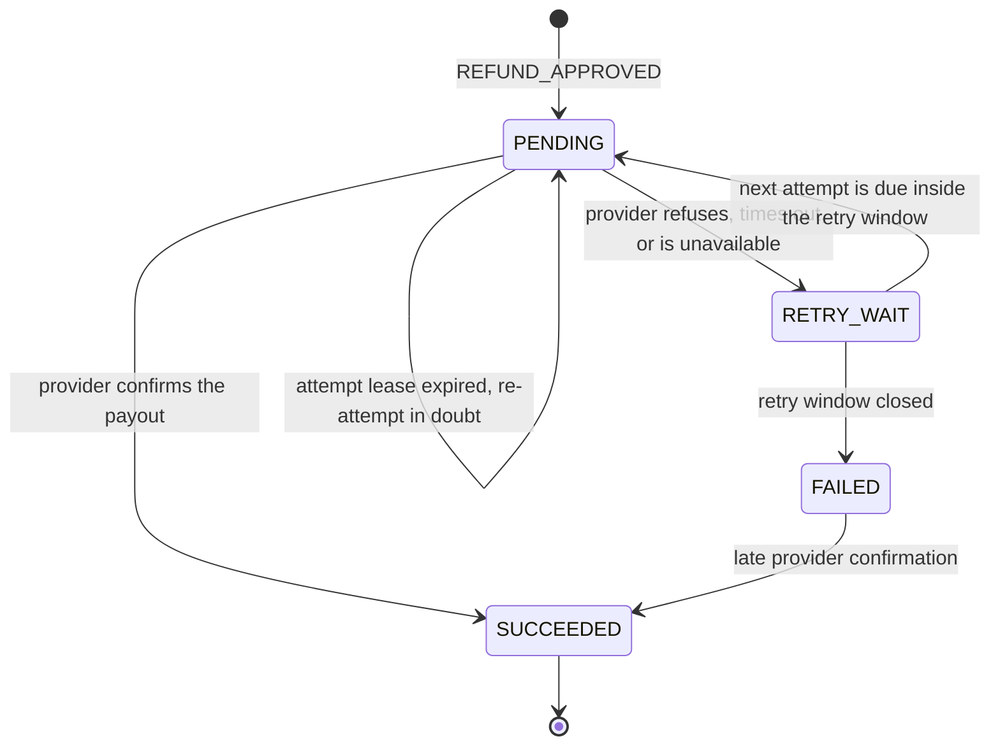
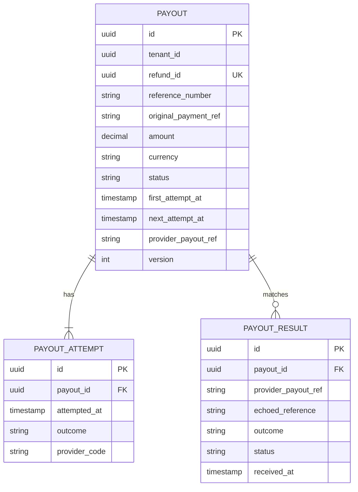

<!--
CHUNK: 13b
TITLE: Detailed Service Spec - payout-service
PROJECT: Refunds Platform
VERSION: 1.0
DEPENDS_ON: 09, 07, 10 (event hub - topic names, event names, and payload contracts match chunk 10 verbatim), 11 (API contracts - integration endpoints carry their API ID and match chunk 11 verbatim), 12 (roles - permission tokens match chunk 12 verbatim)
PART OF: SDD - Refunds Platform
-->

# 17. Detailed Service Specs

---

## 17.2 payout-service

### What

The payout bounded context: pays each approved refund back to the customer's original card through CardPay, exactly once, and reports the outcome. A separate deployable (ADR-01) so that CardPay refusals and outages, retried within the ADR-10 retry window, never touch the customer-facing core.

### Boundaries

- **Owns:** the `Payout` aggregate, its attempts and received results, the CardPay idempotency keys, the retry schedule.
- **Does not own:** refund requests and their status (refund-service), messages (notification-service), card data (CardPay).
- **Upstream consumers:** none synchronous; CardPay sends payout results (API-03) through the gateway's partner route (ADR-11).
- **Downstream dependencies:** CardPay (API-02); Kafka (consumes `REFUND_APPROVED`, publishes payout facts).

### Input

| Type | Source | Description |
|------|--------|-------------|
| Event | refund-service: `REFUND_APPROVED` on `refunds-platform-refund-events` | A refund was approved in full or in part |
| External inbound | CardPay via API-03 | The result of a payout |
| Schedule | Payout scheduler | Makes every attempt that is due, the first included, per the backoff in §12 INT-01 |
| Schedule | Provider reconciliation | Daily comparison with CardPay's payout records |

### Business Logic

payout-service owns no BRD use case (§13); it realises the payout part of [REFUNDS/UC-04](../brd-refunds-portal/06b-use-cases-branch-manager.md#uc-04-approve--reject-refund) for refund-service, and REFUNDS/NFR-01 (zero missing or duplicate payouts) through ADR-10.

- **Payout creation ([REFUNDS/UC-04](../brd-refunds-portal/06b-use-cases-branch-manager.md#uc-04-approve--reject-refund) step 6):** on `REFUND_APPROVED` the consumer transaction inserts the inbox row and one payout (PENDING, `next_attempt_at` = now) and makes no provider call; the unique (`tenant_id`, `refund_id`) index turns a redelivered or replayed event into a no-op, so a refund is never paid twice. The payout's amount is `approvedAmount` and its destination `originalPaymentRef`.
- **Attempt:** every attempt, the first included, is made by the scheduler from committed state. In one short transaction the scheduler claims a due payout (`FOR UPDATE SKIP LOCKED`), sets `next_attempt_at` to now plus the API-02 call timeout plus 60 seconds as the attempt lease, and inserts the `payout_attempt` row; it then calls CardPay (API-02) with `Idempotency-Key` = the payout id and records the outcome. A payout whose lease expires with no recorded outcome is due again, and its next attempt is IN_DOUBT (same key, or a status query). The window check treats a payout with an expired lease like RETRY_WAIT.
- **Success ([REFUNDS/UC-04](../brd-refunds-portal/06b-use-cases-branch-manager.md#uc-04-approve--reject-refund) step 7):** a provider-confirmed success (API-02 response or API-03 result, whichever the CardPay documentation defines as final) moves the payout to SUCCEEDED and writes `PAYOUT_SUCCEEDED` to the outbox.
- **Refusal or unavailability ([REFUNDS/UC-04](../brd-refunds-portal/06b-use-cases-branch-manager.md#uc-04-approve--reject-refund) E1):** the payout moves to RETRY_WAIT with its next attempt time (exponential backoff with jitter, §12 INT-01). When the ADR-10 retry window closes without success, the payout moves to FAILED and writes `PAYOUT_FAILED`; refund-service then flags the request and tells the branch's managers.
- **Unknown outcome:** a timeout or lost response is "in doubt". The next attempt re-sends with the same key, or queries the payout status if CardPay offers it (API-02); a new key is never used for the same payout. A result that arrives through API-03 for an in-doubt attempt is applied through the API-03 matching rule (§15), so a confirmation received while the payout waits is never lost.
- **Late confirmation:** a provider-confirmed success that arrives after FAILED moves the payout to SUCCEEDED and writes `PAYOUT_SUCCEEDED`, so money that did leave is never reported as lost.
- **Provider reconciliation (REFUNDS/NFR-01):** a daily job compares the previous day's SUCCEEDED payouts with CardPay's payout records and alerts on any difference.

**State machine:**

**Figure 17: payout-service - Payout state machine**

**Summary:** A payout alternates between PENDING (due, or an attempt in flight under a lease) and RETRY_WAIT until CardPay confirms it or the retry window closes. FAILED is final for new attempts, but a late confirmation of an earlier attempt still moves it to SUCCEEDED.

### Output

| Type | Destination | Description |
|------|-------------|-------------|
| Event | `refunds-platform-payout-events` | `PAYOUT_SUCCEEDED`, `PAYOUT_FAILED` (§14.5.2) |
| External call | CardPay (API-02) | Payout requests |

### Integrations

| Integration | Direction | Protocol | Purpose | Contract | Failure Handling |
|-------------|-----------|----------|---------|----------|------------------|
| CardPay | Outbound, sync | HTTPS | Payout to the original card | API-02 (§15) | Same key on every attempt; backoff inside the ADR-10 retry window; circuit breaker and bulkhead (§12 INT-01) |
| CardPay | Inbound, sync | TBD - external | Payout result | API-03 (§15) | Signature check and matching per API-03 (§15) |
| Kafka | Inbound, async | Kafka | Approved refunds | `REFUND_APPROVED` (§14) | Inbox dedup plus unique `refund_id`; invalid payload to `payout-service.dlq` |
| Kafka | Outbound, async | Kafka | Payout outcomes | `PAYOUT_SUCCEEDED`, `PAYOUT_FAILED` (§14) | Outbox relay retries until the broker acknowledges |

### DB Modeling

#### Entity Relationship

**Figure 18: payout-service - Entity relationship**

**Summary:** One payout per refund with its attempts and the provider results matched to it; `outbox_event` and `inbox_event` follow §11.1 and are not drawn.

#### Tables Design

| Table | Column | Type | Constraints | Notes |
|-------|--------|------|-------------|-------|
| `payout` | `id` | uuid | PK | UUIDv7; the `Idempotency-Key` sent to CardPay and the `aggregate_id` of payout events |
| `payout` | `refund_id` | uuid | NOT NULL; UNIQUE (`tenant_id`, `refund_id`) | One payout per refund (REFUNDS/NFR-01) |
| `payout` | `reference_number`, `original_payment_ref` | varchar(20), varchar(100) | NOT NULL | From `REFUND_APPROVED`; the payment reference is confidential |
| `payout` | `amount`, `currency` | numeric(19,4), char(3) | amount > 0 | The approved amount |
| `payout` | `status` | varchar(20) | CHECK in (PENDING, RETRY_WAIT, SUCCEEDED, FAILED) | State machine above |
| `payout` | `first_attempt_at`, `next_attempt_at` | timestamptz | INDEX (`tenant_id`, `status`, `next_attempt_at`) | `next_attempt_at` is the due time, or the lease expiry while an attempt is in flight; the ADR-10 window starts at `first_attempt_at` |
| `payout` | `provider_payout_ref`, `last_provider_code`, `succeeded_at`, `failed_at`, `version` | varchar(100), varchar(50), timestamptz, timestamptz, int | UNIQUE (`tenant_id`, `provider_payout_ref`) when set | Matches API-03 results to the payout |
| `payout_attempt` | `payout_id`, `attempted_at`, `outcome`, `provider_code` | uuid, timestamptz, varchar(20), varchar(50) | FK to `payout`; INDEX (`tenant_id`, `payout_id`, `attempted_at`) | Outcome in (CONFIRMED, REFUSED, UNAVAILABLE, IN_DOUBT) |
| `payout_result` | `id`, `payout_id`, `provider_payout_ref`, `echoed_reference`, `outcome`, `status`, `received_at` | uuid, uuid, varchar(100), varchar(100), varchar(20), varchar(10), timestamptz | `payout_id` NULL while UNMATCHED; status in (MATCHED, UNMATCHED); INDEX (`tenant_id`, `status`, `received_at`) | Every API-03 result, stored before acknowledgement (API-03) |

Every table also carries the §11.1 auditing columns.

#### Migration Strategy

- **Tool:** Flyway, versioned SQL, database `payout`.
- **Backward compatibility:** expand-contract.
- **Data backfill:** separate versioned migration, in batches.
- **Rollback:** forward-fix; migrations are backward compatible.

#### Retention Policy

- `payout`, `payout_attempt`, `payout_result`: kept per the retention decision under Compliance below.
- `outbox_event`: deleted once the broker acknowledges; `inbox_event`: kept at least as long as the consumed topic's retention (§6).

#### Archival

- **Cold storage:** none in this release; follows the retention decision under Compliance.
- **Format / Schedule / Restore SLA:** set with that decision.

#### Data Encryption

- **At rest / key management:** per §11.6.
- **In transit:** TLS to PostgreSQL, Kafka, and CardPay.
- **PII columns:** `original_payment_ref` (confidential); masked in non-production copies. No card number is stored.

### Multi-Tenancy Specifications

- **Strategy override:** none (ADR-03).
- **Tenant filter:** repository base class; CardPay credentials are selected per tenant; API-03 results are attributed to the tenant resolved from the partner key (ADR-11).
- **Cross-tenant queries:** forbidden; the scheduler claims due payouts per tenant.

### API Standards

- **Style:** REST, only for the inbound CardPay result (API-03).
- **Versioning:** URI prefix `/v1` for our side, once the path is defined.
- **Authentication:** CardPay's scheme, verified by our endpoint (TBD - external, §15.1 Authorization by contract type; ADR-11).
- **Idempotency:** per API-03 (§15).
- **Pagination:** not applicable.
- **Error envelope:** per the CardPay contract once supplied (API-03).

#### List of APIs (Swagger-friendly)

| Method | Path | Summary | Request Body | Response | Auth Scope | API ID (§15) |
|--------|------|---------|--------------|----------|------------|--------------|
| TBD | TBD | Receive a payout result from CardPay | TBD | TBD | CardPay scheme (TBD - external) | API-03 |

### Event-Driven Architecture (If Applicable)

#### Event Model

**Published events:**

| Event Name | Producer | Producer Specs | Consumers | Consumer Specs | Schema (Summary) | Delivery Guarantee |
|------------|----------|----------------|-----------|----------------|------------------|---------------------|
| `PAYOUT_SUCCEEDED` | payout-service | `refunds-platform-payout-events`, key `aggregate_id` | refund-service | group `refund-service`, inbox dedup | `refundId`, `paidAmount`, `providerPayoutRef`, `succeededAt` (§14.9.6) | At-least-once, exactly-once effect |
| `PAYOUT_FAILED` | payout-service | `refunds-platform-payout-events`, key `aggregate_id` | refund-service | group `refund-service`, inbox dedup | `refundId`, `amount`, `attempts`, `lastProviderCode`, `firstAttemptAt`, `failedAt` (§14.9.7) | At-least-once, exactly-once effect |

**Consumed events:**

| Event Name | Producer (owning service) | Topic | Effect in this service | Idempotency / ordering |
|------------|---------------------------|-------|------------------------|------------------------|
| `REFUND_APPROVED` | refund-service | `refunds-platform-refund-events` | Creates the payout; the scheduler makes the first attempt after commit (uses `aggregate_id` as the refund id, `approvedAmount`, `originalPaymentRef`, `referenceNumber`) | Inbox on (`payout-service`, `event_id`) plus unique `refund_id` |

#### Messaging Infra

- **Broker:** Kafka (ADR-02).
- **Schema registry:** per §6 (JSON Schema, additive-only).
- **Serialization:** JSON.
- **Topic strategy:** one topic per producing context, keyed by `aggregate_id` (§14.2).
- **Retention:** platform topic defaults (§6).
- **DLQ strategy:** `payout-service.dlq`; alarm on depth above zero; redrive per §20.1.3.

### Constraints

- One payout per refund, for the approved amount, to the original payment reference only (REFUNDS/NFR-01; REFUNDS 02 Assumption 2).
- Retries run inside the ADR-10 retry window ([REFUNDS/UC-04](../brd-refunds-portal/06b-use-cases-branch-manager.md#uc-04-approve--reject-refund) E1).
- The idempotency key of a payout never changes (ADR-10).

### Error Handling

- **Synchronous APIs:** API-03 responses follow the CardPay contract (TBD - external).
- **Validation errors:** an API-03 result with a bad signature is refused and logged as a security event.
- **Domain errors:** results that match no payout: per API-03 (§15); a duplicate result is a no-op.
- **Auth errors:** per the CardPay scheme (TBD - external).
- **Server errors:** CardPay 5xx and timeouts are "unavailable" or "in doubt" and retried with the same key ([REFUNDS/UC-04](../brd-refunds-portal/06b-use-cases-branch-manager.md#uc-04-approve--reject-refund) E1).
- **Async consumers:** inbox dedup; a malformed `REFUND_APPROVED` is dead-lettered with an alarm, never dropped.
- **Poison messages:** `payout-service.dlq`, redrive per §20.1.3.

### Observability & Monitoring

#### Logging

- JSON per §11.4, with `service=payout-service`.
- Mandatory fields: `trace_id`, `correlation_id`, `payout_id`, `refund_id`, `attempt`, `outcome`; never the payment reference at INFO.
- Retention per §6 logging row.

#### Metrics

| Metric | Type | Labels | Purpose |
|--------|------|--------|---------|
| `payout_attempts_total` | counter | `outcome` | Provider behaviour; alert on a refusal spike |
| `payouts_in_retry` | gauge | - | Payouts waiting for a retry |
| `payout_window_expired_total` | counter | - | `PAYOUT_FAILED` rate; alert above zero |
| `payout_provider_duration_seconds` | histogram | `outcome` | API-02 latency |
| `payout_duplicate_blocked_total` | counter | - | Redelivered approvals stopped by the unique index (REFUNDS/NFR-01 evidence) |
| `payout_attempt_leases_expired_total` | counter | - | Attempts interrupted by a crash or restart; alert above zero |
| `payout_results_unmatched` | gauge | - | API-03 results waiting for a match; alert above zero |
| `payout_reconciliation_mismatches_total` | counter | - | Payouts CardPay shows twice or only one side has; alert above zero |

#### Tracing

- OpenTelemetry for Kafka, HTTP client, and JDBC.
- The trace context of `REFUND_APPROVED` continues into the CardPay call and into the payout events.
- Sampling per §11.4.

### Developer Notes

- **Recommended patterns:** CardPay only behind a `PayoutProviderPort`; scheduler claims due payouts with row locks (`FOR UPDATE SKIP LOCKED`) so every replica can run it; outbox row in the same transaction as the state change.
- **Avoid:** a new idempotency key per attempt; a CardPay call inside the consumer transaction; marking a payout FAILED on a timeout inside the window; calling refund-service.
- **Testing:** state machine unit tests (`onApproved_duplicateEvent_createsNoSecondPayout`, `schedule_leaseExpired_reattemptsInDoubt`); Testcontainers PostgreSQL and Kafka tests; a CardPay stub that refuses, times out, and confirms late.

### Service-Level Diagrams

#### Implementation Flow Chart

The state machine above is the implementation flow of this service; it is not drawn twice.

#### Sequence Diagram (Service-Internal)

Not repeated here: §8.5.2 (chunk 05) shows this service's interactions.

### Compliance

- **GDPR:** no customer identity is stored; the payment reference links to a card transaction. [NEEDS CLARIFICATION: retention period for payout records under financial record-keeping rules.]
- **PCI-DSS:** no card number is stored or processed; only the provider's transaction reference, so the service is outside the cardholder-data scope.
- **ISO 27001 / SOC 2:** provider credentials in the secrets manager; access to payout data logged.
- **Local regulations:** none identified in the BRDs.

### Deployment Strategy

- **Service-specific override:** none; own Helm chart `payout-service`.
- **Replicas:** per §11.3.
- **Strategy:** rolling (§11.3); an attempt interrupted by a restart is re-run in doubt when its lease expires.
- **Health checks:** liveness and readiness probes; readiness checks the database only (§11.3).
- **Rollback:** Helm rollback; migrations are backward compatible.

### Future Enhancements

- A branch-manager action to retry a FAILED payout (no BRD use case covers it yet).

<!-- MASTER: refunds-platform-sdd-master.md | PREV: 13a-service-refund.md | NEXT: 13c-service-notification.md -->
