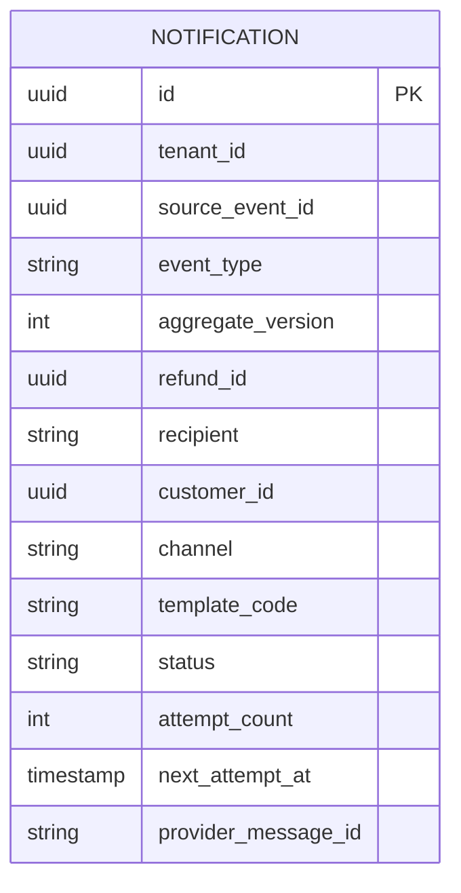
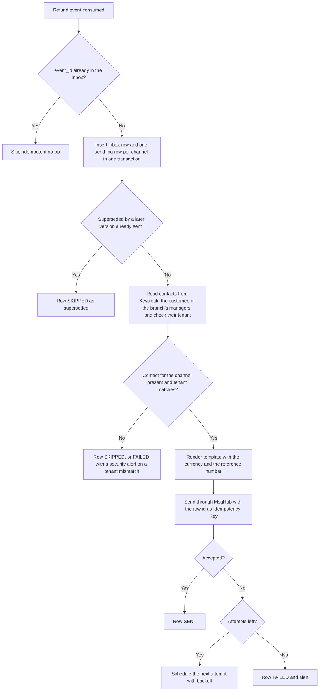

<!--
CHUNK: 13c
TITLE: Detailed Service Spec - notification-service
PROJECT: Refunds Platform
VERSION: 1.0
DEPENDS_ON: 09, 07, 10 (event hub - topic names, event names, and payload contracts match chunk 10 verbatim), 11 (API contracts - integration endpoints carry their API ID and match chunk 11 verbatim), 12 (roles - permission tokens match chunk 12 verbatim)
PART OF: SDD - Refunds Platform
-->

# 17. Detailed Service Specs

---

## 17.3 notification-service

### What

The refund messaging bounded context: turns the refund events that the customer, or the branch's managers, must be told about into messages sent through MsgHub. A separate deployable (ADR-01) so that the message fan-out scales on its own during seasonal peaks and a MsgHub outage stays outside the core.

### Boundaries

- **Owns:** the send log (one row per event and channel), message templates per event and locale, the retry state of each message.
- **Does not own:** refund state (refund-service), contact details (Keycloak, read at send time, ADR-09), delivery to the handset or mailbox (MsgHub).
- **Upstream consumers:** none; the service is driven only by events.
- **Downstream dependencies:** Keycloak Admin API (API-05), MsgHub (API-04), Kafka.

### Input

| Type | Source | Description |
|------|--------|-------------|
| Event | refund-service: `REFUND_SUBMITTED`, `REFUND_CANCELLED`, `REFUND_APPROVED`, `REFUND_REJECTED`, `REFUND_PAID`, `REFUND_PAYOUT_FAILED` on `refunds-platform-refund-events` | Refund facts the customer, or the branch's managers, are told about |
| External response | Keycloak Admin API via API-05 | Email, phone, and locale of the customer, or the emails of a branch's managers |

### Business Logic

notification-service owns no BRD use case (§13); it realises the "tells the customer" and "tells the branch manager" steps of the refund use cases for refund-service:

| Event | Channels | BRD source |
|-------|----------|------------|
| `REFUND_SUBMITTED` | Email and SMS | [REFUNDS/UC-01](../brd-refunds-portal/06a-use-cases-customer.md#uc-01-request-a-refund) step 6 |
| `REFUND_CANCELLED` | Email | [REFUNDS/UC-03](../brd-refunds-portal/06a-use-cases-customer.md#uc-03-cancel-a-refund-request) step 5 |
| `REFUND_APPROVED` | Email and SMS with the approved amount; a partial approval adds the reason | [REFUNDS/UC-04](../brd-refunds-portal/06b-use-cases-branch-manager.md#uc-04-approve--reject-refund) step 6 and AC-1; [REFUNDS 04 § Project Scope](../brd-refunds-portal/04-scope-and-personas.md#project-scope) |
| `REFUND_REJECTED` | Email and SMS, with the reason | [REFUNDS/UC-04](../brd-refunds-portal/06b-use-cases-branch-manager.md#uc-04-approve--reject-refund) A2 (no channel named there; the channels of [REFUNDS 04 § In Scope](../brd-refunds-portal/04-scope-and-personas.md#in-scope)) |
| `REFUND_PAID` | Email and SMS | [REFUNDS/UC-04](../brd-refunds-portal/06b-use-cases-branch-manager.md#uc-04-approve--reject-refund) step 7 |
| `REFUND_PAYOUT_FAILED` | Email to the managers of `branchId` | [REFUNDS/UC-04](../brd-refunds-portal/06b-use-cases-branch-manager.md#uc-04-approve--reject-refund) E1 and AC-2 |

- **Plan:** for each consumed event, one send-log row per channel is inserted in the same transaction as the inbox row; the unique (`tenant_id`, `source_event_id`, `channel`) index means a redelivered event sends nothing twice.
- **Superseded messages:** a planned row whose `aggregate_version` is lower than that of a row already SENT for the same refund and channel is SKIPPED as superseded.
- **Contact resolution:** at send time the `ContactDirectory` port reads the customer's email, phone, and locale from Keycloak by `customerId` (API-05, ADR-09); nothing is stored. A missing phone number marks the SMS row SKIPPED. For `REFUND_PAYOUT_FAILED` the port resolves the users holding `BRANCH_MANAGER` with that `branch_id` (API-05); nothing is stored. The user's `tenant_id` attribute must equal the event's `tenant_id`; otherwise the row is FAILED and a security alert fires.
- **Rendering:** a template per event, channel, and locale; every amount shows its currency ([REFUNDS 11 § UI/UX Expectations](../brd-refunds-portal/11-summary-and-uiux.md#uiux-expectations)); the reference number is always included.
- **Send:** MsgHub (API-04) with `Idempotency-Key` = the send-log row id. Failures retry with exponential backoff and jitter (§12 INT-02); after the last attempt the row is FAILED and an alert fires. Refund state is never affected by a message outcome.

**State machine:** not applicable; a send-log row moves PENDING -> SENT, SKIPPED, or FAILED and never back.

### Output

| Type | Destination | Description |
|------|-------------|-------------|
| External call | MsgHub (API-04) | Email and SMS messages |

### Integrations

| Integration | Direction | Protocol | Purpose | Contract | Failure Handling |
|-------------|-----------|----------|---------|----------|------------------|
| Keycloak Admin API | Outbound, sync | HTTPS | Contact details and locale at send time | API-05 (§15) | Retries per §12 INT-04; the message waits for its own next attempt |
| MsgHub | Outbound, sync | HTTPS | Send email and SMS | API-04 (§15) | Backoff with jitter, bulkhead per channel (§12 INT-02); FAILED plus alert after the last attempt |
| Kafka | Inbound, async | Kafka | Refund facts | `REFUND_SUBMITTED`, `REFUND_CANCELLED`, `REFUND_APPROVED`, `REFUND_REJECTED`, `REFUND_PAID`, `REFUND_PAYOUT_FAILED` (§14) | Inbox dedup; malformed events to `notification-service.dlq` |

### DB Modeling

#### Entity Relationship

**Figure 19: notification-service - Entity relationship**

**Summary:** One send-log row per event and channel; `inbox_event` follows §11.1 and is not drawn. No contact detail is stored.

#### Tables Design

| Table | Column | Type | Constraints | Notes |
|-------|--------|------|-------------|-------|
| `notification` | `id` | uuid | PK | UUIDv7; the `Idempotency-Key` sent to MsgHub |
| `notification` | `source_event_id`, `channel` | uuid, varchar(10) | UNIQUE (`tenant_id`, `source_event_id`, `channel`); channel in (EMAIL, SMS) | One message per event and channel |
| `notification` | `aggregate_version` | int | NOT NULL | From the envelope; supersession check |
| `notification` | `recipient` | varchar(20) | NOT NULL; in (CUSTOMER, BRANCH_MANAGERS) | Who the message is for |
| `notification` | `customer_id` | uuid | NULL for BRANCH_MANAGERS rows | Contact lookup key for customer messages |
| `notification` | `event_type`, `refund_id`, `template_code`, `template_params` | varchar(40), uuid, varchar(60), jsonb | NOT NULL | Params: reference number, amount with currency, reason, branch |
| `notification` | `status`, `attempt_count`, `next_attempt_at`, `last_error_code`, `provider_message_id`, `sent_at` | varchar(10), int, timestamptz, varchar(50), varchar(100), timestamptz | status in (PENDING, SENT, SKIPPED, FAILED); INDEX (`tenant_id`, `status`, `next_attempt_at`) | Retry scheduling |

Every table also carries the §11.1 auditing columns.

#### Migration Strategy

- **Tool:** Flyway, versioned SQL, database `notification`.
- **Backward compatibility:** expand-contract.
- **Data backfill:** not expected.
- **Rollback:** forward-fix; migrations are backward compatible.

#### Retention Policy

- `notification`: kept at least as long as the consumed topic's retention (§6), so the dedup key outlives any redelivery; then deleted.
- `inbox_event`: same rule.

#### Archival

- **Cold storage:** none; the send log is operational data.
- **Format / Schedule / Restore SLA:** not applicable.

#### Data Encryption

- **At rest / key management:** per §11.6.
- **In transit:** TLS to PostgreSQL, Kafka, Keycloak, and MsgHub.
- **PII columns:** `customer_id` (pseudonymous) and `template_params.reason` (free text); masked in non-production copies. Contact details are held only in memory while a message is sent.

### Multi-Tenancy Specifications

- **Strategy override:** none (ADR-03).
- **Tenant filter:** repository base class; MsgHub credentials and sender identities are selected per tenant; every contact lookup is checked against the event's tenant (§11.2).
- **Cross-tenant queries:** forbidden.

### API Standards

- **Style:** no business REST endpoint; health, readiness, and metrics endpoints per §11.4.
- **Versioning:** not applicable.
- **Authentication:** not applicable (no inbound business API).
- **Idempotency:** consumer inbox plus the unique send-log key; `Idempotency-Key` on MsgHub calls.
- **Pagination:** not applicable.
- **Error envelope:** not applicable.

#### List of APIs (Swagger-friendly)

| Method | Path | Summary | Request Body | Response | Auth Scope | API ID (§15) |
|--------|------|---------|--------------|----------|------------|--------------|
| - | - | No business endpoint: the service is driven only by the events in its Event Model | - | - | - | - |

### Event-Driven Architecture (If Applicable)

#### Event Model

**Published events:** none; the service publishes no event (§14.4 consumers only).

**Consumed events:**

| Event Name | Producer (owning service) | Topic | Effect in this service | Idempotency / ordering |
|------------|---------------------------|-------|------------------------|------------------------|
| `REFUND_SUBMITTED` | refund-service | `refunds-platform-refund-events` | Email and SMS (uses `customerId`, `referenceNumber`, `requestedAmount`) | Inbox on (`notification-service`, `event_id`) plus the unique send-log key |
| `REFUND_CANCELLED` | refund-service | `refunds-platform-refund-events` | Email (uses `customerId`, `referenceNumber`) | Same |
| `REFUND_APPROVED` | refund-service | `refunds-platform-refund-events` | Email and SMS with the approved amount, and the reason when `partial` (uses `customerId`, `referenceNumber`, `approvedAmount`, `partial`, `decisionReason`) | Inbox on (`notification-service`, `event_id`) plus the unique send-log key |
| `REFUND_REJECTED` | refund-service | `refunds-platform-refund-events` | Email and SMS with the reason (uses `customerId`, `referenceNumber`, `decisionReason`) | Same |
| `REFUND_PAID` | refund-service | `refunds-platform-refund-events` | Email and SMS (uses `customerId`, `referenceNumber`, `paidAmount`) | Same; ordering per §14.6 item 3 |
| `REFUND_PAYOUT_FAILED` | refund-service | `refunds-platform-refund-events` | Email to the managers of the branch (uses `branchId`, `referenceNumber`, `approvedAmount`) | Same |

#### Messaging Infra

- **Broker:** Kafka (ADR-02).
- **Schema registry:** per §6 (JSON Schema, additive-only).
- **Serialization:** JSON.
- **Topic strategy:** consumer group `notification-service` on `refunds-platform-refund-events` (§14.2).
- **Retention:** platform topic defaults (§6).
- **DLQ strategy:** `notification-service.dlq`; alarm on depth above zero; redrive per §20.1.3.

### Constraints

- Each recipient is told only through the channels the refund use cases name, and receives each message once.
- No contact detail is stored or logged (ADR-09; REFUNDS/NFR-04).

### Error Handling

- **Synchronous APIs:** not applicable (no inbound API).
- **Validation errors:** an event missing a field its plan needs (§14.9) is dead-lettered.
- **Domain errors:** unknown customer in Keycloak -> row FAILED with an alert; missing phone -> SMS row SKIPPED; tenant mismatch on the contact lookup -> row FAILED and a security alert.
- **Auth errors:** a Keycloak or MsgHub credential rejection opens the circuit and alerts; messages wait for the fix and then resume.
- **Server errors:** provider 5xx and timeouts retry with backoff (§12 INT-02, INT-04).
- **Async consumers:** inbox dedup; processing never blocks on a provider call inside the consumer transaction (the send runs after the plan is committed).
- **Poison messages:** `notification-service.dlq`, redrive per §20.1.3.

### Observability & Monitoring

#### Logging

- JSON per §11.4, with `service=notification-service`.
- Mandatory fields: `trace_id`, `correlation_id`, `notification_id`, `event_type`, `channel`, `status`; never contact details.
- Retention per §6 logging row.

#### Metrics

| Metric | Type | Labels | Purpose |
|--------|------|--------|---------|
| `notifications_total` | counter | `channel`, `status` | Sent, skipped, failed |
| `notification_send_duration_seconds` | histogram | `channel` | API-04 latency |
| `notifications_pending` | gauge | `channel` | Backlog during seasonal peaks |
| `contact_lookup_duration_seconds` | histogram | `outcome` | API-05 latency |

#### Tracing

- OpenTelemetry for Kafka, HTTP client, and JDBC.
- The trace of the refund event continues into the Keycloak and MsgHub calls.
- Sampling per §11.4.

### Developer Notes

- **Recommended patterns:** `ContactDirectory` and `MessageSender` ports with Keycloak and MsgHub adapters; templates as versioned resources per locale; RTL-safe templates for Arabic.
- **Avoid:** caching contact details; sending inside the consumer transaction; string concatenation for message text (i18n).
- **Testing:** unit tests for the event-to-plan mapping (`plan_refundCancelled_emailOnly`); Testcontainers PostgreSQL and Kafka tests; stubs for Keycloak and MsgHub.

### Service-Level Diagrams

#### Implementation Flow Chart

**Figure 20: notification-service - Event to message**

**Summary:** Each consumed event is planned once per channel; a superseded row is skipped, and each remaining row resolves and checks its recipients, renders, and sends. Failures retry until the attempts run out, and nothing is sent twice.

#### Sequence Diagram (Service-Internal)

Not repeated here: §8.5.1 (chunk 05) shows the contact lookup and the send.

### Compliance

- **GDPR:** contact details are read at send time and never stored; the send log holds only pseudonymous ids and message parameters.
- **PCI-DSS:** not applicable; no payment data.
- **ISO 27001 / SOC 2:** provider credentials in the secrets manager.
- **Local regulations:** [NEEDS CLARIFICATION: SMS sender-registration and opt-out rules in the countries of operation.]

### Deployment Strategy

- **Service-specific override:** horizontal autoscaling on consumer lag as well as CPU, because seasonal peaks triple the message volume (REFUNDS/NFR-03); thresholds per §11.3.
- **Replicas:** per §11.3.
- **Strategy:** rolling (§11.3).
- **Health checks:** liveness and readiness probes; readiness checks the database only (§11.3).
- **Rollback:** Helm rollback; migrations are backward compatible.

### Future Enhancements

- Push notifications in the mobile app ([REFUNDS/UC-02](../brd-refunds-portal/06a-use-cases-customer.md#uc-02-track-refund-status-web-and-mobile) future enhancement) as a third channel.

<!-- MASTER: refunds-platform-sdd-master.md | PREV: 13b-service-payout.md | NEXT: 13d-service-loyalty.md -->
