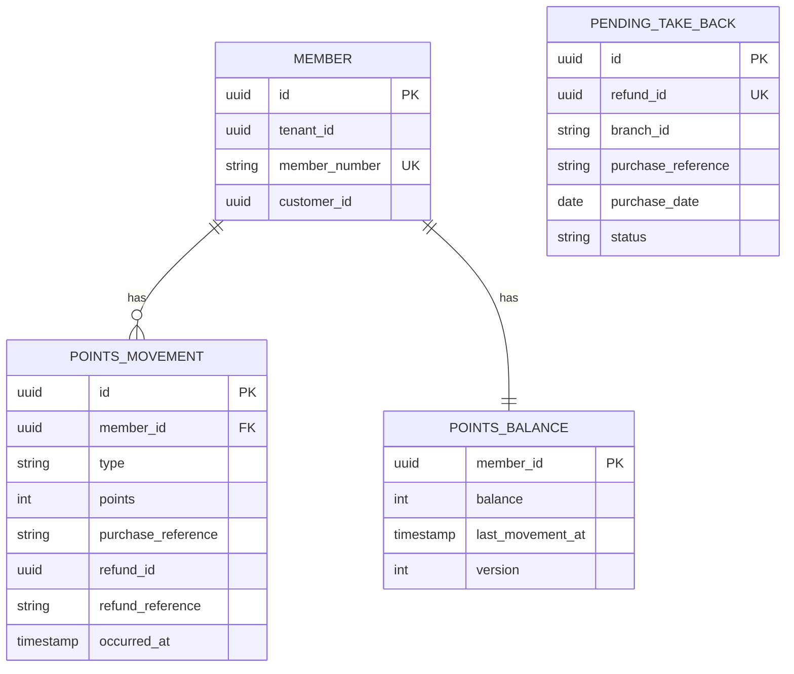

<!--
CHUNK: 13d
TITLE: Detailed Service Spec - loyalty-service
PROJECT: Refunds Platform
VERSION: 1.0
DEPENDS_ON: 09, 07, 10 (event hub - topic names, event names, and payload contracts match chunk 10 verbatim), 11 (API contracts - integration endpoints carry their API ID and match chunk 11 verbatim), 12 (roles - permission tokens match chunk 12 verbatim)
PART OF: SDD - Refunds Platform
-->

# 17. Detailed Service Specs

---

## 17.4 loyalty-service

### What

The points ledger bounded context: members, their points movements (earned on purchases, taken back when a purchase's refund is paid), and their balances, with the member's balance and history views. A module of the core deployable `refunds-platform-core` (ADR-01), hexagonal inside; it shares no table and no call path with refund-service.

### Boundaries

- **Owns:** `Member` (loyalty member number and its link to a customer identity), `PointsMovement` (append-only), `PointsBalance` (projection), `PendingTakeBack`.
- **Does not own:** purchases (POS Records), refunds and their payment (refund-service), identities (Keycloak).
- **Upstream consumers:** the web app through the API gateway (members); POS Records (API-06, through the gateway's partner route, ADR-11).
- **Downstream dependencies:** Kafka (consumes `REFUND_PAID`).

### Input

| Type | Source | Description |
|------|--------|-------------|
| REST | Web app (member) via the API gateway | Balance, history, movement detail |
| External inbound | POS Records via API-06 | Member purchases: member, purchase reference, amount (LOYALTY 08) |
| Event | refund-service: `REFUND_PAID` on `refunds-platform-refund-events` | A purchase's refund was paid |

### Business Logic

loyalty-service realises the two LOYALTY use cases it owns (§13), plus the earn movements that feed them.

- **[LOYALTY/UC-01](../brd-loyalty-points/06a-use-cases-member.md#uc-01-view-points-balance) steps 1-2, A1, BR-1:** `GET /v1/members/me/points-balance` resolves the member from the token's `member_id` claim (A-5), never from the path, and returns the balance and the date of the last movement from `points_balance`. A member with no movement gets 0 and `hasMovements: false`, and the web app explains how points are earned (A1).
- **[LOYALTY/UC-02](../brd-loyalty-points/06a-use-cases-member.md#uc-02-view-points-history) steps 1-4, A1, BR-2:** `GET /v1/members/me/points-movements` lists the member's movements newest first (cursor-based), each with its date, its purchase or refund reference, and its signed points; a take-back row shows the refund reference (A1). `GET /v1/members/me/points-movements/{movementId}` returns the purchase (receipt number, branch, date, amount) or the refund (reference number, paid amount, date) the movement came from (steps 3-4).
- **[LOYALTY/UC-02](../brd-loyalty-points/06a-use-cases-member.md#uc-02-view-points-history) BR-1, take-back on a paid refund:** on `REFUND_PAID` the module looks up the EARNED movement for the tenant, the event's `branchId`, and its `receiptNumber` (A-4).
  - Found: it records one TAKEN_BACK movement (negative points, with the refund id and `referenceNumber`) and updates the balance in the same transaction. A unique (`tenant_id`, `refund_id`) index makes a redelivered event a no-op.
  - Not found, and the end of the day after `purchaseDate` in the tenant's time zone (§6) has not passed: the take-back is parked in `pending_take_back` and applied when the purchase arrives (the POS feed delivers member purchases the same day, LOYALTY 02 Assumption 1).
  - Not found, and that time has passed: the take-back is CLOSED as not a member purchase so far. A CLOSED take-back stays matchable: if an EARNED movement for the same purchase arrives later (a delayed POS feed, §18.3), the take-back is applied in that transaction, marked APPLIED, and counted in `points_take_backs_applied_late_total` with an alert.
  - The take-back is visible within 1 hour of the refund being paid (LOYALTY/NFR-02; target in §18).
  - Points taken back: the points earned on that purchase for a full refund. [NEEDS CLARIFICATION: points to take back when a refund pays back only part of a purchase ([REFUNDS/UC-04](../brd-refunds-portal/06b-use-cases-branch-manager.md#uc-04-approve--reject-refund) A1 partial amount, or a subset of the receipt lines), and rounding of points on fractional EUR amounts; proposed: whole EUR of the paid amount, capped at the points still held from that purchase. BRD follow-up for the LOYALTY owner.]
- **Earn movements (no BRD use case; [LOYALTY 03 § Points movement](../brd-loyalty-points/03-definitions-and-domain-concepts.md#points-movement), LOYALTY 08):** each member purchase received through API-06 records one EARNED movement at 1 point per 1 EUR ([LOYALTY 02 § Glossary](../brd-loyalty-points/02-glossary-assumptions-facts.md#glossary)), idempotent on (`tenant_id`, `branch_id`, `purchase_reference`); it creates the member row on first sight and applies any parked or closed take-back for that purchase.
- **Balance integrity (LOYALTY/NFR-01):** `points_balance` changes only in the transaction that inserts a movement; the balance is the sum of the movements (LOYALTY 03). A daily reconciliation job recomputes every balance from the movements and alerts on any difference. An alert fires when a PARKED take-back is older than two days, the sign of a stalled feed.

**State machine:** not applicable; movements are append-only, and a parked take-back is either APPLIED or CLOSED.

### Output

| Type | Destination | Description |
|------|-------------|-------------|
| REST response | Web app | Balance and last movement date, movement pages, movement detail |

The module publishes no event (§14.4 consumers only).

### Integrations

| Integration | Direction | Protocol | Purpose | Contract | Failure Handling |
|-------------|-----------|----------|---------|----------|------------------|
| POS Records | Inbound | TBD - external | Member purchases that earn points | API-06 (§15) | Idempotent on the branch and purchase reference; enters through the gateway's partner route (ADR-11); the provider redelivers on failure (§12 INT-03) |
| Kafka | Inbound, async | Kafka | Paid refunds | `REFUND_PAID` (§14) | Inbox dedup plus unique `refund_id`; invalid payload to `loyalty-service.dlq` |

### DB Modeling

#### Entity Relationship

**Figure 21: loyalty-service - Entity relationship**

**Summary:** A member has movements and one balance row; parked take-backs wait by purchase reference and are not linked to a member until the purchase arrives. `inbox_event` follows §11.1 and is not drawn.

#### Tables Design

| Table | Column | Type | Constraints | Notes |
|-------|--------|------|-------------|-------|
| `member` | `id`, `member_number`, `customer_id` | uuid, varchar(40), uuid | PK; UNIQUE (`tenant_id`, `member_number`); UNIQUE (`tenant_id`, `customer_id`) when set | `customer_id` is the Keycloak subject linked to the member (A-5) |
| `points_movement` | `id`, `member_id`, `type`, `points` | uuid, uuid, varchar(12), int | PK; FK to `member`; type in (EARNED, TAKEN_BACK); points > 0 for EARNED, < 0 for TAKEN_BACK | Whole numbers ([LOYALTY 11 § UI/UX Expectations](../brd-loyalty-points/11-summary-and-uiux.md#uiux-expectations)) |
| `points_movement` | `purchase_reference`, `purchase_amount`, `currency`, `branch_id` | varchar(40), numeric(19,4), char(3), varchar(20) | UNIQUE (`tenant_id`, `branch_id`, `purchase_reference`) WHERE type = EARNED | The receipt number (A-4) |
| `points_movement` | `refund_id`, `refund_reference`, `paid_amount` | uuid, varchar(20), numeric(19,4) | UNIQUE (`tenant_id`, `refund_id`) WHERE type = TAKEN_BACK | Set on take-back rows only |
| `points_movement` | `occurred_at` | timestamptz | INDEX (`tenant_id`, `member_id`, `occurred_at` DESC) | History order, newest first |
| `points_balance` | `member_id`, `balance`, `last_movement_at`, `version` | uuid, int, timestamptz, int | PK (`tenant_id`, `member_id`) | Projection; equals the sum of movements |
| `pending_take_back` | `refund_id`, `branch_id`, `purchase_reference`, `purchase_date`, `paid_amount`, `currency`, `refund_reference`, `status` | uuid, varchar(20), varchar(40), date, numeric(19,4), char(3), varchar(20), varchar(10) | UNIQUE (`tenant_id`, `refund_id`); `branch_id` NOT NULL; INDEX (`tenant_id`, `branch_id`, `purchase_reference`); status in (PARKED, APPLIED, CLOSED) | Take-backs that arrived before their purchase; CLOSED rows stay matchable |

Every table also carries the §11.1 auditing columns.

#### Migration Strategy

- **Tool:** Flyway, versioned SQL, history for schema `loyalty`.
- **Backward compatibility:** expand-contract.
- **Data backfill:** `points_balance` can always be rebuilt from `points_movement`.
- **Rollback:** forward-fix; migrations are backward compatible.

#### Retention Policy

- `member`, `points_movement`, `points_balance`, `pending_take_back`: kept per the retention decision under Compliance below.
- `inbox_event`: kept at least as long as the consumed topic's retention (§6).

#### Archival

- **Cold storage:** none in this release; follows the retention decision under Compliance.
- **Format / Schedule / Restore SLA:** set with that decision.

#### Data Encryption

- **At rest / key management:** per §11.6.
- **In transit:** TLS to PostgreSQL, Kafka, and POS Records.
- **PII columns:** `member_number`, `customer_id` (pseudonymous), purchase references; masked in non-production copies.

### Multi-Tenancy Specifications

- **Strategy override:** none (ADR-03).
- **Tenant filter:** repository base class; every index starts with `tenant_id`.
- **Cross-tenant queries:** forbidden; the daily reconciliation runs per tenant.

### API Standards

- **Style:** REST with JSON, contract-first OpenAPI (ADR-04).
- **Versioning:** URI prefix `/v1`.
- **Authentication:** Keycloak JWT with the `member_id` claim (ADR-07); API-06 uses the POS Records scheme (TBD - external).
- **Idempotency:** reads only on the member API; API-06 is idempotent on the purchase reference.
- **Pagination:** cursor-based (`cursor`, `limit`) on the movement list.
- **Error envelope:** Problem Details per §15.1.

#### List of APIs (Swagger-friendly)

| Method | Path | Summary | Request Body | Response | Auth Scope | API ID (§15) |
|--------|------|---------|--------------|----------|------------|--------------|
| GET | `/v1/members/me/points-balance` | Current balance and date of the last movement | - | `PointsBalance` | `loyalty.balance.read-own` | - |
| GET | `/v1/members/me/points-movements` | Movements, newest first | - | `PointsMovementPage` | `loyalty.movement.read-own` | - |
| GET | `/v1/members/me/points-movements/{movementId}` | One movement with its purchase or refund | - | `PointsMovementDetail` | `loyalty.movement.read-own` | - |
| TBD | TBD | Receive member purchases from POS Records | TBD | TBD | POS Records scheme (TBD - external) | API-06 |

### Event-Driven Architecture (If Applicable)

#### Event Model

**Published events:** none; the module publishes no event (§14.4 consumers only).

**Consumed events:**

| Event Name | Producer (owning service) | Topic | Effect in this service | Idempotency / ordering |
|------------|---------------------------|-------|------------------------|------------------------|
| `REFUND_PAID` | refund-service | `refunds-platform-refund-events` | TAKEN_BACK movement, parked take-back, or closed take-back (uses `aggregate_id` as the refund id, `branchId`, `receiptNumber`, `purchaseDate`, `paidAmount`, `referenceNumber`) | Inbox on (`loyalty-service`, `event_id`) plus unique `refund_id` |

#### Messaging Infra

- **Broker:** Kafka (ADR-02).
- **Schema registry:** per §6 (JSON Schema, additive-only).
- **Serialization:** JSON.
- **Topic strategy:** consumer group `loyalty-service` on `refunds-platform-refund-events` (§14.2); the module consumes from the broker even though it runs in the core (ADR-05).
- **Retention:** platform topic defaults (§6).
- **DLQ strategy:** `loyalty-service.dlq`; alarm on depth above zero; redrive per §20.1.3.

### Constraints

- Members see only their own points ([LOYALTY/UC-01](../brd-loyalty-points/06a-use-cases-member.md#uc-01-view-points-balance) BR-1, [LOYALTY/UC-02](../brd-loyalty-points/06a-use-cases-member.md#uc-02-view-points-history) BR-2).
- Points are whole numbers; negative movements carry a minus sign (LOYALTY 11).
- A purchase earns once and a refund takes back once.

### Error Handling

- **Synchronous APIs:** Problem Details (§15.1) with a plain-language `detail`.
- **Validation errors:** 400 `VALIDATION_FAILED` (bad cursor or limit).
- **Domain errors:** a token without a `member_id` claim -> 404 `MEMBER_NOT_FOUND` with a `detail` that explains how to join; another member's movement id -> 404 `NOT_FOUND`.
- **Auth errors:** 401 `UNAUTHENTICATED`; 403 `FORBIDDEN` without the permission token.
- **Server errors:** 500 `INTERNAL_ERROR`, no internals in the body.
- **Async consumers:** inbox dedup; an unmatched take-back is parked or closed, never dropped silently.
- **Poison messages:** `loyalty-service.dlq`, redrive per §20.1.3.

### Observability & Monitoring

#### Logging

- JSON per §11.4, with `module=loyalty-service`.
- Mandatory fields: `trace_id`, `correlation_id`, `movement_id` or `refund_id`, `event`; never the member number or customer id at INFO.
- Retention per §6 logging row.

#### Metrics

| Metric | Type | Labels | Purpose |
|--------|------|--------|---------|
| `points_movements_total` | counter | `type` | Earn and take-back rates |
| `points_take_back_lag_seconds` | histogram | - | `paidAt` to movement commit (LOYALTY/NFR-02) |
| `points_take_backs_parked` | gauge | - | Take-backs waiting for their purchase |
| `points_balance_drift_total` | counter | - | Reconciliation differences; alert above zero (LOYALTY/NFR-01) |
| `points_take_backs_applied_late_total` | counter | - | Take-backs applied after they were closed; alert above zero |

#### Tracing

- OpenTelemetry for HTTP, JDBC, and Kafka.
- The trace of `REFUND_PAID` continues into the take-back transaction.
- Sampling per §11.4.

### Developer Notes

- **Recommended patterns:** ledger with an append-only movement table and a balance projection updated in the same transaction; member resolved only from the token.
- **Avoid:** reading refund-service tables; updating a balance without a movement; accepting a member id in a path.
- **Testing:** unit tests for take-back matching (`onRefundPaid_purchaseNotYetReceived_parksTakeBack`); Testcontainers PostgreSQL and Kafka tests; a POS feed stub.

### Service-Level Diagrams

#### Implementation Flow Chart

Not repeated here: §8.4.2 (chunk 05) is this module's flow.

#### Sequence Diagram (Service-Internal)

Not repeated here: §8.5.2 (chunk 05) shows the take-back trigger.

### Compliance

- **GDPR:** personal data is the member number, the customer link, and the purchase history. [NEEDS CLARIFICATION: lawful basis, retention period, and erasure rule for loyalty data.]
- **PCI-DSS:** not applicable; no payment data.
- **ISO 27001 / SOC 2:** no additional control specific to this module.
- **Local regulations:** none identified in the BRDs.

### Deployment Strategy

- **Service-specific override:** none; deployed inside `refunds-platform-core`.
- **Replicas:** per the core deployable defaults (§11.3).
- **Strategy:** rolling (§11.3).
- **Health checks:** liveness and readiness probes; readiness checks the database only (§11.3).
- **Rollback:** Helm rollback of the core chart; migrations are backward compatible.

### Future Enhancements

- Export the history ([LOYALTY/UC-02](../brd-loyalty-points/06a-use-cases-member.md#uc-02-view-points-history) future enhancement).
- Points redemption ([LOYALTY 12 § Wishlist](../brd-loyalty-points/12-appendix-and-wishlist.md#wishlist)); it is one of the ADR-01 extraction triggers.

<!-- MASTER: refunds-platform-sdd-master.md | PREV: 13c-service-notification.md | NEXT: 14-performance-and-capacity.md -->
