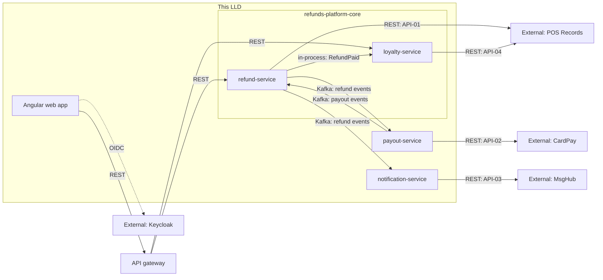

<!--
CHUNK: 02
TITLE: Context - Bounded Context & System Neighbours
PROJECT: Refunds Platform
VERSION: 1.0
PART OF: LLD - Refunds Platform
-->

# 5. Context

## 5.1 Bounded Context

This LLD covers all four bounded contexts of [SDD §8.1.3](../sdd-refunds-platform/04-architecture-style-and-diagrams.md#813-how): refund and loyalty (modules of the `refunds-platform-core` deployable, schemas `refund` and `loyalty` in the core database, plus the module-neutral `core_events` schema), payout (payout-service, own database), and customer messaging (notification-service, own database), and the Angular web app that fronts refund and loyalty. The style is the hybrid of [SDD ADR-01](../sdd-refunds-platform/06-principles-and-decisions.md#10-architectural-decisions): in-process domain events between the two modules, Kafka integration events through the outbox between deployables, no HTTP between deployables (ADR-05).

## 5.2 Upstream Producers (callers / event-publishers into this system)

| Upstream | Interaction | Protocol | Notes |
|----------|-------------|----------|-------|
| Angular web app, through the API gateway | Sync REST | HTTPS | The 12 client-facing endpoints of 06 § 9.1 (refund-service and loyalty-service). |
| API gateway (Spring Cloud Gateway) | Sync REST (proxy) | HTTPS | Validates the JWT, resolves the tenant, applies the receipt-lookup rate limit, forwards `Authorization`, `X-Correlation-Id`, `traceparent` ([SDD §16.2](../sdd-refunds-platform/12-centralized-user-roles.md#162-resolution-model---how-a-role-becomes-an-allowed-action)). |
| Keycloak | Token issuer | HTTPS (OIDC, JWKS) | The core re-validates the JWT against the realm's JWKS (ADR-07). |
| POS Records | Sync REST response to our pull | HTTPS | API-01 (receipt lookup) and API-04 (member purchases), both `TBD - external`. |
| refund-service (to payout-service and notification-service) | Async event | Kafka | `refunds-platform-refund-events` (07 § 10.1). |
| payout-service (to refund-service) | Async event | Kafka | `refunds-platform-payout-events` (07 § 10.1). |
| refund-service module (to loyalty-service module) | In-process event | In-process | `RefundPaid` (07 § 10.6). |
| Schedulers inside each deployable | Schedule | In-process | `payout-watchdog`, `payout-retry`, `message-retry`, `loyalty-purchase-import`, the outbox relays, and the publication-log replay. |

## 5.3 Downstream Consumers (systems this LLD's services call / publish to)

| Downstream | Interaction | Protocol | Notes |
|------------|-------------|----------|-------|
| POS Records | Sync REST | HTTPS | API-01 from refund-service, API-04 from loyalty-service. |
| Payment Provider CardPay | Sync REST | HTTPS | API-02 from payout-service. |
| Notification Partner MsgHub | Sync REST | HTTPS | API-03 from notification-service. |
| Kafka | Async event | Kafka | Two topics and three DLQ topics (07 § 10.1, § 10.5). |
| loyalty-service module | In-process event | In-process | `RefundPaid` from refund-service. |

## 5.4 Cross-Service Dependencies (within this LLD)

**Summary:** The web app reaches the two core modules only through the gateway; refund-service hands paid refunds to loyalty-service in process and exchanges refund and payout facts with the two extracted services only through Kafka. Each deployable calls its own external provider, one hop deep, and no deployable calls another over HTTP.

> **Convention:** keep this diagram service-level (not class-level). Class-level wiring lives in `04-implementation/<service>.md`. In a modular monolith, label module-to-module edges `in-process: [Port.operation]` or `in-process: [EventName]` (SDD §24.7 and §14.10), never as REST or topic edges.

## 5.5 Shared Conventions (apply to every service in scope)

- **Auth:** Keycloak, one realm for every tenant, OIDC authorization code with PKCE for the web app (ADR-07); the gateway and the core validate the JWT; no service-to-service HTTP, so no client-credentials token exists (SDD §16.3). Kafka clients authenticate per deployable with topic ACLs ([SDD §11.6](../sdd-refunds-platform/07-cross-cutting-concerns.md#116-security-default)).
- **Tenant resolution:** the `tenant_id` JWT claim on web calls (resolved at the gateway, re-read by the core); the envelope `tenant_id` on Kafka consumers; the `tenantId` field of `RefundPaidEvent` in process (SDD §11.2, §14.10).
- **Correlation ID:** `X-Correlation-Id` (UUID, [SDD §15.1](../sdd-refunds-platform/11-api-contracts.md#151-contract-conventions-platform-defaults)); the gateway creates it when absent; each deployable puts it in the MDC as `correlation_id`, copies it into the envelope `correlation_id` of every event it writes, and passes it on outbound provider calls where the provider accepts it.
- **Time zone:** UTC for all timestamps (CLAUDE.md default); the tenant time zone is used only for the 30-day window and the report day (SDD §11.2).
- **ID strategy:** UUIDv7 generated at the service layer (CLAUDE.md default) by the commons `IdGenerator` (09 § 12.9).

<!-- MASTER: refunds-platform-lld-master.md | PREV: 01-purpose-and-scope.md | NEXT: 03-architecture.md -->
