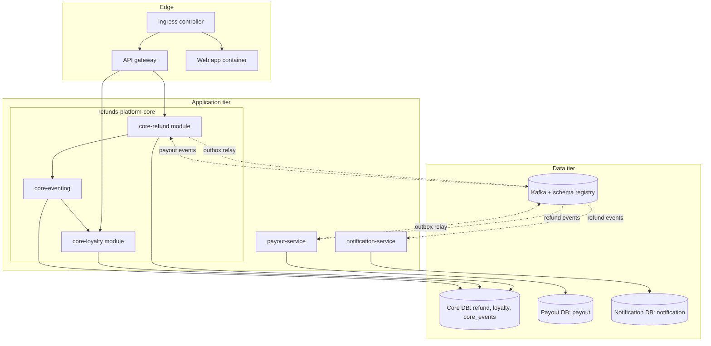

<!--
CHUNK: 03
TITLE: Architecture Overview - Components & Deployment
PROJECT: Refunds Platform
VERSION: 1.0
PART OF: LLD - Refunds Platform
-->

# 6. Architecture Overview

> **Note:** this chunk is a high-level orientation. Per-service detail lives in `04-implementation/<service>.md`. If you need class-level or method-level detail, jump straight there.

## 6.1 Component Topology

**Summary:** Three backend deployables and the web app container sit behind one ingress; the core holds the two modules and the module-neutral eventing component that carries `RefundPaid` from refund to loyalty. Each deployable owns its PostgreSQL data, and the two outbox relays are the only writers to Kafka.

**Build layout of `refunds-platform-core`** (enforces the ADR-01 rule "no cross-module imports except ports" in the build, with no extra tool):

| Build module | Contains | May depend on |
|--------------|----------|---------------|
| `core-contracts` | The in-process event records (`RefundPaidEvent`) and nothing else | none |
| `core-eventing` | `DurableEventPublisher`, `EventPublicationDispatcher`, `EventPublicationReplayJob`, the `core_events` migrations | `core-contracts`, `refunds-platform-commons` |
| `core-refund` | The refund-service module (04) and the `refund` migrations | `core-contracts`, `core-eventing` (publisher interface only), `refunds-platform-commons` |
| `core-loyalty` | The loyalty-service module (04) and the `loyalty` migrations | `core-contracts`, `core-eventing` (handler interface only), `refunds-platform-commons` |
| `core-app` | The Spring Boot application, security, configuration | all of the above |

> Confirm: build layout and module names are this LLD's proposal for the ADR-01 build rule; the team may prefer ArchUnit tests (a new test dependency) over build-module separation.

## 6.2 Deployment Topology

| Concern | Choice | Source / Rationale |
|---------|--------|--------------------|
| Container | Docker/OCI image per deployable: `refunds-platform-core`, `payout-service`, `notification-service`, `refunds-platform-web` | CLAUDE.md default; [SDD §11.3](../sdd-refunds-platform/07-cross-cutting-concerns.md#113-deployment-default) |
| Orchestrator | On-prem Kubernetes, one Helm chart per deployable | ADR-09 |
| Namespace strategy | One namespace per environment (Dev, SIT, UAT, Prod), all tenants in one release | [SDD §19](../sdd-refunds-platform/15-environments.md#19-environments); ADR-03 shared schema |
| Service mesh / Ingress | Kubernetes ingress controller in front of the API gateway and the web container; no service mesh | SDD §6 Service Mesh / Ingress row |
| Replicas (per deployable, baseline) | core 2 min / 6 max; payout-service 2 / 3; notification-service 2 / 3; web 2 / 4 | SDD §11.3 leaves them open |
| Deployment strategy | Rolling update with readiness gates; Flyway migrations run before the new version takes traffic | SDD §11.3 |

> TODO: replica counts and CPU and memory requests and limits are best guesses sized for the SDD §18.1 load (about 40 requests a day, three times that in seasonal sales) - verify against [SDD §11.3](../sdd-refunds-platform/07-cross-cutting-concerns.md#113-deployment-default), which marks them NEEDS CLARIFICATION.

## 6.3 Runtime Stack

| Layer | Technology | Version | Source |
|-------|-----------|---------|--------|
| Language | Java | 21 | [SDD §6](../sdd-refunds-platform/02-ecosystem-overview.md#6-ecosystem-overview) Backend Runtime row |
| Framework | Spring Boot | 3.5+ | [SDD §6](../sdd-refunds-platform/02-ecosystem-overview.md#6-ecosystem-overview) Backend Runtime row |
| Build | Maven or Gradle (multi-module) | Not pinned | Neither SDD §6 nor CLAUDE.md pins it |
| Database | PostgreSQL | 17+ | [SDD §6](../sdd-refunds-platform/02-ecosystem-overview.md#6-ecosystem-overview) Primary RDBMS row |
| Message Broker | Apache Kafka with a schema registry (JSON Schema payloads) | Not pinned (SDD NEEDS CLARIFICATION) | [SDD §6](../sdd-refunds-platform/02-ecosystem-overview.md#6-ecosystem-overview) Event Broker / Streaming row |
| Cache | None | - | [SDD §6](../sdd-refunds-platform/02-ecosystem-overview.md#6-ecosystem-overview) Caching row (Not applicable) |
| Auth | Keycloak, one realm | Not pinned (SDD NEEDS CLARIFICATION) | [SDD §6](../sdd-refunds-platform/02-ecosystem-overview.md#6-ecosystem-overview) IAM / AuthN row |
| API gateway | Spring Cloud Gateway | Not pinned (SDD NEEDS CLARIFICATION) | [SDD §6](../sdd-refunds-platform/02-ecosystem-overview.md#6-ecosystem-overview) API Gateway row |
| Migrations | Flyway | Spring Boot 3.5 managed version | [SDD §11.1](../sdd-refunds-platform/07-cross-cutting-concerns.md#111-db-modeling-default) (the §6 table has no row) |
| Resilience | Resilience4j | Not pinned | CLAUDE.md default (SDD §12 names the policies, not the library) |
| Observability | Prometheus + Grafana; OpenTelemetry; structured JSON logs to a central aggregator | Not pinned (SDD NEEDS CLARIFICATION) | [SDD §6](../sdd-refunds-platform/02-ecosystem-overview.md#6-ecosystem-overview) Observability rows |
| Container runtime / orchestration | containerd on on-prem Kubernetes | Not pinned (SDD NEEDS CLARIFICATION) | [SDD §6](../sdd-refunds-platform/02-ecosystem-overview.md#6-ecosystem-overview) Compute and Container Runtime rows |
| Frontend (if applicable) | Angular (standalone components) with PrimeNG and Tailwind | Angular 17+ | [SDD §6](../sdd-refunds-platform/02-ecosystem-overview.md#6-ecosystem-overview) Frontend Stack row |

> TODO: the version pins of Kafka, the schema registry product, Keycloak, Spring Cloud Gateway, the observability stack, containerd, and the Kubernetes distribution are NEEDS CLARIFICATION in SDD §6, and the build tool is pinned nowhere; this LLD pins none of them - verify with the platform team and record them in SDD §6.

> **Convention:** each Source cell links the SDD §6 row it derives from (no SDD: the dependency manifest); a value that disagrees with SDD §6 is drift to flag (`sdd-to-lld.md` § One fact, one home, rule 3). A CLAUDE.md default fills only a row neither pins, flagged `> Confirm:`.

> Confirm: Resilience4j fills the resilience row from CLAUDE.md because SDD §6 names no library for the §12 timeouts, retries, circuit breakers, and bulkheads.

## 6.4 Architectural Style - As Operationalised

> **Inherits from:** SDD §8.1 Architecture Style ([SDD §8.1](../sdd-refunds-platform/04-architecture-style-and-diagrams.md#81-architecture-style), ADR-01).
>
> **What this section adds:** the concrete operationalisation. Where the SDD says "event-driven microservices", this section names the topics, the consumer-group conventions, the schema-registry choice, the outbox-table convention. Where it says "modular monolith" (its ADR-01), this section names the module boundaries, the ports, and the in-process events.

- **Service boundary rule:** one service or module = one bounded context = one private PostgreSQL schema (`refund`, `loyalty` in the core database; `payout`, `notification` in their own databases). No cross-schema reads; `core_events` is written only by `core-eventing`.
- **Module boundaries (core):** the build layout in § 6.1; the only module-to-module interaction is the in-process `RefundPaid` event (07 § 10.6). There is no in-process port contract (06 § 9.6).
- **Inter-service async:** topics exactly as [SDD §14.4](../sdd-refunds-platform/10-events-hub.md#144-topic-registry) names them: `refunds-platform-refund-events` and `refunds-platform-payout-events`, message key `refundRequestId`; one consumer group per consuming deployable named after it (`refund-service`, `payout-service`, `notification-service`); DLQ `<topic>.<consumer group>.dlq`; JSON Schema subjects in the schema registry, additive changes only (07).
- **Inter-service sync:** forbidden between deployables (ADR-05). Synchronous REST exists only web app -> gateway -> core, and deployable -> external provider (API-01 to API-04), one hop.
- **Outbox pattern:** mandatory for every state-changing integration event (not for § 10.6 in-process events). Implementation per `09-cross-cutting.md` § Outbox. Outbox table `outbox_event` in the producer's schema (refund-service, payout-service); one `OutboxRelay` per deployable under an advisory lock.
- **Saga choreography vs orchestration:** choreography (CLAUDE.md default) for the one cross-service flow, the refund payout (refund-service -> `REFUND_APPROVED` -> payout-service -> `PAYOUT_SUCCEEDED` / `PAYOUT_FAILED` -> refund-service); no orchestrator (09 § 12.5).
- **Hexagonal layout per deployable:** `adapter.in.web`, `adapter.in.messaging`, `adapter.in.scheduling`, `application` (services), `domain`, `port.out`, `adapter.out` (provider clients, persistence), following [SDD §6](../sdd-refunds-platform/02-ecosystem-overview.md#6-ecosystem-overview) ecosystem rules.

<!-- MASTER: refunds-platform-lld-master.md | PREV: 02-context.md | NEXT: 04-implementation/loyalty-service.md -->
