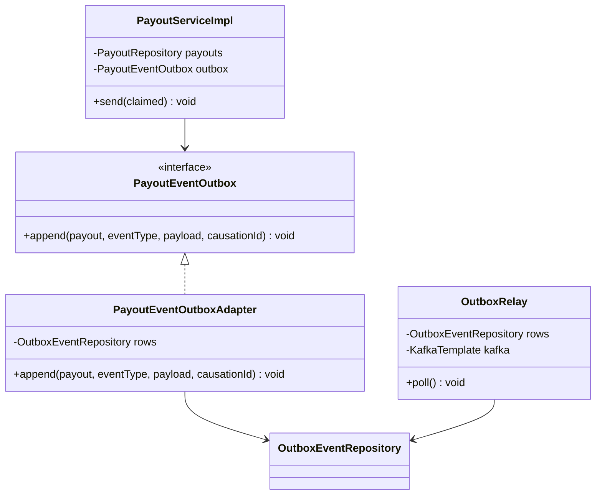
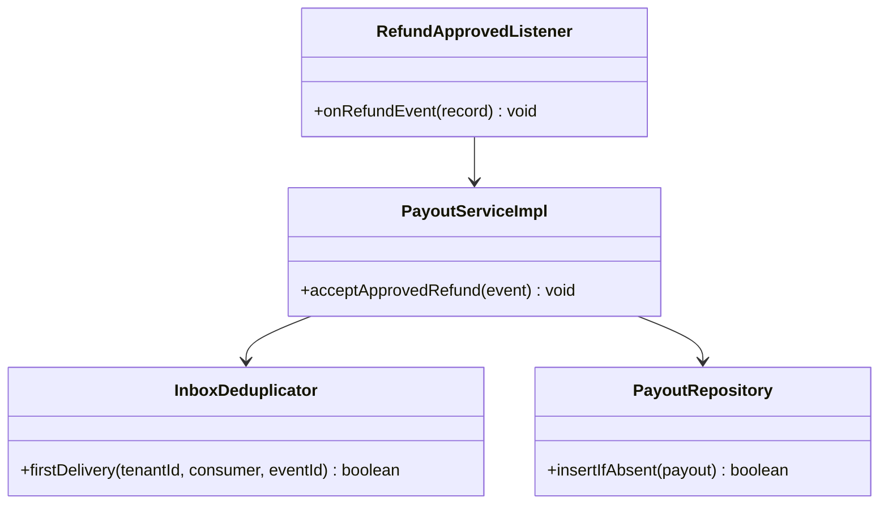
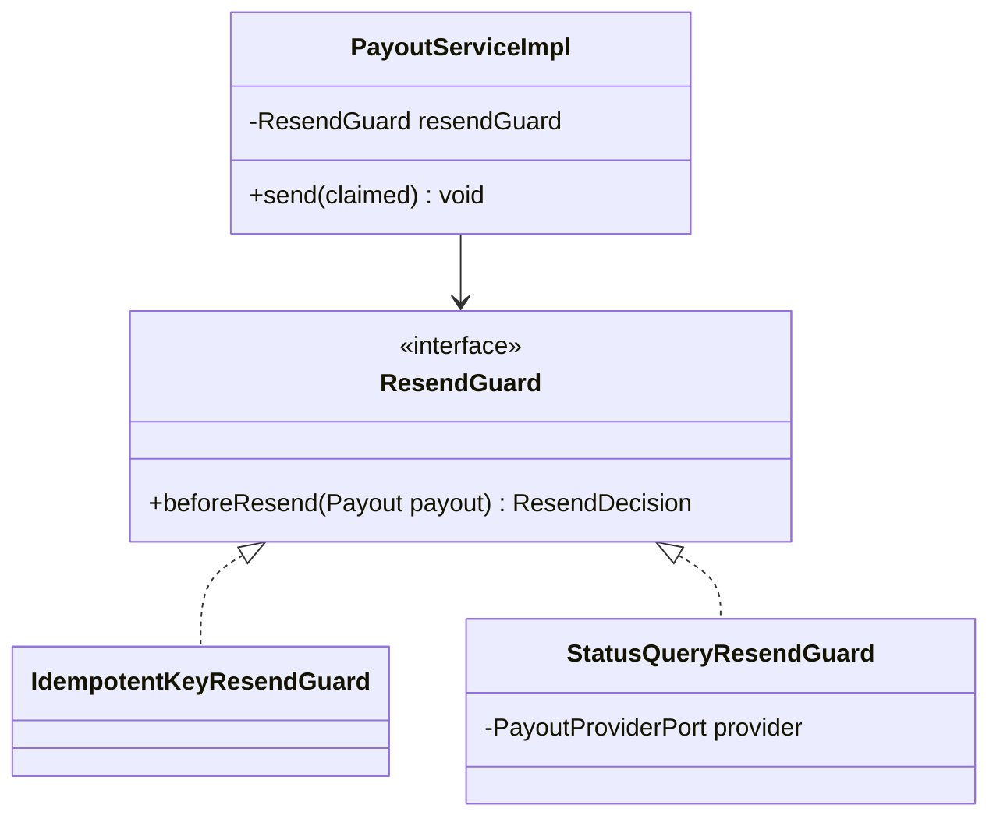
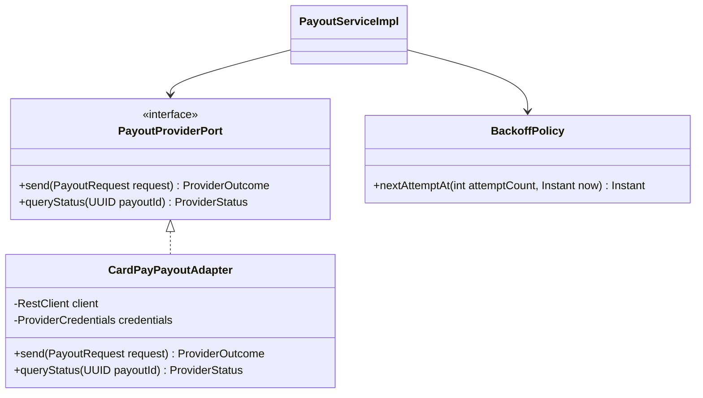
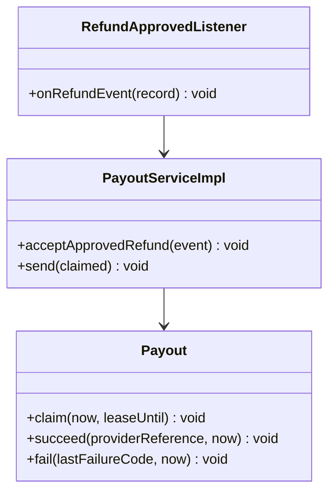
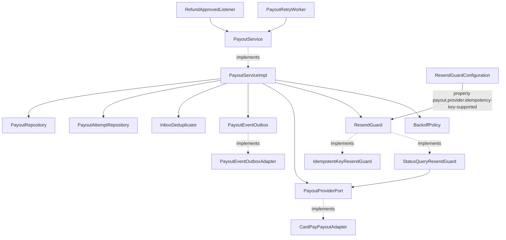
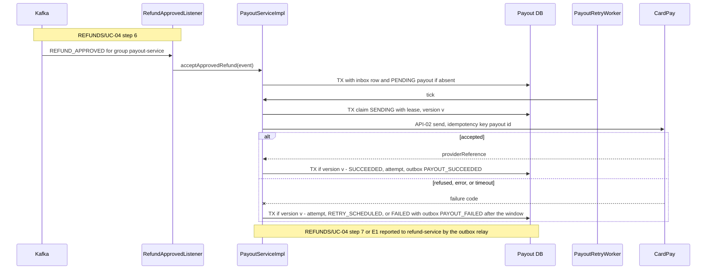

<!--
CHUNK: 04
TITLE: Per-Service Implementation - payout-service
PROJECT: Refunds Platform
VERSION: 1.0
DEPENDS_ON: 03, 09
PART OF: LLD - Refunds Platform
-->

# 7. Per-Service Implementation - payout-service

> **Bounded context:** payout ([SDD §13](../../sdd-refunds-platform/09-services-summary.md#13-services-decomposition-summary) row payout-service; [SDD §17.2 Boundaries](../../sdd-refunds-platform/13b-service-payout.md#boundaries))
>
> **Type:** service (SDD §13 Type; its own deployable and database)
>
> **Source code:** `payout-service/` (not created yet)
>
> **Owns use cases (SDD 09):** None - pays approved refunds and reports the payout results
>
> **Participates in:** REFUNDS/UC-04 (owner: refund-service)

---

## 7.1 Responsibility

payout-service owns the `Payout` aggregate and its `PayoutAttempt` rows in its own database (schema `payout`), plus its outbox and inbox ([SDD §17.2](../../sdd-refunds-platform/13b-service-payout.md#172-payout-service)). It consumes `REFUND_APPROVED` from `refunds-platform-refund-events` (group `payout-service`, reading only that event type and storing none of its contact fields, ADR-10), creates exactly one payout per refund, sends it to CardPay through API-02 from a lease-based worker with the payout id as the provider idempotency key, retries within the SDD §17.2 retry window, and reports `PAYOUT_SUCCEEDED` or `PAYOUT_FAILED` on `refunds-platform-payout-events` through its outbox. It does not own refund states (refund-service), customer contact details, or card data (held by the provider only), and it never calls refund-service.

---

## 7.2 Class & Interface Map

> **Convention:** list the load-bearing classes only - controllers, services, service implementations, repositories, mappers, key domain types. Skip DTOs that are obvious from controller signatures.

> Confirm: class names follow CLAUDE.md conventions plus the SDD §17.2 Developer Notes port name (`PayoutProviderPort`); verify with the team.

### Controllers

| Class | Endpoints | Notes |
|-------|-----------|-------|
| None (no business REST API) | `/actuator/health/liveness`, `/actuator/health/readiness`, `/actuator/prometheus` only | Platform endpoints; SDD §17.2 List of APIs has no row |
| `RefundApprovedListener` (inbound messaging adapter) | `@KafkaListener` on `refunds-platform-refund-events`, group `payout-service` | A `RecordFilterStrategy` drops every record whose `event_type` header is not `REFUND_APPROVED` before deserialization (ADR-10); no `@UseCase` (09 § 12.8) |
| `PayoutRetryWorker` (inbound scheduling adapter) | `@Scheduled` worker `payout-retry` | Claims due payouts with `FOR UPDATE SKIP LOCKED`, so every replica can run it |

> **Convention:** every entry point a § 7.8 traceability line names (REST method, event listener, scheduled job) carries `@UseCase("[KEY]/UC-NN")` with that use case's keyed ID (`09-cross-cutting.md` § 12.8). Platform endpoints carry none.

### Services (interfaces)

| Interface | Purpose | Implementations |
|-----------|---------|-----------------|
| `PayoutService` | Accept an approved refund; claim, send, and settle due payouts | `PayoutServiceImpl` |
| `PayoutProviderPort` (outbound port) | API-02: send a payout, query a payout's status | `CardPayPayoutAdapter` |
| `ResendGuard` (strategy) | Decide what to do before a payout is sent again | `IdempotentKeyResendGuard`, `StatusQueryResendGuard` |
| `PayoutEventOutbox` (outbound port) | Append `PAYOUT_SUCCEEDED` / `PAYOUT_FAILED` to the outbox in the caller's transaction | `PayoutEventOutboxAdapter` |

### Service Implementations

| Class | Implements | Key methods |
|-------|------------|-------------|
| `PayoutServiceImpl` | `PayoutService` | `acceptApprovedRefund(...)`, `claimNextDue(...)`, `send(...)`, `settle(...)` |
| `CardPayPayoutAdapter` | `PayoutProviderPort` | `send(PayoutRequest)`, `queryStatus(UUID payoutId)`; Resilience4j instances `cardPay` |
| `IdempotentKeyResendGuard` | `ResendGuard` | `beforeResend(Payout)` always returns `SEND` (CardPay honours the key) |
| `StatusQueryResendGuard` | `ResendGuard` | `beforeResend(Payout)` queries the status first: `ALREADY_ACCEPTED`, `SEND`, or `HOLD` |
| `BackoffPolicy` | domain service | `nextAttemptAt(int attemptCount, Instant now)` exponential backoff with jitter |
| `PayoutEventOutboxAdapter` | `PayoutEventOutbox` | `append(payout, eventType, payload, causationId)` |

### Repositories

| Class | Entity | Notes |
|-------|--------|-------|
| `PayoutRepository` | `Payout` | `insertIfAbsent(...)` (`ON CONFLICT (tenant_id, refund_request_id) DO NOTHING`), `claimNextDue(now)` native `SELECT ... FOR UPDATE SKIP LOCKED LIMIT 1` under the worker role |
| `PayoutAttemptRepository` | `PayoutAttempt` | Insert only |
| `OutboxEventRepository`, `InboxMessageRepository` | commons entities | Schema `payout` |

### Domain Types (records)

| Type | Kind | Purpose |
|------|------|---------|
| `Payout` | entity (aggregate root) | Transitions of 08 § 11.1; owns the retry window; `@Version`; `@TenantId` |
| `PayoutAttempt` | entity | One row per API-02 call |
| `PayoutStatus` | enum | `PENDING`, `SENDING`, `RETRY_SCHEDULED`, `SUCCEEDED`, `FAILED` |
| `ProviderOutcome` | sealed interface | `Accepted(providerReference)`, `Refused(providerCode)`, `TransientFailure(providerCode)`, `NotSent(reason)` |
| `ResendDecision` | sealed interface | `Send`, `AlreadyAccepted(providerReference)`, `Hold` |
| `PayoutRequest` | record | Payout id (idempotency key), `Money`, the original-payment reference (see TODO in § 7.4) |
| `RefundApprovedForPayout` | record | The subset of `REFUND_APPROVED` this service maps: `referenceNumber`, `receiptNumber`, `approvedAmount` (unknown properties ignored, so contact fields are never bound) |
| `PayoutSucceededPayload`, `PayoutFailedPayload` | record | 07 § 10.2 |

### Method Signatures (key methods only)

```java
public interface PayoutService {
  void acceptApprovedRefund(EventEnvelope<RefundApprovedForPayout> event);
  Optional<ClaimedPayout> claimNextDue(Instant now);
  void send(ClaimedPayout claimed);
}

public interface PayoutProviderPort {
  ProviderOutcome send(PayoutRequest request);
  ProviderStatus queryStatus(UUID payoutId);
}

public interface ResendGuard {
  ResendDecision beforeResend(Payout payout);
}

public interface PayoutEventOutbox {
  void append(Payout payout, String eventType, Object payload, UUID causationId);
}
```

> **Convention:** records are used for all DTOs (CLAUDE.md default). Constructor injection only - no `@Autowired` on fields.

### Ports and Adapters (in-process contracts)

Not applicable - no in-process contracts: payout-service is a separate deployable, not a core module; SDD §15 gives it only the External outbound contract API-02.

### Authorization

| Entry point | Kind | Permission token (SDD §16, verbatim) | Enforcement point |
|-------------|------|--------------------------------------|-------------------|
| `RefundApprovedListener.onRefundEvent` | Listener | None - system consumer | Kafka ACL: group `payout-service` may read `refunds-platform-refund-events`; only payout-service may write `refunds-platform-payout-events` ([SDD §17.2 Constraints](../../sdd-refunds-platform/13b-service-payout.md#constraints)) |
| `PayoutRetryWorker.tick` | Job | None - system job | Worker database role |
| `/actuator/health/*`, `/actuator/prometheus` | REST (platform) | None | Management port reachable only inside the cluster (network policy) |

> **Convention:** one row per entry point of this service (REST method, event listener, scheduled job, in-process port). Tokens are the SDD §16 permission tokens, verbatim; the role catalogue stays in the SDD (`sdd-to-lld.md` § One fact, one home). On an internal HTTP entry point the provider's filter or sidecar checks the caller's client-credentials token against the token (SDD §15.1). From code with no SDD: the scopes the code checks.

---

## 7.3 Method-Level Pseudocode (non-trivial logic only)

> **Convention:** include pseudocode only for methods where the algorithm is non-obvious. Skip for plain CRUD.

### `PayoutServiceImpl.acceptApprovedRefund`

```text
TX (REQUIRED):
1. tenantContext.set(event.tenantId)
2. inbox.firstDelivery(tenant, "payout-service", event.eventId) == false -> return        (redelivery)
3. payouts.insertIfAbsent(Payout.pending(id = idGen.next(), tenant, refundRequestId = event.aggregateId,
                          referenceNumber, receiptNumber, amount = approvedAmount, nextAttemptAt = now,
                          sourceEventId = event.eventId))
   conflict on (tenant_id, refund_request_id) -> no-op (a second REFUND_APPROVED never makes a second payout)
COMMIT                          (no provider call in the consumer transaction, SDD §17.2 Developer Notes)
```

> **Confidence:** High - SDD §17.2 Accept a payout.

### `PayoutServiceImpl.claimNextDue` and `send`

```text
PayoutRetryWorker.tick(): repeat up to PAYOUT_CLAIM_BATCH times: claimNextDue(now).ifPresent(send)

claimNextDue(now):   TX (worker role)
  p = payouts.claimNextDue(now):  (status in (PENDING, RETRY_SCHEDULED) and next_attempt_at <= now)
                                   or (status = SENDING and lease_until < now)
                                   order by next_attempt_at, FOR UPDATE SKIP LOCKED, LIMIT 1
  none -> return empty
  tenantContext.set(p.tenantId)
  resend = p.status == SENDING or p.attemptCount > 0
  p.claim(now, leaseUntil = now + cardPayTimeout + 1 min)   -> SENDING, first_attempt_at ??= now, version + 1
  COMMIT; return ClaimedPayout(p.id, p.tenantId, p.version, resend)

send(c):   (no TX open during the provider call)
  p = payouts.findById(c.id)
  if c.resend:
    switch resendGuard.beforeResend(p):
      AlreadyAccepted(ref) -> settle(c, Accepted(ref)); return
      Hold                 -> settle(c, Hold); return
      Send                 -> continue
  outcome = provider.send(PayoutRequest(p.id, p.amount, originalPaymentReference(p)))   (API-02, Resilience4j cardPay)
  settle(c, outcome)

settle(c, outcome):   TX
  tenantContext.set(c.tenantId); p = payouts.findById(c.id)
  p.version != c.version or p.status != SENDING -> return          (lease lost; the new owner settles)
  outcome is not NotSent -> attempts.insert(PayoutAttempt(p.id, p.attemptCount + 1, now, outcome.code))
  switch outcome:
    Accepted(ref)  -> p.succeed(ref, now)
                      outbox.append(p, "PAYOUT_SUCCEEDED", PayoutSucceededPayload(p.refundRequestId, p.amount, ref), null)
    Hold           -> p.scheduleRetry(now + STATUS_QUERY_DELAY, "STATUS_UNKNOWN", held = true); counter payouts_held
    Refused, TransientFailure, NotSent ->
                      if !p.held and now >= p.firstAttemptAt + retryWindow:
                        p.fail(lastFailureCode = mapToErrorCode(outcome), now)
                        outbox.append(p, "PAYOUT_FAILED", PayoutFailedPayload(p.refundRequestId, p.attemptCount,
                                      p.firstAttemptAt, p.lastFailureCode), null)
                      else p.scheduleRetry(backoff.nextAttemptAt(p.attemptCount, now), outcome.code)
  COMMIT
```

> **Confidence:** High for claim, lease, version check, success, retry, and failure (SDD §17.2 Send, Succeed, Retry for one day, Figures 18 and 20). The `Hold` handling is this LLD's reading of "held and alerted instead of re-sent".

> Confirm: a held payout (CardPay status unreadable) keeps being re-queried and is never failed automatically when the retry window passes, because failing it could hide a payout CardPay actually made (REFUNDS/NFR-01); `payouts_held` above zero pages and RB-05 (10 § 13.8) reconciles it by hand.

> TODO: whether time spent with the `cardPay` circuit open (outcome `NotSent`, no attempt row) counts against the retry window is open in [SDD chunk 18 Reviewer Notes](../../sdd-refunds-platform/18-open-items-and-clarifications.md#reviewer-notes); this LLD counts it (wall-clock window from the first attempt), so a CardPay outage longer than the window fails every pending payout at once - verify with the REFUNDS owner together with the SDD §17.2 `FAILED` clarification.

---

## 7.4 Design Patterns Applied

> **Convention:** every applied pattern carries name, triggering CLAUDE.md rule, roles, rationale specific to this service, Mermaid class diagram, and pseudocode skeleton. Patterns inferred from code (from-code) include `> Confirm:` unless a test exercises the pattern (`confidence-rules.md`); patterns proposed (from-sdd) carry the rule attribution explicitly.

**Not applied:** RFC 9457 error model (payout-service exposes no business REST API; provider errors become `lastFailureCode` values, SDD §17.2 API Standards).

### Pattern: Outbox

> **Applied:** Outbox pattern (CLAUDE.md: "Outbox pattern is mandatory for any state change that must produce an event. No dual-writes to DB and Kafka.")
>
> **Rationale (this service):** a payout reaching `SUCCEEDED` or `FAILED` must tell refund-service exactly once in effect; a dual-write could mark a payout succeeded while `PAYOUT_SUCCEEDED` is lost, leaving the refund APPROVED forever (only the watchdog would notice). The outbox row commits with the terminal transition, and the relay marks it published only after the broker acknowledges.

**Roles:**

| Role | Class / Component | Notes |
|------|-------------------|-------|
| Outbox table | `payout.outbox_event` (05 § 8.2) | Topic `refunds-platform-payout-events`, message key `refundRequestId` |
| Outbox writer | `PayoutEventOutboxAdapter.append`, called in `settle` | Same transaction as `succeed` / `fail` |
| Outbox publisher | `OutboxRelay` (commons), one active instance per deployable (advisory lock `outbox-relay-payout`) | Delivery rules in 09 § 12.4 |

**Class diagram:**



**Pseudocode skeleton:**

```text
settle(...): p.succeed(ref, now); outbox.append(p, "PAYOUT_SUCCEEDED", payload, null)      (one TX)

OutboxRelay.poll():                                   (advisory lock held)
  for row in rows.findUnpublishedOldestFirst(OUTBOX_BATCH_SIZE):
    outcome = kafka.send(row.topic, row.messageKey, row.payload, headers).get(OUTBOX_SEND_TIMEOUT_MS)
    if outcome != ACKED: return                        (row stays unpublished and is retried next poll)
    rows.markPublished(row.eventId, now)
```

**Delivery rules:** `09-cross-cutting.md` § 12.4 (published only after `ACKED` with `acks=all`; `FAILED` / `TIMED_OUT` leaves the row unpublished; a re-send after an acknowledged-but-unmarked row carries the same `event_id`, which refund-service's inbox dedupes).

### Pattern: Idempotency (consumer inbox, one payout per refund, provider idempotency key)

> **Applied:** Idempotency (CLAUDE.md: "Idempotency keys on all write endpoints touching money/wallet/notifications or external providers." and "Idempotency on every consumer and every write endpoint. Assume at-least-once delivery everywhere.")
>
> **Rationale (this service):** REFUNDS/NFR-01 forbids a double payout. Three layers make every repeat harmless: the inbox drops a redelivered `REFUND_APPROVED`, the unique `(tenant_id, refund_request_id)` makes a second approval a no-op, and the stable payout id sent as CardPay's idempotency key on every attempt protects the provider side.

**Roles:**

| Role | Class / Component |
|------|-------------------|
| Inbox | `payout.inbox_message` + `InboxDeduplicator` |
| Unique payout | `ux_payout_refund` on `(tenant_id, refund_request_id)` + `PayoutRepository.insertIfAbsent` |
| Provider idempotency key | `Payout.id` in every `PayoutRequest` |

**Class diagram:**



**Pseudocode skeleton:**

```text
acceptApprovedRefund(e): if !inbox.firstDelivery(t, "payout-service", e.eventId): return
                         payouts.insertIfAbsent(...)          (unique per refund)
send(...):               provider.send(PayoutRequest(idempotencyKey = payout.id, ...))   (same key on every attempt)
```

### Pattern: Strategy (re-send guard)

> **Applied:** Strategy (CLAUDE.md: "Strategy for runtime variants")
>
> **Rationale (this service):** the behaviour before a re-send depends on a provider capability that is still unknown ([SDD §15.6](../../sdd-refunds-platform/11-api-contracts.md#156-external-contracts-awaiting-the-user)): if CardPay honours idempotency keys, a re-send with the same key is safe; if not, the status must be queried first and an unreadable status must hold the payout (SDD §17.2 Send). A strategy selected by configuration (`payout.provider.idempotency-key-supported`) lets the answer arrive late without touching `PayoutServiceImpl`.

**Roles:**

| Role | Class / Component |
|------|-------------------|
| Strategy interface | `ResendGuard` |
| Concrete strategies | `IdempotentKeyResendGuard`, `StatusQueryResendGuard` |
| Context | `PayoutServiceImpl.send`, given the guard by `ResendGuardConfiguration` from the property |

**Class diagram:**



**Pseudocode skeleton:**

```text
IdempotentKeyResendGuard.beforeResend(p) = Send
StatusQueryResendGuard.beforeResend(p):
  s = provider.queryStatus(p.id)       (Resilience4j cardPayStatus)
  ACCEPTED(ref) -> AlreadyAccepted(ref);  NOT_FOUND or REFUSED -> Send;  unreadable -> Hold
```

> Confirm: Strategy is a CLAUDE.md guideline pattern applied because the provider capability is unknown; once CardPay's documentation settles it, the unused guard can be deleted.

### Pattern: Resilience4j on API-02 (CardPay payouts)

> **Applied:** Resilience defaults (CLAUDE.md: "Resilience defaults: timeouts, retries with exponential backoff and jitter, circuit breakers (Resilience4j), bulkheads for downstream provider calls (e.g., eSIM, payment, SMS).")
>
> **Rationale (this service):** calls to CardPay may refuse, hang, or fail for up to a day ([REFUNDS/UC-04](../../brd-refunds-portal/06b-use-cases-branch-manager.md#uc-04-approve--reject-refund) E1). The per-call policy is a timeout and a circuit breaker with a bulkhead of 5; the retry with exponential backoff and jitter is not a Resilience4j in-call retry but the persisted `RETRY_SCHEDULED` schedule of `BackoffPolicy`, so retries survive restarts and never hold a thread ([SDD §12 INT-01](../../sdd-refunds-platform/08-integrations.md#12-integrations)).

**Roles:**

| Role | Class / Component |
|------|-------------------|
| Port | `PayoutProviderPort` |
| Adapter | `CardPayPayoutAdapter` (Spring `RestClient`, per-tenant credentials) |
| Policies | Resilience4j `cardPay` (TimeLimiter, CircuitBreaker, Bulkhead) and `cardPayStatus`; retry schedule in `BackoffPolicy` (09 § 12.3) |

**Class diagram:**



**Pseudocode skeleton:**

```text
@Bulkhead(name = "cardPay") @CircuitBreaker(name = "cardPay", fallbackMethod = "notSent")
ProviderOutcome send(req):
  response = client.post(API-02 URI TBD, credentials.forTenant(tenant), idempotency key = req.payoutId, body TBD)
  map response: accepted -> Accepted(providerReference); refusal -> Refused(code); 5xx or timeout -> TransientFailure(code)
notSent(req, CallNotPermittedException e) -> NotSent("CIRCUIT_OPEN")
BackoffPolicy.nextAttemptAt(n, now) = now + random(0.5, 1.0) * min(MAX_DELAY, FIRST_DELAY * 2^(n - 1))
```

> TODO: API-02 is `TBD - external` in [SDD §15.3](../../sdd-refunds-platform/11-api-contracts.md#api-02-send-a-refund-payout-to-the-original-card-payout-service---payment-provider) (URI, auth, body, errors, idempotency support, response or callback), and which reference identifies the original card payment (the receipt number, or a card payment reference POS Records does not supply) is NEEDS CLARIFICATION in [SDD §17.2 Business Logic](../../sdd-refunds-platform/13b-service-payout.md#business-logic); `originalPaymentReference(p)` returns the receipt number as a best guess - verify with CardPay before build (PCI DSS scope depends on it).

### Pattern: Saga (choreography participant)

> **Applied:** Saga, choreography variant (CLAUDE.md: "Sagas (choreography by default, orchestration when the flow is complex or needs central visibility) for cross-service business transactions. No distributed 2PC.")
>
> **Rationale (this service):** payout-service is step 2 of the refund payout saga documented in [refund-service § Pattern: Saga (choreography)](./refund-service.md#pattern-saga-choreography): it reacts to `REFUND_APPROVED`, and its only "compensation" is the bounded retry that ends in `PAYOUT_FAILED`, which refund-service turns into the branch manager's payout-failing flag.

**Roles:**

| Role | Class / Component |
|------|-------------------|
| Step trigger | `RefundApprovedListener` |
| Step action | `PayoutServiceImpl.acceptApprovedRefund`, `send`, `settle` |
| Step outcome events | `PAYOUT_SUCCEEDED`, `PAYOUT_FAILED` through the outbox |

**Class diagram:**



**Pseudocode skeleton:**

```text
on REFUND_APPROVED -> Payout PENDING -> worker -> SENDING -> SUCCEEDED + PAYOUT_SUCCEEDED
                                                           -> RETRY_SCHEDULED ... -> FAILED + PAYOUT_FAILED
```

---

## 7.5 Dependency Injection Graph

> **Convention:** constructor injection only. Document the wiring graph for non-trivial cases (3+ collaborators, or any factory/strategy/mediator wiring).



`PayoutServiceImpl` also takes `Clock`, `IdGenerator`, `TenantContext`, `PayoutProperties` (retry window, lease, batch), and `MeterRegistry`.

---

## 7.6 Transaction Boundaries

| Method | Propagation | Isolation | Rollback rules |
|--------|-------------|-----------|----------------|
| `PayoutServiceImpl.acceptApprovedRefund` | `REQUIRED` (listener-started) | `READ_COMMITTED` | Rollback on any exception; Kafka error handler retries, then dead-letters |
| `PayoutServiceImpl.claimNextDue` | `REQUIRES_NEW`, one payout per transaction | `READ_COMMITTED` | Rollback on any exception |
| `PayoutServiceImpl.send` | none (`NOT_SUPPORTED`): the API-02 call never runs inside a transaction | - | - |
| `PayoutServiceImpl.settle` | `REQUIRES_NEW` | `READ_COMMITTED` | Rollback on any exception; the lease then expires and the payout is claimed again with the same key |
| `PayoutEventOutboxAdapter.append` | `MANDATORY` | inherited | Fails fast outside the settle transaction |

> **Convention:** outbox row insert lives inside the same transaction as the aggregate write. No `@Transactional(propagation = REQUIRES_NEW)` for outbox writes - the whole point of the pattern is one-tx commit.

> Confirm: transaction propagation default applied; verify per method (the claim and settle transactions are deliberately separate so no transaction spans the provider call, SDD §17.2 Developer Notes).

---

## 7.7 Error Handling

| Exception | RFC 9457 type | `errorCode` (SDD §15.1) | HTTP Status | When thrown | Caller action |
|-----------|---------------|-------------------------|-------------|-------------|---------------|
| `ProviderRefusedException` (mapped to `Refused`) | - (no HTTP surface) | Mapped provider code, `TBD - external` | - | CardPay refuses the payout | Retried within the window (REFUNDS/UC-04 E1) |
| `ProviderUnavailableException` (mapped to `TransientFailure`) | - | `UNAVAILABLE` | - | CardPay 5xx or connection failure | Retried with backoff |
| `ProviderTimeoutException` (mapped to `TransientFailure`) | - | `UPSTREAM_TIMEOUT` | - | No response within the `cardPay` timeout | Retried with the same key (status query first when keys are not honoured) |
| `ProviderAuthenticationException` | - | `UNAUTHENTICATED` | - | CardPay rejects our credentials | Circuit opens, alert; payouts wait in `RETRY_SCHEDULED` |
| `CallNotPermittedException` (mapped to `NotSent`) | - | `UNAVAILABLE` | - | `cardPay` circuit open | Rescheduled, no attempt row |
| `EventDeserializationException` | - | - | - | `REFUND_APPROVED` fails its schema | Non-retryable: DLQ `refunds-platform-refund-events.payout-service.dlq` + alarm |
| `LeaseLostException` (internal) | - | - | - | Version changed between claim and settle | Outcome discarded; the new lease holder settles |

> **Convention:** all exceptions extend `ServiceException` (CLAUDE.md base class). Global `@RestControllerAdvice` translates to `ProblemDetails` (RFC 9457). Error envelope schema in `09-cross-cutting.md` § Error Model.

---

## 7.8 Use-Case Workflows

> **Convention:** one subsection per active use case this service owns (SDD §7.3 Owner), headed with the SDD's BRD key and the BRD's ID and title exactly. A merged or removed use case gets no block. Cross-service sagas live in the orchestrator service's file. Each workflow has: the traceability line, control flow, sequence diagram (Mermaid), idempotency points, outbox emission points, retry/timeout choices.

payout-service owns no use case (SDD 09), so it has no `KEY/UC-NN` block.

### Participates in REFUNDS/UC-04: Approve / Reject Refund

> **Owner's block:** [refund-service § REFUNDS/UC-04](./refund-service.md#refundsuc-04-approve--reject-refund) · Part realised here: REFUNDS/UC-04 step 6 (the payout is sent to the customer's original card), step 7 (the payout succeeds), E1 (the payout is retried and reported as failed after the retry window) · Entry points here: None (SDD §7.3 lists `REFUND_APPROVED`, `PAYOUT_SUCCEEDED`, and `PAYOUT_FAILED` under Events for REFUNDS/UC-04, not as entry points)

**Trigger:** `RefundApprovedListener` (no `@UseCase`, 09 § 12.8), then `PayoutRetryWorker`.

**Pre-conditions:** a committed `REFUND_APPROVED` on `refunds-platform-refund-events`.

**Post-conditions:** exactly one `Payout` for the refund, ending `SUCCEEDED` with `PAYOUT_SUCCEEDED` or `FAILED` with `PAYOUT_FAILED` in the outbox; one `payout_attempt` row per API-02 call.

**Control flow:**

```text
1. Filter on the event_type header; deserialize only REFUND_APPROVED (ADR-10)
2. TX: inbox dedup; insert PENDING payout unless one exists for the refund (REFUNDS/UC-04 step 6; REFUNDS/NFR-01)
3. Worker claims the due payout: SENDING with a lease (REFUNDS/UC-04 step 6)
4. Re-send only: resend guard (Strategy) may short-circuit to AlreadyAccepted or Hold
5. API-02 with the payout id as idempotency key, outside any TX
6. Accepted -> SUCCEEDED - outbox emission point: PAYOUT_SUCCEEDED (REFUNDS/UC-04 step 7)
7. Refused, error, timeout, or circuit open -> RETRY_SCHEDULED with backoff and jitter (REFUNDS/UC-04 E1)
8. Retry window passed -> FAILED - outbox emission point: PAYOUT_FAILED (REFUNDS/UC-04 E1; AC-2: the branch manager is told)
```

**Sequence diagram:**



**Idempotency points:** inbox `(tenant_id, "payout-service", event_id)`; `ux_payout_refund`; the payout id as CardPay's idempotency key on every attempt; version check on settle.

**Outbox emission points:** step 6 `PAYOUT_SUCCEEDED`; step 8 `PAYOUT_FAILED`.

**Retry / timeout policy:** `cardPay` timeout, circuit breaker, bulkhead (09 § 12.3); persisted retry schedule of `BackoffPolicy` within the retry window of [SDD §17.2 Constraints](../../sdd-refunds-platform/13b-service-payout.md#constraints); consumer retries then DLQ for unreadable events; relay retries until acknowledged.

**Error handling:** § 7.7; a failure never touches refund-service directly, which learns the outcome only from `PAYOUT_SUCCEEDED` / `PAYOUT_FAILED`.

<!-- MASTER: refunds-platform-lld-master.md | PREV: 04-implementation/notification-service.md | NEXT: 04-implementation/refund-service.md -->
