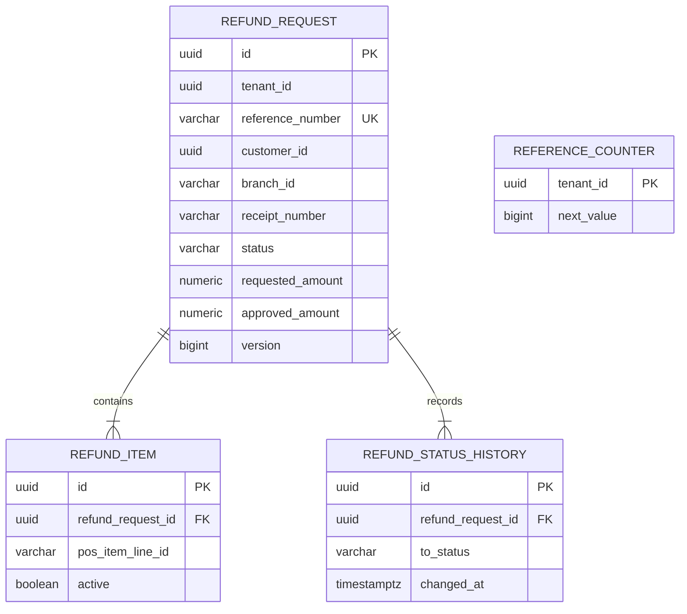
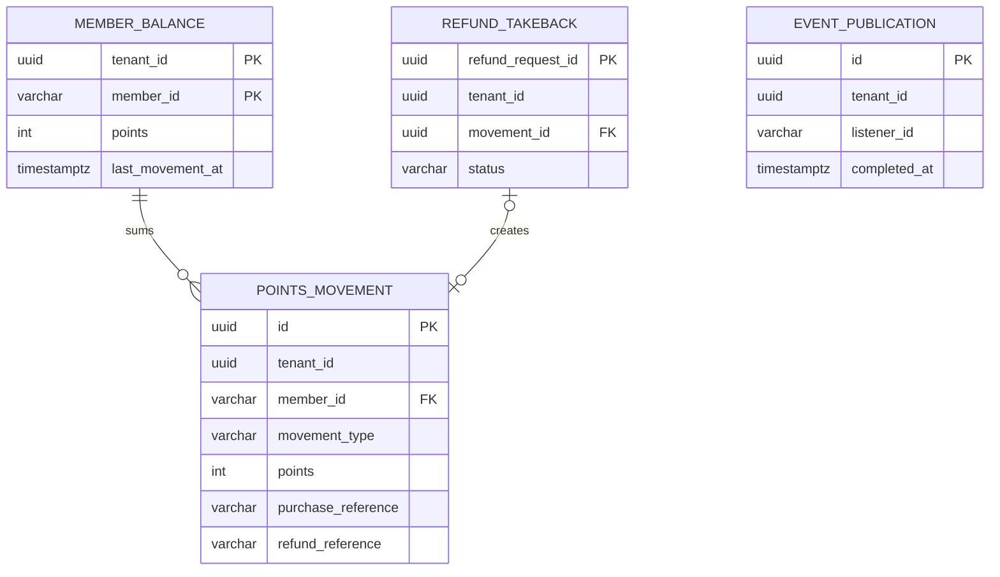
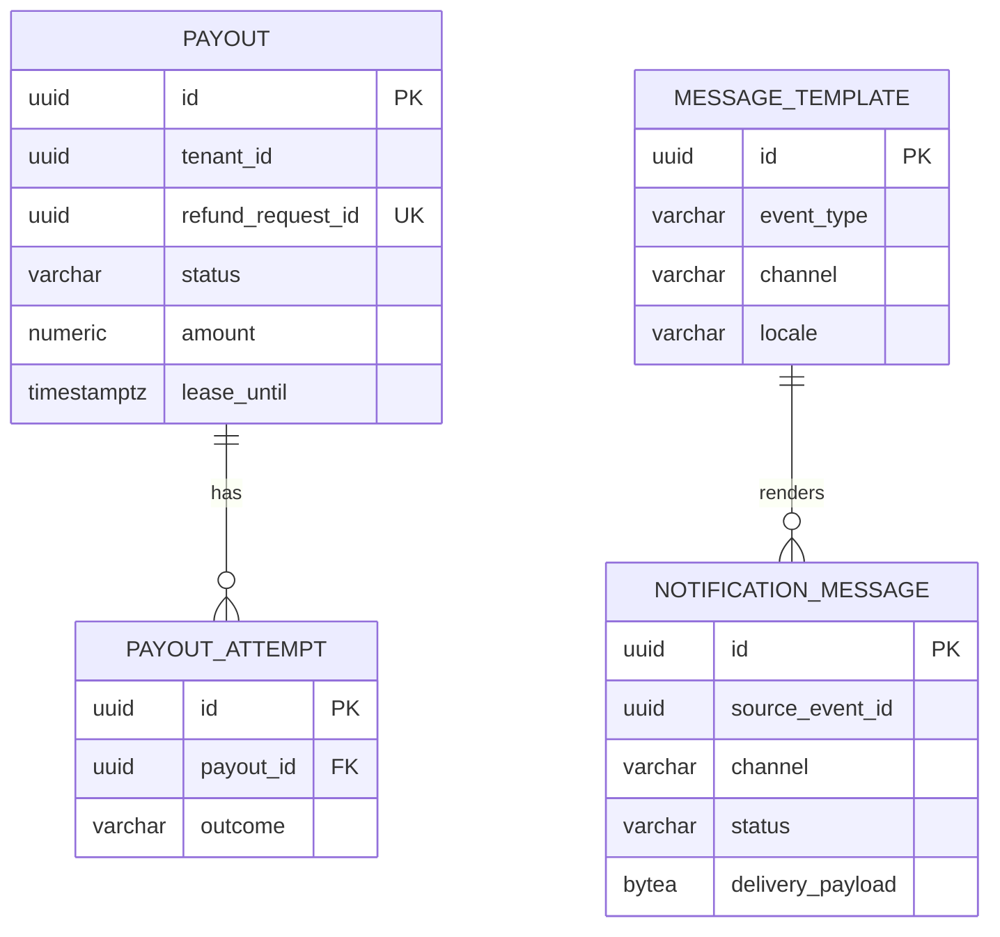

<!--
CHUNK: 05
TITLE: Data Model
PROJECT: Refunds Platform
VERSION: 1.0
DEPENDS_ON: 04
PART OF: LLD - Refunds Platform
-->

# 8. Data Model

> **Per-service ownership:** each service owns its own private PostgreSQL schema (CLAUDE.md default). This chunk covers all schemas in the LLD scope.

The SDD owns the concepts and the pinned columns ([SDD §17.1](../sdd-refunds-platform/13a-service-refund.md#tables-design), [§17.2](../sdd-refunds-platform/13b-service-payout.md#tables-design), [§17.3](../sdd-refunds-platform/13c-service-notification.md#tables-design), [§17.4](../sdd-refunds-platform/13d-service-loyalty.md#tables-design) Tables Design) and marks the full column lists NEEDS CLARIFICATION; this chunk completes them. Every row below marks its source: `SDD` (pinned there) or `LLD` (added here).

> Confirm: every column, type, and index marked `LLD` below is this LLD's completion of the SDD Tables Design; verify with the team before the first migration.

## 8.1 Entity Relationship (system-wide)

**Core database, schema `refund`** (SDD Figure 15, with the LLD tables):



**Summary:** a refund request holds its selected POS lines and one history row per transition; the per-tenant counter issues reference numbers. The outbox, inbox, idempotency, and role-permission tables stand alone (§ 8.2).

**Core database, schemas `loyalty` and `core_events`** (SDD Figure 24, with the LLD columns):



**Summary:** the balance is the sum of a member's movements, and a handled refund creates at most one take-back movement; `core_events.event_publication` belongs to no module and records each `RefundPaid` until its listener completes.

**Payout database (schema `payout`) and notification database (schema `notification`)** (SDD Figures 19 and 22):



**Summary:** one payout per refund with one row per provider call; one message per source event and channel, rendered from a versioned template. The two databases are separate and share nothing.

## 8.2 Tables (per service)

**Audit columns (SDD §11.1):** every table below also carries `created_at`, `created_by`, `updated_at`, `updated_by` (UTC; actor is the token subject or the deployable name); aggregates carry `version bigint NOT NULL DEFAULT 0`. They are not repeated per table.

### Service: `refund-service` - schema `refund`

| Table | Column | Type | Constraints | Notes |
|-------|--------|------|-------------|-------|
| `refund_request` | `id` | `uuid` | PK | SDD; UUIDv7 |
| `refund_request` | `tenant_id` | `uuid` | NOT NULL | SDD |
| `refund_request` | `reference_number` | `varchar(13)` | UNIQUE (`tenant_id`, `reference_number`) | SDD; `RF-` and 10 digits |
| `refund_request` | `customer_id` | `uuid` | NOT NULL | SDD; token subject |
| `refund_request` | `customer_email`, `customer_mobile` | `text` | NULL allowed, CHECK at least one not null | SDD (pii); CHECK is LLD |
| `refund_request` | `branch_id` | `varchar(32)` | NOT NULL | SDD; length LLD |
| `refund_request` | `receipt_number` | `varchar(64)` | NOT NULL | SDD ERD; length LLD |
| `refund_request` | `customer_reason` | `text` | NOT NULL | LLD: the customer's reason (REFUNDS/UC-01 step 3; shown in the branch queue, REFUNDS/UC-04 step 2) |
| `refund_request` | `status` | `varchar(16)` | NOT NULL, CHECK in the five states | SDD |
| `refund_request` | `requested_amount`, `approved_amount`, `paid_amount` | `numeric(19,4)` | `approved_amount` > 0 and <= `requested_amount`; `paid_amount` NULL until PAID | SDD (`paid_amount` LLD) |
| `refund_request` | `currency` | `char(3)` | NOT NULL | SDD |
| `refund_request` | `decision_reason`, `decided_by`, `decided_at` | `text`, `varchar(64)`, `timestamptz` | NULL until decided | LLD (the reason also lands in history) |
| `refund_request` | `payout_id`, `paid_at` | `uuid`, `timestamptz` | NULL until PAID | LLD |
| `refund_request` | `payout_failing_since`, `payout_outcome_overdue_since` | `timestamptz` | NULL allowed | SDD |
| `refund_item` | `id`, `tenant_id`, `refund_request_id` | `uuid` | PK `id`; FK `refund_request_id` | SDD |
| `refund_item` | `receipt_number`, `pos_item_line_id` | `varchar(64)` | Partial UNIQUE (`tenant_id`, `receipt_number`, `pos_item_line_id`) WHERE `active` | SDD (REFUNDS/UC-01 BR-2: one refund per item) |
| `refund_item` | `description`, `amount` | `text`, `numeric(19,4)` | NOT NULL | LLD (from API-01) |
| `refund_item` | `active` | `boolean` | NOT NULL | SDD |
| `refund_status_history` | `id`, `tenant_id`, `refund_request_id` | `uuid` | PK `id`; FK | SDD (`tenant_id` per SDD §11.2 child-table rule) |
| `refund_status_history` | `to_status`, `reason`, `changed_at`, `changed_by` | `varchar(16)`, `text`, `timestamptz`, `varchar(64)` | NOT NULL except `reason` | SDD |
| `reference_counter` | `tenant_id`, `next_value` | `uuid`, `bigint` | PK `tenant_id`; `next_value` >= 1 | LLD (SDD names the counter, not its table) |
| `idempotency_record` | `tenant_id`, `caller_subject`, `idempotency_key` | `uuid`, `varchar(64)`, `varchar(64)` | PK (all three) | LLD (09 § 12.2) |
| `idempotency_record` | `request_hash`, `response_status`, `response_body`, `expires_at` | `char(64)`, `int`, `jsonb`, `timestamptz` | NOT NULL | LLD |
| `outbox_event` | `event_id`, `tenant_id`, `topic`, `payload`, `published_at` | `uuid`, `uuid`, `varchar(128)`, `jsonb`, `timestamptz` | PK `event_id`; `published_at` NULL until the broker acknowledges | SDD |
| `outbox_event` | `message_key`, `event_type` | `varchar(64)` | NOT NULL | LLD: Kafka key (`refundRequestId`) and header |
| `inbox_message` | `tenant_id`, `consumer`, `event_id`, `processed_at` | `uuid`, `varchar(64)`, `uuid`, `timestamptz` | PK (`tenant_id`, `consumer`, `event_id`) | SDD |
| `role_permission` | `role`, `permission` | `varchar(32)`, `varchar(64)` | PK (`role`, `permission`) | SDD §16.12.1 seed (seven tokens); no `tenant_id` (platform catalogue) |

### Service: `loyalty-service` - schema `loyalty`

| Table | Column | Type | Constraints | Notes |
|-------|--------|------|-------------|-------|
| `points_movement` | `id`, `tenant_id`, `member_id` | `uuid`, `uuid`, `varchar(64)` | PK `id`; NOT NULL | SDD |
| `points_movement` | `movement_type`, `points` | `varchar(16)`, `int` | CHECK (`EARNED` and `points` > 0) or (`TAKEN_BACK` and `points` < 0) | SDD |
| `points_movement` | `purchase_reference` | `varchar(64)` | NOT NULL; partial UNIQUE (`tenant_id`, `purchase_reference`) WHERE `EARNED` | SDD |
| `points_movement` | `purchase_amount`, `purchase_currency`, `purchased_at` | `numeric(19,4)`, `char(3)`, `timestamptz` | NOT NULL for `EARNED` | LLD (movement detail, LOYALTY/UC-02 step 4) |
| `points_movement` | `refund_reference`, `refund_request_id` | `varchar(13)`, `uuid` | NOT NULL for `TAKEN_BACK` | SDD (`refund_request_id` LLD) |
| `points_movement` | `occurred_at` | `timestamptz` | NOT NULL | SDD |
| `member_balance` | `tenant_id`, `member_id`, `points`, `last_movement_at` | `uuid`, `varchar(64)`, `int`, `timestamptz` | PK (`tenant_id`, `member_id`); `points` >= 0 | SDD (CHECK LLD, SDD §17.4 Constraints: no redemption) |
| `refund_takeback` | `tenant_id`, `refund_request_id`, `movement_id`, `handled_at` | `uuid`, `uuid`, `uuid`, `timestamptz` | PK (`tenant_id`, `refund_request_id`) | SDD |
| `refund_takeback` | `purchase_reference`, `status`, `paid_at` | `varchar(64)`, `varchar(16)`, `timestamptz` | CHECK status in `APPLIED`, `PENDING_EARN`, `NO_EARN` | SDD |
| `refund_takeback` | `refund_reference` | `varchar(13)` | NOT NULL | LLD (the import's take-back movement needs it) |
| `purchase_import_rejection` | `id`, `tenant_id`, `purchase_reference`, `reason`, `received_at` | `uuid`, `uuid`, `varchar(64)`, `varchar(32)`, `timestamptz` | NOT NULL | SDD (reason codes LLD, 04 loyalty § 7.3) |
| `purchase_import_cursor` | `tenant_id`, `position`, `last_success_at` | `uuid`, `varchar(256)`, `timestamptz` | PK `tenant_id` | SDD |
| `role_permission` | `role`, `permission` | `varchar(32)`, `varchar(64)` | PK | SDD §16.12.1 seed (one token) |

### Core infrastructure - schema `core_events`

| Table | Column | Type | Constraints | Notes |
|-------|--------|------|-------------|-------|
| `event_publication` | `id`, `tenant_id` | `uuid` | PK `id`; NOT NULL | SDD §11.1, §11.2 |
| `event_publication` | `event_type`, `listener_id`, `payload` | `varchar(128)`, `varchar(128)`, `jsonb` | NOT NULL; one row per event and listener | LLD |
| `event_publication` | `published_at`, `completed_at`, `attempt_count`, `last_attempt_at`, `last_error` | `timestamptz`, `timestamptz`, `int`, `timestamptz`, `varchar(512)` | `completed_at` NULL until the listener's transaction commits | LLD (`last_error` never holds payload data) |

### Service: `payout-service` - database `payout`, schema `payout`

| Table | Column | Type | Constraints | Notes |
|-------|--------|------|-------------|-------|
| `payout` | `id` | `uuid` | PK | SDD; also the CardPay idempotency key |
| `payout` | `tenant_id`, `refund_request_id` | `uuid` | UNIQUE (`tenant_id`, `refund_request_id`) | SDD |
| `payout` | `reference_number`, `receipt_number` | `varchar(13)`, `varchar(64)` | NOT NULL | SDD ERD |
| `payout` | `amount`, `currency` | `numeric(19,4)`, `char(3)` | `amount` > 0 | SDD |
| `payout` | `status` | `varchar(16)` | CHECK in the five states | SDD |
| `payout` | `provider_reference`, `last_failure_code` | `varchar(128)`, `varchar(64)` | NULL allowed | SDD ERD (`last_failure_code` LLD) |
| `payout` | `first_attempt_at`, `next_attempt_at`, `lease_until` | `timestamptz` | NULL as SDD states | SDD |
| `payout` | `attempt_count`, `held` | `int`, `boolean` | NOT NULL, defaults 0 and false | LLD |
| `payout` | `source_event_id` | `uuid` | NOT NULL | LLD: the `REFUND_APPROVED` `event_id` |
| `payout_attempt` | `id`, `tenant_id`, `payout_id`, `attempt_no` | `uuid`, `uuid`, `uuid`, `int` | PK `id`; FK `payout_id` | SDD (`tenant_id`, `attempt_no` LLD) |
| `payout_attempt` | `attempted_at`, `outcome`, `provider_error_code`, `duration_ms` | `timestamptz`, `varchar(32)`, `varchar(64)`, `int` | NOT NULL `outcome` | SDD (`duration_ms` LLD) |
| `outbox_event`, `inbox_message` | as in `refund` | - | - | SDD |

### Service: `notification-service` - database `notification`, schema `notification`

| Table | Column | Type | Constraints | Notes |
|-------|--------|------|-------------|-------|
| `notification_message` | `id` | `uuid` | PK | SDD; also the MsgHub idempotency key |
| `notification_message` | `tenant_id`, `source_event_id`, `channel` | `uuid`, `uuid`, `varchar(8)` | UNIQUE (`tenant_id`, `source_event_id`, `channel`) | SDD |
| `notification_message` | `event_type`, `template_id` | `varchar(32)`, `uuid` | `template_id` NULL until rendered | SDD ERD (`event_type` LLD) |
| `notification_message` | `status`, `attempt_count`, `next_attempt_at` | `varchar(8)`, `int`, `timestamptz` | CHECK status in the four states | SDD |
| `notification_message` | `recipient_masked` | `varchar(64)` | NOT NULL | SDD |
| `notification_message` | `delivery_payload`, `key_id` | `bytea`, `varchar(32)` | NULL once final | SDD (`key_id` LLD: encryption key version) |
| `notification_message` | `provider_message_id`, `last_failure_code` | `varchar(128)`, `varchar(64)` | NULL allowed | SDD ERD (`last_failure_code` LLD) |
| `message_template` | `id`, `tenant_id`, `event_type`, `channel`, `locale`, `template_version` | `uuid`, `uuid`, `varchar(32)`, `varchar(8)`, `varchar(16)`, `int` | UNIQUE (`tenant_id`, `event_type`, `channel`, `locale`, `template_version`) | SDD |
| `message_template` | `subject`, `body` | `text` | `subject` NULL for SMS | SDD (`subject` LLD) |

## 8.3 Indexes

Every index leads with `tenant_id` ([SDD §11.1](../sdd-refunds-platform/07-cross-cutting-concerns.md#111-db-modeling-default); CLAUDE.md).

| Index | Table | Columns | Type | Rationale |
|-------|-------|---------|------|-----------|
| `ux_refund_request_reference` | `refund.refund_request` | `(tenant_id, reference_number)` | unique btree | SDD unique business key |
| `ix_refund_request_customer` | `refund.refund_request` | `(tenant_id, customer_id, created_at DESC)` | btree | REFUNDS/UC-02 list, newest first |
| `ix_refund_request_branch_queue` | `refund.refund_request` | `(tenant_id, branch_id, status, created_at)` | btree | REFUNDS/UC-04 queue, oldest first |
| `ix_refund_request_payout_failing` | `refund.refund_request` | `(tenant_id, branch_id) WHERE status = 'APPROVED' AND (payout_failing_since IS NOT NULL OR payout_outcome_overdue_since IS NOT NULL)` | partial btree | Payout-failing list (REFUNDS/UC-04 E1) |
| `ix_refund_request_watchdog` | `refund.refund_request` | `(tenant_id, decided_at) WHERE status = 'APPROVED' AND payout_failing_since IS NULL AND payout_outcome_overdue_since IS NULL` | partial btree | Payout watchdog scan |
| `ux_refund_item_active_line` | `refund.refund_item` | `(tenant_id, receipt_number, pos_item_line_id) WHERE active` | partial unique | SDD (REFUNDS/UC-01 BR-2: one refund per item, under concurrency); also serves `existsActiveItemLines` |
| `ix_refund_item_request` | `refund.refund_item` | `(tenant_id, refund_request_id)` | btree | Load items with the aggregate |
| `ix_refund_status_history_request` | `refund.refund_status_history` | `(tenant_id, refund_request_id, changed_at)` | btree | Detail history |
| `ix_refund_status_history_day` | `refund.refund_status_history` | `(tenant_id, changed_at)` | btree | Daily branch report |
| `ix_idempotency_expiry` | `refund.idempotency_record` | `(tenant_id, expires_at)` | btree | Cleanup job |
| `ix_outbox_unpublished` | `refund.outbox_event`, `payout.outbox_event` | `(tenant_id, created_at) WHERE published_at IS NULL` | partial btree | Relay poll; the unpublished set stays tiny, so the cross-tenant oldest-first sort is cheap |
| `ix_outbox_purge` | both `outbox_event` | `(tenant_id, published_at)` | btree | 7-day purge |
| `ix_inbox_purge` | both `inbox_message` | `(tenant_id, processed_at)` | btree | 7-day purge |
| `ix_event_publication_incomplete` | `core_events.event_publication` | `(tenant_id, published_at) WHERE completed_at IS NULL` | partial btree | Replay job and age alert |
| `ix_event_publication_purge` | `core_events.event_publication` | `(tenant_id, completed_at)` | btree | 7-day purge |
| `ux_points_movement_earned_purchase` | `loyalty.points_movement` | `(tenant_id, purchase_reference) WHERE movement_type = 'EARNED'` | partial unique | SDD (one earn per purchase); also the take-back match |
| `ix_points_movement_member` | `loyalty.points_movement` | `(tenant_id, member_id, occurred_at DESC, id DESC)` | btree | LOYALTY/UC-02 history, newest first |
| `ix_refund_takeback_pending` | `loyalty.refund_takeback` | `(tenant_id, purchase_reference) WHERE status = 'PENDING_EARN'` | partial btree | Import applies pending take-backs |
| `ix_refund_takeback_pending_age` | `loyalty.refund_takeback` | `(tenant_id, paid_at) WHERE status = 'PENDING_EARN'` | partial btree | `NO_EARN` close |
| `ix_purchase_import_rejection_received` | `loyalty.purchase_import_rejection` | `(tenant_id, received_at)` | btree | Review and purge |
| `ux_payout_refund` | `payout.payout` | `(tenant_id, refund_request_id)` | unique btree | SDD (REFUNDS/NFR-01) |
| `ix_payout_due` | `payout.payout` | `(tenant_id, next_attempt_at) WHERE status IN ('PENDING', 'RETRY_SCHEDULED')` | partial btree | `payout-retry` claim |
| `ix_payout_lease` | `payout.payout` | `(tenant_id, lease_until) WHERE status = 'SENDING'` | partial btree | Expired-lease reclaim |
| `ix_payout_attempt_payout` | `payout.payout_attempt` | `(tenant_id, payout_id, attempted_at)` | btree | Attempt history, duplicate proxy (SDD §18.2) |
| `ux_notification_message_event_channel` | `notification.notification_message` | `(tenant_id, source_event_id, channel)` | unique btree | SDD (one message per event and channel) |
| `ix_notification_message_due` | `notification.notification_message` | `(tenant_id, next_attempt_at) WHERE status = 'PENDING'` | partial btree | `message-retry` claim |
| `ux_message_template` | `notification.message_template` | `(tenant_id, event_type, channel, locale, template_version)` | unique btree | SDD |

## 8.4 Multi-Tenancy Strategy

> **Default per CLAUDE.md:** schema-per-tenant for high-volume services; shared-schema with `tenant_id` for low-volume.

| Service | Strategy | Rationale |
|---------|----------|-----------|
| `refund-service` | Shared schema with `tenant_id` | ADR-03: about 1,200 requests a month is low volume |
| `loyalty-service` | Shared schema with `tenant_id` | ADR-03 |
| `payout-service` | Shared schema with `tenant_id` | ADR-03 |
| `notification-service` | Shared schema with `tenant_id` | ADR-03 |

**Tenant filter enforcement:** two lines, as [SDD §11.2](../sdd-refunds-platform/07-cross-cutting-concerns.md#112-multi-tenancy-default) requires. (1) Hibernate 6 `@TenantId` on every tenant entity, fed by a `CurrentTenantIdentifierResolver` over `TenantContext`, so every JPA query gets `tenant_id = ?`. (2) PostgreSQL row-level security on every tenant table:

```sql
ALTER TABLE refund.refund_request ENABLE ROW LEVEL SECURITY;
ALTER TABLE refund.refund_request FORCE ROW LEVEL SECURITY;
CREATE POLICY tenant_isolation ON refund.refund_request
  USING (tenant_id = current_setting('app.tenant_id', true)::uuid)
  WITH CHECK (tenant_id = current_setting('app.tenant_id', true)::uuid);
```

`TenantContext.apply()` runs `SELECT set_config('app.tenant_id', :tenantId, true)` as the first statement of every transaction (a `TransactionSynchronization` registered by an aspect on `@Transactional`). Database roles per deployable: `<deployable>_migrator` (owner, runs Flyway), `<deployable>_app` (tenant policy only), and `<deployable>_worker` (tenant policy plus a cross-tenant `SELECT` and `UPDATE` policy on its own work tables: `outbox_event`, `event_publication`, `refund_request` for the watchdog scan, `payout`, `notification_message`), per the SDD §11.2 worker model; each unit of work sets `app.tenant_id` from the claimed row before touching any other table.

> Confirm: the role names, the aspect that sets `app.tenant_id`, and the list of work tables the worker role may scan across tenants are this LLD's implementation of SDD §11.2; the `role_permission` tables carry no `tenant_id` because they hold the platform-wide SDD §16.11 catalogue, an explicit exception to "every table has `tenant_id`" (ADR-03).

**Cross-tenant queries:** forbidden at the application layer (CLAUDE.md). Enforced via the two lines above; only the worker role's work-table scans cross tenants, and they read ids and due times only.

## 8.5 Migration Plan (Flyway)

One Flyway instance per schema, each with its own history table, run before the new version takes traffic ([SDD §11.3](../sdd-refunds-platform/07-cross-cutting-concerns.md#113-deployment-default)); the core app defines three `Flyway` beans (`refund`, `loyalty`, `core_events`).

| Version | File | Purpose |
|---------|------|---------|
| `V1__create_refund_tables.sql` | `core-refund/src/main/resources/db/migration/refund` | `refund_request`, `refund_item`, `refund_status_history`, `reference_counter` |
| `V2__create_refund_messaging.sql` | same | `outbox_event`, `inbox_message`, `idempotency_record` |
| `V3__refund_rls_and_roles.sql` | same | RLS policies, grants to `_app` and `_worker` |
| `V4__seed_refund_role_permission.sql` | same | Seven SDD §16.11 tokens for `CUSTOMER` and `BRANCH_MANAGER` |
| `V1__create_loyalty_tables.sql` | `core-loyalty/src/main/resources/db/migration/loyalty` | All `loyalty` tables |
| `V2__loyalty_rls_and_seed.sql` | same | RLS, grants, `loyalty.points.read-own` for `MEMBER` |
| `V1__create_event_publication.sql` | `core-eventing/src/main/resources/db/migration/core_events` | `event_publication`, RLS |
| `V1__create_payout_tables.sql`, `V2__payout_rls.sql` | `payout-service/src/main/resources/db/migration` | `payout`, `payout_attempt`, `outbox_event`, `inbox_message`, RLS |
| `V1__create_notification_tables.sql`, `V2__notification_rls.sql`, `V3__seed_templates.sql` | `notification-service/src/main/resources/db/migration` | Messages, templates, RLS, the first template set |

> **Convention per CLAUDE.md:** versioned SQL only; backward-compatible changes only; expand-contract for breaking changes.

## 8.6 Retention & Archival

| Table | Hot retention | Archival destination | Restore SLA |
|-------|---------------|---------------------|-------------|
| `refund_request`, `refund_item`, `refund_status_history` | Not set (SDD NEEDS CLARIFICATION) | None (SDD §6 object storage Not applicable) | Database backups |
| `outbox_event` (both), `inbox_message` (both) | 7 days after `published_at` / `processed_at`; unpublished rows are never deleted | Cleanup job (delete) | N/A |
| `core_events.event_publication` | 7 days after `completed_at`; incomplete rows are never deleted | Cleanup job (delete) | N/A |
| `idempotency_record` | 24 hours (`expires_at`) | Cleanup job (delete) | N/A |
| `points_movement`, `member_balance`, `refund_takeback` | While the member is in the program (SDD); after leaving: not set | None | Database backups |
| `purchase_import_rejection` | 90 days | Cleanup job (delete) | N/A |
| `payout`, `payout_attempt` | Not set (SDD NEEDS CLARIFICATION) | None | Database backups |
| `notification_message` | Not set (SDD NEEDS CLARIFICATION); `delivery_payload` erased when final | None | N/A |
| `message_template` | While any tenant uses the version (SDD) | None | N/A |

> TODO: retention for refund records, payout records, the delivery log, and a ledger after a member leaves are NEEDS CLARIFICATION in SDD §17.1 to §17.4 (financial records may carry a statutory period); the 90 days for `purchase_import_rejection` is a best guess - verify with legal and the product owners and add the purge jobs then.

## 8.7 Encryption

| Concern | Approach |
|---------|----------|
| At rest | Volume and backup encryption per [SDD §11.6](../sdd-refunds-platform/07-cross-cutting-concerns.md#116-security-default) (mechanism NEEDS CLARIFICATION there); plus application-level AES-GCM for `notification_message.delivery_payload` (SDD §17.3) |
| In transit | TLS 1.2+ between services and DB, and to Kafka (SDD §11.6) |
| Key management | Secrets manager (product NEEDS CLARIFICATION in SDD §6); the `delivery_payload` key is versioned (`key_id`), old versions kept until every row they encrypted is final |
| PII columns | `refund.refund_request.customer_email`, `customer_mobile`, `customer_id`; `loyalty.*.member_id`, `purchase_reference`; `notification.notification_message.delivery_payload` (encrypted), `recipient_masked` (masked); `refund.outbox_event.payload` (contact copy, 7 days). Non-production data is synthetic only ([SDD §19](../sdd-refunds-platform/15-environments.md#19-environments)), so no masking job is needed |

<!-- MASTER: refunds-platform-lld-master.md | PREV: 04-implementation/refund-service.md | NEXT: 06-api-contracts.md -->
