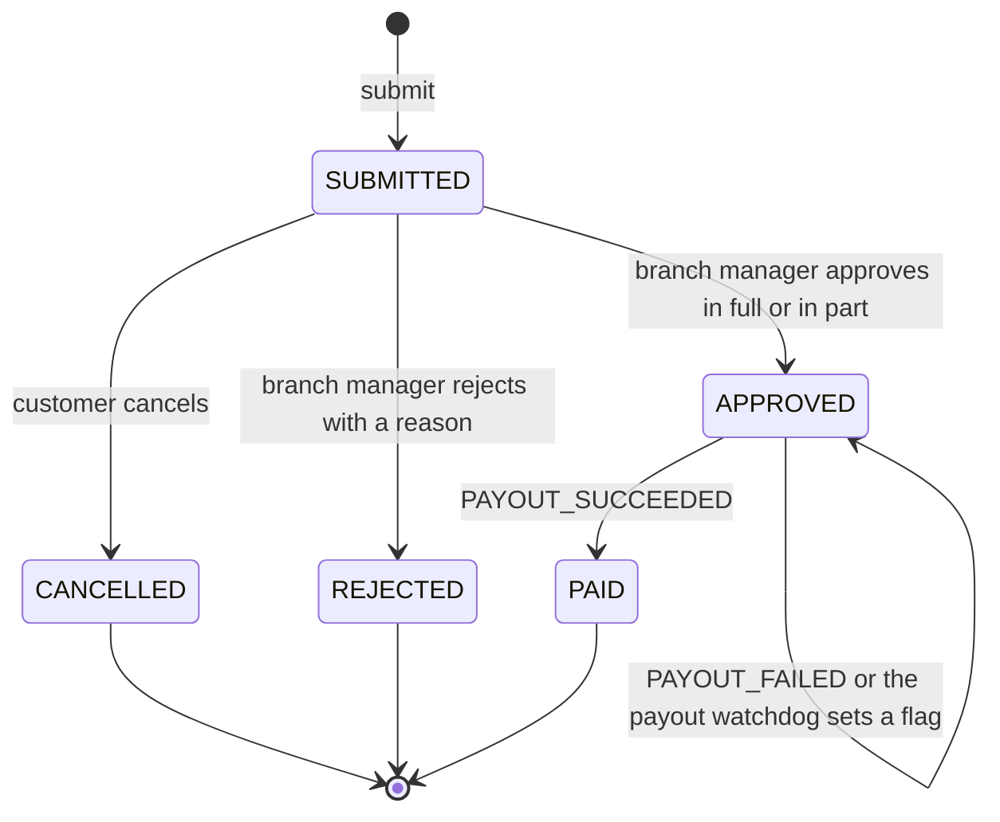
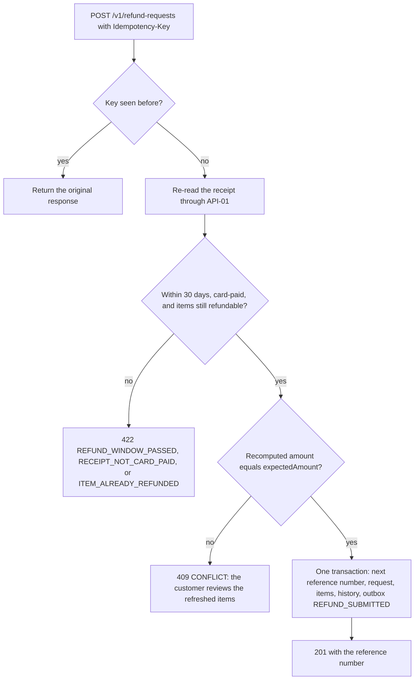
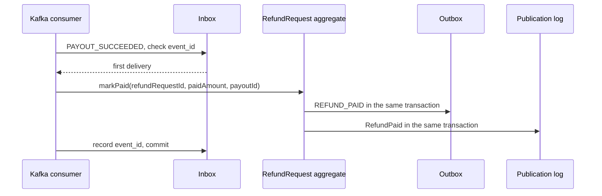

<!--
CHUNK: 13a
TITLE: Detailed Service Spec - refund-service
PROJECT: Refunds Platform
VERSION: 1.0
DEPENDS_ON: 09, 07, 10 (event hub - topic names, event names, and payload contracts must match chunk 10 verbatim), 11 (API contracts - integration endpoints carry their API ID and match chunk 11 verbatim), 12 (roles - permission tokens match chunk 12 verbatim)
PART OF: SDD - Refunds Platform
-->

# 17. Detailed Service Specs

---

## 17.1 refund-service

### What

refund-service is the refund bounded context: a module of the `refunds-platform-core` deployable (ADR-01) that owns a refund request from the receipt lookup to the confirmed payout. It realises the REFUNDS lifecycle ([REFUNDS 03 § Refund request lifecycle](../brd-refunds-portal/03-definitions-and-domain-concepts.md#refund-request-lifecycle)) and the branch ownership rule ([REFUNDS 03 § Branch ownership](../brd-refunds-portal/03-definitions-and-domain-concepts.md#branch-ownership)).

### Boundaries

- **Owns:** the `RefundRequest` aggregate (items, amounts, reasons, decision, reference number, status history, payout-failing flag), the per-tenant reference number counter, the branch report query, and the module's outbox and inbox.
- **Does not own:** payouts and their attempts (payout-service), customer messages (notification-service), points (loyalty-service), receipts and purchases (POS Records), identities and branch assignment (Keycloak).
- **Upstream consumers:** the web app through the API gateway; payout-service through `PAYOUT_SUCCEEDED` and `PAYOUT_FAILED`.
- **Downstream dependencies:** POS Records (API-01); the topic `refunds-platform-refund-events`; loyalty-service through the in-process `RefundPaid` event.

### Input

| Type | Source | Description |
|------|--------|-------------|
| REST | Web app, customer area | Receipt lookup, submit, list, detail, and cancel (List of APIs rows 1-5). |
| REST | Web app, branch manager area | Branch queue, branch request detail, decision, and daily branch report (rows 6-9). |
| Event | payout-service, `refunds-platform-payout-events` | `PAYOUT_SUCCEEDED` and `PAYOUT_FAILED`. |
| Schedule | `payout-watchdog` | Flags approved requests whose payout outcome is overdue (Business Logic). |

### Business Logic

refund-service applies each command to the `RefundRequest` aggregate inside one transaction that also writes the status history row and, for every state change, the outbox row of the matching integration event (§14.5). Optimistic locking on `version` settles races between a customer's cancellation and a branch manager's decision.

- **Receipt lookup** ([REFUNDS/UC-01](../brd-refunds-portal/06a-use-cases-customer.md#uc-01-request-a-refund) steps 1-2): calls POS Records through the `PosReceiptPort` (API-01) and builds the refundable items view. The window check counts calendar days in the tenant's time zone (§11.2) from the POS purchase date (BR-1: refund only within 30 days of purchase; E1 answers `REFUND_WINDOW_PASSED`). A receipt with no card payment answers 422 `RECEIPT_NOT_CARD_PAID` ('this purchase can be refunded at the branch'); for a receipt paid partly by card, the refundable amount is capped at the card-paid amount. Items already on an active request (Submitted, Approved, or Paid) are returned with `refundable = false` (A1; BR-2: an item is refunded only once). An unknown receipt answers `RECEIPT_NOT_FOUND` (E2).
- **Submit** ([REFUNDS/UC-01](../brd-refunds-portal/06a-use-cases-customer.md#uc-01-request-a-refund) steps 3-6): re-reads the receipt and re-checks the window and item availability. The web app shows the sum of the selected items' amounts from `RefundableItemsView` (step 4); `SubmitRefundRequest` carries it as `expectedAmount`; refund-service recomputes the amount and answers 409 `CONFLICT` when it differs, so the customer reviews the refreshed items. It then assigns the next reference number for the tenant, captures the customer's contact details from the token (§3 assumption 4), stores `SUBMITTED`, and writes `REFUND_SUBMITTED` to the outbox (step 6; AC-1: recorded as Submitted with a reference number). The `Idempotency-Key` makes a retried submission return the same request. A partial unique index on active items (tenant, receipt number, POS item line) enforces BR-2 under concurrency.
- **Track** ([REFUNDS/UC-02](../brd-refunds-portal/06a-use-cases-customer.md#uc-02-track-refund-status-web-and-mobile) steps 1-4): lists the caller's requests (reference number, amount with currency, status) with server-side pagination, and returns one request with its status history and, when rejected, the reason (AC-1: an approved request shows Approved with its date). An empty page realises A1. BR-1 (customers see only their own requests) is the `customer_id = token subject` filter.
- **Cancel** ([REFUNDS/UC-03](../brd-refunds-portal/06a-use-cases-customer.md#uc-03-cancel-a-refund-request) steps 2-5): allowed only from `SUBMITTED` (BR-1: only Submitted requests can be cancelled); moves to `CANCELLED`, releases the items, and writes `REFUND_CANCELLED` (step 5: the customer is told by email). A request decided in the meantime answers `REFUND_ALREADY_DECIDED` (E1).
- **Branch queue** ([REFUNDS/UC-04](../brd-refunds-portal/06b-use-cases-branch-manager.md#uc-04-approve--reject-refund) steps 1-2): lists the branch's `SUBMITTED` requests oldest first with amount and reason; the `branchId` path parameter must equal the caller's `branch_id` claim (BR-1: own branch only). The same query with `payoutFailing=true` lists the approved requests whose payout still fails (E1).
- **Decide** ([REFUNDS/UC-04](../brd-refunds-portal/06b-use-cases-branch-manager.md#uc-04-approve--reject-refund) steps 3-6, A1, A2): approve in full, approve in part (A1: the amount must be more than 0 and less than the requested amount, BR-2: partial amount range, and a reason is required), or reject (A2: a reason is required, BR-3: a rejection always has a reason). Approval moves to `APPROVED` and writes `REFUND_APPROVED` (step 6: the payout is sent through payout-service, and the customer is told the approved amount and, when partial, the reason); rejection moves to `REJECTED`, releases the items, and writes `REFUND_REJECTED` (A2: the customer is told the reason). A decision whose caller `sub` equals the request's `customer_id` answers 403 `FORBIDDEN` (defence in depth behind the §16.3 role separation).
- **Payout outcome** ([REFUNDS/UC-04](../brd-refunds-portal/06b-use-cases-branch-manager.md#uc-04-approve--reject-refund) step 7, E1): `PAYOUT_SUCCEEDED` moves `APPROVED` to `PAID` and, in the same transaction, writes `REFUND_PAID` to the outbox and `RefundPaid` to the publication log (step 7: the customer is told by email and SMS; AC-1: payout sent and customer told). `PAYOUT_FAILED` keeps the request `APPROVED` and sets `payout_failing_since`, which puts it on the branch manager's payout-failing list (E1; AC-2: the branch manager is told when the payout still fails after one day). **[NEEDS CLARIFICATION: must the branch manager also be told by email or SMS when a payout still fails after one day ([REFUNDS/UC-04](../brd-refunds-portal/06b-use-cases-branch-manager.md#uc-04-approve--reject-refund) E1)? The Notification Partner row of REFUNDS 08 covers customer messages only, so the design tells the branch manager in the portal.]**
- **Branch report** ([REFUNDS 09 § Reporting / Analytics](../brd-refunds-portal/09-reporting-and-analytics.md#reporting--analytics)): for one branch and one day (the day in the tenant's time zone, §11.2), requests per status, amounts paid, and the average time from submission to decision, computed from the module's own tables.
- **Payout watchdog** (REFUNDS/NFR-01): a scheduled job flags every `APPROVED` request with no payout outcome (not `PAID`, no `payout_failing_since`) once the §17.2 retry window plus one hour has passed since approval, sets `payout_outcome_overdue_since`, shows it on the branch manager's payout-failing list, and counts it in the gauge `refund_payout_outcome_overdue_requests`, alerted above zero (§11.4).

**State machine:**

**Figure 14: refund-service - RefundRequest state machine**

**Summary:** A request starts `SUBMITTED` and ends `CANCELLED`, `REJECTED`, or `PAID`. Only the customer cancels, only the branch manager of its branch decides, and only payout events move an approved request; a failed or overdue payout keeps it `APPROVED` with a flag.

### Output

| Type | Destination | Description |
|------|-------------|-------------|
| REST response | Web app | Refundable items, requests, histories, decisions, and the branch report. |
| Event | `refunds-platform-refund-events` | `REFUND_SUBMITTED`, `REFUND_CANCELLED`, `REFUND_APPROVED`, `REFUND_REJECTED`, `REFUND_PAID` (§14.5.1). |
| In-process domain event | loyalty-service | `RefundPaid` (§14.10). |

### Integrations

| Integration | Direction | Protocol | Purpose | Contract | Failure Handling |
|-------------|-----------|----------|---------|----------|------------------|
| POS Records | Outbound, sync | HTTPS REST | Look up a receipt and its items | API-01 (§15) | Circuit breaker; `RECEIPT_LOOKUP_UNAVAILABLE` (503) asks the customer to try again later; nothing is recorded. |
| Kafka | Outbound, async | Kafka | Publish refund lifecycle events | `REFUND_SUBMITTED`, `REFUND_CANCELLED`, `REFUND_APPROVED`, `REFUND_REJECTED`, `REFUND_PAID` (§14) | Outbox relay retries until the broker acknowledges; outbox backlog age is alerted (§11.4). |
| Kafka | Inbound, async | Kafka | Receive payout outcomes | `PAYOUT_SUCCEEDED`, `PAYOUT_FAILED` (§14) | Inbox dedup; invalid transitions and unreadable messages go to the DLQ (§14.6). |
| loyalty-service | Outbound, in process | Domain event | Hand paid refunds to the points take-back | `RefundPaid` (§14.10) | Publication log replays the event until the listener completes. |

### DB Modeling

#### Entity Relationship

**Figure 15: refund-service - Entity relationship**

```mermaid
erDiagram
  REFUND_REQUEST ||--|{ REFUND_ITEM : contains
  REFUND_REQUEST ||--|{ REFUND_STATUS_HISTORY : records
  REFUND_REQUEST {
    uuid id PK
    uuid tenant_id
    string reference_number UK
    uuid customer_id
    string branch_id
    string receipt_number
    string status
    decimal requested_amount
    decimal approved_amount
    string currency
  }
  REFUND_ITEM {
    uuid id PK
    uuid tenant_id
    uuid refund_request_id FK
    string receipt_number
    string pos_item_line_id
    decimal amount
    boolean active
  }
  REFUND_STATUS_HISTORY {
    uuid id PK
    uuid refund_request_id FK
    string to_status
    timestamp changed_at
  }
  OUTBOX_EVENT {
    uuid event_id PK
    uuid tenant_id
    string event_type
    string payload
  }
```

**Summary:** A refund request contains its selected items and records every status change; the outbox sits beside the aggregate in the `refund` schema, so every state change and its integration event commit together, while the in-process publication log lives in the core's `core_events` schema (§11.1).

#### Tables Design

| Table | Column | Type | Constraints | Notes |
|-------|--------|------|-------------|-------|
| `refund_request` | `id` | uuid | PK | UUIDv7 |
| `refund_request` | `tenant_id` | uuid | NOT NULL | Leading column of every index |
| `refund_request` | `reference_number` | varchar(13) | UNIQUE (`tenant_id`, `reference_number`) | `RF-` and 10 digits |
| `refund_request` | `customer_id` | uuid | NOT NULL | Token subject of the customer |
| `refund_request` | `customer_email`, `customer_mobile` | text | NULL allowed | `pii`; captured at submission |
| `refund_request` | `branch_id` | varchar | NOT NULL | Branch of the purchase, from POS Records |
| `refund_request` | `status` | varchar | CHECK in the five states | State machine above |
| `refund_request` | `requested_amount`, `approved_amount` | numeric(19,4) | approved amount > 0 and <= requested amount | With `currency` char(3) |
| `refund_request` | `payout_failing_since` | timestamptz | NULL allowed | Set by `PAYOUT_FAILED` |
| `refund_request` | `payout_outcome_overdue_since` | timestamptz | NULL allowed | Set by the payout watchdog |
| `refund_item` | `tenant_id`, `receipt_number` | uuid, varchar | NOT NULL | Copied from the request, so the partial unique index below stays in one table |
| `refund_item` | `pos_item_line_id` | varchar | Partial UNIQUE (`tenant_id`, `receipt_number`, `pos_item_line_id`) where `active` | [REFUNDS/UC-01](../brd-refunds-portal/06a-use-cases-customer.md#uc-01-request-a-refund) BR-2: one refund per item |
| `refund_status_history` | `to_status`, `reason`, `changed_at`, `changed_by` | varchar, text, timestamptz, varchar | NOT NULL except `reason` | One row per transition |
| `outbox_event` | `event_id`, `tenant_id`, `topic`, `payload`, `published_at` | uuid, uuid, varchar, jsonb, timestamptz | PK `event_id` | Relay publishes after commit |
| `inbox_message` | `tenant_id`, `consumer`, `event_id`, `processed_at` | uuid, varchar, uuid, timestamptz | PK (`tenant_id`, `consumer`, `event_id`) | Dedup of payout events |

[NEEDS CLARIFICATION: the full column list, remaining constraints, and secondary indexes of the `refund` schema; the BRD describes the concepts, not a relational schema.]

#### Migration Strategy

- **Tool:** Flyway, versioned SQL files in the module's own migration folder (§11.1).
- **Backward compatibility:** additive changes; expand-contract for renames and type changes across two releases.
- **Data backfill:** batched backfill jobs per tenant, run after the expand step.
- **Rollback:** forward-fix migrations; the application rollback keeps working against the expanded schema.

#### Retention Policy

- `refund_request`, `refund_item`, `refund_status_history`: [NEEDS CLARIFICATION: retention period for refund records and customer contact details; refunds are financial records and may carry a statutory retention period.]
- `outbox_event`, `inbox_message`: published or processed rows are purged after 7 days.

#### Archival

- **Cold storage:** none in this release; the §6 object storage row is Not applicable.
- **Format:** not applicable.
- **Schedule:** not applicable.
- **Restore SLA:** not applicable; database backups follow the §6 PostgreSQL row.

#### Data Encryption

- **At rest:** per §11.6.
- **In transit:** TLS per §11.6.
- **Key management:** per §11.6.
- **PII columns:** `customer_email`, `customer_mobile`; masked in non-production data and never logged (§11.4).

### Multi-Tenancy Specifications

- **Strategy override:** none; shared schema with `tenant_id` (§11.2).
- **Tenant filter:** every query filters by the request's tenant; branch manager queries also filter by the `branch_id` claim, customer queries by the token subject.
- **Cross-tenant queries:** forbidden; the branch report is per tenant and per branch.

### API Standards

- **Style:** REST with JSON (ADR-04).
- **Versioning:** URI prefix `/v1` (§15.1).
- **Authentication:** Keycloak JWT, validated at the gateway and in the core (ADR-07).
- **Idempotency:** `Idempotency-Key` required on every POST below; a replay returns the original response.
- **Pagination:** server-side, `page`, `size`, and `sort` query parameters on list endpoints.
- **Error envelope:** per the §15.1 error model (RFC 9457 with `errorCode`).

#### List of APIs (Swagger-friendly)

| Method | Path | Summary | Request Body | Response | Permission token (§16) | API ID (§15) |
|--------|------|---------|--------------|----------|------------------------|--------------|
| GET | `/v1/receipts/{receiptNumber}/refundable-items` | Look up a receipt and its refundable items | - | `RefundableItemsView` | `refund.receipt.read` | - |
| POST | `/v1/refund-requests` | Submit a refund request | `SubmitRefundRequest` | `RefundRequestDetail` | `refund.request.create` | - |
| GET | `/v1/refund-requests` | List the caller's refund requests | - | `RefundRequestPage` | `refund.request.read-own` | - |
| GET | `/v1/refund-requests/{refundRequestId}` | Get one of the caller's requests with its history | - | `RefundRequestDetail` | `refund.request.read-own` | - |
| POST | `/v1/refund-requests/{refundRequestId}/cancellation` | Cancel a Submitted request | `CancelRefundRequest` | `RefundRequestDetail` | `refund.request.cancel-own` | - |
| GET | `/v1/branches/{branchId}/refund-requests` | List the branch's requests, Submitted and oldest first by default | - | `BranchRefundRequestPage` | `refund.request.read-branch` | - |
| GET | `/v1/branches/{branchId}/refund-requests/{refundRequestId}` | Get one of the branch's requests | - | `RefundRequestDetail` | `refund.request.read-branch` | - |
| POST | `/v1/branches/{branchId}/refund-requests/{refundRequestId}/decision` | Approve in full or in part, or reject with a reason | `RefundDecision` | `RefundRequestDetail` | `refund.request.decide` | - |
| GET | `/v1/branches/{branchId}/refund-report` | Daily branch refund report for one date | - | `BranchRefundReport` | `refund.report.read-branch` | - |

No other service or external system calls these endpoints, so none carries an API ID. [NEEDS CLARIFICATION: field-level request and response schemas (OpenAPI) for the endpoints above; the paths follow the use-case steps and §15.1, the field shapes need architect input.]

### Event-Driven Architecture (If Applicable)

#### Event Model

**Published events:**

| Event Name | Producer | Producer Specs | Consumers | Consumer Specs | Schema (Summary) | Delivery Guarantee |
|------------|----------|----------------|-----------|----------------|------------------|---------------------|
| `REFUND_SUBMITTED` | refund-service | Topic `refunds-platform-refund-events`, key `refundRequestId`, retention per §6 | notification-service | Group `notification-service`, inbox dedup | `referenceNumber`, `customerId`, `customerContact`, `branchId`, `requestedAmount` | At-least-once, exactly-once effect |
| `REFUND_CANCELLED` | refund-service | Topic `refunds-platform-refund-events`, key `refundRequestId` | notification-service | Group `notification-service`, inbox dedup | `referenceNumber`, `customerId`, `customerContact` | At-least-once, exactly-once effect |
| `REFUND_APPROVED` | refund-service | Topic `refunds-platform-refund-events`, key `refundRequestId` | payout-service, notification-service | Group `payout-service` (inbox dedup, one payout per refund); group `notification-service` (inbox dedup) | `referenceNumber`, `receiptNumber`, `branchId`, `approvedAmount`, `partial`, `decisionReason`, `customerId`, `customerContact` | At-least-once, exactly-once effect |
| `REFUND_REJECTED` | refund-service | Topic `refunds-platform-refund-events`, key `refundRequestId` | notification-service | Group `notification-service`, inbox dedup | `referenceNumber`, `customerId`, `customerContact`, `rejectionReason` | At-least-once, exactly-once effect |
| `REFUND_PAID` | refund-service | Topic `refunds-platform-refund-events`, key `refundRequestId` | notification-service | Group `notification-service`, inbox dedup | `referenceNumber`, `customerId`, `customerContact`, `paidAmount`, `payoutId` | At-least-once, exactly-once effect |

**Consumed events:**

| Event Name | Producer (owning service) | Topic | Effect in this service | Idempotency / ordering |
|------------|---------------------------|-------|------------------------|------------------------|
| `PAYOUT_SUCCEEDED` | payout-service | `refunds-platform-payout-events` | `APPROVED` to `PAID` for `refundRequestId`; writes `REFUND_PAID` with `paidAmount` and the envelope's `aggregate_id` as `payoutId`; records `RefundPaid` | Inbox dedup on (`tenant_id`, `refund-service`, `event_id`); applied only from `APPROVED`, otherwise ignored and logged |
| `PAYOUT_FAILED` | payout-service | `refunds-platform-payout-events` | Sets `payout_failing_since` from `firstAttemptAt` for `refundRequestId`; the request stays `APPROVED` | Inbox dedup on (`tenant_id`, `refund-service`, `event_id`); ignored when the request is already `PAID` |

**In-process domain events (modules only):**

| Event | Publisher module | Listener modules | Transaction phase (before commit / after commit) | Payload (DTO) | Notes |
|---|---|---|---|---|---|
| `RefundPaid` | refund-service | loyalty-service | after commit | `RefundPaidEvent`: `tenantId`, `refundRequestId`, `referenceNumber`, `receiptNumber`, `paidAmount`, `paidAt` | Recorded in the publication log (§11.1) in the PAID transaction; replayed until the listener completes; the listener sets the tenant context from `tenantId` before any query. |

Every integration event above is a `candidate` in §14.5.

#### Messaging Infra

- **Broker:** Kafka (ADR-02).
- **Schema registry:** the §6 registry; JSON Schema subjects per event, additive changes only.
- **Serialization:** JSON.
- **Topic strategy:** one topic per producing context (§14.4), key `refundRequestId` for per-request ordering.
- **Retention:** per the §6 Kafka row.
- **DLQ strategy:** `refunds-platform-payout-events.refund-service.dlq` for payout events this module cannot apply; alarm on depth above zero; replay per the §20 runbook.

### Constraints

- **Authorization, [REFUNDS/UC-01](../brd-refunds-portal/06a-use-cases-customer.md#uc-01-request-a-refund), [REFUNDS/UC-02](../brd-refunds-portal/06a-use-cases-customer.md#uc-02-track-refund-status-web-and-mobile), [REFUNDS/UC-03](../brd-refunds-portal/06a-use-cases-customer.md#uc-03-cancel-a-refund-request):** role `CUSTOMER` with `refund.receipt.read`, `refund.request.create`, `refund.request.read-own`, and `refund.request.cancel-own`; own requests only (token subject), per [REFUNDS 07 § Users & Use Cases Matrix](../brd-refunds-portal/07-users-use-cases-matrix.md#users--use-cases-matrix).
- **Authorization, [REFUNDS/UC-04](../brd-refunds-portal/06b-use-cases-branch-manager.md#uc-04-approve--reject-refund) and the branch report:** role `BRANCH_MANAGER` with `refund.request.read-branch`, `refund.request.decide`, and `refund.report.read-branch`; own branch only (`branch_id` claim), per the matrix footnote 1.
- **Business rules:** 30-day window and one refund per item ([REFUNDS/UC-01](../brd-refunds-portal/06a-use-cases-customer.md#uc-01-request-a-refund) BR-1: 30-day window, BR-2: one refund per item); only Submitted requests are cancelled or decided; partial amount range and reasons ([REFUNDS/UC-04](../brd-refunds-portal/06b-use-cases-branch-manager.md#uc-04-approve--reject-refund) BR-2: partial amount range, BR-3: rejection reason).
- **Payouts go only to the original card** ([REFUNDS 02 § Assumptions / Constraints](../brd-refunds-portal/02-glossary-assumptions-facts.md#assumptions--constraints) 2); refund-service never takes card or bank details.

### Error Handling

- **Synchronous APIs:** RFC 9457 Problem Details per §15.1, with a plain-language `detail` that says what to do next ([REFUNDS 11 § UI/UX Expectations](../brd-refunds-portal/11-summary-and-uiux.md#uiux-expectations)).
- **Validation errors:** 400 `VALIDATION_FAILED` with `errors[]` per field.
- **Domain errors:** [REFUNDS/UC-01](../brd-refunds-portal/06a-use-cases-customer.md#uc-01-request-a-refund) E1 -> 422 `REFUND_WINDOW_PASSED`; [REFUNDS/UC-01](../brd-refunds-portal/06a-use-cases-customer.md#uc-01-request-a-refund) E2 -> 404 `RECEIPT_NOT_FOUND`; [REFUNDS/UC-01](../brd-refunds-portal/06a-use-cases-customer.md#uc-01-request-a-refund) A1 on submit -> 422 `ITEM_ALREADY_REFUNDED`; a receipt with no card payment -> 422 `RECEIPT_NOT_CARD_PAID`; a recomputed amount that differs from `expectedAmount` ([REFUNDS/UC-01](../brd-refunds-portal/06a-use-cases-customer.md#uc-01-request-a-refund) step 4) -> 409 `CONFLICT`; [REFUNDS/UC-03](../brd-refunds-portal/06a-use-cases-customer.md#uc-03-cancel-a-refund-request) E1 and a decision on a decided request -> 409 `REFUND_ALREADY_DECIDED`; [REFUNDS/UC-04](../brd-refunds-portal/06b-use-cases-branch-manager.md#uc-04-approve--reject-refund) A1 out of range -> 422 `PARTIAL_AMOUNT_OUT_OF_RANGE`; missing reason on a partial approval or a rejection -> 422 `DECISION_REASON_REQUIRED`; POS Records unavailable -> 503 `RECEIPT_LOOKUP_UNAVAILABLE`.
- **Auth errors:** 401 `UNAUTHENTICATED`; 403 `FORBIDDEN` for a missing permission token or a `branchId` other than the caller's branch ([REFUNDS/UC-04](../brd-refunds-portal/06b-use-cases-branch-manager.md#uc-04-approve--reject-refund) BR-1: own branch only); a decision on the caller's own request (caller `sub` equals the request's `customer_id`) answers 403 `FORBIDDEN`; another customer's request answers 404 `NOT_FOUND`, so request ids of other customers are not revealed ([REFUNDS/UC-02](../brd-refunds-portal/06a-use-cases-customer.md#uc-02-track-refund-status-web-and-mobile) BR-1: own requests only).
- **Server errors:** 500 `INTERNAL_ERROR` with the correlation id only; details stay in the logs.
- **Async consumers:** inbox dedup, then the transition guard; a transient failure is retried with backoff before the message goes to the DLQ.
- **Poison messages:** DLQ with alarm; replay per the §20 runbook. [NEEDS CLARIFICATION: consumer retry attempts and delays before a payout event goes to the DLQ.]

### Observability & Monitoring

#### Logging

- JSON per §11.4, with `referenceNumber` and `refundRequestId` as searchable fields.
- Never logs customer contact details, receipt contents, or `tenant_id` at INFO or above.
- Retention per the §6 logging row.

#### Metrics

| Metric | Type | Labels | Purpose |
|--------|------|--------|---------|
| `refund_requests_submitted_total` | counter | - | Submission volume against the §18 load estimates |
| `refund_decisions_total` | counter | `decision` (approved_full, approved_partial, rejected) | Decision mix |
| `refund_time_to_decision_seconds` | histogram | - | Average time to decision for the branch report and REFUNDS 01 objective 1 |
| `refund_request_to_paid_seconds` | histogram | - | Time from request to payout against REFUNDS 01 objective 1 (3 days) |
| `refund_payout_failing_requests` | gauge | - | Approved requests with a failing payout ([REFUNDS/UC-04](../brd-refunds-portal/06b-use-cases-branch-manager.md#uc-04-approve--reject-refund) E1) |
| `refund_payout_outcome_overdue_requests` | gauge | - | Approved requests with no payout outcome after the §17.2 retry window plus one hour (REFUNDS/NFR-01), alerted above zero |
| `pos_receipt_lookup_duration_seconds` | histogram | `outcome` | API-01 latency and failures |

#### Tracing

- OpenTelemetry spans for every endpoint, the POS Records call, the outbox relay, and each consumed event.
- W3C trace context from the gateway; `traceparent` carried in Kafka headers.
- Sampling per the §6 tracing row.

### Developer Notes

- **Recommended patterns:** hexagonal ports `PosReceiptPort`, `RefundEventOutbox`, and `RefundPaidPublisher`; the aggregate enforces every transition; records for DTOs; constructor injection.
- **Avoid:** calling payout-service or notification-service directly; reading the `loyalty` schema; trusting an amount computed by the web app.
- **Testing:** JUnit 5 and Mockito for the aggregate and use cases (`methodName_scenario_expectedResult`); Testcontainers with PostgreSQL and Kafka for the outbox, inbox, and repositories; a stub of API-01 until its contract is supplied.

### Service-Level Diagrams

#### Implementation Flow Chart

**Figure 16: refund-service - Submit flow**

**Summary:** A submission is idempotent on its key, re-validates the receipt and the amount the customer saw at submit time, and commits the request with its items, history, and outbox row in one transaction.

#### Sequence Diagram (Service-Internal)

**Figure 17: refund-service - Payout outcome handling**

**Summary:** A payout outcome is applied once per event id; the Paid transition, the `REFUND_PAID` outbox row, and the `RefundPaid` publication commit together.

### Compliance

- **GDPR:** customer contact details and customer ids are personal data; they are masked outside production and never logged. [NEEDS CLARIFICATION: lawful basis, retention, and the erasure path for refund records and contact details, and whether ISO 27001 or SOC 2 controls apply to this module.]
- **PCI-DSS:** not applicable for this module; it stores no card data.
- **ISO 27001 / SOC 2:** see the clarification above.
- **Local regulations:** none stated by the BRDs.

### Deployment Strategy

- **Service-specific override:** none; the module ships in the `refunds-platform-core` image and Helm chart (ADR-09).
- **Replicas:** per the core deployable (§11.3).
- **Strategy:** rolling update; migrations for the `refund` schema run before the new version takes traffic.
- **Health checks:** liveness and readiness probes; readiness includes the database connection only; while Kafka is down the core keeps serving and writing to the outbox, and the outbox backlog-age alert (§11.4) pages.
- **Rollback:** Helm rollback to the previous release; migrations stay backward compatible.

### Future Enhancements

- Push notifications in the mobile app ([REFUNDS/UC-02](../brd-refunds-portal/06a-use-cases-customer.md#uc-02-track-refund-status-web-and-mobile) future enhancement).
- Bulk approval of small refunds ([REFUNDS/UC-04](../brd-refunds-portal/06b-use-cases-branch-manager.md#uc-04-approve--reject-refund) future enhancement).
- Refunds for online-shop purchases ([REFUNDS 12 § Wishlist](../brd-refunds-portal/12-appendix-and-wishlist.md#wishlist)).

<!-- MASTER: refunds-platform-sdd-master.md | PREV: 12-centralized-user-roles.md | NEXT: 13b-service-payout.md -->
