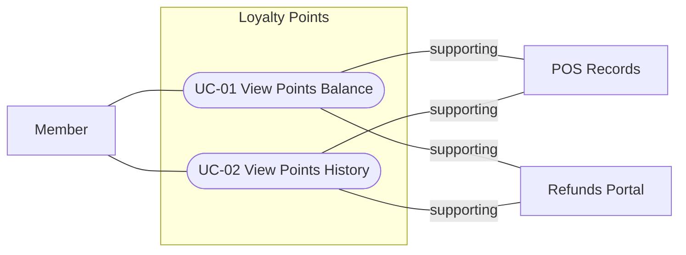

<!--
CHUNK: 05
TITLE: User Journeys & Use Cases - Overview
PROJECT: Loyalty Points
VERSION: 1.2
DEPENDS_ON: 04
PART OF: BRD - Loyalty Points
-->

# User Journeys & Use Cases

## User Journeys

### Member Journey

The member signs in, sees their points balance, and opens the history to see which purchases earned points and which refunds took points back.

## Summarized Workflow

1. The member opens their points balance.
2. The member opens the history of points movements.

## Use Case Summary

| UC ID | Use Case | Primary Actor | Description |
|-------|----------|---------------|-------------|
| **Member** | | | |
| UC-01 | View Points Balance | Member | The member sees their current points balance. |
| UC-02 | View Points History | Member | The member sees every points movement, including points taken back after a refund. |

## Use Case Diagrams

### Figure 1 - Use cases: Overview

**Summary:** The member is the only persona: they view their points balance (UC-01) and their points history (UC-02). POS Records and the Refunds Portal support both use cases with the purchases and refunds they report, and no use case includes or extends another.

<!-- MASTER: loyalty-points-brd-master.md | PREV: 04-scope-and-personas.md | NEXT: 06a-use-cases-member.md -->
