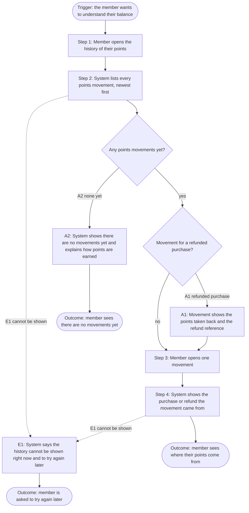

<!--
CHUNK: 06a
TITLE: Detailed Use Cases - Member
PROJECT: Loyalty Points
VERSION: 1.2
DEPENDS_ON: 04, 05
PART OF: BRD - Loyalty Points
-->

# Detailed Use Cases - Member

---

## UC-01: View Points Balance

| | |
|---|---|
| **Primary Actor** | Member |
| **Supporting Actors** | External: POS Records (08); External: Refunds Portal (08) |
| **Goal** | Know how many points they have. |
| **Trigger** | The member wants to check their points. |

### Why

Supports Business Objective 2.

### Preconditions

- The member is signed in with their existing loyalty program account ([02 / Dependencies](./02-glossary-assumptions-facts.md#dependencies)).

### Main Flow

1. The member opens their points.
2. The system shows the current balance and the date of the last movement.

### Alternate & Exception Flows

- **A1 - No points movements yet:** At step 2, the system shows a balance of 0, shows no last-movement date, and explains how points are earned.
- **E1 - Points cannot be shown:** At step 2, the system tells the member that their points cannot be shown right now and to try again later.

### Business Rules & Constraints

- Members see only their own points.

### Acceptance Criteria

- [ ] Given a member with 120 points, when they open their points, then they see 120 and the date of the last movement.
- [ ] Given a member with no points movements, when they open their points, then they see a balance of 0, no last-movement date, and an explanation of how points are earned.
- [ ] Given the points cannot be shown, when the member opens their points, then they see a message that their points cannot be shown right now and to try again later.

### Future Enhancements

- None identified at this time.

### UI/UX

Screen LP-01 (points balance). Figma: https://www.figma.com/proto/LOYL01/loyalty-points?node-id=lp-01

---

## UC-02: View Points History

| | |
|---|---|
| **Primary Actor** | Member |
| **Supporting Actors** | External: POS Records (08); External: Refunds Portal (08) |
| **Goal** | See where their points come from. |
| **Trigger** | The member wants to understand their balance. |

### Why

Supports Business Objective 1: members trust their balance when they can see every movement.

### Preconditions

- The member is signed in with their existing loyalty program account ([02 / Dependencies](./02-glossary-assumptions-facts.md#dependencies)).

### Main Flow

1. The member opens the history of their points.
2. The system lists every points movement, newest first, with date, purchase or refund reference, and points.
3. The member opens one movement.
4. The system shows the purchase or refund it came from: its reference, date, amount in EUR, and the points earned or taken back.

### Alternate & Exception Flows

- **A1 - Points taken back after a refund:** At step 2, a movement for a refunded purchase shows the points taken back and the refund reference. The flow continues at step 3.
- **A2 - No points movements yet:** At step 2, the system shows that there are no points movements yet and explains how points are earned. The use case ends.
- **E1 - History cannot be shown:** At step 2 or step 4, the system tells the member that their points history cannot be shown right now and to try again later.

### Flowchart

**Figure 2 - Flowchart: UC-02 View Points History**

**Summary:** The member sees every movement, newest first, and opens one to see its purchase or refund; a refunded purchase shows the points taken back (A1). With no movements, the member sees an explanation instead (A2); if the history cannot be shown, the system asks the member to try again later (E1).

### Business Rules & Constraints

- Points earned on a purchase are taken back when the Refunds Portal reports the refund of that purchase as paid.
- Members see only their own points.
- A refund of part of a purchase takes back 1 point for each whole 1 EUR refunded. The points taken back never exceed the points the purchase earned. When the whole purchase has been refunded, all the points it earned are taken back.
- A refund that the Refunds Portal reports as paid before POS Records reports its purchase is kept. Its points are taken back when POS Records reports the purchase.

### Acceptance Criteria

- [ ] Given a purchase that earned 50 points, when the Refunds Portal reports its full refund as paid and the member opens the history, then they see a movement of -50 points with the refund reference.
- [ ] Given a member with three points movements, when they open the history, then they see all three, newest first, each with its date, purchase or refund reference, and points.
- [ ] Given a movement earned on a 12.60 EUR purchase, when the member opens it, then they see the purchase reference, the purchase date, 12.60 EUR, and 12 points.
- [ ] Given a movement of points taken back, when the member opens it, then they see the refund reference, the date the refund was paid, the refunded amount in EUR, and the points taken back.
- [ ] Given the history cannot be shown, when the member opens it, then they see a message that their points history cannot be shown right now and to try again later.
- [ ] Given an 80.00 EUR purchase that earned 80 points, when the Refunds Portal reports a refund of 30.50 EUR for part of it as paid, then the member's history shows a movement of -30 points with the refund reference.
- [ ] Given the details of a movement cannot be shown, when the member opens that movement, then they see a message that their points history cannot be shown right now and to try again later.
- [ ] Given a member with no points movements, when they open the history, then they see that there are no points movements yet and an explanation of how points are earned.

### Future Enhancements

- Export the history.

### UI/UX

Screen LP-02 (points history). Figma: https://www.figma.com/proto/LOYL01/loyalty-points?node-id=lp-02

<!-- MASTER: loyalty-points-brd-master.md | PREV: 05-user-journeys-overview.md | NEXT: 07-users-use-cases-matrix.md -->
