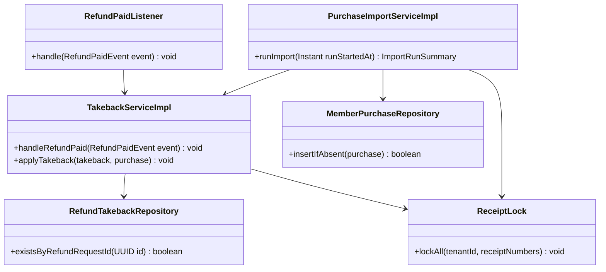
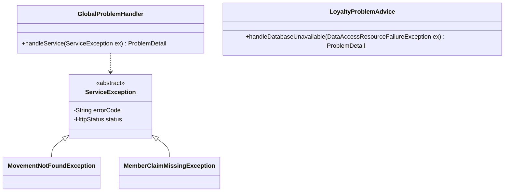
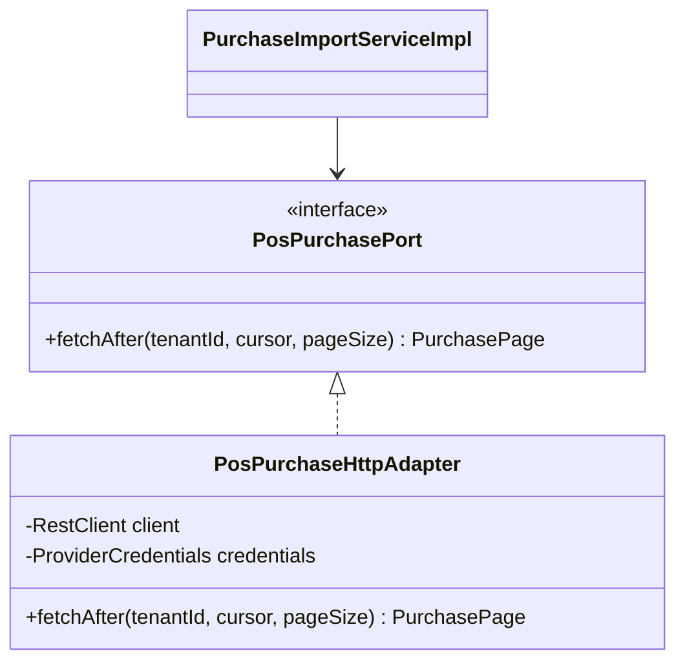
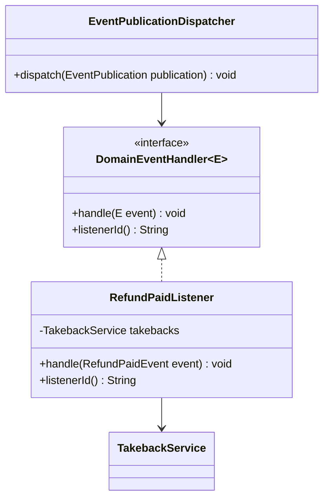
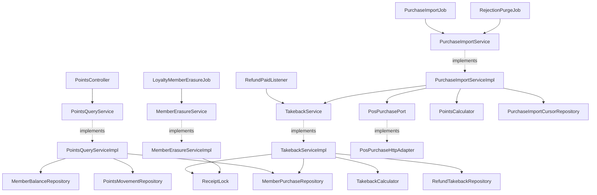
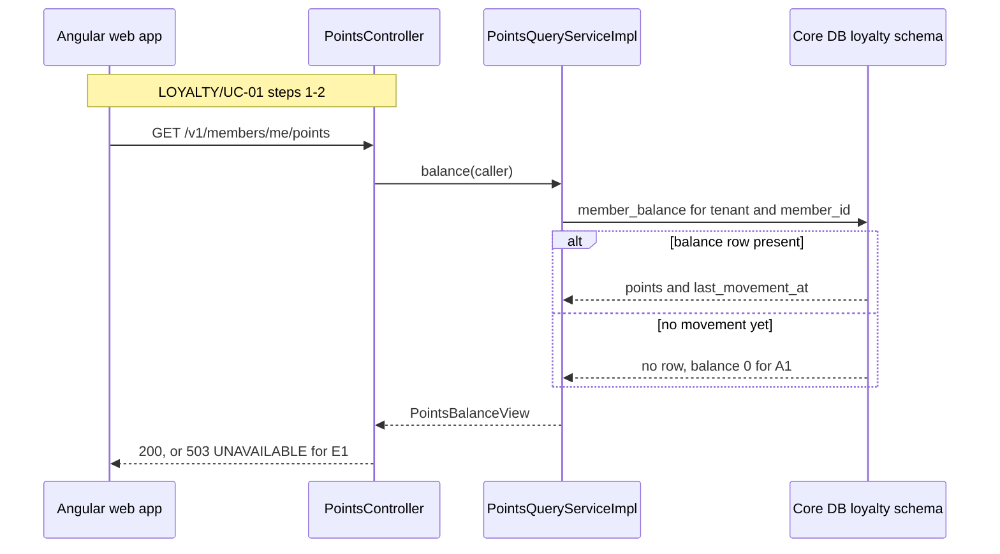
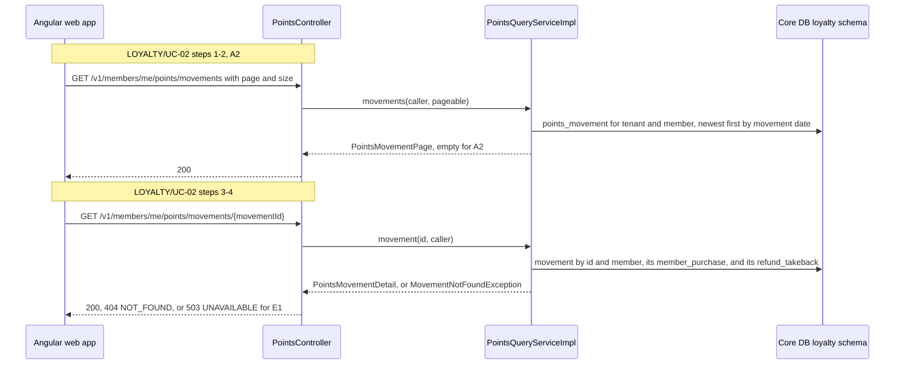
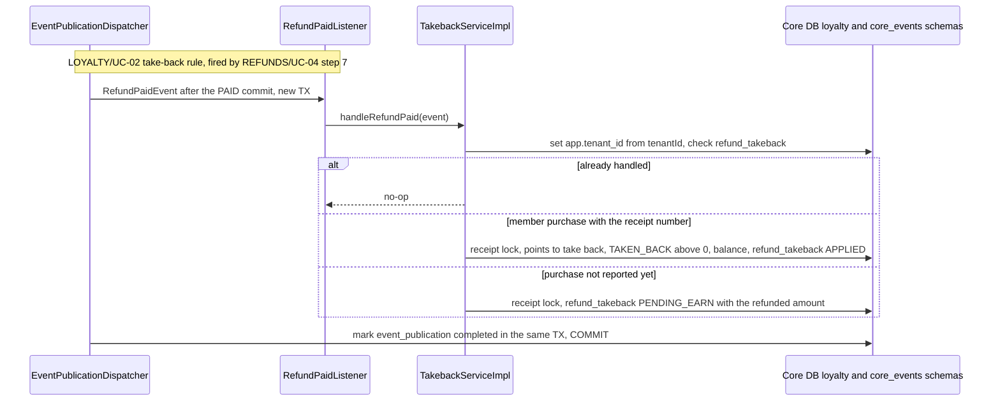
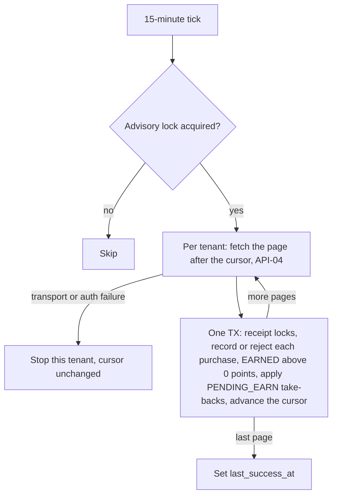

<!--
CHUNK: 04
TITLE: Per-Service Implementation - loyalty-service
PROJECT: Refunds Platform
VERSION: 1.1
DEPENDS_ON: 03, 09
PART OF: LLD - Refunds Platform
-->

# 7. Per-Service Implementation - loyalty-service

> **Bounded context:** loyalty points ([SDD §13](../../sdd-refunds-platform/09-services-summary.md#13-services-decomposition-summary) row loyalty-service; [SDD §17.4 Boundaries](../../sdd-refunds-platform/13d-service-loyalty.md#boundaries))
>
> **Type:** module (SDD §13 Type; a module is one part of a modular monolith's single deployable) of `refunds-platform-core`
>
> **Source code:** `refunds-platform-core/core-loyalty` (build module per 03 § 6.1; not created yet)
>
> **Owns use cases (SDD 09):** [LOYALTY/UC-01](../../brd-loyalty-points/06a-use-cases-member.md#uc-01-view-points-balance), [LOYALTY/UC-02](../../brd-loyalty-points/06a-use-cases-member.md#uc-02-view-points-history)
>
> **Participates in:** REFUNDS/UC-04 (owner: refund-service)

---

## 7.1 Responsibility

loyalty-service owns each member's points ledger in schema `loyalty` of the core database ([SDD §17.4](../../sdd-refunds-platform/13d-service-loyalty.md#174-loyalty-service)): the `MemberPurchase` records POS Records reports (receipt number, amount, purchase date, points earned, report time), the immutable `PointsMovement` rows (`EARNED`, `TAKEN_BACK`, never 0 points), the `MemberBalance` kept equal to the sum of the movements in the same transaction, the record of handled refunds (`refund_takeback`), and the purchase import cursor and its rejections. It records member purchases pulled every 15 minutes from POS Records (API-04) and earns their whole-euro points, takes points back when the in-process `RefundPaid` event arrives from refund-service (or, for a refund reported before its purchase, when the import records the purchase), and serves the member's balance, history, and movement detail to the web app. It also runs the operations job `loyalty-member-erasure` and the purge of import rejections. It publishes and consumes no integration event and never reads the `refund` schema; refunds reach it only as `RefundPaid` (07 § 10.6), matched to a member purchase by receipt number.

---

## 7.2 Class & Interface Map

> **Convention:** list the load-bearing classes only - controllers, services, service implementations, repositories, mappers, key domain types. Skip DTOs that are obvious from controller signatures.

> Confirm: class names follow CLAUDE.md conventions plus the SDD §17.4 Developer Notes port names (`PosPurchasePort`, `RefundPaidListener`); verify with the team.

### Controllers

| Class | Endpoints | Notes |
|-------|-----------|-------|
| `PointsController` | `GET /v1/members/me/points`, `GET /v1/members/me/points/movements`, `GET /v1/members/me/points/movements/{movementId}` | `loyalty.points.read-own`; `@UseCase("LOYALTY/UC-01")` on the balance, `@UseCase("LOYALTY/UC-02")` on both movement endpoints; the path never carries a member number |
| `RefundPaidListener` (inbound in-process adapter) | Handles `RefundPaid` (07 § 10.6), implements `DomainEventHandler<RefundPaidEvent>` | Invoked by `EventPublicationDispatcher` after the PAID commit; no `@UseCase` (09 § 12.8) |
| `PurchaseImportJob` (inbound scheduling adapter) | `@Scheduled` job `loyalty-purchase-import`, every 15 minutes (SDD §17.4 Input) | Advisory lock `loyalty-purchase-import`; one tenant at a time from `TenantSettingsRegistry` |
| `RejectionPurgeJob` (inbound scheduling adapter) | `@Scheduled` job `loyalty-rejection-purge`, daily | Deletes rejections 90 days after `received_at` (SDD §17.4 Retention Policy) |
| `LoyaltyMemberErasureJob` (operations job adapter) | Operations job `loyalty-member-erasure` (SDD §17.4 Input), arguments tenant id and member number | Launched only by operations under the SDD §20.3 break-glass rule (RB-08, 10 § 13.8) |

> **Convention:** every entry point a § 7.8 traceability line names (REST method, event listener, scheduled job) carries `@UseCase("[KEY]/UC-NN")` with that use case's keyed ID (`09-cross-cutting.md` § 12.8). Platform endpoints carry none.

### Services (interfaces)

| Interface | Purpose | Implementations |
|-----------|---------|-----------------|
| `PointsQueryService` | Balance, movement page, movement detail for the caller's `member_id` | `PointsQueryServiceImpl` |
| `TakebackService` | Take points back for a paid refund, or keep a pending take-back | `TakebackServiceImpl` |
| `PurchaseImportService` | Pull member purchases after the cursor, record them, earn points, apply pending take-backs; purge old rejections | `PurchaseImportServiceImpl` |
| `MemberErasureService` | Delete one member's purchases, ledger, and applied take-backs | `MemberErasureServiceImpl` |
| `PosPurchasePort` (outbound port) | Fetch member purchases after a cursor (API-04) | `PosPurchaseHttpAdapter` |

### Service Implementations

| Class | Implements | Key methods |
|-------|------------|-------------|
| `PointsQueryServiceImpl` | `PointsQueryService` | `balance(caller)`, `movements(caller, pageable)`, `movement(movementId, caller)` |
| `TakebackServiceImpl` | `TakebackService` | `handleRefundPaid(RefundPaidEvent)`, `applyTakeback(RefundTakeback, MemberPurchase)` (also called by the import) |
| `PurchaseImportServiceImpl` | `PurchaseImportService` | `runImport(Instant runStartedAt)`, `importPage(tenantId, page)`, `purgeRejections(Instant now)` |
| `MemberErasureServiceImpl` | `MemberErasureService` | `eraseMember(UUID tenantId, String memberId)` |
| `PointsCalculator` | domain service | `earn(ReportedPurchase purchase, TenantSettings settings)` returns `EarnResult` (whole-euro points, 0 allowed, or a rejection reason) |
| `TakebackCalculator` | domain service | `pointsToTakeBack(MemberPurchase purchase, Money refundedAmount, BigDecimal refundedBefore, int takenBackBefore, int earnRate)` (LOYALTY/UC-02 BR-3: 1 point per whole euro refunded, never more than the purchase earned) |
| `ReceiptLock` | component | `lockAll(UUID tenantId, Collection<String> receiptNumbers)`: one `pg_advisory_xact_lock(key)` per receipt number, in sorted order; `key` is the first 8 bytes of SHA-256 over `tenant_id` and the receipt number, computed in Java (the lock is released at commit or rollback) |
| `PosPurchaseHttpAdapter` | `PosPurchasePort` | `fetchAfter(tenantId, cursor, pageSize)` with Resilience4j `posPurchases` instances |

### Repositories

| Class | Entity | Notes |
|-------|--------|-------|
| `MemberPurchaseRepository` | `MemberPurchase` | `existsByPurchaseReference`, `insertIfAbsent(...)` (`ON CONFLICT DO NOTHING`; false when the receipt number belongs to another purchase), `findByReceiptNumber`, `findByPurchaseReference`, `findByMemberId`, `deleteByMemberId` |
| `PointsMovementRepository` | `PointsMovement` | `findPageByMemberId(memberId, pageable)` newest first by movement date, `findByIdAndMemberId`, `insert`, `sumTakenBackByPurchaseReference(ref)`, `deleteByMemberId` |
| `MemberBalanceRepository` | `MemberBalance` | `findForUpdate(memberId)` (`SELECT ... FOR UPDATE`), `upsertAdd(memberId, points, occurredAt)` (`last_movement_at = GREATEST(last_movement_at, occurredAt)`), `deleteByMemberId` |
| `RefundTakebackRepository` | `RefundTakeback` | `existsByRefundRequestId`, `findPendingByReceiptNumberOrderByPaidAt`, `sumAppliedRefundedAmountByReceiptNumber`, `findByMovementId`, `deleteAppliedByReceiptNumbers` |
| `PurchaseImportCursorRepository` | `PurchaseImportCursor` | `findForUpdate(tenantId)` |
| `PurchaseImportRejectionRepository` | `PurchaseImportRejection` | `insert`, `deleteReceivedBefore(cutoff)` |

### Domain Types (records)

| Type | Kind | Purpose |
|------|------|---------|
| `MemberPurchase` | entity (immutable after insert, deleted only by the erasure job) | One reported member purchase: purchase reference, receipt number, member number, `Money` amount, purchase date, points earned, report time |
| `PointsMovement` | entity (immutable after insert) | `EARNED` (> 0, dated with the purchase date) or `TAKEN_BACK` (< 0, dated with the paid date, with the refund reference) |
| `MovementType` | enum | `EARNED`, `TAKEN_BACK` |
| `MemberBalance` | entity | `points`, `lastMovementAt` (the newest movement date), `@Version` |
| `RefundTakeback` | entity | Status `APPLIED` or `PENDING_EARN` (08 § 11.1); refunded amount, receipt number, refund reference |
| `PurchaseImportCursor`, `PurchaseImportRejection` | entity | Import position and rejected records |
| `RejectionReason` | enum | `NON_POSITIVE_AMOUNT`, `CURRENCY_MISMATCH`, `MISSING_RECEIPT_NUMBER`, `DUPLICATE_RECEIPT`, `INVALID` (SDD §17.4 Tables Design) |
| `ReportedPurchase` | record | API-04 anti-corruption model: member number, purchase reference, receipt number, `Money` amount, purchase date, report time |
| `EarnResult` | sealed interface | `Earned(int points)` (0 allowed) or `Rejected(RejectionReason reason, String detail)` |
| `PointsBalanceView`, `PointsMovementPage`, `PointsMovementDetail` | record | The SDD §17.4 List of APIs types; records in 06 § 9.2 |
| `RefundPaidEvent` | record (in `core-contracts`) | The SDD §14.10 DTO |

### Method Signatures (key methods only)

```java
public interface PointsQueryService {
  PointsBalanceView balance(CallerContext caller);
  PointsMovementPage movements(CallerContext caller, Pageable pageable);
  PointsMovementDetail movement(UUID movementId, CallerContext caller);
}

public interface TakebackService {
  void handleRefundPaid(RefundPaidEvent event);
  void applyTakeback(RefundTakeback takeback, MemberPurchase purchase);
}

public interface PurchaseImportService {
  ImportRunSummary runImport(Instant runStartedAt);
  int purgeRejections(Instant now);
}

public interface MemberErasureService {
  ErasureSummary eraseMember(UUID tenantId, String memberId);
}

public interface PosPurchasePort {
  PurchasePage fetchAfter(UUID tenantId, String cursor, int pageSize);
}
```

> **Convention:** records are used for all DTOs (CLAUDE.md default). Constructor injection only - no `@Autowired` on fields.

### Ports and Adapters (in-process contracts)

Not applicable - no in-process contracts: [SDD §15](../../sdd-refunds-platform/11-api-contracts.md#15-service-integration-api-contracts) defines no `Internal (in-process)` contract. The module's only module-to-module interaction is the in-process `RefundPaid` event it listens to through `RefundPaidListener` (07 § 10.6). `PosPurchasePort` is a hexagonal outbound port to an external system, not a §15 in-process contract.

### Authorization

| Entry point | Kind | Permission token (SDD §16, verbatim) | Enforcement point |
|-------------|------|--------------------------------------|-------------------|
| `GET /v1/members/me/points` | REST | `loyalty.points.read-own` | `@PreAuthorize("hasAuthority('loyalty.points.read-own')")` on `PointsController.balance`; `member_id` claim required (403 without it) |
| `GET /v1/members/me/points/movements` | REST | `loyalty.points.read-own` | `@PreAuthorize` on `PointsController.movements`; query filtered by the `member_id` claim |
| `GET /v1/members/me/points/movements/{movementId}` | REST | `loyalty.points.read-own` | `@PreAuthorize` on `PointsController.movement`; another member's id answers 404 `NOT_FOUND` |
| `RefundPaidListener.handle` | Listener | None - system consumer (in-process; SDD §15 has no port contract, so no token is checked) | `EventPublicationDispatcher` invokes it only for `RefundPaid` from `core-eventing` |
| `PurchaseImportJob.run` | Job | None - system job | Worker database role for the cursor scan; each page runs under its tenant |
| `RejectionPurgeJob.run` | Job | None - system job | Runs per tenant under the tenant policy |
| `LoyaltyMemberErasureJob.run` | Job (operations) | None - operations job: no role or endpoint ([SDD §16.8](../../sdd-refunds-platform/12-centralized-user-roles.md#168-lifecycle-scope--revocation-rules) item 4) | Launched by operations under the SDD §20.3 break-glass rule on a request the data protection owner approves (RB-08) |

> **Convention:** one row per entry point of this service (REST method, event listener, scheduled job, in-process port). Tokens are the SDD §16 permission tokens, verbatim; the role catalogue stays in the SDD (`sdd-to-lld.md` § One fact, one home). On an internal HTTP entry point the provider's filter or sidecar checks the caller's client-credentials token against the token (SDD §15.1). From code with no SDD: the scopes the code checks.

---

## 7.3 Method-Level Pseudocode (non-trivial logic only)

> **Convention:** include pseudocode only for methods where the algorithm is non-obvious. Skip for plain CRUD.

### `TakebackServiceImpl.handleRefundPaid` and `applyTakeback`

```text
handleRefundPaid(e):   invoked by EventPublicationDispatcher in a new TX that also marks the event_publication row completed
1. tenantContext.set(e.tenantId())                              (before any query; sets app.tenant_id for RLS)
2. refundTakebacks.existsByRefundRequestId(e.refundRequestId()) -> return            (replay no-op)
3. receiptLock.lockAll(tenant, [e.receiptNumber()])             (serialises with the import, the erasure job, and other refunds of the purchase)
4. t = RefundTakeback.pending(tenant, e.refundRequestId(), e.receiptNumber(), refundReference = e.referenceNumber(),
                              refundedAmount = e.paidAmount(), paidAt = e.paidAt(), handledAt = now)
5. purchase = memberPurchases.findByReceiptNumber(e.receiptNumber())
   - absent  -> refundTakebacks.insert(t)                       (PENDING_EARN, kept with no expiry; BR-4: a refund reported before its purchase is kept)
   - present -> refundTakebacks.insert(t); applyTakeback(t, purchase)
6. commit (with the publication completion); any exception rolls back both and the replay job redelivers

applyTakeback(t, purchase):   (MANDATORY; caller holds the receipt lock)
a. points = takebackCalculator.pointsToTakeBack(purchase, t.refundedAmount,
              refundedBefore = refundTakebacks.sumAppliedRefundedAmountByReceiptNumber(t.receiptNumber),
              takenBackBefore = -movements.sumTakenBackByPurchaseReference(purchase.purchaseReference),
              earnRate = settings(tenant).earnRate)
b. points > 0 -> m = PointsMovement.takenBack(idGen.next(), tenant, purchase.memberId, -points,
                       purchase.purchaseReference, refundReference = t.refundReference, occurredAt = t.paidAt)
                 movements.insert(m); balances.upsertAdd(purchase.memberId, -points, t.paidAt); t.movementId = m.id
   points = 0 -> no movement (No 0-point movements)
c. t.purchaseReference = purchase.purchaseReference; t.status = APPLIED
d. metrics: loyalty_takeback_lag_seconds.observe(now - max(t.paidAt, purchase.reportedAt));
            loyalty_points_movements_total{TAKEN_BACK}++ when a movement was written
```

> **Confidence:** High - SDD §17.4 Business Logic (Take points back) and Figure 25 dictate the flow: the receipt-number match, the lock, the pending take-back with no expiry, and the movement dated with `paidAt`.

### `TakebackCalculator.pointsToTakeBack`

```text
Input: purchase (amount, pointsEarned), refundedAmount of this refund, refundedBefore (APPLIED refunds of the purchase),
       takenBackBefore (points already taken back from it), earnRate
1. remainder = purchase.pointsEarned - takenBackBefore                                      (never below 0)
2. refundedBefore + refundedAmount.amount >= purchase.amount.amount -> return remainder     (whole purchase refunded: all points left)
3. return min(floor(refundedAmount.amount) * earnRate, remainder)                           (1 point per whole euro refunded, never more than earned)
```

> **Confidence:** High - LOYALTY/UC-02 BR-3: 1 point per whole euro refunded, never more than the purchase earned, as SDD §17.4 Take points back realises it; it gives AC-1: -50 with the refund reference, AC-6: 30.50 EUR refund of an 80-point purchase takes back 30, and the [LOYALTY/TC-PTS-04](../../brd-loyalty-points/16-uat-bat-test-cases.md#4-points-earned-and-taken-back-uc-02-lp-02) and [LOYALTY/TC-PTS-07](../../brd-loyalty-points/16-uat-bat-test-cases.md#4-points-earned-and-taken-back-uc-02-lp-02) sequences (0, 0, -2 and -6, -4).

### `PurchaseImportServiceImpl.runImport` and `importPage`

```text
1. PurchaseImportJob holds advisory lock "loyalty-purchase-import"; not acquired -> return
2. for tenant in tenantSettingsRegistry.tenants():
   a. loop:
      page = posPurchasePort.fetchAfter(tenant, cursor.position, PAGE_SIZE)   (outside the TX; API-04)
        - transport or authentication failure -> stop this tenant's run (cursor unchanged), metric, next tenant
      importPage TX (tenant set):
        cursor = cursors.findForUpdate(tenant)
        receiptLock.lockAll(tenant, distinct receipt numbers of the page)     (sorted, before any balance row: no deadlock with the listener)
        for p in page.purchases:
          r = pointsCalculator.earn(p, settings(tenant))
          Rejected -> rejections.insert(tenant, p.purchaseReference, p.receiptNumber, r.reason, r.detail, now); records_total{rejected}++; continue
          purchases.existsByPurchaseReference(p.purchaseReference) -> records_total{duplicate}++; continue     (re-import no-op)
          inserted = purchases.insertIfAbsent(MemberPurchase(p, pointsEarned = r.points, reportedAt = p.reportedAt))
          !inserted -> rejections.insert(..., DUPLICATE_RECEIPT); records_total{rejected}++; continue          (receipt number of another purchase)
          r.points > 0 -> movements.insert(EARNED, +r.points, p.purchaseReference, occurredAt = p.purchasedAt)
                          balances.upsertAdd(p.memberId, r.points, p.purchasedAt); loyalty_earn_lag_seconds.observe(now - p.reportedAt)
                          records_total{imported}++
          r.points = 0 -> records_total{no_points}++                                                        (no 0-point movement)
          for t in refundTakebacks.findPendingByReceiptNumberOrderByPaidAt(p.receiptNumber):
            takebackService.applyTakeback(t, purchase)                                                     (BR-4: applied in paid_at order)
        cursor.position = page.nextCursor
        COMMIT
      until page.isLast
   b. on success: cursor.last_success_at = now; gauge loyalty_purchase_import_last_success_timestamp
3. two failed runs in a row -> the import freshness alert fires; any rejection -> the rejection alert (10 § 13.7)
```

> **Confidence:** High for the record, earn, rejection, cursor, and pending take-back rules (SDD §17.4 Earn points, Take points back). Medium for the page-per-transaction split and the lock order.

> Confirm: one transaction per API-04 page (its member purchases, movements, the pending take-backs they apply, and the cursor advance) is this LLD's reading of "the cursor advances in the same transaction"; the receipt locks of a page are taken first in sorted order so the import and the `RefundPaid` listener never deadlock on a balance row; the `TAKEN_BACK` movement the import writes for a pending take-back carries the refund reference stored on the `refund_takeback` row, so that table also stores `refund_reference` (05 § 8.2, a column the SDD Tables Design does not list).

### `PointsCalculator.earn`

```text
1. p.amount.currency != settings.currency                        -> Rejected(CURRENCY_MISMATCH)
2. p.amount.amount <= 0                                          -> Rejected(NON_POSITIVE_AMOUNT)
3. p.receiptNumber blank                                         -> Rejected(MISSING_RECEIPT_NUMBER)
4. member number, purchase reference, purchase date, or report time missing -> Rejected(INVALID, detail = the missing field)
5. points = floor(p.amount.amount) * settings.earnRate           (whole euros; cents earn none: 12.60 EUR earns 12)
6. return Earned(points)                                         (0 for a purchase under 1 EUR: recorded, no movement)
```

> **Confidence:** High - LOYALTY 03 Earning and SDD §17.4 Earn points; the reason codes are the SDD §17.4 Tables Design values.

> Confirm: the tenant earn rate (SDD §11.2) is loaded as whole points per whole currency unit (1 for the current tenant), and a fractional rate fails `TenantSettingsRegistry` at start, because SDD §17.4 states the rate but no rounding for a fractional one.

### `MemberErasureServiceImpl.eraseMember`

```text
Operations job loyalty-member-erasure (SDD §17.4 Compliance), one TX (tenant set):
1. purchases = memberPurchases.findByMemberId(memberId)
2. receiptLock.lockAll(tenant, receipt numbers of purchases)                (the same lock as the listener and the import)
3. refundTakebacks.deleteAppliedByReceiptNumbers(receipt numbers)           (PENDING_EARN rows name no member and stay)
4. movements.deleteByMemberId(memberId); balances.deleteByMemberId(memberId); memberPurchases.deleteByMemberId(memberId)
5. COMMIT; log INFO counts only (never the member number)
A refund of an erased purchase paid later finds no member purchase and stays PENDING_EARN (SDD §17.4 Compliance).
```

> **Confidence:** High - SDD §17.4 Compliance (Erasure).

---

## 7.4 Design Patterns Applied

> **Convention:** every applied pattern carries name, triggering CLAUDE.md rule, roles, rationale specific to this service, Mermaid class diagram, and pseudocode skeleton. Patterns inferred from code (from-code) include `> Confirm:` unless a test exercises the pattern (`confidence-rules.md`); patterns proposed (from-sdd) carry the rule attribution explicitly.

**Not applied:** Outbox (loyalty-service publishes no integration event, SDD §14.4, so there is no state change that must reach the broker); Idempotency-Key on write endpoints (the module exposes only GET endpoints); Saga (the take-back is an in-process reaction inside one deployable, not a cross-service transaction).

### Pattern: Idempotent consumer and idempotent import

> **Applied:** Idempotency (CLAUDE.md: "Idempotency on every consumer and every write endpoint. Assume at-least-once delivery everywhere.")
>
> **Rationale (this service):** `RefundPaid` is replayed by the publication log until the listener commits, and the import re-reads a page after any failure, so both must be safe to repeat: a second take-back or a second earn would break LOYALTY/NFR-01 (the balance is always right). The unique keys of SDD §17.4 make each repeat a no-op, and the receipt lock makes several refunds of one purchase apply one at a time.

**Roles:**

| Role | Class / Component | Notes |
|------|-------------------|-------|
| Dedup store (take-back) | `loyalty.refund_takeback`, PK `(tenant_id, refund_request_id)` | Written in the listener's transaction |
| Dedup store (purchase and earn) | `member_purchase` unique `(tenant_id, purchase_reference)`; `ux_points_movement_earned_purchase` | `existsByPurchaseReference`, `insertIfAbsent` |
| Serialisation | `ReceiptLock` (`pg_advisory_xact_lock` per `tenant_id` and receipt number) | Listener, import, and erasure job |
| Check | `TakebackServiceImpl.handleRefundPaid` step 2; `PurchaseImportServiceImpl` duplicate check | |

**Class diagram:**



**Pseudocode skeleton:**

```text
handleRefundPaid(e): if refundTakebacks.existsByRefundRequestId(e.refundRequestId): return; lock receipt; ...apply or keep pending...
importRecord(p):     if purchases.existsByPurchaseReference(p.ref): count duplicate; return; ...record, earn, apply pending...
```

### Pattern: RFC 9457 error model

> **Applied:** RFC 9457 ProblemDetails (CLAUDE.md: "Global @RestControllerAdvice, Problem Details (RFC 9457). Business exceptions extend a base ServiceException with error code.")
>
> **Rationale (this service):** the three member endpoints share the core's `GlobalProblemHandler`, so a foreign movement id answers 404 `NOT_FOUND` (never 403, LOYALTY/UC-02 BR-2: own points only) in the same envelope as the refund endpoints; a core database that cannot be reached answers 503 `UNAVAILABLE`, which the web app turns into the try-again message of LOYALTY/UC-01 E1 and LOYALTY/UC-02 E1 (SDD §17.4 Error Handling).

**Roles:**

| Role | Class / Component |
|------|-------------------|
| Base exception | `ServiceException` (commons) |
| Domain subclasses | `MovementNotFoundException`, `MemberClaimMissingException` (§ 7.7) |
| Translator | `GlobalProblemHandler` (commons, shared with refund-service in the core) |
| Scoped translator | `LoyaltyProblemAdvice` (`@RestControllerAdvice(assignableTypes = PointsController.class)`, ordered before the global handler): database unavailability to 503 |

**Class diagram:**



**Pseudocode skeleton:**

```text
movement(id, caller): m = movements.findByIdAndMemberId(id, caller.memberId)
                      orElseThrow(() -> new MovementNotFoundException(id))     -> 404 NOT_FOUND via GlobalProblemHandler
LoyaltyProblemAdvice: DataAccessResourceFailureException, CannotCreateTransactionException -> 503 UNAVAILABLE
```

> Confirm: a core database that cannot be reached answers 503 `UNAVAILABLE` only on the three member endpoints, as SDD §17.4 Error Handling states, while refund-service keeps 500 `INTERNAL_ERROR` for server errors (SDD §17.1 Error Handling); the controller-scoped advice is this LLD's way to honour both.

### Pattern: Resilience4j on API-04 (POS Records member purchases)

> **Applied:** Resilience defaults (CLAUDE.md: "Resilience defaults: timeouts, retries with exponential backoff and jitter, circuit breakers (Resilience4j), bulkheads for downstream provider calls (e.g., eSIM, payment, SMS).")
>
> **Rationale (this service):** the 15-minute import calls POS Records in a background job; a timeout and a circuit breaker stop a hanging POS Records from holding the job, a small retry with jitter absorbs blips, and a bulkhead of 2 keeps the import from competing with API-01 lookups for connections. On failure the run stops and the next run resumes from the cursor, and two failed runs in a row alert while the LOYALTY/NFR-03 hour can still be met ([SDD §12 INT-03](../../sdd-refunds-platform/08-integrations.md#12-integrations), [SDD §17.4 Integrations](../../sdd-refunds-platform/13d-service-loyalty.md#integrations)).

**Roles:**

| Role | Class / Component |
|------|-------------------|
| Port | `PosPurchasePort` |
| Adapter | `PosPurchaseHttpAdapter` (Spring `RestClient`, per-tenant credentials) |
| Policies | Resilience4j instances `posPurchases`, values in 09 § 12.3 |

**Class diagram:**



**Pseudocode skeleton:**

```text
@Bulkhead(name = "posPurchases") @CircuitBreaker(name = "posPurchases") @Retry(name = "posPurchases")
PurchasePage fetchAfter(tenantId, cursor, pageSize):
  response = client.get(API-04 URI TBD, credentials.forTenant(tenantId), cursor, pageSize)
  return PurchasePageMapper.from(response)       (maps to ReportedPurchase records; provider fields TBD - external)
```

> TODO: API-04 is `TBD - external` in [SDD §15.3](../../sdd-refunds-platform/11-api-contracts.md#api-04-fetch-member-purchases-after-a-cursor-loyalty-service---pos-records), including whether POS Records serves a cursor or only pushes (R-05) and whether it sends the receipt number with each member purchase (R-03); `PosPurchaseHttpAdapter` stays a stub behind `PosPurchasePort` - verify when the documentation arrives.

### Pattern: In-process domain event listener (durable publication log)

> **Applied:** Event-driven by default (CLAUDE.md: "Event-driven by default for cross-service flows"), in process per [SDD ADR-05](../../sdd-refunds-platform/06-principles-and-decisions.md#10-architectural-decisions).
>
> **Rationale (this service):** the listener runs after the refund's PAID commit in its own transaction, so a loyalty failure never rolls back a refund, and the publication row stays incomplete until this transaction commits, so a crash or an exception leads to a replay every 5 minutes, about six times before the 30-minute alert, well within the one-hour LOYALTY/NFR-02 budget ([SDD §17.4 Error Handling](../../sdd-refunds-platform/13d-service-loyalty.md#error-handling)).

**Roles:**

| Role | Class / Component |
|------|-------------------|
| Handler contract | `DomainEventHandler<E>` (`core-eventing`) |
| Listener adapter | `RefundPaidListener` |
| Application service | `TakebackServiceImpl` |
| Dispatcher and replay | `EventPublicationDispatcher`, `EventPublicationReplayJob` (07 § 10.6) |

**Class diagram:**



**Pseudocode skeleton:**

```text
RefundPaidListener.listenerId() = "loyalty.refund-paid-takeback"
RefundPaidListener.handle(e)   = takebacks.handleRefundPaid(e)      (dispatcher owns the TX and the completion mark)
```

---

## 7.5 Dependency Injection Graph

> **Convention:** constructor injection only. Document the wiring graph for non-trivial cases (3+ collaborators, or any factory/strategy/mediator wiring).



Every implementation also takes `Clock`, `IdGenerator`, `TenantContext`, `TenantSettingsRegistry`, and `MeterRegistry` by constructor; `TakebackServiceImpl`, `PurchaseImportServiceImpl`, and `MemberErasureServiceImpl` also take `PointsMovementRepository` and `MemberBalanceRepository`, and the import takes `MemberPurchaseRepository`, `RefundTakebackRepository`, and `PurchaseImportRejectionRepository` (omitted from the graph).

---

## 7.6 Transaction Boundaries

| Method | Propagation | Isolation | Rollback rules |
|--------|-------------|-----------|----------------|
| `PointsQueryServiceImpl.*` | `REQUIRED`, `readOnly = true` | `READ_COMMITTED` | - |
| `TakebackServiceImpl.handleRefundPaid` | `MANDATORY` (inside the dispatcher's `REQUIRES_NEW` transaction, which also marks the publication completed) | `READ_COMMITTED` | Rollback on any exception; the publication stays incomplete and is replayed |
| `TakebackServiceImpl.applyTakeback` | `MANDATORY` (the listener's or the import page's transaction, receipt lock held) | inherited | Rollback with the caller |
| `PurchaseImportServiceImpl.importPage` | `REQUIRES_NEW`, one per API-04 page | `READ_COMMITTED` | Rollback on any exception except a record rejection (rejections are rows, not exceptions) |
| `PurchaseImportServiceImpl.purgeRejections` | `REQUIRES_NEW` per tenant | `READ_COMMITTED` | Rollback on any exception; retried on the next day |
| `MemberErasureServiceImpl.eraseMember` | `REQUIRED`, one transaction | `READ_COMMITTED` | Rollback on any exception; nothing is deleted |

> **Convention:** outbox row insert lives inside the same transaction as the aggregate write. No `@Transactional(propagation = REQUIRES_NEW)` for outbox writes - the whole point of the pattern is one-tx commit.

> Confirm: transaction propagation default applied; verify per method (the receipt lock, always taken before any balance row, serialises the listener, the import, and the erasure job on one purchase; the balance row lock serialises the writes on one member).

---

## 7.7 Error Handling

| Exception | RFC 9457 type | `errorCode` (SDD §15.1) | HTTP Status | When thrown | Caller action |
|-----------|---------------|-------------------------|-------------|-------------|---------------|
| `RequestValidationException` | `{TYPE_BASE}/loyalty/validation-failed` | `VALIDATION_FAILED` | 400 | Bad `page` or `size` | Fix the parameter |
| `MovementNotFoundException` | `{TYPE_BASE}/loyalty/not-found` | `NOT_FOUND` | 404 | Unknown movement id or another member's (LOYALTY/UC-02 BR-2: own points only) | None |
| `MemberClaimMissingException` | `{TYPE_BASE}/loyalty/forbidden` | `FORBIDDEN` | 403 | Token has no `member_id` claim | Sign in with the loyalty program account |
| Spring Security denial | `{TYPE_BASE}/auth/forbidden`, `{TYPE_BASE}/auth/unauthenticated` | `FORBIDDEN`, `UNAUTHENTICATED` | 403, 401 | No `MEMBER` role, invalid token | Sign in again / none |
| Database unavailable (`DataAccessResourceFailureException`, `CannotCreateTransactionException`) | `{TYPE_BASE}/loyalty/unavailable` | `UNAVAILABLE` | 503 | The core database cannot be reached (LOYALTY/UC-01 E1, LOYALTY/UC-02 E1) | Try again later |
| Any other exception | `{TYPE_BASE}/internal-error` | `INTERNAL_ERROR` | 500 | Unexpected | Retry later |
| Listener exception (`RefundPaid`) | - | - | - | Database or data error in the take-back | Publication replayed every 5 minutes; alert on age (10 § 13.7) |
| `PosPurchaseUnavailableException` (import) | - | - | - | API-04 transport or authentication failure | Run stops; next run resumes from the cursor |
| Record rejection (import) | - | - | - | A reason of `RejectionReason` | Row in `purchase_import_rejection`; the run continues; alert on any rejection |

> **Convention:** all exceptions extend `ServiceException` (CLAUDE.md base class). Global `@RestControllerAdvice` translates to `ProblemDetails` (RFC 9457). Error envelope schema in `09-cross-cutting.md` § Error Model.

---

## 7.8 Use-Case Workflows

> **Convention:** one subsection per active use case this service owns (SDD §7.3 Owner), headed with the SDD's BRD key and the BRD's ID and title exactly. A merged or removed use case gets no block. Cross-service sagas live in the orchestrator service's file. Each workflow has: the traceability line, control flow, sequence diagram (Mermaid), idempotency points, outbox emission points, retry/timeout choices.

### LOYALTY/UC-01: View Points Balance

> **Traceability:** BRD [LOYALTY/UC-01](../../brd-loyalty-points/06a-use-cases-member.md#uc-01-view-points-balance) · SDD [§7.3](../../sdd-refunds-platform/03-users-and-use-cases.md#73-use-case-traceability-brd--sdd) · Owner: loyalty-service · Entry points: `GET /v1/members/me/points` · UAT/BAT: [LOYALTY/TC-ACC-01](../../brd-loyalty-points/16-uat-bat-test-cases.md#1-member-access-uc-01-uc-02-lp-01-lp-02), [LOYALTY/TC-ACC-02](../../brd-loyalty-points/16-uat-bat-test-cases.md#1-member-access-uc-01-uc-02-lp-01-lp-02), [LOYALTY/TC-BAL-01](../../brd-loyalty-points/16-uat-bat-test-cases.md#2-points-balance-uc-01-lp-01), [LOYALTY/TC-BAL-02](../../brd-loyalty-points/16-uat-bat-test-cases.md#2-points-balance-uc-01-lp-01), [LOYALTY/TC-BAL-03](../../brd-loyalty-points/16-uat-bat-test-cases.md#2-points-balance-uc-01-lp-01), [LOYALTY/TC-BAL-04](../../brd-loyalty-points/16-uat-bat-test-cases.md#2-points-balance-uc-01-lp-01), [LOYALTY/TC-UIX-01](../../brd-loyalty-points/16-uat-bat-test-cases.md#5-cross-cutting-uiux-standards-chunk-11), [LOYALTY/TC-UIX-03](../../brd-loyalty-points/16-uat-bat-test-cases.md#5-cross-cutting-uiux-standards-chunk-11), [LOYALTY/TC-NFR-01](../../brd-loyalty-points/16-uat-bat-test-cases.md#6-nfr-acceptance-nfr-01nfr-03) · Screens: [LOYALTY/LP-01](../../brd-loyalty-points/06a-use-cases-member.md#uiux) via `/points`

**Trigger:** `PointsController.balance` with `@UseCase("LOYALTY/UC-01")`.

**Pre-conditions:** signed in with the existing loyalty program account, holding `MEMBER` (`loyalty.points.read-own`) and a `member_id` claim (LOYALTY/UC-01 precondition).

**Post-conditions:** none (read-only).

**Control flow:**

```text
1. Member opens their points (LOYALTY/UC-01 step 1)
2. Read member_balance for (tenant, member_id claim) (LOYALTY/UC-01 step 2; BR-1: own points only)
3. Row present -> PointsBalanceView(points, lastMovementAt = the newest movement date)  (AC-1: 120 points and the date of the last movement)
4. No row -> PointsBalanceView(0, lastMovementAt absent); the web app explains how points are earned (LOYALTY/UC-01 A1; AC-2: no movements yet)
5. A balance back at 0 after a take-back keeps its lastMovementAt and is not A1 (SDD §17.4 View balance)
6. Core database unreachable -> 503 UNAVAILABLE; the web app says the points cannot be shown right now (LOYALTY/UC-01 E1; AC-3: points cannot be shown)
```

**Sequence diagram:**



**Idempotency points:** none (safe read). **Outbox emission points:** none. **Retry / timeout policy:** none server-side; the web app offers a retry on 503.

**Error handling:** no `member_id` claim -> 403 `FORBIDDEN`; no `MEMBER` role -> 403 `FORBIDDEN`; database unreachable -> 503 `UNAVAILABLE` (E1).

### LOYALTY/UC-02: View Points History

> **Traceability:** BRD [LOYALTY/UC-02](../../brd-loyalty-points/06a-use-cases-member.md#uc-02-view-points-history) · SDD [§7.3](../../sdd-refunds-platform/03-users-and-use-cases.md#73-use-case-traceability-brd--sdd) · Owner: loyalty-service · Entry points: `GET /v1/members/me/points/movements`, `GET /v1/members/me/points/movements/{movementId}` · UAT/BAT: [LOYALTY/TC-ACC-03](../../brd-loyalty-points/16-uat-bat-test-cases.md#1-member-access-uc-01-uc-02-lp-01-lp-02), [LOYALTY/TC-ACC-04](../../brd-loyalty-points/16-uat-bat-test-cases.md#1-member-access-uc-01-uc-02-lp-01-lp-02), [LOYALTY/TC-HIS-01](../../brd-loyalty-points/16-uat-bat-test-cases.md#3-points-history-uc-02-lp-02), [LOYALTY/TC-HIS-02](../../brd-loyalty-points/16-uat-bat-test-cases.md#3-points-history-uc-02-lp-02), [LOYALTY/TC-HIS-03](../../brd-loyalty-points/16-uat-bat-test-cases.md#3-points-history-uc-02-lp-02), [LOYALTY/TC-HIS-04](../../brd-loyalty-points/16-uat-bat-test-cases.md#3-points-history-uc-02-lp-02), [LOYALTY/TC-HIS-05](../../brd-loyalty-points/16-uat-bat-test-cases.md#3-points-history-uc-02-lp-02), [LOYALTY/TC-HIS-06](../../brd-loyalty-points/16-uat-bat-test-cases.md#3-points-history-uc-02-lp-02), [LOYALTY/TC-HIS-07](../../brd-loyalty-points/16-uat-bat-test-cases.md#3-points-history-uc-02-lp-02), [LOYALTY/TC-PTS-01](../../brd-loyalty-points/16-uat-bat-test-cases.md#4-points-earned-and-taken-back-uc-02-lp-02), [LOYALTY/TC-PTS-02](../../brd-loyalty-points/16-uat-bat-test-cases.md#4-points-earned-and-taken-back-uc-02-lp-02), [LOYALTY/TC-PTS-03](../../brd-loyalty-points/16-uat-bat-test-cases.md#4-points-earned-and-taken-back-uc-02-lp-02), [LOYALTY/TC-PTS-04](../../brd-loyalty-points/16-uat-bat-test-cases.md#4-points-earned-and-taken-back-uc-02-lp-02), [LOYALTY/TC-PTS-05](../../brd-loyalty-points/16-uat-bat-test-cases.md#4-points-earned-and-taken-back-uc-02-lp-02), [LOYALTY/TC-PTS-06](../../brd-loyalty-points/16-uat-bat-test-cases.md#4-points-earned-and-taken-back-uc-02-lp-02), [LOYALTY/TC-PTS-07](../../brd-loyalty-points/16-uat-bat-test-cases.md#4-points-earned-and-taken-back-uc-02-lp-02), [LOYALTY/TC-UIX-02](../../brd-loyalty-points/16-uat-bat-test-cases.md#5-cross-cutting-uiux-standards-chunk-11), [LOYALTY/TC-UIX-04](../../brd-loyalty-points/16-uat-bat-test-cases.md#5-cross-cutting-uiux-standards-chunk-11), [LOYALTY/TC-NFR-01](../../brd-loyalty-points/16-uat-bat-test-cases.md#6-nfr-acceptance-nfr-01nfr-03), [LOYALTY/TC-NFR-03](../../brd-loyalty-points/16-uat-bat-test-cases.md#6-nfr-acceptance-nfr-01nfr-03), [LOYALTY/TC-NFR-04](../../brd-loyalty-points/16-uat-bat-test-cases.md#6-nfr-acceptance-nfr-01nfr-03), [LOYALTY/TC-NFR-05](../../brd-loyalty-points/16-uat-bat-test-cases.md#6-nfr-acceptance-nfr-01nfr-03) · Screens: [LOYALTY/LP-02](../../brd-loyalty-points/06a-use-cases-member.md#uiux-1) via `/points/history`, `/points/history/:movementId`

**Trigger:** `PointsController.movements` and `PointsController.movement`, both with `@UseCase("LOYALTY/UC-02")`; the take-back part (LOYALTY/UC-02 BR-1: points taken back when the refund is reported paid; BR-3: 1 point per whole euro refunded, never more than the purchase earned; BR-4: a refund reported before its purchase is kept; A1) is realised by `RefundPaidListener` and the import, which carry no `@UseCase` (09 § 12.8).

**Pre-conditions:** as LOYALTY/UC-01.

**Post-conditions:** reads have none. A take-back leaves one `APPLIED` record with a `TAKEN_BACK` movement (above 0 points) and the balance lowered by the same points, an `APPLIED` record with no movement (0 points), or a `PENDING_EARN` record kept until the import records the purchase.

**Control flow:**

```text
Read (LOYALTY/UC-02 steps 1-4):
1. Movements of (tenant, member_id claim), newest first by movement date (occurred_at desc, id desc), page and size
   (step 2; AC-2: every movement, newest first)
2. Each row: date, purchase reference or refund reference, signed whole points (LOYALTY 11: minus sign on negatives)
3. Empty first page -> the web app shows there are no movements yet and explains how points are earned (A2; AC-8: no movements yet)
4. Detail by movement id and member_id -> the movement with its purchase (reference, amount in EUR, purchase date) and,
   for TAKEN_BACK, its refund (reference number, refunded amount, paid date) (steps 3-4; AC-3: the purchase detail; AC-4: the refund detail)
5. Another member's id -> 404 NOT_FOUND (BR-2: own points only)
6. Core database unreachable at step 2 or step 4 -> 503 UNAVAILABLE; the try-again message (E1; AC-5: history cannot be shown;
   AC-7: movement details cannot be shown)
Take-back (BR-1: points taken back when the refund is reported paid; BR-3: whole euros refunded, never more than earned;
           BR-4: a refund reported before its purchase is kept; A1):
7. RefundPaid dispatched after the PAID commit; handleRefundPaid (§ 7.3): replay no-op, receipt lock, member purchase match,
   TAKEN_BACK above 0 points or APPLIED with no movement, or PENDING_EARN (AC-1: -50 with the refund reference;
   AC-6: 30.50 EUR refund of an 80-point purchase takes back 30)
8. The import applies a PENDING_EARN in the transaction that records the purchase (Workflow: Purchase import)
```

**Sequence diagram (history read):**



**Sequence diagram (take-back, LOYALTY/UC-02 BR-1: points taken back when the refund is reported paid):**



**Idempotency points:** reads are safe; the take-back is idempotent on `refund_takeback (tenant_id, refund_request_id)` and serialised per purchase by the receipt lock.

**Outbox emission points:** none (no integration event).

**Retry / timeout policy:** the publication-log replay (07 § 10.6) resubmits an incomplete `RefundPaid` every 5 minutes until the listener commits; the one-hour LOYALTY/NFR-02 budget is watched by `loyalty_takeback_lag_seconds` and the publication-age alert (10 § 13.7).

**Error handling:** another member's movement -> 404 `NOT_FOUND`; database unreachable -> 503 `UNAVAILABLE` (E1); listener failure -> rollback and replay; a publication still incomplete after 30 minutes pages (10 § 13.7).

### Participates in REFUNDS/UC-04: Approve / Reject Refund

> **Owner's block:** [refund-service § REFUNDS/UC-04](./refund-service.md#refundsuc-04-approve--reject-refund) · Part realised here: REFUNDS/UC-04 step 7 (the consequence of a paid refund on the member's points, through `RefundPaid`) · Entry points here: None (SDD §7.3 lists `RefundPaid` under Events for REFUNDS/UC-04, not as an entry point)

**Control flow:** the take-back steps 7-8 of [LOYALTY/UC-02](#loyaltyuc-02-view-points-history) above; this module adds no other step to REFUNDS/UC-04 ([SDD §24.8.2](../../sdd-refunds-platform/19-e2e-system-design.md#2482-points-take-back-after-a-paid-refund-choreographed-in-process)).

### Workflow: Purchase import (earn points)

> **Traceability:** Serves [LOYALTY/UC-01](../../brd-loyalty-points/06a-use-cases-member.md#uc-01-view-points-balance) and [LOYALTY/UC-02](../../brd-loyalty-points/06a-use-cases-member.md#uc-02-view-points-history) (SDD §7.3 lists API-04 on both rows) · Entry points: `Schedule: loyalty-purchase-import` (not listed in SDD §7.3 Entry points)

**Trigger:** `PurchaseImportJob.run`, every 15 minutes, advisory lock `loyalty-purchase-import`.

**Pre-conditions:** tenant credentials for API-04 in the secrets manager. **Post-conditions:** one `member_purchase` per new valid purchase, one `EARNED` movement per purchase of at least 1 point, balances updated, pending take-backs of those receipt numbers applied in `paid_at` order, cursor advanced, rejections recorded.

**Control flow:** `PurchaseImportServiceImpl.runImport` (§ 7.3).



**Idempotency points:** `member_purchase` unique purchase reference and receipt number; earned-purchase unique index; cursor advance in the page transaction. **Outbox emission points:** none. **Retry / timeout policy:** `posPurchases` (09 § 12.3); the next run resumes from the cursor 15 minutes later; an alert fires after two failed runs in a row (SDD §17.4 Integrations). **Error handling:** invalid records go to `purchase_import_rejection` with an SDD reason code; only transport or authentication failures stop a run.

### Workflow: Member ledger erasure and rejection purge

> **Traceability:** No BRD use case - realises [SDD §17.4 Compliance](../../sdd-refunds-platform/13d-service-loyalty.md#compliance) and [Retention Policy](../../sdd-refunds-platform/13d-service-loyalty.md#retention-policy) · Entry points: operations job `loyalty-member-erasure`, `Schedule: loyalty-rejection-purge` (neither listed in SDD §7.3)

**Trigger:** `LoyaltyMemberErasureJob` (launched by operations, RB-08) and `RejectionPurgeJob` (daily).

**Control flow:** `MemberErasureServiceImpl.eraseMember` (§ 7.3): one transaction under the receipt locks of the member's purchases deletes the balance, movements, member purchases, and `APPLIED` take-backs; `purgeRejections` deletes rejections 90 days after `received_at`, per tenant.

**Idempotency points:** a second erasure of the same member finds no row. **Outbox emission points:** none. **Retry / timeout policy:** a failed erasure rolls back and is run again by operations; a failed purge waits for the next day. **Error handling:** the job logs counts only, never the member number (SDD §17.4 Logging).

<!-- MASTER: refunds-platform-lld-master.md | PREV: 03-architecture.md | NEXT: 04-implementation/notification-service.md -->
