<!--
CHUNK: 04
TITLE: Per-Service Implementation - refund-service
PROJECT: Refunds Platform
VERSION: 1.1
DEPENDS_ON: 03, 09
PART OF: LLD - Refunds Platform
-->

# 7. Per-Service Implementation - refund-service

> **Bounded context:** refund ([SDD §13](../../sdd-refunds-platform/09-services-summary.md#13-services-decomposition-summary) row refund-service; [SDD §17.1 Boundaries](../../sdd-refunds-platform/13a-service-refund.md#boundaries))
>
> **Type:** module (SDD §13 Type; a module is one part of a modular monolith's single deployable) of `refunds-platform-core`
>
> **Source code:** `refunds-platform-core/core-refund` (build module per 03 § 6.1; not created yet)
>
> **Owns use cases (SDD 09):** [REFUNDS/UC-01](../../brd-refunds-portal/06a-use-cases-customer.md#uc-01-request-a-refund), [REFUNDS/UC-02](../../brd-refunds-portal/06a-use-cases-customer.md#uc-02-track-refund-status-web-and-mobile), [REFUNDS/UC-03](../../brd-refunds-portal/06a-use-cases-customer.md#uc-03-cancel-a-refund-request), [REFUNDS/UC-04](../../brd-refunds-portal/06b-use-cases-branch-manager.md#uc-04-approve--reject-refund)
>
> **Participates in:** None

---

## 7.1 Responsibility

refund-service owns the `RefundRequest` aggregate (items, amounts, request reason, decision, reference number, status history, payout-failing and payout-overdue flags, the `closed_at` retention clock), the per-tenant reference counter, the idempotency records of its POST endpoints, and the daily branch report query, all in schema `refund` of the core database ([SDD §17.1](../../sdd-refunds-platform/13a-service-refund.md#171-refund-service)); it purges closed requests after `refundRecordRetention`, clears their contact details after `contactDetailsRetention`, and runs the operations job `refund-contact-erasure` ([SDD §17.1 Retention Policy](../../sdd-refunds-platform/13a-service-refund.md#retention-policy), [Compliance](../../sdd-refunds-platform/13a-service-refund.md#compliance)). It produces `REFUND_SUBMITTED`, `REFUND_CANCELLED`, `REFUND_APPROVED`, `REFUND_REJECTED`, and `REFUND_PAID` on `refunds-platform-refund-events` through its outbox, consumes `PAYOUT_SUCCEEDED` and `PAYOUT_FAILED` from `refunds-platform-payout-events` through its inbox, publishes the in-process `RefundPaid` event to loyalty-service, and calls POS Records through API-01 for every receipt lookup and submission. It does not own payouts (payout-service), customer messages (notification-service), points (loyalty-service), receipts (POS Records), or identities and branch assignment (Keycloak).

---

## 7.2 Class & Interface Map

> **Convention:** list the load-bearing classes only - controllers, services, service implementations, repositories, mappers, key domain types. Skip DTOs that are obvious from controller signatures.

> Confirm: class names follow CLAUDE.md conventions (`*Controller`, `*Service`, `*ServiceImpl`, `*Repository`) plus the SDD §17.1 Developer Notes port names (`PosReceiptPort`, `RefundEventOutbox`, `RefundPaidPublisher`); verify with the team.

### Controllers

| Class | Endpoints | Notes |
|-------|-----------|-------|
| `ReceiptController` | `GET /v1/receipts/{receiptNumber}/refundable-items` | `refund.receipt.read`; `@UseCase("REFUNDS/UC-01")`; rate limit at the gateway (09 § 12.1) |
| `RefundRequestController` | `POST /v1/refund-requests`, `GET /v1/refund-requests`, `GET /v1/refund-requests/{refundRequestId}`, `POST /v1/refund-requests/{refundRequestId}/cancellation` | `@UseCase("REFUNDS/UC-01")` on submit, `@UseCase("REFUNDS/UC-02")` on both GETs, `@UseCase("REFUNDS/UC-03")` on cancellation; `Idempotency-Key` required on both POSTs |
| `BranchRefundRequestController` | `GET /v1/branches/{branchId}/refund-requests`, `GET /v1/branches/{branchId}/refund-requests/{refundRequestId}`, `POST /v1/branches/{branchId}/refund-requests/{refundRequestId}/decision`, `GET /v1/branches/{branchId}/refund-report` | `@UseCase("REFUNDS/UC-04")` on the two GETs of requests and on the decision; the report carries none (not a §7.3 entry point); `Idempotency-Key` required on the decision |
| `PayoutEventListener` (inbound messaging adapter) | `@KafkaListener` on `refunds-platform-payout-events`, group `refund-service` | Filters on the `event_type` header; no `@UseCase` because SDD §7.3 lists no event entry point (09 § 12.8) |
| `PayoutWatchdogJob` (inbound scheduling adapter) | `@Scheduled` job `payout-watchdog` | Advisory lock `payout-watchdog`; worker role |
| `RefundRetentionJob` (inbound scheduling adapter) | `@Scheduled` job `refund-retention`, daily | Advisory lock `refund-retention`; one tenant at a time from `TenantSettingsRegistry` |
| `RefundContactErasureJob` (operations job adapter) | Operations job `refund-contact-erasure` (SDD §17.1 Input), arguments tenant id and customer id | Launched only by operations under the SDD §20.3 break-glass rule (RB-08, 10 § 13.8) |

> **Convention:** every entry point a § 7.8 traceability line names (REST method, event listener, scheduled job) carries `@UseCase("[KEY]/UC-NN")` with that use case's keyed ID (`09-cross-cutting.md` § 12.8). Platform endpoints carry none.

### Services (interfaces)

| Interface | Purpose | Implementations |
|-----------|---------|-----------------|
| `ReceiptLookupService` | Receipt lookup and the refundable-items view (REFUNDS/UC-01 steps 1-2) | `ReceiptLookupServiceImpl` |
| `RefundRequestService` | Customer commands and queries: submit, list own, get own, cancel | `RefundRequestServiceImpl` |
| `BranchRefundService` | Branch queue, branch detail, decision, daily branch report | `BranchRefundServiceImpl` |
| `PayoutOutcomeService` | Apply payout outcomes; flag overdue payouts | `PayoutOutcomeServiceImpl` |
| `RefundRetentionService` | Purge closed requests and clear contact details by the tenant retention settings; erase one customer's contact details | `RefundRetentionServiceImpl` |
| `PosReceiptPort` (outbound port) | Read a receipt from POS Records (API-01) | `PosReceiptHttpAdapter` |
| `RefundEventOutbox` (outbound port) | Append an integration event to the outbox in the caller's transaction | `RefundEventOutboxAdapter` |
| `RefundPaidPublisher` (outbound port) | Publish the in-process `RefundPaid` event | `RefundPaidPublisherAdapter` |

### Service Implementations

| Class | Implements | Key methods |
|-------|------------|-------------|
| `ReceiptLookupServiceImpl` | `ReceiptLookupService` | `lookup(receiptNumber, caller)` |
| `RefundRequestServiceImpl` | `RefundRequestService` | `submit(...)`, `listOwn(...)`, `getOwn(...)`, `cancel(...)` |
| `BranchRefundServiceImpl` | `BranchRefundService` | `listBranch(...)`, `getBranch(...)`, `decide(...)`, `dailyReport(...)` |
| `PayoutOutcomeServiceImpl` | `PayoutOutcomeService` | `applyPayoutSucceeded(...)`, `applyPayoutFailed(...)`, `flagOverduePayouts(...)` |
| `RefundRetentionServiceImpl` | `RefundRetentionService` | `applyRetention(Instant now)`, `eraseCustomerContact(UUID tenantId, UUID customerId)` |
| `RefundEligibilityPolicy` | domain service (no interface) | `evaluate(PosReceipt receipt, Set<String> activeLineIds, LocalDate today)` |
| `PosReceiptHttpAdapter` | `PosReceiptPort` | `findReceipt(tenantId, receiptNumber)` with Resilience4j `posRecords` instances |
| `RefundEventOutboxAdapter` | `RefundEventOutbox` | `append(aggregate, eventType, payload, causationId)` builds the SDD §14.3 envelope and inserts `outbox_event`; the payload omits `customerContact` when the request holds neither email nor mobile (SDD §14.9: conditional, absent after an erasure) |
| `RefundPaidPublisherAdapter` | `RefundPaidPublisher` | `publish(RefundPaidEvent)`: publishes the in-process `RefundPaid` event through `DurableEventPublisher` (07 § 10.6) |
| `BranchAccessGuard` | component | `requireOwnBranch(branchId, caller)` throws `BranchAccessDeniedException` |

### Repositories

| Class | Entity | Notes |
|-------|--------|-------|
| `RefundRequestRepository` | `RefundRequest` (items and history as child collections) | Spring Data JPA; `findByIdAndCustomerId`, `findPageByCustomerId`, `findBranchQueue(branchId, statusFilter, payoutFailing, pageable)`, `findByIdAndBranchId`, `existsActiveItemLines(receiptNumber)`, `findOverdueApproved(threshold, limit)` (worker role), `countOverdueUnresolved()` (worker role), `findIdsClosedBefore(cutoff, limit)`, `clearContactClosedBefore(cutoff)`, `clearContactByCustomer(customerId)` |
| `RefundReferenceCounterRepository` | `RefundReferenceCounter` | Native `UPDATE refund.refund_reference_counter SET last_value = last_value + 1 WHERE tenant_id = ? RETURNING last_value` (row lock serialises submissions per tenant; SDD §17.1 Tables Design) |
| `BranchReportQuery` | read model | Native SQL over `refund_request` and `refund_status_history` (08 § 11.3) |
| `IdempotencyRecordRepository`, `OutboxEventRepository`, `InboxMessageRepository` | commons entities | From `refunds-platform-commons`, mapped to schema `refund` |

### Domain Types (records)

| Type | Kind | Purpose |
|------|------|---------|
| `RefundRequest` | entity (aggregate root) | Enforces every transition of 08 § 11.1; sets `closed_at` on `CANCELLED`, `REJECTED`, and `PAID`; `@Version` optimistic lock; `@TenantId` |
| `RefundItem` | entity | One selected POS item line; `active` false once cancelled or rejected |
| `RefundStatusHistory` | entity | One row per transition, with `from_status` (NULL on the first row) |
| `RefundStatus` | enum | `SUBMITTED`, `APPROVED`, `REJECTED`, `CANCELLED`, `PAID` |
| `DecisionType` | enum | `APPROVE`, `REJECT` (the SDD §17.1 `RefundDecision.decision` values; a partial approval is `APPROVE` with an `approvedAmount`) |
| `NotRefundableReason` | enum | `ALREADY_REFUNDED` (SDD §17.1 `RefundableItemsView`) |
| `Money`, `ContactPoint` | record | The SDD §14.9.0 value objects |
| `PosReceipt`, `PosReceiptLine` | record | The API-01 anti-corruption model (fields per API-01 "Data the platform needs") |
| `CallerContext` | record | 01 § 4 |
| `RefundableItemsView`, `SubmitRefundRequest`, `RefundRequestDetail`, `RefundRequestPage`, `CancelRefundRequest`, `BranchRefundRequestPage`, `RefundDecision`, `BranchRefundReport` | record | The SDD §17.1 List of APIs types and business fields; records in 06 § 9.2 |
| `RefundSubmittedPayload`, `RefundCancelledPayload`, `RefundApprovedPayload`, `RefundRejectedPayload`, `RefundPaidPayload`, `PayoutSucceededPayload`, `PayoutFailedPayload` | record | Payload records of 07 § 10.2 |
| `RefundPaidEvent` | record (in `core-contracts`) | The SDD §14.10 DTO |

### Method Signatures (key methods only)

```java
public interface ReceiptLookupService {
  RefundableItemsView lookup(String receiptNumber, CallerContext caller);
}

public interface RefundRequestService {
  RefundRequestDetail submit(SubmitRefundRequest request, IdempotencyKey key, CallerContext caller);
  RefundRequestPage listOwn(CallerContext caller, Pageable pageable);
  RefundRequestDetail getOwn(UUID refundRequestId, CallerContext caller);
  RefundRequestDetail cancel(UUID refundRequestId, CancelRefundRequest request, IdempotencyKey key, CallerContext caller);
}

public interface BranchRefundService {
  BranchRefundRequestPage listBranch(String branchId, RefundStatus status, boolean payoutFailing, CallerContext caller, Pageable pageable);
  RefundRequestDetail getBranch(String branchId, UUID refundRequestId, CallerContext caller);
  RefundRequestDetail decide(String branchId, UUID refundRequestId, RefundDecision decision, IdempotencyKey key, CallerContext caller);
  BranchRefundReport dailyReport(String branchId, LocalDate date, CallerContext caller);
}

public interface PayoutOutcomeService {
  void applyPayoutSucceeded(EventEnvelope<PayoutSucceededPayload> event);
  void applyPayoutFailed(EventEnvelope<PayoutFailedPayload> event);
  int flagOverduePayouts(Instant now);
}

public interface RefundRetentionService {
  RetentionRunSummary applyRetention(Instant now);
  int eraseCustomerContact(UUID tenantId, UUID customerId);
}

public interface PosReceiptPort {
  Optional<PosReceipt> findReceipt(UUID tenantId, String receiptNumber);
}

public interface RefundEventOutbox {
  void append(RefundRequest aggregate, String eventType, Object payload, UUID causationId);
}

public interface RefundPaidPublisher {
  void publish(RefundPaidEvent event);
}
```

> **Convention:** records are used for all DTOs (CLAUDE.md default). Constructor injection only - no `@Autowired` on fields.

### Ports and Adapters (in-process contracts)

Not applicable - no in-process contracts: [SDD §15](../../sdd-refunds-platform/11-api-contracts.md#15-service-integration-api-contracts) defines no `Internal (in-process)` contract, because no module calls another module's port in this release. The module's only module-to-module interaction is the in-process `RefundPaid` event it publishes through `RefundPaidPublisherAdapter` (07 § 10.6). `PosReceiptPort`, `RefundEventOutbox`, and `RefundPaidPublisher` are hexagonal outbound ports inside the module, not §15 contracts.

### Authorization

| Entry point | Kind | Permission token (SDD §16, verbatim) | Enforcement point |
|-------------|------|--------------------------------------|-------------------|
| `GET /v1/receipts/{receiptNumber}/refundable-items` | REST | `refund.receipt.read` | `@PreAuthorize("hasAuthority('refund.receipt.read')")` on `ReceiptController.lookup` |
| `POST /v1/refund-requests` | REST | `refund.request.create` | `@PreAuthorize` on `RefundRequestController.submit` |
| `GET /v1/refund-requests` | REST | `refund.request.read-own` | `@PreAuthorize` on `RefundRequestController.list`; owner filter `customer_id = sub` in the repository query |
| `GET /v1/refund-requests/{refundRequestId}` | REST | `refund.request.read-own` | `@PreAuthorize` on `RefundRequestController.get`; owner gate answers 404 `NOT_FOUND` |
| `POST /v1/refund-requests/{refundRequestId}/cancellation` | REST | `refund.request.cancel-own` | `@PreAuthorize` on `RefundRequestController.cancel`; owner gate (404) |
| `GET /v1/branches/{branchId}/refund-requests` | REST | `refund.request.read-branch` | `@PreAuthorize` on `BranchRefundRequestController.list`; `BranchAccessGuard` (403) |
| `GET /v1/branches/{branchId}/refund-requests/{refundRequestId}` | REST | `refund.request.read-branch` | `@PreAuthorize`; `BranchAccessGuard` (403); branch filter in the query (404) |
| `POST /v1/branches/{branchId}/refund-requests/{refundRequestId}/decision` | REST | `refund.request.decide` | `@PreAuthorize`; `BranchAccessGuard` (403); self-decision guard (403) in `BranchRefundServiceImpl.decide` |
| `GET /v1/branches/{branchId}/refund-report` | REST | `refund.report.read-branch` | `@PreAuthorize`; `BranchAccessGuard` (403) |
| `PayoutEventListener.onPayoutEvent` | Listener | None - system consumer | Kafka ACL: only group `refund-service` reads `refunds-platform-payout-events` ([SDD §11.6](../../sdd-refunds-platform/07-cross-cutting-concerns.md#116-security-default)) |
| `PayoutWatchdogJob.run` | Job | None - system job | Runs under the worker database role; no user context |
| `RefundRetentionJob.run` | Job | None - system job | Runs per tenant under the tenant policy; no user context |
| `RefundContactErasureJob.run` | Job (operations) | None - operations job: no role or endpoint ([SDD §16.8](../../sdd-refunds-platform/12-centralized-user-roles.md#168-lifecycle-scope--revocation-rules) item 4) | Launched by operations under the SDD §20.3 break-glass rule on a request the data protection owner approves (RB-08) |

> **Convention:** one row per entry point of this service (REST method, event listener, scheduled job, in-process port). Tokens are the SDD §16 permission tokens, verbatim; the role catalogue stays in the SDD (`sdd-to-lld.md` § One fact, one home). On an internal HTTP entry point the provider's filter or sidecar checks the caller's client-credentials token against the token (SDD §15.1). From code with no SDD: the scopes the code checks.

---

## 7.3 Method-Level Pseudocode (non-trivial logic only)

> **Convention:** include pseudocode only for methods where the algorithm is non-obvious. Skip for plain CRUD.

### `ReceiptLookupServiceImpl.lookup`

```text
1. receipt = posReceiptPort.findReceipt(caller.tenantId, receiptNumber)      (API-01, no DB transaction open)
   - empty                 -> throw ReceiptNotFoundException              (404 RECEIPT_NOT_FOUND, REFUNDS/UC-01 E2)
   - CallNotPermitted / timeout after retries -> throw ReceiptLookupUnavailableException (503)
2. today = LocalDate.now(tenantSettings.zone(caller.tenantId))
3. active = requests.existsActiveItemLines(tenant, receipt.receiptNumber)  (lines on SUBMITTED, APPROVED, or PAID requests)
4. result = eligibilityPolicy.evaluate(receipt, active, today)
   - purchaseDate + 30 days < today (calendar days, tenant zone) -> throw RefundWindowPassedException (422, REFUNDS/UC-01 E1; BR-1: 30-day window)
   - receipt has no card payment                                  -> throw ReceiptNotCardPaidException (422)
5. return RefundableItemsView(receiptNumber, branchId, purchaseDate, cardPaidAmount = receipt.cardPaidAmount,
          items with refundable = !active.contains(lineId),
          notRefundableReason = ALREADY_REFUNDED when not refundable  (REFUNDS/UC-01 A1; BR-2: one refund per item))
```

> **Confidence:** High - SDD §17.1 Business Logic (Receipt lookup) dictates the algorithm.

### `RefundRequestServiceImpl.submit`

```text
1. hit = idempotencyStore.find(tenant, caller.subject, key)
   - hit and hit.requestHash == sha256(canonical(request)) -> return hit.response (replay, same 201 body)
   - hit and hash differs                                  -> throw IdempotencyConflictException (409 CONFLICT)
2. receipt = posReceiptPort.findReceipt(tenant, request.receiptNumber)   (outside the transaction)
   - empty -> ReceiptNotFoundException (404)
3. view = eligibilityPolicy.evaluate(receipt, requests.existsActiveItemLines(...), today)   (same checks as lookup)
   - any selected line with refundable = false -> throw ItemAlreadyRefundedException (422 ITEM_ALREADY_REFUNDED)
4. amount = min(sum(selected line amounts), receipt.cardPaidAmount)
   - amount != request.expectedAmount -> throw AmountMismatchException (409 CONFLICT, REFUNDS/UC-01 step 4)
5. contact = ContactPoint(caller.email, caller.phoneNumber)
   - both absent -> throw ContactDetailsMissingException (422 BUSINESS_RULE_VIOLATION)
6. TX (REQUIRED, READ_COMMITTED):
   a. tenantContext.apply()                                   (set_config app.tenant_id)
   b. ref = "RF-" + leftPad(referenceCounters.next(tenant), 10, '0')     (refund_reference_counter.last_value, SDD §17.1)
   c. r = RefundRequest.submit(idGen.next(), tenant, ref, caller.subject, contact, receipt.branchId,
                               receipt.receiptNumber, selectedLines, amount, requestReason = request.reason, now)
      -> status SUBMITTED, history row (from_status NULL, to_status SUBMITTED)
   d. requests.saveAndFlush(r)     unique violation on ux_refund_item_active_line -> ItemAlreadyRefundedException
   e. outbox.append(r, "REFUND_SUBMITTED", RefundSubmittedPayload(ref, customerId, contact, branchId, requestedAmount = amount), null)
   f. response = RefundRequestMapper.toDetail(r)
   g. idempotencyStore.save(tenant, caller.subject, key, hash, 201, response)
      PK violation (concurrent twin committed first) -> roll back, go to step 1 (replay)
7. return response
```

> **Confidence:** High for steps 2-6e (SDD §17.1 Submit and Figure 16). Step 1 and 6g are the LLD idempotency store (09 § 12.2).

> TODO: best guess that a token with neither an `email` nor a `phone_number` claim is refused with 422 `BUSINESS_RULE_VIOLATION` (SDD §14.9.0 `ContactPoint` needs at least one) - verify with REFUNDS/UC-01 step 6 and the REFUNDS owner.

### `RefundRequestServiceImpl.cancel`

```text
1. idempotency check as in submit step 1
2. TX:
   a. r = requests.findByIdAndCustomerId(id, caller.subject)   -> empty: RefundRequestNotFoundException (404)
   b. r.cancel(caller.subject, now)   status != SUBMITTED -> RefundAlreadyDecidedException (409, REFUNDS/UC-03 E1; BR-1: only Submitted requests can be cancelled)
      -> CANCELLED, closed_at = now, items active = false, history CANCELLED
   c. outbox.append(r, "REFUND_CANCELLED", RefundCancelledPayload(ref, customerId, contact), null)
   d. flush; OptimisticLockException -> re-read r: status != SUBMITTED -> RefundAlreadyDecidedException (409)
   e. idempotencyStore.save(...)
3. return RefundRequestMapper.toDetail(r)
```

> **Confidence:** High - SDD §17.1 Cancel.

### `BranchRefundServiceImpl.decide`

```text
1. branchGuard.requireOwnBranch(branchId, caller)          -> BranchAccessDeniedException (403, REFUNDS/UC-04 BR-1: own branch only)
2. idempotency check as in submit step 1
3. TX:
   a. r = requests.findByIdAndBranchId(id, branchId)        -> empty: RefundRequestNotFoundException (404)
   b. r.customerId == caller.subject                        -> SelfDecisionForbiddenException (403)
   c. r.status != SUBMITTED                                 -> RefundAlreadyDecidedException (409)
   d. switch decision.decision:
      APPROVE, approvedAmount absent:  r.approve(r.requestedAmount, reason = decision.reason (optional), caller.subject, now)   (full)
      APPROVE, approvedAmount present: require 0 < decision.approvedAmount < r.requestedAmount, same currency
                                         else PartialAmountOutOfRangeException (422, REFUNDS/UC-04 A1; BR-2: partial amount range)
                                       require reason not blank else DecisionReasonRequiredException (422)
                                       r.approve(decision.approvedAmount, decision.reason, caller.subject, now)          (partial)
      REJECT:  approvedAmount present -> RequestValidationException (400: the field is only for a partial approval)
               require reason not blank else DecisionReasonRequiredException (422, REFUNDS/UC-04 A2; BR-3: a rejection always has a reason)
               r.reject(decision.reason, caller.subject, now)   -> closed_at = now, items active = false
   e. APPROVED -> outbox.append(r, "REFUND_APPROVED", RefundApprovedPayload(ref, receiptNumber, branchId,
                    approvedAmount, partial = approvedAmount < requestedAmount, decisionReason, customerId, contact), null)
      REJECTED -> outbox.append(r, "REFUND_REJECTED", RefundRejectedPayload(ref, customerId, contact, rejectionReason = reason), null)
   f. flush; OptimisticLockException -> re-read: decided or cancelled -> RefundAlreadyDecidedException (409)
   g. idempotencyStore.save(...)
4. metrics: refund_decisions_total{decision}, refund_time_to_decision_seconds
5. return RefundRequestMapper.toDetail(r)
```

> **Confidence:** High - SDD §17.1 Decide and the §17.1 `RefundDecision` fields: an `approvedAmount` that is present must be below the requested amount, which is what lets [REFUNDS/TC-DEC-02](../../brd-refunds-portal/16-uat-bat-test-cases.md#2-refund-decisions-uc-04-mk-03) refuse 50.00 on a 50.00 request.

### `PayoutOutcomeServiceImpl.applyPayoutSucceeded` / `applyPayoutFailed`

```text
Called by PayoutEventListener after the event_type header filter and envelope deserialization.
TX (REQUIRED):
1. tenantContext.set(event.tenantId)
2. inbox.firstDelivery(tenant, "refund-service", event.eventId) == false -> return   (duplicate)
3. r = requests.findById(payload.refundRequestId)   -> empty: throw UnknownRefundRequestException (non-retryable, DLQ)
PAYOUT_SUCCEEDED:
4. r.status == PAID -> log DEBUG, return;  r.status != APPROVED -> log WARN (event, status), return
5. payload.paidAmount != r.approvedAmount -> throw PaidAmountMismatchException (non-retryable, DLQ + alarm)
6. r.markPaid(payload.paidAmount, payoutId = event.aggregateId, paidAt = event.occurredAt)   -> PAID, closed_at = now, history
   (also after an earlier PAYOUT_FAILED: a post-window retry that succeeds still pays the request, SDD §14.5.2)
7. outbox.append(r, "REFUND_PAID", RefundPaidPayload(ref, customerId, contact, paidAmount, payoutId),
                 causationId = event.eventId)
8. refundPaidPublisher.publish(new RefundPaidEvent(tenant, r.id, ref, r.receiptNumber, paidAmount, paidAt))
   -> DurableEventPublisher inserts the core_events.event_publication row in THIS transaction
PAYOUT_FAILED:
4. r.status == PAID -> return;  r.status != APPROVED -> log WARN, return
5. r.payoutFailingSince == null -> r.flagPayoutFailing(payload.firstAttemptAt)
Commit. Metrics: refund_request_to_paid_seconds on PAID; refund_payout_failing_requests is a gauge read from the table.
Failures follow SDD §14.6 rule 4 (07 § 10.4): unknown request -> DLQ at once; an optimistic-lock conflict with the
payout watchdog -> retried in place; core database unreachable -> partition held and retried, never dead-lettered.
```

> **Confidence:** High for the transitions (SDD §17.1 Payout outcome, Consumed events, Error Handling). The amount check in step 5 is an LLD addition.

> Confirm: a `PAYOUT_SUCCEEDED` whose `paidAmount` differs from the approved amount is dead-lettered (the request stays APPROVED and the DLQ alarm pages) rather than marked Paid; REFUNDS/NFR-01 makes a silent mismatch worse than a delayed Paid.

### `PayoutOutcomeServiceImpl.flagOverduePayouts`

```text
1. PayoutWatchdogJob holds advisory lock "payout-watchdog" (pg_try_advisory_lock); not acquired -> return 0
2. threshold = now - (payoutRetryWindow + 1 h)            (retry window: SDD §17.2 Constraints; config 10 § 13.1)
3. rows = requests.findOverdueApproved(threshold, limit 500)   worker role, across tenants:
          status = APPROVED and decided_at < threshold and payout_failing_since is null
          and payout_outcome_overdue_since is null
4. for each row: TX { tenantContext.set(row.tenantId); reload with version;
                      still eligible -> r.flagPayoutOverdue(now) }
5. return rows.size()   (the gauge refund_payout_outcome_overdue_requests reads countOverdueUnresolved())
```

> **Confidence:** High - SDD §17.1 Payout watchdog.

### `RefundRetentionServiceImpl.applyRetention` and `eraseCustomerContact`

```text
applyRetention(now):   RefundRetentionJob, daily, advisory lock "refund-retention"
1. for tenant in tenantSettingsRegistry.tenants():
   s = settings(tenant)
   a. loop, one TX per batch (tenant set):
        ids = requests.findIdsClosedBefore(now - s.refundRecordRetention, 500)      (index (tenant_id, closed_at))
        none -> break
        delete refund_item, refund_status_history, then refund_request rows of ids  (no soft delete, SDD §11.1)
   b. TX (tenant set): requests.clearContactClosedBefore(now - s.contactDetailsRetention)
        -> customer_email = NULL, customer_mobile = NULL on closed requests past the setting
2. log INFO counts only (never contact data or tenant_id)

eraseCustomerContact(tenantId, customerId):   RefundContactErasureJob (operations job refund-contact-erasure)
1. TX (tenant set): requests.clearContactByCustomer(customerId)    (every request of the customer, whatever its state)
2. later events of a request still open carry no customerContact (RefundEventOutboxAdapter omits it), and
   notification-service records both channels SKIPPED (SDD §17.1 Compliance, §14.9)
3. log INFO the number of requests changed only
```

> **Confidence:** High - SDD §17.1 Retention Policy and Compliance; the batch size and the job schedule are LLD choices (05 § 8.6).

---

## 7.4 Design Patterns Applied

> **Convention:** every applied pattern carries name, triggering CLAUDE.md rule, roles, rationale specific to this service, Mermaid class diagram, and pseudocode skeleton. Patterns inferred from code (from-code) include `> Confirm:` unless a test exercises the pattern (`confidence-rules.md`); patterns proposed (from-sdd) carry the rule attribution explicitly.

### Pattern: Outbox

> **Applied:** Outbox pattern (CLAUDE.md: "Outbox pattern is mandatory for any state change that must produce an event. No dual-writes to DB and Kafka.")
>
> **Rationale (this service):** every transition of `RefundRequest` (submit, cancel, approve, reject, paid) emits one refund event to payout-service and notification-service. A dual-write would lose a `REFUND_APPROVED` (no payout, against REFUNDS/NFR-01) or announce a request that never committed. The `outbox_event` row commits in the same transaction as the aggregate, and the relay delivers it at least once, marking it published only after the broker acknowledges.

**Roles:**

| Role | Class / Component | Notes |
|------|-------------------|-------|
| Outbox table | `refund.outbox_event` (05 § 8.2) | Payload is the full SDD §14.3 envelope, fixed at write time; `traceparent` of the writing request kept beside it (SDD §17.1 Tables Design) |
| Outbox writer | `RefundEventOutboxAdapter.append`, called inside `submit`, `cancel`, `decide`, `applyPayoutSucceeded` | Same transaction as the aggregate write; never `REQUIRES_NEW` |
| Outbox publisher | `OutboxRelay` from `refunds-platform-commons`, one active instance per core deployable (advisory lock `outbox-relay-refund`) | Polls unpublished rows oldest first; marks `published_at` only after the broker acknowledges (09 § 12.4) |

**Class diagram:**

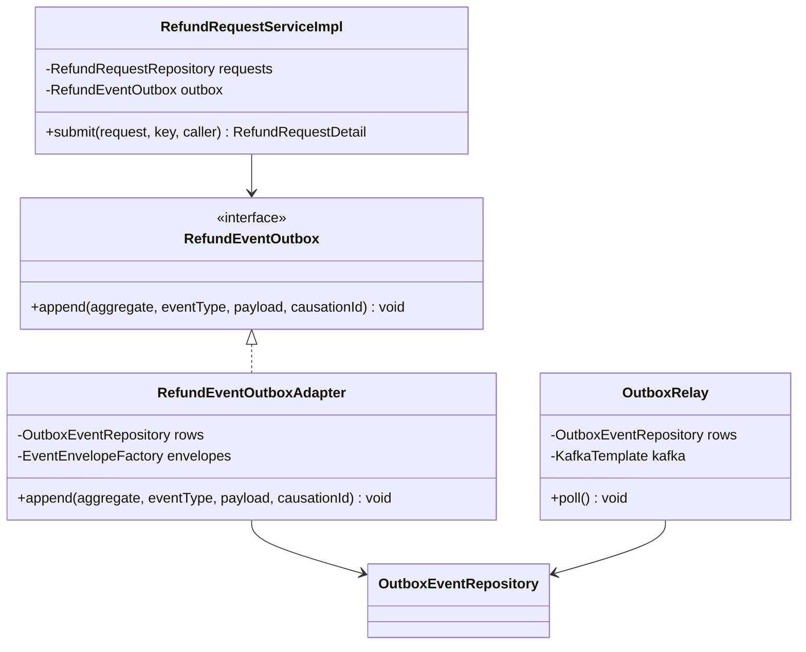

**Pseudocode skeleton:**

```text
RefundEventOutboxAdapter.append(aggregate, eventType, payload, causationId):   (inside the caller's TX)
  envelope = envelopes.create(eventId = idGen.next(), eventType, aggregate.id, "RefundRequest",
                              aggregate.version + 1, now, correlationId = MDC, causationId, aggregate.tenantId, payload)
  rows.insert(OutboxEvent(envelope.eventId, aggregate.tenantId, "refunds-platform-refund-events",
                          aggregateId = aggregate.id, eventType, messageKey = aggregate.id, occurredAt = now,
                          traceparent = currentSpan.traceparent(), payload = toJson(envelope)))

OutboxRelay.poll():                                   (every OUTBOX_POLL_INTERVAL_MS, advisory lock held)
  for row in rows.findUnpublishedOldestFirst(OUTBOX_BATCH_SIZE):          (by occurred_at)
    outcome = kafka.send(row.topic, row.messageKey, row.payload, headers(event_type, row.traceparent))
                   .get(OUTBOX_SEND_TIMEOUT_MS)       -> ACKED | FAILED | TIMED_OUT
    if outcome != ACKED: return                        (row stays unpublished; next poll retries it)
    rows.markPublished(row.eventId, now)               (own short TX per row)
```

**Delivery rules:** `09-cross-cutting.md` § 12.4 (`markPublished` only after `ACKED` with `acks=all`; `FAILED` or `TIMED_OUT` leaves `published_at` NULL and stops the poll at that row; a crash between the acknowledgement and `markPublished` re-sends the identical envelope with the same `event_id`, which payout-service and notification-service dedupe).

### Pattern: Idempotency (write endpoints and consumer inbox)

> **Applied:** Idempotency (CLAUDE.md: "Idempotency keys on all write endpoints touching money/wallet/notifications or external providers." and "Idempotency on every consumer and every write endpoint. Assume at-least-once delivery everywhere.")
>
> **Rationale (this service):** each POST triggers customer messages and, for an approval, money (a payout), so a retried submit, cancellation, or decision must not create a second request, event, or payout; SDD §17.1 API Standards require `Idempotency-Key` on every POST. `PAYOUT_SUCCEEDED` is delivered at least once, so a redelivery must not write a second `REFUND_PAID` or `RefundPaid`.

**Roles:**

| Role | Class / Component | Notes |
|------|-------------------|-------|
| Idempotency record table | `refund.idempotency_record` | Key `(tenant_id, caller_subject, idempotency_key)`; request hash; cached status and body; `expires_at` 24 h |
| Idempotency check | `IdempotencyStore.find` at the start of `submit`, `cancel`, `decide` | Same key and body: replay; same key and other body: 409 `CONFLICT` |
| Cached-response storage | `IdempotencyStore.save` inside the business transaction | A primary-key violation means a concurrent twin won: roll back and replay |
| Inbox | `refund.inbox_message` + `InboxDeduplicator.firstDelivery` | Key `(tenant_id, consumer, event_id)`, inserted in the effect's transaction |

**Class diagram:**

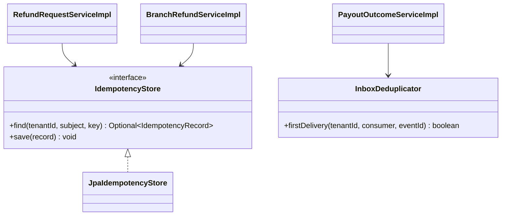

**Pseudocode skeleton:**

```text
withIdempotency(tenant, subject, key, request, action):
  hit = store.find(tenant, subject, key)
  if hit: return hit.hash == hash(request) ? hit.response : throw IdempotencyConflictException
  try: return TX { response = action(); store.save(tenant, subject, key, hash(request), response); response }
  catch DuplicateKeyException on idempotency_record: return withIdempotency(...)   (replay the winner)

InboxDeduplicator.firstDelivery(tenant, consumer, eventId):   (inside the consumer's TX)
  return insert into inbox_message (tenant_id, consumer, event_id, processed_at)
         values (...) on conflict do nothing  ==  1 row
```

### Pattern: RFC 9457 error model

> **Applied:** RFC 9457 ProblemDetails (CLAUDE.md: "Global @RestControllerAdvice, Problem Details (RFC 9457). Business exceptions extend a base ServiceException with error code.")
>
> **Rationale (this service):** the web app must show plain-language errors that say what to do next ([REFUNDS 11 § UI/UX Expectations](../../brd-refunds-portal/11-summary-and-uiux.md#uiux-expectations)) and branch on stable codes (`REFUND_WINDOW_PASSED`, `ITEM_ALREADY_REFUNDED`, `REFUND_ALREADY_DECIDED`); one translator keeps every endpoint on the SDD §15.1 envelope and never leaks a stack trace.

**Roles:**

| Role | Class / Component |
|------|-------------------|
| Base exception | `ServiceException` (commons): `errorCode`, `HttpStatus`, `detailKey` |
| Domain subclasses | The exceptions of § 7.7 |
| Translator | `GlobalProblemHandler` (`@RestControllerAdvice`, commons) |

**Class diagram:**

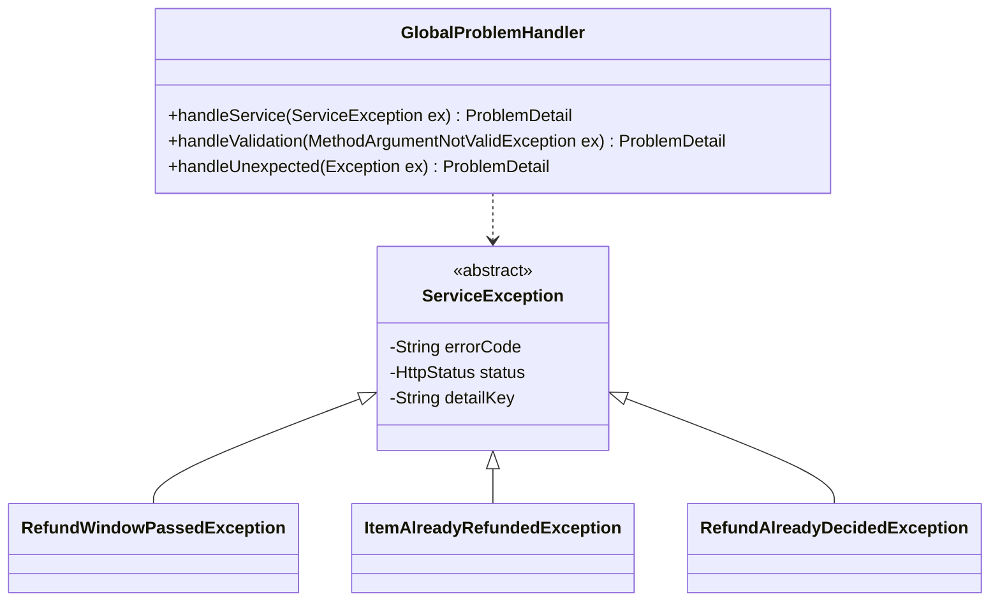

**Pseudocode skeleton:**

```text
handleService(ex):
  pd = ProblemDetail.forStatus(ex.status)
  pd.type = TYPE_BASE + "/refund/" + kebab(ex.errorCode);  pd.title = messages(ex.errorCode + ".title", tenantLocale)
  pd.detail = messages(ex.detailKey, tenantLocale);       pd.instance = request path
  pd.setProperty("errorCode", ex.errorCode);              pd.setProperty("traceId", currentTraceId())
  return pd                                               (application/problem+json)
```

### Pattern: Saga (choreography)

> **Applied:** Saga, choreography variant (CLAUDE.md: "Sagas (choreography by default, orchestration when the flow is complex or needs central visibility) for cross-service business transactions. No distributed 2PC.")
>
> **Rationale (this service):** the refund payout changes state in refund-service (APPROVED, then PAID) and in payout-service (the `Payout`). Distributed 2PC is forbidden, and the flow has two steps and one branch, so choreography is enough: refund-service emits `REFUND_APPROVED`, payout-service reacts and emits `PAYOUT_SUCCEEDED` or `PAYOUT_FAILED`, and refund-service reacts. There is no compensation: a payout still failing at the end of the retry window is reported once with `PAYOUT_FAILED`, the request stays APPROVED and flagged for the branch manager, and payout-service keeps retrying at the post-window interval until a `PAYOUT_SUCCEEDED` moves the request to PAID; the platform has no manual retry, other payout route, or closing of a refund (SDD §17.1, §17.2 After the retry window, [SDD §24.8.1](../../sdd-refunds-platform/19-e2e-system-design.md#2481-refund-decision-to-payout-choreographed)).

**Roles:**

| Step | Service | Action | Compensation |
|------|---------|--------|--------------|
| 1 | refund-service | `decide` -> APPROVED, outbox `REFUND_APPROVED` | None (nothing is rolled back) |
| 2 | payout-service | Create and send the payout ([payout-service § REFUNDS/UC-04](./payout-service.md#participates-in-refundsuc-04-approve--reject-refund)) | Retries within the SDD §17.2 retry window, `PAYOUT_FAILED` once at its end, then post-window retries until accepted |
| 3 | refund-service | `applyPayoutSucceeded` -> PAID, outbox `REFUND_PAID`, `RefundPaid`; or `applyPayoutFailed` -> flag | - |

**Class diagram:**

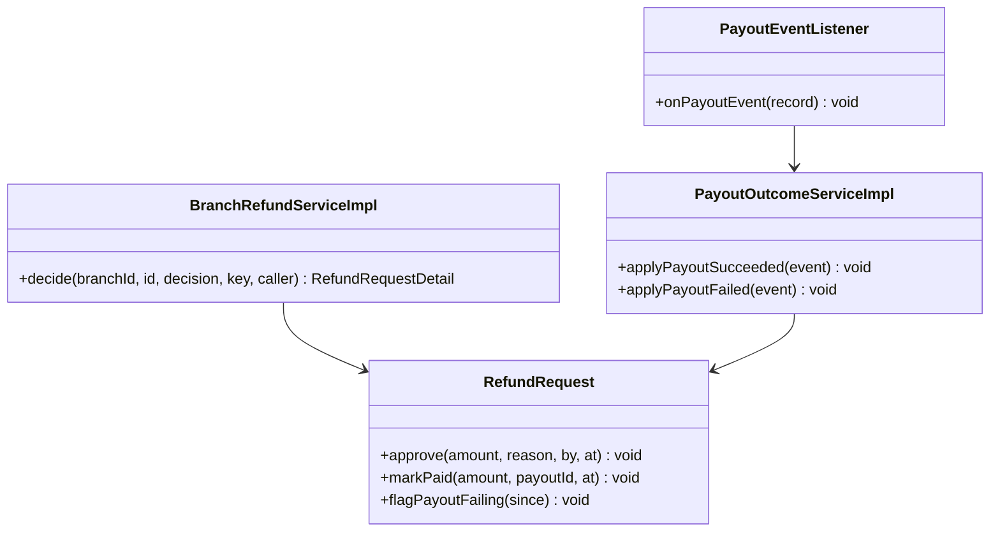

**Pseudocode skeleton:**

```text
step 1: decide(...) -> r.approve(...); outbox.append(r, "REFUND_APPROVED", ...)          (one TX)
step 3: onPayoutEvent(record):
          switch header(event_type): "PAYOUT_SUCCEEDED" -> applyPayoutSucceeded(env)
                                     "PAYOUT_FAILED"    -> applyPayoutFailed(env)
                                     other              -> ignore
```

### Pattern: Resilience4j on API-01 (POS Records receipt lookup)

> **Applied:** Resilience defaults (CLAUDE.md: "Resilience defaults: timeouts, retries with exponential backoff and jitter, circuit breakers (Resilience4j), bulkheads for downstream provider calls (e.g., eSIM, payment, SMS).")
>
> **Rationale (this service):** calls to POS Records may hang or fail while a customer waits on the lookup or the submission; per CLAUDE.md and [SDD §12 INT-03](../../sdd-refunds-platform/08-integrations.md#12-integrations), the idempotent read gets a short timeout, a retry with backoff and jitter inside the customer's request, a circuit breaker that answers `RECEIPT_LOOKUP_UNAVAILABLE` fast, and a bulkhead of 10 so a slow POS Records cannot starve the core's request threads.

**Roles:**

| Role | Class / Component |
|------|-------------------|
| Port | `PosReceiptPort` |
| Adapter | `PosReceiptHttpAdapter` (Spring `RestClient`, per-tenant credentials from the secrets manager) |
| Policies | Resilience4j instances `posRecords` (TimeLimiter, Retry, CircuitBreaker, Bulkhead), values in 09 § 12.3 |

**Class diagram:**

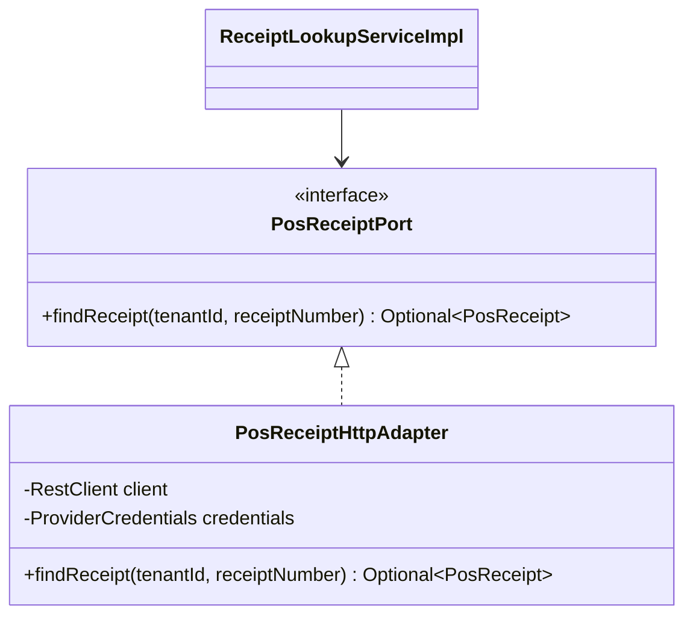

**Pseudocode skeleton:**

```text
@Bulkhead(name = "posRecords") @CircuitBreaker(name = "posRecords") @Retry(name = "posRecords")
Optional<PosReceipt> findReceipt(tenantId, receiptNumber):
  response = client.get(API-01 URI TBD, credentials.forTenant(tenantId), timeout from TimeLimiter)
  404-equivalent from the provider -> Optional.empty()        (mapping TBD - external)
  success -> Optional.of(PosReceiptMapper.from(response))
fallback (CallNotPermittedException, timeout, 5xx after retries) -> throw ReceiptLookupUnavailableException (503)
```

> TODO: API-01 is `TBD - external` in [SDD §15.3](../../sdd-refunds-platform/11-api-contracts.md#api-01-look-up-a-receipt-and-its-items-refund-service---pos-records) (URI, auth, fields, errors); `PosReceiptHttpAdapter` stays a stub behind `PosReceiptPort` until the POS Records documentation is supplied - verify then.

### Pattern: In-process domain event with durable publication log

> **Applied:** Event-driven by default (CLAUDE.md: "Event-driven by default for cross-service flows"), realised in process as [SDD ADR-05](../../sdd-refunds-platform/06-principles-and-decisions.md#10-architectural-decisions) prescribes for the two core modules.
>
> **Rationale (this service):** points must be taken back after a paid refund within one hour (LOYALTY/NFR-02) without refund-service knowing loyalty's tables or letting a loyalty failure roll back the Paid transition. Recording `RefundPaid` in `core_events.event_publication` in the PAID transaction and dispatching it after commit gives at-least-once, replayable delivery with no broker round trip.

**Roles:**

| Role | Class / Component |
|------|-------------------|
| Outbound port | `RefundPaidPublisher` |
| Adapter | `RefundPaidPublisherAdapter` |
| Durable log writer and dispatcher | `DurableEventPublisher`, `EventPublicationDispatcher` (`core-eventing`, 07 § 10.6) |
| Listener | `RefundPaidListener` in loyalty-service |

**Class diagram:**

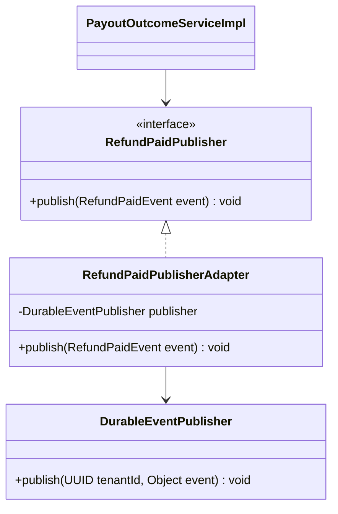

**Pseudocode skeleton:**

```text
RefundPaidPublisherAdapter.publish(event):     (inside the PAID TX; Propagation.MANDATORY)
  publisher.publish(event.tenantId(), event)   -> one event_publication row per registered listener, same TX
                                               -> Spring ApplicationEvent handled AFTER_COMMIT by the dispatcher
```

---

## 7.5 Dependency Injection Graph

> **Convention:** constructor injection only. Document the wiring graph for non-trivial cases (3+ collaborators, or any factory/strategy/mediator wiring).

```mermaid
graph TB
  ReceiptController --> ReceiptLookupService
  RefundRequestController --> RefundRequestService
  BranchRefundRequestController --> BranchRefundService
  PayoutEventListener --> PayoutOutcomeService
  PayoutWatchdogJob --> PayoutOutcomeService
  RefundRetentionJob --> RefundRetentionService
  RefundContactErasureJob --> RefundRetentionService
  ReceiptLookupService -.implements.-> ReceiptLookupServiceImpl
  RefundRequestService -.implements.-> RefundRequestServiceImpl
  BranchRefundService -.implements.-> BranchRefundServiceImpl
  PayoutOutcomeService -.implements.-> PayoutOutcomeServiceImpl
  RefundRetentionService -.implements.-> RefundRetentionServiceImpl
  ReceiptLookupServiceImpl --> PosReceiptPort
  ReceiptLookupServiceImpl --> RefundEligibilityPolicy
  RefundRequestServiceImpl --> PosReceiptPort
  RefundRequestServiceImpl --> RefundEligibilityPolicy
  RefundRequestServiceImpl --> RefundRequestRepository
  RefundRequestServiceImpl --> RefundReferenceCounterRepository
  RefundRequestServiceImpl --> RefundEventOutbox
  RefundRequestServiceImpl --> IdempotencyStore
  BranchRefundServiceImpl --> BranchAccessGuard
  BranchRefundServiceImpl --> RefundRequestRepository
  BranchRefundServiceImpl --> RefundEventOutbox
  BranchRefundServiceImpl --> IdempotencyStore
  BranchRefundServiceImpl --> BranchReportQuery
  PayoutOutcomeServiceImpl --> InboxDeduplicator
  PayoutOutcomeServiceImpl --> RefundRequestRepository
  PayoutOutcomeServiceImpl --> RefundEventOutbox
  PayoutOutcomeServiceImpl --> RefundPaidPublisher
```

Every service implementation also takes `Clock`, `IdGenerator`, `TenantSettingsRegistry`, and `MeterRegistry` by constructor, and `RefundRetentionServiceImpl` takes `RefundRequestRepository` (omitted from the graph). Composition over inheritance: collaborators are injected, and the only class hierarchy is the `ServiceException` tree.

---

## 7.6 Transaction Boundaries

| Method | Propagation | Isolation | Rollback rules |
|--------|-------------|-----------|----------------|
| `ReceiptLookupServiceImpl.lookup` | `SUPPORTS` (read-only, no transaction across the API-01 call) | `READ_COMMITTED` | - |
| `RefundRequestServiceImpl.submit` (step 6 only) | `REQUIRED` | `READ_COMMITTED` | Rollback on any `RuntimeException`; `DuplicateKeyException` on `idempotency_record` handled by replay |
| `RefundRequestServiceImpl.cancel` | `REQUIRED` | `READ_COMMITTED` | Rollback on `ServiceException`; `OptimisticLockException` re-read then 409 |
| `BranchRefundServiceImpl.decide` | `REQUIRED` | `READ_COMMITTED` | Rollback on `ServiceException`; `OptimisticLockException` re-read then 409 |
| `PayoutOutcomeServiceImpl.applyPayoutSucceeded` / `applyPayoutFailed` | `REQUIRED` (listener-started) | `READ_COMMITTED` | Rollback on any exception; the Kafka error handler retries, then dead-letters |
| `PayoutOutcomeServiceImpl.flagOverduePayouts` | One `REQUIRES_NEW` transaction per flagged row | `READ_COMMITTED` | A failed row is logged and retried on the next run |
| `RefundRetentionServiceImpl.applyRetention` | One `REQUIRES_NEW` transaction per tenant batch | `READ_COMMITTED` | A failed batch is logged and retried on the next day |
| `RefundRetentionServiceImpl.eraseCustomerContact` | `REQUIRED`, one transaction | `READ_COMMITTED` | Rollback on any exception; operations runs the job again |
| `listOwn`, `getOwn`, `listBranch`, `getBranch`, `dailyReport` | `REQUIRED`, `readOnly = true` | `READ_COMMITTED` | - |
| `RefundEventOutboxAdapter.append`, `RefundPaidPublisherAdapter.publish` | `MANDATORY` | inherited | Fails fast if called outside the aggregate's transaction |

> **Convention:** outbox row insert lives inside the same transaction as the aggregate write. No `@Transactional(propagation = REQUIRES_NEW)` for outbox writes - the whole point of the pattern is one-tx commit.

> Confirm: transaction propagation default applied; verify per method (the `REQUIRES_NEW` per row in the watchdog and the read-only `SUPPORTS` lookup are LLD choices).

---

## 7.7 Error Handling

| Exception | RFC 9457 type | `errorCode` (SDD §15.1) | HTTP Status | When thrown | Caller action |
|-----------|---------------|-------------------------|-------------|-------------|---------------|
| `RequestValidationException` (Bean Validation) | `{TYPE_BASE}/refund/validation-failed` | `VALIDATION_FAILED` | 400 | Body or parameter fails validation; `errors[]` per field | Fix the field |
| `ReceiptNotFoundException` | `{TYPE_BASE}/refund/receipt-not-found` | `RECEIPT_NOT_FOUND` | 404 | POS Records has no such receipt (REFUNDS/UC-01 E2) | Check the number and retry |
| `RefundWindowPassedException` | `{TYPE_BASE}/refund/refund-window-passed` | `REFUND_WINDOW_PASSED` | 422 | Purchase older than 30 days (REFUNDS/UC-01 E1; BR-1: 30-day window) | Visit the branch |
| `ReceiptNotCardPaidException` | `{TYPE_BASE}/refund/receipt-not-card-paid` | `RECEIPT_NOT_CARD_PAID` | 422 | No card payment on the receipt | Refund at the branch |
| `ItemAlreadyRefundedException` | `{TYPE_BASE}/refund/item-already-refunded` | `ITEM_ALREADY_REFUNDED` | 422 | A selected line is on an active request (REFUNDS/UC-01 A1; BR-2: one refund per item) | Reload items |
| `AmountMismatchException` | `{TYPE_BASE}/refund/amount-changed` | `CONFLICT` | 409 | Recomputed amount differs from `expectedAmount` (REFUNDS/UC-01 step 4) | Review the refreshed items |
| `ContactDetailsMissingException` | `{TYPE_BASE}/refund/contact-details-missing` | `BUSINESS_RULE_VIOLATION` | 422 | Token has neither `email` nor `phone_number` | Complete the Keycloak profile |
| `IdempotencyConflictException` | `{TYPE_BASE}/idempotency/key-reused` | `CONFLICT` | 409 | Same `Idempotency-Key`, different body | Use a new key for a new request |
| `RefundRequestNotFoundException` | `{TYPE_BASE}/refund/not-found` | `NOT_FOUND` | 404 | Unknown id, another customer's request, or another branch's id | None |
| `RefundAlreadyDecidedException` | `{TYPE_BASE}/refund/refund-already-decided` | `REFUND_ALREADY_DECIDED` | 409 | Cancel or decide a request that is no longer SUBMITTED (REFUNDS/UC-03 E1) | Refresh the request |
| `PartialAmountOutOfRangeException` | `{TYPE_BASE}/refund/partial-amount-out-of-range` | `PARTIAL_AMOUNT_OUT_OF_RANGE` | 422 | `approvedAmount` present but not in (0, requested) (REFUNDS/UC-04 A1; BR-2: partial amount range) | Enter a valid amount |
| `DecisionReasonRequiredException` | `{TYPE_BASE}/refund/decision-reason-required` | `DECISION_REASON_REQUIRED` | 422 | Partial approval or rejection without a reason (REFUNDS/UC-04 BR-3: a rejection always has a reason) | Add a reason |
| `BranchAccessDeniedException` | `{TYPE_BASE}/refund/forbidden` | `FORBIDDEN` | 403 | `branchId` differs from the `branch_id` claim (REFUNDS/UC-04 BR-1: own branch only) | None |
| `SelfDecisionForbiddenException` | `{TYPE_BASE}/refund/forbidden` | `FORBIDDEN` | 403 | Branch manager decides a request they submitted | None |
| `ReceiptLookupUnavailableException` | `{TYPE_BASE}/refund/receipt-lookup-unavailable` | `RECEIPT_LOOKUP_UNAVAILABLE` | 503 | API-01 circuit open, timeout, or 5xx after retries | Try again later |
| Spring Security denial | `{TYPE_BASE}/auth/forbidden`, `{TYPE_BASE}/auth/unauthenticated` | `FORBIDDEN`, `UNAUTHENTICATED` | 403, 401 | Missing permission token, invalid token | Sign in again / none |
| Any other exception | `{TYPE_BASE}/internal-error` | `INTERNAL_ERROR` | 500 | Unexpected | Retry later; the body carries only the correlation id |
| `UnknownRefundRequestException`, `PaidAmountMismatchException` (consumer) | - | - | - | Payout event for an unknown request or a different amount | Non-retryable: DLQ `refunds-platform-payout-events.refund-service.dlq` + alarm |

> **Convention:** all exceptions extend `ServiceException` (CLAUDE.md base class). Global `@RestControllerAdvice` translates to `ProblemDetails` (RFC 9457). Error envelope schema in `09-cross-cutting.md` § Error Model.

---

## 7.8 Use-Case Workflows

> **Convention:** one subsection per active use case this service owns (SDD §7.3 Owner), headed with the SDD's BRD key and the BRD's ID and title exactly. A merged or removed use case gets no block. Cross-service sagas live in the orchestrator service's file. Each workflow has: the traceability line, control flow, sequence diagram (Mermaid), idempotency points, outbox emission points, retry/timeout choices.

[REFUNDS/UC-05](../../brd-refunds-portal/05-user-journeys-overview.md#use-case-summary) (Issue Partial Refund) is merged into REFUNDS/UC-04 in SDD §7.3 and gets no block; its partial approval is REFUNDS/UC-04 A1 below.

### REFUNDS/UC-01: Request a Refund

> **Traceability:** BRD [REFUNDS/UC-01](../../brd-refunds-portal/06a-use-cases-customer.md#uc-01-request-a-refund) · SDD [§7.3](../../sdd-refunds-platform/03-users-and-use-cases.md#73-use-case-traceability-brd--sdd) · Owner: refund-service · Entry points: `GET /v1/receipts/{receiptNumber}/refundable-items`, `POST /v1/refund-requests` · UAT/BAT: [REFUNDS/TC-REQ-01](../../brd-refunds-portal/16-uat-bat-test-cases.md#1-refund-requests-uc-01-uc-02-uc-03-scr-01-scr-02), [REFUNDS/TC-REQ-02](../../brd-refunds-portal/16-uat-bat-test-cases.md#1-refund-requests-uc-01-uc-02-uc-03-scr-01-scr-02), [REFUNDS/TC-REQ-03](../../brd-refunds-portal/16-uat-bat-test-cases.md#1-refund-requests-uc-01-uc-02-uc-03-scr-01-scr-02), [REFUNDS/TC-REQ-04](../../brd-refunds-portal/16-uat-bat-test-cases.md#1-refund-requests-uc-01-uc-02-uc-03-scr-01-scr-02), [REFUNDS/TC-UIX-01](../../brd-refunds-portal/16-uat-bat-test-cases.md#3-cross-cutting-uiux-standards-chunk-11) · Screens: [REFUNDS/SCR-01](../../brd-refunds-portal/11-summary-and-uiux.md#screens) via `/refunds/new`

**Trigger:** `ReceiptController.lookup` with `@UseCase("REFUNDS/UC-01")`, then `RefundRequestController.submit` with `@UseCase("REFUNDS/UC-01")`.

**Pre-conditions:** the caller holds `CUSTOMER` (tokens `refund.receipt.read`, `refund.request.create`); the token carries `tenant_id`, `sub`, and `email` or `phone_number`.

**Post-conditions:** one `RefundRequest` in SUBMITTED with a unique `RF-` reference number, its active items, a SUBMITTED history row, and one unpublished `REFUND_SUBMITTED` outbox row; the idempotency record caches the 201 body.

**Control flow:**

```text
1. Customer enters the receipt number; the web app calls the lookup (REFUNDS/UC-01 step 1)
2. lookup: API-01, window, card-paid, item availability (REFUNDS/UC-01 step 2; A1 items refundable = false, ALREADY_REFUNDED)
3. Customer selects items and a reason; the web app shows the sum of the selected server amounts, capped at cardPaidAmount (REFUNDS/UC-01 steps 3-4)
4. POST with Idempotency-Key and expectedAmount (REFUNDS/UC-01 step 5)
5. Idempotency check: replay or 409 CONFLICT on a reused key with another body
6. Re-read the receipt, re-check window, card payment, and items; recompute the amount (409 CONFLICT when it differs)
7. One TX: reference number (refund_reference_counter), request SUBMITTED, items, history - outbox emission point: REFUND_SUBMITTED (REFUNDS/UC-01 step 6)
8. 201 with RefundRequestDetail; notification-service later sends email and SMS (REFUNDS/UC-01 step 6)
9. REFUNDS/UC-01 E1 (window passed) -> 422 REFUND_WINDOW_PASSED; E2 (unknown receipt) -> 404 RECEIPT_NOT_FOUND
```

**Sequence diagram:**

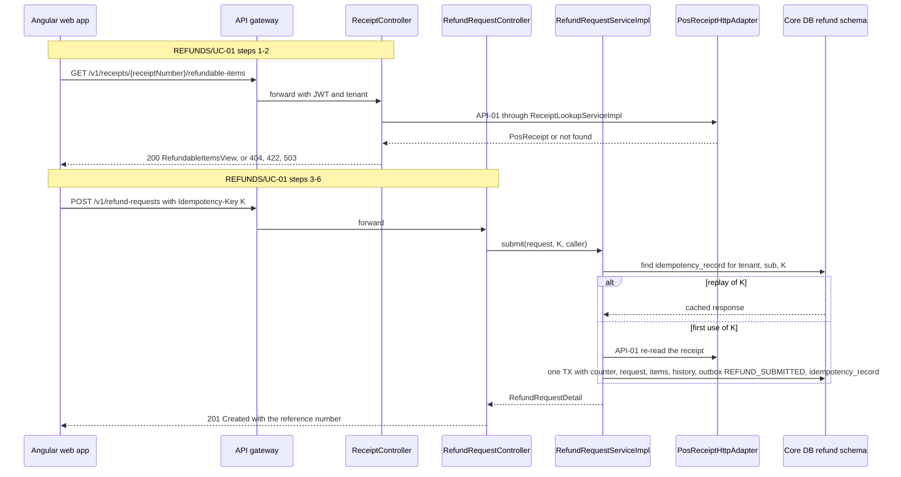

**Idempotency points:** `Idempotency-Key` (UUID) required on the POST; dedup tuple `(tenant_id, caller_subject, idempotency_key)`; 24 h TTL; the partial unique index `ux_refund_item_active_line` stops two different requests on the same line under concurrency (REFUNDS/UC-01 BR-2: one refund per item).

**Outbox emission points:** step 7 emits `REFUND_SUBMITTED` on `refunds-platform-refund-events`, key `refundRequestId`.

**Retry / timeout policy:** API-01 per 09 § 12.3 (`posRecords`), inside the customer's request; no retry of the POST by the server. A failed or timed-out publish leaves the outbox row unpublished; the next relay poll retries it until the broker acknowledges (`OutboxBacklog`, 10 § 13.7).

**Error handling:** validation -> 400 `VALIDATION_FAILED`; REFUNDS/UC-01 E2 -> 404 `RECEIPT_NOT_FOUND`; REFUNDS/UC-01 E1 -> 422 `REFUND_WINDOW_PASSED`; REFUNDS/UC-01 A1 at submit -> 422 `ITEM_ALREADY_REFUNDED`; no card payment -> 422 `RECEIPT_NOT_CARD_PAID`; amount changed -> 409 `CONFLICT`; POS Records down -> 503 `RECEIPT_LOOKUP_UNAVAILABLE`; rate limit -> 429 `RATE_LIMITED` from the gateway.

### REFUNDS/UC-02: Track Refund Status (Web and Mobile)

> **Traceability:** BRD [REFUNDS/UC-02](../../brd-refunds-portal/06a-use-cases-customer.md#uc-02-track-refund-status-web-and-mobile) · SDD [§7.3](../../sdd-refunds-platform/03-users-and-use-cases.md#73-use-case-traceability-brd--sdd) · Owner: refund-service · Entry points: `GET /v1/refund-requests`, `GET /v1/refund-requests/{refundRequestId}` · UAT/BAT: [REFUNDS/TC-REQ-05](../../brd-refunds-portal/16-uat-bat-test-cases.md#1-refund-requests-uc-01-uc-02-uc-03-scr-01-scr-02), [REFUNDS/TC-REQ-06](../../brd-refunds-portal/16-uat-bat-test-cases.md#1-refund-requests-uc-01-uc-02-uc-03-scr-01-scr-02), [REFUNDS/TC-UIX-01](../../brd-refunds-portal/16-uat-bat-test-cases.md#3-cross-cutting-uiux-standards-chunk-11) · Screens: [REFUNDS/SCR-02](../../brd-refunds-portal/11-summary-and-uiux.md#screens) via `/refunds`, `/refunds/:refundRequestId`

**Trigger:** `RefundRequestController.list` and `RefundRequestController.get`, both with `@UseCase("REFUNDS/UC-02")`.

**Pre-conditions:** the caller holds `refund.request.read-own`.

**Post-conditions:** none (read-only).

**Control flow:**

```text
1. List: SELECT the caller's requests (tenant, customer_id = sub) newest first, page and size (REFUNDS/UC-02 steps 1-2)
2. Each row: reference number, requested or approved amount with currency, status (REFUNDS/TC-UIX-01)
3. Empty page -> the web app shows "no refund requests" (REFUNDS/UC-02 A1)
4. Detail: SELECT the request and its history by id and customer_id = sub (REFUNDS/UC-02 steps 3-4)
5. Not the caller's or unknown -> 404 NOT_FOUND (REFUNDS/UC-02 BR-1: own requests only)
6. Detail carries each status change with its date and, when rejected, the reason (AC-1: Approved with its date)
```

**Sequence diagram:**

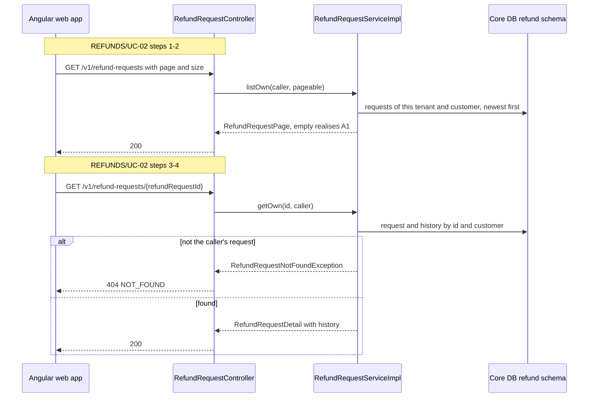

**Idempotency points:** none (safe reads).

**Outbox emission points:** none.

**Retry / timeout policy:** none server-side; the web app retries a failed GET once on 503.

**Error handling:** bad paging -> 400 `VALIDATION_FAILED`; other customer's or unknown id -> 404 `NOT_FOUND`; missing token -> 403 `FORBIDDEN`.

### REFUNDS/UC-03: Cancel a Refund Request

> **Traceability:** BRD [REFUNDS/UC-03](../../brd-refunds-portal/06a-use-cases-customer.md#uc-03-cancel-a-refund-request) · SDD [§7.3](../../sdd-refunds-platform/03-users-and-use-cases.md#73-use-case-traceability-brd--sdd) · Owner: refund-service · Entry points: `POST /v1/refund-requests/{refundRequestId}/cancellation` · UAT/BAT: [REFUNDS/TC-REQ-07](../../brd-refunds-portal/16-uat-bat-test-cases.md#1-refund-requests-uc-01-uc-02-uc-03-scr-01-scr-02), [REFUNDS/TC-REQ-08](../../brd-refunds-portal/16-uat-bat-test-cases.md#1-refund-requests-uc-01-uc-02-uc-03-scr-01-scr-02) · Screens: [REFUNDS/SCR-02](../../brd-refunds-portal/11-summary-and-uiux.md#screens) via `/refunds`, `/refunds/:refundRequestId`

**Trigger:** `RefundRequestController.cancel` with `@UseCase("REFUNDS/UC-03")`.

**Pre-conditions:** the caller holds `refund.request.cancel-own`; the request is the caller's.

**Post-conditions:** CANCELLED with `closed_at`, items inactive (released for a new request), history row, one `REFUND_CANCELLED` outbox row.

**Control flow:**

```text
1. Customer opens a Submitted request and chooses Cancel; the web app asks to confirm (REFUNDS/UC-03 steps 1-4)
2. POST with Idempotency-Key; idempotency check
3. TX: load by id and customer; status must be SUBMITTED (REFUNDS/UC-03 BR-1: only Submitted requests can be cancelled)
4. CANCELLED, items released, history - outbox emission point: REFUND_CANCELLED (REFUNDS/UC-03 step 5)
5. Decided meanwhile or optimistic-lock conflict -> 409 REFUND_ALREADY_DECIDED (REFUNDS/UC-03 E1)
6. notification-service later sends the email (REFUNDS/UC-03 step 5)
```

**Sequence diagram:**

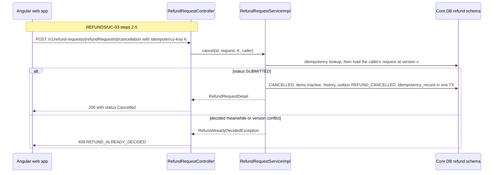

**Idempotency points:** `Idempotency-Key` required; a retried cancellation returns the cached 200.

**Outbox emission points:** step 4 emits `REFUND_CANCELLED`.

**Retry / timeout policy:** no provider call; relay retry as in REFUNDS/UC-01.

**Error handling:** other customer's or unknown id -> 404 `NOT_FOUND`; REFUNDS/UC-03 E1 -> 409 `REFUND_ALREADY_DECIDED`; reused key with another body -> 409 `CONFLICT`.

### REFUNDS/UC-04: Approve / Reject Refund

> **Traceability:** BRD [REFUNDS/UC-04](../../brd-refunds-portal/06b-use-cases-branch-manager.md#uc-04-approve--reject-refund) · SDD [§7.3](../../sdd-refunds-platform/03-users-and-use-cases.md#73-use-case-traceability-brd--sdd) · Owner: refund-service · Entry points: `GET /v1/branches/{branchId}/refund-requests`, `GET /v1/branches/{branchId}/refund-requests/{refundRequestId}`, `POST /v1/branches/{branchId}/refund-requests/{refundRequestId}/decision` · UAT/BAT: [REFUNDS/TC-DEC-01](../../brd-refunds-portal/16-uat-bat-test-cases.md#2-refund-decisions-uc-04-mk-03), [REFUNDS/TC-DEC-02](../../brd-refunds-portal/16-uat-bat-test-cases.md#2-refund-decisions-uc-04-mk-03), [REFUNDS/TC-DEC-03](../../brd-refunds-portal/16-uat-bat-test-cases.md#2-refund-decisions-uc-04-mk-03), [REFUNDS/TC-DEC-04](../../brd-refunds-portal/16-uat-bat-test-cases.md#2-refund-decisions-uc-04-mk-03), [REFUNDS/TC-DEC-05](../../brd-refunds-portal/16-uat-bat-test-cases.md#2-refund-decisions-uc-04-mk-03), [REFUNDS/TC-UIX-01](../../brd-refunds-portal/16-uat-bat-test-cases.md#3-cross-cutting-uiux-standards-chunk-11) · Screens: [REFUNDS/MK-03](../../brd-refunds-portal/14-todo.md#mockup-coverage) via `/branch/refund-requests`, `/branch/refund-requests/:refundRequestId`

**Trigger:** `BranchRefundRequestController.list`, `.get`, and `.decide`, each with `@UseCase("REFUNDS/UC-04")`; then `PayoutEventListener` (no `@UseCase`, 09 § 12.8) for step 7 and E1.

**Pre-conditions:** the caller holds `BRANCH_MANAGER` with a `branch_id` claim equal to the path `branchId`; the request is SUBMITTED.

**Post-conditions:** APPROVED with `approved_amount` and one `REFUND_APPROVED` outbox row, or REJECTED with a reason, `closed_at`, items released, and one `REFUND_REJECTED` outbox row. After a successful payout: PAID with `closed_at`, one `REFUND_PAID` outbox row, and one `core_events.event_publication` row for `RefundPaid`. After a payout still failing at the end of the retry window: still APPROVED with `payout_failing_since` set, until a later post-window attempt succeeds.

**Control flow:**

```text
1. Queue: SUBMITTED requests of the branch (status filter, default SUBMITTED), oldest first, with amount and request reason (REFUNDS/UC-04 steps 1-2)
   payoutFailing=true lists APPROVED requests with payout_failing_since or payout_outcome_overdue_since (REFUNDS/UC-04 E1; AC-2: the branch manager is told)
2. Detail of one request, with payoutFailingSince and payoutOutcomeOverdueSince (REFUNDS/UC-04 step 3)
3. Branch gate (403) and self-decision guard (403) (REFUNDS/UC-04 BR-1: own branch only)
4. APPROVE in full (no approvedAmount), or in part with 0 < approvedAmount < requested and a reason (REFUNDS/UC-04 steps 4-5, A1; BR-2: partial amount range)
   - outbox emission point: REFUND_APPROVED (REFUNDS/UC-04 step 6)
5. REJECT with a reason (REFUNDS/UC-04 A2; BR-3: a rejection always has a reason) - outbox emission point: REFUND_REJECTED
6. payout-service pays asynchronously (payout-service, Participates in REFUNDS/UC-04)
7. PAYOUT_SUCCEEDED: inbox dedup; APPROVED -> PAID - outbox emission point: REFUND_PAID; publication RefundPaid (REFUNDS/UC-04 step 7)
8. PAYOUT_FAILED: inbox dedup; set payout_failing_since; the request appears on the payout-failing list, flagged on its detail,
   and counted when the branch area opens (REFUNDS/UC-04 E1; AC-2: the branch manager is told); told in the portal only (SDD §17.1 Payout outcome)
9. payout-service keeps retrying after PAYOUT_FAILED; a later PAYOUT_SUCCEEDED takes step 7 (SDD §17.2 After the retry window)
```

**Sequence diagram (decision):**

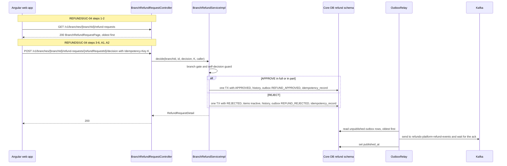

**Sequence diagram (payout outcome):**

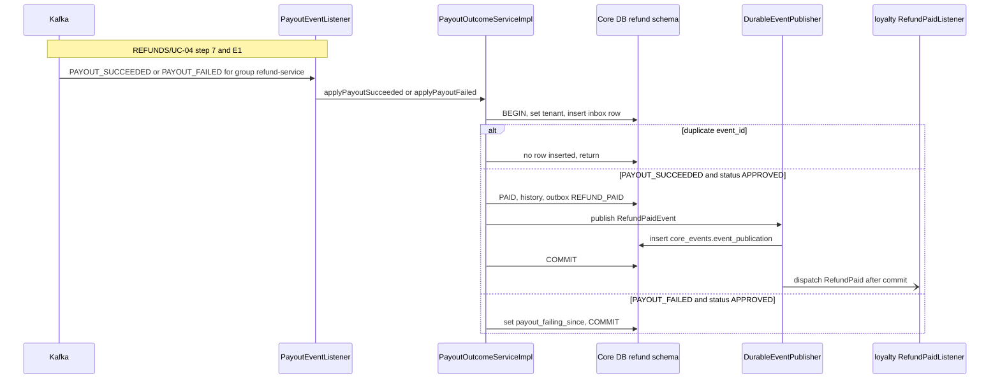

**Idempotency points:** `Idempotency-Key` required on the decision; inbox `(tenant_id, "refund-service", event_id)` for payout events; the state guard (only from APPROVED) makes a reordered or repeated outcome a no-op.

**Outbox emission points:** step 4 `REFUND_APPROVED`; step 5 `REFUND_REJECTED`; step 7 `REFUND_PAID` (with `causation_id` = the `PAYOUT_SUCCEEDED` `event_id`) plus the in-process `RefundPaid` publication.

**Retry / timeout policy:** decision: none server-side. Payout events: consumer retries by failure class, then DLQ (SDD §14.6 rule 4; 07 § 10.4); relay retry as in REFUNDS/UC-01; the `RefundPaid` publication is replayed by `EventPublicationReplayJob` every 5 minutes until the listener completes (07 § 10.6).

**Error handling:** other branch -> 403 `FORBIDDEN` ([REFUNDS/TC-DEC-05](../../brd-refunds-portal/16-uat-bat-test-cases.md#2-refund-decisions-uc-04-mk-03)); own request -> 403 `FORBIDDEN`; decided or cancelled -> 409 `REFUND_ALREADY_DECIDED`; REFUNDS/UC-04 A1 out of range -> 422 `PARTIAL_AMOUNT_OUT_OF_RANGE`; missing reason -> 422 `DECISION_REASON_REQUIRED`; `approvedAmount` on a rejection -> 400 `VALIDATION_FAILED`; unknown request in a payout event or amount mismatch -> DLQ + alarm.

### Workflow: Payout watchdog

> **Traceability:** No BRD use case - realises [REFUNDS/NFR-01](../../brd-refunds-portal/10-nfrs.md#non-functional-requirements) per [SDD §17.1 Business Logic](../../sdd-refunds-platform/13a-service-refund.md#business-logic) · Entry points: `Schedule: payout-watchdog` (not listed in SDD §7.3)

**Trigger:** `PayoutWatchdogJob.run`, `@Scheduled(fixedDelayString = "${refund.payout-watchdog.interval}")`, advisory lock `payout-watchdog`.

**Pre-conditions:** none. **Post-conditions:** every APPROVED request older than the retry window plus one hour with no outcome carries `payout_outcome_overdue_since` and shows on the branch payout-failing list; the gauge `refund_payout_outcome_overdue_requests` reflects the count.

**Control flow:** `PayoutOutcomeServiceImpl.flagOverduePayouts` (§ 7.3).

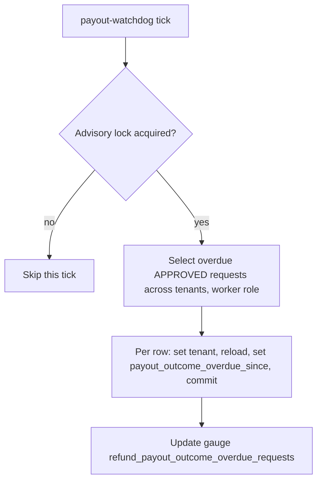

**Idempotency points:** the `payout_outcome_overdue_since IS NULL` predicate makes a rerun a no-op. **Outbox emission points:** none (the SDD adds no event). **Retry / timeout policy:** a failed row waits for the next tick. **Error handling:** errors are logged with `refundRequestId`; the job never throws past the scheduler.

### Workflow: Daily branch refund report

> **Traceability:** No BRD use case - serves [REFUNDS 09 § Reporting / Analytics](../../brd-refunds-portal/09-reporting-and-analytics.md#reporting--analytics) per [SDD §17.1 Business Logic](../../sdd-refunds-platform/13a-service-refund.md#business-logic) · Entry points: `GET /v1/branches/{branchId}/refund-report` (not listed in SDD §7.3) · Screens: none in the BRD (14 § 17.3 route `/branch/refund-report`)

> Confirm: the daily branch report is behaviour no BRD use case covers (it comes from REFUNDS 09); it carries no `@UseCase` and no use case ID, and the report screen has no screen ID or `MK-NN` in the BRD.

**Trigger:** `BranchRefundRequestController.report` (`?date=YYYY-MM-DD`, required, a date in the tenant zone; SDD §17.1 `BranchRefundReport` query).

**Pre-conditions:** `refund.report.read-branch` and own branch. **Post-conditions:** none (read-only).

**Control flow:** branch gate; day window `[date 00:00, date+1 00:00)` in the tenant zone converted to UTC; `BranchReportQuery` (08 § 11.3) returns `requestsByStatus`, `amountPaid`, and `averageTimeToDecision` (absent when no request was decided); amounts carry their currency.

**Idempotency points / Outbox emission points / Retry and timeout policy:** none (read-only). **Error handling:** other branch -> 403; missing or bad date -> 400 `VALIDATION_FAILED`.

### Workflow: Refund record retention and contact erasure

> **Traceability:** No BRD use case - realises [SDD §17.1 Retention Policy](../../sdd-refunds-platform/13a-service-refund.md#retention-policy) and [Compliance](../../sdd-refunds-platform/13a-service-refund.md#compliance) · Entry points: `Schedule: refund-retention` (LLD name), operations job `refund-contact-erasure` (neither listed in SDD §7.3)

**Trigger:** `RefundRetentionJob` (daily) and `RefundContactErasureJob` (launched by operations, RB-08).

**Pre-conditions:** the tenant settings `refundRecordRetention` and `contactDetailsRetention` (SDD §11.2); for an erasure, a request the data protection owner approved. **Post-conditions:** no closed request older than `refundRecordRetention`; no contact detail on a request closed longer than `contactDetailsRetention`; after an erasure, no contact detail on any request of the customer.

**Control flow:** `RefundRetentionServiceImpl.applyRetention` and `eraseCustomerContact` (§ 7.3).

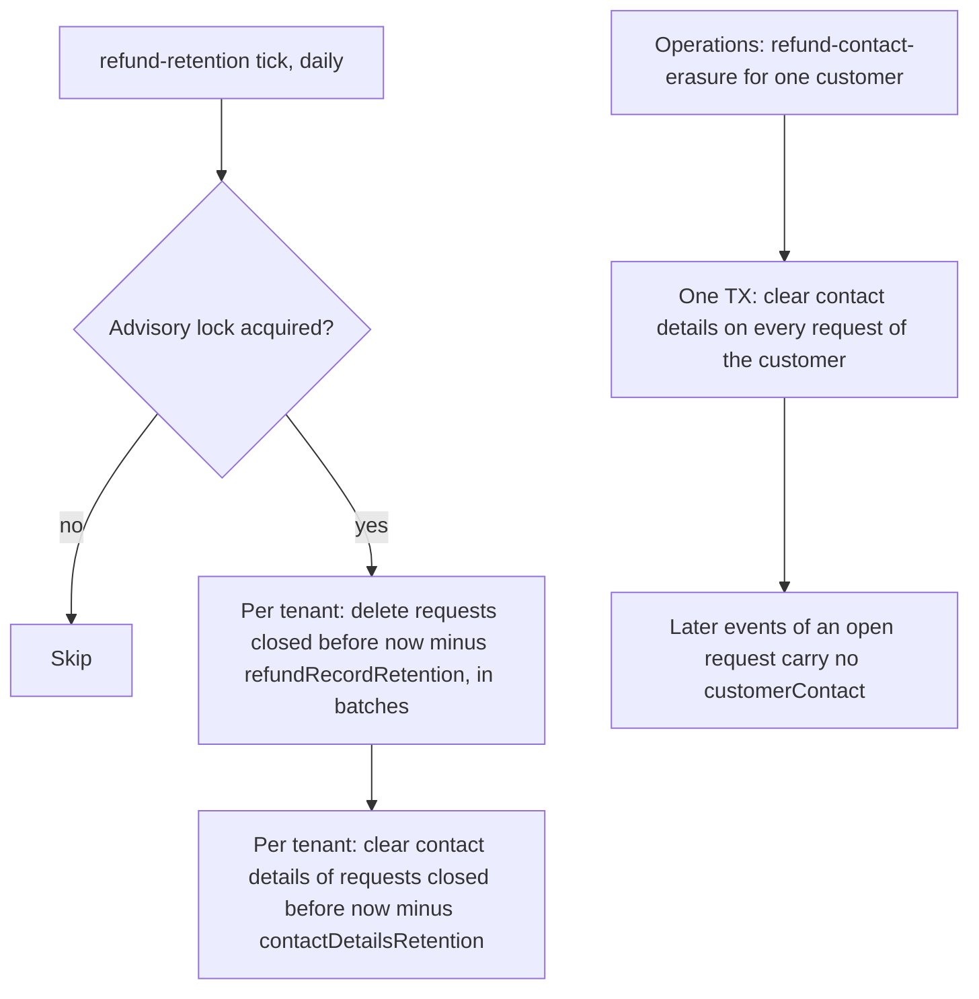

**Idempotency points:** a rerun finds nothing left to delete or clear. **Outbox emission points:** none (no state change of a request). **Retry / timeout policy:** a failed batch waits for the next day; a failed erasure is run again by operations. **Error handling:** logs counts only, never contact data or `tenant_id`.

> Confirm: the operations jobs (`refund-contact-erasure` here, `loyalty-member-erasure` in loyalty-service) run as one-off Kubernetes Jobs of the `refunds-platform-core` image with the job name and ids as arguments (RB-08); the SDD names the jobs and the break-glass rule, not how they are launched.

<!-- MASTER: refunds-platform-lld-master.md | PREV: 04-implementation/payout-service.md | NEXT: 05-data-model.md -->
