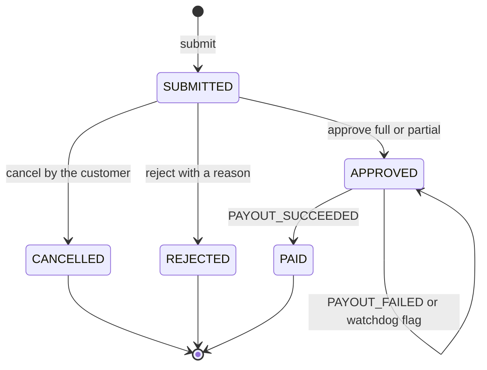
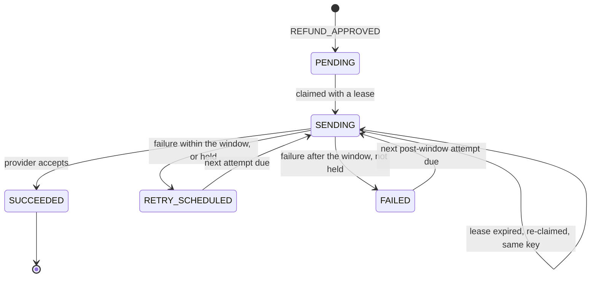
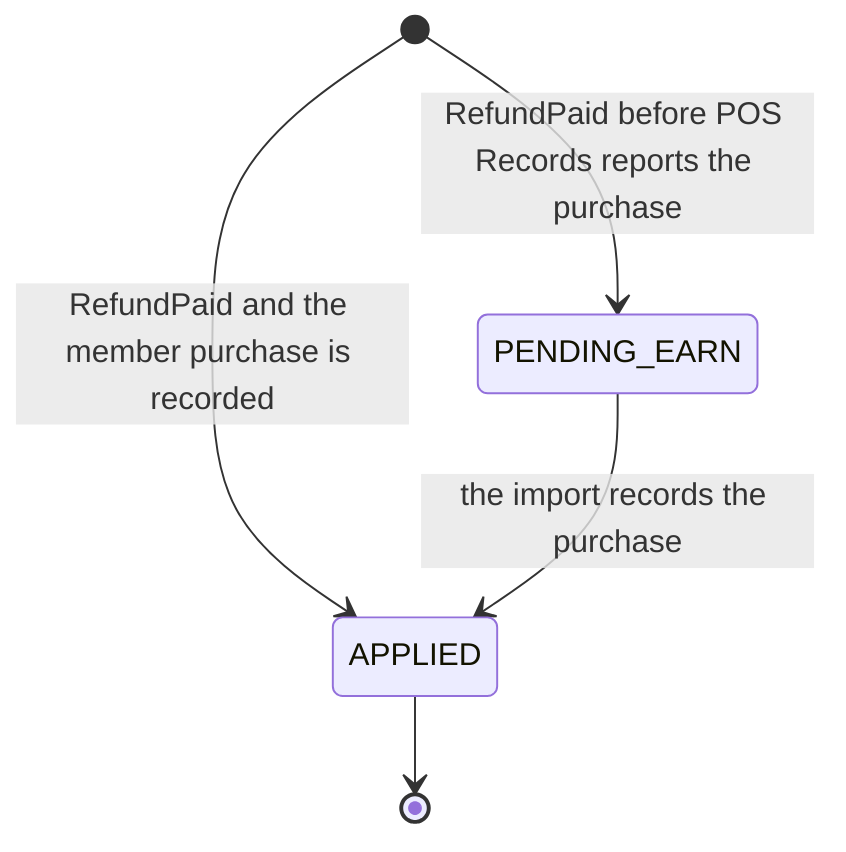

<!--
CHUNK: 08
TITLE: State Machines & Business Rules
PROJECT: Refunds Platform
VERSION: 1.1
DEPENDS_ON: 04
PART OF: LLD - Refunds Platform
-->

# 11. State Machines & Business Rules

> **Convention:** include a state machine only for entities that are genuinely stateful with named states. Stateless services have no state machine here. Per-service rules that are mostly local stay in `04-implementation/<service>.md`; rules that span services live here.

## 11.1 Aggregate State Machines

### `RefundRequest` aggregate (in `refund-service`)

**States:** `SUBMITTED`, `APPROVED`, `REJECTED`, `CANCELLED`, `PAID` ([SDD §17.1](../sdd-refunds-platform/13a-service-refund.md#business-logic), Figure 14). `payout_failing_since` and `payout_outcome_overdue_since` are flags on `APPROVED`, not states.



**Transition rules:**

| From | Event | To | Guard | Side effect |
|------|-------|----|-------|-------------|
| - | `submit` | `SUBMITTED` | Window, card payment, lines refundable, amount equals `expectedAmount` | History row (`from_status` NULL); outbox `REFUND_SUBMITTED` |
| `SUBMITTED` | `cancel` | `CANCELLED` | Caller is the customer | `closed_at`; items inactive; history; outbox `REFUND_CANCELLED` |
| `SUBMITTED` | `reject` | `REJECTED` | Own branch, not own request, reason present | `closed_at`; items inactive; history; outbox `REFUND_REJECTED` |
| `SUBMITTED` | `approve` | `APPROVED` | Own branch, not own request; with an `approvedAmount`: 0 < amount < requested and a reason | `decided_at`; history; outbox `REFUND_APPROVED` |
| `APPROVED` | `PAYOUT_SUCCEEDED` | `PAID` | `paidAmount` equals `approved_amount` (also after a `PAYOUT_FAILED`) | `closed_at`; history; outbox `REFUND_PAID`; publication `RefundPaid` |
| `APPROVED` | `PAYOUT_FAILED` | `APPROVED` | `payout_failing_since` is null | Sets `payout_failing_since` from `firstAttemptAt` |
| `APPROVED` | watchdog | `APPROVED` | No outcome after the retry window plus one hour | Sets `payout_outcome_overdue_since` |

**Summary:** only the customer cancels, only a manager of the request's branch decides, and only payout events move an approved request; everything else answers 409 `REFUND_ALREADY_DECIDED` or is ignored by the consumer. Every final state sets `closed_at`, which starts the retention clocks (05 § 8.6).

> **Invariants enforced at every transition:**
> - Optimistic lock version must match.
> - Tenant ID immutable.
> - Created-at immutable.
> - `approved_amount` never exceeds `requested_amount`; an item line is active on at most one request.

### `Payout` aggregate (in `payout-service`)

**States:** `PENDING`, `SENDING`, `RETRY_SCHEDULED`, `SUCCEEDED`, `FAILED` ([SDD §17.2](../sdd-refunds-platform/13b-service-payout.md#business-logic), Figure 18). `FAILED` is reported once and retried at the post-window interval; only `SUCCEEDED` is final.



| From | Event | To | Guard | Side effect |
|------|-------|----|-------|-------------|
| - | `REFUND_APPROVED` | `PENDING` | No payout for the refund yet | Inbox row |
| `PENDING`, `RETRY_SCHEDULED`, `FAILED`, `SENDING` (lease expired) | claim | `SENDING` | Due; row not locked by another worker | `lease_until`, `first_attempt_at` if null, `version` + 1 |
| `SENDING` | `Accepted` | `SUCCEEDED` | Version unchanged since the claim | Attempt row `ACCEPTED`; `succeeded_at`; outbox `PAYOUT_SUCCEEDED` |
| `SENDING` | failure or `Hold` | `RETRY_SCHEDULED` | Version unchanged; window open, or held | Attempt row (not for `Hold`); `next_attempt_at` from `BackoffPolicy` |
| `SENDING` | failure | `FAILED` | Version unchanged; window passed; not held | Attempt row; `next_attempt_at` at the post-window interval; the first time only: `failure_reported_at` and outbox `PAYOUT_FAILED` |

**Summary:** a payout is created once per approved refund, sent only under a lease, and ends `SUCCEEDED`; a payout still failing when its retry window ends reports `PAYOUT_FAILED` once and keeps being retried, and a held payout (status unreadable) is re-queried, never re-sent, and never reported as failed. SDD Figure 18 also draws `RETRY_SCHEDULED` to `FAILED` when the window passes: here that payout is claimed once more and moves to `FAILED` from `SENDING` when that attempt fails, so the report always follows a real attempt ("the payout still fails", SDD §17.2).

### `RefundTakeback` record (in `loyalty-service`)



**Summary:** each paid refund is handled once, under the receipt lock of its purchase: it takes back its points at once by LOYALTY/UC-02 BR-3: 1 point per whole euro refunded, never more than the purchase earned (no movement when they are 0), or it waits, with no expiry, until the import records the purchase ([SDD §17.4](../sdd-refunds-platform/13d-service-loyalty.md#business-logic); BR-4: a refund reported before its purchase is kept).

### `NotificationMessage` (in `notification-service`)

`PENDING` -> `SENT` | `FAILED` | `SKIPPED` (inserted directly when the channel has no address or the event has no `customerContact`). The lifecycle has no branching beyond this, so no diagram is drawn (SDD §17.3); a worker's claim sets only `claimed_until` and `version`, and every final state sets `final_at`.

## 11.2 Cross-Service Business Rules

> **Rules that one service depends on another to enforce.** When you change a rule here, check downstream consumers.

### Rule: One payout per approved refund

**Statement:** an approved refund is paid at most once, for exactly its approved amount (REFUNDS/NFR-01, [SDD §14.6](../sdd-refunds-platform/10-events-hub.md#146-cross-cutting-event-guarantees) item 7).

**Source of truth:** payout-service (`ux_payout_refund`, provider idempotency key); refund-service guards the Paid side.

**Enforcement points:** refund-service emits `REFUND_APPROVED` once per approval (idempotent decision); payout-service inbox and unique payout; the payout id on every API-02 attempt, post-window attempts included; refund-service applies `PAYOUT_SUCCEEDED` only from `APPROVED` and only for the approved amount.

**Validation matrix:**

| Input condition | Expected outcome |
|-----------------|------------------|
| `REFUND_APPROVED` delivered twice | One payout; the second is an inbox no-op |
| Two `REFUND_APPROVED` with different `event_id` for one refund (should not happen) | One payout (unique index); the second insert is a no-op |
| Lease expires during an API-02 call | Re-sent with the same payout id; status queried first when keys are not honoured |
| `PAYOUT_SUCCEEDED` with an amount other than `approved_amount` | Dead-lettered; request stays APPROVED; alarm |
| Post-window attempt accepted after `PAYOUT_FAILED` | `PAYOUT_SUCCEEDED`; the request moves to PAID; still one payout |

### Rule: Points are taken back when a refund is paid

**Statement:** a paid refund of a purchase takes back 1 point per whole euro refunded, never more than the purchase earned, and all its remaining points once the whole purchase is refunded, within one hour of the later of the paid refund and the purchase report ([LOYALTY/UC-02](../brd-loyalty-points/06a-use-cases-member.md#uc-02-view-points-history) BR-1: points taken back when the refund is reported paid; BR-3: 1 point per whole euro refunded, never more than the purchase earned; BR-4: a refund reported before its purchase is kept; LOYALTY/NFR-02).

**Source of truth:** loyalty-service (`member_purchase`, `refund_takeback`); refund-service owns the Paid fact and the receipt number it carries.

**Enforcement points:** refund-service records `RefundPaid` in the PAID transaction; `core-eventing` delivers it after commit until it completes; loyalty-service matches the receipt number under the receipt lock and applies the take-back idempotently, or keeps a `PENDING_EARN` that the import applies.

**Validation matrix:**

| Input condition | Expected outcome |
|-----------------|------------------|
| Purchase earned 50 points, full refund paid | `TAKEN_BACK` -50 with the refund reference (LOYALTY/UC-02 AC-1: -50 with the refund reference) |
| 80.00 EUR purchase (80 points), 30.50 EUR refund paid | `TAKEN_BACK` -30 (AC-6: 30.50 EUR refund of an 80-point purchase takes back 30) |
| 2.70 EUR purchase (2 points), three 0.90 EUR refunds | 0, 0, then -2 when the whole purchase is refunded; the first two are `APPLIED` with no movement |
| 10.00 EUR purchase (10 points), two 6.00 EUR refunds | -6, then -4: never more than the 10 earned |
| Refund paid before POS Records reports the purchase | `PENDING_EARN`; the import applies it in the transaction that records the purchase, in `paid_at` order |
| Refund whose receipt number no member purchase has | `PENDING_EARN`, kept with no expiry, changes no balance |
| `RefundPaid` replayed | No-op |

### Rule: The payout retry window is shared configuration

**Statement:** the watchdog threshold in refund-service is the payout retry window of [SDD §17.2 Constraints](../sdd-refunds-platform/13b-service-payout.md#constraints) plus one hour; the post-window retry interval of the same section belongs to payout-service only.

**Source of truth:** SDD §17.2 Constraints (the values' home); both deployables read the window from the same Helm value, `PAYOUT_RETRY_WINDOW`, and payout-service reads `PAYOUT_POST_WINDOW_RETRY_INTERVAL` (10 § 13.1).

**Enforcement points:** payout-service `settle` (report `PAYOUT_FAILED` once after the window, then retry at the post-window interval); refund-service `flagOverduePayouts` (flag after the window plus one hour).

**Validation matrix:**

| Input condition | Expected outcome |
|-----------------|------------------|
| Payout still retrying at window minus 1 minute | No `PAYOUT_FAILED`, no watchdog flag |
| Payout failing at the window | `PAYOUT_FAILED` once; `payout_failing_since` set; no watchdog flag; the payout is retried at the post-window interval |
| `REFUND_APPROVED` dead-lettered in payout-service | No payout; watchdog flags the request at window plus one hour |

### Rule: Customer contact data is read only by notification-service

**Statement:** `customerContact` travels in the five refund events (ADR-10), but only notification-service binds it; payout-service deserializes only `REFUND_APPROVED` into a record without contact fields and stores none. After an erasure the events of an open request carry no `customerContact` and notification-service skips both channels.

**Source of truth:** ADR-10 and SDD §14.9 (`customerContact` conditional); refund-service owns the contact data.

**Enforcement points:** the `event_type` header filter and `RefundApprovedForPayout` in payout-service; encrypted `delivery_payload` and masking in notification-service; no contact data in any log line or DLQ exception header; `refund-contact-erasure` and the contact retention in refund-service.

**Validation matrix:**

| Input condition | Expected outcome |
|-----------------|------------------|
| `REFUND_SUBMITTED` reaches payout-service | Dropped by the header filter before deserialization |
| `REFUND_APPROVED` reaches payout-service | Mapped without contact fields |
| `REFUND_APPROVED` without `customerContact` (after an erasure) | notification-service records email and SMS `SKIPPED` |

## 11.3 Algorithm Pseudocode (non-trivial only)

> **Convention:** include only algorithms whose correctness isn't obvious from the code structure. Skip plain loops, plain CRUD, plain validation.

### Algorithm: Reference number issue

**Input:** tenant id. **Output:** `RF-` followed by 10 digits, unique per tenant (SDD §17.1 Tables Design).

```text
next = UPDATE refund.refund_reference_counter SET last_value = last_value + 1 WHERE tenant_id = :t RETURNING last_value
no row -> INSERT (tenant_id, last_value) VALUES (:t, 0) ON CONFLICT DO NOTHING, then repeat the UPDATE (returns 1)
return "RF-" + leftPad(next, 10, '0')
```

**Edge cases:** first request of a tenant (insert then update); counter above 9,999,999,999 (fails the format; decades away at the SDD §18.1 volume). **Complexity:** O(1); the row lock serialises submissions of one tenant, which is harmless at about 120 a day at peak.

### Algorithm: Payout retry schedule (exponential backoff with jitter, then the post-window interval)

**Input:** attempt count `n` (after the failed attempt), now, whether the retry window has passed. **Output:** next attempt time.

```text
window open:   delay = min(PAYOUT_RETRY_MAX_DELAY, PAYOUT_RETRY_FIRST_DELAY * 2^(n - 1))
               return now + delay * uniformRandom(0.5, 1.0)
window passed: return now + PAYOUT_POST_WINDOW_RETRY_INTERVAL * uniformRandom(0.9, 1.1)
```

**Edge cases:** overflow of `2^(n-1)` for large `n` (cap `n` at 30 before shifting); a retry scheduled after the window end is attempted once, then the payout reports `PAYOUT_FAILED` and moves to the post-window interval. **Complexity:** O(1).

> TODO: `PAYOUT_RETRY_FIRST_DELAY` = 1 minute, `PAYOUT_RETRY_MAX_DELAY` = 1 hour, and the ±10% jitter on the post-window interval are best guesses; the first and maximum retry delay are NEEDS CLARIFICATION in [SDD §12 INT-01](../sdd-refunds-platform/08-integrations.md#12-integrations), and SDD §17.2 Constraints gives the post-window interval "with jitter" without its size - verify with CardPay's rate limits.

### Algorithm: Take-back points (LOYALTY/UC-02 BR-3: whole euros refunded, never more than earned)

**Input:** the member purchase (amount, points earned), the refunded amount of this refund, the refunded amounts of its earlier applied refunds, the points already taken back from it, the tenant earn rate. **Output:** the points to take back (0 or more).

```text
remainder = purchase.pointsEarned - takenBackBefore
refundedBefore + refundedAmount >= purchase.amount -> return remainder
return min(floor(refundedAmount) * earnRate, remainder)
```

**Edge cases:** refunds below 1 EUR take back 0 until the whole purchase is refunded; refunds that add up to more than the purchase amount stop at its earned points; a purchase earning 0 points takes back 0 for every refund. **Complexity:** O(1) after the two sums, served by `ix_refund_takeback_receipt` and `ix_points_movement_purchase`.

### Algorithm: Daily branch report

**Input:** tenant, branch, date. **Output:** `BranchRefundReport`.

```text
[start, end) = date in the tenant time zone, converted to UTC
requestsByStatus      = count of history rows with changed_at in [start, end), grouped by to_status,
                        joined to refund_request on branch_id = :branch
amountPaid            = sum(paid_amount) of requests with paid_at in [start, end) and branch_id = :branch
averageTimeToDecision = avg(decided_at - created_at) of requests with decided_at in [start, end) and branch_id = :branch
```

**Edge cases:** a day with no activity returns zeros and no average (the field is omitted); a daylight-saving day has 23 or 25 hours, which the zone conversion handles. **Complexity:** index range scans on `ix_refund_status_history_day`, `ix_refund_request_report_paid`, and `ix_refund_request_report_decided`.

> Confirm: "requests per status" is read as the status changes recorded that day (not the current status of the requests submitted that day); [REFUNDS 09 § Reporting / Analytics](../brd-refunds-portal/09-reporting-and-analytics.md#reporting--analytics) and SDD §17.1 do not say which - verify with the REFUNDS owner.

<!-- MASTER: refunds-platform-lld-master.md | PREV: 07-event-contracts.md | NEXT: 09-cross-cutting.md -->
