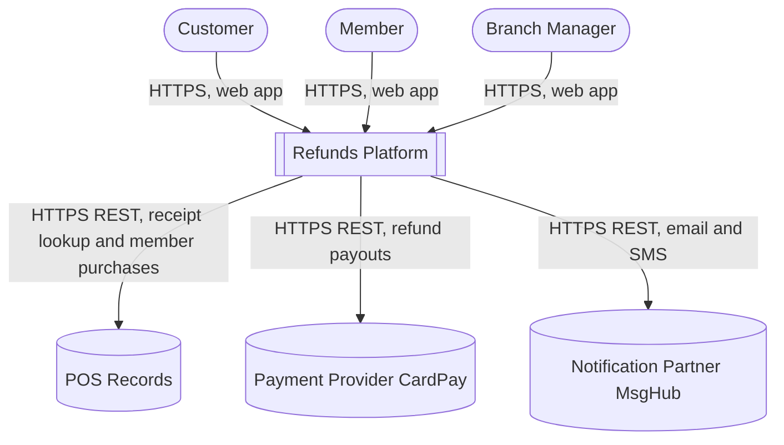
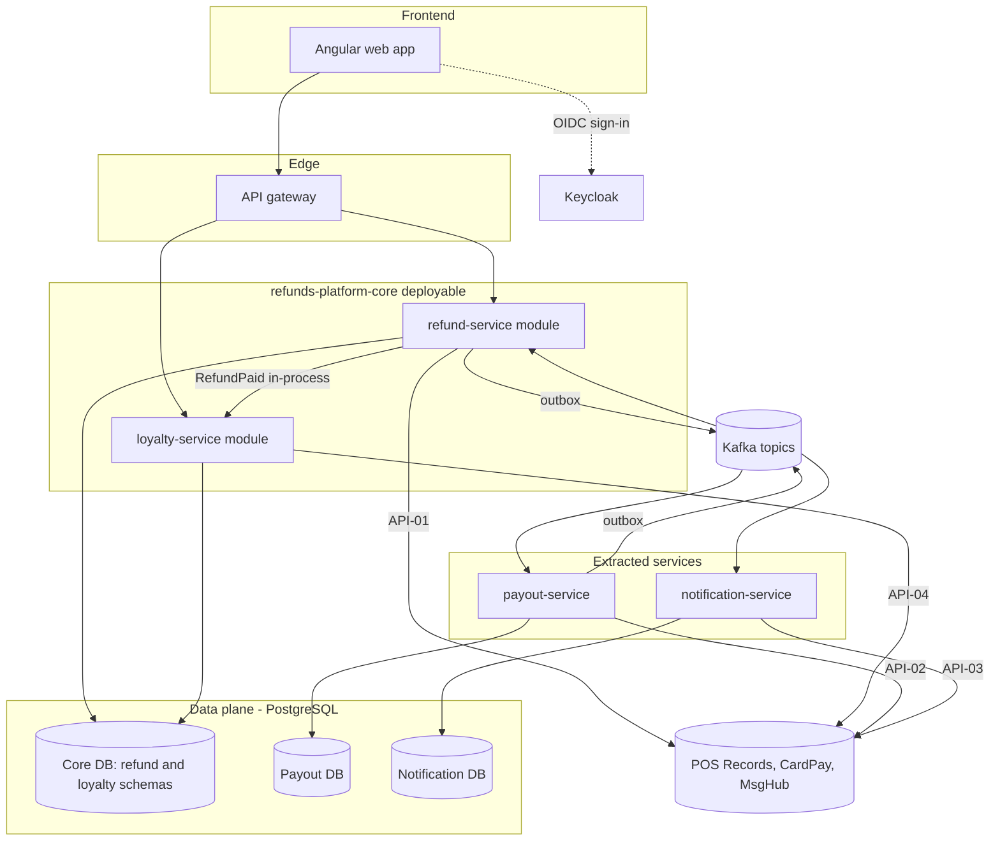

<!--
CHUNK: 04
TITLE: System Design - Architecture Style, Context & HLA Diagrams
PROJECT: Refunds Platform
VERSION: 1.2
DEPENDS_ON: 01, 02
PART OF: SDD - Refunds Platform
-->

# 8. System Design / High-Level Architecture

## 8.1 Architecture Style

### 8.1.1 What

Hybrid: a modular monolith core plus two extracted services (ADR-01). The core deployable `refunds-platform-core` holds the refund-service and loyalty-service modules; each module owns its schema in the core database, modules call each other only through ports, and they exchange in-process domain events recorded in a durable publication log (§14.10). payout-service and notification-service are separate deployables with their own databases. Every fact that leaves the core or either service is an integration event on Kafka, written through the transactional outbox (§14). No deployable calls another synchronously: synchronous REST exists only from the web app to the core through the API gateway, and from a deployable to an external system (§15), one hop at most.

### 8.1.2 Why

- **Stage and team:** a first production release of two products for one retailer, built by one team (§3 assumption 10), so one core deployable keeps build, test, and release simple.
- **Load:** about 1,200 requests a month, three times that for about 3 weeks of seasonal sales ([REFUNDS 02 § Facts](../brd-refunds-portal/02-glossary-assumptions-facts.md#facts), REFUNDS/NFR-03); replicas of one core deployable carry it, and no part needs to scale on its own for load.
- **Failure isolation for money:** payouts depend on an external provider and are retried until they succeed ([REFUNDS/UC-04](../brd-refunds-portal/06b-use-cases-branch-manager.md#uc-04-approve--reject-refund) E1), and REFUNDS/NFR-01 forbids lost or double payouts. payout-service keeps provider outages and retry loops out of the portal's process and keeps the payout ledger in its own database.
- **Failure isolation for messages:** customers are told about each step by email and SMS through the notification partner ([REFUNDS 08 § Integrations](../brd-refunds-portal/08-integrations.md#integrations)); a messaging outage must not block refunds or the two-hour disruption budget (REFUNDS/NFR-02), so notification-service runs on its own.
- **The cross-BRD rule stays in process:** points are taken back when a refund is paid ([LOYALTY/UC-02](../brd-loyalty-points/06a-use-cases-member.md#uc-02-view-points-history) BR-1: points taken back when the refund is reported paid) within one hour (LOYALTY/NFR-02); with loyalty-service in the core, this is an in-process domain event instead of a broker round trip.

### 8.1.3 How

- **Bounded contexts:** refund (refund-service module), loyalty (loyalty-service module), payout (payout-service), customer messaging (notification-service). The module names keep the `-service` suffix so that an extraction (ADR-01 trigger) changes the deployable, not the name.
- **Inter-service communication:** inside the core, in-process domain events with a durable publication log and port calls (ADR-05); between deployables, Kafka integration events with outbox and inbox dedup (ADR-02); synchronous REST only from the web app through the API gateway to the core, and from deployables to external systems (API-01 to API-04).
- **Data ownership:** core database with the module schemas `refund` and `loyalty` and no cross-schema reads, plus the infrastructure schema `core_events` for the in-process publication log, which no module owns (§11.1); a payout database; a notification database (ADR-06). Every table has `tenant_id` (ADR-03).
- **Deployment model:** three backend deployables and the web app, each one container image and one Helm chart on on-prem Kubernetes (ADR-09). The web app is served as static assets from its own container behind the ingress.

## 8.2 Context Diagram

**Figure 2: System Context Diagram**

**Summary:** Customers, members, and branch managers use the platform through one web app over HTTPS. The platform calls three external systems: POS Records for receipts and member purchases, CardPay for refund payouts, and MsgHub for customer email and SMS ([REFUNDS 08 § Integrations](../brd-refunds-portal/08-integrations.md#integrations), [LOYALTY 08 § Integrations](../brd-loyalty-points/08-integrations.md#integrations)).

## 8.3 High-Level Architecture Diagram

**Figure 3: High-Level Architecture**

**Summary:** The web app signs users in through Keycloak and calls the core through the API gateway; inside the core, refund-service hands paid refunds to loyalty-service in process. The core and the two extracted services each own their PostgreSQL data and exchange integration events through Kafka, and each deployable calls its external systems through the contracts API-01 to API-04; metrics, logs, and traces from every deployable follow §11.4.

<!-- MASTER: refunds-platform-sdd-master.md | PREV: 03-users-and-use-cases.md | NEXT: 05-workflows-and-sequences.md -->
