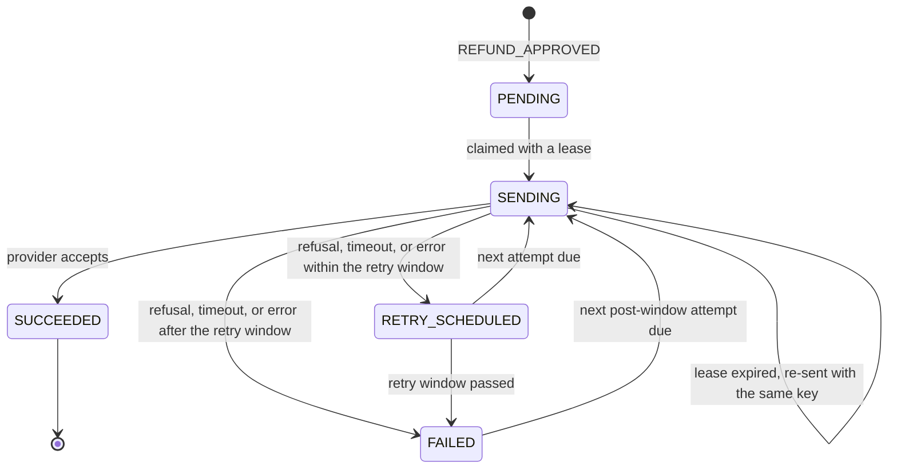
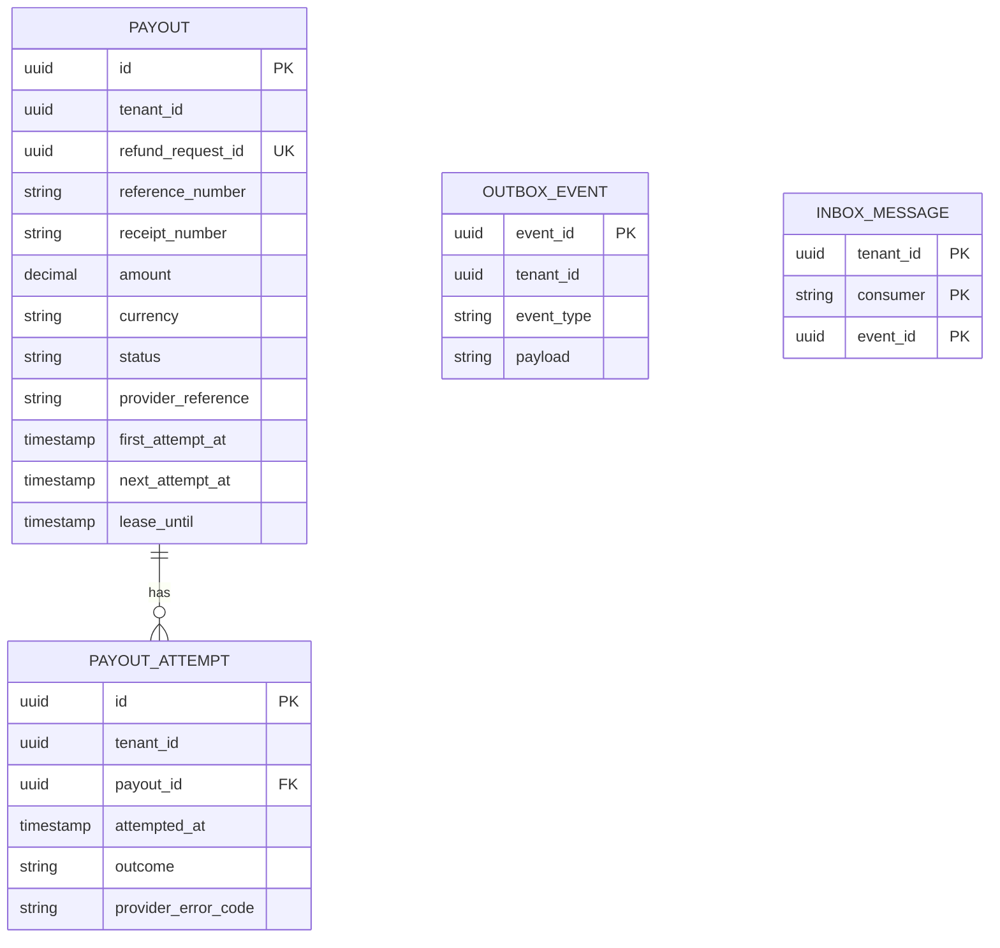
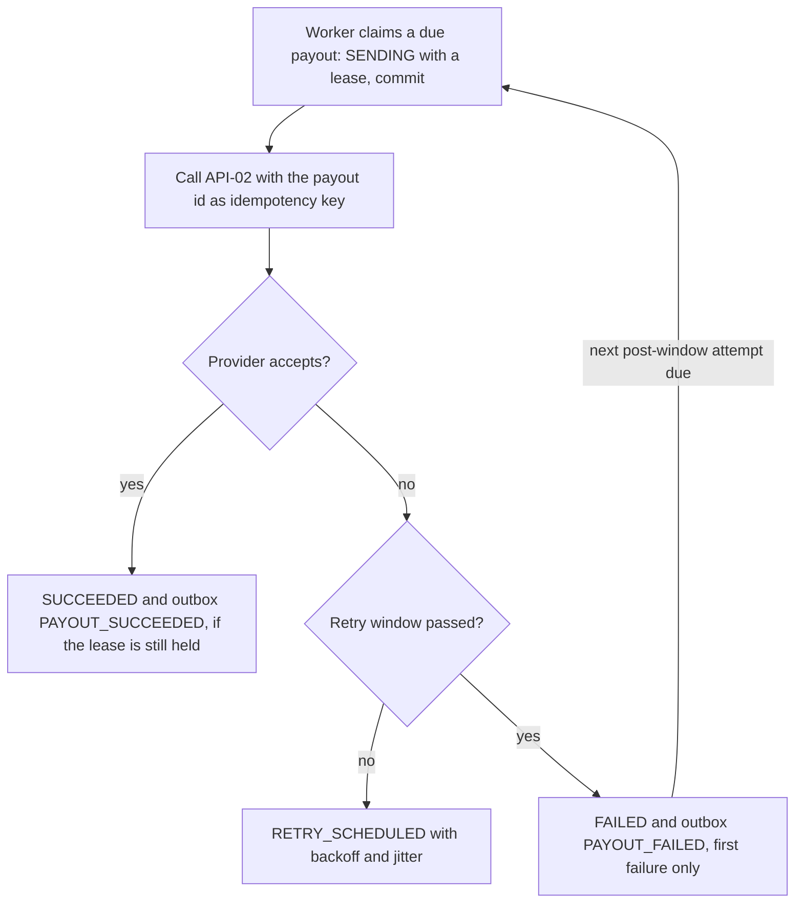
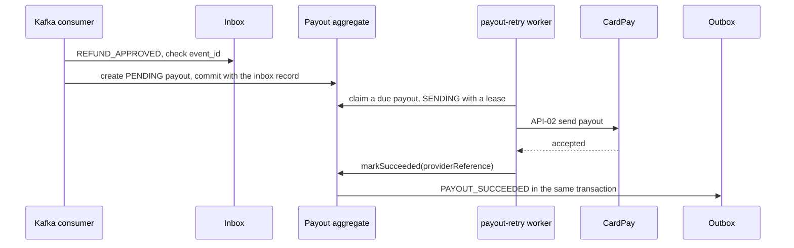

<!--
CHUNK: 13b
TITLE: Detailed Service Spec - payout-service
PROJECT: Refunds Platform
VERSION: 1.2
DEPENDS_ON: 09, 07, 10 (event hub - topic names, event names, and payload contracts must match chunk 10 verbatim), 11 (API contracts - integration endpoints carry their API ID and match chunk 11 verbatim), 12 (roles - permission tokens match chunk 12 verbatim)
PART OF: SDD - Refunds Platform
-->

# 17. Detailed Service Specs

---

## 17.2 payout-service

### What

payout-service is the payout bounded context: a separate deployable with its own database (ADR-01) that pays each approved refund exactly once to the customer's original card through the payment provider (INT-01, API-02), retries failed payouts until they succeed, and reports a payout still failing at the end of its retry window (Constraints), and reports the outcome as an integration event. It owns no BRD use case; it realises the payout steps of [REFUNDS/UC-04](../brd-refunds-portal/06b-use-cases-branch-manager.md#uc-04-approve--reject-refund), which refund-service owns.

### Boundaries

- **Owns:** the `Payout` aggregate (refund reference, amount, status, provider reference, retry window) and its attempts, plus the service's outbox and inbox.
- **Does not own:** refund requests and their states (refund-service), customer contact details, card data (held by the payment provider only).
- **Upstream consumers:** refund-service, through `PAYOUT_SUCCEEDED` and `PAYOUT_FAILED`.
- **Downstream dependencies:** the Payment Provider CardPay (API-02); the topic `refunds-platform-payout-events`.

### Input

| Type | Source | Description |
|------|--------|-------------|
| Event | refund-service, `refunds-platform-refund-events` | `REFUND_APPROVED`: a refund to pay. |
| Schedule | `payout-retry` worker | Picks up payouts whose next attempt is due. |

### Business Logic

- **Accept a payout** ([REFUNDS/UC-04](../brd-refunds-portal/06b-use-cases-branch-manager.md#uc-04-approve--reject-refund) step 6): `REFUND_APPROVED` creates one `Payout` in `PENDING` for the approved amount, in the same transaction as the inbox record. A unique constraint on (`tenant_id`, `refund_request_id`) makes a second payout for the same refund impossible (REFUNDS/NFR-01).
- **Send** ([REFUNDS/UC-04](../brd-refunds-portal/06b-use-cases-branch-manager.md#uc-04-approve--reject-refund) step 6): the `payout-retry` worker claims due payouts with row locks that skip rows other replicas hold. The claim transaction moves a due payout to `SENDING` with `lease_until` set to now plus the INT-01 timeout plus one minute, and commits; the worker calls API-02 and commits the outcome only while it still holds the lease (version check). The payout id is the provider idempotency key on every attempt. A `SENDING` payout whose lease expired is due again and is re-sent with the same idempotency key; if CardPay does not honour idempotency keys (§15.6), a re-send is preceded by a status query by payout id, and a payout whose status cannot be read is held and alerted instead of re-sent.
- **Succeed** ([REFUNDS/UC-04](../brd-refunds-portal/06b-use-cases-branch-manager.md#uc-04-approve--reject-refund) step 7): an accepted payout moves to `SUCCEEDED` and writes `PAYOUT_SUCCEEDED` to the outbox with the provider reference.
- **Retry for one day** ([REFUNDS/UC-04](../brd-refunds-portal/06b-use-cases-branch-manager.md#uc-04-approve--reject-refund) E1): a refusal, a timeout, or a provider error moves the payout to `RETRY_SCHEDULED` with the next attempt time from exponential backoff with jitter (§12 INT-01). When the retry window (Constraints) has passed and the payout still fails, it moves to `FAILED` and writes `PAYOUT_FAILED` once (AC-2: the branch manager is told when the payout still fails after one day).
- **After the retry window** ([REFUNDS/UC-04](../brd-refunds-portal/06b-use-cases-branch-manager.md#uc-04-approve--reject-refund) E1: the system tries again): a `FAILED` payout is still retried, with the same idempotency key and under a lease, at the post-window retry interval (Constraints) until the provider accepts it; it then moves to `SUCCEEDED` and writes `PAYOUT_SUCCEEDED`, and the refund becomes Paid. `PAYOUT_FAILED` is written once per payout, on its first move to `FAILED` (`failure_reported_at`). While the payout fails, the refund stays Approved on the branch manager's payout-failing list (§17.1). The platform has no manual retry, other payout route, or closing of a refund: neither BRD states one.
- **Original card:** payouts go only to the card used for the purchase ([REFUNDS 02 § Assumptions / Constraints](../brd-refunds-portal/02-glossary-assumptions-facts.md#assumptions--constraints) 2). payout-service identifies the original card payment to CardPay with references the platform already holds: the receipt number from `REFUND_APPROVED`, with the payout id as the idempotency key and the amount and currency. No deployable receives, stores, logs, or sends card data (card number, expiry date, security code). If the API-02 documentation (§15.6) shows that CardPay needs another reference of the original payment, refund-service captures it from API-01 at submission and `REFUND_APPROVED` gains it as an optional field (additive, §14.6 rule 5). A CardPay that can refund the original card only with card data is risk R-02 and needs a new ADR before any card data enters the platform.

**State machine:**

**Figure 18: payout-service - Payout state machine**

**Summary:** A payout is created once per approved refund and is sent only while a worker holds its lease; it succeeds on the first accepted attempt, otherwise retries until its retry window ends, reports the failure once, and keeps retrying at the post-window interval until it succeeds.

### Output

| Type | Destination | Description |
|------|-------------|-------------|
| Event | `refunds-platform-payout-events` | `PAYOUT_SUCCEEDED`, `PAYOUT_FAILED` (§14.5.2). |
| External call | Payment Provider CardPay | Payout requests through API-02. |

### Integrations

| Integration | Direction | Protocol | Purpose | Contract | Failure Handling |
|-------------|-----------|----------|---------|----------|------------------|
| Payment Provider (CardPay) | Outbound, sync | HTTPS REST | Send a refund payout to the original card | API-02 (§15) | Same idempotency key on every attempt; backoff with jitter within the retry window (Constraints); circuit breaker and bulkhead (§12 INT-01). |
| Kafka | Inbound, async | Kafka | Receive approved refunds | `REFUND_APPROVED` (§14) | Inbox dedup; unique payout per refund; DLQ for unreadable messages. |
| Kafka | Outbound, async | Kafka | Report payout outcomes | `PAYOUT_SUCCEEDED`, `PAYOUT_FAILED` (§14) | Outbox relay retries until the broker acknowledges. |

### DB Modeling

#### Entity Relationship

**Figure 19: payout-service - Entity relationship**

**Summary:** One payout per refund request, with one row per attempt; the outbox and inbox sit in the same database so each outcome and its event commit together.

#### Tables Design

| Table | Column | Type | Constraints | Notes |
|-------|--------|------|-------------|-------|
| `payout` | `id` | uuid | PK | UUIDv7; also the provider idempotency key |
| `payout` | `tenant_id`, `refund_request_id` | uuid, uuid | UNIQUE (`tenant_id`, `refund_request_id`) | One payout per refund (REFUNDS/NFR-01) |
| `payout` | `amount`, `currency` | numeric(19,4), char(3) | amount > 0 | The approved amount from `REFUND_APPROVED` |
| `payout` | `status` | varchar | CHECK in the five states | State machine above |
| `payout` | `lease_until` | timestamptz | NULL unless `SENDING` | The worker's lease on a payout in flight |
| `payout` | `first_attempt_at`, `next_attempt_at` | timestamptz | `first_attempt_at` NULL until the first attempt; `next_attempt_at` set to the creation time for a `PENDING` payout | The retry window starts at the first attempt |
| `payout` | `reference_number`, `receipt_number` | varchar, varchar | NOT NULL | From `REFUND_APPROVED`; the receipt number identifies the original payment (Business Logic) |
| `payout` | `provider_reference` | varchar | NULL until `SUCCEEDED` | Carried in `PAYOUT_SUCCEEDED` |
| `payout` | `attempt_count`, `last_failure_code` | int, varchar | NOT NULL default 0; NULL allowed | Carried in `PAYOUT_FAILED` (`attemptCount`, `lastFailureCode`, a platform `errorCode`) |
| `payout` | `failure_reported_at` | timestamptz | NULL until the first `FAILED` | `PAYOUT_FAILED` is written once (Business Logic) |
| `payout` | `succeeded_at` | timestamptz | NULL until `SUCCEEDED` | Retention clock |
| `payout` | auditing columns | per §11.1 | `version`, checked by the lease commit | |
| `payout_attempt` | `outcome`, `provider_error_code` | varchar, varchar | NOT NULL outcome | One row per API-02 call |
| `payout_attempt` | `tenant_id`, `attempt_number` | uuid, int | NOT NULL; UNIQUE (`tenant_id`, `payout_id`, `attempt_number`) | `tenant_id` as on every table (§11.2) |
| `payout_attempt` | `outcome` | varchar | CHECK in `ACCEPTED`, `REFUSED`, `TIMEOUT`, `ERROR` | A call the open circuit breaker stops is `ERROR` with `error_code` `UNAVAILABLE`; the §18.2 duplicate proxy counts `ACCEPTED` |
| `payout_attempt` | `error_code` | varchar | NULL allowed | The platform `errorCode` mapped from `provider_error_code` |
| `outbox_event` | `event_id`, `tenant_id`, `topic`, `payload`, `published_at` | uuid, uuid, varchar, jsonb, timestamptz | PK `event_id` | Relay publishes after commit |
| `outbox_event` | `aggregate_id`, `event_type`, `message_key`, `occurred_at`, `traceparent` | as in §17.1 | as in §17.1 | `message_key` is the `refund_request_id` (§14.4) |
| `inbox_message` | `tenant_id`, `consumer`, `event_id`, `processed_at` | uuid, varchar, uuid, timestamptz | PK (`tenant_id`, `consumer`, `event_id`) | Dedup of `REFUND_APPROVED` |

Indexes (each leads with `tenant_id`):

- `payout (tenant_id, next_attempt_at)` where `status` is `PENDING`, `RETRY_SCHEDULED`, or `FAILED` - the `payout-retry` worker's due work.
- `payout (tenant_id, lease_until)` where `status = 'SENDING'` - expired leases.
- `payout (tenant_id, succeeded_at)` - retention.
- `payout_attempt (tenant_id, payout_id, attempted_at)`; outbox and inbox indexes as in §17.1.

Provider results stay in `provider_reference`, `provider_error_code`, and `error_code`; an API-02 field that must be stored is added by an expand migration when the provider documentation arrives. Column lengths, check wording, and any further index are set in the child LLD's data section; they never change a key, a uniqueness rule, or a tenant rule above.

#### Migration Strategy

- **Tool:** Flyway, versioned SQL files (§11.1).
- **Backward compatibility:** additive changes; expand-contract across two releases.
- **Data backfill:** batched per tenant after the expand step.
- **Rollback:** forward-fix migrations; the previous release keeps working against the expanded schema.

#### Retention Policy

- `payout`, `payout_attempt`: deleted by the retention job when the tenant setting `refundRecordRetention` (§11.2; default and owner in §17.1 Retention Policy) has passed since `succeeded_at`. A payout that has not succeeded is kept.
- `outbox_event`, `inbox_message`: published or processed rows are purged after 7 days.

#### Archival

- **Cold storage:** none in this release (§6 object storage Not applicable).
- **Format:** not applicable.
- **Schedule:** not applicable.
- **Restore SLA:** not applicable; database backups follow the §6 PostgreSQL row.

#### Data Encryption

- **At rest:** per §11.6.
- **In transit:** TLS per §11.6.
- **Key management:** per §11.6; provider credentials in the secrets manager.
- **PII columns:** none; the service stores no contact or card data.

### Multi-Tenancy Specifications

- **Strategy override:** none; shared schema with `tenant_id` (§11.2).
- **Tenant filter:** every query filters by the tenant of the event; provider credentials are selected per tenant.
- **Cross-tenant queries:** forbidden.

### API Standards

- **Style:** no business API; the service is driven by events (§14) and its schedule.
- **Versioning:** not applicable.
- **Authentication:** not applicable; Kafka access per §11.6.
- **Idempotency:** inbox dedup on events; the payout id as the provider idempotency key.
- **Pagination:** not applicable.
- **Error envelope:** not applicable; provider errors map to platform `errorCode` values once API-02 is known (§15).

#### List of APIs (Swagger-friendly)

| Method | Path | Summary | Request Body | Response | Permission token (§16) | API ID (§15) |
|--------|------|---------|--------------|----------|------------------------|--------------|
| - | - | None: payout-service exposes no business endpoint; `REFUND_APPROVED` (§14.5.1) drives it | - | - | - | - |

Health, readiness, and metrics endpoints follow §11.4.

### Event-Driven Architecture (If Applicable)

#### Event Model

**Published events:**

| Event Name | Producer | Producer Specs | Consumers | Consumer Specs | Schema (Summary) | Delivery Guarantee |
|------------|----------|----------------|-----------|----------------|------------------|---------------------|
| `PAYOUT_SUCCEEDED` | payout-service | Topic `refunds-platform-payout-events`, key `refundRequestId`, retention per §6 | refund-service | Group `refund-service`, inbox dedup | `refundRequestId`, `paidAmount`, `providerReference` | At-least-once, exactly-once effect |
| `PAYOUT_FAILED` | payout-service | Topic `refunds-platform-payout-events`, key `refundRequestId` | refund-service | Group `refund-service`, inbox dedup | `refundRequestId`, `attemptCount`, `firstAttemptAt`, `lastFailureCode` | At-least-once, exactly-once effect |

**Consumed events:**

| Event Name | Producer (owning service) | Topic | Effect in this service | Idempotency / ordering |
|------------|---------------------------|-------|------------------------|------------------------|
| `REFUND_APPROVED` | refund-service | `refunds-platform-refund-events` | Creates one `PENDING` payout for the envelope's `aggregate_id` as `refundRequestId`, with `approvedAmount`, `referenceNumber`, and `receiptNumber` | Inbox dedup on (`tenant_id`, `payout-service`, `event_id`); unique payout per refund |

**In-process domain events (modules only):**

| Event | Publisher module | Listener modules | Transaction phase (before commit / after commit) | Payload (DTO) | Notes |
|---|---|---|---|---|---|
| Not applicable | - | - | - | - | payout-service is a separate deployable, not a core module. |

Every integration event above is `committed` in §14.5.

#### Messaging Infra

- **Broker:** Kafka (ADR-02).
- **Schema registry:** the §6 registry; JSON Schema subjects per event, additive changes only.
- **Serialization:** JSON.
- **Topic strategy:** one topic per producing context (§14.4), key `refundRequestId`.
- **Retention:** per the §6 Kafka row.
- **DLQ strategy:** `refunds-platform-refund-events.payout-service.dlq` for approved refunds this service cannot read; alarm on depth above zero; replay per the §20 runbook.

### Constraints

- **Authorization:** no user-facing endpoint; only payout-service may write `refunds-platform-payout-events` and read `REFUND_APPROVED` as group `payout-service` (topic ACLs, §11.6).
- **Money:** one payout per refund, for exactly the approved amount (REFUNDS/NFR-01); payouts go only to the original card.
- **Retry window:** 24 hours from the first attempt ([REFUNDS/UC-04](../brd-refunds-portal/06b-use-cases-branch-manager.md#uc-04-approve--reject-refund) E1).
- **Post-window retry interval:** 6 hours with jitter, a payout-service Helm value owned by the REFUNDS owner.

### Error Handling

- **Synchronous APIs:** none exposed.
- **Validation errors:** a `REFUND_APPROVED` whose payload fails its schema goes to the DLQ with an alarm.
- **Domain errors:** a second `REFUND_APPROVED` for the same refund is a no-op (unique payout); a refusal from the provider is retried like any failure, within and after the window ([REFUNDS/UC-04](../brd-refunds-portal/06b-use-cases-branch-manager.md#uc-04-approve--reject-refund) E1).
- **Auth errors:** a provider authentication failure opens the circuit and raises an alert; payouts wait in `RETRY_SCHEDULED` or `FAILED`.
- **Server errors:** provider 5xx and timeouts are retried with the same idempotency key.
- **Async consumers:** inbox dedup; a transient database failure is retried before the DLQ.
- **Poison messages:** DLQ with alarm; replay per the §20 runbook. Consumer retries and dead-lettering follow §14.6 rule 4. The consumer only records the payout with its inbox row; the API-02 call happens in the `payout-retry` worker (Developer Notes), so consumer retries cover database writes only.

### Observability & Monitoring

#### Logging

- JSON per §11.4, with `payoutId` and `refundRequestId` as searchable fields.
- Never logs provider credentials, `tenant_id` at INFO or above, or full provider responses.
- Retention per the §6 logging row.

#### Metrics

| Metric | Type | Labels | Purpose |
|--------|------|--------|---------|
| `payouts_total` | counter | `outcome` (succeeded, failed) | Payout outcomes; any mismatch with approved refunds breaks REFUNDS/NFR-01 |
| `payout_attempts_total` | counter | `outcome` | Retry pressure on the provider |
| `payouts_retry_scheduled` | gauge | - | Payouts waiting for a retry, in `RETRY_SCHEDULED` or `FAILED` |
| `payout_provider_call_duration_seconds` | histogram | `outcome` | API-02 latency |

#### Tracing

- OpenTelemetry spans for each consumed event, each API-02 call, and the outbox relay.
- Trace context taken from the Kafka headers of `REFUND_APPROVED` and carried into `PAYOUT_*` events.
- Sampling per the §6 tracing row.

### Developer Notes

- **Recommended patterns:** a `PayoutProviderPort` with an anti-corruption adapter for CardPay; the aggregate owns the retry window; a claim-and-send worker with row locks.
- **Avoid:** sending a payout inside the consumer's database transaction; generating a new idempotency key on retry; calling refund-service.
- **Testing:** JUnit 5 and Mockito for the aggregate and the backoff calculation; Testcontainers with PostgreSQL and Kafka for the outbox, inbox, and claim logic; a provider stub that refuses, times out, and accepts on demand (as the REFUNDS UAT prerequisite P4 in [REFUNDS 16 § Test environment and data prerequisites](../brd-refunds-portal/16-uat-bat-test-cases.md#test-environment-and-data-prerequisites) needs).

### Service-Level Diagrams

#### Implementation Flow Chart

**Figure 20: payout-service - Send and retry flow**

**Summary:** Each due payout is claimed by one replica under a lease, sent with a stable idempotency key, and either succeeds, is rescheduled, or fails once its retry window has passed.

#### Sequence Diagram (Service-Internal)

**Figure 21: payout-service - Approved refund to payout**

**Summary:** The consumer only records the payout; the worker sends it after commit, so a slow provider never holds a database transaction or blocks the consumer.

### Compliance

- **GDPR:** no personal data is stored; refund ids, receipt numbers, and amounts only. The refund topic carries customer contact details for notification-service (ADR-10): payout-service filters by `event_type` before deserializing, reads only `REFUND_APPROVED`, and stores none of its contact fields.
- **PCI-DSS:** payout-service handles no card data (Business Logic, Original card); the design keeps card data out of every deployable so that the PCI DSS scope can exclude the platform, a scope the retailer's security owner confirms with CardPay.
- **ISO 27001 / SOC 2:** none stated by the BRDs.
- **Local regulations:** none stated by the BRDs.

### Deployment Strategy

- **Service-specific override:** none; own image and Helm chart (ADR-09).
- **Replicas:** per §11.3; any number of replicas is safe because due payouts are claimed with row locks.
- **Strategy:** rolling update.
- **Health checks:** liveness and readiness probes; readiness includes the database only, and Kafka and provider health are watched by consumer-lag and circuit-breaker alerts (§11.3).
- **Rollback:** Helm rollback; migrations stay backward compatible.

### Future Enhancements

- A manual payout retry, another payout route, or closing a refund whose payout keeps failing, if the REFUNDS BRD adds one.

<!-- MASTER: refunds-platform-sdd-master.md | PREV: 13a-service-refund.md | NEXT: 13c-service-notification.md -->
