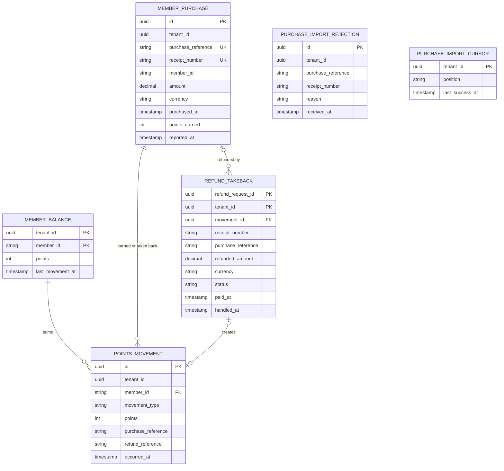
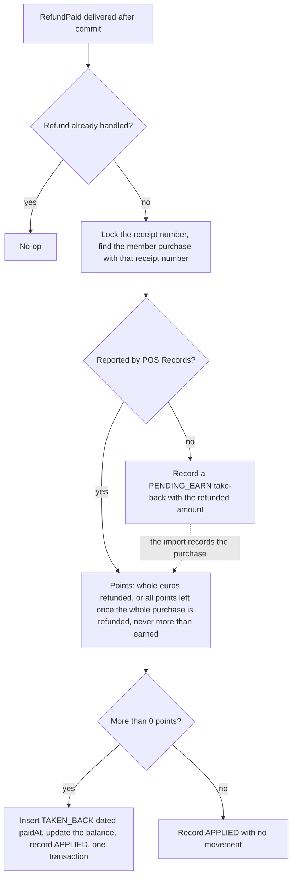

<!--
CHUNK: 13d
TITLE: Detailed Service Spec - loyalty-service
PROJECT: Refunds Platform
VERSION: 1.2
DEPENDS_ON: 09, 07, 10 (event hub - topic names, event names, and payload contracts must match chunk 10 verbatim), 11 (API contracts - integration endpoints carry their API ID and match chunk 11 verbatim), 12 (roles - permission tokens match chunk 12 verbatim)
PART OF: SDD - Refunds Platform
-->

# 17. Detailed Service Specs

---

## 17.4 loyalty-service

### What

loyalty-service is the loyalty points bounded context: a module of the `refunds-platform-core` deployable (ADR-01) that keeps each member's points as a ledger of immutable movements ([LOYALTY 03 § Points movement](../brd-loyalty-points/03-definitions-and-domain-concepts.md#points-movement)), earns points from member purchases imported from POS Records, and takes points back when refund-service reports a paid refund.

### Boundaries

- **Owns:** `MemberPurchase` (each member purchase POS Records reports, with its receipt number, amount, purchase date, and points earned), `PointsMovement` (types `EARNED` and `TAKEN_BACK`), `MemberBalance`, the purchase import cursor, and the record of handled refunds.
- **Does not own:** refund requests (refund-service), member enrolment and identities (outside the platform; §3 assumption 3), the source records of purchases (POS Records).
- **Upstream consumers:** the web app through the API gateway; refund-service through the in-process `RefundPaid` event.
- **Downstream dependencies:** POS Records (API-04).

### Input

| Type | Source | Description |
|------|--------|-------------|
| REST | Web app, member area | Balance, history, and movement detail (List of APIs). |
| Schedule | `loyalty-purchase-import`, every 15 minutes | Pulls new member purchases from POS Records through API-04. At this interval a purchase reported just after a run is still imported inside the LOYALTY/NFR-03 hour when the next run fails. |
| In-process domain event | refund-service | `RefundPaid` (§14.10). |
| Operations job | `loyalty-member-erasure` | Deletes one member's purchases and ledger on request (Compliance). |

### Business Logic

- **Earn points** (serves [LOYALTY/UC-01](../brd-loyalty-points/06a-use-cases-member.md#uc-01-view-points-balance) and [LOYALTY/UC-02](../brd-loyalty-points/06a-use-cases-member.md#uc-02-view-points-history)): the scheduled import (Input) reads member purchases after the stored cursor (member number, purchase reference, receipt number, amount, purchase date, and the time POS Records reported the purchase; API-04) and records each one as a `MemberPurchase`. A unique key on (`tenant_id`, `purchase_reference`) makes a re-imported purchase a no-op, and the cursor advances in the same transaction. The points earned are the amount rounded down to whole euros, times the tenant's earn rate (§11.2), which is 1 point per whole 1 EUR for the current tenant ([LOYALTY 03 § Points movement](../brd-loyalty-points/03-definitions-and-domain-concepts.md#points-movement) Earning: cents earn no points). A purchase that earns at least 1 point gets one `EARNED` movement dated with the purchase date (Movement date); a purchase that earns 0 points gets no movement (No 0-point movements) and is counted with `outcome=no_points`. Each record is validated: one that has a non-positive amount, is not in the tenant currency, has no receipt number, has a receipt number another member purchase already has, or fails validation otherwise is written to `purchase_import_rejection` (`tenant_id`, `purchase_reference`, `receipt_number`, `reason`, `received_at`; reasons in the Tables Design), counted with `outcome=rejected`, and passed by the cursor. Only a transport or authentication failure stops the run.
- **Take points back** ([LOYALTY/UC-02](../brd-loyalty-points/06a-use-cases-member.md#uc-02-view-points-history) BR-1: points taken back when the refund is reported paid; BR-3: 1 point per whole euro refunded, never more than the purchase earned; BR-4: a refund reported before its purchase is kept; A1: taken-back movement shown with the refund reference): the `RefundPaid` listener (after commit, §14.10) sets the tenant context from `tenantId`, then reads the `MemberPurchase` whose `receipt_number` matches the event's `receiptNumber`. The listener and the import serialise on the receipt number (a transaction-scoped lock on `tenant_id` and `receipt_number`), so refunds of one purchase are applied one at a time and the import never misses a pending take-back. The points to take back are `paidAmount` rounded down to whole euros, times the tenant's earn rate; when this refund brings the refunded total of the purchase to its amount or more, they are all the points the purchase earned that are not taken back yet; they never exceed that remainder. A result above 0 writes a `TAKEN_BACK` movement with the negative points, the purchase reference, and the refund's `referenceNumber`, dated with `paidAt` ([LOYALTY 03 § Points movement](../brd-loyalty-points/03-definitions-and-domain-concepts.md#points-movement) Movement date); a result of 0 writes no movement (No 0-point movements). This realises [LOYALTY/UC-02](../brd-loyalty-points/06a-use-cases-member.md#uc-02-view-points-history) AC-1: a fully refunded 50-point purchase shows -50 with the refund reference, and AC-6: a 30.50 EUR refund of an 80-point purchase shows -30. The record of handled refunds (`refund_takeback`), unique on (`tenant_id`, `refund_request_id`), makes a replayed event a no-op and carries `receipt_number`, `purchase_reference` once applied, `refunded_amount`, `paid_at`, and `status` (`APPLIED`, `PENDING_EARN`). When POS Records has not reported the purchase yet, the listener records `PENDING_EARN` and keeps it (BR-4); the import, in the transaction that records the purchase, applies the pending take-backs with the same tenant and receipt number in `paid_at` order with the same rule, sets their `purchase_reference`, and sets them to `APPLIED`. A pending take-back has no expiry: one for a purchase that no member made stays `PENDING_EARN` and changes no balance. The match key is the receipt number: API-04 supplies the receipt number of each member purchase (§15.3), `member_purchase` stores it (`receipt_number`, unique per tenant), and the listener matches the event's `receiptNumber` against it. When POS Records uses the receipt number as the purchase reference, both columns hold the same value. A member purchase record without a receipt number, or with a receipt number another member purchase already has, is rejected by the import (Earn points).
- **Balance** (LOYALTY/NFR-01): the balance is the sum of the movements; `MemberBalance` is updated in the same transaction as every movement insert, so the stored balance never differs from the ledger. A purchase's take-backs never exceed what it earned, so no balance goes below 0.
- **View balance** ([LOYALTY/UC-01](../brd-loyalty-points/06a-use-cases-member.md#uc-01-view-points-balance) steps 1-2): returns the balance and the date of the last movement (AC-1: 120 points and the date of the last movement), where that date is the newest movement date: a purchase date or the date a refund was paid ([LOYALTY 03 § Points movement](../brd-loyalty-points/03-definitions-and-domain-concepts.md#points-movement) Movement date). A member with no movement gets a balance of 0 and no last-movement date, and the web app explains how points are earned (A1; AC-2: no movements yet); a balance back at 0 after a take-back keeps its last-movement date, because A1 is about having no movement.
- **View history** ([LOYALTY/UC-02](../brd-loyalty-points/06a-use-cases-member.md#uc-02-view-points-history) steps 1-4): lists the movements newest first by movement date, with the date, the purchase or refund reference, and the points, with server-side pagination (AC-2: every movement, newest first). The detail returns the purchase or refund the movement came from: its reference, its date, the amount in EUR (the purchase amount from `member_purchase`, or the refunded amount from `refund_takeback`), and the points (AC-3: the purchase detail; AC-4: the refund detail). An empty first page realises A2, and the web app explains how points are earned (AC-8: no movements yet).
- **Own points only** ([LOYALTY/UC-01](../brd-loyalty-points/06a-use-cases-member.md#uc-01-view-points-balance) BR-1: members see only their own points; [LOYALTY/UC-02](../brd-loyalty-points/06a-use-cases-member.md#uc-02-view-points-history) BR-2: members see only their own points): every query filters by the `member_id` claim; the path never carries a member number.
- **Display rule:** points are whole numbers and negative movements carry a minus sign ([LOYALTY 11 § UI/UX Expectations](../brd-loyalty-points/11-summary-and-uiux.md#uiux-expectations)).

**State machine:** not applicable; movements are immutable facts and the balance is derived from them.

### Output

| Type | Destination | Description |
|------|-------------|-------------|
| REST response | Web app | Balance, movements, and movement detail. |

### Integrations

| Integration | Direction | Protocol | Purpose | Contract | Failure Handling |
|-------------|-----------|----------|---------|----------|------------------|
| POS Records | Outbound, sync | HTTPS REST | Pull member purchases after the cursor | API-04 (§15) | A transport or authentication failure stops the run and the next run resumes from the cursor; a record that fails validation is rejected and passed (Business Logic); an alert fires after two failed runs in a row, while the LOYALTY/NFR-03 hour can still be met. |
| refund-service | Inbound, in process | Domain event | Take points back after a paid refund; this realises the Refunds Portal row of [LOYALTY 08 § Integrations](../brd-loyalty-points/08-integrations.md#integrations) | `RefundPaid` (§14.10) | Publication log replays until the listener completes; the listener is idempotent. |

### DB Modeling

#### Entity Relationship

**Figure 24: loyalty-service - Entity relationship**

**Summary:** Each member purchase POS Records reports is recorded once with its amount, date, and points earned; it gives at most one earned movement, and each handled refund of it may create one take-back movement. A member's balance is the sum of their movements; the import cursor records how far the purchase import has read, and rejected purchase records are kept for review, all in the `loyalty` schema.

#### Tables Design

| Table | Column | Type | Constraints | Notes |
|-------|--------|------|-------------|-------|
| `member_purchase` | `id` | uuid | PK | UUIDv7 |
| `member_purchase` | `tenant_id`, `purchase_reference` | uuid, varchar | UNIQUE (`tenant_id`, `purchase_reference`) | One record per reported purchase; a re-import is a no-op |
| `member_purchase` | `member_id`, `amount`, `currency`, `purchased_at` | varchar, numeric(19,4), char(3), timestamptz | NOT NULL; amount > 0 | From API-04; `purchased_at` carries the purchase date |
| `member_purchase` | `points_earned`, `reported_at` | int, timestamptz | NOT NULL; `points_earned` >= 0 | 0 for a purchase under 1 EUR; `reported_at` is when POS Records reported the purchase, the start of the LOYALTY/NFR-03 hour |
| `member_purchase` | `receipt_number` | varchar | NOT NULL; UNIQUE (`tenant_id`, `receipt_number`) | From API-04; the take-back match key (Business Logic, Take points back) |
| `points_movement` | `id` | uuid | PK | UUIDv7 |
| `points_movement` | `tenant_id`, `member_id` | uuid, varchar | NOT NULL | Member number from POS Records |
| `points_movement` | `movement_type`, `points` | varchar, int | `EARNED` > 0, `TAKEN_BACK` < 0 | Whole points; no 0-point movement |
| `points_movement` | `purchase_reference` | varchar | NOT NULL; UNIQUE (`tenant_id`, `purchase_reference`) where `EARNED` | One earn per purchase; a take-back carries the purchase it reduces |
| `points_movement` | `refund_reference` | varchar | NULL for `EARNED` | REFUNDS reference number |
| `points_movement` | `occurred_at` | timestamptz | NOT NULL | Movement date: `purchased_at` for `EARNED`, `paidAt` for `TAKEN_BACK` |
| `member_balance` | `tenant_id`, `member_id`, `points`, `last_movement_at` | uuid, varchar, int, timestamptz | PK (`tenant_id`, `member_id`) | Updated with every movement; `last_movement_at` is the newest movement date |
| `refund_takeback` | `tenant_id`, `refund_request_id`, `movement_id`, `handled_at` | uuid, uuid, uuid, timestamptz | PK (`tenant_id`, `refund_request_id`) | One handling per paid refund; `movement_id` is NULL when the take-back is pending or 0 points |
| `refund_takeback` | `refunded_amount`, `currency`, `status`, `paid_at` | numeric(19,4), char(3), varchar, timestamptz | NOT NULL; CHECK status in `APPLIED`, `PENDING_EARN` | From `RefundPaid` (`paidAmount`, `paidAt`); a pending take-back waits for the purchase; `refunded_amount` counts toward the purchase's refunded total |
| `refund_takeback` | `receipt_number`, `purchase_reference` | varchar, varchar | `receipt_number` NOT NULL; `purchase_reference` NULL until applied | `receipt_number` from `RefundPaid` is the match key; `purchase_reference` is set from the matched member purchase |
| `purchase_import_rejection` | `id` | uuid | PK | UUIDv7, as Figure 24 shows |
| `purchase_import_rejection` | `tenant_id`, `received_at` | uuid, timestamptz | NOT NULL | Purchase records the import rejected and passed |
| `purchase_import_rejection` | `reason` | varchar | NOT NULL; CHECK in `NON_POSITIVE_AMOUNT`, `CURRENCY_MISMATCH`, `MISSING_RECEIPT_NUMBER`, `DUPLICATE_RECEIPT`, `INVALID` | The validation of Earn points |
| `purchase_import_rejection` | `purchase_reference`, `receipt_number`, `detail` | varchar, varchar, text | NULL allowed | As received; `detail` says what failed |
| `purchase_import_cursor` | `tenant_id`, `position`, `last_success_at` | uuid, varchar, timestamptz | PK `tenant_id` | Import position; its format depends on API-04 |
| `member_purchase`, `points_movement`, `member_balance`, `refund_takeback` | auditing columns | per §11.1 | `version` on `member_balance` | |

Indexes (each leads with `tenant_id`, §11.1):

- `member_purchase`: the unique keys (`tenant_id`, `purchase_reference`) (existing) and (`tenant_id`, `receipt_number`) (above) - the re-import no-op and the take-back match; and `(tenant_id, member_id)` - the member erasure job (Compliance).
- `points_movement (tenant_id, member_id, occurred_at, id)` - the history newest first by movement date, and the date of the last movement.
- `points_movement (tenant_id, purchase_reference)` - the points already taken back for a purchase (Take points back); the existing partial UNIQUE where `EARNED` stays.
- `refund_takeback (tenant_id, receipt_number, paid_at)` - the purchase's refunded total, and the pending take-backs the import applies in `paid_at` order.
- `refund_takeback (tenant_id, movement_id)` - the detail of a `TAKEN_BACK` movement.
- `purchase_import_rejection (tenant_id, received_at)` - review and the 90-day retention (Retention Policy).

Column lengths, check wording, and any further index a query plan needs are set in the child LLD's data section; they never change a key, a uniqueness rule, or a tenant rule above.

#### Migration Strategy

- **Tool:** Flyway, versioned SQL files in the module's own migration folder (§11.1).
- **Backward compatibility:** additive changes; expand-contract across two releases.
- **Data backfill:** batched per tenant after the expand step.
- **Rollback:** forward-fix migrations.

#### Retention Policy

- `member_purchase`, `points_movement`, `member_balance`: kept while the member's ledger exists. loyalty-service receives no signal that a member left the program, because joining the program is outside the platform ([LOYALTY 04 § Out of Scope](../brd-loyalty-points/04-scope-and-personas.md#out-of-scope), §3 assumption 3); a ledger is deleted only by the member erasure job (Compliance).
- `refund_takeback`: an `APPLIED` record is kept as long as the member purchase it refunds, because its `refunded_amount` counts toward the purchase's refunded total (Business Logic, Take points back); a `PENDING_EARN` record is kept until the import applies it ([LOYALTY/UC-02](../brd-loyalty-points/06a-use-cases-member.md#uc-02-view-points-history) BR-4: a refund reported before its purchase is kept).
- `purchase_import_rejection`: deleted 90 days after `received_at`.
- `purchase_import_cursor`: kept while the tenant exists.

#### Archival

- **Cold storage:** none in this release (§6 object storage Not applicable).
- **Format:** not applicable.
- **Schedule:** not applicable.
- **Restore SLA:** not applicable; database backups follow the §6 PostgreSQL row.

#### Data Encryption

- **At rest:** per §11.6.
- **In transit:** TLS per §11.6.
- **Key management:** per §11.6.
- **PII columns:** `member_id` (a personal identifier); masked in non-production data.

### Multi-Tenancy Specifications

- **Strategy override:** none; shared schema with `tenant_id` (§11.2).
- **Tenant filter:** every query filters by the tenant and by the caller's `member_id` claim.
- **Cross-tenant queries:** forbidden.

### API Standards

- **Style:** REST with JSON (ADR-04).
- **Versioning:** URI prefix `/v1` (§15.1).
- **Authentication:** Keycloak JWT, validated at the gateway and in the core (ADR-07).
- **Idempotency:** read-only endpoints; the import and the take-back are idempotent through their unique keys.
- **Pagination:** server-side, `page` and `size` on the movements list, newest first.
- **Error envelope:** per the §15.1 error model.

#### List of APIs (Swagger-friendly)

| Method | Path | Summary | Request Body | Response | Permission token (§16) | API ID (§15) |
|--------|------|---------|--------------|----------|------------------------|--------------|
| GET | `/v1/members/me/points` | Get the caller's points balance and the date of the last movement | - | `PointsBalanceView` | `loyalty.points.read-own` | - |
| GET | `/v1/members/me/points/movements` | List the caller's points movements, newest first | - | `PointsMovementPage` | `loyalty.points.read-own` | - |
| GET | `/v1/members/me/points/movements/{movementId}` | Get one movement with the purchase or refund it came from | - | `PointsMovementDetail` | `loyalty.points.read-own` | - |

No other service or external system calls these endpoints, so none carries an API ID. Their DTOs carry the business fields below, with the conventions of §17.1 List of APIs (`Money`, `timestamp`, the page wrapper); the OpenAPI document (§21) adds formats, lengths, and examples.

| DTO | Fields |
|-----|--------|
| `PointsBalanceView` | `points` int R (0 when the member has no movement); `lastMovementAt` timestamp C (absent when there is no movement) |
| `PointsMovementPage` | Page of `movementId` uuid, `movementType` enum `EARNED`, `TAKEN_BACK`, `points` int (negative for `TAKEN_BACK`), `occurredAt` timestamp, `purchaseReference` string, `refundReference` string C (on `TAKEN_BACK`); query `page`, `size`; order newest first, fixed |
| `PointsMovementDetail` | The page item fields, plus `purchase` R: `purchaseReference`, `amount` Money, `purchasedAt` timestamp; and `refund` C (on `TAKEN_BACK`): `referenceNumber`, `paidAmount` Money, `paidAt` timestamp |

No field carries a member number; the member is the token's `member_id` claim.

### Event-Driven Architecture (If Applicable)

#### Event Model

**Published events:**

| Event Name | Producer | Producer Specs | Consumers | Consumer Specs | Schema (Summary) | Delivery Guarantee |
|------------|----------|----------------|-----------|----------------|------------------|---------------------|
| None | loyalty-service | The module publishes no integration event (§14.4) | - | - | - | - |

**Consumed events:**

| Event Name | Producer (owning service) | Topic | Effect in this service | Idempotency / ordering |
|------------|---------------------------|-------|------------------------|------------------------|
| None | - | - | The module consumes no integration event; it handles `RefundPaid` in process (below). | - |

**In-process domain events (modules only):**

| Event | Publisher module | Listener modules | Transaction phase (before commit / after commit) | Payload (DTO) | Notes |
|---|---|---|---|---|---|
| `RefundPaid` | refund-service | loyalty-service | after commit | `RefundPaidEvent`: `tenantId`, `refundRequestId`, `referenceNumber`, `receiptNumber`, `paidAmount`, `paidAt` | The listener sets the tenant context from `tenantId` before any query, then applies the take-back rule (Business Logic) and writes the take-back movement (when above 0 points) or the pending take-back, with the handled-refund record, in one transaction; idempotent on `refundRequestId`. |

#### Messaging Infra

Not applicable - no integration events.

### Constraints

- **Authorization, [LOYALTY/UC-01](../brd-loyalty-points/06a-use-cases-member.md#uc-01-view-points-balance) and [LOYALTY/UC-02](../brd-loyalty-points/06a-use-cases-member.md#uc-02-view-points-history):** role `MEMBER` with `loyalty.points.read-own`; own points only (`member_id` claim), per [LOYALTY 07 § Users & Use Cases Matrix](../brd-loyalty-points/07-users-use-cases-matrix.md#users--use-cases-matrix) footnote (1).
- **Timing:** points earned show within the LOYALTY/NFR-03 hour of POS Records' report, through the import schedule (Input). Points taken back show within the LOYALTY/NFR-02 hour, which starts when the refund is marked Paid or, for a refund reported before its purchase, when POS Records reports the purchase: the in-process listener normally completes within seconds, and the import applies a pending take-back in the transaction that records the purchase.
- **No redemption:** points are never spent in this release ([LOYALTY 04 § Out of Scope](../brd-loyalty-points/04-scope-and-personas.md#out-of-scope)), and a purchase's take-backs never exceed what it earned, so a balance cannot go below zero.

### Error Handling

- **Synchronous APIs:** RFC 9457 Problem Details per §15.1.
- **Validation errors:** 400 `VALIDATION_FAILED` for bad paging parameters.
- **Domain errors:** a movement id that does not belong to the caller answers 404 `NOT_FOUND`, never 403, so movement ids of other members are not revealed ([LOYALTY/UC-02](../brd-loyalty-points/06a-use-cases-member.md#uc-02-view-points-history) BR-2: own points only).
- **Auth errors:** 401 `UNAUTHENTICATED`; 403 `FORBIDDEN` when the token has no `MEMBER` role or no `member_id` claim.
- **Server errors:** 500 `INTERNAL_ERROR` with the correlation id only, or 503 `UNAVAILABLE` while the core database cannot be reached; the web app then shows that the points or the history cannot be shown right now and to try again later ([LOYALTY/UC-01](../brd-loyalty-points/06a-use-cases-member.md#uc-01-view-points-balance) E1, AC-3: points cannot be shown; [LOYALTY/UC-02](../brd-loyalty-points/06a-use-cases-member.md#uc-02-view-points-history) E1 at step 2 or step 4, AC-5: history cannot be shown, AC-7: movement details cannot be shown).
- **Async consumers:** the `RefundPaid` listener rolls back on failure and the publication log redelivers it; a transport or authentication failure stops the import, which resumes from the cursor on the next run, and a record that fails validation is rejected and passed (Business Logic).
- **Poison messages:** a `RefundPaid` that fails repeatedly stays incomplete in the publication log and raises an alert on its age (§11.4). The publication-log replay resubmits each incomplete publication every 5 minutes (§11.1), so a `RefundPaid` that keeps failing is redelivered about six times before the alert fires at 30 minutes (§11.4); redelivery continues after the alert until the listener completes (ADR-05).

### Observability & Monitoring

#### Logging

- JSON per §11.4, with `refundRequestId` and movement id as searchable fields.
- Never logs member numbers or `tenant_id` at INFO or above.
- Retention per the §6 logging row.

#### Metrics

| Metric | Type | Labels | Purpose |
|--------|------|--------|---------|
| `loyalty_points_movements_total` | counter | `movement_type` | Earned and taken-back volume |
| `loyalty_earn_lag_seconds` | histogram | - | Time from `reported_at` to the `EARNED` movement, against LOYALTY/NFR-03 (one hour) |
| `loyalty_takeback_lag_seconds` | histogram | - | Time from the later of `paidAt` and the purchase's `reported_at` to the take-back, against LOYALTY/NFR-02 (one hour); covers take-backs applied by the listener and by the import |
| `loyalty_purchase_import_last_success_timestamp` | gauge | - | Freshness of the purchase import; alerted after two failed runs in a row |
| `loyalty_purchase_import_records_total` | counter | `outcome` (imported, no_points, duplicate, rejected) | Import volume; an alert fires when a run rejects any record |

#### Tracing

- OpenTelemetry spans for every endpoint, the import run, the API-04 call, and the `RefundPaid` listener.
- The listener span links to the trace of the transaction that marked the refund Paid.
- Sampling per the §6 tracing row.

### Developer Notes

- **Recommended patterns:** hexagonal ports `PosPurchasePort` and `RefundPaidListener`; the ledger is append-only; records for DTOs.
- **Avoid:** reading the `refund` schema; updating or deleting a movement or a member purchase, except through the member erasure job; computing the balance in the web app.
- **Testing:** JUnit 5 and Mockito for the points rules (whole-euro earning, no 0-point movement, the take-back of part of a purchase with its cap, and a refund reported before its purchase); Testcontainers with PostgreSQL for the ledger, the balance invariant, listener idempotency, and the listener and the import racing on one purchase; a stub of API-04 until its contract is supplied.

### Service-Level Diagrams

#### Implementation Flow Chart

**Figure 25: loyalty-service - Take-back flow**

**Summary:** Each paid refund is handled once: it takes back 1 point per whole euro refunded, or every point left once the whole purchase is refunded, never more than the purchase earned. A result of 0 points creates no movement, and a refund reported before its purchase waits as a pending take-back until the import records the purchase and applies it.

#### Sequence Diagram (Service-Internal)

Not applicable: the cross-module interaction is shown in §8.5.3, and the service-internal steps are the flow above.

### Compliance

- **GDPR:** member numbers, purchase references, receipt numbers, member purchases, and movements are personal data, processed to keep the member's points ledger and show it to them ([LOYALTY/UC-01](../brd-loyalty-points/06a-use-cases-member.md#uc-01-view-points-balance), [LOYALTY/UC-02](../brd-loyalty-points/06a-use-cases-member.md#uc-02-view-points-history)); the ledger is visible only to its member. The lawful basis for this purpose is the one the retailer's data protection owner records for it; the platform collects no consent. **Erasure:** the `loyalty-member-erasure` job, run by operations under the §20.3 break-glass rule on a request the data protection owner approves, deletes one member's `member_balance`, `points_movement`, and `member_purchase` rows and the `APPLIED` `refund_takeback` records of those purchases in one transaction, holding the receipt-number lock of each purchase (Business Logic, Take points back), so the balance never disagrees with the ledger (LOYALTY/NFR-01). It is the only deletion of movements and member purchases (Developer Notes). A refund of an erased purchase paid later finds no member purchase and is kept as a `PENDING_EARN` take-back that changes no balance, as for a purchase no member made; a `PENDING_EARN` record names no member and follows the Retention Policy.
- **PCI-DSS:** not applicable; no card data.
- **ISO 27001 / SOC 2:** neither BRD requires a certification; the module applies the §11.6 controls, so a certification scope the retailer adopts can include it without a design change.
- **Local regulations:** none stated by the BRDs.

### Deployment Strategy

- **Service-specific override:** none; the module ships in the `refunds-platform-core` image and Helm chart (ADR-09). The import runs on one replica at a time through a database lock.
- **Replicas:** per the core deployable (§11.3).
- **Strategy:** rolling update; migrations for the `loyalty` schema run before the new version takes traffic.
- **Health checks:** liveness and readiness probes of the core.
- **Rollback:** Helm rollback; migrations stay backward compatible.

### Future Enhancements

- Export the history ([LOYALTY/UC-02](../brd-loyalty-points/06a-use-cases-member.md#uc-02-view-points-history) future enhancement).
- Redeem points at checkout ([LOYALTY 12 § Wishlist](../brd-loyalty-points/12-appendix-and-wishlist.md#wishlist)); this is one of the extraction triggers of ADR-01.

<!-- MASTER: refunds-platform-sdd-master.md | PREV: 13c-service-notification.md | NEXT: 14-performance-and-capacity.md -->
