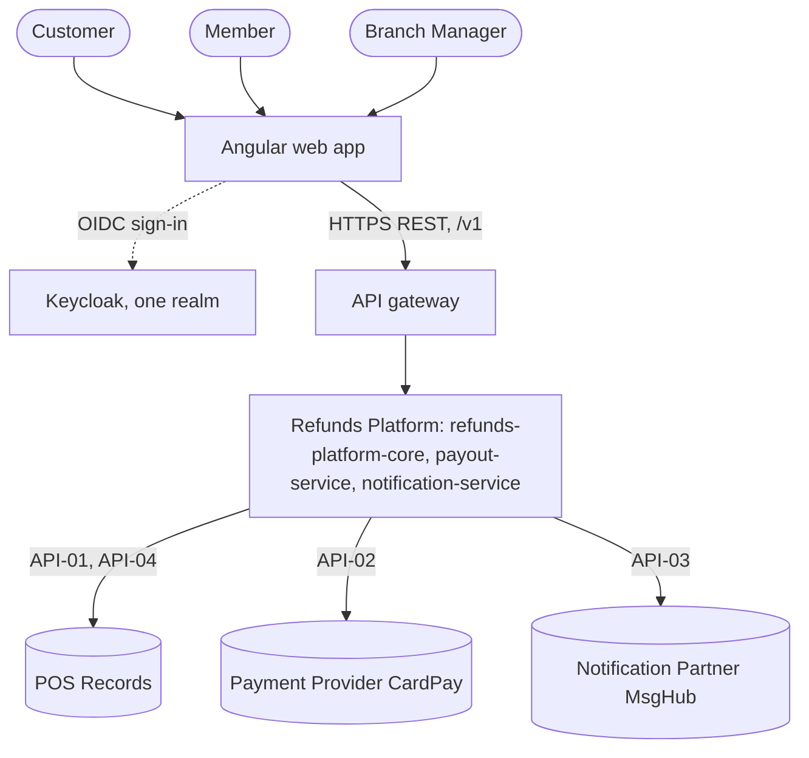
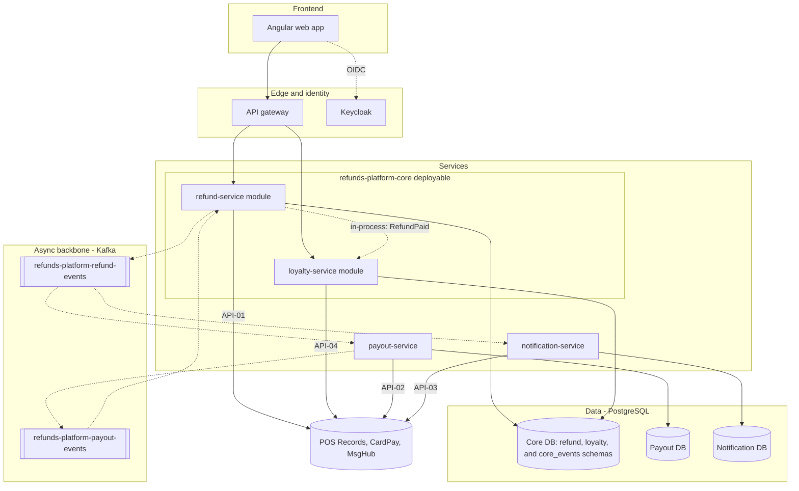
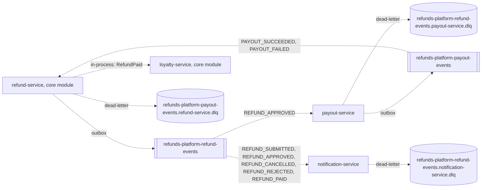
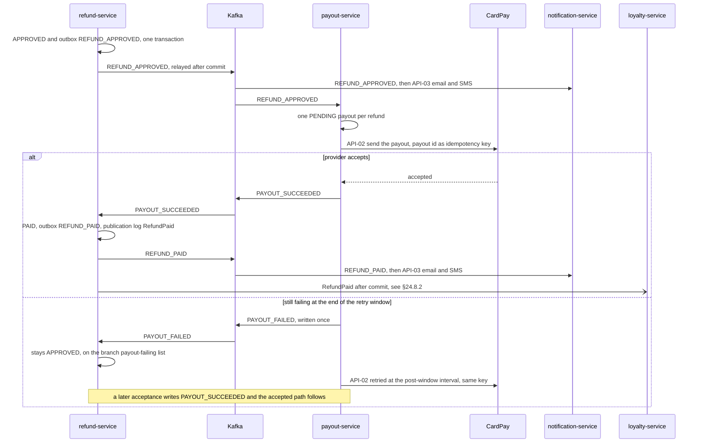
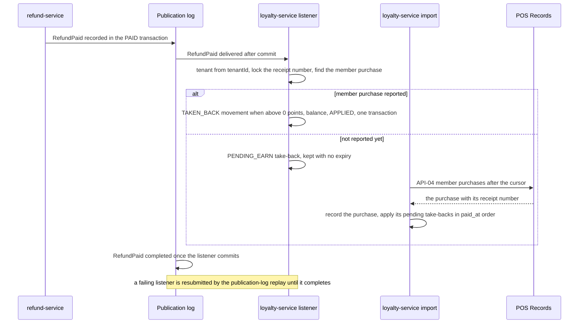

<!--
CHUNK: 19
TITLE: End-to-End System Design (Services · Topics · Producers · Consumers)
PROJECT: Refunds Platform
VERSION: 1.2
DEPENDS_ON: 04, 05, 09, 10 (event hub), 11 (API contracts), 12 (user roles), 13a-13d (per-service chunks), 18 (open items: cleared)
PART OF: SDD - Refunds Platform
PURPOSE: The single end-to-end view of the whole system: every service, every topic, every producer->consumer edge, the synchronous edges (HTTP and in-process), and the key sagas. Authored LAST, only after chunk 18 is cleared, so it consolidates the final reconciled and reviewed state.
GATE: This chunk cannot be generated or refreshed until the e2e gate is open (SKILL.md step 8b, conditions E1-E4): every open item in chunk 18 is resolved (Deferred counts as open), no contract divergence is open, no clarification marker is left in the chunks it consolidates or in 03 §7.3 (use-case traceability), and the contract reconciliation was rerun after the last change. No override. While the gate is shut, nothing of this chunk is written, not even a draft or outline.
FAITHFULNESS_RULE: This chunk is a faithful consolidation, not a new design. Every count, name, and edge must trace to chunks 09, 10, 11, 12, and 13x. Any deliberate simplification (clustered edges, sampled sagas) is stated explicitly - no silent caps.
NO_DUPLICATION_RULE: One fact, one home. This chunk shows only what no other chunk shows (the whole-system fan-out maps and saga views). Normative content owned elsewhere (the async mechanism §14.2.1, the topic registry §14.4, the guarantees §14.6, the doctrines §14.7) is REFERENCED, never restated.
-->

# 24. End-to-End System Design (Services · Topics · Producers · Consumers)

> **What this chunk is.** The bird's-eye, implementation-facing map of the entire platform: the service landscape, the system context, the layered architecture, the full producer → topic → consumer fan-out, the synchronous edges, and the key sagas. A new engineer (or AI implementer) reads this chunk to understand how the system fits together, following its references into chunks 10/11/13x for the normative contracts.

---

## How to Read This Document

Read the counts and the simplifications first, then the service landscape (§24.1), the context (§24.2) and the layers (§24.3), then the event map (§24.5) and the synchronous edges (§24.7), and finish with the two sagas (§24.8). In the flowcharts, a solid arrow is a synchronous call or a database connection; a dotted arrow is asynchronous or out of band: a Kafka publication or consumption, a dead-letter write, the OIDC sign-in, or an edge labelled `in-process:`, which is a domain event delivered after commit between two modules of the `refunds-platform-core` deployable, never a topic. A rounded node is a human actor, a double-bordered box (`[[...]]`) is a Kafka topic, and a cylinder is a database, a DLQ topic, or an external system. Every name is verbatim from its home chunk; every contract stays in its home and is referenced by ID.

### Counts at a Glance

| Dimension | Count | Source of truth |
|---|---|---|
| Services | 4 (2 modules of `refunds-platform-core`, 2 extracted services) | §13 (chunk 09) |
| Topics | 2 | §14.4 (chunk 10) |
| Distinct published events | 7 | §14.9 coverage matrix (chunk 10) |
| In-process domain events | 1 (`RefundPaid`) | §14.10 (chunk 10) |
| Synchronous HTTP edges | 4 (all from a deployable to an external system) | §24.7 |
| In-process port calls | 0 | §24.7 |
| Sagas documented | 2 | §24.8 |

### Faithfulness & Deliberate Simplifications (no silent caps)

- **Topics:** the count is the two rows of §14.4. The three DLQ topics (`<topic>.<consumer group>.dlq`, one per consumer group) are drawn in §24.5.1 but not counted: they hold failed copies of the seven events, never a new event (§14.4).
- **Events:** the count is the seven rows of the §14.9.99 coverage matrix (refund-service 5, payout-service 2). `RefundPaid` is counted apart because it never reaches the broker (§14.10).
- **System context (§24.2):** the three backend deployables are drawn as one platform node, and the API gateway's route to it stands for its routes to the two core modules only; the deployables and modules are drawn in §24.3.
- **Layered architecture (§24.3):** the three external systems share one node, with one edge per API contract; the ingress, the schema registry, the secrets manager, and the observability stack (§6, §11.4) are not drawn.
- **Fan-out (§24.5.1):** every producer → topic → consumer edge of §14.5 is drawn; the events of one topic that go to the same consumer share one edge label. The full per-event matrix stays in §14.5.
- **Synchronous edges (§24.7):** the count is the four contracts of §15.2. The 12 client-facing endpoints that the web app calls through the API gateway (9 in §17.1, 3 in §17.4) are not integration contracts (chunk 11 scope) and are not counted; there is no synchronous call between deployables (ADR-05) and no in-process port call (chunk 11).
- **Sagas (§24.8):** two are drawn, the two cross-service flows that carry money and points. The submission, cancellation, and rejection messages are single-hop event fan-outs, drawn only in §24.5.1 (and in §8.4.1 and §8.5.1); the branch manager's decision request itself is in §8.5.2.
- **External systems** appear at system-context level only; their contracts are `TBD - external` (§15.6).

## 24.1 Service Landscape (archetype × phase)

| # | Service | Archetype | Phase | Publishes to | Consumes from | Sync surface |
|---|---|---|---|---|---|---|
| 1 | refund-service | domain; module of `refunds-platform-core` | P1 | `refunds-platform-refund-events`; in-process `RefundPaid` | `refunds-platform-payout-events` | 9 client-facing REST endpoints (§17.1 List of APIs); calls API-01 |
| 2 | payout-service | domain; extracted service | P1 | `refunds-platform-payout-events` | `refunds-platform-refund-events` (`REFUND_APPROVED` only) | No business endpoint; calls API-02 |
| 3 | notification-service | domain; extracted service, consumer-only | P1 | None (§14.4) | `refunds-platform-refund-events` | No business endpoint; calls API-03 |
| 4 | loyalty-service | domain; module of `refunds-platform-core` | P1 | None (§14.4) | In-process `RefundPaid` | 3 client-facing REST endpoints (§17.4 List of APIs); calls API-04 |

## 24.2 System Context

**Figure 26: End-to-end system context**

**Summary:** Customers, members, and branch managers use one web app, which signs them in through Keycloak and reaches the platform only through the API gateway. The platform depends on three external systems: POS Records for receipts and member purchases, CardPay for refund payouts, and MsgHub for customer email and SMS.

## 24.3 Layered High-Level Architecture

**Figure 27: End-to-end layered architecture**

**Summary:** The web app reaches only the core, whose two modules share one database with a schema each and hand paid refunds over in process; the two extracted services own their databases and talk to the core only through the two Kafka topics. Each deployable calls its external systems through its own API contract, one hop deep.

## 24.4 The Universal Per-Event Mechanism (async backbone)

Every event on every topic flows through the one universal mechanism - outbox → relay → topic → per-consumer queue with inbox dedup and DLQ. **Normative definition and diagram: §14.2.1 ([10-events-hub.md](./10-events-hub.md)).** The in-process `RefundPaid` uses the core's durable publication log instead: §14.10 and §11.1 ([07-cross-cutting-concerns.md](./07-cross-cutting-concerns.md)).

## 24.5 Producer → Topic → Consumer Fan-Out (the event map)

### 24.5.1 Phase 1 Core

**Figure 28: Producer, topic, and consumer fan-out, phase 1**

**Summary:** refund-service publishes the five refund lifecycle events, of which payout-service consumes only `REFUND_APPROVED` and notification-service consumes all five; payout-service publishes the two payout outcomes, which only refund-service consumes, and refund-service alone hands `RefundPaid` to loyalty-service in process. Each of the three consumer groups dead-letters to its own DLQ topic.

### 24.5.2 Phase 2+ Domains

Not applicable for this release: every topic and every event is P1 (§14.4, §14.5). The one planned change to this map, the extraction of loyalty-service, is stated in §14.7 and ADR-01.

### 24.5.3 Universal Subscribers (breadth rules)

- None in this release (§14.7).

## 24.6 Cross-Service Doctrines

1. Refund facts are re-published by their owner - normative home §14.7.
2. Module facts stay in process - normative home §14.7 and ADR-05.
3. No synchronous call between deployables - normative home ADR-05.
4. Transactional outbox and inbox dedup on every event edge - normative home §14.6 and ADR-02.
5. Consumer retries and dead-lettering by failure class - normative home §14.6 rule 4.
6. A refund is paid at most once - normative home §14.6 rule 7.
7. Customer contact details travel in the refund events - normative home ADR-10.
8. Authorization in the owning module - normative home ADR-08 and §16.

## 24.7 Synchronous Edges (one-hop rule)

| # | Caller → Callee | API ID (§15) | Purpose | Why synchronous |
|---|---|---|---|---|
| 1 | refund-service → POS Records | API-01 | Look up a receipt and its items | The customer waits for the refundable items at [REFUNDS/UC-01](../brd-refunds-portal/06a-use-cases-customer.md#uc-01-request-a-refund) steps 1-2, a true request-response read (§12 INT-03) |
| 2 | payout-service → Payment Provider (CardPay) | API-02 | Send a refund payout to the original card | The provider takes one HTTPS request per payout (§12 INT-01); the `payout-retry` worker makes it after commit, never inside a consumer transaction (§17.2) |
| 3 | notification-service → Notification Partner (MsgHub) | API-03 | Send a customer email or SMS | The partner takes one HTTPS request per message (§12 INT-02); the `message-retry` worker makes it, never the consumer (§17.3) |
| 4 | loyalty-service → POS Records | API-04 | Fetch member purchases after a cursor | The scheduled import pulls member purchases by cursor (§12 INT-03, §17.4 Input) |

No row is service to service: every edge is one hop from a deployable to an external system, so no synchronous chain exists. In-process port calls: none.

## 24.8 Key Sagas (dynamic view)

### 24.8.1 Refund decision to payout (choreographed)

**Use cases:** [REFUNDS/UC-04](../brd-refunds-portal/06b-use-cases-branch-manager.md#uc-04-approve--reject-refund)

**Figure 29: Saga - refund decision to payout**

**Summary:** An approval travels as `REFUND_APPROVED` to payout-service, which pays once per refund with a stable idempotency key, and to notification-service, which tells the customer; a successful payout comes back as `PAYOUT_SUCCEEDED`, refund-service marks the request Paid, and the customer and loyalty-service follow. Nothing is rolled back on failure: a payout still failing at the end of the §17.2 retry window is reported once with `PAYOUT_FAILED`, the request stays Approved on the branch manager's payout-failing list, and the payout keeps being retried until it succeeds (§17.2); an approval that never reaches payout-service is flagged by the payout watchdog (§17.1).

### 24.8.2 Points take-back after a paid refund (choreographed, in process)

**Use cases:** [LOYALTY/UC-02](../brd-loyalty-points/06a-use-cases-member.md#uc-02-view-points-history), [REFUNDS/UC-04](../brd-refunds-portal/06b-use-cases-branch-manager.md#uc-04-approve--reject-refund)

**Figure 30: Saga - points take-back after a paid refund**

**Summary:** A paid refund reaches loyalty-service in process after the Paid transition commits; the listener matches the member purchase on the receipt number under a lock and takes the points back at once, or keeps a pending take-back that the purchase import applies when POS Records reports the purchase. There is no compensation step: the take-back is idempotent per refund, and a failing listener is redelivered by the publication-log replay until it completes (§17.4).

## 24.9 Normative References

- **Topic registry (one row per topic, owner, key family):** §14.4 ([10-events-hub.md](./10-events-hub.md)).
- **Per-event consumer reconciliation:** §14.5; payload contracts: §14.9; in-process domain events: §14.10.
- **Cross-cutting guarantees every edge inherits:** §14.6.
- **Universal subscribers & doctrines:** §14.7.
- **Roles & authorities behind every edge's authorization:** §16 ([12-centralized-user-roles.md](./12-centralized-user-roles.md)).
- **Synchronous API contracts (URI, headers, body, error codes, security):** §15 ([11-api-contracts.md](./11-api-contracts.md)).

## Sources

- Chunk 09 (§13 decomposition): the four services, their types, and their owned data.
- Chunk 10 (§14 event hub): the two topics, the seven integration events and their consumers, the DLQ naming, and `RefundPaid` (§14.10).
- Chunk 11 (§15 API contracts): the four API contracts of §15.2 and the absence of internal and in-process contracts.
- Chunk 12 (§16 roles): the three roles behind the client-facing edges.
- Chunks 13a to 13d (§17.1 to §17.4 service specs): each service's published and consumed tables, DLQ topics, endpoints, workers, and saga steps.
- Chunks 04 and 05 (§8.3, §8.5): the layer composition and the sequences the sagas consolidate.
- Chunk 18 (§23 open items): 22 items, all `Accepted - applied`; the contract reconciliation was rerun after the last change (master, Reconciled line).

<!-- MASTER: refunds-platform-sdd-master.md | PREV: 18-open-items-and-clarifications.md | NEXT: none -->
