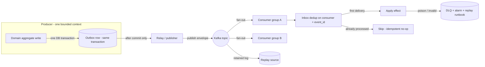
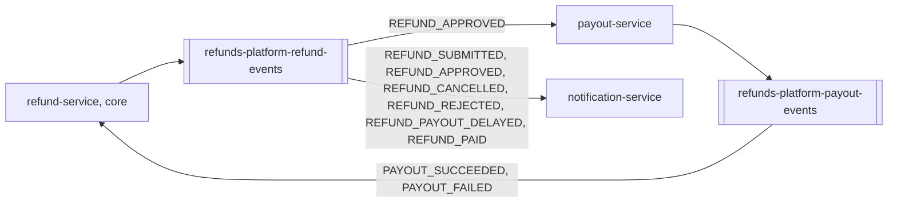

<!--
CHUNK: 10
TITLE: Centralized Event Hub (Platform Event Catalog & Payload Contracts)
PROJECT: Refunds Platform
VERSION: 1.3
DEPENDS_ON: 05, 07, 08, 09
RECONCILES_WITH: every per-service chunk (13a, 13b, 13c, 13d) - Event Model + Messaging Infra sub-sections
PART OF: SDD - Refunds Platform
PURPOSE: Single cross-service catalog of every platform event - name, producer, consumers, envelope, payload contract, business what/when/why - plus the centralized event-hub topology. Consolidates what is otherwise distributed across the per-service Event Models.
CONSISTENCY_RULE: This chunk is the platform contract registry. Topic names, event names, envelope fields, and payload contracts here MUST match the per-service chunks character-for-character. Consumer lists are reconciled from BOTH sides (each producer's published table AND each consumer's consumed table). Where a per-service spec and this catalog disagree, the divergence is flagged in the Consistency Notes section (§14.8) and fixed on the wrong side, never silently reconciled; a name the user has already seen keeps its registry spelling (SKILL.md principle 14).
-->

# 14. Centralized Event Hub (Platform Event Catalog & Payload Contracts)

> **What this chunk is.** The one place that lists **every event on the platform** with its producer, consumers, key family, payload contract, and business meaning (what / when / why), plus the hub topology that carries them. It is a derived consolidation of the per-service Event Models (each `13x` chunk § Event-Driven Architecture). Downstream LLD generation and implementers read this chunk as the single contract surface - the key goal is a smooth implementation with no producer/consumer mismatches.

---

## 14.1 Purpose & Scope

Every state change that crosses a deployable travels as an asynchronous integration event through this hub (ADR-02, ADR-05); synchronous REST is reserved for the web app and for calls to external systems, one hop at most. Inside the `refunds-platform-core` deployable, modules exchange in-process domain events (§14.10).

1. **What events exist:** eight integration events from two producers (refund-service: 6; payout-service: 2), plus one in-process domain event (`RefundPaid`). The count is owned by the §14.9.99 coverage matrix.
2. **Who produces and consumes each:** §14.5, reconciled from the published tables of §17.1 and §17.2 and the consumed tables of §17.1, §17.2, and §17.3; loyalty-service takes part only through §14.10.
3. **What each event carries:** the envelope of §14.3 and the payload contracts of §14.9.
4. **Why and when each fires:** the business column of §14.5, with the BRD use-case step that fires it.

All eight integration events are `committed`: their payload contracts are ratified (§14.9) and every consumer listed in §14.5 is wired in P1.

**Out of scope:** events that never leave one module; the payment provider's payout result if it arrives by callback (a REST call on API-02's side, not a bus event); the member purchases pulled from POS Records (normalized in the loyalty-service adapter, never published).

## 14.2 Hub Topology Decision

**Decision:** one logical hub on one Kafka cluster, with one topic per producing bounded context (two topics), one consumer group per consuming deployable, and one DLQ per consumer group.

What makes it *one hub* is the shared contract surface of the integration events on the broker (in-process domain events between modules: §14.10):

- **One envelope standard** (§14.3) on every event, on every topic.
- **One messaging library / pattern:** outbox -> relay -> Kafka -> inbox, per the CLAUDE.md outbox mandate, shared by the core and both services.
- **One schema registry:** the §6 registry with one JSON Schema subject per event type (§14.3 Wire format); a CI compatibility check rejects any change that is not additive.
- **One event archive:** the topics' retained log (retention per §6) is the replay source; a replay resets one consumer group's offsets and never re-publishes to a topic.
- **One delivery semantic:** at-least-once delivery, exactly-once **effect** via `(consumer, event_id)` inbox dedup within the dedup window (§14.6 rule 2), per-refund publishing order from one active relay per outbox, and per-aggregate ordering via `aggregate_version` (§14.6 rule 3).

| Dimension | One topic per producing context | One shared platform topic |
|---|---|---|
| Access control | A write ACL per topic: only the owner publishes | Every producer can write every event type |
| Blast radius | A misbehaving producer affects one topic | Affects every consumer |
| Archive / replay granularity | Replay one context's facts | Replay everything or filter while replaying |
| Ownership | One owner per topic (§14.4) | Shared, no single owner |
| Cost / fan-out | Two topics; consumers ignore event types they do not handle | One topic; every consumer reads and discards most events |

### 14.2.1 Async Backbone (the universal per-event mechanism)

**Figure 9: Async backbone**

**Summary:** An integration event is written to the outbox in the producer's own transaction and published by the relay only after commit; each consumer group dedups on its inbox before applying the effect, and a message it cannot process goes to its DLQ with an alarm.

### 14.2.2 Hub Topology & Fan-Out Landscape

**Figure 10: Hub topology and fan-out**

**Summary:** refund-service publishes the refund lifecycle, which payout-service and notification-service consume; payout-service publishes payout outcomes, which only refund-service consumes. loyalty-service does not use the broker; it receives `RefundPaid` in process (§14.10).

## 14.3 Standard Event Envelope (every event, every topic)

| Field | Type | Meaning |
|---|---|---|
| `event_id` | UUIDv7 | Globally unique; the inbox dedup key `(consumer, event_id)` -> exactly-once effect. |
| `event_type` | string | SCREAMING_SNAKE_CASE, past-tense fact (e.g., `REFUND_PAID`). |
| `schema_version` | semver | Schema version from the registry (additive-only). |
| `aggregate_id` | UUIDv7 | The producing aggregate instance: the refund request id or the payout id. |
| `aggregate_type` | string | `RefundRequest` or `Payout`. |
| `aggregate_version` | int | Per-aggregate monotonic counter; the ordering / last-writer-wins guard. |
| `occurred_at` | timestamp (UTC) | When the fact happened. |
| `correlation_id` | UUIDv7 | Opaque request/trace correlation; carries no tenant data or PII. |
| `causation_id` | UUIDv7 (optional) | The event that caused this one (for example, `REFUND_PAID` caused by `PAYOUT_SUCCEEDED`). |
| `tenant_id` | UUIDv7 | Tenant key (§11.2). |
| `payload{}` | JSON | Event-specific body; schema owned by the registry (§14.9). |

**Key-family variants (if applicable):**

- **Tenant-keyed, partitioned by refund:** every event on both topics; the Kafka message key is `refundRequestId`, so all facts about one refund stay in order on one partition.
- **Exceptions:** none.

**Wire format (every event, every topic):**

- **Key:** `refundRequestId` (key family above), as a UTF-8 string.
- **Headers:** `event_id`, `event_type`, `schema_version`, `tenant_id`, `correlation_id`, and `traceparent`, written by the relay from the outbox row and the envelope. A consumer reads `event_type` and `schema_version` from the headers and skips an event type it does not handle before reading the value (ADR-10).
- **Value:** the whole envelope above as UTF-8 JSON, the same document the outbox `payload` holds; the header values equal the envelope's, and the envelope is authoritative.
- **Subjects:** one registry subject per event type, named `<topic>-<EVENT_TYPE>` (for example `refunds-platform-refund-events-REFUND_PAID`), so several event types share a topic and each evolves on its own under §14.6 rule 5; the CI compatibility check runs per subject.
- **Final facts:** §14.5 types every event as final or not. A final fact ends the refund's or the payout's lifecycle; a fact that is not final can be followed by another outcome for the same refund (`PAYOUT_FAILED` by `PAYOUT_SUCCEEDED`, `REFUND_PAYOUT_DELAYED` by `REFUND_PAID`).

## 14.4 Topic Registry

| # | Topic | Owner (sole publisher) | Key family | Phase |
|---|---|---|---|---|
| 1 | `refunds-platform-refund-events` | refund-service (module of `refunds-platform-core`) | Tenant-keyed, message key `refundRequestId` | P1 |
| 2 | `refunds-platform-payout-events` | payout-service | Tenant-keyed, message key `refundRequestId` | P1 |

**No topic, no published events (consumers only):** notification-service. loyalty-service, the API gateway, and the web app do not use the broker. Each consumer group also writes its own DLQ topic, named `<topic>.<consumer group>.dlq`; a DLQ holds only failed copies of the events above, never a new event.

## 14.5 Platform Event Catalog

**Status legend:** `committed` / `candidate` / `Analytics-only` / `Pn` = phase. **Final:** whether the fact ends the refund's or the payout's lifecycle (§14.3 Wire format, Final facts).

### 14.5.1 refund-service - `refunds-platform-refund-events` (tenant-keyed; P1)

| Event | Consumers | Payload (beyond envelope) | Business: what · when · why | Status | Final |
|---|---|---|---|---|---|
| `REFUND_SUBMITTED` | notification-service | `referenceNumber`, `customerId`, `customerContact`, `branchId`, `requestedAmount` | A refund request is recorded as Submitted · [REFUNDS/UC-01](../brd-refunds-portal/06a-use-cases-customer.md#uc-01-request-a-refund) step 6 · the customer is told by email and SMS | committed | No |
| `REFUND_CANCELLED` | notification-service | `referenceNumber`, `customerId`, `customerContact` | The customer cancelled a Submitted request · [REFUNDS/UC-03](../brd-refunds-portal/06a-use-cases-customer.md#uc-03-cancel-a-refund-request) step 5 · the customer is told by email | committed | Yes |
| `REFUND_APPROVED` | payout-service, notification-service | `referenceNumber`, `receiptNumber`, `branchId`, `approvedAmount`, `partial`, `decisionReason`, `customerId`, `customerContact` | The branch manager approved in full or in part · [REFUNDS/UC-04](../brd-refunds-portal/06b-use-cases-branch-manager.md#uc-04-approve--reject-refund) step 6 (A1 for a partial amount) · payout-service sends the payout, and the customer is told the approved amount | committed | No |
| `REFUND_REJECTED` | notification-service | `referenceNumber`, `customerId`, `customerContact`, `rejectionReason` | The branch manager rejected the request with a reason · [REFUNDS/UC-04](../brd-refunds-portal/06b-use-cases-branch-manager.md#uc-04-approve--reject-refund) A2 · the customer is told the reason | committed | Yes |
| `REFUND_PAYOUT_DELAYED` | notification-service | `referenceNumber`, `customerId`, `customerContact`, `approvedAmount` | The payout of an approved request still fails at the end of the §17.2 retry window · [REFUNDS/UC-04](../brd-refunds-portal/06b-use-cases-branch-manager.md#uc-04-approve--reject-refund) E1 and AC-2, written once when `PAYOUT_FAILED` arrives · the customer is told by email and SMS that the payout is delayed | committed | No: `REFUND_PAID` can follow |
| `REFUND_PAID` | notification-service | `referenceNumber`, `customerId`, `customerContact`, `paidAmount`, `payoutId`, `payoutReference` | The payment provider accepted the payout and the request is Paid · [REFUNDS/UC-04](../brd-refunds-portal/06b-use-cases-branch-manager.md#uc-04-approve--reject-refund) step 7 · the customer is told by email and SMS, with the payout reference and that the money can take some days to appear on the card | committed | Yes |

### 14.5.2 payout-service - `refunds-platform-payout-events` (tenant-keyed; P1)

| Event | Consumers | Payload (beyond envelope) | Business: what · when · why | Status | Final |
|---|---|---|---|---|---|
| `PAYOUT_SUCCEEDED` | refund-service | `refundRequestId`, `paidAmount`, `providerReference` | The payment provider accepted the payout · [REFUNDS/UC-04](../brd-refunds-portal/06b-use-cases-branch-manager.md#uc-04-approve--reject-refund) step 7 · refund-service marks the request Paid | committed | Yes |
| `PAYOUT_FAILED` | refund-service | `refundRequestId`, `attemptCount`, `firstAttemptAt`, `lastFailureCode` | The payout still fails at the end of the §17.2 retry window · [REFUNDS/UC-04](../brd-refunds-portal/06b-use-cases-branch-manager.md#uc-04-approve--reject-refund) E1 · refund-service flags the request for the branch manager and tells the customer through `REFUND_PAYOUT_DELAYED`; written once per payout, and `PAYOUT_SUCCEEDED` can still follow because the payout keeps being retried (§17.2) | committed | No: `PAYOUT_SUCCEEDED` can follow (§17.2) |

## 14.6 Cross-Cutting Event Guarantees

1. **Atomicity:** domain state + outbox row commit in one transaction; the relay publishes only after commit (no dual-writes).
2. **Delivery:** at-least-once everywhere; consumers dedup on `(consumer, event_id)`. **Dedup window:** every dedup record (each inbox row; notification-service's delivery log row, §17.3) is kept at least as long as the topic retention plus the DLQ retention plus the replay window (§6, §20.1.3), so a redelivered or replayed event always finds its record.
3. **Ordering:** per-aggregate via `aggregate_version` (validated transitions in the refund and payout state machines) - not broker ordering alone. **Publishing order:** each outbox has one active relay at a time, held under a database lock as the publication-log replay is (§11.1), publishing its rows in commit order with an idempotent producer, so the records of one refund reach their partition in the order they were committed. Consumers that rely on that order: notification-service (a customer's messages follow the lifecycle, for example the delay notice before the paid notice), refund-service (payout facts), and any future extracted loyalty-service or analytics subscriber (§22); `aggregate_version` stays the guard for state.
4. **Poison handling and consumer retries:** a consumer sorts each failure into one of three classes. (a) A message it can never apply (undeserializable, failing its schema, naming an unknown aggregate, or an invalid transition) goes to `<topic>.<consumer group>.dlq` at once. (b) Any other failure is retried in place, holding the partition: 3 retries after the first attempt, after 1 s, 4 s, and 16 s, each with ±20% jitter; a message that still fails then goes to the DLQ. (c) While the deployable's own database is unreachable, the consumer pauses its partitions and retries every 30 s without dead-lettering, because every message would fail the same way; consumer lag pages (§11.4). The effect and the inbox record commit in one transaction, so a retry never applies an effect twice. An event that a consumer's Event Model says it ignores is logged and skipped, not dead-lettered. Every DLQ write raises the DLQ alarm; replay per §20.1.3.
5. **Schema evolution:** additive-only, registry-enforced; breaking change = new event name. The rule also covers the in-process `RefundPaidEvent` (§14.10), versioned by its `schemaVersion` field: the publication log keeps entries across a rolling update, so a listener of the new version must still apply an entry the previous version wrote.
6. **Replay:** retained log -> one consumer group (offset reset), never republished to the topic.
7. **Money facts:** a refund is paid at most once: one payout per refund in payout-service and a stable provider idempotency key per payout (REFUNDS/NFR-01).

## 14.7 Universal Subscribers & Cross-Service Doctrines

- **Universal subscribers:** none in this release. The BRD reports (the branch and head-office refund reports) are served from refund-service's own tables ([REFUNDS 09 § Reporting / Analytics](../brd-refunds-portal/09-reporting-and-analytics.md#reporting--analytics)), and LOYALTY states no report.
- **Refund facts are re-published by their owner:** payout-service publishes payout facts, which only refund-service consumes; refund-service turns them into refund facts (`REFUND_PAID`), and every other consumer reacts to refund facts only.
- **Module facts stay in process:** facts between core modules use §14.10, never the broker; if loyalty-service is extracted (ADR-01 trigger), it consumes the extraction contract below instead of `RefundPaid`.
- **Extraction contract (loyalty-service):** (1) refund-service publishes, through its outbox, a PII-free paid-refund event carrying exactly the `RefundPaidEvent` fields (§14.10: `schemaVersion`, `tenantId`, `refundRequestId`, `referenceNumber`, `receiptNumber`, `paidAmount`, `paidAt`), key `refundRequestId`, on a topic of its own that carries no contact details; their names are set when the extraction is designed, and §14.4 and §14.5 gain them then. An extracted loyalty-service never reads `refunds-platform-refund-events` (ADR-10). (2) Cutover: for one release, the PAID transaction records both the `RefundPaid` publication and the new outbox event; then the publication log is drained until no entry is incomplete, the `loyalty` schema, `refund_takeback` included, is copied into loyalty-service's database, and the consumer starts from the start of the new topic, so a refund already applied in process is a no-op on its `refundRequestId`; the next release drops the in-process path. The topic's retention covers that release. (3) Redemption ends the §17.4 "No redemption" invariant: what a take-back does to points already spent is [LOYALTY OI-13](../brd-loyalty-points/13-open-items-and-clarifications.md#oi-13-when-points-can-be-spent-and-what-the-retailer-owes), decided with the redemption horizon.

## 14.8 Consistency Notes & Open Flags

Full reconciliation achieved between this chunk and §17.1 to §17.4, checked from the producer and the consumer side; the one divergence the review found is fixed.

| # | Where (chunks) | Divergence | Resolution / flag | Status |
|---|---|---|---|---|
| 1 | §14.10 vs §17.1 and §17.4 | `RefundPaidEvent` carried no tenant, so the after-commit listener could not set the tenant context on replay | `tenantId` added on both sides (SDD OI-04) | Fixed in v1.0 |

## 14.9 Payload Contract Samples

The contracts below are ratified: each is `committed` in P1 and registered as version 1.0.0 of its JSON Schema subject; later versions are additive only (§14.6 rule 5). A `decimal(p,s)` field travels as a JSON string holding a plain decimal number (for example `"50.00"`), and a `timestamp` as an ISO-8601 UTC string.

### 14.9.0 Common Value Objects

| Value object | Fields | Used by |
|---|---|---|
| `Money` | `amount decimal(19,4)`, `currency string(ISO-4217)` | `REFUND_SUBMITTED`, `REFUND_APPROVED`, `REFUND_PAYOUT_DELAYED`, `REFUND_PAID`, `PAYOUT_SUCCEEDED` |
| `ContactPoint` | `email string` (O, `pii`), `mobileNumber string` (O, E.164, `pii`); at least one is present | `REFUND_SUBMITTED`, `REFUND_APPROVED`, `REFUND_CANCELLED`, `REFUND_REJECTED`, `REFUND_PAYOUT_DELAYED`, `REFUND_PAID` |

### 14.9.1 `REFUND_SUBMITTED` - committed

**Producer:** refund-service · **Topic:** `refunds-platform-refund-events` · **Key family:** tenant-keyed

| Field | Type | Required | Notes |
|---|---|---|---|
| `referenceNumber` | string | R | Format per the §17.1 Tables Design |
| `customerId` | uuid | R | Token subject of the customer; `pii` |
| `customerContact` | ref(ContactPoint) | C | `pii`; present unless the customer's contact details were erased (§17.1 Compliance); when absent, notification-service records each channel `SKIPPED` (§17.3) |
| `branchId` | string | R | Branch of the purchase |
| `requestedAmount` | ref(Money) | R | Sum of the selected items |

### 14.9.2 `REFUND_CANCELLED` - committed

**Producer:** refund-service · **Topic:** `refunds-platform-refund-events` · **Key family:** tenant-keyed

| Field | Type | Required | Notes |
|---|---|---|---|
| `referenceNumber` | string | R | |
| `customerId` | uuid | R | `pii` |
| `customerContact` | ref(ContactPoint) | C | `pii`; present unless the customer's contact details were erased (§17.1 Compliance); when absent, notification-service records each channel `SKIPPED` (§17.3) |

### 14.9.3 `REFUND_APPROVED` - committed

**Producer:** refund-service · **Topic:** `refunds-platform-refund-events` · **Key family:** tenant-keyed

| Field | Type | Required | Notes |
|---|---|---|---|
| `referenceNumber` | string | R | |
| `receiptNumber` | string | R | Receipt of the purchase, for the payout to the original card |
| `branchId` | string | R | |
| `approvedAmount` | ref(Money) | R | Full or partial amount |
| `partial` | bool | R | True when the amount is lower than requested |
| `decisionReason` | string | C | Required when `partial` is true |
| `customerId` | uuid | R | Token subject of the customer; `pii` |
| `customerContact` | ref(ContactPoint) | C | `pii`; present unless the customer's contact details were erased (§17.1 Compliance); when absent, notification-service records each channel `SKIPPED` (§17.3); for notification-service only (ADR-10) |

### 14.9.4 `REFUND_REJECTED` - committed

**Producer:** refund-service · **Topic:** `refunds-platform-refund-events` · **Key family:** tenant-keyed

| Field | Type | Required | Notes |
|---|---|---|---|
| `referenceNumber` | string | R | |
| `customerId` | uuid | R | `pii` |
| `customerContact` | ref(ContactPoint) | C | `pii`; present unless the customer's contact details were erased (§17.1 Compliance); when absent, notification-service records each channel `SKIPPED` (§17.3) |
| `rejectionReason` | string | R | Shown to the customer |

### 14.9.5 `REFUND_PAID` - committed

**Producer:** refund-service · **Topic:** `refunds-platform-refund-events` · **Key family:** tenant-keyed

Its envelope `occurred_at` is the request's `paid_at`, the one paid time (§17.1 Tables Design).

Not the extraction feed: an extracted loyalty-service reads the PII-free paid-refund event of §14.7, never `REFUND_PAID`.

| Field | Type | Required | Notes |
|---|---|---|---|
| `referenceNumber` | string | R | |
| `customerId` | uuid | R | `pii` |
| `customerContact` | ref(ContactPoint) | C | `pii`; present unless the customer's contact details were erased (§17.1 Compliance); when absent, notification-service records each channel `SKIPPED` (§17.3) |
| `paidAmount` | ref(Money) | R | |
| `payoutId` | uuid | R | The `aggregate_id` of the `PAYOUT_SUCCEEDED` that caused it |
| `payoutReference` | string | R | The payment provider's reference of the payout (`providerReference` of `PAYOUT_SUCCEEDED`), which the customer can quote to their bank |

### 14.9.6 `PAYOUT_SUCCEEDED` - committed

**Producer:** payout-service · **Topic:** `refunds-platform-payout-events` · **Key family:** tenant-keyed

| Field | Type | Required | Notes |
|---|---|---|---|
| `refundRequestId` | uuid | R | The refund the payout belongs to |
| `paidAmount` | ref(Money) | R | |
| `providerReference` | string | R | The provider's payout reference |

### 14.9.7 `PAYOUT_FAILED` - committed

**Producer:** payout-service · **Topic:** `refunds-platform-payout-events` · **Key family:** tenant-keyed

Not a final fact: the payout keeps retrying after the window, and `PAYOUT_SUCCEEDED` can still follow (§17.2); the name records that the retry window ended with the payout still failing.

| Field | Type | Required | Notes |
|---|---|---|---|
| `refundRequestId` | uuid | R | |
| `attemptCount` | int | R | Attempts made in the §17.2 retry window |
| `firstAttemptAt` | timestamp | R | Time of the first attempt; the window itself starts at the approval (§17.2) |
| `lastFailureCode` | string | O | Mapped platform `errorCode` of the last attempt |

### 14.9.8 `REFUND_PAYOUT_DELAYED` - committed

**Producer:** refund-service · **Topic:** `refunds-platform-refund-events` · **Key family:** tenant-keyed

Not a final fact: `REFUND_PAID` can still follow.

| Field | Type | Required | Notes |
|---|---|---|---|
| `referenceNumber` | string | R | |
| `customerId` | uuid | R | `pii` |
| `customerContact` | ref(ContactPoint) | C | `pii`; present unless the customer's contact details were erased (§17.1 Compliance); when absent, notification-service records each channel `SKIPPED` (§17.3) |
| `approvedAmount` | ref(Money) | R | The approved amount whose payout is delayed |

**Erasure-path mapping (`pii` fields):**

| Field | Events | Where it persists | Erasure path |
|---|---|---|---|
| `customerContact`, `customerId` | `REFUND_SUBMITTED`, `REFUND_APPROVED`, `REFUND_CANCELLED`, `REFUND_REJECTED`, `REFUND_PAYOUT_DELAYED`, `REFUND_PAID` | The topic's retained log; notification-service keeps it encrypted in `delivery_payload` until the message is final, then only masked addresses (§17.3) | Ages out with the refund topic retention (ADR-10; its value is still open in §6, an e2e gate item); the source copy lives in refund-service (§17.1 Compliance) |
| `customerContact`, `customerId` | Failed copies of the same events | The refund topic's DLQ topics (`refunds-platform-refund-events.<consumer group>.dlq`) | Same retention as the refund topic (ADR-10) |
| `customerContact`, `customerId` | Outbox copies of the same events | `refund.outbox_event` payloads | Purged 7 days after publication (§17.1 Retention Policy) |
| Receipt numbers and other request data | None (requests) | Not in the gateway request logs or trace storage: URLs and spans carry no personal data (§11.4); `POST /v1/receipt-lookups` carries the receipt number in its body | Nothing to erase by design; anything written by mistake ages out with the §6 logging and tracing retention |

### 14.9.99 Coverage Matrix

| Event | Catalog (§14.5) | Contract (§14.9 / registry) | Status |
|---|---|---|---|
| `REFUND_SUBMITTED` | ✓ | §14.9.1 | committed |
| `REFUND_CANCELLED` | ✓ | §14.9.2 | committed |
| `REFUND_APPROVED` | ✓ | §14.9.3 | committed |
| `REFUND_REJECTED` | ✓ | §14.9.4 | committed |
| `REFUND_PAID` | ✓ | §14.9.5 | committed |
| `PAYOUT_SUCCEEDED` | ✓ | §14.9.6 | committed |
| `PAYOUT_FAILED` | ✓ | §14.9.7 | committed |
| `REFUND_PAYOUT_DELAYED` | ✓ | §14.9.8 | committed |

## 14.10 In-Process Domain Events (modular monolith / hybrid core)

| Event | Publisher module | Listener modules | When | Transaction phase (before commit / after commit) | Payload (DTO) | Notes |
|---|---|---|---|---|---|---|
| `RefundPaid` | refund-service | loyalty-service | [REFUNDS/UC-04](../brd-refunds-portal/06b-use-cases-branch-manager.md#uc-04-approve--reject-refund) step 7; it realises [LOYALTY/UC-02](../brd-loyalty-points/06a-use-cases-member.md#uc-02-view-points-history) BR-1: points taken back when the refund is reported paid | after commit | `RefundPaidEvent`: `schemaVersion`, `tenantId`, `refundRequestId`, `referenceNumber`, `receiptNumber`, `paidAmount`, `paidAt` | Versioned under §14.6 rule 5 (additive only; a breaking change is a new event). Recorded in the durable publication log (§11.1) in the PAID transaction and replayed until the listener completes (ADR-05); the listener sets the tenant context from `tenantId` before any query. `paidAt` is the request's `paid_at` (§17.1 Tables Design): the time of the PAID transition, when the Refunds Portal reports the refund as paid; it starts the LOYALTY/NFR-02 hour and dates the take-back. **Attributes that leave the refund context:** `referenceNumber`, `receiptNumber`, `paidAmount`, and `paidAt`, never the customer's identity or contact details; the loyalty context shows them only to the member whose purchase was refunded (§17.4), not to the refund's customer, who may be another person. Whether that member may see `referenceNumber` is [REFUNDS OI-32](../brd-refunds-portal/13-open-items-and-clarifications.md#oi-32-refund-details-shown-on-a-loyalty-members-points-history) and [LOYALTY OI-18](../brd-loyalty-points/13-open-items-and-clarifications.md#oi-18-refund-details-shown-to-a-member-who-did-not-request-the-refund), open. It realises the Refunds Portal row of [LOYALTY 08 § Integrations](../brd-loyalty-points/08-integrations.md#integrations) and the Loyalty Points row of [REFUNDS 08 § Integrations](../brd-refunds-portal/08-integrations.md#integrations): `receiptNumber` to find the refunded member purchase through the receipt number POS Records reports with it (§17.4 Take points back), `referenceNumber` as the refund reference, `paidAmount` as the refunded amount, and `paidAt` as the date the refund was paid; the purchase reference and the member come from that member purchase. |

<!-- MASTER: refunds-platform-sdd-master.md | PREV: 09-services-summary.md | NEXT: 11-api-contracts.md -->
