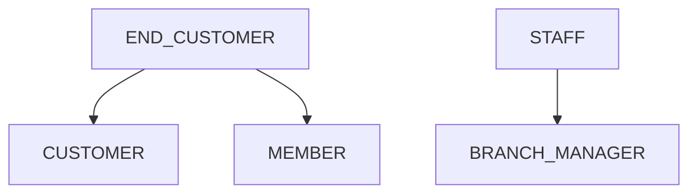
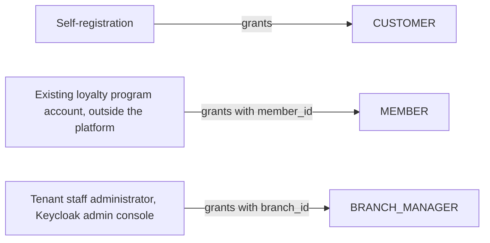
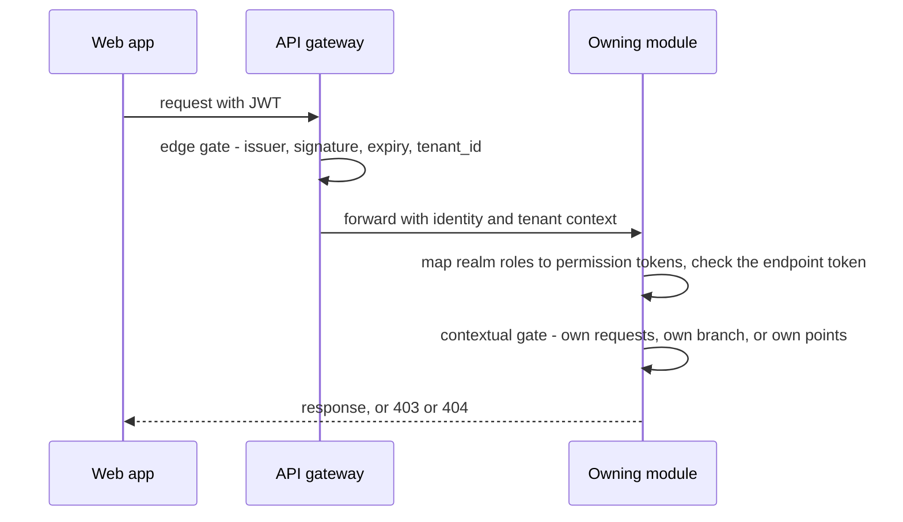

<!--
CHUNK: 12
TITLE: Centralized User Roles & Authorities (Platform-Wide)
PROJECT: Refunds Platform
VERSION: 1.3
DEPENDS_ON: 03, 07, 09 (+ per-service chunks 13a, 13b, 13c, 13d for per-service authorization notes)
PART OF: SDD - Refunds Platform
PURPOSE: Single platform-wide reference for user types, roles, sub-roles, and their authorities - who can do what, who can create whom, which services each role touches, and how a role resolves to an allowed action at request time. Consolidates the BRD's Users & Use Cases Matrix and the per-service authorization notes into one canonical catalogue. Companion reference to the Centralized Event Hub (chunk 10).
CONSISTENCY_RULE: Role names, permission tokens, and per-service authorization notes in the 13x chunks MUST match this catalogue verbatim. Divergences are flagged here (see the drift register), never silently reconciled.
-->

# 16. Centralized User Roles & Authorities (Platform-Wide)

> **What this chunk is.** The one place that answers: what user types exist, which roles and sub-roles they break into, what each role is allowed to do, who may create or invite whom, and which services each role interacts with. Downstream, the LLD and the identity/authorization implementation seed from this catalogue - the key goal is that authorization behaves identically across every service.

---

## 16.1 Business Overview

All users live in the tenant plane of one retailer (one tenant today, §3 assumption 7). End customers use the web app for two things: as customers they request and follow refunds for their branch purchases ([REFUNDS 04 § Personas / Actors](../brd-refunds-portal/04-scope-and-personas.md#personas--actors)), and as loyalty members they see their points ([LOYALTY 04 § Personas / Actors](../brd-loyalty-points/04-scope-and-personas.md#personas--actors)); one person may be both. Staff are branch managers, each responsible for the refunds of one branch. Neither BRD names a platform operator. Customer care, head office, and the tenant staff administrator have no platform role in this release: their roles are open in the BRDs ([REFUNDS 13 § OI-13](../brd-refunds-portal/13-open-items-and-clarifications.md#oi-13-customer-care-head-office-and-staff-administration), [LOYALTY 13 § OI-14](../brd-loyalty-points/13-open-items-and-clarifications.md#oi-14-who-receives-and-upholds-balance-complaints), REFUNDS OI-08), and until they are decided nobody outside these roles sees a request or a ledger in the web app; break-glass (§20.3) is not a support channel.

## 16.2 Resolution Model - How a Role Becomes an Allowed Action

1. **Identity:** Keycloak issues a JWT with realm roles and the claims `sub`, `tenant_id`, `branch_id` (branch managers), `own_customer_id` (a branch manager's own customer account, when they have one), and `member_id` (members) (ADR-07). Each tenant's web app runs on its own host with its own OIDC client in the realm; the registration flow stores that client's tenant as the account attribute `tenant_id`, mapped into the token; staff provisioning sets it for staff (§16.6). An account belongs to exactly one tenant in this release. For a member's existing loyalty program account, how `tenant_id` and `member_id` reach the token depends on §3 assumption 3 (LOYALTY TD-27): if it is a realm account, it gets them like any account (`member_id` from an account attribute holding the POS Records member number); if the realm brokers the sign-in to the loyalty program's identity provider, `tenant_id` comes from the host's client and `member_id` from the provider's member number at sign-in, and the brokered identity must be linked to the person's customer account when they have one, so that one person holding both roles (§7.1) has one `sub`. The integration row, contract, and member-number mapping for the second case are added to §12 and §15 when TD-27 is answered.
2. **Edge gate (API gateway):** validates issuer, signature, audience, and expiry, rejects a token without `tenant_id`, and forwards the request with the tenant context. The gateway also rejects a token whose `tenant_id` differs from the tenant of the requesting host. Its logs and spans name the tenant only as `tenant_ref`, never by host name (§11.4).
3. **Permission lookup (owning module):** the module maps the caller's realm roles to the permission tokens of §16.11 and checks the token its endpoint requires (§17.X List of APIs); a missing token answers 403 `FORBIDDEN` (ADR-08).
4. **Contextual gates (owning module, domain layer):** own requests (`customer_id` equals `sub`), own branch (`branchId` in the path equals the `branch_id` claim), own points (`member_id` claim). A resource of another customer or member answers 404 `NOT_FOUND`; another branch answers 403 `FORBIDDEN`. Data copied from one context into another carries only the attributes the contract lets leave (§14.10) and is shown under the receiving context's gate; refund details on a member's points movement are the open REFUNDS OI-32 and LOYALTY OI-18.

## 16.3 User Types (Tier 1)

| User type | Tenancy plane | Identity source | Description |
|---|---|---|---|
| `END_CUSTOMER` | Tenant (end customer) | Keycloak realm: a self-registered account for `CUSTOMER`; for `MEMBER`, the member's existing loyalty program account, a realm account or one brokered from the loyalty program (§3 assumption 3, §16.2 step 1) | A retail customer; holds `CUSTOMER`, `MEMBER`, or both. |
| `STAFF` | Tenant (company staff) | Keycloak realm, account provisioned for the tenant | A branch employee; holds `BRANCH_MANAGER`. |

No service user type exists: no deployable calls another over HTTP (ADR-05), so no client-credentials identity holds a permission token. A `STAFF` account never holds `CUSTOMER` or `MEMBER`; staff use a separate customer account, which the staff administrator records on the staff account as `own_customer_id` (§16.6), so the decision guard of §17.1 refuses a decision on it ([REFUNDS/UC-04](../brd-refunds-portal/06b-use-cases-branch-manager.md#uc-04-approve--reject-refund) BR-4).

## 16.4 Role Catalogue - Authorities & Related Services

### 16.4.1 END_CUSTOMER Roles

| Role | Scope | Core authorities | Related services |
|---|---|---|---|
| `CUSTOMER` | Own requests | Look up a receipt, submit a refund request, list and read own requests, cancel an own Submitted request | refund-service (notification-service sends this role's messages) |
| `MEMBER` | Own points | Read own balance, history, and movement detail | loyalty-service |

### 16.4.2 STAFF Roles

| Sub-role | Scope | Core authorities | Related services |
|---|---|---|---|
| `BRANCH_MANAGER` | Own branch | List and read the branch's requests, approve in full or in part, reject with a reason, read the daily branch report | refund-service |

### 16.4.3 Platform Plane (operator - outside tenant tenancy)

Not applicable for this release: neither BRD names a platform operator role.

## 16.5 Capability Matrix (canonical)

| Capability | `CUSTOMER` | `MEMBER` | `BRANCH_MANAGER` |
|---|---|---|---|
| Look up a receipt and request a refund | Yes¹ | - | - |
| Track own refund requests | Yes¹ | - | - |
| Cancel a Submitted request | Yes¹ | - | - |
| See the branch's requests and decide on them | - | - | Yes² |
| See the daily branch refund report | - | - | Yes² |
| View points balance and history | - | Yes³ | - |

¹ Own requests only ([REFUNDS/UC-02](../brd-refunds-portal/06a-use-cases-customer.md#uc-02-track-refund-status-web-and-mobile) BR-1: own requests only; REFUNDS/NFR-04).
² Own branch only (footnote 1 of [REFUNDS 07 § Users & Use Cases Matrix](../brd-refunds-portal/07-users-use-cases-matrix.md#users--use-cases-matrix)).
³ Own points only (footnote (1) of [LOYALTY 07 § Users & Use Cases Matrix](../brd-loyalty-points/07-users-use-cases-matrix.md#users--use-cases-matrix)).

## 16.6 Grant / Invitation Authority (who can create whom)

| Grantor role | May create / invite | Constraints |
|---|---|---|
| The person, by self-registration | `CUSTOMER` | Email address verified at registration; mobile number optional ([REFUNDS 04 § In Scope](../brd-refunds-portal/04-scope-and-personas.md#in-scope)). One account per person (§3 assumption 1). |
| The member's existing loyalty program account ([LOYALTY 02 § Dependencies](../brd-loyalty-points/02-glossary-assumptions-facts.md#dependencies)); joining the program is outside the platform ([LOYALTY 04 § Out of Scope](../brd-loyalty-points/04-scope-and-personas.md#out-of-scope)) | `MEMBER` | Carries the member number into the `member_id` claim, in the form POS Records reports it (§3 assumption 3; how, §16.2 step 1). |
| Tenant staff administrator (Keycloak realm administration, outside the platform's web app) | `BRANCH_MANAGER` | Exactly one branch per account (§3 assumption 2). Creates a `STAFF` account and sets, together, the `tenant_id` and `branch_id` attributes (the branch identifier taken from the POS Records list, §3 assumption 2) and the `BRANCH_MANAGER` realm role; never gives a `STAFF` account `CUSTOMER` or `MEMBER` (§16.3); records the staff member's own customer account, which staff declare when their account is created or when they open one later, as the `own_customer_id` attribute; a change applies at the next token refresh (§16.8). An administrator manages only its own tenant's staff accounts. |

## 16.7 Role → Related-Services Matrix (platform-wide)

| Role | refund-service | payout-service | notification-service | loyalty-service |
|---|---|---|---|---|
| `CUSTOMER` | write | - | - | - |
| `MEMBER` | - | - | - | read |
| `BRANCH_MANAGER` | write | - | - | - |

## 16.8 Lifecycle, Scope & Revocation Rules

1. **Grant:** `CUSTOMER` at self-registration; `MEMBER` when the member's existing loyalty program account carries the `member_id` claim (a realm account or a brokered one, §16.2 step 1); `BRANCH_MANAGER` when the role and one branch are assigned (§16.6).
2. **Change:** a branch manager moved to another branch gets the new `branch_id` claim at the next token refresh; requests stay with their branch, not with the manager.
3. **Suspension / revocation:** disabling an account or removing a role takes effect at the next token refresh (token lifetimes per ADR-07). A revoked customer's Submitted request stays and can still be decided and paid; a revoked branch manager's past decisions stay.
4. **Erasure:** follows the erasure paths of §17.1 Compliance (refund records and contact details) and §17.4 Compliance (a member's ledger): operations jobs under the §20.3 break-glass rule, with no role or endpoint.

## 16.9 Diagrams

### 16.9.1 Role Taxonomy (user types → roles → sub-roles)

**Figure 11: Role taxonomy**

**Summary:** End customers hold the `CUSTOMER` role, the `MEMBER` role, or both; staff hold the `BRANCH_MANAGER` role.

### 16.9.2 Grant / Invitation Authority (who may create whom)

**Figure 12: Grant authority**

**Summary:** Customers register themselves, a member's existing loyalty program account makes them a member, and branch managers are provisioned with their branch by the tenant staff administrator in the Keycloak realm administration, outside the platform (§16.6).

### 16.9.3 Per-Request Authorization (how a role yields a decision)

**Figure 13: Per-request authorization**

**Summary:** The gateway only authenticates and resolves the tenant; the owning module checks the permission token and the owner, branch, or member scope, and answers 403 for a missing token or another branch and 404 for another person's resource.

## 16.10 Traceability

| Capability / rule | Source (BRD UC / matrix row / ADR / 13x chunk) |
|---|---|
| Look up a receipt and request a refund | [REFUNDS/UC-01](../brd-refunds-portal/06a-use-cases-customer.md#uc-01-request-a-refund); matrix row in [REFUNDS 07](../brd-refunds-portal/07-users-use-cases-matrix.md#users--use-cases-matrix); §17.1 |
| Track own refund requests | [REFUNDS/UC-02](../brd-refunds-portal/06a-use-cases-customer.md#uc-02-track-refund-status-web-and-mobile); matrix row in [REFUNDS 07](../brd-refunds-portal/07-users-use-cases-matrix.md#users--use-cases-matrix); §17.1 |
| Cancel a Submitted request | [REFUNDS/UC-03](../brd-refunds-portal/06a-use-cases-customer.md#uc-03-cancel-a-refund-request); matrix row in [REFUNDS 07](../brd-refunds-portal/07-users-use-cases-matrix.md#users--use-cases-matrix); §17.1 |
| See the branch's requests and decide on them | [REFUNDS/UC-04](../brd-refunds-portal/06b-use-cases-branch-manager.md#uc-04-approve--reject-refund); matrix row and footnote 1 in [REFUNDS 07](../brd-refunds-portal/07-users-use-cases-matrix.md#users--use-cases-matrix); §17.1 |
| See the daily branch refund report | [REFUNDS/UC-06](../brd-refunds-portal/06b-use-cases-branch-manager.md#uc-06-view-branch-refund-report); matrix row and footnote 1 in [REFUNDS 07](../brd-refunds-portal/07-users-use-cases-matrix.md#users--use-cases-matrix); §17.1 |
| View points balance and history | [LOYALTY/UC-01](../brd-loyalty-points/06a-use-cases-member.md#uc-01-view-points-balance), [LOYALTY/UC-02](../brd-loyalty-points/06a-use-cases-member.md#uc-02-view-points-history); matrix rows in [LOYALTY 07](../brd-loyalty-points/07-users-use-cases-matrix.md#users--use-cases-matrix); §17.4 |
| Checks run in the owning module | ADR-08 |

## 16.11 Permission × Role Matrix (platform-wide)

| Permission token | `CUSTOMER` | `MEMBER` | `BRANCH_MANAGER` |
|---|---|---|---|
| `refund.receipt.read` | ✓ | - | - |
| `refund.request.create` | ✓ | - | - |
| `refund.request.read-own` | ✓¹ | - | - |
| `refund.request.cancel-own` | ✓¹ | - | - |
| `refund.request.read-branch` | - | - | ✓² |
| `refund.request.decide` | - | - | ✓² |
| `refund.report.read-branch` | - | - | ✓² |
| `loyalty.points.read-own` | - | ✓³ | - |

¹ Own requests only. ² Own branch only. ³ Own points only (the footnotes of §16.5).

## 16.12 Implementation Seed & Reconciliation

### 16.12.1 Seed Strategy

The realm roles `CUSTOMER`, `MEMBER`, and `BRANCH_MANAGER` are defined in the versioned Keycloak realm configuration. The role-to-token map of §16.11 is seeded by a Flyway migration in each owning module (`refund`: seven tokens; `loyalty`: one token). A new token needs, in one change: a migration, a §16.11 row, and the Permission token cell of the endpoint in its §17.X List of APIs.

### 16.12.2 Per-Role Action Counts (drift baseline)

| Role | Seeded permission count |
|---|---|
| `CUSTOMER` | 4 |
| `MEMBER` | 1 |
| `BRANCH_MANAGER` | 3 |

### 16.12.3 Drift & Reconciliation Register

No divergence found between this chunk, the BRD matrices, and the authorization notes and Lists of APIs of §17.1 to §17.4.

<!-- MASTER: refunds-platform-sdd-master.md | PREV: 11-api-contracts.md | NEXT: 13a-service-refund.md -->
