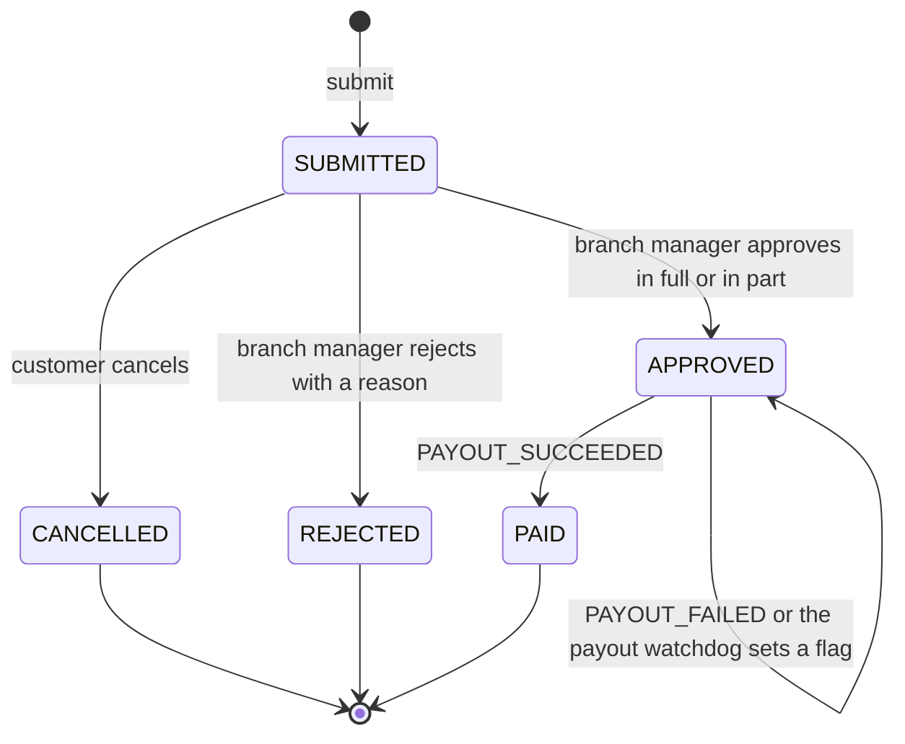
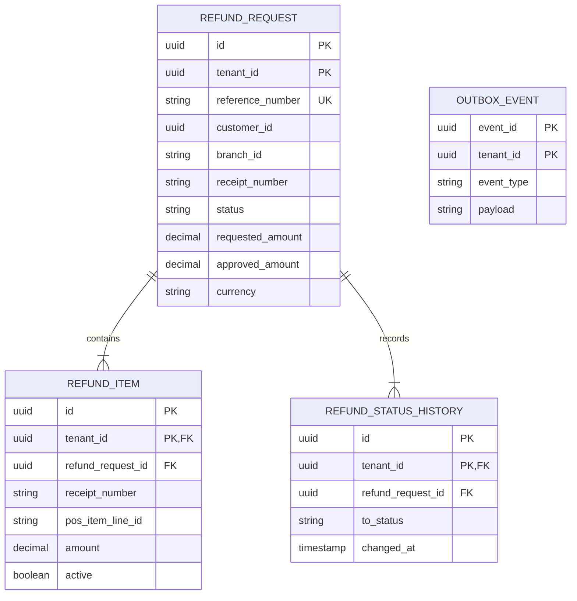
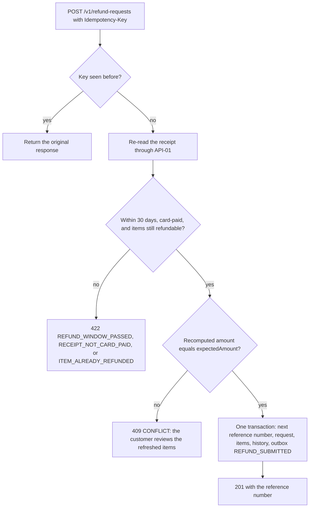
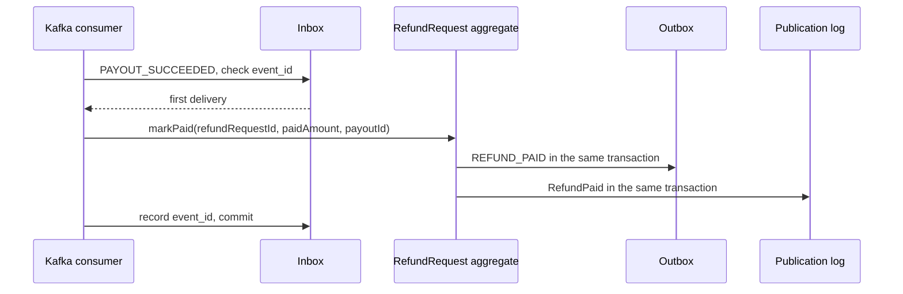

<!--
CHUNK: 13a
TITLE: Detailed Service Spec - refund-service
PROJECT: Refunds Platform
VERSION: 1.3
DEPENDS_ON: 09, 07, 10 (event hub - topic names, event names, and payload contracts must match chunk 10 verbatim), 11 (API contracts - integration endpoints carry their API ID and match chunk 11 verbatim), 12 (roles - permission tokens match chunk 12 verbatim)
PART OF: SDD - Refunds Platform
-->

# 17. Detailed Service Specs

---

## 17.1 refund-service

### What

refund-service is the refund bounded context: a module of the `refunds-platform-core` deployable (ADR-01) that owns a refund request from the receipt lookup to the confirmed payout. It realises the REFUNDS lifecycle ([REFUNDS 03 § Refund request lifecycle](../brd-refunds-portal/03-definitions-and-domain-concepts.md#refund-request-lifecycle)) and the branch ownership rule ([REFUNDS 03 § Branch ownership](../brd-refunds-portal/03-definitions-and-domain-concepts.md#branch-ownership)).

### Boundaries

- **Owns:** the `RefundRequest` aggregate (items, amounts, reasons, decision, reference number, status history, payout-failing flag), the per-tenant reference number counter, the branch report query, and the module's outbox and inbox.
- **Does not own:** payouts and their attempts (payout-service), customer messages (notification-service), points (loyalty-service), receipts and purchases (POS Records), identities and branch assignment (Keycloak).
- **Upstream consumers:** the web app through the API gateway; payout-service through `PAYOUT_SUCCEEDED` and `PAYOUT_FAILED`.
- **Downstream dependencies:** POS Records (API-01); the topic `refunds-platform-refund-events`; loyalty-service through the in-process `RefundPaid` event.

### Input

| Type | Source | Description |
|------|--------|-------------|
| REST | Web app, customer area | Receipt lookup, submit, list, detail, and cancel (List of APIs rows 1-5). |
| REST | Web app, branch manager area | Branch queue, branch request detail, decision, and daily branch report (rows 6-9). |
| Event | payout-service, `refunds-platform-payout-events` | `PAYOUT_SUCCEEDED` and `PAYOUT_FAILED`. |
| Schedule | `payout-watchdog` | Flags approved requests whose payout outcome is overdue (Business Logic). |
| Operations job | `refund-contact-erasure` | Clears one customer's contact details on request (Compliance). |

### Business Logic

refund-service applies each command to the `RefundRequest` aggregate inside one transaction that also writes the status history row and, for every state change, the outbox row of the matching integration event (§14.5). Optimistic locking on `version` settles races between a customer's cancellation and a branch manager's decision.

- **Receipt lookup** ([REFUNDS/UC-01](../brd-refunds-portal/06a-use-cases-customer.md#uc-01-request-a-refund) steps 1-2): normalises the receipt number the customer entered (§15.3 Receipt number form), calls POS Records through the `PosReceiptPort` (API-01), and builds the refundable items view; from then on the request uses the receipt number POS Records returned. The window check counts calendar days in the tenant's time zone (§11.2) from the POS purchase date (BR-1: refund only within 30 days of purchase; E1 answers `REFUND_WINDOW_PASSED`). A receipt with no card payment answers 422 `RECEIPT_NOT_CARD_PAID` ('this purchase can be refunded at the branch'); for a receipt paid partly by card, the refundable amount is capped at the card-paid amount. Items already on an active request (Submitted, Approved, or Paid) are returned with `refundable = false` (A1; BR-2: an item is refunded only once). An unknown receipt answers `RECEIPT_NOT_FOUND` (E2).
- **Submit** ([REFUNDS/UC-01](../brd-refunds-portal/06a-use-cases-customer.md#uc-01-request-a-refund) steps 3-6): re-reads the receipt and re-checks the window and item availability. The web app shows the sum of the selected items' amounts from `RefundableItemsView` (step 4); `SubmitRefundRequest` carries it as `expectedAmount`; refund-service recomputes the amount and answers 409 `CONFLICT` when it differs, so the customer reviews the refreshed items. It then assigns the next reference number for the tenant, captures the customer's contact details from the token (§3 assumption 4), stores `SUBMITTED`, and writes `REFUND_SUBMITTED` to the outbox (step 6; AC-1: recorded as Submitted with a reference number). The `Idempotency-Key` makes a retried submission return the same request. A partial unique index on active items (tenant, receipt number, POS item line) enforces BR-2 under concurrency. A request refunds whole receipt lines; refunding part of a multi-unit line, items bought in a promotion, and the other rules of Store refund policy v3 are [REFUNDS 13 § OI-24](../brd-refunds-portal/13-open-items-and-clarifications.md#oi-24-the-store-refund-policy-rules-the-portal-applies), open.
- **Track** ([REFUNDS/UC-02](../brd-refunds-portal/06a-use-cases-customer.md#uc-02-track-refund-status-web-and-mobile) steps 1-4): lists the caller's requests (reference number, amount with currency, status) with server-side pagination, and returns one request with its status history and, when rejected, the reason (AC-1: an approved request shows Approved with its date). An empty page realises A1. BR-1 (customers see only their own requests) is the `customer_id = token subject` filter.
- **Cancel** ([REFUNDS/UC-03](../brd-refunds-portal/06a-use-cases-customer.md#uc-03-cancel-a-refund-request) steps 2-5): allowed only from `SUBMITTED` (BR-1: only Submitted requests can be cancelled); moves to `CANCELLED`, releases the items, and writes `REFUND_CANCELLED` (step 5: the customer is told by email). A request decided in the meantime answers `REFUND_ALREADY_DECIDED` (E1).
- **Branch queue** ([REFUNDS/UC-04](../brd-refunds-portal/06b-use-cases-branch-manager.md#uc-04-approve--reject-refund) steps 1-2): lists the branch's `SUBMITTED` requests oldest first with amount and reason; the `branchId` path parameter must equal the caller's `branch_id` claim (BR-1: own branch only). The same query with `payoutFailing=true` lists the approved requests whose payout still fails (E1).
- **Decide** ([REFUNDS/UC-04](../brd-refunds-portal/06b-use-cases-branch-manager.md#uc-04-approve--reject-refund) steps 3-6, A1, A2): approve in full, approve in part (A1: the amount must be more than 0 and less than the requested amount, BR-2: partial amount range, and a reason is required), or reject (A2: a reason is required, BR-3: a rejection always has a reason). Approval moves to `APPROVED` and writes `REFUND_APPROVED` (step 6: the payout is sent through payout-service, and the customer is told the approved amount and, when partial, the reason); rejection moves to `REJECTED`, releases the items, and writes `REFUND_REJECTED` (A2: the customer is told the reason). A decision whose caller `sub`, or whose `own_customer_id` claim (the staff member's own customer account, recorded by the staff administrator, §16.6), equals the request's `customer_id` answers 403 `FORBIDDEN` (BR-4: a branch manager never decides on a refund request they made as a customer).
- **Payout outcome** ([REFUNDS/UC-04](../brd-refunds-portal/06b-use-cases-branch-manager.md#uc-04-approve--reject-refund) step 7, E1): `PAYOUT_SUCCEEDED` moves `APPROVED` to `PAID`, sets `paid_at` to the time of this transition (the one paid time, Tables Design), stores the provider's reference as `payout_reference`, and, in the same transaction, writes `REFUND_PAID` to the outbox and `RefundPaid` to the publication log (step 7: the customer is told by email and SMS, with the payout reference and that the money can take some days to appear on the card; AC-1: payout sent and customer told). `PAYOUT_FAILED` keeps the request `APPROVED`, sets `payout_failing_since`, which puts it on the branch manager's payout-failing list, and in the same transaction writes `REFUND_PAYOUT_DELAYED` to the outbox, so the customer is told by email and SMS that the payout is delayed and sees it on the request detail (E1; AC-2: the branch manager and the customer are told when the payout still fails one day after the approval; [REFUNDS/UC-02](../brd-refunds-portal/06a-use-cases-customer.md#uc-02-track-refund-status-web-and-mobile) step 4: the delay is shown). The branch manager is told in the portal, the one place [REFUNDS 01 § Business Objectives](../brd-refunds-portal/01-executive-summary-and-context.md#business-objectives) objective 3 gives them: the request is listed by the branch queue with `payoutFailing=true` and flagged on its detail (`payoutFailingSince`, List of APIs), and the branch area shows the number of payout-failing requests when it opens. No email or SMS goes to staff: the notification partner carries customer messages only ([REFUNDS 08 § Integrations](../brd-refunds-portal/08-integrations.md#integrations)).
- **Branch report** ([REFUNDS/UC-06](../brd-refunds-portal/06b-use-cases-branch-manager.md#uc-06-view-branch-refund-report) steps 1-3, A1; [REFUNDS 09 § Reporting / Analytics](../brd-refunds-portal/09-reporting-and-analytics.md#reporting--analytics)): for one branch and one day, chosen by the branch manager on demand (the day in the tenant's time zone, §11.2), computed from the module's own tables. Counting rule (step 3): `requestsByStatus` counts the requests submitted that day (`created_at`) by their current status; `amountPaid` sums `paid_amount` of the requests paid that day (`paid_at`); `averageTimeToDecision` averages `decided_at` minus `created_at` over the requests decided that day (`decided_at`) and is absent when none was (A1). The `branchId` path parameter must equal the caller's `branch_id` claim (BR-1: own branch only).
- **Head-office report** ([REFUNDS 09 § Reporting / Analytics](../brd-refunds-portal/09-reporting-and-analytics.md#reporting--analytics), [REFUNDS 01 § Business Objectives](../brd-refunds-portal/01-executive-summary-and-context.md#business-objectives) Objective 1): monthly, per branch and in total, requests per status, the average time from Submitted to Paid of the requests paid in the month, the average time to decision, approved and paid amounts, and delayed payouts, computed from the module's own tables like the branch report. Its endpoint, permission token, and role wait for the head-office role of REFUNDS OI-13.
- **Payout watchdog** (REFUNDS/NFR-01): a scheduled job flags every `APPROVED` request with no payout outcome (not `PAID`, no `payout_failing_since`) once the retry window plus one hour has passed since the approval (`decided_at`). The window is the tenant setting `payoutRetryWindow` (§11.2) that payout-service also reads, counted from the same approval (§17.2 Constraints), so both deployables run one clock. The job sets `payout_outcome_overdue_since`, shows it on the branch manager's payout-failing list, and counts it in the gauge `refund_payout_outcome_overdue_requests`, alerted above zero (§11.4).

**State machine:**

**Figure 14: refund-service - RefundRequest state machine**

**Summary:** A request starts `SUBMITTED` and ends `CANCELLED`, `REJECTED`, or `PAID`. Only the customer cancels, only the branch manager of its branch decides, and only payout events move an approved request; a failed or overdue payout keeps it `APPROVED` with a flag.

### Output

| Type | Destination | Description |
|------|-------------|-------------|
| REST response | Web app | Refundable items, requests, histories, decisions, and the branch report. |
| Event | `refunds-platform-refund-events` | `REFUND_SUBMITTED`, `REFUND_CANCELLED`, `REFUND_APPROVED`, `REFUND_REJECTED`, `REFUND_PAYOUT_DELAYED`, `REFUND_PAID` (§14.5.1). |
| In-process domain event | loyalty-service | `RefundPaid` (§14.10). |

### Integrations

| Integration | Direction | Protocol | Purpose | Contract | Failure Handling |
|-------------|-----------|----------|---------|----------|------------------|
| POS Records | Outbound, sync | HTTPS REST | Look up a receipt and its items | API-01 (§15) | Circuit breaker; `RECEIPT_LOOKUP_UNAVAILABLE` (503) asks the customer to try again later; nothing is recorded. |
| Kafka | Outbound, async | Kafka | Publish refund lifecycle events | `REFUND_SUBMITTED`, `REFUND_CANCELLED`, `REFUND_APPROVED`, `REFUND_REJECTED`, `REFUND_PAYOUT_DELAYED`, `REFUND_PAID` (§14) | Outbox relay retries until the broker acknowledges; outbox backlog age is alerted (§11.4). |
| Kafka | Inbound, async | Kafka | Receive payout outcomes | `PAYOUT_SUCCEEDED`, `PAYOUT_FAILED` (§14) | Inbox dedup; invalid transitions and unreadable messages go to the DLQ (§14.6). |
| loyalty-service | Outbound, in process | Domain event | Hand paid refunds to the points take-back | `RefundPaid` (§14.10) | Publication log replays the event until the listener completes. |

### DB Modeling

#### Entity Relationship

**Figure 15: refund-service - Entity relationship**

**Summary:** A refund request contains its selected items and records every status change; the outbox sits beside the aggregate in the `refund` schema, so every state change and its integration event commit together, while the in-process publication log lives in the core's `core_events` schema (§11.1).

#### Tables Design

| Table | Column | Type | Constraints | Notes |
|-------|--------|------|-------------|-------|
| `refund_request` | `id` | uuid | PK (`tenant_id`, `id`) | UUIDv7; every primary and foreign key leads with `tenant_id` (§11.1) |
| `refund_request` | `tenant_id` | uuid | NOT NULL | Leading column of every index |
| `refund_request` | `reference_number` | varchar(13) | UNIQUE (`tenant_id`, `reference_number`) | `RF-` and 10 digits |
| `refund_request` | `customer_id` | uuid | NOT NULL | Token subject of the customer |
| `refund_request` | `customer_email`, `customer_mobile` | text | NULL allowed | `pii`; captured at submission |
| `refund_request` | `branch_id` | varchar | NOT NULL | Branch of the purchase, from POS Records, the source of truth for branch identifiers; the `branch_id` claim carries the same value (§3 assumption 2) |
| `refund_request` | `status` | varchar | CHECK in the five states | State machine above |
| `refund_request` | `requested_amount`, `approved_amount` | numeric(19,4) | approved amount > 0 and <= requested amount | With `currency` char(3) |
| `refund_request` | `payout_failing_since` | timestamptz | NULL allowed | Set by `PAYOUT_FAILED` |
| `refund_request` | `payout_outcome_overdue_since` | timestamptz | NULL allowed | Set by the payout watchdog |
| `refund_request` | `receipt_number` | varchar | NOT NULL | The receipt number API-01 returned for the submission, in the one form of §15.3 Receipt number form (not the value the customer typed); carried in `REFUND_APPROVED` and `RefundPaid` |
| `refund_request` | `request_reason` | text | NOT NULL | The customer's reason ([REFUNDS/UC-01](../brd-refunds-portal/06a-use-cases-customer.md#uc-01-request-a-refund) step 3; shown at [REFUNDS/UC-04](../brd-refunds-portal/06b-use-cases-branch-manager.md#uc-04-approve--reject-refund) step 2) |
| `refund_request` | `decided_at` | timestamptz | NULL until decided | Set with the `APPROVED` or `REJECTED` transition; the report's time to decision |
| `refund_request` | `paid_amount`, `paid_at`, `payout_id` | numeric(19,4), timestamptz, uuid | NULL until `PAID` | `paid_amount` and `payout_id` from `PAYOUT_SUCCEEDED` (`paidAmount`, envelope `aggregate_id`). `paid_at` is the platform's one paid time: the time of the PAID transition, taken once in the PAID transaction; the same value is the PAID row's `changed_at` in `refund_status_history`, the `REFUND_PAID` envelope `occurred_at`, and `RefundPaidEvent.paidAt`, so it is when the Refunds Portal reports the refund as paid (LOYALTY/NFR-02, LOYALTY OI-02) |
| `refund_request` | `payout_reference` | varchar | NULL until `PAID` | The payment provider's reference of the payout (`providerReference` of `PAYOUT_SUCCEEDED`), shown to the customer and carried in `REFUND_PAID` ([REFUNDS/UC-04](../brd-refunds-portal/06b-use-cases-branch-manager.md#uc-04-approve--reject-refund) step 7) |
| `refund_request` | `closed_at` | timestamptz | NULL until final | Set on `CANCELLED`, `REJECTED`, or `PAID`; the retention clocks start here (Retention Policy) |
| `refund_request` | auditing columns | per §11.1 | `version` for optimistic locking | `created_at` is the submission time |
| `refund_item` | `id`, `refund_request_id` | uuid, uuid | PK (`tenant_id`, `id`); FK (`tenant_id`, `refund_request_id`) to `refund_request` | |
| `refund_item` | `tenant_id`, `receipt_number` | uuid, varchar | NOT NULL | Copied from the request, so the partial unique index below stays in one table |
| `refund_item` | `pos_item_line_id` | varchar | Partial UNIQUE (`tenant_id`, `receipt_number`, `pos_item_line_id`) where `active` | [REFUNDS/UC-01](../brd-refunds-portal/06a-use-cases-customer.md#uc-01-request-a-refund) BR-2: one refund per item |
| `refund_item` | `description`, `amount` | varchar, numeric(19,4) | NOT NULL; `amount` > 0 | From API-01 at submission, in the request currency |
| `refund_item` | `active` | boolean | NOT NULL | True while the request is `SUBMITTED`, `APPROVED`, or `PAID`; false once `CANCELLED` or `REJECTED` (the item is released) |
| `refund_status_history` | `id`, `tenant_id`, `refund_request_id`, `from_status` | uuid, uuid, uuid, varchar | PK (`tenant_id`, `id`); NOT NULL; FK (`tenant_id`, `refund_request_id`) to `refund_request`; NULL on the first row | `tenant_id` as on every table (§11.2) |
| `refund_status_history` | `to_status`, `reason`, `changed_at`, `changed_by` | varchar, text, timestamptz, varchar | NOT NULL except `reason` | One row per transition |
| `refund_reference_counter` | `tenant_id`, `last_value` | uuid, bigint | PK `tenant_id`; NOT NULL | Incremented under its row lock in the submit transaction; the reference number is `RF-` and `last_value` padded to 10 digits |
| `outbox_event` | `event_id`, `tenant_id`, `topic`, `payload`, `published_at` | uuid, uuid, varchar, jsonb, timestamptz | PK (`tenant_id`, `event_id`) | Relay publishes after commit |
| `outbox_event` | `aggregate_id`, `event_type`, `message_key`, `occurred_at`, `traceparent` | uuid, varchar, uuid, timestamptz, varchar | NOT NULL except `traceparent` | `payload` holds the whole §14.3 envelope; `message_key` is the `refundRequestId` (§14.4); the relay writes the §14.3 Wire format headers from the row and the envelope |
| `inbox_message` | `tenant_id`, `consumer`, `event_id`, `processed_at` | uuid, varchar, uuid, timestamptz | PK (`tenant_id`, `consumer`, `event_id`) | Dedup of payout events |

Indexes (each leads with `tenant_id`, §11.1):

- `refund_request (tenant_id, customer_id, created_at)` - the customer's list ([REFUNDS/UC-02](../brd-refunds-portal/06a-use-cases-customer.md#uc-02-track-refund-status-web-and-mobile)).
- `refund_request (tenant_id, branch_id, status, created_at)` - the branch queue, oldest first.
- `refund_request (tenant_id, branch_id, created_at)` where `status = 'APPROVED'` and `payout_failing_since` or `payout_outcome_overdue_since` is set - the payout-failing list.
- `refund_request (tenant_id, decided_at)` where `status = 'APPROVED'` and both flags are null - the payout watchdog.
- `refund_request (tenant_id, branch_id, decided_at)` and `(tenant_id, branch_id, paid_at)` - the daily branch report.
- `refund_request (tenant_id, closed_at)` - the retention jobs.
- `refund_item (tenant_id, refund_request_id)`; `refund_status_history (tenant_id, refund_request_id, changed_at)`.
- `outbox_event (tenant_id, occurred_at)` where `published_at` is null - the relay; `outbox_event (tenant_id, published_at)` and `inbox_message (tenant_id, processed_at)` - the outbox and inbox purges.

Column lengths, check-constraint wording, and any index a query plan shows to be missing are set in the child LLD's data section; they never change a key, a uniqueness rule, or a tenant rule above. The `Idempotency-Key` store behind the POST endpoints (table, key scope per caller, retention) is designed there too.

#### Migration Strategy

- **Tool:** Flyway, versioned SQL files in the module's own migration folder (§11.1).
- **Backward compatibility:** additive changes; expand-contract for renames and type changes across two releases.
- **Data backfill:** batched backfill jobs per tenant, run after the expand step.
- **Rollback:** forward-fix migrations; the application rollback keeps working against the expanded schema.

#### Retention Policy

- `refund_request`, `refund_item`, `refund_status_history`: deleted by the retention job when the tenant setting `refundRecordRetention` (§11.2) has passed since `closed_at`; default 10 years. A request that has not closed is kept.
- `customer_email`, `customer_mobile`: set to NULL by the retention job when the tenant setting `contactDetailsRetention` (§11.2) has passed since `closed_at`; default 30 days. No customer message is sent after a request closes, and notification-service holds its own copy until each message is final (§17.3).
- `refund_reference_counter`: kept while the tenant exists.
- Both settings belong to the REFUNDS owner; a change is a Helm values change.
- `outbox_event`: published rows are purged after 7 days. `inbox_message`: processed rows are purged once older than the dedup window (§14.6 rule 2: topic retention plus DLQ retention plus replay window); until the §6 retention and the §20.1.3 replay window are set, they are kept.

#### Archival

- **Cold storage:** none in this release; the §6 object storage row is Not applicable.
- **Format:** not applicable.
- **Schedule:** not applicable.
- **Restore SLA:** not applicable; database backups follow the §6 PostgreSQL row.

#### Data Encryption

- **At rest:** per §11.6.
- **In transit:** TLS per §11.6.
- **Key management:** per §11.6.
- **PII columns:** `customer_email`, `customer_mobile`; masked in non-production data and never logged (§11.4).

### Multi-Tenancy Specifications

- **Strategy override:** none; shared schema with `tenant_id` (§11.2).
- **Tenant filter:** every query filters by the request's tenant; branch manager queries also filter by the `branch_id` claim, customer queries by the token subject.
- **Cross-tenant queries:** forbidden; the branch report is per tenant and per branch.

### API Standards

- **Style:** REST with JSON (ADR-04).
- **Versioning:** URI prefix `/v1` (§15.1).
- **Authentication:** Keycloak JWT, validated at the gateway and in the core (ADR-07).
- **Idempotency:** `Idempotency-Key` required on every POST below that changes state; a replay returns the original response. `POST /v1/receipt-lookups` is a read that changes no state and takes none.
- **Pagination:** server-side, `page`, `size`, and `sort` query parameters on list endpoints.
- **Error envelope:** per the §15.1 error model (RFC 9457 with `errorCode`).

#### List of APIs (Swagger-friendly)

| Method | Path | Summary | Request Body | Response | Permission token (§16) | API ID (§15) |
|--------|------|---------|--------------|----------|------------------------|--------------|
| POST | `/v1/receipt-lookups` | Look up a receipt and its refundable items: a read that changes no state (200, no `Idempotency-Key`); the receipt number travels in the body, never in the URL (§11.4) | `ReceiptLookupRequest` | `RefundableItemsView` | `refund.receipt.read` | - |
| POST | `/v1/refund-requests` | Submit a refund request | `SubmitRefundRequest` | `RefundRequestDetail` | `refund.request.create` | - |
| GET | `/v1/refund-requests` | List the caller's refund requests | - | `RefundRequestPage` | `refund.request.read-own` | - |
| GET | `/v1/refund-requests/{refundRequestId}` | Get one of the caller's requests with its history | - | `RefundRequestDetail` | `refund.request.read-own` | - |
| POST | `/v1/refund-requests/{refundRequestId}/cancellation` | Cancel a Submitted request | `CancelRefundRequest` | `RefundRequestDetail` | `refund.request.cancel-own` | - |
| GET | `/v1/branches/{branchId}/refund-requests` | List the branch's requests, Submitted and oldest first by default | - | `BranchRefundRequestPage` | `refund.request.read-branch` | - |
| GET | `/v1/branches/{branchId}/refund-requests/{refundRequestId}` | Get one of the branch's requests | - | `RefundRequestDetail` | `refund.request.read-branch` | - |
| POST | `/v1/branches/{branchId}/refund-requests/{refundRequestId}/decision` | Approve in full or in part, or reject with a reason | `RefundDecision` | `RefundRequestDetail` | `refund.request.decide` | - |
| GET | `/v1/branches/{branchId}/refund-report` | Daily branch refund report for one date | - | `BranchRefundReport` | `refund.report.read-branch` | - |

No other service or external system calls these endpoints, so none carries an API ID. Their DTOs carry the business fields below; the OpenAPI document (§21) adds formats, lengths, and examples.

Conventions: `Money` is `amount` (a decimal as a JSON string, for example `"50.00"`) and `currency` (ISO 4217), the fields of §14.9.0; `timestamp` is ISO-8601 UTC; `date` is an ISO-8601 date in the tenant time zone; a page is `items[]`, `page` (from 0), `size`, and `totalItems`; R required, O optional, C conditional. Responses are 201 for the submission and 200 otherwise; errors per §15.1 and Error Handling.

| DTO or query | Fields |
|--------------|--------|
| `ReceiptLookupRequest` | `receiptNumber` string R (as the customer entered it; normalised by §15.3 Receipt number form) |
| `RefundableItemsView` | `receiptNumber` string R; `branchId` string R; `purchaseDate` date R; `cardPaidAmount` Money R (the cap for a receipt paid partly by card); `items[]` R: `posItemLineId` string R, `description` string R, `amount` Money R, `refundable` bool R, `notRefundableReason` enum `ALREADY_REFUNDED` C (when `refundable` is false) |
| `SubmitRefundRequest` | `receiptNumber` string R; `posItemLineIds[]` string R (one or more, no repeats); `reason` string of 1 to 500 characters R; `expectedAmount` Money R (the amount shown at [REFUNDS/UC-01](../brd-refunds-portal/06a-use-cases-customer.md#uc-01-request-a-refund) step 4: the sum of the selected items, capped at `cardPaidAmount`) |
| `CancelRefundRequest` | No field in v1 (an empty JSON object); the confirmation of [REFUNDS/UC-03](../brd-refunds-portal/06a-use-cases-customer.md#uc-03-cancel-a-refund-request) step 3 happens in the web app |
| `RefundRequestDetail` | `refundRequestId` uuid R; `referenceNumber` string R; `status` enum of the five states R; `receiptNumber` string R; `branchId` string R; `items[]` R: `posItemLineId`, `description`, `amount`; `requestedAmount` Money R; `approvedAmount` Money C (once approved); `paidAmount` Money C (once paid); `payoutReference` string C (once paid; the reference the customer can quote to their bank, [REFUNDS/UC-02](../brd-refunds-portal/06a-use-cases-customer.md#uc-02-track-refund-status-web-and-mobile) step 4); `reason` string R; `decisionReason` string C (a partial approval or a rejection); `submittedAt` timestamp R; `history[]` R: `status`, `changedAt` timestamp, `reason` O; `payoutFailingSince` timestamp C (while the payout is delayed, [REFUNDS/UC-04](../brd-refunds-portal/06b-use-cases-branch-manager.md#uc-04-approve--reject-refund) E1; on the customer and the branch endpoints); on the branch endpoints only: `payoutOutcomeOverdueSince` timestamp C |
| `RefundRequestPage` | Page of `refundRequestId`, `referenceNumber`, `requestedAmount`, `approvedAmount` C, `status`, `submittedAt`; query `page`, `size`, `sort` (default `submittedAt` descending) |
| `BranchRefundRequestPage` | Page of `refundRequestId`, `referenceNumber`, `requestedAmount`, `reason`, `status`, `submittedAt`, `payoutFailingSince` C, `payoutOutcomeOverdueSince` C; query `status` (default `SUBMITTED`), `payoutFailing` bool (true lists approved requests with a failing or overdue payout), `page`, `size`, `sort` (default `submittedAt` ascending) |
| `RefundDecision` | `decision` enum `APPROVE`, `REJECT` R; `approvedAmount` Money C (present only for a partial approval, absent means the full requested amount; when present it must be more than 0 and less than the requested amount, otherwise 422 `PARTIAL_AMOUNT_OUT_OF_RANGE`); `reason` string of 1 to 500 characters C (required on `REJECT` and on a partial approval, otherwise 422 `DECISION_REASON_REQUIRED`) |
| `BranchRefundReport` | `branchId` string R; `date` date R; `requestsByStatus` map of status to count R; `amountPaid` Money R; `averageTimeToDecision` ISO-8601 duration C (absent when no request was decided that day); query `date` R. The counting rule is the one §17.1 Branch report states ([REFUNDS/UC-06](../brd-refunds-portal/06b-use-cases-branch-manager.md#uc-06-view-branch-refund-report) step 3) |

### Event-Driven Architecture (If Applicable)

#### Event Model

**Published events:**

| Event Name | Producer | Producer Specs | Consumers | Consumer Specs | Schema (Summary) | Delivery Guarantee |
|------------|----------|----------------|-----------|----------------|------------------|---------------------|
| `REFUND_SUBMITTED` | refund-service | Topic `refunds-platform-refund-events`, key `refundRequestId`, retention per §6 | notification-service | Group `notification-service`, inbox dedup | `referenceNumber`, `customerId`, `customerContact`, `branchId`, `requestedAmount` | At-least-once, exactly-once effect |
| `REFUND_CANCELLED` | refund-service | Topic `refunds-platform-refund-events`, key `refundRequestId` | notification-service | Group `notification-service`, inbox dedup | `referenceNumber`, `customerId`, `customerContact` | At-least-once, exactly-once effect |
| `REFUND_APPROVED` | refund-service | Topic `refunds-platform-refund-events`, key `refundRequestId` | payout-service, notification-service | Group `payout-service` (inbox dedup, one payout per refund); group `notification-service` (inbox dedup) | `referenceNumber`, `receiptNumber`, `branchId`, `approvedAmount`, `partial`, `decisionReason`, `customerId`, `customerContact` | At-least-once, exactly-once effect |
| `REFUND_REJECTED` | refund-service | Topic `refunds-platform-refund-events`, key `refundRequestId` | notification-service | Group `notification-service`, inbox dedup | `referenceNumber`, `customerId`, `customerContact`, `rejectionReason` | At-least-once, exactly-once effect |
| `REFUND_PAYOUT_DELAYED` | refund-service | Topic `refunds-platform-refund-events`, key `refundRequestId` | notification-service | Group `notification-service`, inbox dedup | `referenceNumber`, `customerId`, `customerContact`, `approvedAmount` | At-least-once, exactly-once effect |
| `REFUND_PAID` | refund-service | Topic `refunds-platform-refund-events`, key `refundRequestId` | notification-service | Group `notification-service`, inbox dedup | `referenceNumber`, `customerId`, `customerContact`, `paidAmount`, `payoutId`, `payoutReference` | At-least-once, exactly-once effect |

**Consumed events:**

| Event Name | Producer (owning service) | Topic | Effect in this service | Idempotency / ordering |
|------------|---------------------------|-------|------------------------|------------------------|
| `PAYOUT_SUCCEEDED` | payout-service | `refunds-platform-payout-events` | `APPROVED` to `PAID` for `refundRequestId`; writes `REFUND_PAID` with `paidAmount`, the envelope's `aggregate_id` as `payoutId`, and `providerReference` as `payoutReference`; records `RefundPaid` | Inbox dedup on (`tenant_id`, `refund-service`, `event_id`); applied only from `APPROVED`, otherwise ignored and logged |
| `PAYOUT_FAILED` | payout-service | `refunds-platform-payout-events` | Sets `payout_failing_since` from `firstAttemptAt` for `refundRequestId` and writes `REFUND_PAYOUT_DELAYED`; the request stays `APPROVED` | Inbox dedup on (`tenant_id`, `refund-service`, `event_id`); ignored when the request is already `PAID` |

**In-process domain events (modules only):**

| Event | Publisher module | Listener modules | Transaction phase (before commit / after commit) | Payload (DTO) | Notes |
|---|---|---|---|---|---|
| `RefundPaid` | refund-service | loyalty-service | after commit | `RefundPaidEvent`: `schemaVersion`, `tenantId`, `refundRequestId`, `referenceNumber`, `receiptNumber`, `paidAmount`, `paidAt` (versioned under §14.6 rule 5) | Recorded in the publication log (§11.1) in the PAID transaction; replayed until the listener completes; the listener sets the tenant context from `tenantId` before any query. `paidAt` is `paid_at` (Tables Design). |

Every integration event above is `committed` in §14.5.

#### Messaging Infra

- **Broker:** Kafka (ADR-02).
- **Schema registry:** the §6 registry; JSON Schema subjects per event, additive changes only.
- **Serialization:** JSON.
- **Topic strategy:** one topic per producing context (§14.4), key `refundRequestId` for per-request ordering.
- **Retention:** per the §6 Kafka row.
- **DLQ strategy:** `refunds-platform-payout-events.refund-service.dlq` for payout events this module cannot apply; alarm on depth above zero; replay per the §20 runbook.

### Constraints

- **Authorization, [REFUNDS/UC-01](../brd-refunds-portal/06a-use-cases-customer.md#uc-01-request-a-refund), [REFUNDS/UC-02](../brd-refunds-portal/06a-use-cases-customer.md#uc-02-track-refund-status-web-and-mobile), [REFUNDS/UC-03](../brd-refunds-portal/06a-use-cases-customer.md#uc-03-cancel-a-refund-request):** role `CUSTOMER` with `refund.receipt.read`, `refund.request.create`, `refund.request.read-own`, and `refund.request.cancel-own`; own requests only (token subject), per [REFUNDS 07 § Users & Use Cases Matrix](../brd-refunds-portal/07-users-use-cases-matrix.md#users--use-cases-matrix).
- **Authorization, [REFUNDS/UC-04](../brd-refunds-portal/06b-use-cases-branch-manager.md#uc-04-approve--reject-refund) and [REFUNDS/UC-06](../brd-refunds-portal/06b-use-cases-branch-manager.md#uc-06-view-branch-refund-report):** role `BRANCH_MANAGER` with `refund.request.read-branch`, `refund.request.decide`, and `refund.report.read-branch`; own branch only (`branch_id` claim), per the matrix footnote 1.
- **Business rules:** 30-day window and one refund per item ([REFUNDS/UC-01](../brd-refunds-portal/06a-use-cases-customer.md#uc-01-request-a-refund) BR-1: 30-day window, BR-2: one refund per item); only Submitted requests are cancelled or decided; partial amount range, reasons, and no decision on one's own request ([REFUNDS/UC-04](../brd-refunds-portal/06b-use-cases-branch-manager.md#uc-04-approve--reject-refund) BR-2: partial amount range, BR-3: rejection reason, BR-4: never on a request the branch manager made as a customer; Decide).
- **Payouts go only to the original card** ([REFUNDS 02 § Assumptions / Constraints](../brd-refunds-portal/02-glossary-assumptions-facts.md#assumptions--constraints) 2); refund-service never takes card or bank details.

### Error Handling

- **Synchronous APIs:** RFC 9457 Problem Details per §15.1, with a plain-language `detail` that says what to do next ([REFUNDS 11 § UI/UX Expectations](../brd-refunds-portal/11-summary-and-uiux.md#uiux-expectations)).
- **Validation errors:** 400 `VALIDATION_FAILED` with `errors[]` per field.
- **Domain errors:** [REFUNDS/UC-01](../brd-refunds-portal/06a-use-cases-customer.md#uc-01-request-a-refund) E1 -> 422 `REFUND_WINDOW_PASSED`; [REFUNDS/UC-01](../brd-refunds-portal/06a-use-cases-customer.md#uc-01-request-a-refund) E2 -> 404 `RECEIPT_NOT_FOUND`; [REFUNDS/UC-01](../brd-refunds-portal/06a-use-cases-customer.md#uc-01-request-a-refund) A1 on submit -> 422 `ITEM_ALREADY_REFUNDED`; a receipt with no card payment -> 422 `RECEIPT_NOT_CARD_PAID`; a recomputed amount that differs from `expectedAmount` ([REFUNDS/UC-01](../brd-refunds-portal/06a-use-cases-customer.md#uc-01-request-a-refund) step 4) -> 409 `CONFLICT`; [REFUNDS/UC-03](../brd-refunds-portal/06a-use-cases-customer.md#uc-03-cancel-a-refund-request) E1 and a decision on a decided request -> 409 `REFUND_ALREADY_DECIDED`; [REFUNDS/UC-04](../brd-refunds-portal/06b-use-cases-branch-manager.md#uc-04-approve--reject-refund) A1 out of range -> 422 `PARTIAL_AMOUNT_OUT_OF_RANGE`; missing reason on a partial approval or a rejection -> 422 `DECISION_REASON_REQUIRED`; POS Records unavailable -> 503 `RECEIPT_LOOKUP_UNAVAILABLE`.
- **Auth errors:** 401 `UNAUTHENTICATED`; 403 `FORBIDDEN` for a missing permission token or a `branchId` other than the caller's branch ([REFUNDS/UC-04](../brd-refunds-portal/06b-use-cases-branch-manager.md#uc-04-approve--reject-refund) BR-1: own branch only); a decision on the caller's own request (caller `sub` or `own_customer_id` claim equals the request's `customer_id`; [REFUNDS/UC-04](../brd-refunds-portal/06b-use-cases-branch-manager.md#uc-04-approve--reject-refund) BR-4) answers 403 `FORBIDDEN`; another customer's request answers 404 `NOT_FOUND`, so request ids of other customers are not revealed ([REFUNDS/UC-02](../brd-refunds-portal/06a-use-cases-customer.md#uc-02-track-refund-status-web-and-mobile) BR-1: own requests only).
- **Server errors:** 500 `INTERNAL_ERROR` with the correlation id only; details stay in the logs.
- **Async consumers:** inbox dedup, then the transition guard; a transient failure is retried with backoff before the message goes to the DLQ.
- **Poison messages:** DLQ with alarm; replay per the §20 runbook. Consumer retries and dead-lettering follow §14.6 rule 4: a `PAYOUT_SUCCEEDED` or `PAYOUT_FAILED` for an unknown `refundRequestId` goes to the DLQ at once; an optimistic-lock conflict with the payout watchdog is retried.

### Observability & Monitoring

#### Logging

- JSON per §11.4, with `referenceNumber` and `refundRequestId` as searchable fields.
- Never logs customer contact details, receipt numbers, receipt contents, or `tenant_id` at INFO or above; receipt numbers never appear in a URL (§11.4).
- Retention per the §6 logging row.

#### Metrics

| Metric | Type | Labels | Purpose |
|--------|------|--------|---------|
| `refund_requests_submitted_total` | counter | - | Submission volume against the §18 load estimates |
| `refund_decisions_total` | counter | `decision` (approved_full, approved_partial, rejected) | Decision mix |
| `refund_time_to_decision_seconds` | histogram | - | Average time to decision for the branch report and REFUNDS 01 objective 1 |
| `refund_request_to_paid_seconds` | histogram | - | Time from request to payout against REFUNDS 01 objective 1 (3 days) |
| `refund_payout_failing_requests` | gauge | - | Approved requests with a failing payout ([REFUNDS/UC-04](../brd-refunds-portal/06b-use-cases-branch-manager.md#uc-04-approve--reject-refund) E1) |
| `refund_payout_outcome_overdue_requests` | gauge | - | Approved requests with no payout outcome after the §17.2 retry window plus one hour (REFUNDS/NFR-01), alerted above zero |
| `pos_receipt_lookup_duration_seconds` | histogram | `outcome` | API-01 latency and failures |

#### Tracing

- OpenTelemetry spans for every endpoint, the POS Records call, the outbox relay, and each consumed event.
- W3C trace context from the gateway; `traceparent` carried in Kafka headers.
- Sampling per the §6 tracing row.

### Developer Notes

- **Recommended patterns:** hexagonal ports `PosReceiptPort`, `RefundEventOutbox`, and `RefundPaidPublisher`; the aggregate enforces every transition; records for DTOs; constructor injection.
- **Avoid:** calling payout-service or notification-service directly; reading the `loyalty` schema; trusting an amount computed by the web app.
- **Testing:** JUnit 5 and Mockito for the aggregate and use cases (`methodName_scenario_expectedResult`); Testcontainers with PostgreSQL and Kafka for the outbox, inbox, and repositories; a stub of API-01 until its contract is supplied.

### Service-Level Diagrams

#### Implementation Flow Chart

**Figure 16: refund-service - Submit flow**

**Summary:** A submission is idempotent on its key, re-validates the receipt and the amount the customer saw at submit time, and commits the request with its items, history, and outbox row in one transaction.

#### Sequence Diagram (Service-Internal)

**Figure 17: refund-service - Payout outcome handling**

**Summary:** A payout outcome is applied once per event id; the Paid transition, the `REFUND_PAID` outbox row, and the `RefundPaid` publication commit together.

### Compliance

- **GDPR:** customer ids and contact details are personal data, processed to handle the customer's refund request and tell them about each step ([REFUNDS 04 § Project Scope](../brd-refunds-portal/04-scope-and-personas.md#project-scope)). The platform collects no consent; the lawful basis for this purpose is the one the retailer's data protection owner records for it, a clearance needed before go-live ([REFUNDS 02 § Legal clearances](../brd-refunds-portal/02-glossary-assumptions-facts.md#legal-clearances) L1; the processor agreements with CardPay and MsgHub are L2). Retention: Retention Policy. **Erasure:** the `refund-contact-erasure` job, run by operations under the §20.3 break-glass rule on a request the data protection owner approves, clears `customer_email` and `customer_mobile` on every request of one `customer_id` at once, whatever its state; the next events of a request that is still open carry no `customerContact`, and notification-service skips both channels (§14.9). The closed financial record keeps `customer_id` and no contact detail until `refundRecordRetention` ends. Broker copies age out with the refund topic retention (ADR-10), outbox copies after 7 days, and notification-service copies when each message is final (§17.3).
- **PCI-DSS:** not applicable for this module; it stores no card data.
- **ISO 27001 / SOC 2:** neither BRD requires a certification, and whether one applies is a clearance the security owner gives before go-live ([REFUNDS 02 § Legal clearances](../brd-refunds-portal/02-glossary-assumptions-facts.md#legal-clearances) L5); the module applies the §11.6 controls (permission tokens, TLS, encryption at rest, secret rotation, image and dependency scanning, audited break-glass), so a certification scope the retailer adopts can include it without a design change.
- **Local regulations:** none stated by the BRDs: the market is not named yet ([REFUNDS 13 § OI-18](../brd-refunds-portal/13-open-items-and-clarifications.md#oi-18-the-market-its-rules-and-faulty-goods)); once it is, its rules are traced here from the per-market section of REFUNDS 02.

### Deployment Strategy

- **Service-specific override:** none; the module ships in the `refunds-platform-core` image and Helm chart (ADR-09).
- **Replicas:** per the core deployable (§11.3).
- **Strategy:** rolling update; migrations for the `refund` schema run before the new version takes traffic.
- **Health checks:** liveness and readiness probes; readiness includes the database connection only; while Kafka is down the core keeps serving and writing to the outbox, and the outbox backlog-age alert (§11.4) pages.
- **Rollback:** Helm rollback to the previous release; migrations stay backward compatible.

### Future Enhancements

- Push notifications, which need a native app that is not planned ([REFUNDS 12 § Wishlist](../brd-refunds-portal/12-appendix-and-wishlist.md#wishlist) item 2).
- Bulk approval of small refunds ([REFUNDS/UC-04](../brd-refunds-portal/06b-use-cases-branch-manager.md#uc-04-approve--reject-refund) future enhancement).
- Refunds for online-shop purchases ([REFUNDS 12 § Wishlist](../brd-refunds-portal/12-appendix-and-wishlist.md#wishlist)).

<!-- MASTER: refunds-platform-sdd-master.md | PREV: 12-centralized-user-roles.md | NEXT: 13b-service-payout.md -->
