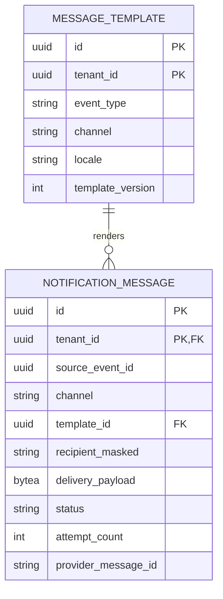
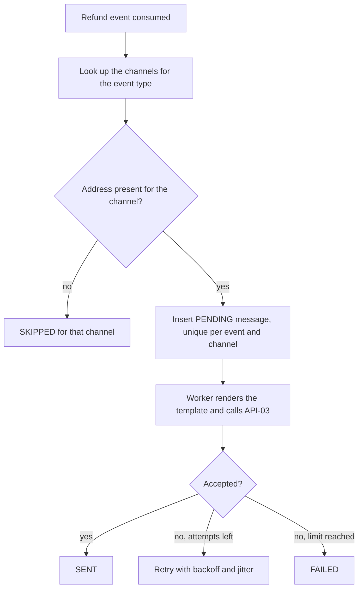

<!--
CHUNK: 13c
TITLE: Detailed Service Spec - notification-service
PROJECT: Refunds Platform
VERSION: 1.3
DEPENDS_ON: 09, 07, 10 (event hub - topic names, event names, and payload contracts must match chunk 10 verbatim), 11 (API contracts - integration endpoints carry their API ID and match chunk 11 verbatim), 12 (roles - permission tokens match chunk 12 verbatim)
PART OF: SDD - Refunds Platform
-->

# 17. Detailed Service Specs

---

## 17.3 notification-service

### What

notification-service is the customer messaging bounded context: a separate deployable with its own database (ADR-01) that turns refund lifecycle events into customer email and SMS messages sent through the notification partner (INT-02, API-03). It owns no BRD use case; it realises the "customer is told" steps of the REFUNDS use cases that refund-service owns.

### Boundaries

- **Owns:** message templates (per event type, channel, and locale) and the delivery log (one row per message and channel, with attempts and outcome), whose unique key is the inbox.
- **Does not own:** refund requests and their states (refund-service); the customer's contact details, which arrive in the event payload and are not kept in clear text.
- **Upstream consumers:** none; the service publishes no event.
- **Downstream dependencies:** the Notification Partner MsgHub (API-03).

### Input

| Type | Source | Description |
|------|--------|-------------|
| Event | refund-service, `refunds-platform-refund-events` | `REFUND_SUBMITTED`, `REFUND_APPROVED`, `REFUND_CANCELLED`, `REFUND_REJECTED`, `REFUND_PAYOUT_DELAYED`, `REFUND_PAID`. |
| Schedule | `message-retry` worker | Re-sends messages whose next attempt is due. |

### Business Logic

Each consumed event produces one message per channel, following this channel matrix:

| Event | Channels | Realises |
|-------|----------|----------|
| `REFUND_SUBMITTED` | Email and SMS | [REFUNDS/UC-01](../brd-refunds-portal/06a-use-cases-customer.md#uc-01-request-a-refund) step 6: the customer is told the request and its reference number |
| `REFUND_APPROVED` | Email and SMS | [REFUNDS/UC-04](../brd-refunds-portal/06b-use-cases-branch-manager.md#uc-04-approve--reject-refund) step 6 and A1: the customer is told the approved amount and, when partial, the reason |
| `REFUND_CANCELLED` | Email | [REFUNDS/UC-03](../brd-refunds-portal/06a-use-cases-customer.md#uc-03-cancel-a-refund-request) step 5: the customer is told by email |
| `REFUND_REJECTED` | Email and SMS | [REFUNDS/UC-04](../brd-refunds-portal/06b-use-cases-branch-manager.md#uc-04-approve--reject-refund) A2: the customer is told the reason; the channels follow [REFUNDS 04 § In Scope](../brd-refunds-portal/04-scope-and-personas.md#in-scope) (customer messages by email and SMS) |
| `REFUND_PAYOUT_DELAYED` | Email and SMS | [REFUNDS/UC-04](../brd-refunds-portal/06b-use-cases-branch-manager.md#uc-04-approve--reject-refund) E1 and AC-2: the customer is told the payout is delayed and that the system keeps trying |
| `REFUND_PAID` | Email and SMS | [REFUNDS/UC-04](../brd-refunds-portal/06b-use-cases-branch-manager.md#uc-04-approve--reject-refund) step 7: the customer is told the refund is paid, with the payout reference and that the money can take some days to appear on their card |

- **Idempotency:** one delivery log row per (`source_event_id`, `channel`), unique, so a redelivered event never sends a second message.
- **Rendering:** a template per event type, channel, and tenant locale; every message carries the reference number, and every amount shows its currency ([REFUNDS 11 § UI/UX Expectations](../brd-refunds-portal/11-summary-and-uiux.md#uiux-expectations)).
- **Missing address:** when the event has no mobile number or no email address, that channel is recorded as `SKIPPED` and the other channel is still sent. A customer may register without a mobile number, and then gets email only ([REFUNDS 03 § Customer account and messages](../brd-refunds-portal/03-definitions-and-domain-concepts.md#customer-account-and-messages)).
- **Sending and retries:** the `message-retry` worker claims due messages (`claimed_until`) and calls API-03 with the delivery log id as the idempotency key; a failure is retried with exponential backoff and jitter until the attempt limit of §12 INT-02, then the message is `FAILED`. A failed message never affects the refund.
- **Message states:** each message moves from `PENDING` to `SENT`, `FAILED`, or `SKIPPED`; the lifecycle has no branching beyond this, so no state diagram is drawn.
- **Recipient data:** the consumer stores the address and the template variables encrypted in `delivery_payload` on the pending message; the address is kept encrypted until the message is final, then only in masked form.

### Output

| Type | Destination | Description |
|------|-------------|-------------|
| External call | Notification Partner MsgHub | Email and SMS messages through API-03. |
| Delivery log | Notification database | Outcome per message and channel, for support and audit. |

### Integrations

| Integration | Direction | Protocol | Purpose | Contract | Failure Handling |
|-------------|-----------|----------|---------|----------|------------------|
| Notification Partner (MsgHub) | Outbound, sync | HTTPS REST | Send customer email and SMS | API-03 (§15) | Idempotency key per message; backoff with jitter up to the attempt limit; circuit breaker and bulkhead (§12 INT-02). |
| Kafka | Inbound, async | Kafka | Receive refund lifecycle events | `REFUND_SUBMITTED`, `REFUND_APPROVED`, `REFUND_CANCELLED`, `REFUND_REJECTED`, `REFUND_PAYOUT_DELAYED`, `REFUND_PAID` (§14) | Inbox dedup through the unique delivery log; DLQ for unreadable messages. |

### DB Modeling

#### Entity Relationship

**Figure 22: notification-service - Entity relationship**

**Summary:** Each message row records one channel for one source event and the template version it was rendered from; templates are per tenant, event type, channel, and locale.

#### Tables Design

| Table | Column | Type | Constraints | Notes |
|-------|--------|------|-------------|-------|
| `notification_message` | `id` | uuid | PK (`tenant_id`, `id`) | UUIDv7; also the API-03 idempotency key; every primary and foreign key leads with `tenant_id` (§11.1) |
| `notification_message` | `template_id` | uuid | NOT NULL; FK (`tenant_id`, `template_id`) to `message_template` | The template version the message was rendered from |
| `notification_message` | `tenant_id`, `source_event_id`, `channel` | uuid, uuid, varchar | UNIQUE (`tenant_id`, `source_event_id`, `channel`) | One message per event and channel |
| `notification_message` | `status`, `attempt_count`, `next_attempt_at` | varchar, int, timestamptz | CHECK status in the four states | Retry state |
| `notification_message` | `recipient_masked` | varchar | NOT NULL | Masked address only |
| `notification_message` | `delivery_payload` | bytea | NULL allowed | The address and template variables, encrypted at the application layer with a key from the secrets manager; set by the consumer, erased when the message reaches `SENT`, `FAILED`, or `SKIPPED` |
| `notification_message` | `source_event_type` | varchar | NOT NULL | Template lookup and the `event_type` metric label |
| `notification_message` | `claimed_until` | timestamptz | NULL unless a worker holds the message | Set by the claim transaction to now plus the INT-02 timeout plus one minute; the worker records the outcome only while it holds the claim, as §17.2 does for payouts |
| `notification_message` | `payload_key_id` | varchar | NULL once `delivery_payload` is erased | Id of the key that encrypted `delivery_payload`, so keys rotate without a redeploy (§11.6) |
| `notification_message` | `provider_message_id`, `last_error_code` | varchar, varchar | NULL allowed | MsgHub's message id; the platform `errorCode` of the last failure |
| `notification_message` | `final_at` | timestamptz | NULL until `SENT`, `FAILED`, or `SKIPPED` | Retention clock |
| `notification_message` | auditing columns | per §11.1 | `version` | |
| `message_template` | `id`, `tenant_id`, `subject` | uuid, uuid, text | PK (`tenant_id`, `id`); NOT NULL; NULL for SMS | On insert, the consumer pins the highest `template_version` for the event type, channel, and tenant locale (`template_id`) |
| `message_template` | `event_type`, `channel`, `locale`, `template_version`, `body` | varchar, varchar, varchar, int, text | UNIQUE (`tenant_id`, `event_type`, `channel`, `locale`, `template_version`) | Versioned templates |

Indexes (each leads with `tenant_id`):

- `notification_message (tenant_id, next_attempt_at)` where `status = 'PENDING'` - the `message-retry` worker.
- `notification_message (tenant_id, final_at)` - retention.
- The existing UNIQUE (`tenant_id`, `source_event_id`, `channel`) is the consumer's inbox; there is no separate inbox table.

MsgHub results stay in `provider_message_id` and `last_error_code`; an API-03 field that must be stored is added by an expand migration when the provider documentation arrives. Column lengths, check wording, and any further index are set in the child LLD's data section; they never change a key, a uniqueness rule, or a tenant rule above.

#### Migration Strategy

- **Tool:** Flyway, versioned SQL files (§11.1).
- **Backward compatibility:** additive changes; expand-contract across two releases.
- **Data backfill:** batched per tenant after the expand step.
- **Rollback:** forward-fix migrations.

#### Retention Policy

- `notification_message`: deleted by the retention job when the tenant setting `messageLogRetention` (§11.2) has passed since `final_at`; default 90 days, owned by the REFUNDS owner. Because the delivery log row is this service's dedup record, the setting can never be below the dedup window (§14.6 rule 2); a value below it is refused when the Helm values are validated. A longer log keeps only the masked address, because the clear address is erased when the message is final. The clear address never outlives the message: `delivery_payload` is erased when the message is final (Business Logic).
- `message_template`: kept while any tenant uses the version.

#### Archival

- **Cold storage:** none in this release (§6 object storage Not applicable).
- **Format:** not applicable.
- **Schedule:** not applicable.
- **Restore SLA:** not applicable; database backups follow the §6 PostgreSQL row.

#### Data Encryption

- **At rest:** per §11.6.
- **In transit:** TLS per §11.6.
- **Key management:** per §11.6; provider credentials in the secrets manager.
- **PII columns:** `recipient_masked` holds a masked address only; `delivery_payload` holds the address encrypted until the message is final, then it is erased.

### Multi-Tenancy Specifications

- **Strategy override:** none; shared schema with `tenant_id` (§11.2).
- **Tenant filter:** every query filters by the tenant of the event; templates and provider credentials are selected per tenant.
- **Cross-tenant queries:** forbidden.

### API Standards

- **Style:** no business API; the service is driven by events (§14).
- **Versioning:** not applicable.
- **Authentication:** not applicable; Kafka access per §11.6.
- **Idempotency:** unique delivery log per event and channel; the message id as the provider idempotency key.
- **Pagination:** not applicable.
- **Error envelope:** not applicable; provider errors map to platform `errorCode` values once API-03 is known (§15).

#### List of APIs (Swagger-friendly)

| Method | Path | Summary | Request Body | Response | Permission token (§16) | API ID (§15) |
|--------|------|---------|--------------|----------|------------------------|--------------|
| - | - | None: notification-service exposes no business endpoint; the refund events of §14.5.1 drive it | - | - | - | - |

Health, readiness, and metrics endpoints follow §11.4.

### Event-Driven Architecture (If Applicable)

#### Event Model

**Published events:**

| Event Name | Producer | Producer Specs | Consumers | Consumer Specs | Schema (Summary) | Delivery Guarantee |
|------------|----------|----------------|-----------|----------------|------------------|---------------------|
| None | notification-service | The service publishes no event (§14.4, consumers only) | - | - | - | - |

**Consumed events:**

| Event Name | Producer (owning service) | Topic | Effect in this service | Idempotency / ordering |
|------------|---------------------------|-------|------------------------|------------------------|
| `REFUND_SUBMITTED` | refund-service | `refunds-platform-refund-events` | Email and SMS to `customerContact` with `referenceNumber` and `requestedAmount` | Unique (`source_event_id`, `channel`); ordering not needed |
| `REFUND_APPROVED` | refund-service | `refunds-platform-refund-events` | Email and SMS to `customerContact` with `referenceNumber`, `approvedAmount`, and `decisionReason` when `partial` | Unique (`source_event_id`, `channel`) |
| `REFUND_CANCELLED` | refund-service | `refunds-platform-refund-events` | Email to `customerContact` with `referenceNumber` | Unique (`source_event_id`, `channel`) |
| `REFUND_REJECTED` | refund-service | `refunds-platform-refund-events` | Email and SMS to `customerContact` with `referenceNumber` and `rejectionReason` | Unique (`source_event_id`, `channel`) |
| `REFUND_PAYOUT_DELAYED` | refund-service | `refunds-platform-refund-events` | Email and SMS to `customerContact` with `referenceNumber` and `approvedAmount`: the payout is delayed and the system keeps trying | Unique (`source_event_id`, `channel`) |
| `REFUND_PAID` | refund-service | `refunds-platform-refund-events` | Email and SMS to `customerContact` with `referenceNumber`, `paidAmount`, and `payoutReference`, and that the money can take some days to appear on the card | Unique (`source_event_id`, `channel`) |

**In-process domain events (modules only):**

| Event | Publisher module | Listener modules | Transaction phase (before commit / after commit) | Payload (DTO) | Notes |
|---|---|---|---|---|---|
| Not applicable | - | - | - | - | notification-service is a separate deployable, not a core module. |

Every integration event above is `committed` in §14.5.

#### Messaging Infra

- **Broker:** Kafka (ADR-02).
- **Schema registry:** the §6 registry; the service reads the refund event subjects.
- **Serialization:** JSON.
- **Topic strategy:** consumer group `notification-service` on `refunds-platform-refund-events` (§14.4).
- **Retention:** per the §6 Kafka row.
- **DLQ strategy:** `refunds-platform-refund-events.notification-service.dlq` for unreadable events; alarm on depth above zero; replay per the §20 runbook.

### Constraints

- **Authorization:** no user-facing endpoint; only group `notification-service` reads the refund events it consumes (topic ACLs, §11.6).
- **Channels:** email and SMS only ([REFUNDS 04 § In Scope](../brd-refunds-portal/04-scope-and-personas.md#in-scope)); push notifications need a native app, which is not planned ([REFUNDS 12 § Wishlist](../brd-refunds-portal/12-appendix-and-wishlist.md#wishlist) item 2).
- **Personal data:** addresses are used to send and stored only masked.

### Error Handling

- **Synchronous APIs:** none exposed.
- **Validation errors:** an event that fails its schema goes to the DLQ with an alarm.
- **Domain errors:** a missing address skips that channel (`SKIPPED`); no error reaches refund-service.
- **Auth errors:** a provider authentication failure opens the circuit and raises an alert; messages wait for their retry.
- **Server errors:** provider 5xx and timeouts are retried with the same idempotency key up to the attempt limit.
- **Async consumers:** the unique delivery log makes redelivery a no-op.
- **Poison messages:** DLQ with alarm; replay per the §20 runbook. Consumer retries and dead-lettering follow §14.6 rule 4. The consumer only inserts the messages; API-03 is called by the `message-retry` worker under the §12 INT-02 attempt limit, so consumer retries cover database writes only.

### Observability & Monitoring

#### Logging

- JSON per §11.4, with `source_event_id` and message id as searchable fields.
- Never logs addresses, message bodies, or `tenant_id` at INFO or above.
- Retention per the §6 logging row.

#### Metrics

| Metric | Type | Labels | Purpose |
|--------|------|--------|---------|
| `notifications_sent_total` | counter | `channel`, `event_type`, `outcome` | Delivery outcomes per channel |
| `notification_send_latency_seconds` | histogram | `channel` | Time from event to accepted message |
| `notifications_pending` | gauge | `channel` | Messages waiting for a retry |

#### Tracing

- OpenTelemetry spans for each consumed event and each API-03 call.
- Trace context taken from the Kafka headers.
- Sampling per the §6 tracing row.

### Developer Notes

- **Recommended patterns:** a `MessageProviderPort` with an anti-corruption adapter for MsgHub; a template registry per tenant and locale; a send worker separate from the consumer.
- **Avoid:** calling refund-service to fetch data; storing clear addresses; sending inside the consumer transaction.
- **Testing:** JUnit 5 and Mockito for the channel matrix and rendering; Testcontainers with PostgreSQL and Kafka for dedup and retries; a provider stub for API-03.

### Service-Level Diagrams

#### Implementation Flow Chart

**Figure 23: notification-service - Event to message flow**

**Summary:** Each event fans out to its channels; a message is recorded once, sent by the worker, retried with backoff, and ends `SENT`, `FAILED`, or `SKIPPED`.

#### Sequence Diagram (Service-Internal)

Not applicable: the interaction with the rest of the platform is shown in §8.5.1 and §8.5.2, and the service-internal steps are the flow above.

### Compliance

- **GDPR:** contact details are processed only to send the messages the customer expects about their refund request, the purpose of §17.1 Compliance, under the lawful basis the data protection owner records for it ([REFUNDS 02 § Legal clearances](../brd-refunds-portal/02-glossary-assumptions-facts.md#legal-clearances) L1); MsgHub processes them under the agreement of L2. The address stays encrypted in `delivery_payload` until the message is final and is then erased; the delivery log keeps only masked addresses and no customer id, so its rows leave by age (Retention Policy, `messageLogRetention`). An event that arrives without `customerContact` after an erasure (§17.1) records both channels `SKIPPED`.
- **PCI-DSS:** not applicable; no card data.
- **ISO 27001 / SOC 2:** neither BRD requires a certification, and whether one applies is a clearance the security owner gives before go-live ([REFUNDS 02 § Legal clearances](../brd-refunds-portal/02-glossary-assumptions-facts.md#legal-clearances) L5); the service applies the §11.6 controls, so a certification scope the retailer adopts can include it without a design change.
- **Local regulations:** none stated by the BRDs: the market is not named yet ([REFUNDS 13 § OI-18](../brd-refunds-portal/13-open-items-and-clarifications.md#oi-18-the-market-its-rules-and-faulty-goods)); once it is, its rules are traced here from the per-market section of REFUNDS 02.

### Deployment Strategy

- **Service-specific override:** none; own image and Helm chart (ADR-09).
- **Replicas:** per §11.3; workers claim due messages with a lease.
- **Strategy:** rolling update.
- **Health checks:** liveness and readiness probes; readiness includes the database only, and Kafka and provider health are watched by consumer-lag and circuit-breaker alerts (§11.3).
- **Rollback:** Helm rollback; migrations stay backward compatible.

### Future Enhancements

- Push notifications as a new channel, which need a native app that is not planned ([REFUNDS 12 § Wishlist](../brd-refunds-portal/12-appendix-and-wishlist.md#wishlist) item 2).

<!-- MASTER: refunds-platform-sdd-master.md | PREV: 13b-service-payout.md | NEXT: 13d-service-loyalty.md -->
