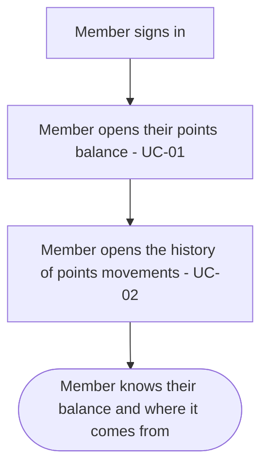
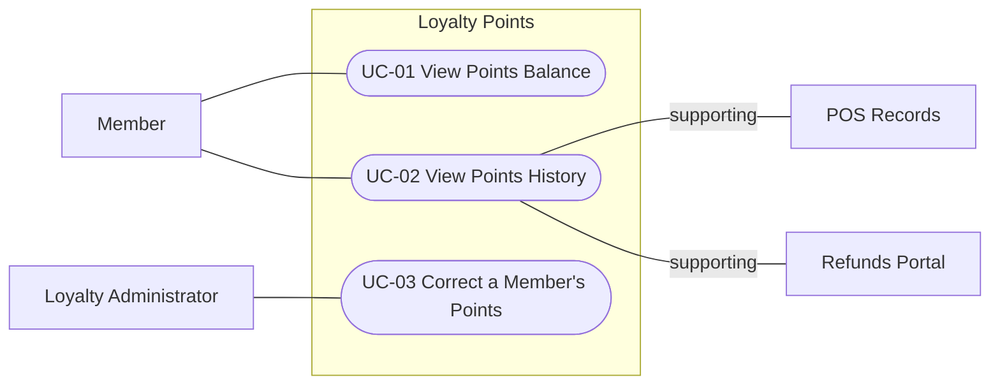

<!--
CHUNK: 05
TITLE: User Journeys & Use Cases - Overview
PROJECT: Loyalty Points
VERSION: 1.7
DEPENDS_ON: 04
PART OF: BRD - Loyalty Points
LANGUAGE: Business language only. No technology names, protocols, or implementation terminology - the how is owned by the SDD.
-->

# User Journeys & Use Cases

## User Journeys

### Member Journey

The member signs in and sees their points balance. They open the history to see which purchases earned points and which refunds took points back.

### Loyalty Administrator Journey

A member's complaint about their points is upheld. The Loyalty Administrator signs in, finds the member, and checks their balance and history. They add or remove points and give a reason. The member then sees the correction in their history.

## Summarized Workflow

1. The member signs in.
2. The member opens their points balance (UC-01).
3. The member opens the history of points movements (UC-02).

### Figure 1 - Summarized Workflow: Member

**Summary:** The member signs in, checks their points balance, then opens the history of points movements. They leave knowing their balance and where it comes from.

## Use Case Summary

| UC ID | Use Case | Primary Actor | Description |
|-------|----------|---------------|-------------|
| **Member** | | | |
| UC-01 | View Points Balance | Member | The member sees their current points balance. |
| UC-02 | View Points History | Member | The member sees every points movement, including points taken back after a refund. |
| **Loyalty Administrator** | | | |
| UC-03 | Correct a Member's Points | Loyalty Administrator | The Loyalty Administrator adds or removes points to fix a wrong balance after a complaint is upheld. |

## Use Case Diagrams

### Figure 2 - Use cases: Overview

**Summary:** Members view their points balance (UC-01) and their points history (UC-02), and POS Records and the Refunds Portal support the history with purchases and refunds. The Loyalty Administrator corrects a member's points (UC-03); no use case includes or extends another.

<!-- MASTER: loyalty-points-brd-master.md | PREV: 04-scope-and-personas.md | NEXT: 06a-use-cases-member.md -->
