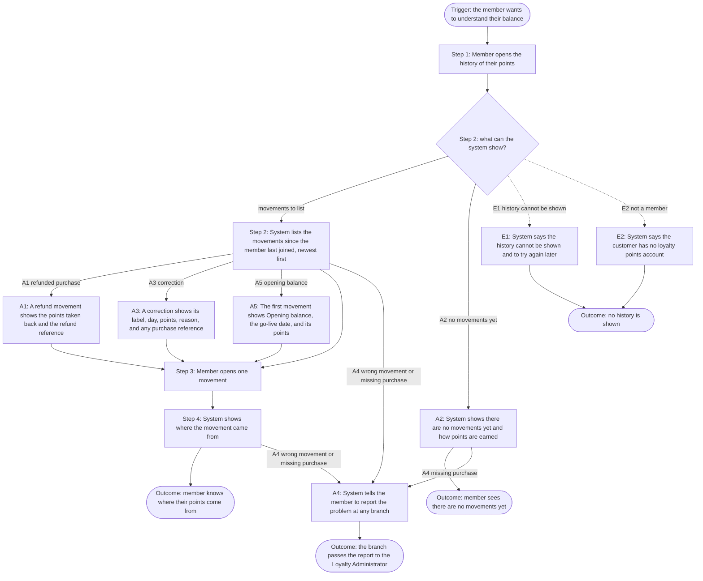

<!--
CHUNK: 06a
TITLE: Detailed Use Cases - Member
PROJECT: Loyalty Points
VERSION: 1.7
DEPENDS_ON: 04, 05
PART OF: BRD - Loyalty Points
SPLIT RULE: One chunk per persona (06a, 06b, ...), in the same persona order as chunk 05. UC IDs stay sequential across the whole BRD, not per chunk.
LANGUAGE: Business language only. Steps describe what the actor does and what the system does for them - never how the system is built. No technology names, protocols, or implementation terminology.
-->

# Detailed Use Cases - Member

All detailed use cases follow this structure:

- **Actor & Goal**: Who performs it, what they want, what triggers it.
- **Why**: The business value of this use case.
- **Preconditions**: What must be true before the use case can start.
- **Main Flow**: Numbered detailed steps - actor action, system response, alternating.
- **Alternate & Exception Flows**: What happens when the path branches or fails, in business terms.
- **Flowchart** (branching use cases only, added once the requirements are final): The main, alternate, and exception paths in one diagram, derived from the narrative.
- **Business Rules & Constraints**: Rules, limits, and conditions that govern the use case.
- **Acceptance Criteria**: Testable conditions that confirm the use case is complete.
- **Future Enhancements**: Low-complexity follow-ups that could ship next.
- **UI/UX**: Wireframes or references to approved Figma designs.

---

## UC-01: View Points Balance

| | |
|---|---|
| **Primary Actor** | Member |
| **Supporting Actors** | None |
| **Goal** | Know how many points they have. |
| **Trigger** | The member wants to check their points. |

### Why

Supports Business Objective 2 ([01](./01-executive-summary-and-context.md#business-objectives)).

### Preconditions

- The member is signed in.

### Main Flow

1. The member opens their points balance.
2. The system shows the current balance and the date of the newest movement, the first one in the history (UC-02 step 2).

### Alternate & Exception Flows

- **A1 - No points yet:** At step 2, the system shows a balance of 0 and explains how points are earned.
- **E1 - Balance cannot be shown:** At step 2, the system tells the member their points cannot be shown right now and to try again later. It never shows 0 or an out-of-date figure as the current balance.
- **E2 - Signed-in customer is not a member:** At step 2, the system tells a signed-in customer who is not, or is no longer, a member that they have no loyalty points account. It shows no balance.

### Business Rules & Constraints

- Members see only their own points.
- The balance screen tells the member when points for a new purchase show (NFR-03, chunk 10).

### Acceptance Criteria

- [ ] Given a member with 120 points, when they open their points, then they see 120 and the date of the newest movement.
- [ ] Given a member with no points movements, when they open their points, then they see a balance of 0 and how points are earned.
- [ ] Given the balance cannot be shown, when the member opens their points, then they see a message to try again later and no balance figure.
- [ ] Given a signed-in customer who is not a member, when they open their points, then they see that they have no loyalty points account and no balance.
- [ ] Given a member, when they open their points, then the screen tells them that points for a new purchase show by the end of the purchase day.
- [ ] Given a member who left the program and rejoined it on the same day, when they open their points later that day, then they see that they have no loyalty points account and no balance.

### Future Enhancements

- None identified at this time.

### UI/UX

Screen LP-01 (points balance). Figma: https://www.figma.com/proto/LOYL01/loyalty-points?node-id=lp-01

---

## UC-02: View Points History

| | |
|---|---|
| **Primary Actor** | Member |
| **Supporting Actors** | External: POS Records (Integrations); External: Refunds Portal (Integrations) |
| **Goal** | See where their points come from. |
| **Trigger** | The member wants to understand their balance. |

### Why

Supports Business Objectives 1 and 2 ([01](./01-executive-summary-and-context.md#business-objectives)). Members trust their balance when they can see every movement. They check each movement against their receipts online instead of calling a branch.

### Preconditions

- The member is signed in.

### Main Flow

1. The member opens the history of their points.
2. The system lists every points movement since the member last joined, newest first. Each movement from a purchase or refund shows its date, its purchase or refund reference, and its points. The date is the day of the purchase or refund, not the day the points were recorded.
3. The member opens one movement.
4. The system shows where the movement came from. For a purchase: its date, branch, amount paid, and points earned. For a refund: its date, the purchase it refunds, the amount refunded, and the points taken back.

### Alternate & Exception Flows

- **A1 - Points taken back after a refund:** At step 2, a movement for a refunded purchase shows the points taken back and the refund reference.
- **A2 - No movements yet:** At step 2, the system shows that there are no points movements yet and explains how points are earned.
- **A3 - Correction:** At step 2, a correction shows the label Correction, the day it was made, its points, and its reason. A correction for a missing purchase also shows the purchase reference it names. At step 4, it shows the same details.
- **A4 - Member thinks a movement is wrong or a purchase is missing:** At step 2 or 4, the system tells the member to report the problem at any branch. The branch passes the report to the Loyalty Administrator.
- **A5 - Opening balance:** At step 2, the first movement of a member who held points at go-live shows the label Opening balance, the go-live date, and its points. At step 4, it shows that the points were carried over at go-live.
- **E1 - History cannot be shown:** At step 2, the system tells the member their history cannot be shown right now and to try again later. It never shows part of the history as if it were complete.
- **E2 - Signed-in customer is not a member:** At step 2, the system tells a signed-in customer who is not, or is no longer, a member that they have no loyalty points account. It shows no history.

### Flowchart

#### Figure 3 - Flowchart: UC-02 View Points History

**Summary:** The member opens the history and sees every movement since they last joined, newest first, with refunds, corrections, and the opening balance shown as such, then opens one movement to see where it came from. Instead, the member may see that there are no movements yet, that the history cannot be shown, or that they have no account, and they can report a wrong movement or a missing purchase at any branch.

### Business Rules & Constraints

- When the Refunds Portal reports a refund as paid, the system takes back the points earned on the refunded purchase. A refund that is rejected or cancelled takes back no points.
- Members see only their own points.
- When part of a purchase is refunded, the purchase keeps the points that its amount not refunded earns (earning rule in chunk 03). The system takes back the rest. A purchase can have several refunds, and each one takes back only points not already taken back.
- The system takes back only points the refunded purchase earned. A refund of a purchase that earned no points takes back nothing.
- If a refund is paid before its purchase shows in the member's history, the system records the take-back when the purchase shows, never before.
- A take-back never takes the balance below 0. If the points to take back are more than the balance, the system takes back only the balance.
- A refund of a purchase made before the day the member last rejoined takes back no points (chunk 03).
- A refund of a purchase made before the go-live date takes back no points (chunk 03).

### Acceptance Criteria

- [ ] Given a refunded purchase that earned 50 points, when the member opens the history, then they see a movement of -50 points with the refund reference.
- [ ] Given a 100 EUR purchase that earned 100 points, when 30 EUR of it is refunded, then the member sees a movement of -30 points with the refund reference.
- [ ] Given that purchase, when the other 70 EUR is refunded later, then the member sees a second movement of -70 points with its own refund reference.
- [ ] Given a member with movements on 3 different dates, when they open the history, then the newest movement is first, and each movement from a purchase or refund shows its date, its purchase or refund reference, and its points.
- [ ] Given a member opens one movement from a purchase or refund, then the system shows the purchase or refund it came from, with the details in step 4.
- [ ] Given a member with no movements, when they open the history, then they see that there are no movements yet and how points are earned.
- [ ] Given the history cannot be shown, when the member opens it, then they see a message to try again later, and no part of the history is shown as if it were complete.
- [ ] Given a member who thinks a movement is wrong or a purchase is missing, when they view the history or open a movement, then they see where to report it.
- [ ] Given a correction of 40 points with the reason Missing purchase, when the member opens the history, then the movement shows the label Correction, the day it was made, 40 points, the reason, and the purchase reference it names.
- [ ] Given a member who held 200 points at go-live, when they open the history, then their first movement shows the label Opening balance, the go-live date, and 200 points.
- [ ] Given a signed-in customer who is not a member, when they open the history, then they see that they have no loyalty points account and no history.
- [ ] Given a member who left and later rejoined, when they open the history, then they see only the movements from the day they rejoined.
- [ ] Given a member who rejoined, when a purchase they made before the day they rejoined is refunded and paid, then their balance does not change and no movement is added.
- [ ] Given a member who held 200 points at go-live, when a purchase they made before the go-live date is refunded and paid, then their balance does not change and no movement is added.
- [ ] Given a purchase that earned 50 points, when the Refunds Portal reports its refund as rejected or cancelled, then the member's balance does not change and no movement is added.
- [ ] Given a 0.80 EUR purchase that earned no points, when it is refunded and the refund is paid, then the member's balance does not change and no movement is added.
- [ ] Given a refund paid before its purchase shows in the member's history, when the purchase shows with 50 points, then the member sees a movement of -50 points with the refund reference and the refund date. Before the purchase shows, the history shows no take-back.
- [ ] Given a purchase that earned 50 points and a later correction that removed 30 points, leaving a balance of 20, when the purchase is refunded and the refund is paid, then the member sees a movement of -20 points and a balance of 0.
- [ ] Given a member who held 200 points at the start of the go-live date and made a 50 EUR purchase that day, when they open the history, then they see the Opening balance of 200 points and a separate movement of 50 points for the purchase.
- [ ] Given a correction of 40 points with the reason Missing purchase, when the member opens that movement, then they see the label Correction, the day it was made, 40 points, the reason, and the purchase reference it names.
- [ ] Given a member who held 200 points at go-live, when they open their Opening balance movement, then they see that the 200 points were carried over at go-live.
- [ ] Given a member who earned 30 points on a purchase, then left the program, rejoined it, and made a 50 EUR purchase, all on the same day, when they open the history the next day, then they see that there are no movements yet and how points are earned.
- [ ] Given a member who left the program and rejoined it on the same day, when they open the history later that day, then they see that they have no loyalty points account and no history.
- [ ] Given a member who makes a 0.80 EUR purchase, when POS Records reports it, then their balance does not change and no movement is added.
- [ ] Given a member who held 0 points at the start of the go-live date and has no other movements, when they open the history, then they see that there are no movements yet and how points are earned.
- [ ] Given a member who held 200 points at the start of the go-live date, when POS Records reports, after go-live, a purchase they made before the go-live date, then their balance stays at 200 and no movement is added.
- [ ] Given a member who left the program and rejoined it on a later day, and made a 50 EUR purchase on the day they rejoined, when this product learns of the rejoin only the next day, then the member sees a movement of 50 points for that purchase, dated on the purchase day.
- [ ] Given a 12.80 EUR purchase that earned 12 points, when 0.80 EUR of it is refunded and the refund is paid, then the member's balance does not change and no movement is added.
- [ ] Given that purchase, when a second refund of 0.80 EUR is paid, then the member sees a movement of -1 point with its refund reference.
- [ ] Given a 100 EUR purchase that earned 100 points, a correction that then removed 80 points, and a 30 EUR refund that took back only the 20 points left, when the member has 200 points and the other 70 EUR is refunded and the refund is paid, then the member sees a movement of -80 points.

### Future Enhancements

- Export the history.

### UI/UX

Screen LP-02 (points history). Figma: https://www.figma.com/proto/LOYL01/loyalty-points?node-id=lp-02

<!-- MASTER: loyalty-points-brd-master.md | PREV: 05-user-journeys-overview.md | NEXT: 06b-use-cases-loyalty-administrator.md -->
