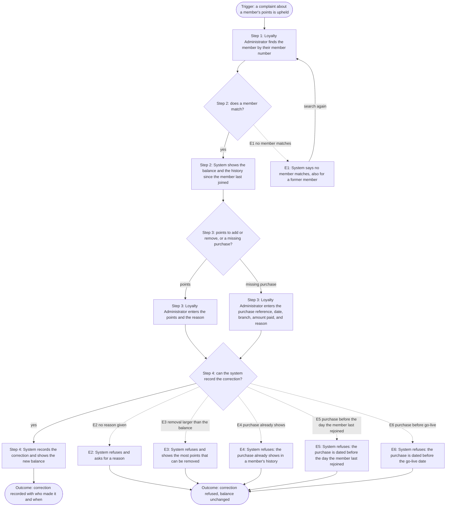

<!--
CHUNK: 06b
TITLE: Detailed Use Cases - Loyalty Administrator
PROJECT: Loyalty Points
VERSION: 1.7
DEPENDS_ON: 04, 05
PART OF: BRD - Loyalty Points
SPLIT RULE: One chunk per persona (06a, 06b, ...), in the same persona order as chunk 05. UC IDs stay sequential across the whole BRD, not per chunk.
LANGUAGE: Business language only. Steps describe what the actor does and what the system does for them - never how the system is built. No technology names, protocols, or implementation terminology.
-->

# Detailed Use Cases - Loyalty Administrator

All detailed use cases follow this structure:

- **Actor & Goal**: Who performs it, what they want, what triggers it.
- **Why**: The business value of this use case.
- **Preconditions**: What must be true before the use case can start.
- **Main Flow**: Numbered detailed steps - actor action, system response, alternating.
- **Alternate & Exception Flows**: What happens when the path branches or fails, in business terms.
- **Flowchart** (branching use cases only, added once the requirements are final): The main, alternate, and exception paths in one diagram, derived from the narrative.
- **Business Rules & Constraints**: Rules, limits, and conditions that govern the use case.
- **Acceptance Criteria**: Testable conditions that confirm the use case is complete.
- **Future Enhancements**: Low-complexity follow-ups that could ship next.
- **UI/UX**: Wireframes or references to approved Figma designs.

---

## UC-03: Correct a Member's Points

| | |
|---|---|
| **Primary Actor** | Loyalty Administrator |
| **Supporting Actors** | None |
| **Goal** | Fix a member's wrong balance. |
| **Trigger** | A complaint about a member's points is upheld. |

### Why

Supports Business Objective 1 and NFR-01.

### Preconditions

- The Loyalty Administrator is signed in.

### Main Flow

1. The Loyalty Administrator finds the member by their member number.
2. The system shows the member's balance and their history since they last joined.
3. The Loyalty Administrator enters the points to add or remove and the reason. For a missing purchase, they enter its purchase reference, date, branch, and amount paid instead of the points.
4. The system records the correction and shows the new balance. For a missing purchase, it works out the points with the earning rule in chunk 03.

### Alternate & Exception Flows

- **E1 - Member not found:** At step 2, the system tells the Loyalty Administrator that no member matches, and they can search again. A former member gives the same result.
- **E2 - No reason given:** At step 4, the system refuses the correction and asks for a reason.
- **E3 - Removal larger than the balance:** At step 4, the system refuses the correction and tells the Loyalty Administrator the most points they can remove.
- **E4 - Purchase already shows:** At step 4, if the named purchase already shows in any member's history, the system refuses the correction and tells the Loyalty Administrator.
- **E5 - Purchase before the member rejoined:** At step 4, if the member has rejoined and the missing purchase is dated before the day they last rejoined, the system refuses the correction and tells the Loyalty Administrator.
- **E6 - Purchase before go-live:** At step 4, if the missing purchase is dated before the go-live date, the system refuses the correction and tells the Loyalty Administrator.

### Flowchart

#### Figure 4 - Flowchart: UC-03 Correct a Member's Points

**Summary:** The Loyalty Administrator finds the member by member number and enters either points with a reason or a missing purchase, and the system records the correction and shows the new balance, working out a missing purchase's points with the earning rule. A search can find no member, and the system refuses a correction with no reason, a removal larger than the balance, or a missing purchase that already shows or is dated before the day the member last rejoined or before the go-live date.

### Business Rules & Constraints

- Every correction needs a reason.
- A correction can remove at most the member's current balance.
- The system records who made each correction and when.
- A correction for a missing purchase names that purchase's reference. The purchase then counts as shown in the member's history, and the corrected points count as the points it earned. A later report of the purchase for the same member earns no more points. Refunds of the purchase take back points under the UC-02 rules.
- If POS Records reports the named purchase for another member, that member earns its points as usual.
- Refunds of a purchase named in a correction for a missing purchase are worked out from the amount paid that the Loyalty Administrator entered. A later report of the purchase for the same member does not change that amount. If POS Records reports the purchase for another member, a refund of it takes back points from both members, each under the UC-02 rules. For that other member, the refund is worked out from the amount paid that POS Records reported.

### Acceptance Criteria

- [ ] Given a member whose 40 EUR purchase earned no points, when the Loyalty Administrator enters that purchase's reference, date, branch, and 40 EUR amount paid with the reason Missing purchase, then the member's history shows a movement of 40 points with that reason.
- [ ] Given no member matches the search, when the Loyalty Administrator searches, then they see that no member matches and can search again.
- [ ] Given a correction with no reason, when the Loyalty Administrator saves it, then the system refuses it, asks for a reason, and the balance does not change.
- [ ] Given a member with 30 points, when the Loyalty Administrator removes 50 points, then the system refuses the correction and shows that 30 is the most they can remove.
- [ ] Given a 40-point correction for a missing purchase that names its reference, when POS Records later reports that purchase for the same member, then the member's balance does not change and no new movement is added for it.
- [ ] Given a purchase that already shows in a member's history, when the Loyalty Administrator enters a correction that names it, then the system refuses the correction and the balance does not change.
- [ ] Given a member with 100 points, when the Loyalty Administrator removes 30 points with a reason, then the system records the correction with who made it and when, shows the new balance of 70, and the member's history shows a movement of -30 points with that reason.
- [ ] Given a former member, when the Loyalty Administrator searches for them, then they see that no member matches and can search again.
- [ ] Given a member who left and later rejoined, when the Loyalty Administrator finds them, then they see only the movements from the day the member rejoined.
- [ ] Given a correction for one member that names a missing 40 EUR purchase, when POS Records later reports that purchase for another member, then the other member earns 40 points for it.
- [ ] Given a member who rejoined, when the Loyalty Administrator enters a missing purchase dated before the day they rejoined, then the system refuses the correction and the balance does not change.
- [ ] Given a member, when the Loyalty Administrator enters a missing purchase dated before the go-live date, then the system refuses the correction and the balance does not change.
- [ ] Given a 40-point correction for a missing 40 EUR purchase that POS Records has not reported, when 10 EUR of that purchase is refunded and the refund is paid, then the member sees a movement of -10 points with the refund reference.
- [ ] Given a member who left the program and rejoined it on the same day, when the Loyalty Administrator searches for them later that day, then they see that no member matches and can search again.
- [ ] Given a 40-point correction for a missing 40 EUR purchase that POS Records later reports for the same member with an amount paid of 50 EUR, when 10 EUR of that purchase is refunded and the refund is paid, then the member sees a movement of -10 points.
- [ ] Given a correction for one member that names a missing 40 EUR purchase, and another member who earned 40 points when POS Records later reported that purchase for them, when the whole 40 EUR is refunded and the refund is paid, then each of the two members sees a movement of -40 points.
- [ ] Given a correction for one member that names a missing 40 EUR purchase, and another member who earned 50 points when POS Records later reported that purchase for them with an amount paid of 50 EUR, when 10 EUR of that purchase is refunded and the refund is paid, then each of the two members sees a movement of -10 points.

### Future Enhancements

- None identified at this time.

### UI/UX

Correction screen. Figma: https://www.figma.com/proto/TEST-FIXTURE/loyalty-points-MK-03

<!-- MASTER: loyalty-points-brd-master.md | PREV: 06a-use-cases-member.md | NEXT: 07-users-use-cases-matrix.md -->
