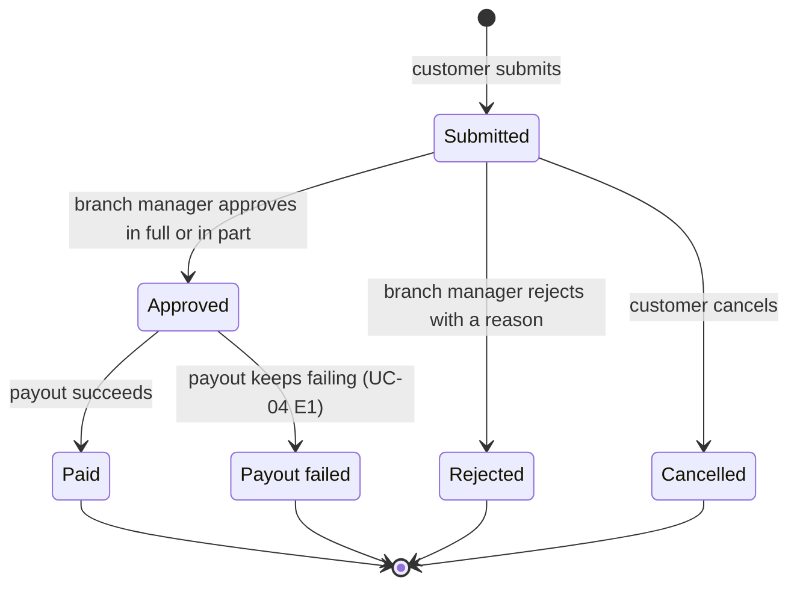

<!--
CHUNK: 03
TITLE: Definitions & Important Details
PROJECT: Refunds Portal
VERSION: 1.3
DEPENDS_ON: 02
PART OF: BRD - Refunds Portal
LANGUAGE: Business language only. Explain domain concepts as the business understands them - lifecycles, rules, relationships. No data-schema, protocol, or implementation detail; that is owned by the SDD.
-->

# Definitions & Important Details

## Refund request lifecycle

### Overview

A refund request moves through a fixed set of statuses. The customer sees the current status and its history ([06a / UC-02](./06a-use-cases-customer.md#uc-02-track-refund-status)).

### Lifecycle

A refund request is **Submitted** by the customer. The branch manager then **Approves** it (in full or in part) or **Rejects** it with a reason. An approved request becomes **Paid** once the payout succeeds. A customer can **Cancel** a request while it is still Submitted.

A request is Paid when the Payment Provider confirms the payout. The money can take longer to show on the customer's card, depending on their bank.

An approved request becomes **Payout failed** if the payout keeps failing for the time set in [06b / UC-04 E1](./06b-use-cases-branch-manager.md#uc-04-approve--reject-refund). Payout failed is an end status.

#### Figure 1 - Refund request lifecycle

**Summary:** A request starts as Submitted. The branch manager approves it in full or in part, or rejects it. The customer can cancel it while it is Submitted. An approved request becomes Paid when the payout succeeds, or Payout failed if the payout keeps failing (UC-04 E1).

## Branch ownership

### Overview

Each purchase, and so each refund request, belongs to exactly one branch. Branch managers decide only on their own branch's requests, or on those of a branch they cover.

## Refund records

### Overview

Each refund request keeps its full history: every status change with its date, the branch manager who decided, the requested and approved amounts, and every reason. The portal keeps a request for 7 years after its last status change. After that, the request is no longer linked to the customer's account, and the amounts and dates stay for reporting. The account keeps its email address and mobile number ([06a / UC-06](./06a-use-cases-customer.md#uc-06-sign-up-and-sign-in)). Before customers give their contact details, the portal tells them how the details are used and how long they are kept. The portal closes an account with no sign-in for 2 years and no request still linked to it. It removes the account's email address and mobile number.

<!-- MASTER: refunds-portal-brd-master.md | PREV: 02-glossary-assumptions-facts.md | NEXT: 04-scope-and-personas.md -->
