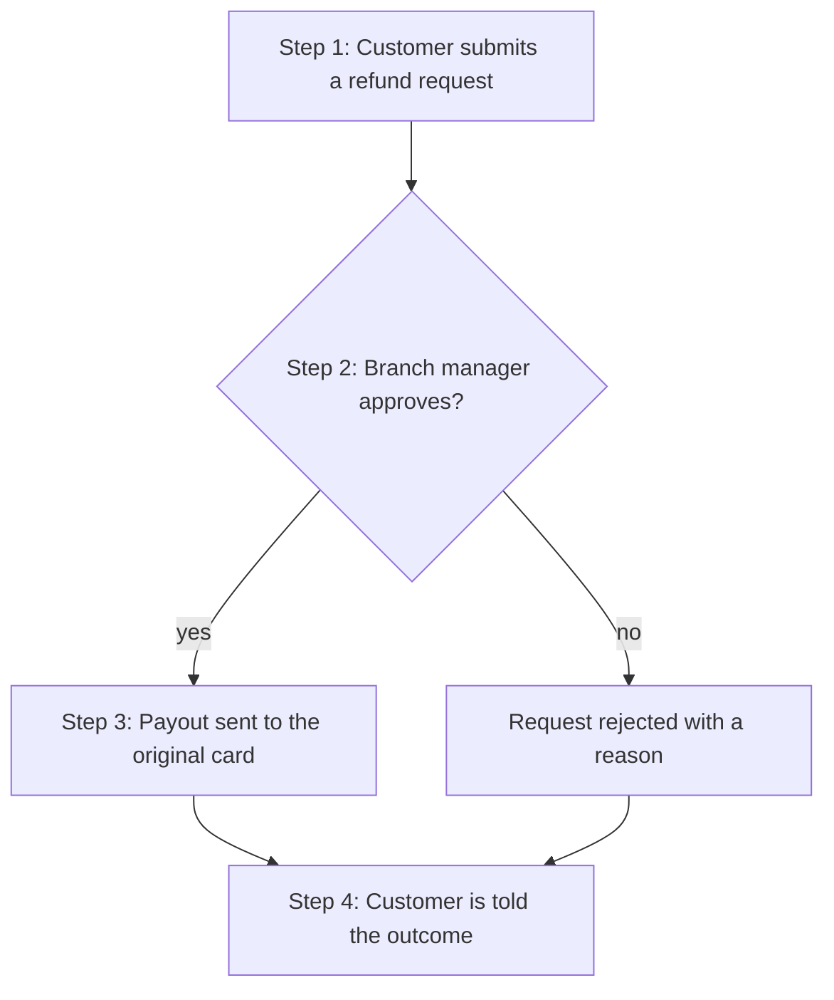
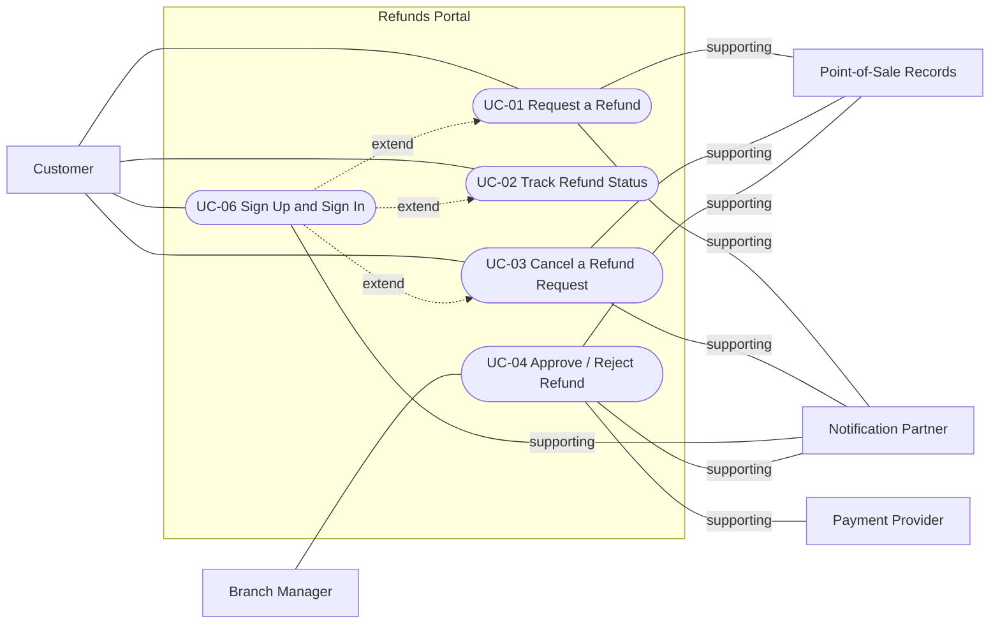

<!--
CHUNK: 05
TITLE: User Journeys & Use Cases - Overview
PROJECT: Refunds Portal
VERSION: 1.6
DEPENDS_ON: 04
PART OF: BRD - Refunds Portal
LANGUAGE: Business language only. No technology names, protocols, or implementation terminology - the how is owned by the SDD.
-->

# User Journeys & Use Cases

## User Journeys

### Customer Journey

The customer enters the receipt number, picks the items and a reason, and submits the request. They follow the request until it is paid. They can cancel it while it waits for a decision.

### Branch Manager Journey

The branch manager sees the requests waiting for their branch and checks each one. They approve a request in full or in part, or reject it with a reason.

## Summarized Workflow

1. The customer submits a refund request.
2. The branch manager approves or rejects it.
3. On approval, the payout is sent to the customer's original card.
4. The customer is told the outcome at each step.

### Figure 2 - Summarized Workflow

**Summary:** The customer submits a request, and the branch manager approves or rejects it. An approved refund is paid to the original card, and the customer is told the outcome.

## Use Case Summary

| UC ID | Use Case | Primary Actor | Description |
|-------|----------|---------------|-------------|
| **Customer** | | | |
| UC-01 | Request a Refund | Customer | The customer asks for money back for items on a receipt, within the refund window. |
| UC-02 | Track Refund Status | Customer | The customer sees where each of their requests stands. |
| UC-03 | Cancel a Refund Request | Customer | The customer withdraws a request that has not been decided yet. |
| UC-06 | Sign Up and Sign In | Customer | The customer creates an account with a confirmed email address and mobile number, then signs in to request, track, and cancel refunds. |
| **Branch Manager** | | | |
| UC-04 | Approve / Reject Refund | Branch Manager | The branch manager approves a request in full or in part, or rejects it with a reason. |
| UC-05 | Issue Partial Refund | Branch Manager | Merged into UC-04. A partial refund is alternate flow A1 of UC-04. |

## Use Case Diagrams

### Figure 3 - Use cases: Overview

**Summary:** Customers request, track, and cancel refunds; a customer who is not signed in signs up or signs in first, so UC-06 extends UC-01, UC-02, and UC-03 (UC-06 A2). Branch managers approve or reject requests, and the three partners support the use cases that name them as Supporting Actors.

<!-- MASTER: refunds-portal-brd-master.md | PREV: 04-scope-and-personas.md | NEXT: 06a-use-cases-customer.md -->
