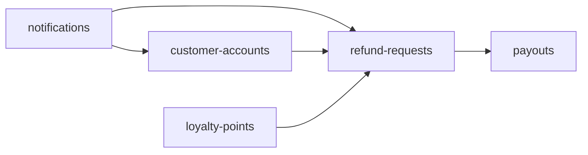

<!--
CHUNK: 02
TITLE: Context
PROJECT: Refunds Platform
VERSION: 1.0
PART OF: LLD - Refunds Platform
MODE: from-sdd
-->

# 5. Context

## 5.1 Bounded Context

[SDD §13](../sdd-refunds-platform/09-services-summary.md) owns the five boundaries. Module packages expose only their API ports and event types. No direct repository or table access crosses a boundary.

## 5.2 Upstream Producers (callers / event-publishers into this system)

User entry points: customers and branch managers in Refunds Portal; members and loyalty administrators in Loyalty Points. Provider feeds/callbacks use [SDD API-04, API-07, API-08, API-09](../sdd-refunds-platform/11-api-contracts.md); provider auth maps to a tenant before access. Keycloak owns sign-in and brokers.

## 5.3 Downstream Consumers (systems this LLD's services call / publish to)

POS Records, CardPay Ltd, MsgHub and the member/staff brokers are the [SDD integration owners](../sdd-refunds-platform/08-integrations.md). Their contracts remain external. No broker or cloud integration is inferred from the global defaults.

## 5.4 Cross-Service Dependencies (within this LLD)

**Summary:** This is the compile-time dependency graph from SDD AP-11, not the direction of event delivery. Payouts owns its three contract DTOs; customer-accounts owns MessageDispatchPort, which notifications implements.

## 5.5 Shared Conventions (apply to every service in scope)

Source: [SDD §11](../sdd-refunds-platform/07-cross-cutting-concerns.md) and `C:/Users/negat/.claude/CLAUDE.md`. Backend constructor injection, record DTOs, UUIDv7 application IDs, UTC timestamps and injected Clock apply. Business dates follow their source owner. Tenant claims/host/provider credential resolve context; no tenant or PII at INFO.

<!-- MASTER: refunds-platform-lld-master.md | PREV: 01-purpose-and-scope.md | NEXT: 03-architecture.md -->
