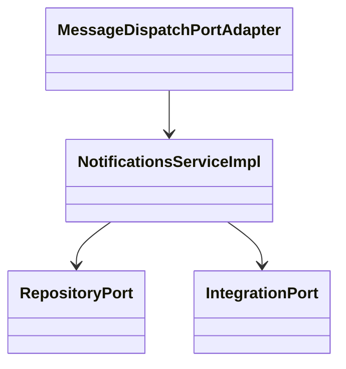
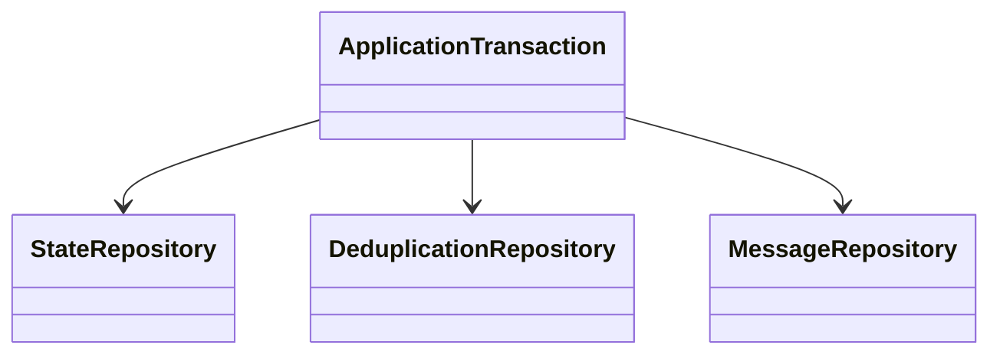
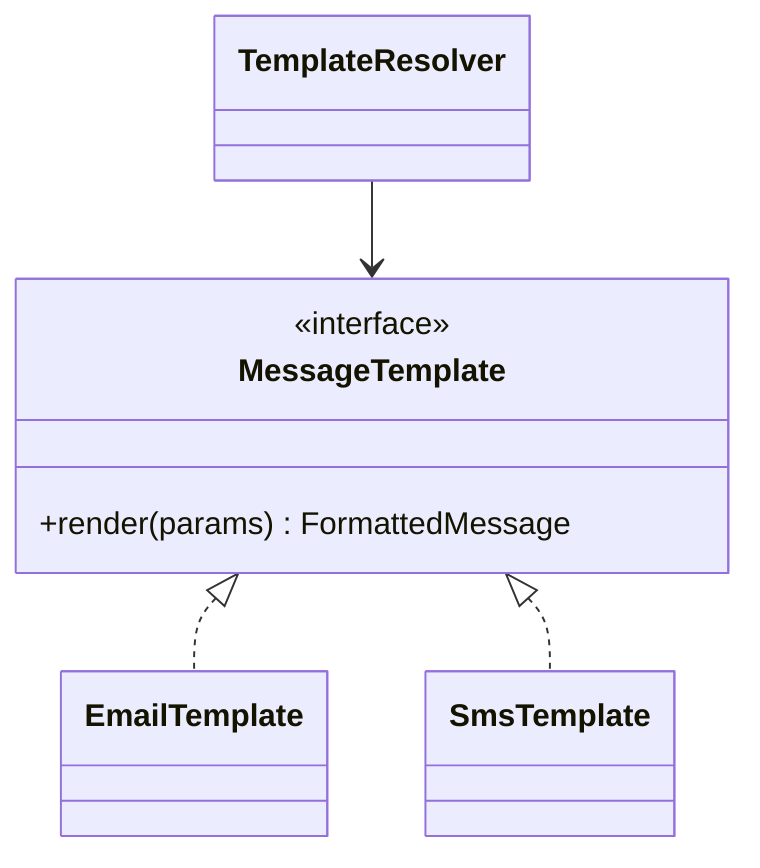
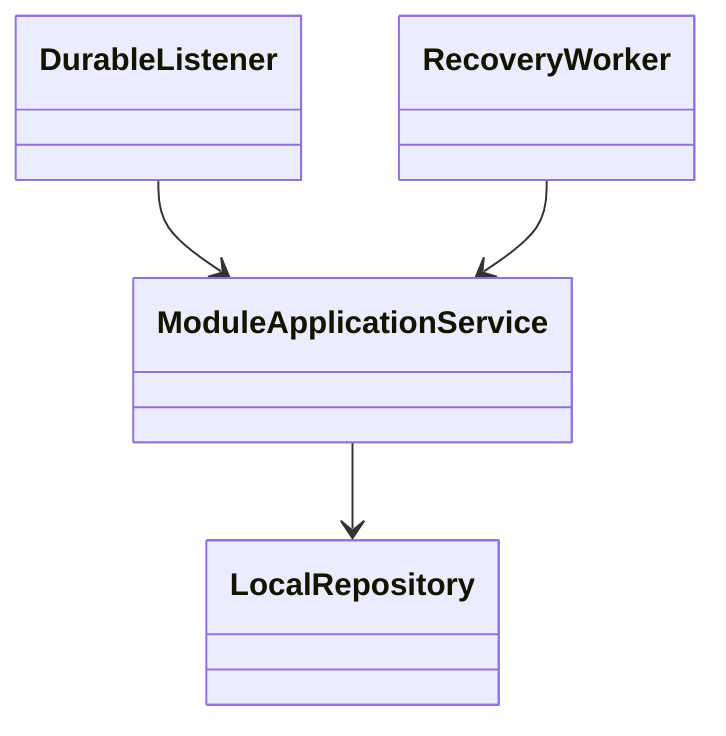
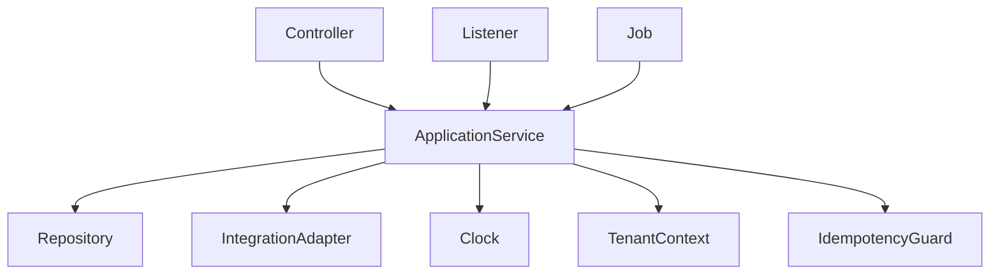

<!--
CHUNK: 04
TITLE: Per-Service Implementation - notifications
PROJECT: Refunds Platform
VERSION: 1.0
PART OF: LLD - Refunds Platform
MODE: from-sdd
-->

# 7. Per-Service Implementation - notifications

> **Bounded context:** [SDD §17 notifications](../../sdd-refunds-platform/13d-service-notifications.md)
>
> **Type:** module, in the single refunds-platform deployable.
>
> **Source code:** Not applicable - Greenfield from-sdd build target.
>
> **Owns use cases (SDD 09):** None - supports REFUNDS workflows.
>
> **Participates in:** REFUNDS/UC-01, REFUNDS/UC-03, REFUNDS/UC-04, REFUNDS/UC-06 (owners: refund-requests, customer-accounts)

## 7.1 Responsibility

Translate six refund events into durable recipient work and deliver messages. Implement customer-accounts' immediate code-send port with a separate bounded provider path. Contract and scope home: [SDD §17 notifications](../../sdd-refunds-platform/13d-service-notifications.md).

## 7.2 Class & Interface Map

> Confirm: notifications class names and method signatures are proposed; verify during implementation against [SDD §17 notifications](../../sdd-refunds-platform/13d-service-notifications.md).

### Controllers

| Class | Endpoints | Notes |
| --- | --- | --- |
| NotificationsEventListener | `Event: RefundRequestSubmitted` | None - participating or platform listener |
| NotificationsEventListener | `Event: RefundRequestCancelled` | None - participating or platform listener |
| NotificationsEventListener | `Event: RefundRequestRejected` | None - participating or platform listener |
| NotificationsEventListener | `Event: RefundPaid` | None - participating or platform listener |
| NotificationsEventListener | `Event: RefundPayoutFailed` | None - participating or platform listener |
| NotificationsEventListener | `Event: WaitingRequestsSummarised` | None - participating or platform listener |
| NotificationsJob | `Schedule: message-send` | None - system workflow |

### Services (interfaces)

| Interface | Purpose | Implementations |
| --- | --- | --- |
| NotificationsService | Translate six refund events into durable recipient work and deliver messages. Implement customer-accounts' immediate code-send port with a separate bounded provider path. | NotificationsServiceImpl |

### Service Implementations

| Class | Implements | Key methods |
| --- | --- | --- |
| NotificationsServiceImpl | NotificationsService | See method-level algorithm below |
| NotificationsEventListener | Durable listener adapter | RefundRequestSubmitted, RefundRequestCancelled, RefundRequestRejected, RefundPaid, RefundPayoutFailed, WaitingRequestsSummarised |
| NotificationsJob | Tenant-aware runner | message-send |

### Repositories

| Class | Entity | Notes |
| --- | --- | --- |
| MessageRepository | message | Module-owned schema; tenant filter + RLS; see §8.2 |
| RolePermissionRepository | role_permission | Module-owned schema; tenant filter + RLS; see §8.2 |
| InboxEntryRepository | inbox_entry | Module-owned schema; tenant filter + RLS; see §8.2 |

### Domain Types (records)

Key signatures above use source DTO names; Subject, TenantContext, PageQuery and verified provider command types are proposed implementation records. Domain records and validations use the exact DTO names in [SDD §17 notifications](../../sdd-refunds-platform/13d-service-notifications.md). Persistence entities map only that module's §8.2 tables. `Money` is EUR decimal(19,4); `Clock`, tenant context and publication identity are injected, not read from static state.

### Method Signatures (key methods only)

```java
public interface NotificationsService {
  void recordEvent(RefundEventCommand command, PublicationContext publication);
  void send(UUID messageId, TenantContext tenant);
  SendNowResult sendNow(SendNowCommand command, ModuleIdentity caller, TenantContext tenant);
}
```

### Ports and Adapters (in-process contracts)

| Port interface | Operation | API ID (§15) | Role here | Adapter class |
| --- | --- | --- | --- | --- |
| CustomerContactPort | getContact | API-12 | Caller | CustomerContactPortAdapter in customer-accounts |
| BranchRecipientsPort | getRecipients | API-13 | Caller | BranchRecipientsPortAdapter in refund-requests |
| MessageDispatchPort | sendNow | API-14 | Provider, interface owned by customer-accounts | MessageDispatchPortAdapter |

Contract home: [SDD §15](../../sdd-refunds-platform/11-api-contracts.md); binding view: [§9.6](../06-api-contracts.md#96-in-process-port-contracts-sdd-15). No HTTP resilience wrapper around a port.

### Authorization

| Entry point | Kind | Permission token (SDD §16, verbatim) | Enforcement point |
| --- | --- | --- | --- |
| Event: RefundRequestSubmitted | Listener | None - system consumer | Trusted durable publication, explicit tenant context |
| Event: RefundRequestCancelled | Listener | None - system consumer | Trusted durable publication, explicit tenant context |
| Event: RefundRequestRejected | Listener | None - system consumer | Trusted durable publication, explicit tenant context |
| Event: RefundPaid | Listener | None - system consumer | Trusted durable publication, explicit tenant context |
| Event: RefundPayoutFailed | Listener | None - system consumer | Trusted durable publication, explicit tenant context |
| Event: WaitingRequestsSummarised | Listener | None - system consumer | Trusted durable publication, explicit tenant context |
| Schedule: message-send | Job | None - system job | Job lock and per-tenant transaction |
| MessageDispatchPort.sendNow | Port | `notifications.message.send` | Fixed module identity guard in adapter |

## 7.3 Method-Level Pseudocode (non-trivial logic only)

Source: [SDD §17 notifications](../../sdd-refunds-platform/13d-service-notifications.md) Business Logic.

> Confirm: notifications pseudocode combines the stated algorithm with inferred lock/transaction wiring; verify failure and concurrency paths in PostgreSQL integration tests.

### NotificationsServiceImpl.recordEvent and MessageWorker.send

```text
Resolve recipient references through API-12/13 with caller holding no DB transaction.
Within tenant transaction, dedupe inbox and insert one message per source publication,
  channel and recipient; unique key prevents new rows on event redelivery. Commit.
Claim one pending message; read current contact via API-12/13 outside write transaction.
  Closed/unknown customer: SKIPPED; missing branch recipient: log and alert.
Use address in memory only; call API-05 after commit with unchanged work identity.
On positive acknowledgement, transactionally mark SENT and clear template parameters.
On timeout/no answer, leave pending and retry same identity from message-send job.
Backoff starts at one minute, doubles with jitter, caps at 30 minutes; give up at 24 hours,
  mark FAILED, clear parameters and alert. Ended messages are deleted after 90 days.
```

### MessageDispatchPortAdapter.sendNow

```text
Check module identity permission notifications.message.send and tenant context.
Serialize tenant/idempotency-key; message.message_key holds the API-14 key.
Replay the first SENT result (id, status SENT, ended_at as sentAt) or stored typed error.
A repeated API-14 key returns the first outcome as its contract states; add no hash-conflict error.
Caller holds no DB transaction; API-14 owns REQUIRES_NEW outcome persistence boundaries.
Call API-05 with remaining shared command deadline, on the separate code-send bulkhead.
Do not retry code sends inside sign-up. Capture success OR typed failure as the first outcome.
Persist SENT or FAILED, last_error_code and ended_at on message before rethrowing the typed error.
Use the source message table; do not invent notifications.idempotency_record or store a code/address.
Never wrap the provider call in a DB transaction. Never send again for a saved failure key.
```

Completion of an event listener means message work is durable, not that MsgHub delivered it. API-05 provider deduplication is unresolved; do not claim exactly-once provider delivery from a unique local message row.

## 7.4 Design Patterns Applied

### Pattern: Hexagonal composition

**Applied rule:** CLAUDE.md composition over inheritance; SDD §6 requires hexagonal modules and isolated data. **Rationale:** transport/provider adapters cannot reach another module's persistence. **Roles:** NotificationsServiceImpl is the application context; repositories and provider/module ports are injected adapters.



**Summary:** The application service composes persistence and integration ports through constructor injection. Each concrete adapter stays in its module.

```text
Controller validates transport input -> application port
Application validates domain command -> owned repository / permitted integration port
Adapters translate transport errors; domain raises ServiceException with stable code
```

### Pattern: Durable incoming work and idempotent consumer

**Applied rule:** CLAUDE.md at-least-once consumer idempotency and mandatory outbox for emitted state changes. **Rationale:** committed state cannot lose its downstream publication; redelivery cannot create duplicate provider work. **Roles:** application transaction owns state and inbox; platform.event_publication supplies the incoming delivery; MessageRepository owns durable work and MessageWorker owns provider acknowledgement. This module emits no outgoing catalog event.



**Summary:** State and deduplication commit together. There is no outgoing publication here; committed message work follows incoming publication completion and provider acknowledgement ends the work.

```text
BEGIN tenant transaction
lock business key; reject changed idempotency hash or detect applied event
write message + inbox; do not append an outgoing event
COMMIT; only then call an external provider; persist acknowledged result separately
worker: load due source work with stable key/payload; send outside transaction
if acknowledged: commit source work completion; if state changed meanwhile, keep new work due
if failed/timed out: keep work incomplete and retry same identity with source backoff
crash after acknowledgement before completion: resend original identity; provider dedup contract required
```

### Pattern: Strategy for message templates

**Applied rule:** CLAUDE.md Strategy for runtime variants; source SDD 13d names one template per message type/channel. **Rationale:** select an existing template at runtime without mixing email/SMS formatting into retry logic. **Roles:** MessageTemplate interface, EmailTemplate and SmsTemplate implementations, TemplateResolver keyed by message type/channel. Constructor-injected registry contains only the source-defined variants.



**Summary:** Runtime channel/type selects an existing formatter; provider retry and recipient selection stay in the application service.

```text
template = injectedTemplates.require(messageType, channel)
formatted = template.render(sourceParameters, sourceLocale)
provider.send(formatted, currentAddress, unchangedMessageKey)
```

### Pattern: Choreography and local compensation

**Applied rule:** CLAUDE.md event-driven choreography for cross-boundary business transactions, no distributed 2PC. **Rationale:** module commits survive external failure without a transaction crossing providers. **Roles:** the named module application service commits its local step; stable listeners and source workers advance the next step. This module's steps and compensation are: Refund outcome listener commits one message work row per recipient/channel; provider sends retry the same key. Final send failure alerts and status remains visible in the portal; no business state is rolled back.



**Summary:** This is source choreography with local commit/retry boundaries, not a new central orchestrator. Compensation is limited to the source actions stated above.

```text
onSourceEvent: begin tenant transaction; dedupe source identity; apply guarded local step
commit local state + inbox + any source-defined outgoing publication
onFailure: rollback local step; retry original source identity through the source schedule
onGiveUp: source terminal failure/park + alert; do not invent a reverse business transition
```

## 7.5 Dependency Injection Graph



**Summary:** Backend wiring uses constructor injection only. Runtime modules share the injected clock and platform transaction/tenant infrastructure, not their repositories.

## 7.6 Transaction Boundaries

| Method | Propagation | Isolation | Rollback rules |
| --- | --- | --- | --- |
| NotificationsServiceImpl mutation | REQUIRED | READ_COMMITTED + source row locks/version checks | Any failure rolls back state + inbox/replay + publication |
| NotificationsServiceImpl read | REQUIRED read-only | REPEATABLE_READ for balance/history or multi-query snapshot | No fallback data on failure |
| NotificationsEventListener | Own REQUIRED after publisher commit | READ_COMMITTED | Retry only after rollback; completion after durable work commit |
| NotificationsJob | One explicit tenant transaction per unit of work | READ_COMMITTED | Provider calls outside transaction; finally restore context |


> Confirm: transaction propagation and read snapshot isolation are implementation choices; ports use the SDD contract verbatim in §9.6. Fault-test lock order and rollback visibility.

Business errors that must persist counters/outcomes use an outcome record committed before the transport layer raises the error. No REQUIRES_NEW publication insert. No whole-workflow database transaction across external calls.

## 7.7 Error Handling

| Exception | RFC 9457 type | errorCode (SDD §15.1) | HTTP Status | When thrown | Caller action |
| --- | --- | --- | --- | --- | --- |
| NotFoundServiceException | urn:refunds-platform:problem:not-found | NOT_FOUND | 404 | Scoped row absent | Correct reference; do not reveal another tenant |
| ValidationServiceException | urn:refunds-platform:problem:validation | VALIDATION_FAILED | 400 / 422 per source endpoint | Payload/domain rule invalid | Explain fix; no raw code displayed |
| ConflictServiceException | urn:refunds-platform:problem:conflict | CONFLICT | 409 | Changed key/hash, stale version or business-key race | Refetch; retain key for exact retry |
| UnavailableServiceException | urn:refunds-platform:problem:unavailable | UNAVAILABLE | 503 | Dependency/read unavailable | Try later; no invented data |

Domain-specific errors and statuses remain as [SDD §17 notifications](../../sdd-refunds-platform/13d-service-notifications.md) Error Handling and [SDD §15](../../sdd-refunds-platform/11-api-contracts.md) specify. Port errors are raised domain errors, not HTTP statuses. `ServiceException` is translated centrally.

## 7.8 Use-Case Workflows

### Workflow: message-send

> **Traceability:** No BRD use case - realises [SDD §17 notifications](../../sdd-refunds-platform/13d-service-notifications.md) Input / Business Logic · Entry points: Schedule: message-send

Acquire database job lock, enumerate the source-defined tenants, set tenant context and process due work through §7.3. Commit each bounded unit; clear context in finally. Provider failure preserves due work and schedules the source backoff. Retention uses source dates and never invents an archive.

### Workflow: Durable event and provider work

> **Traceability:** No BRD use case - realises [SDD §17 notifications](../../sdd-refunds-platform/13d-service-notifications.md) Business Logic / Retention Policy · Entry points: Event: RefundRequestSubmitted, Event: RefundRequestCancelled, Event: RefundRequestRejected, Event: RefundPaid, Event: RefundPayoutFailed, Event: WaitingRequestsSummarised

Use the event-specific §7.3 handler, persistent business keys and publication inbox. No new use case is created for reconciliation, provider feeds, internal closure or retention. Each listener installs the publisher tenant and correlation context before any repository call.


<!-- MASTER: ../refunds-platform-lld-master.md | PREV: ../03-architecture.md | NEXT: ../05-data-model.md -->
