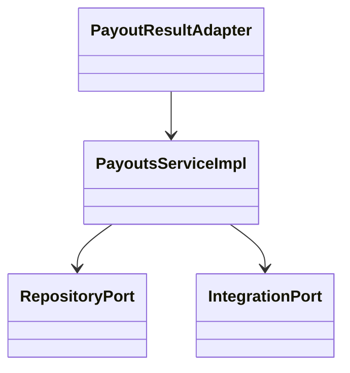
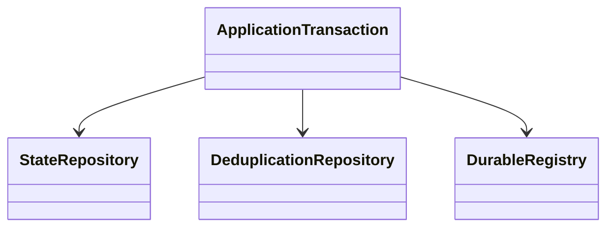
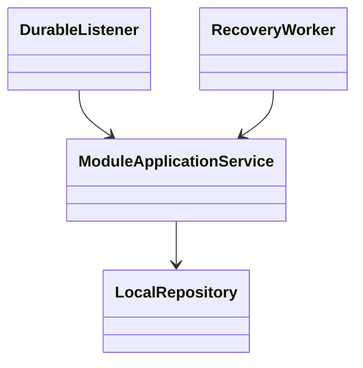
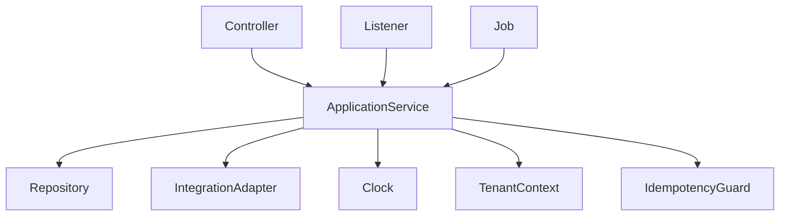

<!--
CHUNK: 04
TITLE: Per-Service Implementation - payouts
PROJECT: Refunds Platform
VERSION: 1.0
PART OF: LLD - Refunds Platform
MODE: from-sdd
-->

# 7. Per-Service Implementation - payouts

> **Bounded context:** [SDD §17 payouts](../../sdd-refunds-platform/13c-service-payouts.md)
>
> **Type:** module, in the single refunds-platform deployable.
>
> **Source code:** Not applicable - Greenfield from-sdd build target.
>
> **Owns use cases (SDD 09):** None - supports REFUNDS workflows.
>
> **Participates in:** REFUNDS/UC-04 (owner: refund-requests)

## 7.1 Responsibility

Turn each approved refund into one payout and a sequence of provider attempts. Preserve attempt identity across unknown outcomes and the stored first-try deadline. Contract and scope home: [SDD §17 payouts](../../sdd-refunds-platform/13c-service-payouts.md).

## 7.2 Class & Interface Map

> Confirm: payouts class names and method signatures are proposed; verify during implementation against [SDD §17 payouts](../../sdd-refunds-platform/13c-service-payouts.md).

### Controllers

| Class | Endpoints | Notes |
| --- | --- | --- |
| PayoutsEventListener | `Event: RefundRequestApproved` | None - participating or platform listener |
| PayoutsJob | `Schedule: payout-retry` | None - system workflow |
| PayoutResultAdapter | API-04 callback: TBD - external | None - provider adapter |

### Services (interfaces)

| Interface | Purpose | Implementations |
| --- | --- | --- |
| PayoutsService | Turn each approved refund into one payout and a sequence of provider attempts. Preserve attempt identity across unknown outcomes and the stored first-try deadline. | PayoutsServiceImpl |

### Service Implementations

| Class | Implements | Key methods |
| --- | --- | --- |
| PayoutsServiceImpl | PayoutsService | See method-level algorithm below |
| PayoutsEventListener | Durable listener adapter | RefundRequestApproved |
| PayoutsJob | Tenant-aware runner | payout-retry |

### Repositories

| Class | Entity | Notes |
| --- | --- | --- |
| PayoutRepository | payout | Module-owned schema; tenant filter + RLS; see §8.2 |
| PayoutAttemptRepository | payout_attempt | Module-owned schema; tenant filter + RLS; see §8.2 |
| PayoutResultRepository | payout_result | Module-owned schema; tenant filter + RLS; see §8.2 |
| InboxEntryRepository | inbox_entry | Module-owned schema; tenant filter + RLS; see §8.2 |

### Domain Types (records)

Key signatures above use source DTO names; Subject, TenantContext, PageQuery and verified provider command types are proposed implementation records. Domain records and validations use the exact DTO names in [SDD §17 payouts](../../sdd-refunds-platform/13c-service-payouts.md). Persistence entities map only that module's §8.2 tables. `Money` is EUR decimal(19,4); `Clock`, tenant context and publication identity are injected, not read from static state.

### Method Signatures (key methods only)

```java
public interface PayoutsService {
  void acceptApproval(RefundRequestApprovedDto event, PublicationContext publication);
  void tryDue(UUID payoutId, TenantContext tenant);
  void applyProviderResult(VerifiedProviderResult result, TenantContext tenant);
}
```

### Ports and Adapters (in-process contracts)

Not applicable - no in-process contracts.

Contract home: [SDD §15](../../sdd-refunds-platform/11-api-contracts.md); binding view: [§9.6](../06-api-contracts.md#96-in-process-port-contracts-sdd-15). No HTTP resilience wrapper around a port.

### Authorization

| Entry point | Kind | Permission token (SDD §16, verbatim) | Enforcement point |
| --- | --- | --- | --- |
| Event: RefundRequestApproved | Listener | None - system consumer | Trusted durable publication, explicit tenant context |
| Schedule: payout-retry | Job | None - system job | Job lock and per-tenant transaction |
| API-04 callback: TBD - external | Provider | None - provider scheme | Credential/signature to tenant before lookup |

## 7.3 Method-Level Pseudocode (non-trivial logic only)

Source: [SDD §17 payouts](../../sdd-refunds-platform/13c-service-payouts.md) Business Logic.

> Confirm: payouts pseudocode combines the stated algorithm with inferred lock/transaction wiring; verify failure and concurrency paths in PostgreSQL integration tests.

### PayoutsServiceImpl.acceptApproval and PayoutWorker.tryDue

```text
acceptApproval: tenant/listener/event inbox and unique tenant/refund_request_id create
  exactly one payout; commit before first try. A redelivery adds no payout or attempt.
tryDue: claim payout under row lock. First actual try persists deadline = first_try + 24 h.
  At or beyond deadline fail conditionally, expire open attempt and publish PayoutFailedFinally.
  Otherwise reuse its OPEN attempt; if none exists create next number and stable key.
  Unique partial index allows at most one OPEN attempt per tenant/payout.
  Commit attempt before calling PaymentProviderPort (API-03) outside the transaction.
  Timeout/5xx/no answer: keep attempt OPEN and key unchanged; schedule backoff with jitter.
  Definitive refusal: close that attempt; next due try gets the next number and new key.
  Success: lock payout, dedupe result, conditionally succeed and append PayoutSucceeded once.
  All retries share the stored deadline; a circuit breaker never starts a new deadline.
```

### PayoutResultAdapter.onResult

```text
Verify provider credential/signature and map it to tenant before accessing any payout.
Match provider reference or attempt key; never use a customer-supplied tenant or request id.
In one transaction persist unique payout_result and update payout/attempt under lock.
Repeated callback: return provider contract's first acknowledgement, emit nothing.
Success while open: persist SUCCEEDED + PayoutSucceeded publication atomically.
Success after terminal FAILED: retain late-success evidence and page; change no refund status.
Deadline worker racing with success uses the same payout lock and terminal-state guard.
The original payment reference is opaque; never ask for or persist card numbers.
```

API-03/04 signatures, acknowledgement codes, refusal classification and idempotency guarantees stay blocked on their external contract flags. A stub can exercise the designed classifications, but cannot prove provider safety.

## 7.4 Design Patterns Applied

### Pattern: Hexagonal composition

**Applied rule:** CLAUDE.md composition over inheritance; SDD §6 requires hexagonal modules and isolated data. **Rationale:** transport/provider adapters cannot reach another module's persistence. **Roles:** PayoutsServiceImpl is the application context; repositories and provider/module ports are injected adapters.



**Summary:** The application service composes persistence and integration ports through constructor injection. Each concrete adapter stays in its module.

```text
Controller validates transport input -> application port
Application validates domain command -> owned repository / permitted integration port
Adapters translate transport errors; domain raises ServiceException with stable code
```

### Pattern: Durable outbox and idempotent work

**Applied rule:** CLAUDE.md at-least-once consumer idempotency and mandatory outbox for emitted state changes. **Rationale:** committed state cannot lose its downstream publication; redelivery cannot create duplicate provider work. **Roles:** application transaction owns state and inbox; platform.event_publication is the atomic registry; module worker owns provider acknowledgement.



**Summary:** State and deduplication commit together. Any outgoing durable event joins that same commit; provider acknowledgement completes separate work.

```text
BEGIN tenant transaction
lock business key; reject changed idempotency hash or detect applied event
write aggregate + inbox/replay + any outgoing durable publication
COMMIT; only then call an external provider; persist acknowledged result separately
worker: load due source work with stable key/payload; send outside transaction
if acknowledged: commit source work completion; if state changed meanwhile, keep new work due
if failed/timed out: keep work incomplete and retry same identity with source backoff
crash after acknowledgement before completion: resend original identity; provider dedup contract required
```

### Pattern: Choreography and local compensation

**Applied rule:** CLAUDE.md event-driven choreography for cross-boundary business transactions, no distributed 2PC. **Rationale:** module commits survive external failure without a transaction crossing providers. **Roles:** the named module application service commits its local step; stable listeners and source workers advance the next step. This module's steps and compensation are: Approval creates one payout; definitive refusals advance attempt number, unknown results reuse it; final failure publishes once. Late success only records/pages, never reverses a refund status.



**Summary:** This is source choreography with local commit/retry boundaries, not a new central orchestrator. Compensation is limited to the source actions stated above.

```text
onSourceEvent: begin tenant transaction; dedupe source identity; apply guarded local step
commit local state + inbox + any source-defined outgoing publication
onFailure: rollback local step; retry original source identity through the source schedule
onGiveUp: source terminal failure/park + alert; do not invent a reverse business transition
```

## 7.5 Dependency Injection Graph



**Summary:** Backend wiring uses constructor injection only. Runtime modules share the injected clock and platform transaction/tenant infrastructure, not their repositories.

## 7.6 Transaction Boundaries

| Method | Propagation | Isolation | Rollback rules |
| --- | --- | --- | --- |
| PayoutsServiceImpl mutation | REQUIRED | READ_COMMITTED + source row locks/version checks | Any failure rolls back state + inbox/replay + publication |
| PayoutsServiceImpl read | REQUIRED read-only | REPEATABLE_READ for balance/history or multi-query snapshot | No fallback data on failure |
| PayoutsEventListener | Own REQUIRED after publisher commit | READ_COMMITTED | Retry only after rollback; completion after durable work commit |
| PayoutsJob | One explicit tenant transaction per unit of work | READ_COMMITTED | Provider calls outside transaction; finally restore context |


> Confirm: transaction propagation and read snapshot isolation are implementation choices; ports use the SDD contract verbatim in §9.6. Fault-test lock order and rollback visibility.

Business errors that must persist counters/outcomes use an outcome record committed before the transport layer raises the error. No REQUIRES_NEW publication insert. No whole-workflow database transaction across external calls.

## 7.7 Error Handling

| Exception | RFC 9457 type | errorCode (SDD §15.1) | HTTP Status | When thrown | Caller action |
| --- | --- | --- | --- | --- | --- |
| NotFoundServiceException | urn:refunds-platform:problem:not-found | NOT_FOUND | 404 | Scoped row absent | Correct reference; do not reveal another tenant |
| ValidationServiceException | urn:refunds-platform:problem:validation | VALIDATION_FAILED | 400 / 422 per source endpoint | Payload/domain rule invalid | Explain fix; no raw code displayed |
| ConflictServiceException | urn:refunds-platform:problem:conflict | CONFLICT | 409 | Changed key/hash, stale version or business-key race | Refetch; retain key for exact retry |
| UnavailableServiceException | urn:refunds-platform:problem:unavailable | UNAVAILABLE | 503 | Dependency/read unavailable | Try later; no invented data |

Domain-specific errors and statuses remain as [SDD §17 payouts](../../sdd-refunds-platform/13c-service-payouts.md) Error Handling and [SDD §15](../../sdd-refunds-platform/11-api-contracts.md) specify. Port errors are raised domain errors, not HTTP statuses. `ServiceException` is translated centrally.

## 7.8 Use-Case Workflows

### Workflow: payout-retry

> **Traceability:** No BRD use case - realises [SDD §17 payouts](../../sdd-refunds-platform/13c-service-payouts.md) Input / Business Logic · Entry points: Schedule: payout-retry

Acquire database job lock, enumerate the source-defined tenants, set tenant context and process due work through §7.3. Commit each bounded unit; clear context in finally. Provider failure preserves due work and schedules the source backoff. Retention uses source dates and never invents an archive.

### Workflow: Provider payout result

> **Traceability:** No BRD use case - realises [SDD §17 payouts](../../sdd-refunds-platform/13c-service-payouts.md) Business Logic / Retention Policy · Entry points: Event: RefundRequestApproved

Use the event-specific §7.3 handler, persistent business keys and publication inbox. No new use case is created for reconciliation, provider feeds, internal closure or retention. Each listener installs the publisher tenant and correlation context before any repository call.

### Participates in REFUNDS/UC-04: Approve / Reject Refund

> **Owner's block:** [refund-requests](./refund-requests.md#refundsuc-04-approve--reject-refund) · Part realised here: REFUNDS/UC-04 step 6-7 and E1 · Entry points here: Event: RefundRequestApproved

§7.3 creates payout work, resends unknown attempts and emits a terminal outcome once. Refund-requests owns the user workflow and status. No refund reversal or automated compensation is introduced.


<!-- MASTER: ../refunds-platform-lld-master.md | PREV: ../03-architecture.md | NEXT: ../05-data-model.md -->
