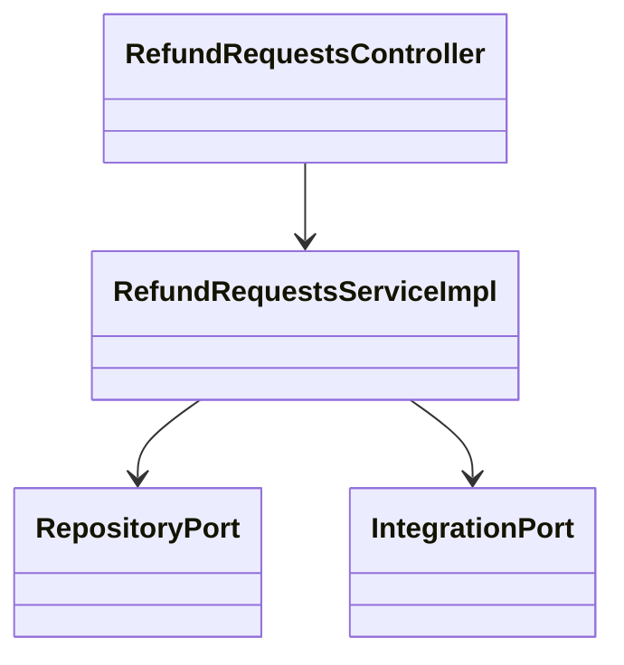
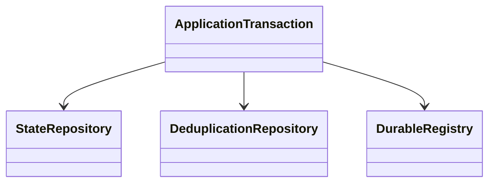
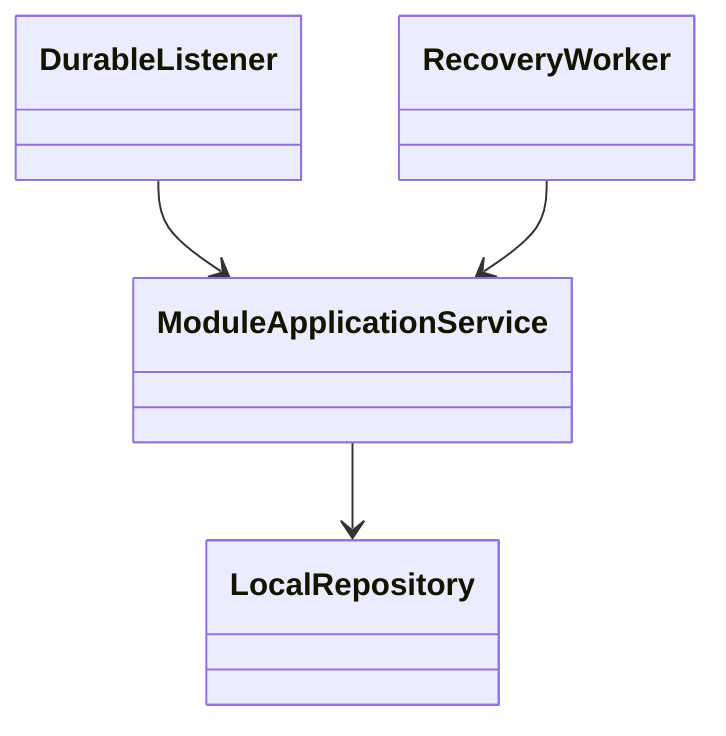
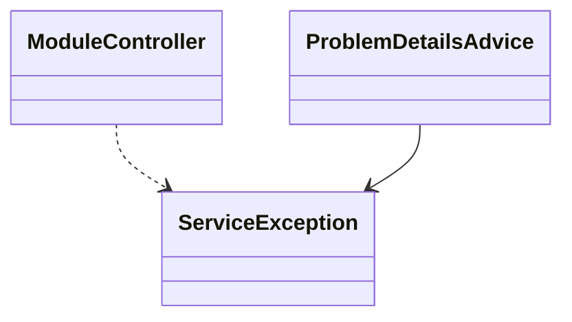
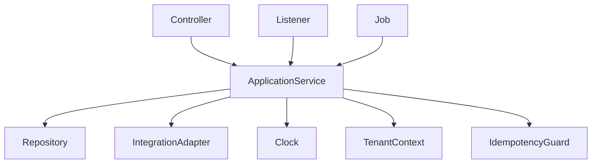
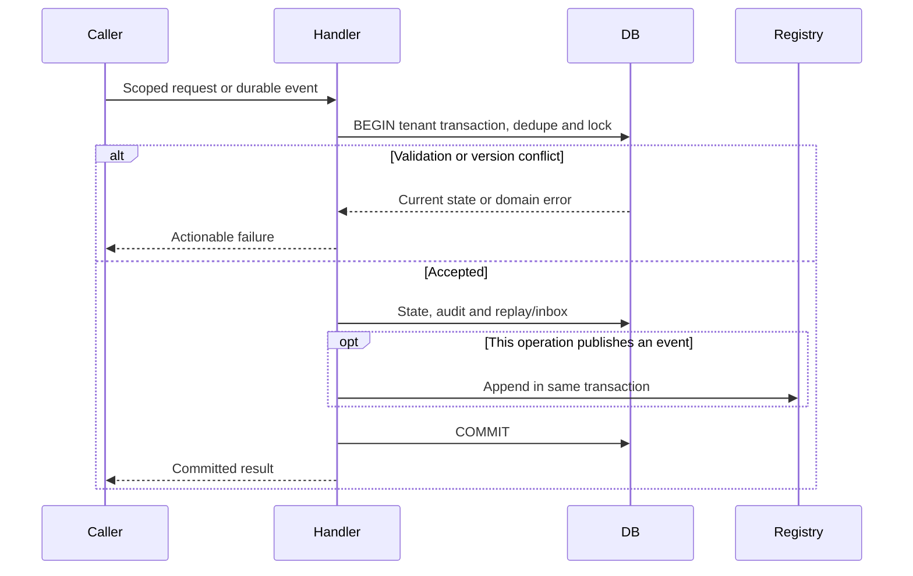

<!--
CHUNK: 04
TITLE: Per-Service Implementation - refund-requests
PROJECT: Refunds Platform
VERSION: 1.1
PART OF: LLD - Refunds Platform
MODE: from-sdd
-->

# 7. Per-Service Implementation - refund-requests

> **Bounded context:** [SDD §17 refund-requests](../../sdd-refunds-platform/13b-service-refund-requests.md)
>
> **Type:** module, in the single refunds-platform deployable.
>
> **Source code:** Not applicable - Greenfield from-sdd build target.
>
> **Owns use cases (SDD 09):** [REFUNDS/UC-01](../../brd-refunds-portal/06a-use-cases-customer.md#uc-01-request-a-refund), [REFUNDS/UC-02](../../brd-refunds-portal/06a-use-cases-customer.md#uc-02-track-refund-status), [REFUNDS/UC-03](../../brd-refunds-portal/06a-use-cases-customer.md#uc-03-cancel-a-refund-request), [REFUNDS/UC-04](../../brd-refunds-portal/06b-use-cases-branch-manager.md#uc-04-approve--reject-refund)
>
> **Participates in:** See event participation in §7.2.

## 7.1 Responsibility

Own receipt snapshots, refund decisions and history, branch scope, reports, and the POS items notice. Preserve the purchase-level card-paid ceiling under concurrency. Contract and scope home: [SDD §17 refund-requests](../../sdd-refunds-platform/13b-service-refund-requests.md).

## 7.2 Class & Interface Map

> Confirm: refund-requests class names and method signatures are proposed; verify during implementation against [SDD §17 refund-requests](../../sdd-refunds-platform/13b-service-refund-requests.md).

### Controllers

| Class | Endpoints | Notes |
| --- | --- | --- |
| RefundRequestsController | `POST /v1/receipt-lookups` | `@UseCase("REFUNDS/UC-01")` |
| RefundRequestsController | `POST /v1/refund-requests` | `@UseCase("REFUNDS/UC-01")` |
| RefundRequestsController | `GET /v1/refund-requests` | `@UseCase("REFUNDS/UC-02")` |
| RefundRequestsController | `GET /v1/refund-requests/{refundRequestId}` | `@UseCase("REFUNDS/UC-02")` |
| RefundRequestsController | `POST /v1/refund-requests/{refundRequestId}/cancellation` | `@UseCase("REFUNDS/UC-03")` |
| RefundRequestsController | `GET /v1/branch-refund-requests` | `@UseCase("REFUNDS/UC-04")` |
| RefundRequestsController | `GET /v1/branch-refund-requests/{refundRequestId}` | None - endpoint not in SDD section 7.3 entry-point register |
| RefundRequestsController | `POST /v1/refund-requests/{refundRequestId}/decision` | `@UseCase("REFUNDS/UC-04")` |
| RefundRequestsController | `GET /v1/branch-refund-reports` | None - section-derived endpoint |
| RefundRequestsEventListener | `Event: RefundRequestSubmitted` | None - participating or platform listener |
| RefundRequestsEventListener | `Event: RefundRequestCancelled` | None - participating or platform listener |
| RefundRequestsEventListener | `Event: RefundRequestRejected` | None - participating or platform listener |
| RefundRequestsEventListener | `Event: PayoutSucceeded` | None - participating or platform listener |
| RefundRequestsEventListener | `Event: PayoutFailedFinally` | None - participating or platform listener |
| RefundRequestsEventListener | `Event: RefundPayoutFailed` | None - participating or platform listener |
| RefundRequestsJob | `Schedule: waiting-requests-summary` | `@UseCase("REFUNDS/UC-04")` |
| RefundRequestsJob | `Schedule: branch-assignment-refresh` | None - system workflow |
| RefundRequestsJob | `Schedule: items-notice-send` | None - system workflow |
| RefundRequestsJob | `Schedule: refund-record-retention` | None - system workflow |

### Services (interfaces)

| Interface | Purpose | Implementations |
| --- | --- | --- |
| RefundRequestsService | Own receipt snapshots, refund decisions and history, branch scope, reports, and the POS items notice. Preserve the purchase-level card-paid ceiling under concurrency. | RefundRequestsServiceImpl |

### Service Implementations

| Class | Implements | Key methods |
| --- | --- | --- |
| RefundRequestsServiceImpl | RefundRequestsService | See method-level algorithm below |
| RefundRequestsEventListener | Durable listener adapter | RefundRequestSubmitted, RefundRequestCancelled, RefundRequestRejected, PayoutSucceeded, PayoutFailedFinally, RefundPayoutFailed |
| RefundRequestsJob | Tenant-aware runner | waiting-requests-summary, branch-assignment-refresh, items-notice-send, refund-record-retention |

### Repositories

| Class | Entity | Notes |
| --- | --- | --- |
| RefundRequestRepository | refund_request | Module-owned schema; tenant filter + RLS; see §8.2 |
| RefundRequestItemRepository | refund_request_item | Module-owned schema; tenant filter + RLS; see §8.2 |
| RefundStatusHistoryRepository | refund_status_history | Module-owned schema; tenant filter + RLS; see §8.2 |
| ItemsNoticeRepository | items_notice | Module-owned schema; tenant filter + RLS; see §8.2 |
| PurchaseLockRepository | purchase_lock | Module-owned schema; tenant filter + RLS; see §8.2 |
| ReceiptLookupRepository | receipt_lookup | Module-owned schema; tenant filter + RLS; see §8.2 |
| ReceiptLookupItemRepository | receipt_lookup_item | Module-owned schema; tenant filter + RLS; see §8.2 |
| BranchRepository | branch | Module-owned schema; tenant filter + RLS; see §8.2 |
| BranchAssignmentRepository | branch_assignment | Module-owned schema; tenant filter + RLS; see §8.2 |
| StaffSessionRepository | staff_session | Module-owned schema; tenant filter + RLS; see §8.2 |
| RolePermissionRepository | role_permission | Module-owned schema; tenant filter + RLS; see §8.2 |
| InboxEntryRepository | inbox_entry | Module-owned schema; tenant filter + RLS; see §8.2 |
| IdempotencyRecordRepository | idempotency_record | Module-owned schema; tenant filter + RLS; see §8.2 |

### Domain Types (records)

Key signatures above use source DTO names; Subject, TenantContext, PageQuery and verified provider command types are proposed implementation records. Domain records and validations use the exact DTO names in [SDD §17 refund-requests](../../sdd-refunds-platform/13b-service-refund-requests.md). Persistence entities map only that module's §8.2 tables. `Money` is EUR decimal(19,4); `Clock`, tenant context and publication identity are injected, not read from static state.

### Method Signatures (key methods only)

```java
public interface RefundRequestsService {
  ReceiptLookupResponse lookup(ReceiptLookupRequest command, Subject caller, TenantContext tenant, IdempotencyKey key);
  RefundRequestResponse submit(RefundRequestCreateRequest command, Subject caller, TenantContext tenant, IdempotencyKey key);
  RefundRequestPage listOwn(Subject caller, PageQuery page, TenantContext tenant);
  RefundRequestDetailResponse ownDetail(UUID requestId, Subject caller, TenantContext tenant);
  RefundRequestResponse cancel(UUID requestId, CancellationRequest command, Subject caller, TenantContext tenant, IdempotencyKey key);
  BranchRefundRequestPage branchQueue(Subject staff, BranchQueueQuery query, TenantContext tenant);
  RefundRequestDetailResponse branchDetail(UUID requestId, Subject staff, TenantContext tenant);
  RefundRequestResponse decide(UUID requestId, DecisionRequest command, Subject staff, TenantContext tenant, IdempotencyKey key);
  BranchRefundReport report(Subject staff, ReportQuery query, TenantContext tenant);
}
```

### Ports and Adapters (in-process contracts)

| Port interface | Operation | API ID (§15) | Role here | Adapter class |
| --- | --- | --- | --- | --- |
| BranchRecipientsPort | getRecipients | API-13 | Provider | BranchRecipientsPortAdapter |

Contract home: [SDD §15](../../sdd-refunds-platform/11-api-contracts.md); binding view: [§9.6](../06-api-contracts.md#96-in-process-port-contracts-sdd-15). No HTTP resilience wrapper around a port.

### Authorization

| Entry point | Kind | Permission token (SDD §16, verbatim) | Enforcement point |
| --- | --- | --- | --- |
| `POST /v1/receipt-lookups` | REST | `refund-requests.receipt.lookup` | Method permission plus subject/branch guard; public route rate limit |
| `POST /v1/refund-requests` | REST | `refund-requests.request.create` | Method permission plus subject/branch guard; public route rate limit |
| `GET /v1/refund-requests` | REST | `refund-requests.request.read-own` | Method permission plus subject/branch guard; public route rate limit |
| `GET /v1/refund-requests/{refundRequestId}` | REST | `refund-requests.request.read-own` | Method permission plus subject/branch guard; public route rate limit |
| `POST /v1/refund-requests/{refundRequestId}/cancellation` | REST | `refund-requests.request.cancel-own` | Method permission plus subject/branch guard; public route rate limit |
| `GET /v1/branch-refund-requests` | REST | `refund-requests.branch-request.read` | Method permission plus subject/branch guard; public route rate limit |
| `GET /v1/branch-refund-requests/{refundRequestId}` | REST | `refund-requests.branch-request.read` | Method permission plus subject/branch guard; public route rate limit |
| `POST /v1/refund-requests/{refundRequestId}/decision` | REST | `refund-requests.request.decide` | Method permission plus subject/branch guard; public route rate limit |
| `GET /v1/branch-refund-reports` | REST | `refund-requests.branch-report.read` | Method permission plus subject/branch guard; public route rate limit |
| Event: RefundRequestSubmitted | Listener | None - system consumer | Trusted durable publication, explicit tenant context |
| Event: RefundRequestCancelled | Listener | None - system consumer | Trusted durable publication, explicit tenant context |
| Event: RefundRequestRejected | Listener | None - system consumer | Trusted durable publication, explicit tenant context |
| Event: PayoutSucceeded | Listener | None - system consumer | Trusted durable publication, explicit tenant context |
| Event: PayoutFailedFinally | Listener | None - system consumer | Trusted durable publication, explicit tenant context |
| Event: RefundPayoutFailed | Listener | None - system consumer | Trusted durable publication, explicit tenant context |
| Schedule: waiting-requests-summary | Job | None - system job | Job lock and per-tenant transaction |
| Schedule: branch-assignment-refresh | Job | None - system job | Job lock and per-tenant transaction |
| Schedule: items-notice-send | Job | None - system job | Job lock and per-tenant transaction |
| Schedule: refund-record-retention | Job | None - system job | Job lock and per-tenant transaction |
| BranchRecipientsPort.getRecipients | Port | `refund-requests.branch-recipients.read` | Fixed module identity guard in adapter |

## 7.3 Method-Level Pseudocode (non-trivial logic only)

Source: [SDD §17 refund-requests](../../sdd-refunds-platform/13b-service-refund-requests.md) Business Logic.

> Confirm: refund-requests pseudocode combines the stated algorithm with inferred lock/transaction wiring; verify failure and concurrency paths in PostgreSQL integration tests.

### RefundRequestsServiceImpl.lookup and submit

```text
lookup: call API-01 outside a DB transaction, with a two-second timeout and no retry.
  Distinguish no match (E2) from provider unavailable (E4); check card share (E3),
  branch calendar window (E1) and selectability (A1/E5). Persist a 30-minute snapshot.
  Split the receipt discount proportionally; use Money with scale four, EUR only.
submit: in the tenant transaction reserve idempotency; lock purchase_lock first.
  Load caller-owned unexpired lookup; recompute branch date and day-30 eligibility.
  Recheck item uniqueness and authoritative local reservations, not only snapshot flags.
  Compute requested amount; compare with card_paid_amount less APPROVED and PAID amounts.
  SUBMITTED requests do not reserve card share; Cancelled frees active item reservations.
  Insert request SUBMITTED, selected items, history, RefundRequestSubmitted publication,
  and replay response in the same commit. A constraint race maps to a domain conflict.
```

### RefundRequestsServiceImpl.cancel, decide and payout outcome

```text
cancel: require caller ownership; lock purchase before request; condition update on
  status SUBMITTED and supplied version. Conflict returns current state, no event.
  Set CANCELLED and item.active=false; append history + RefundRequestCancelled in one commit.
decide: require branch managed or covered on today's branch date, not just a role token.
  Lock purchase first, then request. Require SUBMITTED + supplied version.
  APPROVE: 0 < amount <= requested and remaining card share; lower amount requires reason.
  REJECT: require reason. Commit history + appropriate approved/rejected publication + replay.
  Exceeding current share returns CARD_PAID_AMOUNT_EXCEEDED with maxApprovable; re-fetch.
onPayoutSucceeded: inbox + status/version guard APPROVED -> PAID; append history + RefundPaid.
  refundDate is derived once here from the branch's zone, not by points or notifications.
onPayoutFailedFinally: inbox + APPROVED -> PAYOUT_FAILED; append history + RefundPayoutFailed.
  A repeated or invalid-state result emits nothing; no terminal state is reversed.
```

### PosNoticeWorker and branch jobs

```text
event listener: upsert items_notice due under request lock and commit with inbox completion.
worker: recompute wanted state from current request: SUBMITTED/APPROVED/PAID = HELD,
  CANCELLED/REJECTED/PAYOUT_FAILED = FREED. Send only if different from last acknowledged.
  A never-attempted held notice followed by cancellation needs no provider call.
  Call API-02 outside DB transaction; unknown outcome retries the same notice identity.
  Persist acknowledged state only after provider success; a changed desired state stays due.
staff refresh: every 15 minutes and once on first request of a staff session; outside tx API-06.
  Atomically replace last-synced assignments; fallback to that set on failure; alert at 30 min.
waiting-requests-summary: once/branch/business-day at configured hour; count SUBMITTED only;
  publish WaitingRequestsSummarised with branch country and business date in the same commit.
report: read only authorized branches through end of previous branch day; stream JSON/CSV/XLSX.
unlink: after seven years clear all identifying fields specified by SDD Retention Policy,
  including audit actor ids, lookup/item references and free text; retain dates and amounts;
  atomically emit RefundRequestUnlinked once with the former account id before clearing it.
```

Rejected and payout-failed items remain locally active per the BRD even when POS is told FREED. Do not change that business rule to make the two states look alike.

## 7.4 Design Patterns Applied

### Pattern: Hexagonal composition

**Applied rule:** CLAUDE.md composition over inheritance; SDD §6 requires hexagonal modules and isolated data. **Rationale:** transport/provider adapters cannot reach another module's persistence. **Roles:** RefundRequestsServiceImpl is the application context; repositories and provider/module ports are injected adapters.



**Summary:** The application service composes persistence and integration ports through constructor injection. Each concrete adapter stays in its module.

```text
Controller validates transport input -> application port
Application validates domain command -> owned repository / permitted integration port
Adapters translate transport errors; domain raises ServiceException with stable code
```

### Pattern: Durable outbox and idempotent work

**Applied rule:** CLAUDE.md at-least-once consumer idempotency and mandatory outbox for emitted state changes. **Rationale:** committed state cannot lose its downstream publication; redelivery cannot create duplicate provider work. **Roles:** application transaction owns state and inbox; platform.event_publication is the atomic registry; module worker owns provider acknowledgement.



**Summary:** State and deduplication commit together. Any outgoing durable event joins that same commit; provider acknowledgement completes separate work.

```text
BEGIN tenant transaction
lock business key; reject changed idempotency hash or detect applied event
write aggregate + inbox/replay + any outgoing durable publication
COMMIT; only then call an external provider; persist acknowledged result separately
worker: load due source work with stable key/payload; send outside transaction
if acknowledged: commit source work completion; if state changed meanwhile, keep new work due
if failed/timed out: keep work incomplete and retry same identity with source backoff
crash after acknowledgement before completion: resend original identity; provider dedup contract required
```

### Pattern: Choreography and local compensation

**Applied rule:** CLAUDE.md event-driven choreography for cross-boundary business transactions, no distributed 2PC. **Rationale:** module commits survive external failure without a transaction crossing providers. **Roles:** the named module application service commits its local step; stable listeners and source workers advance the next step. This module's steps and compensation are: Decision publishes approval; payout outcome guards Approved to Paid/Payout failed; terminal publication drives messages and points. Cancellation is allowed only while Submitted, never compensation after approval.



**Summary:** This is source choreography with local commit/retry boundaries, not a new central orchestrator. Compensation is limited to the source actions stated above.

```text
onSourceEvent: begin tenant transaction; dedupe source identity; apply guarded local step
commit local state + inbox + any source-defined outgoing publication
onFailure: rollback local step; retry original source identity through the source schedule
onGiveUp: source terminal failure/park + alert; do not invent a reverse business transition
```

### Pattern: Central RFC 9457 boundary adapter

**Applied rule:** CLAUDE.md global RestControllerAdvice and base ServiceException. **Rationale:** the module controller cannot leak provider/SQL/PII internals while the domain retains stable source errorCode. **Roles:** module controller invokes application service; shared ProblemDetailsAdvice translates ServiceException; §7.7 supplies the module mapping.



**Summary:** Advice is shared deployable infrastructure; the module owns its domain errors and user scope checks.

```text
catch ServiceException at HTTP boundary -> source status/code + sanitized ProblemDetails
catch unexpected exception -> sanitized server failure + traceId; log no PII payload
port/listener errors remain typed and obey their source transaction/retry rules
```

## 7.5 Dependency Injection Graph



**Summary:** Backend wiring uses constructor injection only. Runtime modules share the injected clock and platform transaction/tenant infrastructure, not their repositories.

## 7.6 Transaction Boundaries

| Method | Propagation | Isolation | Rollback rules |
| --- | --- | --- | --- |
| RefundRequestsServiceImpl mutation | REQUIRED | READ_COMMITTED + source row locks/version checks | Any failure rolls back state + inbox/replay + publication |
| RefundRequestsServiceImpl read | REQUIRED read-only | REPEATABLE_READ for balance/history or multi-query snapshot | No fallback data on failure |
| RefundRequestsEventListener | Own REQUIRED after publisher commit | READ_COMMITTED | Retry only after rollback; completion after durable work commit |
| RefundRequestsJob | One explicit tenant transaction per unit of work | READ_COMMITTED | Provider calls outside transaction; finally restore context |


> Confirm: transaction propagation and read snapshot isolation are implementation choices; ports use the SDD contract verbatim in §9.6. Fault-test lock order and rollback visibility.

Business errors that must persist counters/outcomes use an outcome record committed before the transport layer raises the error. No REQUIRES_NEW publication insert. No whole-workflow database transaction across external calls.

## 7.7 Error Handling

| Exception | RFC 9457 type | errorCode (SDD §15.1) | HTTP Status | When thrown | Caller action |
| --- | --- | --- | --- | --- | --- |
| NotFoundServiceException | urn:refunds-platform:problem:not-found | NOT_FOUND | 404 | Scoped row absent | Correct reference; do not reveal another tenant |
| ValidationServiceException | urn:refunds-platform:problem:validation | VALIDATION_FAILED | 400 / 422 per source endpoint | Payload/domain rule invalid | Explain fix; no raw code displayed |
| ConflictServiceException | urn:refunds-platform:problem:conflict | CONFLICT | 409 | Changed key/hash, stale version or business-key race | Refetch; retain key for exact retry |
| UnavailableServiceException | urn:refunds-platform:problem:unavailable | UNAVAILABLE | 503 | Dependency/read unavailable | Try later; no invented data |

Domain-specific errors and statuses remain as [SDD §17 refund-requests](../../sdd-refunds-platform/13b-service-refund-requests.md) Error Handling and [SDD §15](../../sdd-refunds-platform/11-api-contracts.md) specify. Port errors are raised domain errors, not HTTP statuses. `ServiceException` is translated centrally.

## 7.8 Use-Case Workflows

### REFUNDS/UC-01: Request a Refund

> **Traceability:** BRD [REFUNDS/UC-01](../../brd-refunds-portal/06a-use-cases-customer.md#uc-01-request-a-refund) · SDD [§7.3](../../sdd-refunds-platform/03-users-and-use-cases.md#73-use-case-traceability-brd--sdd) · Owner: refund-requests · Entry points: `POST /v1/receipt-lookups`, `POST /v1/refund-requests` · UAT/BAT: [REFUNDS/TC-ACC-04](../../brd-refunds-portal/16-uat-bat-test-cases.md#1-sign-up-and-sign-in-uc-06-uc-04-mk-04-mk-03), [REFUNDS/TC-REQ-01](../../brd-refunds-portal/16-uat-bat-test-cases.md#2-refund-requests-uc-01-uc-02-uc-03-mk-01-scr-01-mk-02-scr-02-nfr-04), [REFUNDS/TC-REQ-02](../../brd-refunds-portal/16-uat-bat-test-cases.md#2-refund-requests-uc-01-uc-02-uc-03-mk-01-scr-01-mk-02-scr-02-nfr-04), [REFUNDS/TC-REQ-03](../../brd-refunds-portal/16-uat-bat-test-cases.md#2-refund-requests-uc-01-uc-02-uc-03-mk-01-scr-01-mk-02-scr-02-nfr-04), [REFUNDS/TC-REQ-04](../../brd-refunds-portal/16-uat-bat-test-cases.md#2-refund-requests-uc-01-uc-02-uc-03-mk-01-scr-01-mk-02-scr-02-nfr-04), [REFUNDS/TC-REQ-09](../../brd-refunds-portal/16-uat-bat-test-cases.md#2-refund-requests-uc-01-uc-02-uc-03-mk-01-scr-01-mk-02-scr-02-nfr-04), [REFUNDS/TC-REQ-10](../../brd-refunds-portal/16-uat-bat-test-cases.md#2-refund-requests-uc-01-uc-02-uc-03-mk-01-scr-01-mk-02-scr-02-nfr-04), [REFUNDS/TC-REQ-11](../../brd-refunds-portal/16-uat-bat-test-cases.md#2-refund-requests-uc-01-uc-02-uc-03-mk-01-scr-01-mk-02-scr-02-nfr-04), [REFUNDS/TC-REQ-12](../../brd-refunds-portal/16-uat-bat-test-cases.md#2-refund-requests-uc-01-uc-02-uc-03-mk-01-scr-01-mk-02-scr-02-nfr-04), [REFUNDS/TC-REQ-13](../../brd-refunds-portal/16-uat-bat-test-cases.md#2-refund-requests-uc-01-uc-02-uc-03-mk-01-scr-01-mk-02-scr-02-nfr-04), [REFUNDS/TC-REQ-14](../../brd-refunds-portal/16-uat-bat-test-cases.md#2-refund-requests-uc-01-uc-02-uc-03-mk-01-scr-01-mk-02-scr-02-nfr-04), [REFUNDS/TC-REQ-15](../../brd-refunds-portal/16-uat-bat-test-cases.md#2-refund-requests-uc-01-uc-02-uc-03-mk-01-scr-01-mk-02-scr-02-nfr-04), [REFUNDS/TC-REQ-16](../../brd-refunds-portal/16-uat-bat-test-cases.md#2-refund-requests-uc-01-uc-02-uc-03-mk-01-scr-01-mk-02-scr-02-nfr-04), [REFUNDS/TC-REQ-17](../../brd-refunds-portal/16-uat-bat-test-cases.md#2-refund-requests-uc-01-uc-02-uc-03-mk-01-scr-01-mk-02-scr-02-nfr-04), [REFUNDS/TC-REQ-18](../../brd-refunds-portal/16-uat-bat-test-cases.md#2-refund-requests-uc-01-uc-02-uc-03-mk-01-scr-01-mk-02-scr-02-nfr-04), [REFUNDS/TC-REQ-22](../../brd-refunds-portal/16-uat-bat-test-cases.md#2-refund-requests-uc-01-uc-02-uc-03-mk-01-scr-01-mk-02-scr-02-nfr-04), [REFUNDS/TC-REQ-23](../../brd-refunds-portal/16-uat-bat-test-cases.md#2-refund-requests-uc-01-uc-02-uc-03-mk-01-scr-01-mk-02-scr-02-nfr-04), [REFUNDS/TC-UIX-01](../../brd-refunds-portal/16-uat-bat-test-cases.md#5-cross-cutting-uiux-standards-chunk-11), [REFUNDS/TC-UIX-05](../../brd-refunds-portal/16-uat-bat-test-cases.md#5-cross-cutting-uiux-standards-chunk-11), [REFUNDS/TC-UIX-08](../../brd-refunds-portal/16-uat-bat-test-cases.md#5-cross-cutting-uiux-standards-chunk-11) · Screens: [REFUNDS/MK-01](../../brd-refunds-portal/14-todo.md#mockup-coverage) via `/refunds/request`

**Trigger:** `POST /v1/receipt-lookups`, `POST /v1/refund-requests`; handlers carry `@UseCase("REFUNDS/UC-01")`.

**Pre-conditions:** Customer signed in with a branch receipt.

**Post-conditions:** Request committed as Submitted or no request on a refusal.

**Control flow:**

1. Validate receipt outside transaction; show nonselectable units (A1).
2. Map E1-E5 distinctly.
3. On submit lock purchase, recheck day 30 and all items, then commit request/history/publication/replay.
4. Details and exception mapping: §7.3 above and [REFUNDS/UC-01](../../brd-refunds-portal/06a-use-cases-customer.md#uc-01-request-a-refund).



**Summary:** The flow checks tenant and concurrency guards before committing state, deduplication, and any publication atomically. Provider work starts after commit.

**Idempotency points:** Reads are repeatable; every write requires tenant/key plus request hash and first outcome; listeners use stable publication identity.

**Outbox emission points:** RefundRequestSubmitted

**Retry / timeout policy:** API-01 two seconds without retry; API-02 uses the durable POS worker.

**Error handling:** §7.7 plus the E/A paths above; all expected results stay in the linked BRD tests.

### REFUNDS/UC-02: Track Refund Status

> **Traceability:** BRD [REFUNDS/UC-02](../../brd-refunds-portal/06a-use-cases-customer.md#uc-02-track-refund-status) · SDD [§7.3](../../sdd-refunds-platform/03-users-and-use-cases.md#73-use-case-traceability-brd--sdd) · Owner: refund-requests · Entry points: `GET /v1/refund-requests`, `GET /v1/refund-requests/{refundRequestId}` · UAT/BAT: [REFUNDS/TC-ACC-05](../../brd-refunds-portal/16-uat-bat-test-cases.md#1-sign-up-and-sign-in-uc-06-uc-04-mk-04-mk-03), [REFUNDS/TC-REQ-05](../../brd-refunds-portal/16-uat-bat-test-cases.md#2-refund-requests-uc-01-uc-02-uc-03-mk-01-scr-01-mk-02-scr-02-nfr-04), [REFUNDS/TC-REQ-06](../../brd-refunds-portal/16-uat-bat-test-cases.md#2-refund-requests-uc-01-uc-02-uc-03-mk-01-scr-01-mk-02-scr-02-nfr-04), [REFUNDS/TC-REQ-19](../../brd-refunds-portal/16-uat-bat-test-cases.md#2-refund-requests-uc-01-uc-02-uc-03-mk-01-scr-01-mk-02-scr-02-nfr-04), [REFUNDS/TC-REQ-20](../../brd-refunds-portal/16-uat-bat-test-cases.md#2-refund-requests-uc-01-uc-02-uc-03-mk-01-scr-01-mk-02-scr-02-nfr-04), [REFUNDS/TC-UIX-02](../../brd-refunds-portal/16-uat-bat-test-cases.md#5-cross-cutting-uiux-standards-chunk-11), [REFUNDS/TC-UIX-09](../../brd-refunds-portal/16-uat-bat-test-cases.md#5-cross-cutting-uiux-standards-chunk-11), [REFUNDS/TC-UIX-11](../../brd-refunds-portal/16-uat-bat-test-cases.md#5-cross-cutting-uiux-standards-chunk-11) · Screens: [REFUNDS/MK-02](../../brd-refunds-portal/14-todo.md#mockup-coverage) via `/refunds/requests`, `/refunds/requests/:refundRequestId`

**Trigger:** `GET /v1/refund-requests`, `GET /v1/refund-requests/{refundRequestId}`; handlers carry `@UseCase("REFUNDS/UC-02")`.

**Pre-conditions:** Customer signed in.

**Post-conditions:** Caller sees only own requests and history.

**Control flow:**

1. Page the own-customer query at 20 by default; whitelist sorting.
2. Show A1 empty.
3. Open own detail including partial/rejection reason and payout-failed state; foreign id answers not found.
4. Details and exception mapping: §7.3 above and [REFUNDS/UC-02](../../brd-refunds-portal/06a-use-cases-customer.md#uc-02-track-refund-status).


**Idempotency points:** Reads are repeatable; every write requires tenant/key plus request hash and first outcome; listeners use stable publication identity.

**Outbox emission points:** None - read only.

**Retry / timeout policy:** No provider call; DB failure returns actionable error, never fabricated empty data.

**Error handling:** §7.7 plus the E/A paths above; all expected results stay in the linked BRD tests.

### REFUNDS/UC-03: Cancel a Refund Request

> **Traceability:** BRD [REFUNDS/UC-03](../../brd-refunds-portal/06a-use-cases-customer.md#uc-03-cancel-a-refund-request) · SDD [§7.3](../../sdd-refunds-platform/03-users-and-use-cases.md#73-use-case-traceability-brd--sdd) · Owner: refund-requests · Entry points: `POST /v1/refund-requests/{refundRequestId}/cancellation` · UAT/BAT: [REFUNDS/TC-ACC-05](../../brd-refunds-portal/16-uat-bat-test-cases.md#1-sign-up-and-sign-in-uc-06-uc-04-mk-04-mk-03), [REFUNDS/TC-REQ-07](../../brd-refunds-portal/16-uat-bat-test-cases.md#2-refund-requests-uc-01-uc-02-uc-03-mk-01-scr-01-mk-02-scr-02-nfr-04), [REFUNDS/TC-REQ-08](../../brd-refunds-portal/16-uat-bat-test-cases.md#2-refund-requests-uc-01-uc-02-uc-03-mk-01-scr-01-mk-02-scr-02-nfr-04), [REFUNDS/TC-REQ-21](../../brd-refunds-portal/16-uat-bat-test-cases.md#2-refund-requests-uc-01-uc-02-uc-03-mk-01-scr-01-mk-02-scr-02-nfr-04), [REFUNDS/TC-REQ-22](../../brd-refunds-portal/16-uat-bat-test-cases.md#2-refund-requests-uc-01-uc-02-uc-03-mk-01-scr-01-mk-02-scr-02-nfr-04), [REFUNDS/TC-UIX-02](../../brd-refunds-portal/16-uat-bat-test-cases.md#5-cross-cutting-uiux-standards-chunk-11), [REFUNDS/TC-UIX-06](../../brd-refunds-portal/16-uat-bat-test-cases.md#5-cross-cutting-uiux-standards-chunk-11), [REFUNDS/TC-UIX-09](../../brd-refunds-portal/16-uat-bat-test-cases.md#5-cross-cutting-uiux-standards-chunk-11) · Screens: [REFUNDS/MK-02](../../brd-refunds-portal/14-todo.md#mockup-coverage) via `/refunds/requests`, `/refunds/requests/:refundRequestId`

**Trigger:** `POST /v1/refund-requests/{refundRequestId}/cancellation`; handlers carry `@UseCase("REFUNDS/UC-03")`.

**Pre-conditions:** Caller owns a Submitted request.

**Post-conditions:** Cancellation commits once or current decided state is returned.

**Control flow:**

1. Show confirmation.
2. Conditional tenant/customer/status/version mutation prevents decision race (E1/E2).
3. Cancel, free active units, append history and event atomically.
4. Details and exception mapping: §7.3 above and [REFUNDS/UC-03](../../brd-refunds-portal/06a-use-cases-customer.md#uc-03-cancel-a-refund-request).


**Summary:** The flow checks tenant and concurrency guards before committing state, deduplication, and any publication atomically. Provider work starts after commit.

**Idempotency points:** Reads are repeatable; every write requires tenant/key plus request hash and first outcome; listeners use stable publication identity.

**Outbox emission points:** RefundRequestCancelled

**Retry / timeout policy:** No inline provider call; durable notifications and POS notice retry independently.

**Error handling:** §7.7 plus the E/A paths above; all expected results stay in the linked BRD tests.

### REFUNDS/UC-04: Approve / Reject Refund

> **Traceability:** BRD [REFUNDS/UC-04](../../brd-refunds-portal/06b-use-cases-branch-manager.md#uc-04-approve--reject-refund) · SDD [§7.3](../../sdd-refunds-platform/03-users-and-use-cases.md#73-use-case-traceability-brd--sdd) · Owner: refund-requests · Entry points: `GET /v1/branch-refund-requests`, `POST /v1/refund-requests/{refundRequestId}/decision`, `Schedule: waiting-requests-summary` · UAT/BAT: [REFUNDS/TC-ACC-16](../../brd-refunds-portal/16-uat-bat-test-cases.md#1-sign-up-and-sign-in-uc-06-uc-04-mk-04-mk-03), [REFUNDS/TC-REQ-23](../../brd-refunds-portal/16-uat-bat-test-cases.md#2-refund-requests-uc-01-uc-02-uc-03-mk-01-scr-01-mk-02-scr-02-nfr-04), [REFUNDS/TC-DEC-01](../../brd-refunds-portal/16-uat-bat-test-cases.md#3-refund-decisions-uc-04-mk-03-nfr-04), [REFUNDS/TC-DEC-02](../../brd-refunds-portal/16-uat-bat-test-cases.md#3-refund-decisions-uc-04-mk-03-nfr-04), [REFUNDS/TC-DEC-03](../../brd-refunds-portal/16-uat-bat-test-cases.md#3-refund-decisions-uc-04-mk-03-nfr-04), [REFUNDS/TC-DEC-04](../../brd-refunds-portal/16-uat-bat-test-cases.md#3-refund-decisions-uc-04-mk-03-nfr-04), [REFUNDS/TC-DEC-05](../../brd-refunds-portal/16-uat-bat-test-cases.md#3-refund-decisions-uc-04-mk-03-nfr-04), [REFUNDS/TC-DEC-06](../../brd-refunds-portal/16-uat-bat-test-cases.md#3-refund-decisions-uc-04-mk-03-nfr-04), [REFUNDS/TC-DEC-07](../../brd-refunds-portal/16-uat-bat-test-cases.md#3-refund-decisions-uc-04-mk-03-nfr-04), [REFUNDS/TC-DEC-08](../../brd-refunds-portal/16-uat-bat-test-cases.md#3-refund-decisions-uc-04-mk-03-nfr-04), [REFUNDS/TC-DEC-09](../../brd-refunds-portal/16-uat-bat-test-cases.md#3-refund-decisions-uc-04-mk-03-nfr-04), [REFUNDS/TC-DEC-10](../../brd-refunds-portal/16-uat-bat-test-cases.md#3-refund-decisions-uc-04-mk-03-nfr-04), [REFUNDS/TC-DEC-11](../../brd-refunds-portal/16-uat-bat-test-cases.md#3-refund-decisions-uc-04-mk-03-nfr-04), [REFUNDS/TC-DEC-12](../../brd-refunds-portal/16-uat-bat-test-cases.md#3-refund-decisions-uc-04-mk-03-nfr-04), [REFUNDS/TC-DEC-13](../../brd-refunds-portal/16-uat-bat-test-cases.md#3-refund-decisions-uc-04-mk-03-nfr-04), [REFUNDS/TC-DEC-14](../../brd-refunds-portal/16-uat-bat-test-cases.md#3-refund-decisions-uc-04-mk-03-nfr-04), [REFUNDS/TC-DEC-15](../../brd-refunds-portal/16-uat-bat-test-cases.md#3-refund-decisions-uc-04-mk-03-nfr-04), [REFUNDS/TC-UIX-02](../../brd-refunds-portal/16-uat-bat-test-cases.md#5-cross-cutting-uiux-standards-chunk-11), [REFUNDS/TC-UIX-06](../../brd-refunds-portal/16-uat-bat-test-cases.md#5-cross-cutting-uiux-standards-chunk-11), [REFUNDS/TC-UIX-09](../../brd-refunds-portal/16-uat-bat-test-cases.md#5-cross-cutting-uiux-standards-chunk-11), [REFUNDS/TC-UIX-11](../../brd-refunds-portal/16-uat-bat-test-cases.md#5-cross-cutting-uiux-standards-chunk-11) · Screens: [REFUNDS/MK-03](../../brd-refunds-portal/14-todo.md#mockup-coverage) via `/refunds/branch`, `/refunds/branch/:refundRequestId`

**Trigger:** `GET /v1/branch-refund-requests`, `POST /v1/refund-requests/{refundRequestId}/decision`, `Schedule: waiting-requests-summary`; handlers carry `@UseCase("REFUNDS/UC-04")`.

**Pre-conditions:** Branch Manager runs or covers today's branch.

**Post-conditions:** Decision commits once; payout finishes asynchronously.

**Control flow:**

1. Read oldest Submitted requests; detail proposes min(requested,maxApprovable).
2. Approve full/lower amount with A1 reason or reject with A2 reason.
3. A3 payout-failed detail is view only.
4. Guard cancelled-meanwhile E2.
5. Payout workers keep Approved until success or 24-hour failure E1.
6. Daily summary includes waiting Submitted requests and active covers.
7. Details and exception mapping: §7.3 above and [REFUNDS/UC-04](../../brd-refunds-portal/06b-use-cases-branch-manager.md#uc-04-approve--reject-refund).


**Summary:** The flow checks tenant and concurrency guards before committing state, deduplication, and any publication atomically. Provider work starts after commit.

**Idempotency points:** Reads are repeatable; every write requires tenant/key plus request hash and first outcome; listeners use stable publication identity.

**Outbox emission points:** RefundRequestApproved or RefundRequestRejected; outcomes publish RefundPaid or RefundPayoutFailed; summary publishes WaitingRequestsSummarised.

**Retry / timeout policy:** API-03 async attempt policy; API-06 last-synced fallback; no provider call in decision transaction.

**Error handling:** §7.7 plus the E/A paths above; all expected results stay in the linked BRD tests.

### Workflow: branch-assignment-refresh

> **Traceability:** No BRD use case - realises [SDD §17 refund-requests](../../sdd-refunds-platform/13b-service-refund-requests.md) Input / Business Logic · Entry points: Schedule: branch-assignment-refresh

Acquire database job lock, enumerate the source-defined tenants, set tenant context and process due work through §7.3. Commit each bounded unit; clear context in finally. Provider failure preserves due work and schedules the source backoff. Retention uses source dates and never invents an archive.

### Workflow: items-notice-send

> **Traceability:** No BRD use case - realises [SDD §17 refund-requests](../../sdd-refunds-platform/13b-service-refund-requests.md) Input / Business Logic · Entry points: Schedule: items-notice-send

Acquire database job lock, enumerate the source-defined tenants, set tenant context and process due work through §7.3. Commit each bounded unit; clear context in finally. Provider failure preserves due work and schedules the source backoff. Retention uses source dates and never invents an archive.

### Workflow: refund-record-retention

> **Traceability:** No BRD use case - realises [SDD §17 refund-requests](../../sdd-refunds-platform/13b-service-refund-requests.md) Input / Business Logic · Entry points: Schedule: refund-record-retention

Acquire database job lock, enumerate the source-defined tenants, set tenant context and process due work through §7.3. Commit each bounded unit; clear context in finally. Provider failure preserves due work and schedules the source backoff. Retention uses source dates and never invents an archive.

### Workflow: Supporting platform work

> **Traceability:** No BRD use case - realises [SDD §17 refund-requests](../../sdd-refunds-platform/13b-service-refund-requests.md) Business Logic / Retention Policy · Entry points: Event: RefundRequestSubmitted, Event: RefundRequestCancelled, Event: RefundRequestRejected, Event: PayoutSucceeded, Event: PayoutFailedFinally, Event: RefundPayoutFailed

Use the event-specific §7.3 handler, persistent business keys and publication inbox. No new use case is created for reconciliation, provider feeds, internal closure or retention. Each listener installs the publisher tenant and correlation context before any repository call.

### Workflow: Branch refund report

> **Traceability:** No BRD use case - realises [REFUNDS report](../../brd-refunds-portal/09-reporting-and-analytics.md#reporting--analytics) · Entry points: `GET /v1/branch-refund-reports`

Read only authorized tenant/branch scope in a consistent snapshot, calculate the source period cutoff, and stream JSON, CSV or Excel. The report route carries its MK screen only, with no use-case annotation. Formula and fields stay in the BRD report and source SDD contract; no cross-schema reporting joins.


<!-- MASTER: ../refunds-platform-lld-master.md | PREV: ../03-architecture.md | NEXT: ../05-data-model.md -->
