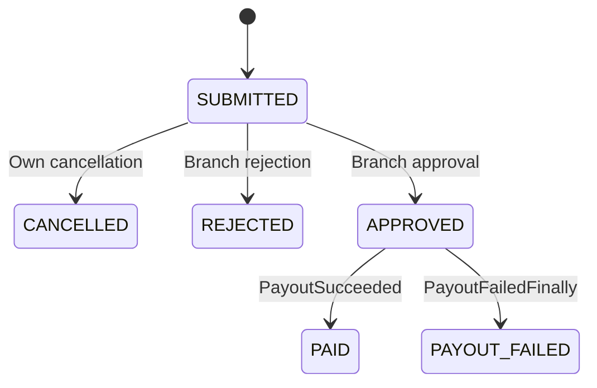

<!--
CHUNK: 08
TITLE: State and Rules
PROJECT: Refunds Platform
VERSION: 1.0
PART OF: LLD - Refunds Platform
MODE: from-sdd
-->

# 11. State Machines & Business Rules

## 11.1 Aggregate State Machines

State/transition definitions stay in [SDD 13b](../sdd-refunds-platform/13b-service-refund-requests.md#business-logic) and [13c](../sdd-refunds-platform/13c-service-payouts.md#business-logic). The implementation uses a conditional status/version update and appends history/publication in the same transaction. Terminal states never reopen on late callbacks.

**Summary:** This sourced guard view maps accepted refund transitions to their handlers. Cancellation and decision contend on the same current status/version.

## 11.2 Cross-Service Business Rules

No rule is re-authored here. [REFUNDS BRD](../brd-refunds-portal/06a-use-cases-customer.md) and [LOYALTY BRD](../brd-loyalty-points/06a-use-cases-member.md) own business behavior. §7.3 implements card-share locking, payout unknown-outcome identity, and paid-only points take-back. The SDD risk R-15 remains an upstream BRD/UAT coverage gap; implementation tests can cover it without inventing a BRD test ID. Rejected upstream decisions remain rejected.

## 11.3 Algorithm Pseudocode (non-trivial only)

Algorithms have one implementation home: [refund money/locking](./04-implementation/refund-requests.md#73-method-level-pseudocode-non-trivial-logic-only), [payout attempts](./04-implementation/payouts.md#73-method-level-pseudocode-non-trivial-logic-only), [points rounding/capping](./04-implementation/loyalty-points.md#73-method-level-pseudocode-non-trivial-logic-only), [account codes](./04-implementation/customer-accounts.md#73-method-level-pseudocode-non-trivial-logic-only), [message work](./04-implementation/notifications.md#73-method-level-pseudocode-non-trivial-logic-only). Use BigDecimal, never floating point; deterministic rounding tests cover the SDD examples.

<!-- MASTER: refunds-platform-lld-master.md | PREV: 07-event-contracts.md | NEXT: 09-cross-cutting.md -->
