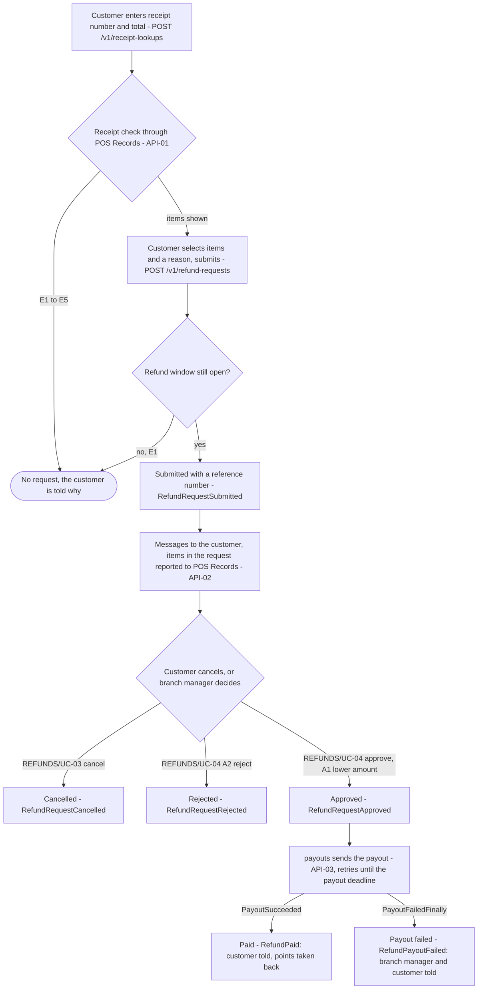
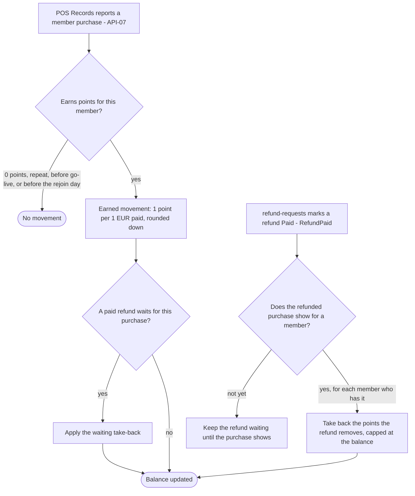
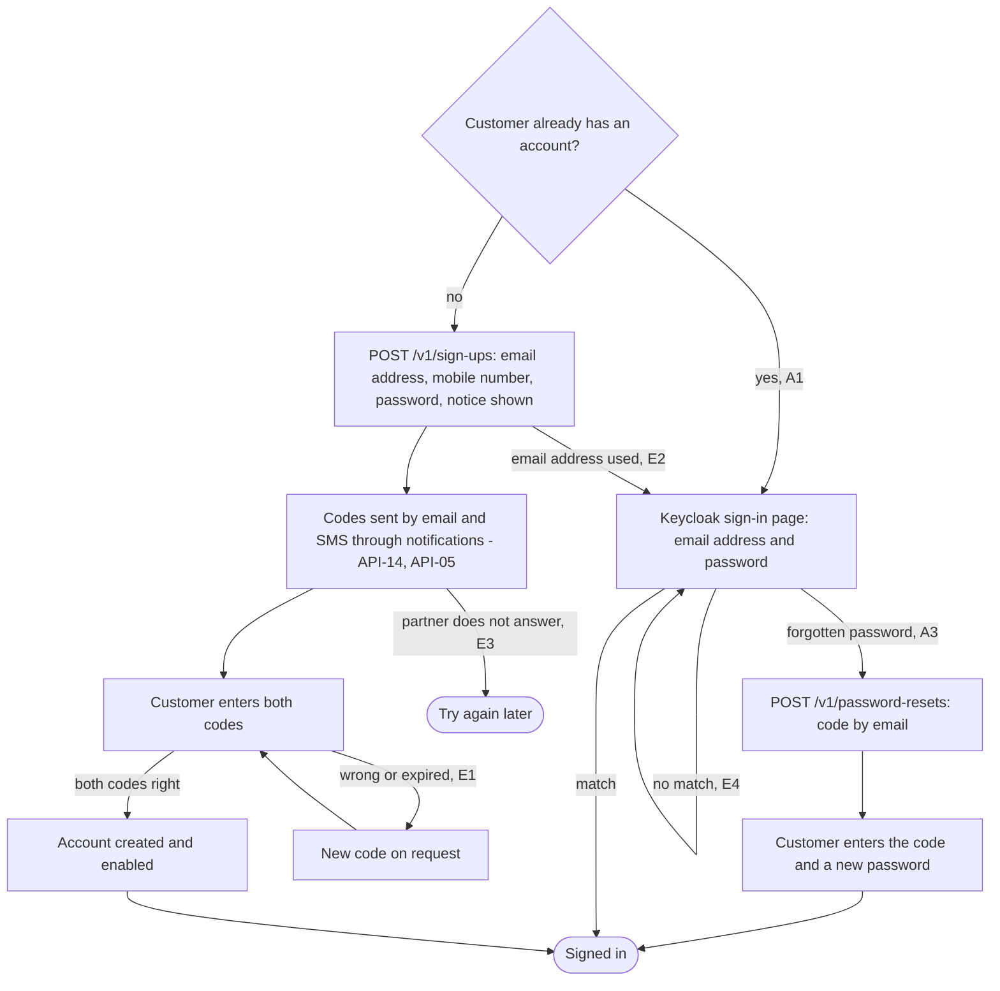
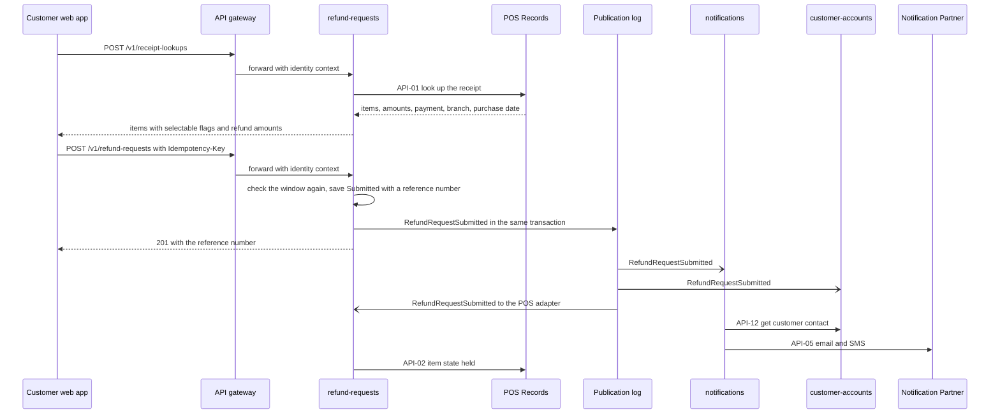
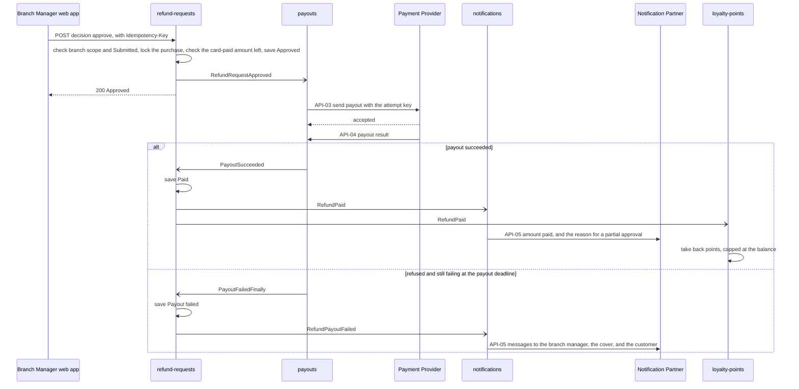
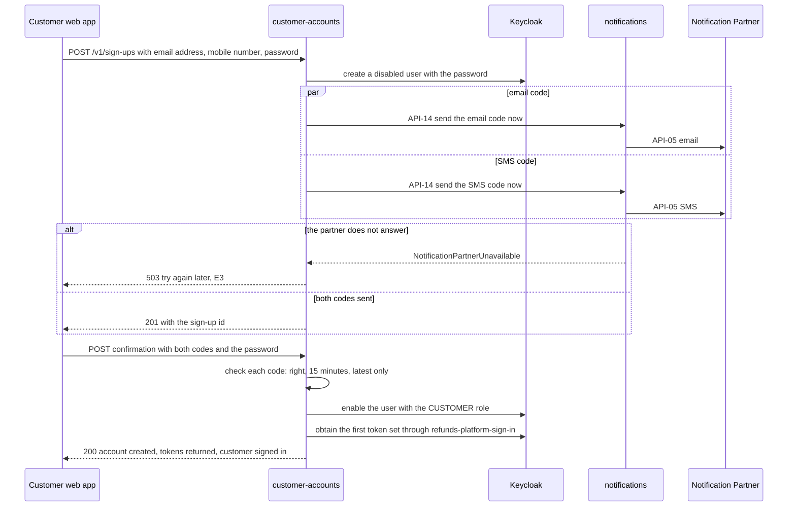
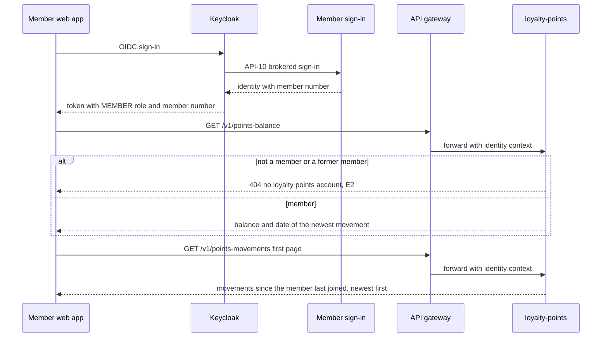
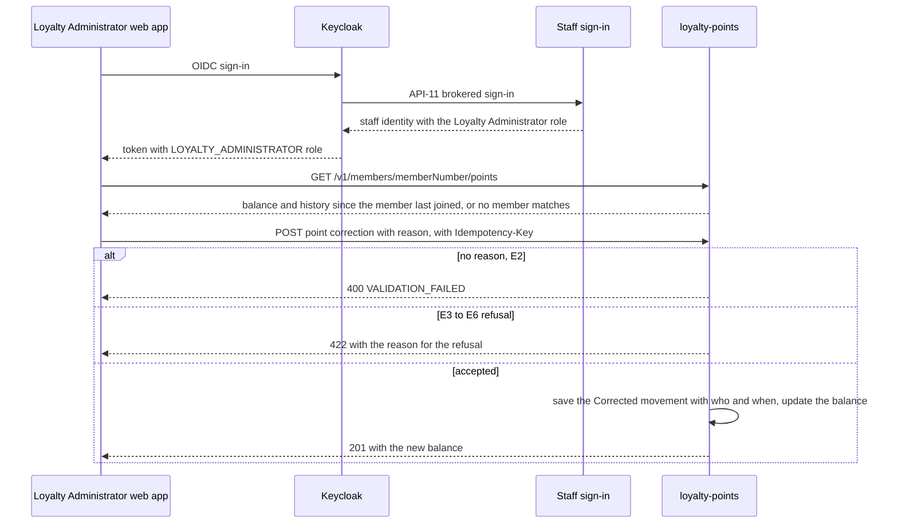

<!--
CHUNK: 05
TITLE: System Design - Workflow & Sequence Diagrams
PROJECT: Refunds Platform
VERSION: 1.2
DEPENDS_ON: 04
PART OF: SDD - Refunds Platform
-->

## 8.4 Workflow Diagrams

### 8.4.1 Workflow: Refund request to payout

**Use cases:** [REFUNDS/UC-01](../brd-refunds-portal/06a-use-cases-customer.md#uc-01-request-a-refund), [REFUNDS/UC-03](../brd-refunds-portal/06a-use-cases-customer.md#uc-03-cancel-a-refund-request), [REFUNDS/UC-04](../brd-refunds-portal/06b-use-cases-branch-manager.md#uc-04-approve--reject-refund)

**Figure 4: Workflow - Refund request to payout**

**Summary:** A receipt check against POS Records either stops the customer with a reason or shows the items; a submitted request is recorded as Submitted, the customer is told, and POS Records learns its items. The request then ends Cancelled, Rejected, Paid, or Payout failed, and every end state frees or settles the items and tells the people concerned.

### 8.4.2 Workflow: Points from purchases and paid refunds

**Use cases:** [LOYALTY/UC-02](../brd-loyalty-points/06a-use-cases-member.md#uc-02-view-points-history), [REFUNDS/UC-04](../brd-refunds-portal/06b-use-cases-branch-manager.md#uc-04-approve--reject-refund)

**Figure 5: Workflow - Points from purchases and paid refunds**

**Summary:** A reported purchase becomes an Earned movement unless a rule gives it no points, and a refund the Refunds Portal pays takes back the points the refund removes, capped at the balance. A paid refund whose purchase does not show yet waits and is applied when the purchase shows ([LOYALTY/UC-02](../brd-loyalty-points/06a-use-cases-member.md#uc-02-view-points-history) BR-5: take-back recorded when the purchase shows).

### 8.4.3 Workflow: Customer sign-up and sign-in

**Use cases:** [REFUNDS/UC-06](../brd-refunds-portal/06a-use-cases-customer.md#uc-06-sign-up-and-sign-in)

**Figure 6: Workflow - Customer sign-up and sign-in**

**Summary:** A new customer signs up, receives a code by email and one by SMS, confirms both, and is signed in; a customer with an account signs in on the Keycloak page, can retry after wrong details, or resets a forgotten password with an emailed code. When the Notification Partner does not answer, no code is sent and the customer is asked to try again later.

## 8.5 Sequence Diagrams

### 8.5.1 Sequence: Submit a refund request

**Use cases:** [REFUNDS/UC-01](../brd-refunds-portal/06a-use-cases-customer.md#uc-01-request-a-refund)

**Figure 7: Sequence - Submit a refund request**

**Summary:** The receipt lookup is a synchronous call to POS Records, and the submission saves the request and its `RefundRequestSubmitted` event in one transaction. After commit, notifications sends the email and SMS, customer-accounts counts the linked request, and the POS adapter reports the items in the request.

### 8.5.2 Sequence: Refund decision, payout, and points take-back

**Use cases:** [REFUNDS/UC-04](../brd-refunds-portal/06b-use-cases-branch-manager.md#uc-04-approve--reject-refund), [LOYALTY/UC-02](../brd-loyalty-points/06a-use-cases-member.md#uc-02-view-points-history)

**Figure 8: Sequence - Refund decision, payout, and points take-back**

**Summary:** An approval saves Approved and hands the payout to payouts through `RefundRequestApproved`; payouts calls the Payment Provider with one key per attempt and retries until the provider pays or the payout deadline (§17.3) passes. A success marks the request Paid and fires `RefundPaid`, which notifications and loyalty-points both handle; a final failure marks it Payout failed and tells the branch manager, the cover, and the customer.

### 8.5.3 Sequence: Sign-up with confirmation codes

**Use cases:** [REFUNDS/UC-06](../brd-refunds-portal/06a-use-cases-customer.md#uc-06-sign-up-and-sign-in)

**Figure 9: Sequence - Sign-up with confirmation codes**

**Summary:** Sign-up creates a disabled Keycloak user and sends both codes concurrently through notifications under one shared deadline (§12 INT-02), so a partner that does not answer gives the customer an immediate try-again message. Confirming both codes enables the user, and customer-accounts obtains the customer's first token set from Keycloak, so the customer is signed in at once.

### 8.5.4 Sequence: Member views points

**Use cases:** [LOYALTY/UC-01](../brd-loyalty-points/06a-use-cases-member.md#uc-01-view-points-balance), [LOYALTY/UC-02](../brd-loyalty-points/06a-use-cases-member.md#uc-02-view-points-history)

**Figure 10: Sequence - Member views points**

**Summary:** The member signs in through the brokered member sign-in, and the token carries the member number. loyalty-points answers the balance and the first page of the history from its own schema, or says the customer has no loyalty points account.

### 8.5.5 Sequence: Correct a member's points

**Use cases:** [LOYALTY/UC-03](../brd-loyalty-points/06b-use-cases-loyalty-administrator.md#uc-03-correct-a-members-points)

**Figure 11: Sequence - Correct a member's points**

**Summary:** The Loyalty Administrator signs in through the brokered staff sign-in, finds the member by member number, and posts a correction. loyalty-points refuses a correction with no reason as a validation error (E2) and one that breaks a rule with the reason for the refusal (E3 to E6), or saves the Corrected movement with who made it and when, and returns the new balance.

<!-- MASTER: refunds-platform-sdd-master.md | PREV: 04-architecture-style-and-diagrams.md | NEXT: 06-principles-and-decisions.md -->
