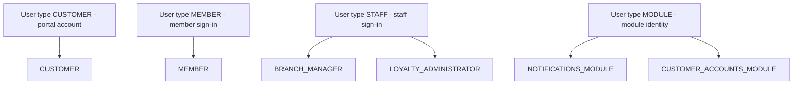
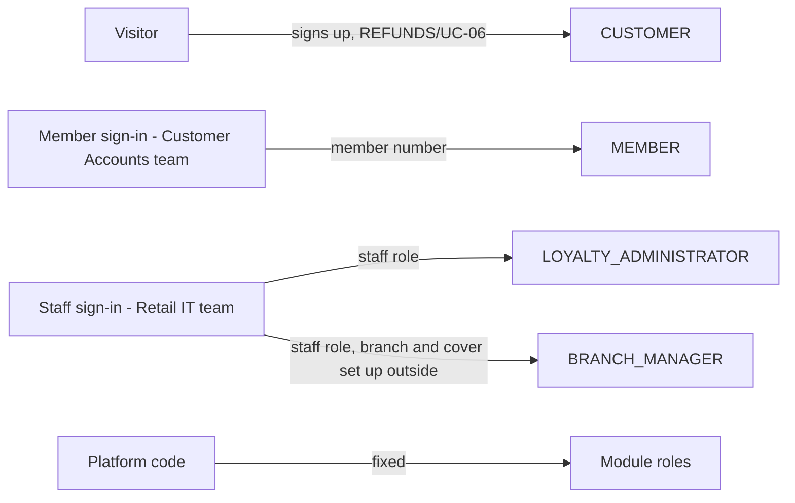
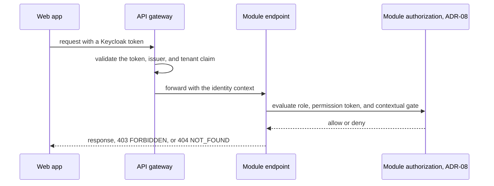

<!--
CHUNK: 12
TITLE: Centralized User Roles & Authorities (Platform-Wide)
PROJECT: Refunds Platform
VERSION: 1.3
DEPENDS_ON: 03, 07, 09 (+ per-service chunks 13a, 13b, ... for per-service authorization notes)
PART OF: SDD - Refunds Platform
PURPOSE: Single platform-wide reference for user types, roles, sub-roles, and their authorities - who can do what, who can create whom, which services each role touches, and how a role resolves to an allowed action at request time. Consolidates the BRD's Users & Use Cases Matrix and the per-service authorization notes into one canonical catalogue. Companion reference to the Centralized Event Hub (chunk 10).
CONSISTENCY_RULE: Role names, permission tokens, and per-service authorization notes in the 13x chunks MUST match this catalogue verbatim. Divergences are flagged here (see the drift register), never silently reconciled.
-->

# 16. Centralized User Roles & Authorities (Platform-Wide)

> **What this chunk is.** The one place that answers: what user types exist, which roles and sub-roles they break into, what each role is allowed to do, who may create or invite whom, and which services each role interacts with. Downstream, the LLD and the identity/authorization implementation seed from this catalogue - the key goal is that authorization behaves identically across every service.

---

## 16.1 Business Overview

The platform serves one tenant, the retailer, and two kinds of people. End customers come in two forms: a Refunds Portal customer with a portal account ([REFUNDS 04 § Personas / Actors](../brd-refunds-portal/04-scope-and-personas.md#personas--actors)) and a Loyalty Points member who signs in through the member sign-in ([LOYALTY 04 § Personas / Actors](../brd-loyalty-points/04-scope-and-personas.md#personas--actors)); each sees only their own records. Staff come in two roles: branch managers, who decide on their own branch's refund requests or a branch they cover, and Loyalty Administrators of the Customer Service team, who correct any member's points.

Two module identities complete the catalogue: notifications and customer-accounts call each other's ports with no user present, so their permissions are listed like any role. No human platform-operator role exists: neither BRD names one.

## 16.2 Resolution Model - How a Role Becomes an Allowed Action

Identity comes from the Keycloak token (ADR-07): the realm role, the `tenant_id` claim, and the subject claims `customer_account_id` (portal account), `member_number` (member sign-in), and `staff_id` (staff sign-in). The gateway validates the token and its `tenant_id` claim on user routes (§11.6) and checks nothing else. Each module then checks, for every endpoint and port, the §16.11 permission token, resolved from the caller's realm role through the module's seeded `role_permission` rows (§16.12.1), and runs the contextual gate in its application service: own request (customer), own or covered branch from the branch assignments (branch manager, §17.2), own points (member). A missing permission token answers 403 `FORBIDDEN`; a record outside the caller's own scope answers 404 `NOT_FOUND`, so its existence is not revealed (ADR-08). The module identities of §16.4.3 carry their role in the port call context.

## 16.3 User Types (Tier 1)

| User type | Tenancy plane | Identity source | Description |
|---|---|---|---|
| `CUSTOMER` | End-customer | Keycloak realm, local account created by customer-accounts ([REFUNDS/UC-06](../brd-refunds-portal/06a-use-cases-customer.md#uc-06-sign-up-and-sign-in)) | A Refunds Portal customer |
| `MEMBER` | End-customer | Keycloak realm, brokered member sign-in (API-10) | A Loyalty Points member, or a signed-in customer who is not a member |
| `STAFF` | Tenant staff | Keycloak realm, brokered staff sign-in (API-11) | A branch manager or a Loyalty Administrator |
| `MODULE` | Platform | In-process module identity, fixed in code | A module calling another module's port with no user present |

## 16.4 Role Catalogue - Authorities & Related Services

### 16.4.1 End-Customer Roles

| Role | Scope | Core authorities | Related services |
|---|---|---|---|
| `CUSTOMER` | Own account and own requests | Read own account; check a receipt; submit, list, read, and cancel own refund requests | customer-accounts, refund-requests |
| `MEMBER` | Own points | Read own balance and own movements | loyalty-points |

### 16.4.2 Staff Roles

| Sub-role | Scope | Core authorities | Related services |
|---|---|---|---|
| `BRANCH_MANAGER` | Own branch, and each branch covered today | Read the branch queue and requests; approve, approve a lower amount, or reject; read the branch refund report | refund-requests |
| `LOYALTY_ADMINISTRATOR` | All members of the tenant | Read a member's balance and history; record corrections; read the monthly corrections report | loyalty-points |

### 16.4.3 Platform Plane (operator - outside tenant tenancy)

| Role | Scope | Core authorities | Related services |
|---|---|---|---|
| `NOTIFICATIONS_MODULE` | Port calls, per tenant of the call | Read a customer's contact details; read a branch's recipients | customer-accounts, refund-requests |
| `CUSTOMER_ACCOUNTS_MODULE` | Port calls, per tenant of the call | Send a code now | notifications |

## 16.5 Capability Matrix (canonical)

| Capability | `CUSTOMER` | `MEMBER` | `BRANCH_MANAGER` | `LOYALTY_ADMINISTRATOR` | `NOTIFICATIONS_MODULE` | `CUSTOMER_ACCOUNTS_MODULE` |
|---|---|---|---|---|---|---|
| Sign up, reset a password (public) | - | - | - | - | - | - |
| Read own account | Yes | - | - | - | - | - |
| Check a receipt, submit a refund request | Yes | - | - | - | - | - |
| Read and cancel refund requests | Yes¹ | - | - | - | - | - |
| Read branch requests, decide, read the branch report | - | - | Yes² | - | - | - |
| Read own points balance and history | - | Yes³ | - | - | - | - |
| Read any member's points, correct points, read the monthly report | - | - | - | Yes | - | - |
| Read customer contact and branch recipients | - | - | - | - | Yes | - |
| Send a code now | - | - | - | - | - | Yes |

¹ Own requests only ([REFUNDS 07](../brd-refunds-portal/07-users-use-cases-matrix.md#users--use-cases-matrix), footnote 2).
² Own branch only, or a branch they cover ([REFUNDS 07](../brd-refunds-portal/07-users-use-cases-matrix.md#users--use-cases-matrix), footnote 1).
³ Own points only ([LOYALTY 07](../brd-loyalty-points/07-users-use-cases-matrix.md#users--use-cases-matrix), footnote 1).

Sign-up and password reset run before any sign-in, so they need no role.

## 16.6 Grant / Invitation Authority (who can create whom)

| Grantor role | May create / invite | Constraints |
|---|---|---|
| None (a visitor) | `CUSTOMER` (self sign-up) | Both addresses confirmed first ([REFUNDS/UC-06](../brd-refunds-portal/06a-use-cases-customer.md#uc-06-sign-up-and-sign-in) BR-1: confirm both addresses before the first request); one account per email address |
| Member sign-in (Customer Accounts team, outside) | `MEMBER` | The token carries the member number; joining is out of scope ([LOYALTY 04 § Out of Scope](../brd-loyalty-points/04-scope-and-personas.md#out-of-scope)) |
| Staff sign-in (Retail IT team, outside) | `LOYALTY_ADMINISTRATOR`, `BRANCH_MANAGER` | The role comes from the staff sign-in ([LOYALTY 02 § Dependencies](../brd-loyalty-points/02-glossary-assumptions-facts.md#dependencies)); branch and cover are set up outside the portal ([REFUNDS 02 § Assumptions / Constraints](../brd-refunds-portal/02-glossary-assumptions-facts.md#assumptions--constraints), Assumption 3) |
| Platform code | `NOTIFICATIONS_MODULE`, `CUSTOMER_ACCOUNTS_MODULE` | Fixed in the code; no runtime grant |

No role inside the platform can create or invite another role.

## 16.7 Role → Related-Services Matrix (platform-wide)

| Role | customer-accounts | refund-requests | payouts | notifications | loyalty-points |
|---|---|---|---|---|---|
| `CUSTOMER` | read | write | - | - | - |
| `MEMBER` | - | - | - | - | read |
| `BRANCH_MANAGER` | - | write | - | - | - |
| `LOYALTY_ADMINISTRATOR` | - | - | - | - | write |
| `NOTIFICATIONS_MODULE` | read | read | - | - | - |
| `CUSTOMER_ACCOUNTS_MODULE` | - | - | - | write | - |

## 16.8 Lifecycle, Scope & Revocation Rules

1. **Grant:** CUSTOMER is granted when the sign-up is confirmed ([REFUNDS/UC-06](../brd-refunds-portal/06a-use-cases-customer.md#uc-06-sign-up-and-sign-in) step 6); MEMBER comes from a member sign-in whose token carries a member number; BRANCH_MANAGER and LOYALTY_ADMINISTRATOR come from the staff sign-in, and a branch manager's branches from the branch assignments (API-06).
2. **Change:** staff roles, branches, and covers change at their source and take effect at the next token and the next branch-assignment refresh; a cover ends when the source ends it ([REFUNDS/UC-04](../brd-refunds-portal/06b-use-cases-branch-manager.md#uc-04-approve--reject-refund) BR-6: a cover acts until the branch manager is back).
3. **Suspension and revocation:** closing a customer account deletes its Keycloak user after the closure commits (§17.1; [REFUNDS 03 § Refund records](../brd-refunds-portal/03-definitions-and-domain-concepts.md#refund-records)); a member who leaves still signs in but has no loyalty points account ([LOYALTY 03 § Membership end and data retention](../brd-loyalty-points/03-definitions-and-domain-concepts.md#membership-end-and-data-retention)); a removed staff role ends within the 5-minute token lifetime (ADR-07). A decision already committed stands; a request still waiting stays in its branch queue for the next manager or cover.
4. **Erasure:** refund requests are unlinked 7 years after their last status change and closed accounts lose their contact details ([REFUNDS 03 § Refund records](../brd-refunds-portal/03-definitions-and-domain-concepts.md#refund-records)); former-member history is deleted at the end of its retention period (§17.5 Retention Policy).

## 16.9 Diagrams

### 16.9.1 Role Taxonomy (user types → roles → sub-roles)

**Figure 12: Role Taxonomy**

**Summary:** Customers and members each have one role, staff split into branch managers and Loyalty Administrators, and two module identities carry the permissions of the port calls between modules.

### 16.9.2 Grant / Invitation Authority (who may create whom)

**Figure 13: Grant / Invitation Authority**

**Summary:** Customers create their own accounts; members, branch managers, and Loyalty Administrators get their roles from the outside sign-ins; module roles are fixed in the code. No role inside the platform grants another.

### 16.9.3 Per-Request Authorization (how a role yields a decision)

**Figure 14: Per-Request Authorization**

**Summary:** The gateway validates the token and its tenant claim, and the module then checks the endpoint's permission token and its contextual gate before it acts (ADR-08). A missing permission token gets 403, and a record outside the caller's own scope gets 404.

## 16.10 Traceability

| Capability / rule | Source (BRD UC / matrix row / ADR / 13x chunk) |
|---|---|
| Sign up, reset a password | [REFUNDS/UC-06](../brd-refunds-portal/06a-use-cases-customer.md#uc-06-sign-up-and-sign-in); matrix row in [REFUNDS 07](../brd-refunds-portal/07-users-use-cases-matrix.md#users--use-cases-matrix); 13a |
| Read own account | [REFUNDS/UC-06](../brd-refunds-portal/06a-use-cases-customer.md#uc-06-sign-up-and-sign-in) A1; 13a |
| Check a receipt, submit a refund request | [REFUNDS/UC-01](../brd-refunds-portal/06a-use-cases-customer.md#uc-01-request-a-refund); matrix row in [REFUNDS 07](../brd-refunds-portal/07-users-use-cases-matrix.md#users--use-cases-matrix); 13b |
| Read and cancel own refund requests | [REFUNDS/UC-02](../brd-refunds-portal/06a-use-cases-customer.md#uc-02-track-refund-status), [REFUNDS/UC-03](../brd-refunds-portal/06a-use-cases-customer.md#uc-03-cancel-a-refund-request); matrix footnote 2 in [REFUNDS 07](../brd-refunds-portal/07-users-use-cases-matrix.md#users--use-cases-matrix); 13b |
| Read branch requests, decide | [REFUNDS/UC-04](../brd-refunds-portal/06b-use-cases-branch-manager.md#uc-04-approve--reject-refund); matrix footnote 1 in [REFUNDS 07](../brd-refunds-portal/07-users-use-cases-matrix.md#users--use-cases-matrix); 13b |
| Read the branch refund report | [REFUNDS 09](../brd-refunds-portal/09-reporting-and-analytics.md#reporting--analytics) (audience Branch Manager); 13b |
| Read own points balance and history | [LOYALTY/UC-01](../brd-loyalty-points/06a-use-cases-member.md#uc-01-view-points-balance), [LOYALTY/UC-02](../brd-loyalty-points/06a-use-cases-member.md#uc-02-view-points-history); matrix footnote 1 in [LOYALTY 07](../brd-loyalty-points/07-users-use-cases-matrix.md#users--use-cases-matrix); 13e |
| Read any member's points, correct points | [LOYALTY/UC-03](../brd-loyalty-points/06b-use-cases-loyalty-administrator.md#uc-03-correct-a-members-points); matrix row in [LOYALTY 07](../brd-loyalty-points/07-users-use-cases-matrix.md#users--use-cases-matrix); 13e |
| Read the monthly corrections report | [LOYALTY 09](../brd-loyalty-points/09-reporting-and-analytics.md#reporting--analytics) (audience Loyalty Administrator), LOYALTY/NFR-07; 13e |
| Read customer contact and branch recipients | ADR-05; 13d |
| Send a code now | [REFUNDS/UC-06](../brd-refunds-portal/06a-use-cases-customer.md#uc-06-sign-up-and-sign-in) E3; ADR-05; 13a |

## 16.11 Permission × Role Matrix (platform-wide)

| Permission token | `CUSTOMER` | `MEMBER` | `BRANCH_MANAGER` | `LOYALTY_ADMINISTRATOR` | `NOTIFICATIONS_MODULE` | `CUSTOMER_ACCOUNTS_MODULE` |
|---|---|---|---|---|---|---|
| `customer-accounts.profile.read` | ✓ | - | - | - | - | - |
| `customer-accounts.contact.read` | - | - | - | - | ✓ | - |
| `refund-requests.receipt.lookup` | ✓ | - | - | - | - | - |
| `refund-requests.request.create` | ✓ | - | - | - | - | - |
| `refund-requests.request.read-own` | ✓¹ | - | - | - | - | - |
| `refund-requests.request.cancel-own` | ✓¹ | - | - | - | - | - |
| `refund-requests.branch-request.read` | - | - | ✓² | - | - | - |
| `refund-requests.request.decide` | - | - | ✓² | - | - | - |
| `refund-requests.branch-report.read` | - | - | ✓² | - | - | - |
| `refund-requests.branch-recipients.read` | - | - | - | - | ✓ | - |
| `notifications.message.send` | - | - | - | - | - | ✓ |
| `loyalty-points.balance.read-own` | - | ✓³ | - | - | - | - |
| `loyalty-points.movement.read-own` | - | ✓³ | - | - | - | - |
| `loyalty-points.member.read` | - | - | - | ✓ | - | - |
| `loyalty-points.correction.create` | - | - | - | ✓ | - | - |
| `loyalty-points.correction-report.read` | - | - | - | ✓ | - | - |

Footnotes as in §16.5. Permission tokens are named `[module].[resource].[action]`, with `-own` on an action limited to the caller's own records.

## 16.12 Implementation Seed & Reconciliation

### 16.12.1 Seed Strategy

Each module seeds its `role_permission` rows (tenant, role, permission token), the §16.11 rows of its own tokens, with a versioned Flyway migration in its schema, and tenant provisioning seeds the same rows for a new tenant (ADR-03). The realm roles live in the Keycloak realm export, kept under version control per environment (§19). An integration test fails the build when the seeded rows, the realm roles, and §16.11 differ. A role or token change updates §16.11 and §16.12.2 first, then ships the migration and the realm export in the same release.

### 16.12.2 Per-Role Action Counts (drift baseline)

| Role | Seeded permission count |
|---|---|
| `CUSTOMER` | 5 |
| `MEMBER` | 2 |
| `BRANCH_MANAGER` | 3 |
| `LOYALTY_ADMINISTRATOR` | 3 |
| `NOTIFICATIONS_MODULE` | 2 |
| `CUSTOMER_ACCOUNTS_MODULE` | 1 |

### 16.12.3 Drift & Reconciliation Register

No divergence: every role name and permission token in the authorization notes and Lists of APIs of 13a to 13e, and in the internal contracts of chunk 11, matches §16.11. The register has no row.

| # | Where | Divergence | Resolution / flag | Status |
|---|---|---|---|---|

<!-- MASTER: refunds-platform-sdd-master.md | PREV: 11-api-contracts.md | NEXT: 13a-service-customer-accounts.md -->
