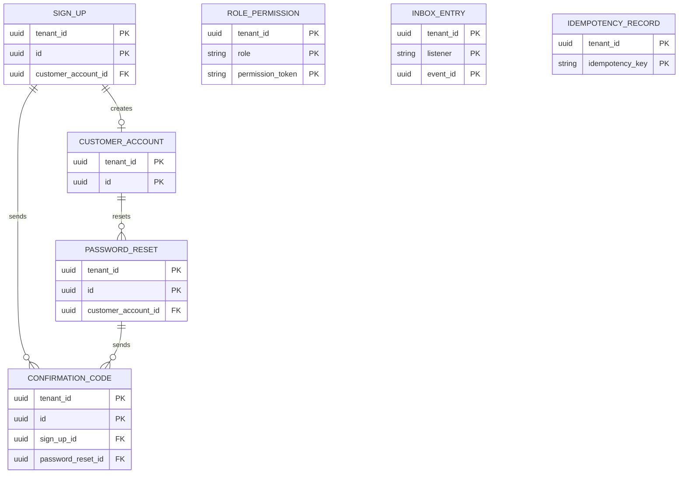
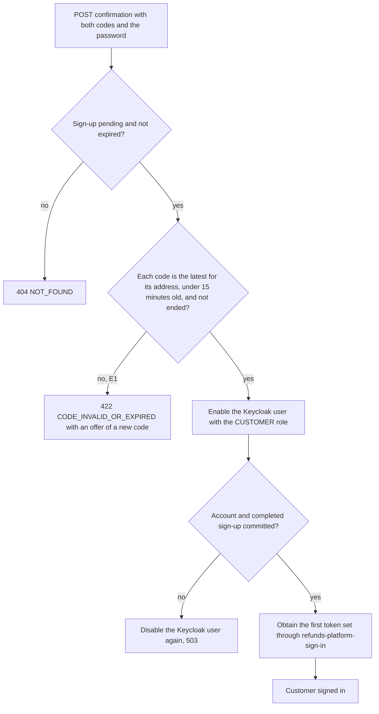

<!--
CHUNK: 13a
TITLE: Detailed Service Spec - customer-accounts
PROJECT: Refunds Platform
VERSION: 1.1
DEPENDS_ON: 09, 07, 10 (event hub - topic names, event names, and payload contracts must match chunk 10 verbatim), 11 (API contracts - integration endpoints carry their API ID and match chunk 11 verbatim), 12 (roles - permission tokens match chunk 12 verbatim)
PART OF: SDD - Refunds Platform
-->

# 17. Detailed Service Specs

---

## 17.1 customer-accounts

### What

The module that owns the Refunds Portal customer account: the confirmed email address and mobile number, the sign-up and password reset flows with their confirmation codes, the count of refund requests linked to the account, and account closure. It realises [REFUNDS/UC-06](../brd-refunds-portal/06a-use-cases-customer.md#uc-06-sign-up-and-sign-in). Passwords and sessions live only in Keycloak (ADR-07).

### Boundaries

- **Owns:** customer accounts, sign-ups, password resets, confirmation codes, the linked-request count of each account.
- **Does not own:** credentials and sessions (Keycloak); refund requests (refund-requests); message delivery (notifications); member identities of LOYALTY (member sign-in, INT-04).
- **Upstream consumers:** Refunds Portal web (customers and visitors); notifications (port API-12).
- **Downstream dependencies:** Keycloak admin client and token endpoint (platform IAM, §6); notifications (port API-14); in-process events from refund-requests.

### Input

| Type | Source | Description |
|------|--------|-------------|
| REST (public route) | Refunds Portal web (a visitor not signed in) | Sign-up, confirmation, new code, password reset (List of APIs) |
| REST (user route) | Refunds Portal web (customer) | The current account |
| Event | refund-requests: `RefundRequestSubmitted` | Adds one linked request to the customer's account |
| Event | refund-requests: `RefundRequestUnlinked` | Removes one linked request from the customer's account |
| Event | customer-accounts (own): `CustomerAccountClosed` | Deletes the closed account's Keycloak user; an internal publication that no other module handles, so it is not in §14.10 |
| Port | notifications: API-12 | Returns the email address and mobile number of an active account |
| Schedule | `account-closure`, daily | Reads the Keycloak sign-in events, then closes accounts with no sign-in for 2 years and no linked request |
| Schedule | `keycloak-user-reconciliation`, hourly | Disables enabled CUSTOMER users with no account and deletes disabled customer users with no pending sign-up |

### Business Logic

customer-accounts keeps the account record and drives the code flows; Keycloak keeps the password, so the module never stores or logs one.

- **Sign-up** ([REFUNDS/UC-06](../brd-refunds-portal/06a-use-cases-customer.md#uc-06-sign-up-and-sign-in) steps 1-4): `POST /v1/sign-ups` takes the email address, mobile number, password, and the version of the privacy notice the web app showed (step 2, [REFUNDS 03 § Refund records](../brd-refunds-portal/03-definitions-and-domain-concepts.md#refund-records)). It enforces one account per email address (BR-2: one account per email address) per tenant, creates a disabled Keycloak user with the password (step 3), opens a pending sign-up, and sends the email code and the SMS code concurrently through notifications with API-14 under the shared deadline of §12 INT-02 (step 4). If either code cannot be sent, the sign-up answers E3 and is closed with its Keycloak user, so a code already sent stops working.
- **Codes** (BR-3: a code works for 15 minutes; BR-4: only the latest code works): each code is stored as a hash with its send time and destination; sending a new code to the same destination supersedes the earlier one. `POST /v1/sign-ups/{signUpId}/codes` sends a new code to one address on request (E1). A code has 6 digits from a cryptographically secure random source. It accepts at most 5 wrong entries; the 5th wrong entry ends it, and the customer asks for a new one ([REFUNDS/UC-06](../brd-refunds-portal/06a-use-cases-customer.md#uc-06-sign-up-and-sign-in) E1). At most 5 codes per address per hour and 3 password resets per account per hour; beyond that the endpoint answers 429 `RATE_LIMITED` with a plain-language wait message.
- **Confirmation** (steps 5-6): `POST /v1/sign-ups/{signUpId}/confirmation` accepts both codes and, once more, the password. When both codes are right and current, the module enables the Keycloak user with the CUSTOMER role and the `customer_account_id` attribute, creates the account, and signs the customer in: it obtains the customer's first token set from the Keycloak token endpoint through the confidential client `refunds-platform-sign-in`, the only client with direct access grants, and returns it to the web app. The password serves that one call and is never stored or logged. Because the account exists only after both codes are confirmed, every customer who can request a refund has confirmed both addresses (BR-1: confirm both addresses before the first request).
- **Sign-in** (A1, E4) and **not signed in** (A2): customers sign in on the Keycloak page with OIDC Authorization Code and PKCE; a wrong email address or password gets Keycloak's wrong-credentials message (E4). The web app sends a visitor who tries to request, track, or cancel to sign-in or sign-up first (A2). Keycloak saves the sign-in events of customer users with an expiry of 7 days; the daily `account-closure` job reads them through the Keycloak admin client and updates each account's last sign-in before it selects accounts to close, and the sign-ins of [REFUNDS/UC-06](../brd-refunds-portal/06a-use-cases-customer.md#uc-06-sign-up-and-sign-in) step 6 and [REFUNDS/UC-06](../brd-refunds-portal/06a-use-cases-customer.md#uc-06-sign-up-and-sign-in) A3 set the last sign-in when they happen. `GET /v1/customer-accounts/me` only reads.
- **Password reset** (A3): `POST /v1/password-resets` takes the email address; when an account has it, a code goes to that address by email through API-14. `POST /v1/password-resets/{passwordResetId}/confirmation` takes the code and a new password, sets the password in Keycloak, and signs the customer in as at step 6. Wrong or expired codes follow E1 and unsent codes E3. The endpoint answers the same way whether or not an account has the address and sends a code only to an existing account.
- **Keycloak user lifecycle:** (1) A sign-up stores the Keycloak user id it creates; if its transaction does not commit, the user is deleted at once. (2) A pending sign-up expires 24 hours after its latest code, and job (5) then deletes its disabled user. A sign-up for an email address that has a pending sign-up but no account replaces that sign-up and its disabled user, so E2 is given only when an account exists. (3) Confirmation enables the user and then commits the account; if the commit fails, the user is disabled again. (4) Closure commits the closed state and the removal of the contact details together with a `CustomerAccountClosed` publication that only customer-accounts handles (so it stays out of §14.10); its after-commit listener deletes the Keycloak user from the publication log, retried until done. (5) An hourly `keycloak-user-reconciliation` job disables any enabled CUSTOMER user with no account and deletes any disabled customer user with no pending sign-up.
- **Linked requests and closure** ([REFUNDS 03 § Refund records](../brd-refunds-portal/03-definitions-and-domain-concepts.md#refund-records)): the listener for `RefundRequestSubmitted` adds one to the account's linked-request count and the listener for `RefundRequestUnlinked` removes one. The daily `account-closure` job closes every active account with no sign-in for 2 years and a count of 0: it removes the email address and mobile number and publishes `CustomerAccountClosed`.
- **Contact for messages:** port API-12 returns the email address and mobile number of an active account.

**State machine (if applicable):** Not applicable: a sign-up moves only from pending to completed, expired, or closed, and an account only from active to closed; the transitions are listed above.

### Output

| Type | Destination | Description |
|------|-------------|-------------|
| REST response | Refunds Portal web | Sign-up id, confirmation result with the first token set, reset id, current account |
| Keycloak admin and token calls | Keycloak (platform IAM) | Create, enable, disable, and delete users; set passwords; read sign-in events; obtain a first token set |
| Port call | notifications (API-14) | Send a confirmation or reset code now |
| Port answer | notifications (API-12) | Contact details of an active account |
| Internal publication | customer-accounts | `CustomerAccountClosed`, outside §14.10 |

### Integrations

| Integration | Direction | Protocol | Purpose | Contract | Failure Handling |
|-------------|-----------|----------|---------|----------|------------------|
| Keycloak | Outbound, sync | Keycloak admin client and token endpoint over HTTPS | Create, enable, disable, and delete users; set passwords; read sign-in events; obtain the first token set at sign-up and reset | Platform IAM (§6, ADR-07); platform infrastructure, not an integration contract (§15.1) | Compensated as the Keycloak user lifecycle states (Business Logic); the hourly reconciliation converges what a crash leaves; a Keycloak failure answers 503 |
| notifications | Outbound, sync (in-process) | Port | Send a code now | API-14 (§15) | Partner unavailable: [REFUNDS/UC-06](../brd-refunds-portal/06a-use-cases-customer.md#uc-06-sign-up-and-sign-in) E3 |
| notifications | Inbound, sync (in-process) | Port | Customer contact for a message | API-12 (§15) | Unknown or closed account: typed error to the caller |
| refund-requests | Inbound, async | In-process events | Linked-request count | `RefundRequestSubmitted`, `RefundRequestUnlinked` (§14.10) | Redelivered from the publication log until handled |

### DB Modeling

#### Entity Relationship

**Figure 15: Entity Relationship - customer-accounts**

**Summary:** A sign-up creates at most one customer account, and sign-ups and password resets each send confirmation codes. The seeded role permissions, the listener inbox, and the idempotency records stand alone.

#### Tables Design

| Table | Column | Type | Constraints | Notes |
|-------|--------|------|-------------|-------|
| `customer_account` | `tenant_id`, `id` | uuid, uuid | PK (`tenant_id`, `id`), NOT NULL | `id` is UUIDv7 |
| `customer_account` | `keycloak_user_id` | varchar(64) | NULL only when `status` is CLOSED; unique (`tenant_id`, `keycloak_user_id`) when set | The Keycloak user |
| `customer_account` | `email` | varchar(254) | NULL only when `status` is CLOSED; unique (`tenant_id`, lower(`email`)) when set | PII; one account per email address (BR-2) |
| `customer_account` | `mobile_number` | varchar(20) | NULL only when `status` is CLOSED | PII, E.164 |
| `customer_account` | `status` | varchar(8) | NOT NULL; ACTIVE or CLOSED | |
| `customer_account` | `privacy_notice_version` | varchar(20) | NOT NULL | The notice shown at sign-up |
| `customer_account` | `last_sign_in_at` | timestamptz | NOT NULL | Set at creation; updated from the Keycloak sign-in events; index (`tenant_id`, `status`, `last_sign_in_at`) |
| `customer_account` | `linked_request_count` | integer | NOT NULL; 0 or more | |
| `customer_account` | `closed_at` | timestamptz | NULL until CLOSED | |
| `customer_account` | `created_at`, `created_by`, `updated_at`, `updated_by`, `version` | per §11.1 | NOT NULL | Audit and optimistic lock |
| `sign_up` | `tenant_id`, `id` | uuid, uuid | PK (`tenant_id`, `id`), NOT NULL | |
| `sign_up` | `email` | varchar(254) | NOT NULL; index (`tenant_id`, lower(`email`), `status`) | PII |
| `sign_up` | `mobile_number` | varchar(20) | NOT NULL | PII |
| `sign_up` | `keycloak_user_id` | varchar(64) | NOT NULL | The disabled user |
| `sign_up` | `privacy_notice_version` | varchar(20) | NOT NULL | |
| `sign_up` | `status` | varchar(10) | NOT NULL; PENDING, COMPLETED, EXPIRED, or CLOSED | |
| `sign_up` | `expires_at` | timestamptz | NOT NULL; index (`tenant_id`, `status`, `expires_at`) | 24 hours after the latest code |
| `sign_up` | `customer_account_id` | uuid | FK (`tenant_id`, `customer_account_id`) to `customer_account`; NULL until COMPLETED | |
| `sign_up` | `created_at`, `created_by`, `updated_at`, `updated_by`, `version` | per §11.1 | NOT NULL | |
| `password_reset` | `tenant_id`, `id` | uuid, uuid | PK (`tenant_id`, `id`), NOT NULL | |
| `password_reset` | `customer_account_id` | uuid | FK (`tenant_id`, `customer_account_id`) to `customer_account`; NULL when no account had the address; index (`tenant_id`, `customer_account_id`, `created_at`) | |
| `password_reset` | `status` | varchar(10) | NOT NULL; PENDING, COMPLETED, or EXPIRED | |
| `password_reset` | `expires_at` | timestamptz | NOT NULL | 24 hours after the latest code |
| `password_reset` | `created_at`, `created_by`, `updated_at`, `updated_by`, `version` | per §11.1 | NOT NULL | |
| `confirmation_code` | `tenant_id`, `id` | uuid, uuid | PK (`tenant_id`, `id`), NOT NULL | |
| `confirmation_code` | `sign_up_id` | uuid | FK (`tenant_id`, `sign_up_id`) to `sign_up`; exactly one of `sign_up_id` and `password_reset_id` is set | |
| `confirmation_code` | `password_reset_id` | uuid | FK (`tenant_id`, `password_reset_id`) to `password_reset`; see `sign_up_id` | |
| `confirmation_code` | `channel` | varchar(5) | NOT NULL; EMAIL or SMS | |
| `confirmation_code` | `destination_hash` | varchar(64) | NOT NULL; index (`tenant_id`, `destination_hash`, `sent_at`) | Hash of the address, for the per-address limit |
| `confirmation_code` | `code_hash` | varchar(100) | NOT NULL | Never the code itself |
| `confirmation_code` | `sent_at` | timestamptz | NOT NULL | |
| `confirmation_code` | `expires_at` | timestamptz | NOT NULL | 15 minutes after `sent_at` (BR-3) |
| `confirmation_code` | `superseded_at` | timestamptz | NULL while it is the latest code for its address | BR-4 |
| `confirmation_code` | `wrong_entries` | integer | NOT NULL; 0 to 5 | The 5th wrong entry ends the code |
| `confirmation_code` | `used_at` | timestamptz | NULL until used | |
| `role_permission` | `tenant_id`, `role`, `permission_token` | uuid, varchar(40), varchar(80) | PK (`tenant_id`, `role`, `permission_token`), NOT NULL | Seed of §16.12.1 |
| `inbox_entry` | `tenant_id`, `listener`, `event_id` | uuid, varchar(80), uuid | PK (`tenant_id`, `listener`, `event_id`), NOT NULL | One row per event a listener handled |
| `inbox_entry` | `status` | varchar(8) | NOT NULL; DONE or PARKED | |
| `inbox_entry` | `attempts` | integer | NOT NULL | |
| `inbox_entry` | `last_error_code` | varchar(64) | NULL unless a run failed | |
| `inbox_entry` | `updated_at` | timestamptz | NOT NULL | |
| `idempotency_record` | `tenant_id`, `idempotency_key` | uuid, varchar(64) | PK (`tenant_id`, `idempotency_key`), NOT NULL | |
| `idempotency_record` | `request_hash` | varchar(64) | NOT NULL | A reused key with another body answers 409 `CONFLICT` |
| `idempotency_record` | `response_status`, `response_body` | integer, jsonb | NOT NULL | The first response, replayed (§11.1) |
| `idempotency_record` | `created_at` | timestamptz | NOT NULL | |

#### Migration Strategy

- **Tool:** Flyway, versioned SQL in the module's own location for the `customer_accounts` schema (§11.1).
- **Backward compatibility:** additive changes; expand, then contract for a breaking change.
- **Data backfill:** a separate versioned migration, run before the code that reads the new column.
- **Rollback:** a forward fix migration; no down scripts.

#### Retention Policy

- `customer_account`: closed after 2 years with no sign-in and no linked request, with the email address, the mobile number, and the Keycloak user removed ([REFUNDS 03 § Refund records](../brd-refunds-portal/03-definitions-and-domain-concepts.md#refund-records)); the closed row is deleted 30 days after closure.
- `sign_up`, `password_reset`, `confirmation_code`: deleted 7 days after they end (completed, expired, or closed); a code goes with its sign-up or reset.
- `role_permission`: the seed of the running release.
- `inbox_entry`: DONE rows deleted after 30 days; PARKED rows kept until the §20.1.3 procedure closes them.
- `idempotency_record`: deleted 24 hours after creation.

#### Archival

- **Cold storage:** Not applicable: no record is archived.
- **Format:** Not applicable.
- **Schedule:** Not applicable.
- **Restore SLA:** Not applicable.

#### Data Encryption

- **At rest:** the database volume encryption of the hosting; codes stored only as hashes.
- **In transit:** TLS 1.2 or later (§11.6).
- **Key management:** Vault, rotation per §11.6.
- **PII columns:** email address and mobile number; masked in every non-production environment.

### Multi-Tenancy Specifications

- **Strategy override:** None: shared schema with `tenant_id`, PostgreSQL, and the §11.4 instrumentation, as §11 sets.
- **Tenant filter:** `tenant_id` from the token on user routes and from the request host on the public sign-up and reset routes (§11.2); one account per email address within a tenant.
- **Cross-tenant queries:** forbidden; the two jobs run per tenant from the tenant registry (§11.2).

### API Standards

- **Style:** REST (ADR-04).
- **Versioning:** URI prefix `/v1`.
- **Authentication:** the five sign-up and reset endpoints are public routes, rate-limited at the gateway (§11.6); `GET /v1/customer-accounts/me` needs a Keycloak token.
- **Idempotency:** every POST takes an `Idempotency-Key` (§15.1).
- **Pagination:** Not applicable (no list).
- **Error envelope:** per the §15.1 error model.

#### List of APIs (Swagger-friendly)

| Method | Path | Summary | Request Body | Response | Permission token (§16) | API ID (§15) |
|--------|------|---------|--------------|----------|------------------------|--------------|
| POST | `/v1/sign-ups` | Start a sign-up and send both codes ([REFUNDS/UC-06](../brd-refunds-portal/06a-use-cases-customer.md#uc-06-sign-up-and-sign-in) steps 1-4) | `SignUpRequest` | `SignUpResponse` | None - public | - |
| POST | `/v1/sign-ups/{signUpId}/confirmation` | Confirm both codes, create the account, and sign the customer in (steps 5-6) | `SignUpConfirmationRequest` | `SignUpConfirmationResponse` | None - public | - |
| POST | `/v1/sign-ups/{signUpId}/codes` | Send a new code to one address (E1) | `NewCodeRequest` | `NewCodeResponse` | None - public | - |
| POST | `/v1/password-resets` | Send a reset code by email (A3) | `PasswordResetRequest` | `PasswordResetResponse` | None - public | - |
| POST | `/v1/password-resets/{passwordResetId}/confirmation` | Set a new password with the code and sign the customer in (A3) | `PasswordResetConfirmationRequest` | `PasswordResetConfirmationResponse` | None - public | - |
| GET | `/v1/customer-accounts/me` | Current account ([REFUNDS/UC-06](../brd-refunds-portal/06a-use-cases-customer.md#uc-06-sign-up-and-sign-in) A1) | - | `CustomerAccountResponse` | `customer-accounts.profile.read` | - |

**Request and response fields**

| Schema | Field | Type | Required | Constraints | Description |
|--------|-------|------|----------|-------------|-------------|
| `SignUpRequest` | `email` | string | Yes | Email format, max 254 | Address to confirm |
| `SignUpRequest` | `mobileNumber` | string | Yes | E.164 | Number to confirm |
| `SignUpRequest` | `password` | string | Yes | Keycloak password policy | Passed to Keycloak only |
| `SignUpRequest` | `privacyNoticeVersion` | string | Yes | A published version | The notice shown at step 2 |
| `SignUpResponse` | `signUpId` | UUIDv7 | Yes | - | |
| `SignUpResponse` | `codesExpireAt` | timestamp | Yes | - | 15 minutes after sending |
| `SignUpConfirmationRequest` | `emailCode`, `smsCode` | string, string | Yes | 6 digits each | The two codes |
| `SignUpConfirmationRequest` | `password` | string | Yes | - | Used once for the first token set, never stored |
| `SignUpConfirmationResponse` | `customerAccountId` | UUIDv7 | Yes | - | |
| `SignUpConfirmationResponse` | `accessToken`, `refreshToken`, `expiresIn` | string, string, integer | Yes | - | The first token set |
| `NewCodeRequest` | `channel` | enum EMAIL, SMS | Yes | - | Which address gets a new code |
| `NewCodeResponse` | `channel`, `expiresAt` | enum, timestamp | Yes | - | |
| `PasswordResetRequest` | `email` | string | Yes | Email format | |
| `PasswordResetResponse` | `passwordResetId` | UUIDv7 | Yes | - | Returned whether or not an account has the address |
| `PasswordResetConfirmationRequest` | `code`, `newPassword` | string, string | Yes | 6 digits; Keycloak password policy | |
| `PasswordResetConfirmationResponse` | `customerAccountId`, `accessToken`, `refreshToken`, `expiresIn` | UUIDv7, string, string, integer | Yes | - | The new token set |
| `CustomerAccountResponse` | `customerAccountId`, `email`, `mobileNumber`, `status` | UUIDv7, string, string, enum | Yes | - | The caller's own account |

### Event-Driven Architecture (If Applicable)

#### Event Model

**Published events:**

Not applicable - no integration events.

**Consumed events:**

Not applicable - no integration events.

**In-process domain events (modules only):**

| Event | Publisher module | Listener modules | Transaction phase (before commit / after commit) | Payload (DTO) | Notes |
|---|---|---|---|---|---|
| `RefundRequestSubmitted` | refund-requests | notifications, customer-accounts, refund-requests (POS adapter) | after commit | `RefundRequestSubmittedDto`: tenantId, correlationId, refundRequestId, referenceNumber, customerAccountId, branchId, branchCountry, purchaseReference, itemRefs, requestedAmount (Money), businessDate, submittedAt | Here: adds one linked request |
| `RefundRequestUnlinked` | refund-requests | customer-accounts | after commit | `RefundRequestUnlinkedDto`: tenantId, correlationId, refundRequestId, customerAccountId, unlinkedAt | Here: removes one linked request |

#### Messaging Infra

Not applicable - no integration events.

### Constraints

- Authorization: [REFUNDS/UC-06](../brd-refunds-portal/06a-use-cases-customer.md#uc-06-sign-up-and-sign-in) is open to the Customer persona ([REFUNDS 07](../brd-refunds-portal/07-users-use-cases-matrix.md#users--use-cases-matrix)); sign-up and reset run before sign-in, so they carry no token; the current account needs role CUSTOMER with `customer-accounts.profile.read` and returns only the caller's own account. Port API-12 needs `customer-accounts.contact.read`.
- One account per email address within a tenant (BR-2: one account per email address).
- Contact details are collected only after the privacy notice is shown ([REFUNDS 03 § Refund records](../brd-refunds-portal/03-definitions-and-domain-concepts.md#refund-records)).

### Error Handling

- **Synchronous APIs:** Problem Details per §15.1 with a plain-language `detail`.
- **Validation errors:** 400 `VALIDATION_FAILED` listing the email address, mobile number, or password field.
- **Domain errors:** [REFUNDS/UC-06](../brd-refunds-portal/06a-use-cases-customer.md#uc-06-sign-up-and-sign-in) E2 -> 409 `EMAIL_ALREADY_REGISTERED` with an offer to sign in; E1 -> 422 `CODE_INVALID_OR_EXPIRED` with an offer of a new code, also for a code its 5th wrong entry ended; E3 -> 503 `CODES_CANNOT_BE_SENT`, try again later, with the sign-up closed; too many codes or resets -> 429 `RATE_LIMITED` with a wait message; E4 is the Keycloak sign-in page message.
- **Auth errors:** 401 `UNAUTHENTICATED` and 403 `FORBIDDEN` on `GET /v1/customer-accounts/me`.
- **Server errors:** 500 `INTERNAL_ERROR`; a Keycloak failure gives 503 `UNAVAILABLE`, compensated per the Keycloak user lifecycle.
- **Async consumers:** the three listeners record each event in `inbox_entry` and apply it once.
- **Poison messages:** a listener run that fails is retried by the `publication-resubmit` job (§11.1); after 10 failed runs the listener parks the event (`inbox_entry` PARKED), completes the publication, and raises an alert, and §20.1.3 replays it. The `account-closure` and `keycloak-user-reconciliation` jobs work one account per transaction; a failing account is logged by its id and retried at the next run.

### Observability & Monitoring

#### Logging

- JSON per §11.4.
- Fields: correlation id, sign-up or reset id, outcome; never the email address, mobile number, code, or password.
- Retention per §11.4.

#### Metrics

| Metric | Type | Labels | Purpose |
|--------|------|--------|---------|
| `customer_sign_ups_total` | counter | `outcome` | Sign-ups completed, closed by E3, replaced, or expired |
| `confirmation_codes_sent_total` | counter | `channel`, `outcome` | Codes sent or not sent |
| `code_checks_total` | counter | `outcome` | Right, wrong, expired, or ended codes |
| `sign_up_duration_seconds` | histogram | `step` | The wait at sign-up and confirmation (REFUNDS/NFR-05) |
| `accounts_closed_total` | counter | - | Closures by the `account-closure` job |
| `keycloak_reconciliation_fixes_total` | counter | `kind` | Users disabled or deleted by the reconciliation |

#### Tracing

- OpenTelemetry spans for each endpoint, each Keycloak call, and each API-14 call.
- W3C trace context propagated into notifications.
- Sampling per §11.4.

### Developer Notes

- **Recommended patterns:** hexagonal ports `IdentityProviderPort` (Keycloak) and `MessageDispatchPort`, this module's outbound port that notifications implements (API-14); compare code hashes in constant time.
- **Avoid:** storing or logging passwords or codes; reading another module's schema; enabling direct access grants on any client other than `refunds-platform-sign-in`.
- **Testing:** JUnit 5 and Mockito for the code rules (15 minutes, latest only, 5 wrong entries); Testcontainers with PostgreSQL and Keycloak for the sign-up flow and its compensations.

### Service-Level Diagrams

#### Implementation Flow Chart

**Figure 16: Implementation Flow - customer-accounts**

**Summary:** Confirmation checks that the sign-up is still pending and that both codes are current, enables the Keycloak user, and commits the account, disabling the user again if the commit fails. It then obtains the first token set through the one sign-in client with direct grants, so the customer is signed in at step 6.

#### Sequence Diagram (Service-Internal)

Not applicable - the module's interaction is the sign-up sequence in §8.5.3; there is no further internal step to show.

### Compliance

- **GDPR:** applies: the customer's email address and mobile number are personal data of the business whose data protection rules LOYALTY/NFR-07 places under the GDPR. Retention windows: closure after 2 years with no sign-in and no linked request, with the contact details removed ([REFUNDS 03 § Refund records](../brd-refunds-portal/03-definitions-and-domain-concepts.md#refund-records)). Erasure: the closure and the Keycloak user deletion of the Business Logic. No password or code is stored. Lawful basis: contract (GDPR Art. 6(1)(b)) for the account and sign-in, owned by the Data Protection Officer (LOYALTY/NFR-07). Access and portability requests (GDPR Art. 15 and 20): §20.1.15.
- **PCI-DSS:** Not applicable: the module holds no cardholder data.
- **ISO 27001 / SOC 2:** neither BRD requires a certification; the controls of §11.6 apply.
- **Local regulations:** the privacy notice and the closure rule of [REFUNDS 03 § Refund records](../brd-refunds-portal/03-definitions-and-domain-concepts.md#refund-records).

### Deployment Strategy

- **Service-specific override:** None - a module of the one deployable (§11.3).
- **Replicas:** those of the deployable (§11.3); each job runs on one replica under the job lock.
- **Strategy:** rolling, with the deployable.
- **Health checks:** the deployable's liveness and readiness probes.
- **Rollback:** Helm rollback of the deployable.

### Future Enhancements

- None identified at this time ([REFUNDS/UC-06](../brd-refunds-portal/06a-use-cases-customer.md#uc-06-sign-up-and-sign-in) Future Enhancements).

<!-- MASTER: refunds-platform-sdd-master.md | PREV: 12-centralized-user-roles.md | NEXT: 13b-service-refund-requests.md -->
