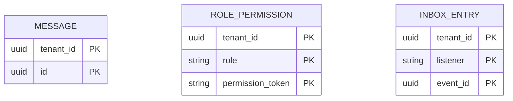
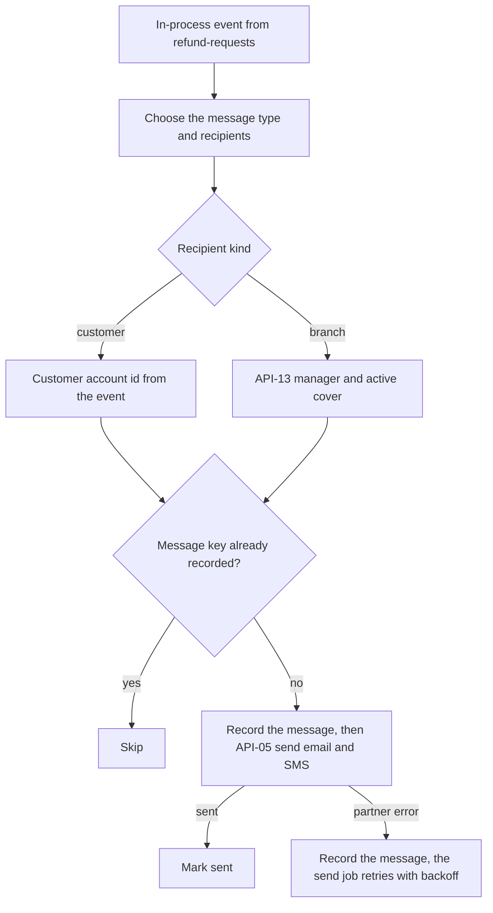

<!--
CHUNK: 13d
TITLE: Detailed Service Spec - notifications
PROJECT: Refunds Platform
VERSION: 1.1
DEPENDS_ON: 09, 07, 10 (event hub - topic names, event names, and payload contracts must match chunk 10 verbatim), 11 (API contracts - integration endpoints carry their API ID and match chunk 11 verbatim), 12 (roles - permission tokens match chunk 12 verbatim)
PART OF: SDD - Refunds Platform
-->

# 17. Detailed Service Specs

---

## 17.4 notifications

### What

The module that sends every email and SMS of the platform through the Notification Partner: the messages that follow the refund lifecycle for customers and branch managers, and the confirmation and reset codes of customer accounts. It serves the messages of [REFUNDS/UC-01](../brd-refunds-portal/06a-use-cases-customer.md#uc-01-request-a-refund), [REFUNDS/UC-03](../brd-refunds-portal/06a-use-cases-customer.md#uc-03-cancel-a-refund-request), [REFUNDS/UC-04](../brd-refunds-portal/06b-use-cases-branch-manager.md#uc-04-approve--reject-refund), and [REFUNDS/UC-06](../brd-refunds-portal/06a-use-cases-customer.md#uc-06-sign-up-and-sign-in).

### Boundaries

- **Owns:** message templates per type and channel, the message log (type, recipient reference, channel, status, attempts, and the template parameters until the message ends), delivery retries.
- **Does not own:** contact details (customer-accounts for customers, refund-requests for branch managers and covers); the events that trigger messages; the codes (customer-accounts); the `MessageDispatchPort` interface (owned by customer-accounts; this module implements it).
- **Upstream consumers:** refund-requests (in-process events); customer-accounts (port API-14).
- **Downstream dependencies:** the Notification Partner (API-05); customer-accounts (API-12); refund-requests (API-13).

### Input

| Type | Source | Description |
|------|--------|-------------|
| Event | refund-requests: `RefundRequestSubmitted`, `RefundRequestCancelled`, `RefundRequestRejected`, `RefundPaid`, `RefundPayoutFailed`, `WaitingRequestsSummarised` | One message per recipient and channel |
| Port | customer-accounts: API-14, implemented here | Send a confirmation or reset code now |
| Schedule | `message-send`, every minute | The send job of notifications (§11.1) |

### Business Logic

Every message goes by email and SMS unless stated, in English, with dates, numbers, and amounts in the branch country's formats and the code EUR (§11.6, [REFUNDS 11 § UI/UX Expectations](../brd-refunds-portal/11-summary-and-uiux.md#uiux-expectations)), taken from the branch country and the business date the event carries (§6 Time rule).

- **Request submitted** ([REFUNDS/UC-01](../brd-refunds-portal/06a-use-cases-customer.md#uc-01-request-a-refund) step 6): on `RefundRequestSubmitted`, the customer gets the reference number and is told to bring the items to the branch.
- **Request cancelled** ([REFUNDS/UC-03](../brd-refunds-portal/06a-use-cases-customer.md#uc-03-cancel-a-refund-request) step 5): on `RefundRequestCancelled`, the customer is told the request is cancelled.
- **Request rejected** ([REFUNDS/UC-04](../brd-refunds-portal/06b-use-cases-branch-manager.md#uc-04-approve--reject-refund) A2): on `RefundRequestRejected`, the customer gets the reason.
- **Refund paid** ([REFUNDS/UC-04](../brd-refunds-portal/06b-use-cases-branch-manager.md#uc-04-approve--reject-refund) step 7): on `RefundPaid`, the customer gets the amount paid and, for a partial approval, the reason.
- **Payout failed** ([REFUNDS/UC-04](../brd-refunds-portal/06b-use-cases-branch-manager.md#uc-04-approve--reject-refund) E1; BR-6: a cover gets the covered branch's Payout failed messages): on `RefundPayoutFailed`, the branch manager and any active cover are told, and the customer is asked to visit the branch.
- **Waiting requests** ([REFUNDS/UC-04](../brd-refunds-portal/06b-use-cases-branch-manager.md#uc-04-approve--reject-refund) BR-5: daily waiting-requests message; BR-6): on `WaitingRequestsSummarised`, the branch manager and any active cover get the number of waiting requests and how long the oldest has waited.
- **Codes** ([REFUNDS/UC-06](../brd-refunds-portal/06a-use-cases-customer.md#uc-06-sign-up-and-sign-in) step 4, A3, E1, E3): port API-14 sends one code to one address synchronously, within the deadline the caller passes (§12 INT-02); when the partner does not answer in time it raises an error at once, so the customer is asked to try again later (E3). A repeated call with the same idempotency key returns the first outcome and sends nothing.
- **Recipients:** the listener resolves who receives each message: the customer by the account id in the event, and the branch manager and any active cover through API-13. It records one message per recipient and channel under a unique key made of the source publication, the channel, and the recipient, and completes (§11.1). Addresses are read when the message is sent, through API-12 for a customer and API-13 for branch recipients; they are used for the call and never stored.
- **Delivery:** the listener may make the first try right after its commit, and the `message-send` job makes every later try (§11.1), so a redelivered event records nothing new and never sends a message twice. A message not sent by the give-up limit of §12 INT-02 is marked failed, with an alert (§11.4); the customer still sees the status in [REFUNDS/UC-02](../brd-refunds-portal/06a-use-cases-customer.md#uc-02-track-refund-status) ([REFUNDS 02 § Dependencies](../brd-refunds-portal/02-glossary-assumptions-facts.md#dependencies)).

**State machine (if applicable):** Not applicable: a message is only pending, then sent, failed, or skipped.

### Output

| Type | Destination | Description |
|------|-------------|-------------|
| Outbound call | Notification Partner (API-05) | One email or SMS |
| Port answer | customer-accounts (API-14) | Sent, or partner unavailable |

### Integrations

| Integration | Direction | Protocol | Purpose | Contract | Failure Handling |
|-------------|-----------|----------|---------|----------|------------------|
| Notification Partner | Outbound, sync | Provider API | Send one email or SMS | API-05 (§15) | Codes: error to the caller ([REFUNDS/UC-06](../brd-refunds-portal/06a-use-cases-customer.md#uc-06-sign-up-and-sign-in) E3). Events: retried by the module's send job (§11.1, §12 INT-02) |
| customer-accounts | Outbound, sync (in-process) | Port | Customer contact details | API-12 (§15) | Unknown or closed account: no customer message, logged |
| refund-requests | Outbound, sync (in-process) | Port | Branch manager and cover contact details | API-13 (§15) | Branch with no recipient: logged and alerted (§20.1.10) |
| customer-accounts | Inbound, sync (in-process) | Port, owned by customer-accounts and implemented here | Send a code now | API-14 (§15) | Raises `NotificationPartnerUnavailable` |
| refund-requests | Inbound, async | In-process events | Message triggers | `RefundRequestSubmitted`, `RefundRequestCancelled`, `RefundRequestRejected`, `RefundPaid`, `RefundPayoutFailed`, `WaitingRequestsSummarised` (§14.10) | Redelivered from the publication log |

### DB Modeling

#### Entity Relationship

**Figure 24: Entity Relationship - notifications**

**Summary:** The message log is one table, one row per message, with no relation to the seeded role permissions or the listener inbox.

#### Tables Design

| Table | Column | Type | Constraints | Notes |
|-------|--------|------|-------------|-------|
| `message` | `tenant_id`, `id` | uuid, uuid | PK (`tenant_id`, `id`), NOT NULL | `id` is UUIDv7 |
| `message` | `message_key` | varchar(200) | NOT NULL; unique (`tenant_id`, `message_key`) | Source publication, channel, and recipient; or the API-14 idempotency key |
| `message` | `message_type` | varchar(24) | NOT NULL | REQUEST_SUBMITTED, REQUEST_CANCELLED, REQUEST_REJECTED, REFUND_PAID, PAYOUT_FAILED, WAITING_REQUESTS, SIGN_UP_CODE, or RESET_CODE |
| `message` | `channel` | varchar(5) | NOT NULL; EMAIL or SMS | |
| `message` | `recipient_kind` | varchar(12) | NOT NULL; CUSTOMER, BRANCH_STAFF, or DIRECT | DIRECT is a code sent to the address in the call |
| `message` | `recipient_ref` | varchar(64) | NULL only for DIRECT | Customer account id or staff id; never an address |
| `message` | `branch_country` | char(2) | NULL for codes | Formats of §11.6 |
| `message` | `params` | jsonb | NULL once the message ends | Template parameters while PENDING (§11.1); never a code |
| `message` | `status` | varchar(8) | NOT NULL; PENDING, SENT, FAILED, or SKIPPED; index (`tenant_id`, `status`, `next_attempt_at`) | |
| `message` | `attempts` | integer | NOT NULL | |
| `message` | `first_attempt_at`, `next_attempt_at` | timestamptz, timestamptz | NULL until due or once ended | |
| `message` | `give_up_at` | timestamptz | NULL for codes | The §12 INT-02 limit after the first try |
| `message` | `last_error_code` | varchar(64) | NULL unless the last try failed | |
| `message` | `ended_at` | timestamptz | NULL while PENDING | |
| `message` | `created_at`, `created_by`, `updated_at`, `updated_by`, `version` | per §11.1 | NOT NULL | |
| `role_permission` | `tenant_id`, `role`, `permission_token` | uuid, varchar(40), varchar(80) | PK (`tenant_id`, `role`, `permission_token`), NOT NULL | Seed of §16.12.1 |
| `inbox_entry` | `tenant_id`, `listener`, `event_id` | uuid, varchar(80), uuid | PK (`tenant_id`, `listener`, `event_id`), NOT NULL | One row per event a listener handled |
| `inbox_entry` | `status`, `attempts`, `updated_at` | varchar(8), integer, timestamptz | NOT NULL; status DONE or PARKED | |
| `inbox_entry` | `last_error_code` | varchar(64) | NULL unless a run failed | |

#### Migration Strategy

- **Tool:** Flyway, versioned SQL in the module's own location for the `notifications` schema (§11.1).
- **Backward compatibility:** additive changes; expand, then contract for a breaking change.
- **Data backfill:** a separate versioned migration, run before the code that reads the new column.
- **Rollback:** a forward fix migration; no down scripts.

#### Retention Policy

- `message`: the template parameters are cleared when the message ends; the row is deleted 90 days after it ends.
- `role_permission`: the seed of the running release.
- `inbox_entry`: DONE rows deleted after 30 days; PARKED rows kept until the §20.1.3 procedure closes them.

#### Archival

- **Cold storage:** Not applicable: no record is archived.
- **Format:** Not applicable.
- **Schedule:** Not applicable.
- **Restore SLA:** Not applicable.

#### Data Encryption

- **At rest:** the database volume encryption of the hosting.
- **In transit:** TLS 1.2 or later (§11.6).
- **Key management:** Vault for the provider credentials, rotation per §11.6.
- **PII columns:** none at rest beyond the template parameters of pending messages (a reason or an amount); the log keeps recipient references, not addresses.

### Multi-Tenancy Specifications

- **Strategy override:** None: shared schema with `tenant_id`, PostgreSQL, and the §11.4 instrumentation, as §11 sets.
- **Tenant filter:** `tenant_id` from the event or the port call; provider credentials chosen per tenant.
- **Cross-tenant queries:** forbidden; the `message-send` job runs per tenant from the tenant registry (§11.2).

### API Standards

- **Style:** no HTTP endpoint; one in-process port (API-14).
- **Versioning:** Not applicable.
- **Authentication:** the port checks the caller's §16 token.
- **Idempotency:** per message (source publication, channel, recipient); API-14 per its idempotency key.
- **Pagination:** Not applicable.
- **Error envelope:** typed errors carrying the §15.1 `errorCode`.

#### List of APIs (Swagger-friendly)

Not applicable - the module exposes no HTTP endpoint; its only inbound interface is the in-process port API-14 (§15).

### Event-Driven Architecture (If Applicable)

#### Event Model

**Published events:**

Not applicable - no integration events.

**Consumed events:**

Not applicable - no integration events.

**In-process domain events (modules only):**

| Event | Publisher module | Listener modules | Transaction phase (before commit / after commit) | Payload (DTO) | Notes |
|---|---|---|---|---|---|
| `RefundRequestSubmitted` | refund-requests | notifications, customer-accounts, refund-requests (POS adapter) | after commit | `RefundRequestSubmittedDto`: tenantId, correlationId, refundRequestId, referenceNumber, customerAccountId, branchId, branchCountry, purchaseReference, itemRefs, requestedAmount (Money), businessDate, submittedAt | Here: customer message |
| `RefundRequestCancelled` | refund-requests | notifications, refund-requests (POS adapter) | after commit | `RefundRequestCancelledDto`: tenantId, correlationId, refundRequestId, referenceNumber, customerAccountId, branchId, branchCountry, businessDate, cancelledAt | Here: customer message |
| `RefundRequestRejected` | refund-requests | notifications, refund-requests (POS adapter) | after commit | `RefundRequestRejectedDto`: tenantId, correlationId, refundRequestId, referenceNumber, customerAccountId, branchId, branchCountry, reason, businessDate, rejectedAt | Here: customer message with the reason |
| `RefundPaid` | refund-requests | notifications, loyalty-points | after commit | `RefundPaidDto`: tenantId, correlationId, refundRequestId, referenceNumber, customerAccountId, branchId, branchCountry, purchaseReference, paidAmount (Money), refundDate, partialReason (optional), paidAt | Here: customer message with the amount paid |
| `RefundPayoutFailed` | refund-requests | notifications, refund-requests (POS adapter) | after commit | `RefundPayoutFailedDto`: tenantId, correlationId, refundRequestId, referenceNumber, customerAccountId, branchId, branchCountry, businessDate, failedAt | Here: branch manager, cover, and customer messages |
| `WaitingRequestsSummarised` | refund-requests | notifications | after commit | `WaitingRequestsSummarisedDto`: tenantId, correlationId, branchId, branchCountry, summaryDate, waitingCount, oldestSubmittedAt | Here: branch manager and cover message |

#### Messaging Infra

Not applicable - no integration events.

### Constraints

- No user role calls this module. Port API-14 needs `notifications.message.send`, held by the customer-accounts module identity. The module identity of notifications holds `customer-accounts.contact.read` (API-12) and `refund-requests.branch-recipients.read` (API-13).
- Messages to customers go to confirmed addresses only ([REFUNDS/UC-06](../brd-refunds-portal/06a-use-cases-customer.md#uc-06-sign-up-and-sign-in) BR-1: confirm both addresses before the first request).
- No message body, address, or code is stored or logged.

### Error Handling

- **Synchronous APIs:** API-14 raises `NotificationPartnerUnavailable` with `errorCode` `UNAVAILABLE` when the partner does not answer within the caller's deadline ([REFUNDS/UC-06](../brd-refunds-portal/06a-use-cases-customer.md#uc-06-sign-up-and-sign-in) E3), and `InvalidDestination` with `VALIDATION_FAILED` for a malformed address.
- **Validation errors:** a malformed address from a contact lookup marks the message failed and alerts (§20.1.11).
- **Domain errors:** a closed customer account or a branch with no recipient skips the message and logs it; a branch with no recipient also alerts (§20.1.10).
- **Auth errors:** a port call without the right §16 token raises `PortAccessDenied` with `FORBIDDEN`.
- **Server errors:** a partner error on an event-driven message leaves it pending, and the send job retries it.
- **Async consumers:** each listener records each event in `inbox_entry` and its messages under their unique keys, so a redelivered event records nothing new.
- **Poison messages:** a listener run that fails is retried by the `publication-resubmit` job (§11.1); after 10 failed runs the listener parks the event (`inbox_entry` PARKED), completes the publication, and raises an alert, and §20.1.3 replays it. The `message-send` job retries a message with exponential backoff and jitter from 1 minute, doubling to at most 30 minutes, each API-05 call bounded by the INT-02 timeout (§12), until the INT-02 give-up limit marks it failed with an alert.

### Observability & Monitoring

#### Logging

- JSON per §11.4.
- Fields: correlation id, message type, channel, outcome, attempt; never an address, a body, or a code.
- Retention per §11.4.

#### Metrics

| Metric | Type | Labels | Purpose |
|--------|------|--------|---------|
| `messages_total` | counter | `type`, `channel`, `outcome` | Messages sent, failed, or skipped |
| `messages_pending` | gauge | - | Messages waiting to be sent |
| `message_oldest_pending_seconds` | gauge | - | Age of the oldest pending message |
| `code_sends_total` | counter | `channel`, `outcome` | API-14 sends |
| `partner_call_duration_seconds` | histogram | `path` | API-05 call time for codes and for event-driven messages |
| `bulkhead_rejections_total` | counter | `bulkhead` | Calls refused by the code or the event bulkhead |

#### Tracing

- OpenTelemetry spans for each listener run, each port call, and each API-05 call.
- W3C trace context on the outbound call when the partner accepts it.
- Sampling per §11.4.

### Developer Notes

- **Recommended patterns:** hexagonal port `MessagingProviderPort` (API-05); an adapter that implements `MessageDispatchPort` (API-14, owned by customer-accounts); one template per message type and channel, kept in the code base. API-14 sends run in their own Resilience4j bulkhead, apart from the event-driven API-05 sends.
- **Avoid:** keeping contact details; sending a message inside the publisher's transaction; turning a UTC time into a branch date (§6 Time rule).
- **Testing:** JUnit 5 and Mockito for template selection and recipients; Testcontainers with PostgreSQL and a stubbed partner for retries, duplicates, the give-up limit, and the bulkhead split.

### Service-Level Diagrams

#### Implementation Flow Chart

**Figure 25: Implementation Flow - notifications**

**Summary:** Each event resolves its recipients, records one message per recipient and channel under a unique key, and skips any key already recorded, so no message is sent twice. A partner error leaves the message recorded for the send job, which retries it with backoff.

#### Sequence Diagram (Service-Internal)

Not applicable - the module's interactions are in §8.5.1 to §8.5.3; there is no further internal step to show.

### Compliance

- **GDPR:** applies: customer and branch manager email addresses and mobile numbers pass through the module to the Notification Partner for each send, and the message log keeps recipient references and, until a message ends, its template parameters. Retention windows: the parameters are cleared when a message ends and the row is deleted 90 days later. The lawful basis is the one recorded for the contact data (§17.1 Compliance), the refund request data (§17.2 Compliance), and staff data (§11.6).
- **PCI-DSS:** Not applicable: no card data is handled.
- **ISO 27001 / SOC 2:** neither BRD requires a certification; the controls of §11.6 apply.
- **Local regulations:** none known for this module.

### Deployment Strategy

- **Service-specific override:** None - a module of the one deployable (§11.3).
- **Replicas:** those of the deployable (§11.3); the `message-send` job runs on one replica under the job lock.
- **Strategy:** rolling, with the deployable.
- **Health checks:** the deployable's liveness and readiness probes.
- **Rollback:** Helm rollback of the deployable.

### Future Enhancements

- None identified at this time.

<!-- MASTER: refunds-platform-sdd-master.md | PREV: 13c-service-payouts.md | NEXT: 13e-service-loyalty-points.md -->
