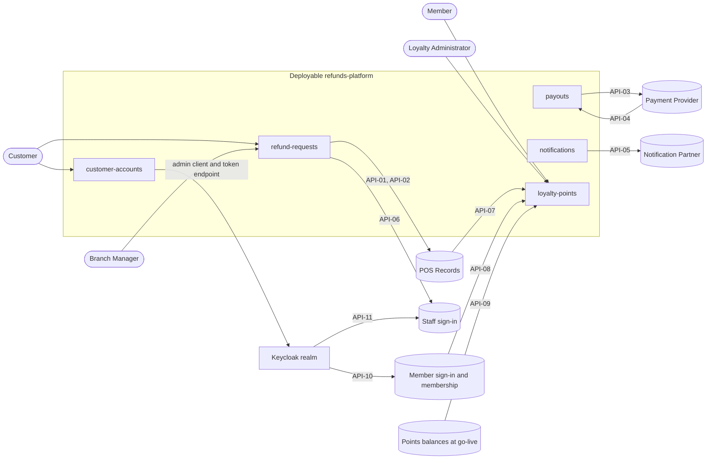
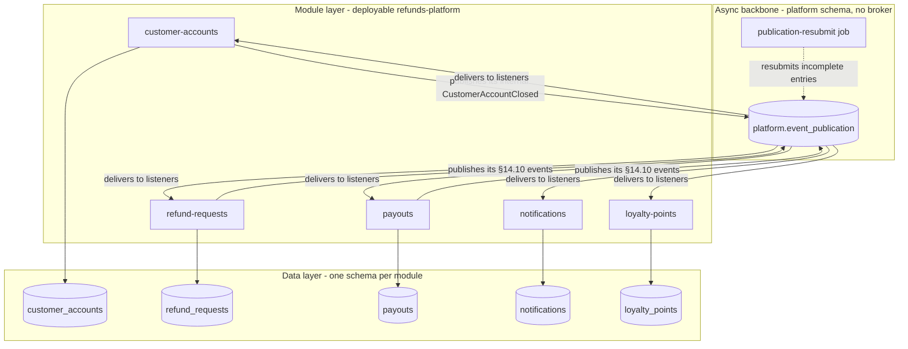
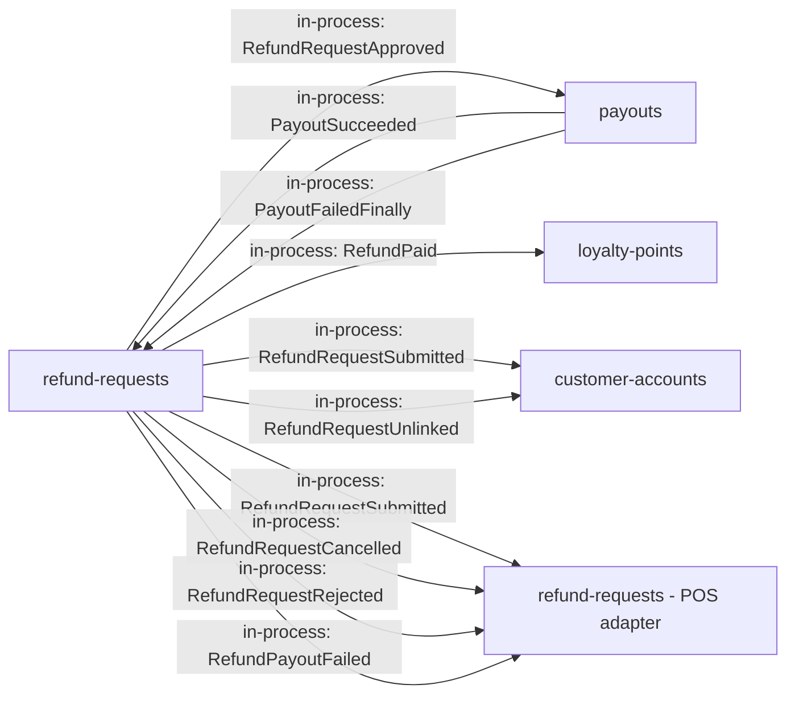
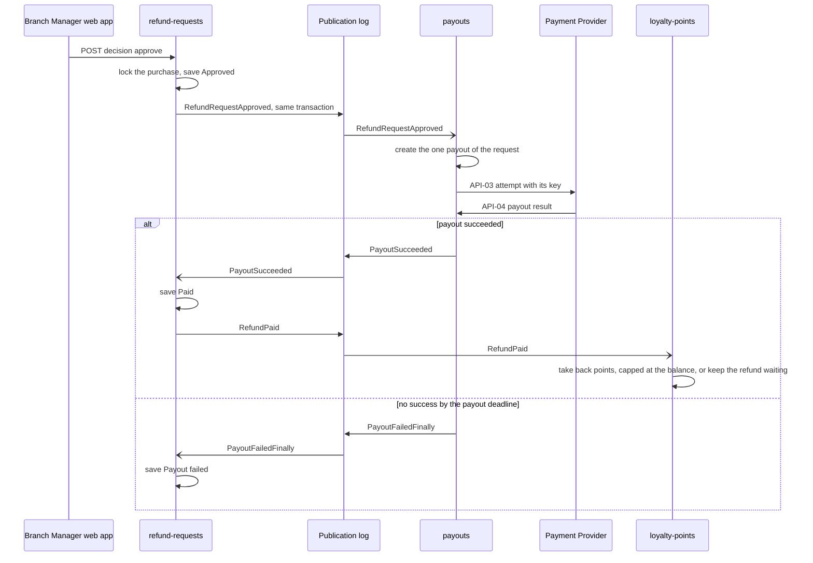
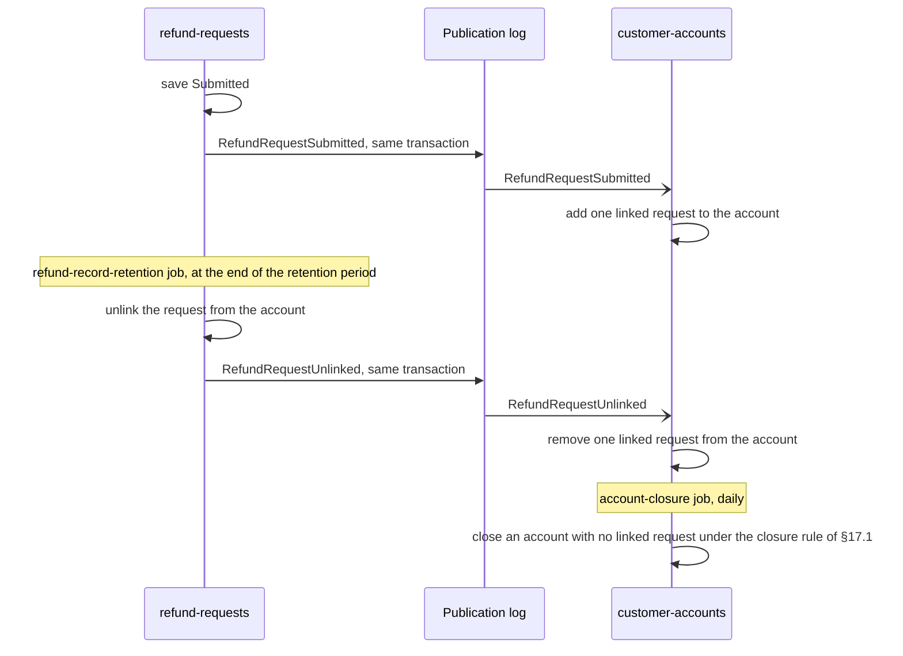

<!--
CHUNK: 19
TITLE: End-to-End System Design (Services · Topics · Producers · Consumers)
PROJECT: Refunds Platform
VERSION: 1.3
DEPENDS_ON: 02 to 08 (ecosystem, actors, architecture views, workflows and sequences, principles and ADRs, cross-cutting defaults, integrations), 09, 10 (event hub), 11 (API contracts), 12 (user roles), 13a+ (per-service chunks), 18 (open items: must be cleared first)
PART OF: SDD - Refunds Platform
PURPOSE: The single end-to-end view of the whole system: every service, every topic, every producer->consumer edge, the synchronous edges (HTTP and in-process), and the key sagas. Authored LAST, only after chunk 18 is cleared, so it consolidates the final reconciled and reviewed state.
GATE: This chunk cannot be generated or refreshed until the e2e gate is open (SKILL.md step 8b, conditions E1-E4): every open item in chunk 18 is resolved (Deferred counts as open), no contract divergence is open, no clarification marker is left in chunks 09 to 13x or in 03 §7.3 (use-case traceability), and the contract reconciliation was rerun after the last change. No override. While the gate is shut, nothing of this chunk is written, not even a draft or outline. Its state lives only on the E2E gate line (in the master); a Stale mark never touches this chunk.
FAITHFULNESS_RULE: This chunk is a faithful consolidation, not a new design. Every count, name, edge, and claim must trace to chunks 02 to 13x (SKILL.md step 8b checks it). A doctrine's home is §14.7 or an Accepted ADR only: a doctrine whose ADR is still Proposed is left out of §24.6 and named in the Faithfulness list. Any deliberate simplification (clustered edges, sampled sagas) is stated explicitly - no silent caps.
NO_DUPLICATION_RULE: One fact, one home. This chunk shows only what no other chunk shows (the whole-system fan-out maps and saga views). The system context and the layered architecture are §8.2 and §8.3 (chunk 04): §24.2 and §24.3 cite them and draw only what they add. Normative content owned elsewhere (the async mechanism §14.2.1, the topic registry §14.4, the guarantees §14.6, the doctrines §14.7) is REFERENCED, never restated.
-->

# 24. End-to-End System Design (Services · Topics · Producers · Consumers)

> **What this chunk is.** The bird's-eye, implementation-facing map of the entire platform: the service landscape, the system context, the layered architecture, the full producer → topic → consumer fan-out, the synchronous edges, and the key sagas. A new engineer (or AI implementer) reads this chunk to understand how the system fits together, following its references into chunks 10/11/13x for the normative contracts.

---

## How to Read This Document

Start with the module landscape (§24.1), then the two views that add to the base views of §8.2 and §8.3 (§24.2, §24.3), the event map (§24.5), the synchronous edges (§24.7), and the sagas (§24.8). The platform is one deployable, `refunds-platform`, with five modules and no message broker (ADR-01, ADR-02), so there are no topics: rectangles are modules, the POS adapter of refund-requests, the publication resubmission job, and the Keycloak realm; rounded nodes are actors; and cylinders are outside systems, module schemas, and the publication log table; an edge labelled `in-process: EventName` is a domain event of §14.10 delivered through the publication log, and an edge or row labelled `API-NN` is a contract of §15.

### Counts at a Glance

| Dimension | Count | Source of truth |
|---|---|---|
| Services | 5 (modules of one deployable) | §13 (chunk 09) |
| Topics | 0 | §14.4 (chunk 10) |
| Distinct published events | 0 (integration events) | §14.9 coverage matrix (chunk 10) |
| In-process domain events | 10 | §14.10 (chunk 10) |
| Synchronous HTTP edges between services | 0 | §24.7 |
| In-process port calls | 3 | §24.7 |
| Sagas documented | 2 | §24.8 |

### Faithfulness & Deliberate Simplifications (no silent caps)

- The platform has no integration events and no topics (ADR-02; §14.1): the topic and published-event counts are 0, §24.4 is not applicable, and §24.5 draws the in-process events of §14.10 as labelled module-to-module edges. No module publishes to or consumes from a topic, so every module carries the single release phase in §24.1.
- §24.2 draws each actor straight to the modules it uses (§16.7) and each inbound provider call straight to the module that handles it; the web apps, the ingress, and the API gateway between them, and the users' OIDC sign-ins through Keycloak, are in §8.3, and the provider route checks in §11.6.
- §24.3 draws only the publication log with its resubmission job, and the module schemas; the delivery, resubmission, and retention rules of the publication log are in §11.1 and §14.10, and the send jobs that make the outside calls are in the 13x chunks.
- §24.5.1 leaves out the edges to notifications, the universal subscriber of §24.5.3; `WaitingRequestsSummarised`, which only notifications handles, therefore appears in no diagram of this chunk (§14.10).
- §24.8 leaves out the messages that notifications sends and the items notices of the refund-requests POS adapter, which change no other module's business state; §24.8.1 draws the payout result from API-04, while a success can also come back in the API-03 answer (§17.3).
- Every qualifying saga is drawn. No other flow changes the business state of two §13 rows: sign-up changes customer-accounts only (notifications sends the codes), cancellation and rejection change refund-requests only (its POS adapter is inside it), and corrections and purchases change loyalty-points only.
- §24.6 names the doctrines on how modules interact, each with its home in §14.7 or an Accepted ADR; every ADR in §10 is Accepted, so none is left out for being Proposed. ADR-01, ADR-03, ADR-04, and ADR-07 decide the style, the tenancy, the API style, and the identity provider rather than how modules interact, and the tenant context carried on every port call and event is a cross-cutting default of §11.2, not a §14.7 or ADR doctrine, so §24.6 does not list them.

## 24.1 Service Landscape (archetype × phase)

No module publishes to or consumes from a topic (§14.4: none); the two async columns list the in-process events of §14.10 that each module publishes or handles.

| # | Service | Archetype | Phase | Publishes to | Consumes from | Sync surface |
|---|---|---|---|---|---|---|
| 1 | customer-accounts | domain | P1 (single release) | - | `RefundRequestSubmitted`, `RefundRequestUnlinked` | REST: sign-up and password reset (public), `GET /v1/customer-accounts/me`; port API-12 (provider) |
| 2 | refund-requests | domain | P1 (single release) | `RefundRequestSubmitted`, `RefundRequestCancelled`, `RefundRequestApproved`, `RefundRequestRejected`, `RefundPaid`, `RefundPayoutFailed`, `WaitingRequestsSummarised`, `RefundRequestUnlinked` | `PayoutSucceeded`, `PayoutFailedFinally`; its own `RefundRequestSubmitted`, `RefundRequestCancelled`, `RefundRequestRejected`, `RefundPayoutFailed` (POS adapter) | REST: receipt lookups, refund requests (submit, list, read, cancel), branch queue and decisions, branch refund report; port API-13 (provider) |
| 3 | payouts | domain | P1 (single release) | `PayoutSucceeded`, `PayoutFailedFinally` | `RefundRequestApproved` | No user REST; the provider callback API-04 (external inbound) |
| 4 | notifications | reusable-generic | P1 (single release) | - | `RefundRequestSubmitted`, `RefundRequestCancelled`, `RefundRequestRejected`, `RefundPaid`, `RefundPayoutFailed`, `WaitingRequestsSummarised` | No REST; port API-14 (implements the port that customer-accounts owns) |
| 5 | loyalty-points | domain | P1 (single release) | - | `RefundPaid` | REST: balance, movements, member points, corrections, monthly corrections report; inbound API-07, API-08, API-09 (external) |

## 24.2 System Context

**Base view:** [§8.2 Context Diagram](./04-architecture-style-and-diagrams.md#82-context-diagram).

**Figure 29: System Context - modules behind the actors and outside systems**

**Summary:** §8.2 shows the platform as one box; this view adds the module behind each actor and each outside system. Customers use customer-accounts and refund-requests, branch managers refund-requests, and members and Loyalty Administrators loyalty-points; refund-requests, payouts, and notifications make the outbound provider calls, loyalty-points and payouts receive the inbound ones, Keycloak brokers the two sign-ins, and customer-accounts manages the customer users in Keycloak through its admin client and token endpoint.

## 24.3 Layered High-Level Architecture

**Base view:** [§8.3 High-Level Architecture Diagram](./04-architecture-style-and-diagrams.md#83-high-level-architecture-diagram).

**Figure 30: Layered Architecture - the publication log backbone and the module schemas**

**Summary:** §8.3 draws the in-process events as direct edges between modules and one database box; this view adds the backbone that carries them, the publication log in the `platform` schema with its resubmission job, and the schema each module owns. refund-requests and payouts publish the §14.10 events into the log, customer-accounts also uses it for its internal closure publication, and every module has listeners (§11.1, ADR-02, ADR-06).

## 24.4 The Universal Per-Event Mechanism (async backbone)

Not applicable - no integration events (in-process domain events: §14.10).

## 24.5 Producer → Topic → Consumer Fan-Out (the event map)

### 24.5.1 Phase 1 Domains

**Figure 31: Event Map - in-process domain events between modules**

**Summary:** refund-requests publishes every event except the two payout outcomes, which payouts publishes and only refund-requests handles; loyalty-points handles `RefundPaid`, customer-accounts the submission and the unlinking, and the POS adapter of refund-requests the four events that hold or free items at POS Records. notifications, which handles the message events, is in §24.5.3.

### 24.5.2 Phase 2+ Domains

Not applicable for this release: one delivery phase.

### 24.5.3 Universal Subscribers (breadth rules)

- **notifications** - binds the refund events that need a message; its binding rule and its event list: §14.7. Its edges are left out of §24.5.1.

## 24.6 Cross-Service Doctrines

1. Durable in-process events through the publication log, no broker - normative home ADR-02.
2. In-process events by default, a port call only for request-response, one hop - normative home ADR-05.
3. Outcome re-publication - normative home §14.7.
4. Leave the process only from the publication log - normative home §14.7 (synchronous exceptions: §8.1.1).
5. No contact details in events - normative home §14.7, ADR-05.
6. Module-side authorization enforcement - normative home ADR-08.
7. Module-private schemas - normative home ADR-06.

## 24.7 Synchronous Edges (one-hop rule)

| # | Caller → Callee | API ID (§15) | Purpose | Why synchronous |
|---|---|---|---|---|
| 1 | notifications → customer-accounts (in-process) | API-12 | Get a customer's contact details | Contact details never travel in events, so a message reads them when it is sent (ADR-05) |
| 2 | notifications → refund-requests (in-process) | API-13 | Get a branch's recipients | The branch manager and cover are read when a message is sent, from the last synced branch assignments (ADR-05) |
| 3 | customer-accounts → notifications (in-process) | API-14 | Send a message now | The customer must learn at once when codes cannot be sent ([REFUNDS/UC-06](../brd-refunds-portal/06a-use-cases-customer.md#uc-06-sign-up-and-sign-in) E3; ADR-05) |

No HTTP call runs between modules; each port call is one hop (§15.5).

## 24.8 Key Sagas (dynamic view)

### 24.8.1 Refund payout and points take-back (choreographed)

**Use cases:** [REFUNDS/UC-04](../brd-refunds-portal/06b-use-cases-branch-manager.md#uc-04-approve--reject-refund), [LOYALTY/UC-02](../brd-loyalty-points/06a-use-cases-member.md#uc-02-view-points-history)

**Figure 32: Saga - refund payout and points take-back**

**Summary:** An approval saves Approved and fires `RefundRequestApproved`; payouts creates the one payout of the request and calls the Payment Provider with one key per attempt until it pays or the payout deadline (§17.3) passes, and a success makes the request Paid and fires `RefundPaid`, which takes back points in loyalty-points or waits for the purchase. The failure path is the final failure at the deadline: the request becomes Payout failed, no `RefundPaid` fires, so no points are taken back, and a success reported after the deadline changes no status (R-14, §20.1.8).

### 24.8.2 Linked requests and account closure (choreographed)

**Use cases:** [REFUNDS/UC-01](../brd-refunds-portal/06a-use-cases-customer.md#uc-01-request-a-refund)

**Figure 33: Saga - linked requests and account closure**

**Summary:** Each submitted request adds a linked request to the customer's account and each unlinking at the end of the refund record retention removes one, so the daily account-closure job never closes an account that still has linked refund records ([REFUNDS 03 § Refund records](../brd-refunds-portal/03-definitions-and-domain-concepts.md#refund-records)). There is no compensation step: each listener applies its event once, and the publication log redelivers it until it completes (§14.10).

## 24.9 Normative References

- **Topic registry (one row per topic, owner, key family):** §14.4 ([10-events-hub.md](./10-events-hub.md)); no topic exists in this release.
- **Per-event consumer reconciliation:** §14.10 for the in-process events (§14.5 not applicable); payload contracts: the §14.10 DTOs, with the value objects of §14.9.0.
- **Cross-cutting guarantees:** in-process domain events: §14.10 and §11.1; no broker event edge exists, so §14.6 is not applicable.
- **Universal subscribers & doctrines:** §14.7.
- **Roles & authorities behind every edge's authorization:** §16 ([12-centralized-user-roles.md](./12-centralized-user-roles.md)).
- **Synchronous API contracts (URI, headers, body, error codes, security):** §15 ([11-api-contracts.md](./11-api-contracts.md)).

## Sources

- Chunks 02 to 08 (§6 to §12: ecosystem, actors, architecture views, workflows and sequences, principles and ADRs, cross-cutting defaults, integrations) · chunk 09 (§13 decomposition) · chunk 10 (§14 event hub) · chunks 13a+ (§17 service specs) · chunk 12 (§16 roles) · chunk 11 (§15 API contracts) · chunk 18 (§23 open items, cleared).

<!-- MASTER: refunds-platform-sdd-master.md | PREV: 18-open-items-and-clarifications.md | NEXT: none -->
