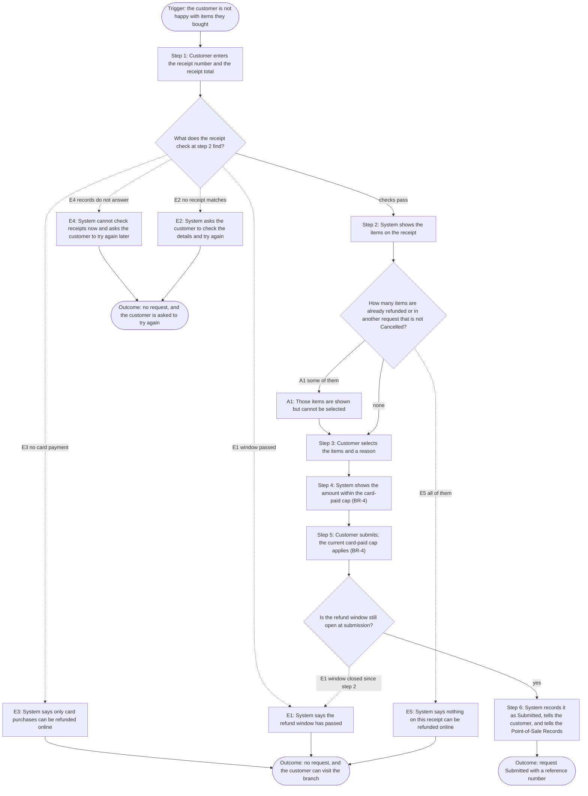
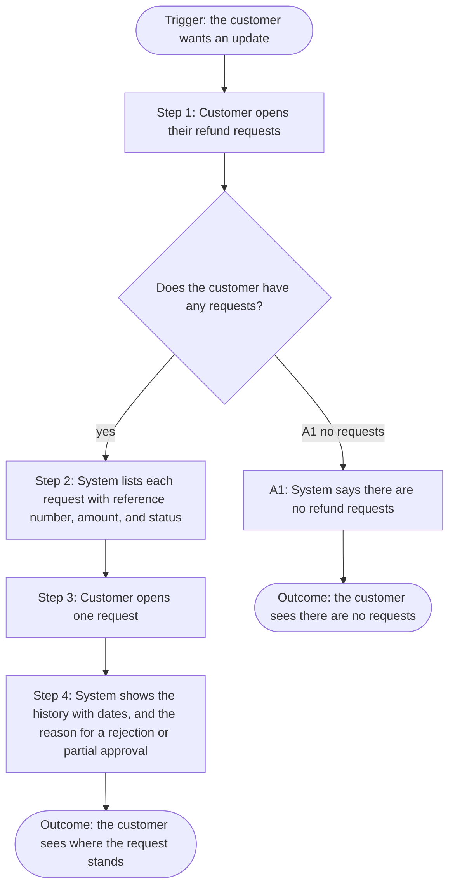
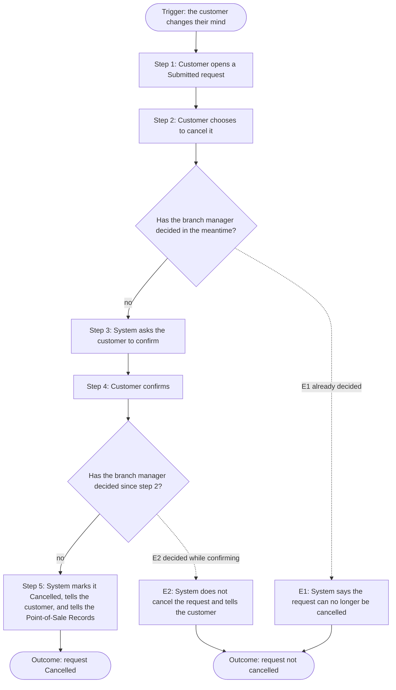
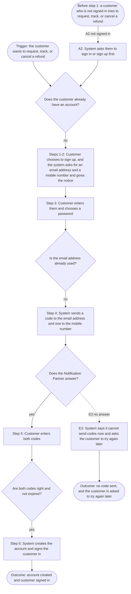
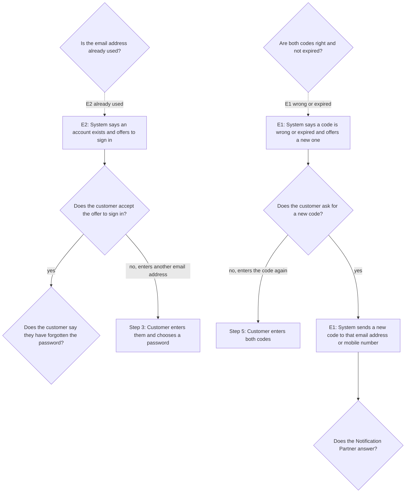
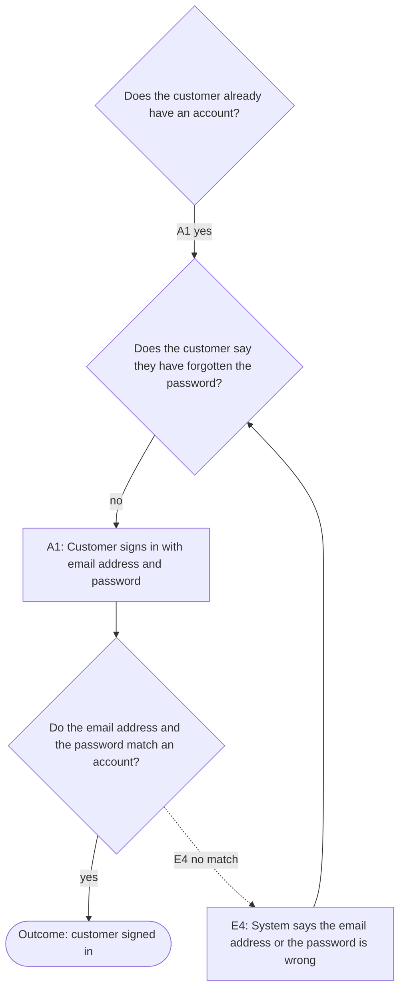
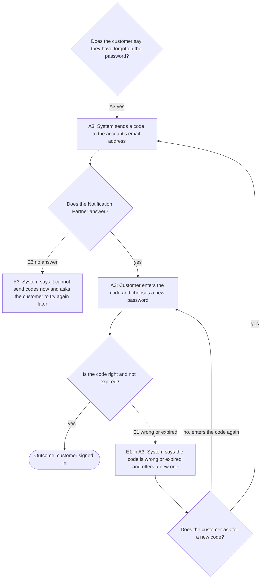

<!--
CHUNK: 06a
TITLE: Detailed Use Cases - Customer
PROJECT: Refunds Portal
VERSION: 1.9
DEPENDS_ON: 04, 05
PART OF: BRD - Refunds Portal
SPLIT RULE: One chunk per persona (06a, 06b, ...), in the same persona order as chunk 05. UC IDs stay sequential across the whole BRD, not per chunk.
LANGUAGE: Business language only. Steps describe what the actor does and what the system does for them - never how the system is built. No technology names, protocols, or implementation terminology.
-->

# Detailed Use Cases - Customer

All detailed use cases follow this structure:

- **Actor & Goal**: Who performs it, what they want, what triggers it.
- **Why**: The business value of this use case.
- **Preconditions**: What must be true before the use case can start.
- **Main Flow**: Numbered detailed steps - actor action, system response, alternating.
- **Alternate & Exception Flows**: What happens when the path branches or fails, in business terms.
- **Flowchart** (branching use cases only, added once the requirements are final): The main, alternate, and exception paths in one diagram, derived from the narrative.
- **Business Rules & Constraints**: Rules, limits, and conditions that govern the use case.
- **Acceptance Criteria**: Testable conditions that confirm the use case is complete.
- **Future Enhancements**: Low-complexity follow-ups that could ship next.
- **UI/UX**: Wireframes or references to approved Figma designs.

---

## UC-01: Request a Refund

| | |
|---|---|
| **Primary Actor** | Customer |
| **Supporting Actors** | External: Point-of-Sale Records ([08](./08-integrations.md)); External: Notification Partner ([08](./08-integrations.md)) |
| **Goal** | Get money back for items bought in a branch. |
| **Trigger** | The customer is not happy with items they bought. |

### Why

Supports Business Objectives 1 and 2: every request is recorded at once and is never lost.

### Preconditions

- The customer has the receipt of a branch purchase.
- The customer is signed in.

### Main Flow

1. The customer enters the receipt number and the total amount on the receipt.
2. The system shows the items on the receipt.
3. The customer selects the items and a reason.
4. The system shows the refund amount.
5. The customer submits the request.
6. The system records the request as Submitted, gives it a reference number, and tells the customer by email and SMS. The message tells the customer to bring the items to the branch. The system tells the Point-of-Sale Records which items are in the request.

### Alternate & Exception Flows

- **A1 - Some items already refunded or in another request that is not Cancelled:** At step 2, those items are shown but cannot be selected. The customer goes on to step 3 with the other items.
- **E1 - Refund window has passed:** At step 2, or at step 5 if the window has closed since step 2, the system tells the customer the refund window has passed and that they can visit the branch. At step 5 the request is not recorded.
- **E2 - Receipt not found:** At step 2, if no receipt matches both details, the system asks the customer to check them and try again.
- **E3 - Not paid by card:** At step 2, if no part of the purchase was paid by card, the system tells the customer that only card purchases can be refunded online and that they can visit the branch.
- **E4 - Receipt cannot be checked:** At step 2, if the Point-of-Sale Records do not answer, the system tells the customer it cannot check receipts right now and asks them to try again later. The system does not say the receipt is not found.
- **E5 - Nothing left to refund:** At step 2, if every item on the receipt is already refunded or in another request that is not Cancelled, no item can be selected. The system tells the customer that nothing on this receipt can be refunded online and that they can visit the branch. No request is recorded.

### Flowchart

#### Figure 4 - Flowchart: UC-01 Request a Refund

**Summary:** The customer enters the receipt details, and the receipt check at step 2 can stop the customer (E1 to E4), show some items as not selectable (A1), or find nothing left to refund (E5). The current card-paid cap applies at submission (BR-4); the request is recorded as Submitted unless the window closed (E1).

### Business Rules & Constraints

- A refund can be requested only within 30 days of purchase.
- An item can be refunded only once.
- The customer never enters card details.
- For a purchase paid partly by card, the refund is at most the card-paid amount left on that purchase. The amount left is the amount paid by card less the approved amounts of the purchase's Approved and Paid requests. Submitted, Rejected, Cancelled, and Payout failed requests do not count against this amount. The same cap applies when the request is submitted and when it is approved.
- The refund amount for an item is the price paid for it. A discount on the whole receipt is split across its items in proportion to their prices.
- An item in a request that is Submitted, Approved, Paid, Rejected, or Payout failed cannot be selected again. An item in a Cancelled request can be selected again within the refund window. After a partial approval, every item in the request counts as refunded.
- Day 1 of the refund window is the day after the purchase. A request submitted on day 30 is accepted. Days are calendar days, by the date in the branch's country. The system checks the window again when the customer submits.

### Acceptance Criteria

- [ ] Given a purchase 10 days old, when the customer submits a request, then it is recorded as Submitted with a reference number.
- [ ] Given a purchase 31 days old, when the customer enters the receipt, then they are told the refund window has passed.
- [ ] Given a purchase made 30 days ago, when the customer submits a request, then it is recorded as Submitted.
- [ ] Given an item already refunded or in another request that is not Cancelled, when the customer enters the receipt, then the item is shown but cannot be selected.
- [ ] Given details that match no receipt, when the customer enters them, then they are asked to check them and try again.
- [ ] Given a purchase with no card payment, when the customer enters the receipt, then they are told only card purchases can be refunded online.
- [ ] Given the Point-of-Sale Records do not answer, when the customer enters a receipt, then they are asked to try again later and are not told the receipt is not found.
- [ ] Given the refund window closes after the customer enters the receipt, when they submit the request, then it is not recorded and they are told the refund window has passed.
- [ ] Given an item already refunded or in another request that is not Cancelled, when the customer selects the other items and submits, then the request is recorded as Submitted.
- [ ] Given a receipt whose items are all already refunded or in another request that is not Cancelled, when the customer enters the receipt, then no item can be selected and they are told nothing on this receipt can be refunded online.

- [ ] Given a purchase paid 50 EUR by card with 30 EUR Approved and 10 EUR Paid in other requests, when a request for different eligible items is submitted, then its amount is at most the 10 EUR left. Other Submitted, Rejected, Cancelled, or Payout failed requests do not reduce that amount.

### Future Enhancements

- None identified at this time.

### UI/UX

Screen SCR-01 (refund request form). Figma: https://www.figma.com/proto/RFND01/refunds-portal?node-id=scr-01

---

## UC-02: Track Refund Status

| | |
|---|---|
| **Primary Actor** | Customer |
| **Supporting Actors** | None |
| **Goal** | Know where each refund request stands. |
| **Trigger** | The customer wants an update. |

### Why

Supports Business Objective 2: customers can see their request at any time.

### Preconditions

- The customer is signed in.

### Main Flow

1. The customer opens their refund requests.
2. The system lists each request with its reference number, amount, and status (Submitted, Approved, Rejected, Paid, Cancelled, Payout failed).
3. The customer opens one request.
4. The system shows its history with the date of each status change and, if it was rejected or partly approved, the reason.

### Alternate & Exception Flows

- **A1 - No requests yet:** At step 2, the system says there are no refund requests.

### Flowchart

#### Figure 5 - Flowchart: UC-02 Track Refund Status

**Summary:** The customer opens their requests and sees the list, or a message that there are none (A1). Opening one request shows its history and any reason.

### Business Rules & Constraints

- Customers see only their own requests.

### Acceptance Criteria

- [ ] Given an approved request, when the customer opens it, then they see Approved with the approval date.
- [ ] Given a customer with no requests, when they open their refund requests, then the system says there are none.

### Future Enhancements

- None identified at this time.

### UI/UX

Screen SCR-02 (my refund requests: list and request detail). Figma: https://www.figma.com/proto/RFND01/refunds-portal?node-id=scr-02

---

## UC-03: Cancel a Refund Request

| | |
|---|---|
| **Primary Actor** | Customer |
| **Supporting Actors** | External: Notification Partner ([08](./08-integrations.md)); External: Point-of-Sale Records ([08](./08-integrations.md)) |
| **Goal** | Withdraw a request they no longer want. |
| **Trigger** | The customer changes their mind. |

### Why

Saves branch managers from deciding on requests customers no longer want.

### Preconditions

- The request is Submitted (not decided yet).
- The customer is signed in.

### Main Flow

1. The customer opens a Submitted request.
2. The customer chooses to cancel it.
3. The system asks the customer to confirm.
4. The customer confirms.
5. The system marks the request Cancelled and tells the customer by email and SMS. The system tells the Point-of-Sale Records that the items can be refunded at the branch.

### Alternate & Exception Flows

- **E1 - Already decided:** At step 2, if the branch manager has decided in the meantime, the system says the request can no longer be cancelled.
- **E2 - Decided while confirming:** At step 4, if the branch manager has decided since step 2, the system does not cancel the request and tells the customer it can no longer be cancelled.

### Flowchart

#### Figure 6 - Flowchart: UC-03 Cancel a Refund Request

**Summary:** The customer cancels a Submitted request and confirms, and the request becomes Cancelled. If the branch manager decided first, at step 2 (E1) or while the customer confirms (E2), the request is not cancelled.

### Business Rules & Constraints

- Only Submitted requests can be cancelled.

### Acceptance Criteria

- [ ] Given a Submitted request, when the customer confirms the cancellation, then it becomes Cancelled.
- [ ] Given a request already decided, when the customer chooses to cancel, then they are told it can no longer be cancelled.
- [ ] Given a request decided while the customer confirms, when they confirm, then it is not cancelled and they are told.

### Future Enhancements

- None identified at this time.

### UI/UX

Screen SCR-02 (the cancel action on the request detail). Figma: https://www.figma.com/proto/RFND01/refunds-portal?node-id=scr-02

---

## UC-06: Sign Up and Sign In

| | |
|---|---|
| **Primary Actor** | Customer |
| **Supporting Actors** | External: Notification Partner ([08](./08-integrations.md)) |
| **Goal** | Have an account, so the portal knows who the customer is and where to send messages. |
| **Trigger** | The customer wants to request, track, or cancel a refund. |

### Why

UC-02 and UC-03 show and change only the customer's own requests. The messages in UC-01, UC-03, and UC-04 need a confirmed email address and mobile number. Supports Business Objective 2.

### Preconditions

- None.

### Main Flow

1. The customer chooses to sign up.
2. The system asks for an email address and a mobile number, and tells the customer how they are used and how long they are kept ([03 / Refund records](./03-definitions-and-domain-concepts.md#refund-records)).
3. The customer enters them and chooses a password, which they use to sign in later.
4. The system sends a confirmation code to the email address and another to the mobile number.
5. The customer enters both codes.
6. The system creates the account and signs the customer in.

### Alternate & Exception Flows

- **A1 - Customer already has an account:** At step 1, the customer signs in with their email address and password instead. The system signs them in.
- **A2 - Not signed in:** Before step 1, when a customer who is not signed in tries to request, track, or cancel a refund, the system asks them to sign in or sign up first.
- **E1 - Wrong or expired code:** At step 5, the system says the code is wrong or expired and offers to send a new one. If the customer asks for it, the system sends a new code to that email address or mobile number, and the customer goes back to step 5. If the customer does not ask for a new code, they can enter the code again at step 5 while it still works (BR-3, BR-4).
- **E2 - Email address already used:** At step 3, the system says an account already exists for this email address and offers to sign in. If the customer accepts, they sign in as in A1. If the customer does not accept, they can enter another email address at step 3.
- **E3 - Codes cannot be sent:** At step 4, or when E1 sends a new code, if the Notification Partner does not answer, the system tells the customer it cannot send codes right now and asks them to try again later.
- **A3 - Forgotten password:** In A1, the customer says they have forgotten the password. The system sends a confirmation code to the account's email address. The customer enters the code and chooses a new password, and the system signs them in. A wrong or expired code is handled as in E1, and codes that cannot be sent as in E3.
- **E4 - Sign-in fails:** In A1, if the email address and the password do not match an account, the system tells the customer that the email address or the password is wrong. The customer can try again or use A3.

### Flowchart

#### Figure 7 - Flowchart: UC-06 Sign Up and Sign In

**Summary:** The customer starts here; the successful sign-up path confirms both codes. The choices for an existing account, a used email address and wrong codes continue in Figures 9-11.

#### Figure 9 - UC-06 - Used email address and sign-up code retry

**Summary:** A used email address leads to sign-in or another address. A wrong or expired sign-up code leads to a new code or another attempt; shared nodes continue Figures 7 and 10.

#### Figure 10 - UC-06 - Sign-in and failed sign-in

**Summary:** An existing customer signs in; wrong details return them to the choice to retry or reset their password. The reset branch continues in Figure 11.

#### Figure 11 - UC-06 - Forgotten password and reset code

**Summary:** The reset code goes to the account email address. The customer can retry a wrong or expired code, request another code, or sign in after a valid reset; E3 continues at the shared failure outcome in Figure 7.

Shared node IDs connect these views of the same flow. Their labels and every original decision edge are preserved; no additional business path is introduced.

### Business Rules & Constraints

- The customer must confirm the email address and the mobile number before the first refund request.
- One account per email address.
- A confirmation code works for 15 minutes after it is sent.
- Only the latest code sent to an email address or mobile number works.

### Acceptance Criteria

- [ ] Given a new customer, when they confirm their email address and mobile number, then the account is created and they are signed in.
- [ ] Given a customer with an account, when they sign in, then they see only their own refund requests.
- [ ] Given a wrong or expired code, when the customer enters it, then the system offers to send a new code.
- [ ] Given an email address that already has an account, when someone signs up with it, then the system offers to sign in instead.
- [ ] Given a customer who is not signed in, when they try to request, track, or cancel a refund, then the system asks them to sign in or sign up first.
- [ ] Given a wrong or expired code, when the customer asks for a new one, then the system sends a new code to that email address or mobile number, and the customer can enter it.
- [ ] Given the Notification Partner does not answer, when a confirmation code must be sent, then the customer is asked to try again later.
- [ ] Given a wrong code, when the customer enters the right code again while it still works, then the sign-up goes on.
- [ ] Given an email address that already has an account, when the customer enters another email address instead, then the sign-up goes on with that address.
- [ ] Given a customer who has forgotten the password, when they enter the code sent to the account's email address and choose a new password, then they are signed in.
- [ ] Given an email address and a password that do not match an account, when the customer signs in, then they are told the email address or the password is wrong and can try again.

### Future Enhancements

- None identified at this time.

### UI/UX

Sign up and sign in (mockup MK-04). Figma: https://www.figma.com/proto/TEST-FIXTURE/refunds-portal-MK-04

<!-- MASTER: refunds-portal-brd-master.md | PREV: 05-user-journeys-overview.md | NEXT: 06b-use-cases-branch-manager.md -->
