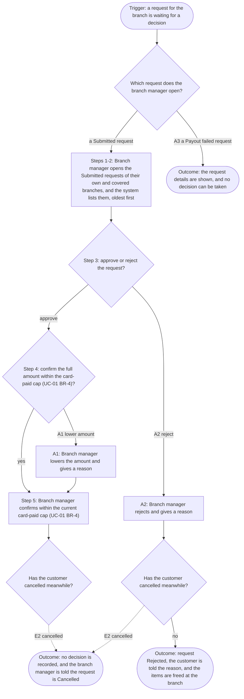
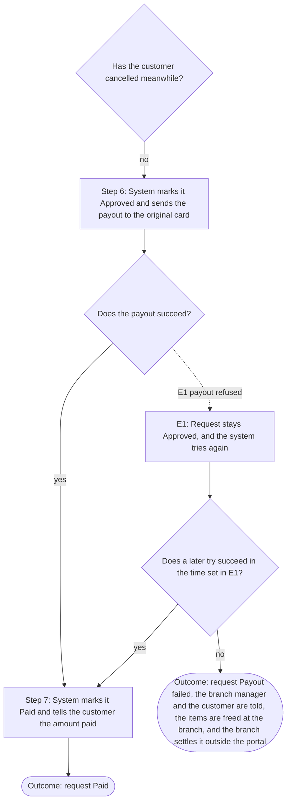

<!--
CHUNK: 06b
TITLE: Detailed Use Cases - Branch Manager
PROJECT: Refunds Portal
VERSION: 1.9
DEPENDS_ON: 04, 05
PART OF: BRD - Refunds Portal
SPLIT RULE: One chunk per persona (06a, 06b, ...), in the same persona order as chunk 05. UC IDs stay sequential across the whole BRD, not per chunk.
LANGUAGE: Business language only. Steps describe what the actor does and what the system does for them - never how the system is built. No technology names, protocols, or implementation terminology.
-->

# Detailed Use Cases - Branch Manager

All detailed use cases follow this structure:

- **Actor & Goal**: Who performs it, what they want, what triggers it.
- **Why**: The business value of this use case.
- **Preconditions**: What must be true before the use case can start.
- **Main Flow**: Numbered detailed steps - actor action, system response, alternating.
- **Alternate & Exception Flows**: What happens when the path branches or fails, in business terms.
- **Flowchart** (branching use cases only, added once the requirements are final): The main, alternate, and exception paths in one diagram, derived from the narrative.
- **Business Rules & Constraints**: Rules, limits, and conditions that govern the use case.
- **Acceptance Criteria**: Testable conditions that confirm the use case is complete.
- **Future Enhancements**: Low-complexity follow-ups that could ship next.
- **UI/UX**: Wireframes or references to approved Figma designs.

---

## UC-04: Approve / Reject Refund

| | |
|---|---|
| **Primary Actor** | Branch Manager |
| **Supporting Actors** | External: Payment Provider ([08](./08-integrations.md)); External: Notification Partner ([08](./08-integrations.md)); External: Point-of-Sale Records ([08](./08-integrations.md)) |
| **Goal** | Decide on each refund request for the branch. |
| **Trigger** | A request for the branch is waiting for a decision. |

### Why

Supports Business Objectives 1 and 3.

### Preconditions

- The request belongs to the branch manager's branch, or to a branch they cover, and is Submitted (Payout failed in A3).
- The branch manager is signed in, with the access set up outside the portal ([02 / Assumption 3](./02-glossary-assumptions-facts.md#assumptions--constraints)).

### Main Flow

1. The branch manager opens the list of Submitted requests for their branch and for any branch they cover.
2. The system lists them, oldest first, with amount and reason.
3. The branch manager opens a request and chooses Approve.
4. The system asks the branch manager to confirm the refund amount, at most the card-paid amount left under [UC-01 BR-4](./06a-use-cases-customer.md#uc-01-request-a-refund).
5. The branch manager confirms.
6. The system marks the request Approved and sends the payout to the customer's original card.
7. When the payout succeeds, the system marks the request Paid and tells the customer the amount paid by email and SMS. For a partial approval, the message also gives the reason.

### Alternate & Exception Flows

- **A1 - Partial approval:** At step 4, the branch manager lowers the amount and gives a reason. The rest of the flow continues with the lower amount.
- **A2 - Reject:** At step 3, the branch manager chooses Reject and gives a reason. The system marks the request Rejected and tells the customer the reason by email and SMS. The system tells the Point-of-Sale Records that the items can be refunded at the branch.
- **E1 - Payout fails:** At step 7, the Payment Provider refuses the payout. The request stays Approved, and the system tries again. If a later try succeeds, the flow goes on at step 7. If the payout still fails after 24 hours, the system marks the request Payout failed and tells the branch manager and the customer by email and SMS. The customer is asked to visit the branch, which settles the refund outside the portal. The system tells the Point-of-Sale Records that the items can be refunded at the branch.
- **E2 - Cancelled meanwhile:** When the branch manager confirms a decision (step 5, or the rejection in A2), if the customer has cancelled the request, the system does not record the decision and tells the branch manager the request is Cancelled.
- **A3 - Payout failed request:** At step 1, the branch manager opens a Payout failed request of their branch, or of a branch they cover, instead. The system shows the request's details. No decision can be taken on it.

### Flowchart

#### Figure 8 - Flowchart: UC-04 Approve / Reject Refund

**Summary:** The manager approves within the current card-paid cap (UC-01 BR-4), lowers the amount with a reason, or rejects, checking for cancellation. A Payout failed request is view-only; a committed approval continues at S6 in Figure 12.

#### Figure 12 - UC-04 - Payout result and retry

**Summary:** An approved payout ends Paid, also after a later successful try. If it keeps failing for the source time window, it ends Payout failed and is settled at the branch.

Shared node IDs connect these views of the same flow. Their shared labels agree, and every original decision edge is preserved; no additional business path is introduced.

### Business Rules & Constraints

- Branch managers decide only on requests of their own branch, or of a branch they cover ([03 / Branch ownership](./03-definitions-and-domain-concepts.md#branch-ownership)).
- A partial refund amount must be more than 0 and less than the requested amount.
- A rejection always has a reason.
- The branch manager approves a request only after the items are back in the branch. The approval confirms that the items are back; the portal has no separate step to record their return. If only some of the items come back, or an item comes back damaged, the branch manager approves a lower amount with a reason (A1) or rejects the request with a reason (A2).
- Each day, if requests for their branch are waiting for a decision, the system tells the branch manager how many are waiting and how long the oldest has waited.
- When a branch manager is away, a branch manager of another branch can be named to cover. The cover decides on the branch's requests until the branch manager is back. While they cover, the cover also gets that branch's daily message about waiting requests and its Payout failed messages.
- The branch manager can also open the Payout failed requests of their branch, or of a branch they cover, to settle them at the branch. No decision is taken on them in the portal.

### Acceptance Criteria

- [ ] Given a Submitted request, when the branch manager approves it, then the payout is sent and the customer is told.
- [ ] Given a payout that still fails after 24 hours, then the branch manager is told.
- [ ] Given a partial approval, when the payout succeeds, then the customer is told the amount paid and the reason.
- [ ] Given a payout that still fails after 24 hours, then the request is Payout failed and the customer is asked to visit the branch.
- [ ] Given a Submitted request, when the branch manager rejects it with a reason, then it is Rejected and the customer is told the reason by email and SMS.
- [ ] Given a request the customer has cancelled, when the branch manager confirms a decision, then the decision is not recorded and they are told it is Cancelled.
- [ ] Given a request in Payout failed, when the branch manager opens it, then they see its details and cannot take a decision on it.
- [ ] Given a payout the Payment Provider refuses, when a later try succeeds, then the request is Paid and the customer is told the amount paid.

- [ ] Given two requests on one partly card-paid purchase, when one approval changes the card-paid amount left before the other is confirmed, then the second approval cannot exceed the amount left under UC-01 BR-4; any lower approval follows A1 with a reason.

### Future Enhancements

- Bulk approval of small refunds.

### UI/UX

Branch manager decision screen (mockup MK-03). Figma: https://www.figma.com/proto/RFND01/refunds-portal?node-id=mk-03

<!-- MASTER: refunds-portal-brd-master.md | PREV: 06a-use-cases-customer.md | NEXT: 07-users-use-cases-matrix.md -->
