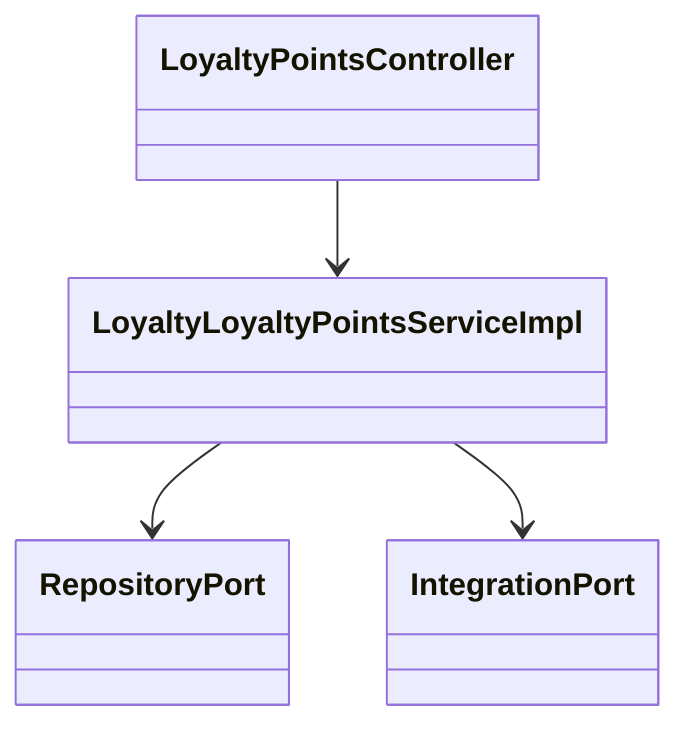
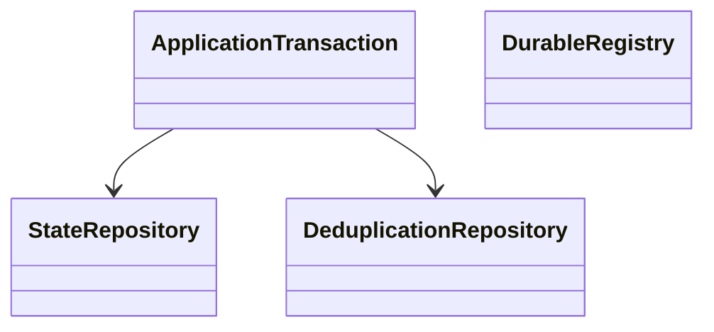
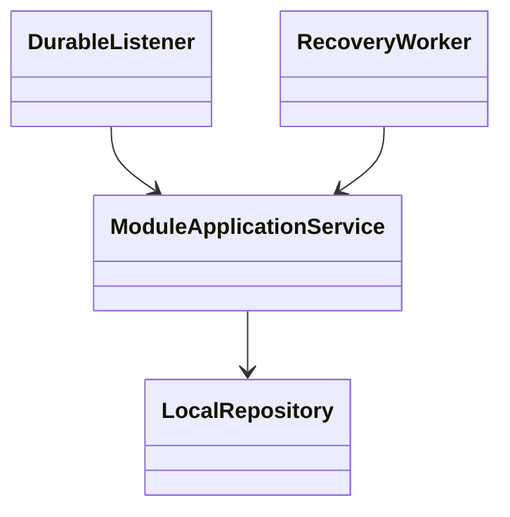
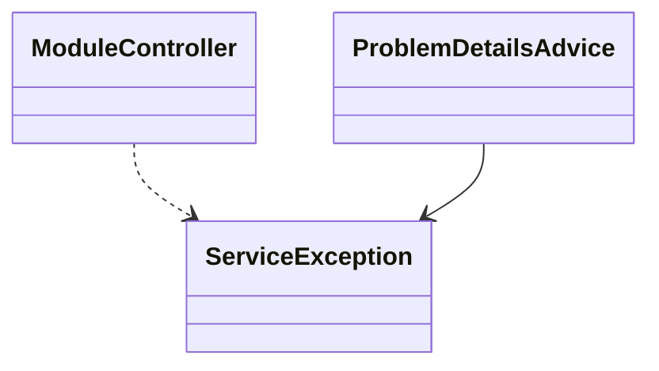
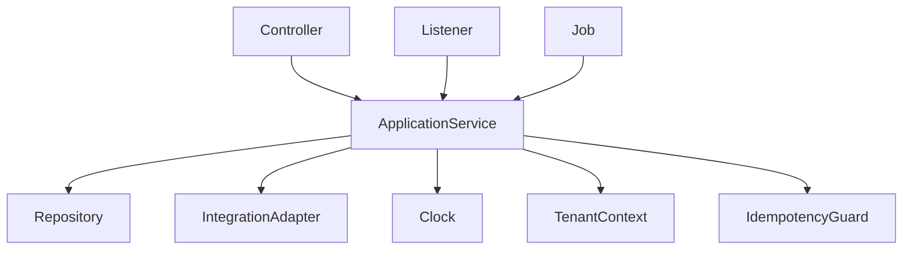
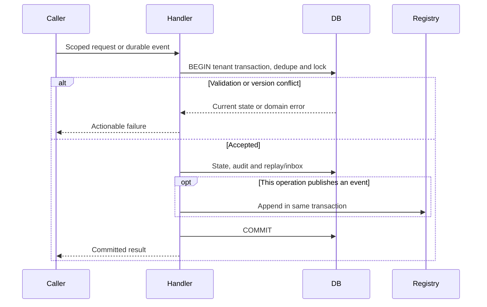

<!--
CHUNK: 04
TITLE: Per-Service Implementation - loyalty-points
PROJECT: Refunds Platform
VERSION: 1.3
PART OF: LLD - Refunds Platform
MODE: from-sdd
-->

# 7. Per-Service Implementation - loyalty-points

> **Bounded context:** [SDD §17 loyalty-points](../../sdd-refunds-platform/13e-service-loyalty-points.md)
>
> **Type:** module, in the single refunds-platform deployable.
>
> **Source code:** Not applicable - Greenfield from-sdd build target.
>
> **Owns use cases (SDD 09):** [LOYALTY/UC-01](../../brd-loyalty-points/06a-use-cases-member.md#uc-01-view-points-balance), [LOYALTY/UC-02](../../brd-loyalty-points/06a-use-cases-member.md#uc-02-view-points-history), [LOYALTY/UC-03](../../brd-loyalty-points/06b-use-cases-loyalty-administrator.md#uc-03-correct-a-members-points)
>
> **Participates in:** See event participation in §7.2.

## 7.1 Responsibility

Maintain membership periods, purchases, paid refunds, immutable points movements, and an atomic current balance. Own corrections, the monthly report, and retention. Contract and scope home: [SDD §17 loyalty-points](../../sdd-refunds-platform/13e-service-loyalty-points.md).

## 7.2 Class & Interface Map

> Confirm: loyalty-points class names and method signatures are proposed; verify during implementation against [SDD §17 loyalty-points](../../sdd-refunds-platform/13e-service-loyalty-points.md).

### Controllers

| Class | Endpoints | Notes |
| --- | --- | --- |
| LoyaltyPointsController | `GET /v1/points-balance` | `@UseCase("LOYALTY/UC-01")` |
| LoyaltyPointsController | `GET /v1/points-movements` | `@UseCase("LOYALTY/UC-02")` |
| LoyaltyPointsController | `GET /v1/points-movements/{movementId}` | None - endpoint not in SDD section 7.3 entry-point register |
| LoyaltyPointsController | `GET /v1/members/{memberNumber}/points` | `@UseCase("LOYALTY/UC-03")` |
| LoyaltyPointsController | `POST /v1/members/{memberNumber}/point-corrections` | `@UseCase("LOYALTY/UC-03")` |
| LoyaltyPointsController | `GET /v1/point-correction-reports/{month}` | None - section-derived endpoint |
| LoyaltyPointsEventListener | `Event: RefundPaid` | `@UseCase("LOYALTY/UC-02")` |
| LoyaltyPointsJob | `Schedule: former-member-retention` | None - system workflow |
| LoyaltyPointsJob | `Schedule: waiting-refund-check` | None - system workflow |
| LoyaltyPointsJob | `Schedule: balance-invariant-check` | None - system workflow |
| LoyaltyFeedAdapter | API-07: TBD - external | None - provider adapter |
| LoyaltyFeedAdapter | API-08: TBD - external | None - provider adapter |
| LoyaltyFeedAdapter | API-09: TBD - external | None - provider adapter |

### Services (interfaces)

| Interface | Purpose | Implementations |
| --- | --- | --- |
| LoyaltyPointsService | Maintain membership periods, purchases, paid refunds, immutable points movements, and an atomic current balance. Own corrections, the monthly report, and retention. | LoyaltyLoyaltyPointsServiceImpl |

### Service Implementations

| Class | Implements | Key methods |
| --- | --- | --- |
| LoyaltyLoyaltyPointsServiceImpl | LoyaltyPointsService | See method-level algorithm below |
| LoyaltyPointsEventListener | Durable listener adapter | RefundPaid |
| LoyaltyPointsJob | Tenant-aware runner | former-member-retention, waiting-refund-check, balance-invariant-check |

### Repositories

| Class | Entity | Notes |
| --- | --- | --- |
| MemberRepository | member | Module-owned schema; tenant filter + RLS; see §8.2 |
| MembershipPeriodRepository | membership_period | Module-owned schema; tenant filter + RLS; see §8.2 |
| MembershipNoticeRepository | membership_notice | Module-owned schema; tenant filter + RLS; see §8.2 |
| PurchaseLockRepository | purchase_lock | Module-owned schema; tenant filter + RLS; see §8.2 |
| PurchaseRepository | purchase | Module-owned schema; tenant filter + RLS; see §8.2 |
| RefundRepository | refund | Module-owned schema; tenant filter + RLS; see §8.2 |
| RefundApplicationRepository | refund_application | Module-owned schema; tenant filter + RLS; see §8.2 |
| PointsMovementRepository | points_movement | Module-owned schema; tenant filter + RLS; see §8.2 |
| PointsBalanceRepository | points_balance | Module-owned schema; tenant filter + RLS; see §8.2 |
| GoLiveImportRepository | go_live_import | Module-owned schema; tenant filter + RLS; see §8.2 |
| RolePermissionRepository | role_permission | Module-owned schema; tenant filter + RLS; see §8.2 |
| InboxEntryRepository | inbox_entry | Module-owned schema; tenant filter + RLS; see §8.2 |
| IdempotencyRecordRepository | idempotency_record | Module-owned schema; tenant filter + RLS; see §8.2 |

### Domain Types (records)

Key signatures above use source DTO names; Subject, TenantContext, PageQuery and verified provider command types are proposed implementation records. Domain records and validations use the exact DTO names in [SDD §17 loyalty-points](../../sdd-refunds-platform/13e-service-loyalty-points.md). Persistence entities map only that module's §8.2 tables. `Money` is EUR decimal(19,4); `Clock`, tenant context and publication identity are injected, not read from static state.

### Method Signatures (key methods only)

```java
public interface LoyaltyPointsService {
  PointsBalanceResponse balance(Subject member, TenantContext tenant);
  PointsMovementPage history(Subject member, PageQuery page, TenantContext tenant);
  PointsMovementDetailResponse movement(UUID movementId, Subject member, TenantContext tenant);
  MemberPointsResponse memberPoints(String memberNumber, Subject staff, PageQuery page, TenantContext tenant);
  PointCorrectionResponse correct(String memberNumber, PointCorrectionRequest command, Subject staff, TenantContext tenant, IdempotencyKey key);
  CorrectionReport report(String month, Subject staff, TenantContext tenant);
  void recordPurchase(VerifiedPurchase command, TenantContext tenant);
  void applyRefund(RefundPaidDto event, PublicationContext publication);
  void notice(VerifiedMembershipNotice command, TenantContext tenant);
  void importOpeningBalance(VerifiedOpeningBalance command, TenantContext tenant);
}
```

### Ports and Adapters (in-process contracts)

Not applicable - no in-process contracts.

Contract home: [SDD §15](../../sdd-refunds-platform/11-api-contracts.md); binding view: [§9.6](../06-api-contracts.md#96-in-process-port-contracts-sdd-15). No HTTP resilience wrapper around a port.

### Authorization

| Entry point | Kind | Permission token (SDD §16, verbatim) | Enforcement point |
| --- | --- | --- | --- |
| `GET /v1/points-balance` | REST | `loyalty-points.balance.read-own` | Method permission plus subject/branch guard; public route rate limit |
| `GET /v1/points-movements` | REST | `loyalty-points.movement.read-own` | Method permission plus subject/branch guard; public route rate limit |
| `GET /v1/points-movements/{movementId}` | REST | `loyalty-points.movement.read-own` | Method permission plus subject/branch guard; public route rate limit |
| `GET /v1/members/{memberNumber}/points` | REST | `loyalty-points.member.read` | Method permission plus subject/branch guard; public route rate limit |
| `POST /v1/members/{memberNumber}/point-corrections` | REST | `loyalty-points.correction.create` | Method permission plus subject/branch guard; public route rate limit |
| `GET /v1/point-correction-reports/{month}` | REST | `loyalty-points.correction-report.read` | Method permission plus subject/branch guard; public route rate limit |
| Event: RefundPaid | Listener | None - system consumer | Trusted durable publication, explicit tenant context |
| Schedule: former-member-retention | Job | None - system job | Job lock and per-tenant transaction |
| Schedule: waiting-refund-check | Job | None - system job | Job lock and per-tenant transaction |
| Schedule: balance-invariant-check | Job | None - system job | Job lock and per-tenant transaction |
| API-07: TBD - external | Provider | None - provider scheme | Credential/signature to tenant before lookup |
| API-08: TBD - external | Provider | None - provider scheme | Credential/signature to tenant before lookup |
| API-09: TBD - external | Provider | None - provider scheme | Credential/signature to tenant before lookup |

## 7.3 Method-Level Pseudocode (non-trivial logic only)

Source: [SDD §17 loyalty-points](../../sdd-refunds-platform/13e-service-loyalty-points.md) Business Logic.

> Confirm: loyalty-points pseudocode combines the stated algorithm with inferred lock/transaction wiring; verify failure and concurrency paths in PostgreSQL integration tests.

### LoyaltyPointsServiceImpl.recordPurchase, applyRefund and correct

```text
Every purchase-related path takes purchase_lock first, with one statement that always ends
  holding the row: INSERT ... ON CONFLICT (tenant_id, purchase_reference) DO UPDATE as a no-op
  (or insert, then SELECT ... FOR UPDATE, repeated until a row returns), so a retention delete
  that commits meanwhile never leaves the path unlocked. Then lock affected members/balances
  in member-id order. All mutations use tenant context.
purchase: dedupe tenant/purchase_reference/member; preserve amount entered by correction.
  If former, keep HELD for late notice reconciliation. Ignore dates before current rejoin
  or go-live for earning; eligible EUR purchase earns floor(amount_paid), no zero movement.
  Insert movement + update points_balance in same transaction; apply waiting refunds.
refund: store once per tenant/refund_reference; only consume RefundPaid, never rejection/cancel.
  For each eligible member purchase, ensure refund_application unique tuple is absent.
  totalRefunded = sum paid amounts up to this refund, capped at that purchase amount.
  desiredTaken = points_earned - floor(max(0, amount_paid - totalRefunded)).
  delta = min(balance, max(0, desiredTaken - points_taken_back)).
  Record application even for delta zero; increment points_taken_back by actual delta only.
  For delta > 0 insert the negative TAKEN_BACK movement (refundDate, purchase_id, refund_id)
    before the application row, whose movement_id names it (FK); delta 0 keeps movement_id NULL.
  Update balance atomically with the movement.
  No matching purchase: keep WAITING; later purchase/correction applies it without early movement.
correct: require active member and LOYALTY_ADMINISTRATOR; validate nonempty reason.
  POINTS: require nonzero; removal <= locked current balance (E3 reports maximum).
  MISSING_PURCHASE: lock purchase first; reject if already shown in ANY member history (E4),
    before current rejoin (E5) or go-live (E6). Persist entered amount as the earning basis.
  Commit movement, balance, staff/time audit and replayable response together.
```

### LoyaltyPointsServiceImpl.notice and retention

```text
Deduplicate notices on tenant/member/type/effective_date; replay effective-date order.
Leave closes current period and makes member FORMER; rejoin opens a fresh zero-balance period.
Same-day leave/rejoin starts the new period the NEXT day; later-day rejoin starts that day.
Commit notice/period reconciliation before reevaluating HELD purchases.
Re-drive each held purchase in a fresh transaction: purchase_lock first, then member/balance;
re-read the current period under that member lock. Never keep a member lock while acquiring
another purchase lock. A crash between phases is recovered by source daily checks/redelivery.
Opening balance imports once per member at go-live, one member per transaction
  (importOpeningBalance); zero creates no movement.
Read views expose only current-period movements, newest first; unavailable -> 503, no partial/zero.
daily retention: iterate ALL tenants, including inactive; tenant RLS is still mandatory.
  former-member-retention, one member per transaction: take the member's periods that ended
  24 months or more ago, oldest first, and delete each one's SDD Retention Policy set in its order
  (no FK has an ON DELETE action); the first period's set also takes the member's purchases
  dated before its starts_on (a member first seen through a rejoin notice):
    1. clear movement_id on each refund_application the deletion keeps (its purchase is dated
       in a later membership) that names one of the period's movements;
    2. delete the refund_application rows of the purchases being deleted;
    3. delete the period's points_movement rows, then those purchases, HELD ones included;
    4. delete each refund whose last application step 2 removed, then the period and its
       notices: the LEAVE dated on its ends_on, and the REJOIN that opened it, dated on its
       starts_on or, for a same-day rejoin, on the day before, which is the previous period's
       ends_on; a REJOIN dated on this period's ends_on opened the next period and stays;
    5. when no membership_period of the member remains: delete every remaining notice of the
       member number, then points_balance and member.
    A purchase_lock row is deleted only while held (the acquisition above), after a recheck
    that no purchase or refund of its reference remains.
  A failure rolls back that member only; the next run retries it.
  waiting-refund-check deletes a refund still WAITING 24 months after its refund date,
  under the purchase lock, and its purchase_lock row by the same rule.
  No business-time override shortens retention for deletion requests; alert overdue at two days.
monthly report: select correction movements in the requested tenant business month,
  preserving each correction row with member, points, staff id/time and reason.
  Use tenant-zone month start inclusive / next month start exclusive in the read snapshot.
  Stream JSON/CSV/XLSX without a reporting store or cross-schema join.
  Never group rows into complaints: complaint identity and upheld dates are owner-held facts.
```

> Confirm: the [SDD Retention Policy](../../sdd-refunds-platform/13e-service-loyalty-points.md#retention-policy) set names no home for a member's purchases dated before a first period that a rejoin notice opened; this LLD deletes them, with their refund applications, in that first period's set, as [LOYALTY 03](../../brd-loyalty-points/03-definitions-and-domain-concepts.md#membership-end-and-data-retention) deletes a former member's history 24 months after they leave. Confirm the set wording through sdd-unifier.

> Confirm: the [SDD Retention Policy](../../sdd-refunds-platform/13e-service-loyalty-points.md#retention-policy) gives no rule for a notice that opened or closed no period (for example a second LEAVE for a member already former); this LLD deletes every remaining notice of the member number with the member's last remaining period. Confirm through sdd-unifier.

> TODO: Best guess: one `go_live_import` run per API-09 call, its counts read by the [SDD §11.3](../../sdd-refunds-platform/07-cross-cutting-concerns.md#113-deployment-default) promotion check and the R-03 totals check; how calls map to runs (SDD 13e Tables Design: one row per run) is not stated now that API-09 arrives by calls - verify at SDD 13e and §11.3 through sdd-unifier before building the import.

An APPLIED refund remains discoverable by purchase reference: a later purchase for another member must still receive its own unique application. The capped take-back example leaves unpaid points eligible for a later refund, rather than counting hypothetical points as already removed.

## 7.4 Design Patterns Applied

### Pattern: Hexagonal composition

**Applied rule:** CLAUDE.md composition over inheritance; SDD §6 requires hexagonal modules and isolated data. **Rationale:** transport/provider adapters cannot reach another module's persistence. **Roles:** LoyaltyLoyaltyPointsServiceImpl is the application context; repositories and provider/module ports are injected adapters.



**Summary:** The application service composes persistence and integration ports through constructor injection. Each concrete adapter stays in its module.

```text
Controller validates transport input -> application port
Application validates domain command -> owned repository / permitted integration port
Adapters translate transport errors; domain raises ServiceException with stable code
```

### Pattern: Idempotent consumer and atomic ledger

**Applied rule:** CLAUDE.md at-least-once consumer idempotency and mandatory outbox for emitted state changes. **Rationale:** one publication cannot subtract points twice; balance and immutable movement must agree. **Roles:** application transaction owns state and inbox; purchase/refund unique keys own business deduplication.



**Summary:** State and deduplication commit together. This module consumes events and needs no outgoing publication for the current ledger changes.

```text
BEGIN tenant transaction
lock business key; reject changed idempotency hash or detect applied event
write aggregate + inbox/replay + any outgoing durable publication
COMMIT; only then call an external provider; persist acknowledged result separately
```

### Pattern: Choreography and local compensation

**Applied rule:** CLAUDE.md event-driven choreography for cross-boundary business transactions, no distributed 2PC. **Rationale:** module commits survive external failure without a transaction crossing providers. **Roles:** the named module application service commits its local step; stable listeners and source workers advance the next step. This module's steps and compensation are: Paid refund consumes one publication, stores waiting fact or applies each member purchase once. Ledger/balance/application rollback locally on failure and redelivery retries; no reversal for rejected/cancelled refunds.



**Summary:** This is source choreography with local commit/retry boundaries, not a new central orchestrator. Compensation is limited to the source actions stated above.

```text
onSourceEvent: begin tenant transaction; dedupe source identity; apply guarded local step
commit local state + inbox + any source-defined outgoing publication
onFailure: rollback local step; retry original source identity through the source schedule
onGiveUp: source terminal failure/park + alert; do not invent a reverse business transition
```

### Pattern: Central RFC 9457 boundary adapter

**Applied rule:** CLAUDE.md global RestControllerAdvice and base ServiceException. **Rationale:** the module controller cannot leak provider/SQL/PII internals while the domain retains stable source errorCode. **Roles:** module controller invokes application service; shared ProblemDetailsAdvice translates ServiceException; §7.7 supplies the module mapping.



**Summary:** Advice is shared deployable infrastructure; the module owns its domain errors and user scope checks.

```text
catch ServiceException at HTTP boundary -> source status/code + sanitized ProblemDetails
catch unexpected exception -> sanitized server failure + traceId; log no PII payload
port/listener errors remain typed and obey their source transaction/retry rules
```

## 7.5 Dependency Injection Graph



**Summary:** Backend wiring uses constructor injection only. Runtime modules share the injected clock and platform transaction/tenant infrastructure, not their repositories.

## 7.6 Transaction Boundaries

| Method | Propagation | Isolation | Rollback rules |
| --- | --- | --- | --- |
| LoyaltyLoyaltyPointsServiceImpl mutation | REQUIRED | READ_COMMITTED + source row locks/version checks | Any failure rolls back state + inbox/replay + publication |
| LoyaltyLoyaltyPointsServiceImpl read | REQUIRED read-only | REPEATABLE_READ for balance/history or multi-query snapshot | No fallback data on failure |
| LoyaltyPointsEventListener | Own REQUIRED after publisher commit | READ_COMMITTED | Retry only after rollback; completion after durable work commit |
| LoyaltyPointsJob | One explicit tenant transaction per unit of work | READ_COMMITTED | Provider calls outside transaction; finally restore context |
| LoyaltyFeedAdapter (API-07, API-08, API-09) | None in the adapter; each record (a purchase, a notice, one member's opening balance) calls its service method in its own REQUIRED transaction | READ_COMMITTED + purchase lock first when the record names a purchase | A failed record rolls back alone; the call is answered with the provider's error form (`TBD - external`) and an alert when any of its records failed, so the sender resends and the business keys skip the records already applied |


> Confirm: transaction propagation and read snapshot isolation are implementation choices; ports use the SDD contract verbatim in §9.6. Fault-test lock order and rollback visibility.

Business errors that must persist counters/outcomes use an outcome record committed before the transport layer raises the error. No REQUIRES_NEW publication insert. No whole-workflow database transaction across external calls.

## 7.7 Error Handling

| Exception | RFC 9457 type | errorCode (SDD §15.1) | HTTP Status | When thrown | Caller action |
| --- | --- | --- | --- | --- | --- |
| NotFoundServiceException | urn:refunds-platform:problem:not-found | NOT_FOUND | 404 | Scoped row absent | Correct reference; do not reveal another tenant |
| ValidationServiceException | urn:refunds-platform:problem:validation | VALIDATION_FAILED | 400 / 422 per source endpoint | Payload/domain rule invalid | Explain fix; no raw code displayed |
| ConflictServiceException | urn:refunds-platform:problem:conflict | CONFLICT | 409 | Changed key/hash, stale version or business-key race | Refetch; retain key for exact retry |
| UnavailableServiceException | urn:refunds-platform:problem:unavailable | UNAVAILABLE | 503 | Dependency/read unavailable | Try later; no invented data |

Domain-specific errors and statuses remain as [SDD §17 loyalty-points](../../sdd-refunds-platform/13e-service-loyalty-points.md) Error Handling and [SDD §15](../../sdd-refunds-platform/11-api-contracts.md) specify. Port errors are raised domain errors, not HTTP statuses. `ServiceException` is translated centrally.

## 7.8 Use-Case Workflows

### LOYALTY/UC-01: View Points Balance

> **Traceability:** BRD [LOYALTY/UC-01](../../brd-loyalty-points/06a-use-cases-member.md#uc-01-view-points-balance) · SDD [§7.3](../../sdd-refunds-platform/03-users-and-use-cases.md#73-use-case-traceability-brd--sdd) · Owner: loyalty-points · Entry points: `GET /v1/points-balance` · UAT/BAT: [LOYALTY/TC-ACC-01](../../brd-loyalty-points/16-uat-bat-test-cases.md#1-access-and-sign-in-uc-01-uc-02-uc-03-mk-01-mk-02-mk-03-mk-04-nfr-07), [LOYALTY/TC-BAL-01](../../brd-loyalty-points/16-uat-bat-test-cases.md#2-points-balance-uc-01-mk-01--lp-01-nfr-03), [LOYALTY/TC-BAL-02](../../brd-loyalty-points/16-uat-bat-test-cases.md#2-points-balance-uc-01-mk-01--lp-01-nfr-03), [LOYALTY/TC-BAL-03](../../brd-loyalty-points/16-uat-bat-test-cases.md#2-points-balance-uc-01-mk-01--lp-01-nfr-03), [LOYALTY/TC-BAL-04](../../brd-loyalty-points/16-uat-bat-test-cases.md#2-points-balance-uc-01-mk-01--lp-01-nfr-03), [LOYALTY/TC-BAL-05](../../brd-loyalty-points/16-uat-bat-test-cases.md#2-points-balance-uc-01-mk-01--lp-01-nfr-03), [LOYALTY/TC-BAL-06](../../brd-loyalty-points/16-uat-bat-test-cases.md#2-points-balance-uc-01-mk-01--lp-01-nfr-03), [LOYALTY/TC-BAL-07](../../brd-loyalty-points/16-uat-bat-test-cases.md#2-points-balance-uc-01-mk-01--lp-01-nfr-03), [LOYALTY/TC-BAL-08](../../brd-loyalty-points/16-uat-bat-test-cases.md#2-points-balance-uc-01-mk-01--lp-01-nfr-03), [LOYALTY/TC-BAL-09](../../brd-loyalty-points/16-uat-bat-test-cases.md#2-points-balance-uc-01-mk-01--lp-01-nfr-03), [LOYALTY/TC-BAL-10](../../brd-loyalty-points/16-uat-bat-test-cases.md#2-points-balance-uc-01-mk-01--lp-01-nfr-03), [LOYALTY/TC-UIX-01](../../brd-loyalty-points/16-uat-bat-test-cases.md#6-cross-cutting-uiux-standards-chunk-11) · Screens: [LOYALTY/MK-01](../../brd-loyalty-points/14-todo.md#mockup-coverage) via `/loyalty/balance`

**Trigger:** `GET /v1/points-balance`; handlers carry `@UseCase("LOYALTY/UC-01")`.

**Pre-conditions:** Brokered member identity contains tenant and member number.

**Post-conditions:** Current-period balance/newest movement date or an explicit no-account/unavailable outcome.

**Control flow:**

1. Read current membership and balance consistently.
2. A1 zero explains earning; E1 cannot show returns no figure, never stale/zero fallback; E2 former/nonmember sees no account.
3. Tell member points arrive by end of purchase day.
4. Details and exception mapping: §7.3 above and [LOYALTY/UC-01](../../brd-loyalty-points/06a-use-cases-member.md#uc-01-view-points-balance).


**Idempotency points:** Reads are repeatable; every write requires tenant/key plus request hash and first outcome; listeners use stable publication identity.

**Outbox emission points:** None - read only.

**Retry / timeout policy:** Database only; no synchronous provider dependency.

**Error handling:** §7.7 plus the E/A paths above; all expected results stay in the linked BRD tests.

### LOYALTY/UC-02: View Points History

> **Traceability:** BRD [LOYALTY/UC-02](../../brd-loyalty-points/06a-use-cases-member.md#uc-02-view-points-history) · SDD [§7.3](../../sdd-refunds-platform/03-users-and-use-cases.md#73-use-case-traceability-brd--sdd) · Owner: loyalty-points · Entry points: `GET /v1/points-movements`, `Event: RefundPaid` · UAT/BAT: [LOYALTY/TC-ACC-02](../../brd-loyalty-points/16-uat-bat-test-cases.md#1-access-and-sign-in-uc-01-uc-02-uc-03-mk-01-mk-02-mk-03-mk-04-nfr-07), [LOYALTY/TC-HIS-01](../../brd-loyalty-points/16-uat-bat-test-cases.md#3-points-history-uc-02-mk-02--lp-02-nfr-02), [LOYALTY/TC-HIS-02](../../brd-loyalty-points/16-uat-bat-test-cases.md#3-points-history-uc-02-mk-02--lp-02-nfr-02), [LOYALTY/TC-HIS-03](../../brd-loyalty-points/16-uat-bat-test-cases.md#3-points-history-uc-02-mk-02--lp-02-nfr-02), [LOYALTY/TC-HIS-04](../../brd-loyalty-points/16-uat-bat-test-cases.md#3-points-history-uc-02-mk-02--lp-02-nfr-02), [LOYALTY/TC-HIS-05](../../brd-loyalty-points/16-uat-bat-test-cases.md#3-points-history-uc-02-mk-02--lp-02-nfr-02), [LOYALTY/TC-HIS-06](../../brd-loyalty-points/16-uat-bat-test-cases.md#3-points-history-uc-02-mk-02--lp-02-nfr-02), [LOYALTY/TC-HIS-07](../../brd-loyalty-points/16-uat-bat-test-cases.md#3-points-history-uc-02-mk-02--lp-02-nfr-02), [LOYALTY/TC-HIS-08](../../brd-loyalty-points/16-uat-bat-test-cases.md#3-points-history-uc-02-mk-02--lp-02-nfr-02), [LOYALTY/TC-HIS-09](../../brd-loyalty-points/16-uat-bat-test-cases.md#3-points-history-uc-02-mk-02--lp-02-nfr-02), [LOYALTY/TC-HIS-10](../../brd-loyalty-points/16-uat-bat-test-cases.md#3-points-history-uc-02-mk-02--lp-02-nfr-02), [LOYALTY/TC-HIS-11](../../brd-loyalty-points/16-uat-bat-test-cases.md#3-points-history-uc-02-mk-02--lp-02-nfr-02), [LOYALTY/TC-HIS-12](../../brd-loyalty-points/16-uat-bat-test-cases.md#3-points-history-uc-02-mk-02--lp-02-nfr-02), [LOYALTY/TC-HIS-13](../../brd-loyalty-points/16-uat-bat-test-cases.md#3-points-history-uc-02-mk-02--lp-02-nfr-02), [LOYALTY/TC-HIS-14](../../brd-loyalty-points/16-uat-bat-test-cases.md#3-points-history-uc-02-mk-02--lp-02-nfr-02), [LOYALTY/TC-HIS-15](../../brd-loyalty-points/16-uat-bat-test-cases.md#3-points-history-uc-02-mk-02--lp-02-nfr-02), [LOYALTY/TC-HIS-16](../../brd-loyalty-points/16-uat-bat-test-cases.md#3-points-history-uc-02-mk-02--lp-02-nfr-02), [LOYALTY/TC-HIS-17](../../brd-loyalty-points/16-uat-bat-test-cases.md#3-points-history-uc-02-mk-02--lp-02-nfr-02), [LOYALTY/TC-HIS-18](../../brd-loyalty-points/16-uat-bat-test-cases.md#3-points-history-uc-02-mk-02--lp-02-nfr-02), [LOYALTY/TC-HIS-19](../../brd-loyalty-points/16-uat-bat-test-cases.md#3-points-history-uc-02-mk-02--lp-02-nfr-02), [LOYALTY/TC-HIS-20](../../brd-loyalty-points/16-uat-bat-test-cases.md#3-points-history-uc-02-mk-02--lp-02-nfr-02), [LOYALTY/TC-HIS-21](../../brd-loyalty-points/16-uat-bat-test-cases.md#3-points-history-uc-02-mk-02--lp-02-nfr-02), [LOYALTY/TC-HIS-22](../../brd-loyalty-points/16-uat-bat-test-cases.md#3-points-history-uc-02-mk-02--lp-02-nfr-02), [LOYALTY/TC-HIS-23](../../brd-loyalty-points/16-uat-bat-test-cases.md#3-points-history-uc-02-mk-02--lp-02-nfr-02), [LOYALTY/TC-HIS-24](../../brd-loyalty-points/16-uat-bat-test-cases.md#3-points-history-uc-02-mk-02--lp-02-nfr-02), [LOYALTY/TC-HIS-25](../../brd-loyalty-points/16-uat-bat-test-cases.md#3-points-history-uc-02-mk-02--lp-02-nfr-02), [LOYALTY/TC-HIS-26](../../brd-loyalty-points/16-uat-bat-test-cases.md#3-points-history-uc-02-mk-02--lp-02-nfr-02), [LOYALTY/TC-HIS-27](../../brd-loyalty-points/16-uat-bat-test-cases.md#3-points-history-uc-02-mk-02--lp-02-nfr-02), [LOYALTY/TC-HIS-28](../../brd-loyalty-points/16-uat-bat-test-cases.md#3-points-history-uc-02-mk-02--lp-02-nfr-02), [LOYALTY/TC-HIS-29](../../brd-loyalty-points/16-uat-bat-test-cases.md#3-points-history-uc-02-mk-02--lp-02-nfr-02), [LOYALTY/TC-UIX-02](../../brd-loyalty-points/16-uat-bat-test-cases.md#6-cross-cutting-uiux-standards-chunk-11) · Screens: [LOYALTY/MK-02](../../brd-loyalty-points/14-todo.md#mockup-coverage) via `/loyalty/history`, `/loyalty/history/:movementId`

**Trigger:** `GET /v1/points-movements`, `Event: RefundPaid`; handlers carry `@UseCase("LOYALTY/UC-02")`.

**Pre-conditions:** Member signed in; RefundPaid listener has authenticated publication tenant.

**Post-conditions:** Complete current-period history and once-only take-back applications.

**Control flow:**

1. Read 20 movements newest first and owned detail.
2. Render A1 refund, A2 empty, A3 correction, A4 branch complaint guidance and A5 opening balance; E1 never partial, E2 no account.
3. RefundPaid is the separate event entry point: serialize purchase then members; apply paid amounts once, including waiting purchases, cents, capped balance and subsequent refunds.
4. Details and exception mapping: §7.3 above and [LOYALTY/UC-02](../../brd-loyalty-points/06a-use-cases-member.md#uc-02-view-points-history).



**Summary:** The flow checks tenant and concurrency guards before committing state, deduplication, and any publication atomically. Provider work starts after commit.

**Idempotency points:** GET reads current scoped data; RefundPaid uses inbox and refund application keys.

**Outbox emission points:** None - consumes RefundPaid; movements and balance commit with inbox.

**Retry / timeout policy:** Listener redelivery follows publication resubmit; no broker or outbound provider call.

**Error handling:** §7.7 plus the E/A paths above; all expected results stay in the linked BRD tests.

### LOYALTY/UC-03: Correct a Member's Points

> **Traceability:** BRD [LOYALTY/UC-03](../../brd-loyalty-points/06b-use-cases-loyalty-administrator.md#uc-03-correct-a-members-points) · SDD [§7.3](../../sdd-refunds-platform/03-users-and-use-cases.md#73-use-case-traceability-brd--sdd) · Owner: loyalty-points · Entry points: `GET /v1/members/{memberNumber}/points`, `POST /v1/members/{memberNumber}/point-corrections` · UAT/BAT: [LOYALTY/TC-ACC-03](../../brd-loyalty-points/16-uat-bat-test-cases.md#1-access-and-sign-in-uc-01-uc-02-uc-03-mk-01-mk-02-mk-03-mk-04-nfr-07), [LOYALTY/TC-ACC-04](../../brd-loyalty-points/16-uat-bat-test-cases.md#1-access-and-sign-in-uc-01-uc-02-uc-03-mk-01-mk-02-mk-03-mk-04-nfr-07), [LOYALTY/TC-COR-01](../../brd-loyalty-points/16-uat-bat-test-cases.md#4-correct-a-members-points-uc-03-mk-03), [LOYALTY/TC-COR-02](../../brd-loyalty-points/16-uat-bat-test-cases.md#4-correct-a-members-points-uc-03-mk-03), [LOYALTY/TC-COR-03](../../brd-loyalty-points/16-uat-bat-test-cases.md#4-correct-a-members-points-uc-03-mk-03), [LOYALTY/TC-COR-04](../../brd-loyalty-points/16-uat-bat-test-cases.md#4-correct-a-members-points-uc-03-mk-03), [LOYALTY/TC-COR-05](../../brd-loyalty-points/16-uat-bat-test-cases.md#4-correct-a-members-points-uc-03-mk-03), [LOYALTY/TC-COR-06](../../brd-loyalty-points/16-uat-bat-test-cases.md#4-correct-a-members-points-uc-03-mk-03), [LOYALTY/TC-COR-07](../../brd-loyalty-points/16-uat-bat-test-cases.md#4-correct-a-members-points-uc-03-mk-03), [LOYALTY/TC-COR-08](../../brd-loyalty-points/16-uat-bat-test-cases.md#4-correct-a-members-points-uc-03-mk-03), [LOYALTY/TC-COR-09](../../brd-loyalty-points/16-uat-bat-test-cases.md#4-correct-a-members-points-uc-03-mk-03), [LOYALTY/TC-COR-10](../../brd-loyalty-points/16-uat-bat-test-cases.md#4-correct-a-members-points-uc-03-mk-03), [LOYALTY/TC-COR-11](../../brd-loyalty-points/16-uat-bat-test-cases.md#4-correct-a-members-points-uc-03-mk-03), [LOYALTY/TC-COR-12](../../brd-loyalty-points/16-uat-bat-test-cases.md#4-correct-a-members-points-uc-03-mk-03), [LOYALTY/TC-COR-13](../../brd-loyalty-points/16-uat-bat-test-cases.md#4-correct-a-members-points-uc-03-mk-03), [LOYALTY/TC-COR-14](../../brd-loyalty-points/16-uat-bat-test-cases.md#4-correct-a-members-points-uc-03-mk-03), [LOYALTY/TC-COR-15](../../brd-loyalty-points/16-uat-bat-test-cases.md#4-correct-a-members-points-uc-03-mk-03), [LOYALTY/TC-COR-16](../../brd-loyalty-points/16-uat-bat-test-cases.md#4-correct-a-members-points-uc-03-mk-03), [LOYALTY/TC-COR-17](../../brd-loyalty-points/16-uat-bat-test-cases.md#4-correct-a-members-points-uc-03-mk-03), [LOYALTY/TC-COR-18](../../brd-loyalty-points/16-uat-bat-test-cases.md#4-correct-a-members-points-uc-03-mk-03), [LOYALTY/TC-REP-01](../../brd-loyalty-points/16-uat-bat-test-cases.md#5-monthly-corrections-report-mk-04-nfr-01), [LOYALTY/TC-REP-04](../../brd-loyalty-points/16-uat-bat-test-cases.md#5-monthly-corrections-report-mk-04-nfr-01), [LOYALTY/TC-UIX-03](../../brd-loyalty-points/16-uat-bat-test-cases.md#6-cross-cutting-uiux-standards-chunk-11) · Screens: [LOYALTY/MK-03](../../brd-loyalty-points/14-todo.md#mockup-coverage) via `/loyalty/corrections`, `/loyalty/corrections/:memberNumber`

**Trigger:** `GET /v1/members/{memberNumber}/points`, `POST /v1/members/{memberNumber}/point-corrections`; handlers carry `@UseCase("LOYALTY/UC-03")`.

**Pre-conditions:** Loyalty Administrator role in current tenant.

**Post-conditions:** Reasoned correction and new balance committed with staff/time audit.

**Control flow:**

1. Find active member/current history.
2. POINTS validates nonzero and maximum removal; MISSING_PURCHASE calculates floor(EUR).
3. Serialize purchase/member, reject E1-E6, including any-member already-shown purchase.
4. Preserve entered amount on later same-member POS report; other member earns/applies refunds independently.
5. Details and exception mapping: §7.3 above and [LOYALTY/UC-03](../../brd-loyalty-points/06b-use-cases-loyalty-administrator.md#uc-03-correct-a-members-points).


**Summary:** The flow checks tenant and concurrency guards before committing state, deduplication, and any publication atomically. Provider work starts after commit.

**Idempotency points:** Reads are repeatable; every write requires tenant/key plus request hash and first outcome; listeners use stable publication identity.

**Outbox emission points:** None - local ledger mutation.

**Retry / timeout policy:** No provider call; conflicting key/body or concurrent correction returns a refetchable conflict.

**Error handling:** §7.7 plus the E/A paths above; all expected results stay in the linked BRD tests.

### Workflow: former-member-retention

> **Traceability:** No BRD use case - realises [SDD §17 loyalty-points](../../sdd-refunds-platform/13e-service-loyalty-points.md) Input / Business Logic · Entry points: Schedule: former-member-retention

Acquire database job lock, enumerate the source-defined tenants, set tenant context and process due work through §7.3. Commit each bounded unit; clear context in finally. Provider failure preserves due work and schedules the source backoff. Retention uses source dates and never invents an archive.

### Workflow: waiting-refund-check

> **Traceability:** No BRD use case - realises [SDD §17 loyalty-points](../../sdd-refunds-platform/13e-service-loyalty-points.md) Input / Business Logic · Entry points: Schedule: waiting-refund-check

Acquire database job lock, enumerate the source-defined tenants, set tenant context and process due work through §7.3. Commit each bounded unit; clear context in finally. Provider failure preserves due work and schedules the source backoff. Retention uses source dates and never invents an archive.

### Workflow: balance-invariant-check

> **Traceability:** No BRD use case - realises [SDD §17 loyalty-points](../../sdd-refunds-platform/13e-service-loyalty-points.md) Input / Business Logic · Entry points: Schedule: balance-invariant-check

Acquire database job lock, enumerate the source-defined tenants, set tenant context and process due work through §7.3. Commit each bounded unit; clear context in finally. Provider failure preserves due work and schedules the source backoff. Retention uses source dates and never invents an archive.

### Workflow: Supporting platform work

> **Traceability:** No BRD use case - realises [SDD §17 loyalty-points](../../sdd-refunds-platform/13e-service-loyalty-points.md) Business Logic / Retention Policy · Entry points: Source-defined adapters in §7.2

Use the event-specific §7.3 handler, persistent business keys and publication inbox. No new use case is created for reconciliation, provider feeds, internal closure or retention. Each listener installs the publisher tenant and correlation context before any repository call.

### Workflow: Monthly corrections report

> **Traceability:** No BRD use case - realises [LOYALTY report](../../brd-loyalty-points/09-reporting-and-analytics.md#reporting--analytics) · Entry points: `GET /v1/point-correction-reports/{month}`

Authorize the Loyalty Administrator in the current tenant, then use the requested month and tenant-zone bounds in §7.3. Preserve correction rows rather than distinct complaint counts. The LOYALTY owner keeps the independent upheld-complaint tally outside this product ([LOYALTY report](../../brd-loyalty-points/09-reporting-and-analytics.md#reporting--analytics)); no complaint fields or joins are added. The report route keeps its MK screen only, with no use-case annotation. §16.8 separates product-row assertions from owner BAT evidence.


<!-- MASTER: ../refunds-platform-lld-master.md | PREV: ../03-architecture.md | NEXT: ../05-data-model.md -->
