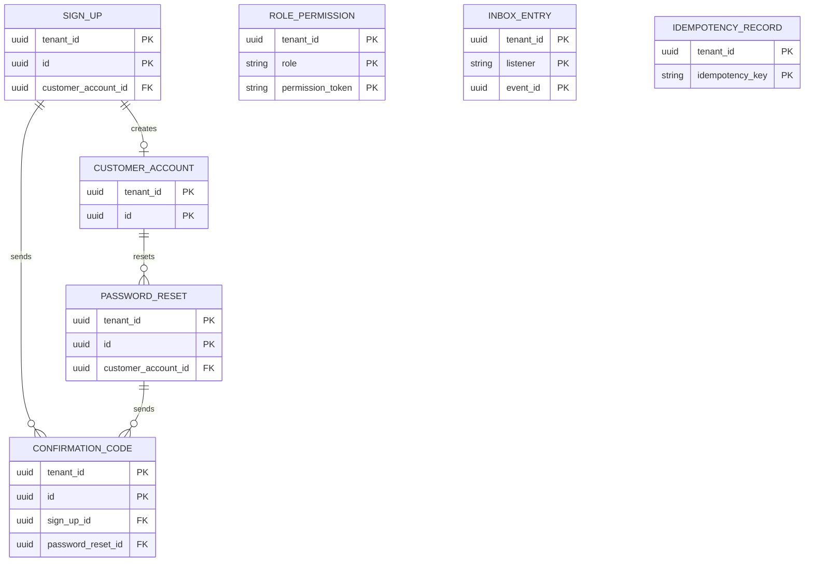
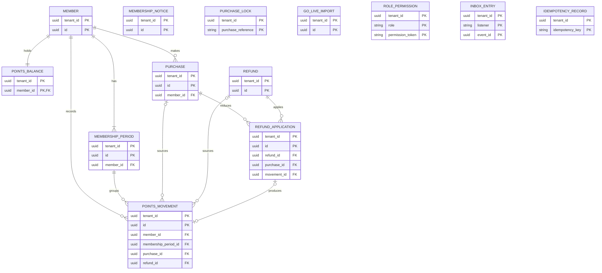
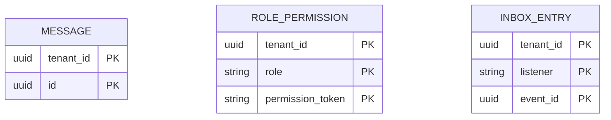
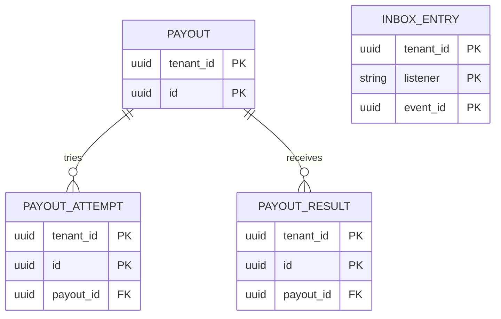

<!--
CHUNK: 05
TITLE: Data Model
PROJECT: Refunds Platform
VERSION: 1.3
PART OF: LLD - Refunds Platform
MODE: from-sdd
-->

# 8. Data Model

## 8.1 Entity Relationship (system-wide)

Only keys and relationships are reproduced. Source per module: its SDD DB Modeling / Entity Relationship. No cross-schema foreign keys.

### customer-accounts

[SDD ERD](../sdd-refunds-platform/13a-service-customer-accounts.md#entity-relationship)

**Summary:** customer-accounts owns these relationships and tenant-aware keys inside its private schema. Full columns follow in §8.2.

### loyalty-points

[SDD ERD](../sdd-refunds-platform/13e-service-loyalty-points.md#entity-relationship)

**Summary:** loyalty-points owns these relationships and tenant-aware keys inside its private schema; a Taken back movement keys both its purchase and its refund, and a refund application keys the movement it produced. Full columns follow in §8.2.

### notifications

[SDD ERD](../sdd-refunds-platform/13d-service-notifications.md#entity-relationship)

**Summary:** notifications owns these relationships and tenant-aware keys inside its private schema. Full columns follow in §8.2.

### payouts

[SDD ERD](../sdd-refunds-platform/13c-service-payouts.md#entity-relationship)

**Summary:** payouts owns these relationships and tenant-aware keys inside its private schema. Full columns follow in §8.2.

### refund-requests

[SDD ERD](../sdd-refunds-platform/13b-service-refund-requests.md#entity-relationship)

```mermaid
erDiagram
  REFUND_REQUEST ||--|{ REFUND_REQUEST_ITEM : holds
  REFUND_REQUEST ||--|{ REFUND_STATUS_HISTORY : records
  REFUND_REQUEST ||--o| ITEMS_NOTICE : tracks
  RECEIPT_LOOKUP ||--|{ RECEIPT_LOOKUP_ITEM : lists
  BRANCH ||--o{ BRANCH_ASSIGNMENT : staffs
  REFUND_REQUEST {
    uuid tenant_id PK
    uuid id PK
  }
  REFUND_REQUEST_ITEM {
    uuid tenant_id PK
    uuid id PK
    uuid refund_request_id FK
  }
  REFUND_STATUS_HISTORY {
    uuid tenant_id PK
    uuid id PK
    uuid refund_request_id FK
  }
  ITEMS_NOTICE {
    uuid tenant_id PK
    uuid refund_request_id PK, FK
  }
  PURCHASE_LOCK {
    uuid tenant_id PK
    string purchase_reference PK
  }
  RECEIPT_LOOKUP {
    uuid tenant_id PK
    uuid id PK
  }
  RECEIPT_LOOKUP_ITEM {
    uuid tenant_id PK
    uuid id PK
    uuid receipt_lookup_id FK
  }
  BRANCH {
    uuid tenant_id PK
    string branch_id PK
  }
  BRANCH_ASSIGNMENT {
    uuid tenant_id PK
    uuid id PK
    string branch_id FK
  }
  STAFF_SESSION {
    uuid tenant_id PK
    string session_id PK
  }
  ROLE_PERMISSION {
    uuid tenant_id PK
    string role PK
    string permission_token PK
  }
  INBOX_ENTRY {
    uuid tenant_id PK
    string listener PK
    uuid event_id PK
  }
  IDEMPOTENCY_RECORD {
    uuid tenant_id PK
    string idempotency_key PK
  }
```

**Summary:** refund-requests owns these relationships and tenant-aware keys inside its private schema. Full columns follow in §8.2.

## 8.2 Tables (per service)

### Service: `customer-accounts` - schema `customer_accounts`

| Table | Column | Type | Constraints | Notes | Source |
| --- | --- | --- | --- | --- | --- |
| `customer_account` | `tenant_id`, `id` | uuid, uuid | PK (`tenant_id`, `id`), NOT NULL | `id` is UUIDv7 | [SDD Tables Design](../sdd-refunds-platform/13a-service-customer-accounts.md#tables-design) |
| `customer_account` | `keycloak_user_id` | varchar(64) | NULL only when `status` is CLOSED; unique (`tenant_id`, `keycloak_user_id`) when set | The Keycloak user | [SDD Tables Design](../sdd-refunds-platform/13a-service-customer-accounts.md#tables-design) |
| `customer_account` | `email` | varchar(254) | NULL only when `status` is CLOSED; unique (`tenant_id`, lower(`email`)) when set | PII; one account per email address (BR-2) | [SDD Tables Design](../sdd-refunds-platform/13a-service-customer-accounts.md#tables-design) |
| `customer_account` | `mobile_number` | varchar(20) | NULL only when `status` is CLOSED | PII, E.164 | [SDD Tables Design](../sdd-refunds-platform/13a-service-customer-accounts.md#tables-design) |
| `customer_account` | `status` | varchar(8) | NOT NULL; ACTIVE or CLOSED |  | [SDD Tables Design](../sdd-refunds-platform/13a-service-customer-accounts.md#tables-design) |
| `customer_account` | `privacy_notice_version` | varchar(20) | NOT NULL | The notice shown at sign-up | [SDD Tables Design](../sdd-refunds-platform/13a-service-customer-accounts.md#tables-design) |
| `customer_account` | `last_sign_in_at` | timestamptz | NOT NULL | Set at creation; updated from the Keycloak sign-in events; index (`tenant_id`, `status`, `last_sign_in_at`) | [SDD Tables Design](../sdd-refunds-platform/13a-service-customer-accounts.md#tables-design) |
| `customer_account` | `linked_request_count` | integer | NOT NULL; 0 or more |  | [SDD Tables Design](../sdd-refunds-platform/13a-service-customer-accounts.md#tables-design) |
| `customer_account` | `closed_at` | timestamptz | NULL until CLOSED |  | [SDD Tables Design](../sdd-refunds-platform/13a-service-customer-accounts.md#tables-design) |
| `customer_account` | `created_at`, `created_by`, `updated_at`, `updated_by`, `version` | per §11.1 | NOT NULL | Audit and optimistic lock | [SDD Tables Design](../sdd-refunds-platform/13a-service-customer-accounts.md#tables-design) |
| `sign_up` | `tenant_id`, `id` | uuid, uuid | PK (`tenant_id`, `id`), NOT NULL |  | [SDD Tables Design](../sdd-refunds-platform/13a-service-customer-accounts.md#tables-design) |
| `sign_up` | `email` | varchar(254) | NOT NULL; index (`tenant_id`, lower(`email`), `status`) | PII | [SDD Tables Design](../sdd-refunds-platform/13a-service-customer-accounts.md#tables-design) |
| `sign_up` | `mobile_number` | varchar(20) | NOT NULL | PII | [SDD Tables Design](../sdd-refunds-platform/13a-service-customer-accounts.md#tables-design) |
| `sign_up` | `keycloak_user_id` | varchar(64) | NOT NULL | The disabled user | [SDD Tables Design](../sdd-refunds-platform/13a-service-customer-accounts.md#tables-design) |
| `sign_up` | `privacy_notice_version` | varchar(20) | NOT NULL |  | [SDD Tables Design](../sdd-refunds-platform/13a-service-customer-accounts.md#tables-design) |
| `sign_up` | `status` | varchar(10) | NOT NULL; PENDING, COMPLETED, EXPIRED, or CLOSED |  | [SDD Tables Design](../sdd-refunds-platform/13a-service-customer-accounts.md#tables-design) |
| `sign_up` | `expires_at` | timestamptz | NOT NULL; index (`tenant_id`, `status`, `expires_at`) | 24 hours after the latest code | [SDD Tables Design](../sdd-refunds-platform/13a-service-customer-accounts.md#tables-design) |
| `sign_up` | `customer_account_id` | uuid | FK (`tenant_id`, `customer_account_id`) to `customer_account`; NULL until COMPLETED |  | [SDD Tables Design](../sdd-refunds-platform/13a-service-customer-accounts.md#tables-design) |
| `sign_up` | `created_at`, `created_by`, `updated_at`, `updated_by`, `version` | per §11.1 | NOT NULL |  | [SDD Tables Design](../sdd-refunds-platform/13a-service-customer-accounts.md#tables-design) |
| `password_reset` | `tenant_id`, `id` | uuid, uuid | PK (`tenant_id`, `id`), NOT NULL |  | [SDD Tables Design](../sdd-refunds-platform/13a-service-customer-accounts.md#tables-design) |
| `password_reset` | `customer_account_id` | uuid | FK (`tenant_id`, `customer_account_id`) to `customer_account`; NULL when no account had the address; index (`tenant_id`, `customer_account_id`, `created_at`) |  | [SDD Tables Design](../sdd-refunds-platform/13a-service-customer-accounts.md#tables-design) |
| `password_reset` | `status` | varchar(10) | NOT NULL; PENDING, COMPLETED, or EXPIRED |  | [SDD Tables Design](../sdd-refunds-platform/13a-service-customer-accounts.md#tables-design) |
| `password_reset` | `expires_at` | timestamptz | NOT NULL | 24 hours after the latest code | [SDD Tables Design](../sdd-refunds-platform/13a-service-customer-accounts.md#tables-design) |
| `password_reset` | `created_at`, `created_by`, `updated_at`, `updated_by`, `version` | per §11.1 | NOT NULL |  | [SDD Tables Design](../sdd-refunds-platform/13a-service-customer-accounts.md#tables-design) |
| `confirmation_code` | `tenant_id`, `id` | uuid, uuid | PK (`tenant_id`, `id`), NOT NULL |  | [SDD Tables Design](../sdd-refunds-platform/13a-service-customer-accounts.md#tables-design) |
| `confirmation_code` | `sign_up_id` | uuid | FK (`tenant_id`, `sign_up_id`) to `sign_up`; exactly one of `sign_up_id` and `password_reset_id` is set |  | [SDD Tables Design](../sdd-refunds-platform/13a-service-customer-accounts.md#tables-design) |
| `confirmation_code` | `password_reset_id` | uuid | FK (`tenant_id`, `password_reset_id`) to `password_reset`; see `sign_up_id` |  | [SDD Tables Design](../sdd-refunds-platform/13a-service-customer-accounts.md#tables-design) |
| `confirmation_code` | `channel` | varchar(5) | NOT NULL; EMAIL or SMS |  | [SDD Tables Design](../sdd-refunds-platform/13a-service-customer-accounts.md#tables-design) |
| `confirmation_code` | `destination_hash` | varchar(64) | NOT NULL; index (`tenant_id`, `destination_hash`, `sent_at`) | Hash of the address, for the per-address limit | [SDD Tables Design](../sdd-refunds-platform/13a-service-customer-accounts.md#tables-design) |
| `confirmation_code` | `code_hash` | varchar(100) | NOT NULL | Never the code itself | [SDD Tables Design](../sdd-refunds-platform/13a-service-customer-accounts.md#tables-design) |
| `confirmation_code` | `sent_at` | timestamptz | NOT NULL |  | [SDD Tables Design](../sdd-refunds-platform/13a-service-customer-accounts.md#tables-design) |
| `confirmation_code` | `expires_at` | timestamptz | NOT NULL | 15 minutes after `sent_at` (BR-3) | [SDD Tables Design](../sdd-refunds-platform/13a-service-customer-accounts.md#tables-design) |
| `confirmation_code` | `superseded_at` | timestamptz | NULL while it is the latest code for its address | BR-4 | [SDD Tables Design](../sdd-refunds-platform/13a-service-customer-accounts.md#tables-design) |
| `confirmation_code` | `wrong_entries` | integer | NOT NULL; 0 to 5 | The 5th wrong entry ends the code | [SDD Tables Design](../sdd-refunds-platform/13a-service-customer-accounts.md#tables-design) |
| `confirmation_code` | `used_at` | timestamptz | NULL until used |  | [SDD Tables Design](../sdd-refunds-platform/13a-service-customer-accounts.md#tables-design) |
| `role_permission` | `tenant_id`, `role`, `permission_token` | uuid, varchar(40), varchar(80) | PK (`tenant_id`, `role`, `permission_token`), NOT NULL | Seed of §16.12.1 | [SDD Tables Design](../sdd-refunds-platform/13a-service-customer-accounts.md#tables-design) |
| `inbox_entry` | `tenant_id`, `listener`, `event_id` | uuid, varchar(80), uuid | PK (`tenant_id`, `listener`, `event_id`), NOT NULL | One row per event a listener handled | [SDD Tables Design](../sdd-refunds-platform/13a-service-customer-accounts.md#tables-design) |
| `inbox_entry` | `status` | varchar(8) | NOT NULL; DONE or PARKED |  | [SDD Tables Design](../sdd-refunds-platform/13a-service-customer-accounts.md#tables-design) |
| `inbox_entry` | `attempts` | integer | NOT NULL |  | [SDD Tables Design](../sdd-refunds-platform/13a-service-customer-accounts.md#tables-design) |
| `inbox_entry` | `last_error_code` | varchar(64) | NULL unless a run failed |  | [SDD Tables Design](../sdd-refunds-platform/13a-service-customer-accounts.md#tables-design) |
| `inbox_entry` | `updated_at` | timestamptz | NOT NULL |  | [SDD Tables Design](../sdd-refunds-platform/13a-service-customer-accounts.md#tables-design) |
| `idempotency_record` | `tenant_id`, `idempotency_key` | uuid, varchar(64) | PK (`tenant_id`, `idempotency_key`), NOT NULL |  | [SDD Tables Design](../sdd-refunds-platform/13a-service-customer-accounts.md#tables-design) |
| `idempotency_record` | `request_hash` | varchar(64) | NOT NULL | A reused key with another body answers 409 `CONFLICT` | [SDD Tables Design](../sdd-refunds-platform/13a-service-customer-accounts.md#tables-design) |
| `idempotency_record` | `response_status`, `response_body` | integer, jsonb | NOT NULL | The first response, replayed (§11.1) | [SDD Tables Design](../sdd-refunds-platform/13a-service-customer-accounts.md#tables-design) |
| `idempotency_record` | `created_at` | timestamptz | NOT NULL |  | [SDD Tables Design](../sdd-refunds-platform/13a-service-customer-accounts.md#tables-design) |

### Service: `loyalty-points` - schema `loyalty_points`

| Table | Column | Type | Constraints | Notes | Source |
| --- | --- | --- | --- | --- | --- |
| `member` | `tenant_id`, `id` | uuid, uuid | PK (`tenant_id`, `id`), NOT NULL | `id` is UUIDv7 | [SDD Tables Design](../sdd-refunds-platform/13e-service-loyalty-points.md#tables-design) |
| `member` | `member_number` | varchar(32) | NOT NULL; unique (`tenant_id`, `member_number`) | From API-07, API-08, API-09, or the token | [SDD Tables Design](../sdd-refunds-platform/13e-service-loyalty-points.md#tables-design) |
| `member` | `status` | varchar(8) | NOT NULL; MEMBER or FORMER |  | [SDD Tables Design](../sdd-refunds-platform/13e-service-loyalty-points.md#tables-design) |
| `member` | `left_on` | date | NULL unless FORMER |  | [SDD Tables Design](../sdd-refunds-platform/13e-service-loyalty-points.md#tables-design) |
| `member` | `created_at`, `created_by`, `updated_at`, `updated_by`, `version` | per §11.1 | NOT NULL |  | [SDD Tables Design](../sdd-refunds-platform/13e-service-loyalty-points.md#tables-design) |
| `membership_period` | `tenant_id`, `id` | uuid, uuid | PK (`tenant_id`, `id`), NOT NULL |  | [SDD Tables Design](../sdd-refunds-platform/13e-service-loyalty-points.md#tables-design) |
| `membership_period` | `member_id` | uuid | NOT NULL; FK (`tenant_id`, `member_id`) to `member`; index (`tenant_id`, `member_id`, `starts_on`) |  | [SDD Tables Design](../sdd-refunds-platform/13e-service-loyalty-points.md#tables-design) |
| `membership_period` | `starts_on` | date | NULL for a member since before first sight |  | [SDD Tables Design](../sdd-refunds-platform/13e-service-loyalty-points.md#tables-design) |
| `membership_period` | `ends_on` | date | NULL while open |  | [SDD Tables Design](../sdd-refunds-platform/13e-service-loyalty-points.md#tables-design) |
| `membership_notice` | `tenant_id`, `id` | uuid, uuid | PK (`tenant_id`, `id`), NOT NULL |  | [SDD Tables Design](../sdd-refunds-platform/13e-service-loyalty-points.md#tables-design) |
| `membership_notice` | `member_number`, `notice_type`, `effective_on` | varchar(32), varchar(6), date | NOT NULL; type LEAVE or REJOIN; unique (`tenant_id`, `member_number`, `notice_type`, `effective_on`) | API-08 idempotency | [SDD Tables Design](../sdd-refunds-platform/13e-service-loyalty-points.md#tables-design) |
| `membership_notice` | `received_at` | timestamptz | NOT NULL |  | [SDD Tables Design](../sdd-refunds-platform/13e-service-loyalty-points.md#tables-design) |
| `purchase_lock` | `tenant_id`, `purchase_reference` | uuid, varchar(64) | PK (`tenant_id`, `purchase_reference`), NOT NULL | Locked first by every step on one purchase | [SDD Tables Design](../sdd-refunds-platform/13e-service-loyalty-points.md#tables-design) |
| `purchase` | `tenant_id`, `id` | uuid, uuid | PK (`tenant_id`, `id`), NOT NULL |  | [SDD Tables Design](../sdd-refunds-platform/13e-service-loyalty-points.md#tables-design) |
| `purchase` | `member_id` | uuid | NOT NULL; FK (`tenant_id`, `member_id`) to `member` |  | [SDD Tables Design](../sdd-refunds-platform/13e-service-loyalty-points.md#tables-design) |
| `purchase` | `purchase_reference` | varchar(64) | NOT NULL; unique (`tenant_id`, `purchase_reference`, `member_id`) | Earns once per member | [SDD Tables Design](../sdd-refunds-platform/13e-service-loyalty-points.md#tables-design) |
| `purchase` | `purchase_date`, `branch_id` | date, varchar(32) | NOT NULL | Date as POS Records delivers it | [SDD Tables Design](../sdd-refunds-platform/13e-service-loyalty-points.md#tables-design) |
| `purchase` | `amount_paid`, `currency` | numeric(19,4), char(3) | NOT NULL | EUR, after discounts | [SDD Tables Design](../sdd-refunds-platform/13e-service-loyalty-points.md#tables-design) |
| `purchase` | `source` | varchar(10) | NOT NULL; POS or CORRECTION | A missing purchase entered by an administrator is CORRECTION | [SDD Tables Design](../sdd-refunds-platform/13e-service-loyalty-points.md#tables-design) |
| `purchase` | `status` | varchar(10) | NOT NULL; EARNED, NO_POINTS, or HELD; index (`tenant_id`, `member_id`, `status`) | HELD while the member counts as a former member | [SDD Tables Design](../sdd-refunds-platform/13e-service-loyalty-points.md#tables-design) |
| `purchase` | `points_earned`, `points_taken_back` | integer, integer | NOT NULL; 0 or more |  | [SDD Tables Design](../sdd-refunds-platform/13e-service-loyalty-points.md#tables-design) |
| `purchase` | `created_at`, `created_by`, `updated_at`, `updated_by`, `version` | per §11.1 | NOT NULL |  | [SDD Tables Design](../sdd-refunds-platform/13e-service-loyalty-points.md#tables-design) |
| `refund` | `tenant_id`, `id` | uuid, uuid | PK (`tenant_id`, `id`), NOT NULL |  | [SDD Tables Design](../sdd-refunds-platform/13e-service-loyalty-points.md#tables-design) |
| `refund` | `refund_reference` | varchar(16) | NOT NULL; unique (`tenant_id`, `refund_reference`) | Stored once per refund reference | [SDD Tables Design](../sdd-refunds-platform/13e-service-loyalty-points.md#tables-design) |
| `refund` | `purchase_reference` | varchar(64) | NOT NULL; index (`tenant_id`, `purchase_reference`, `status`) |  | [SDD Tables Design](../sdd-refunds-platform/13e-service-loyalty-points.md#tables-design) |
| `refund` | `paid_amount`, `currency`, `refund_date` | numeric(19,4), char(3), date | NOT NULL | From `RefundPaid` | [SDD Tables Design](../sdd-refunds-platform/13e-service-loyalty-points.md#tables-design) |
| `refund` | `status` | varchar(8) | NOT NULL; WAITING or APPLIED |  | [SDD Tables Design](../sdd-refunds-platform/13e-service-loyalty-points.md#tables-design) |
| `refund` | `received_at` | timestamptz | NOT NULL |  | [SDD Tables Design](../sdd-refunds-platform/13e-service-loyalty-points.md#tables-design) |
| `refund_application` | `tenant_id`, `id` | uuid, uuid | PK (`tenant_id`, `id`), NOT NULL |  | [SDD Tables Design](../sdd-refunds-platform/13e-service-loyalty-points.md#tables-design) |
| `refund_application` | `refund_id`, `purchase_id` | uuid, uuid | NOT NULL; FKs to `refund` and `purchase`; unique (`tenant_id`, `refund_id`, `purchase_id`); index (`tenant_id`, `purchase_id`) | Applied once per member purchase | [SDD Tables Design](../sdd-refunds-platform/13e-service-loyalty-points.md#tables-design) |
| `refund_application` | `points_taken_back` | integer | NOT NULL; 0 or more |  | [SDD Tables Design](../sdd-refunds-platform/13e-service-loyalty-points.md#tables-design) |
| `refund_application` | `movement_id` | uuid | NULL when nothing was taken back, or after the movement it named was deleted with former-member history (Retention Policy); FK (`tenant_id`, `movement_id`) to `points_movement`; index (`tenant_id`, `movement_id`) |  | [SDD Tables Design](../sdd-refunds-platform/13e-service-loyalty-points.md#tables-design) |
| `refund_application` | `applied_at` | timestamptz | NOT NULL |  | [SDD Tables Design](../sdd-refunds-platform/13e-service-loyalty-points.md#tables-design) |
| `points_movement` | `tenant_id`, `id` | uuid, uuid | PK (`tenant_id`, `id`), NOT NULL | Append-only | [SDD Tables Design](../sdd-refunds-platform/13e-service-loyalty-points.md#tables-design) |
| `points_movement` | `member_id`, `membership_period_id` | uuid, uuid | NOT NULL; FKs to `member` and `membership_period`; index (`tenant_id`, `member_id`, `movement_date`); index (`tenant_id`, `membership_period_id`) |  | [SDD Tables Design](../sdd-refunds-platform/13e-service-loyalty-points.md#tables-design) |
| `points_movement` | `movement_type` | varchar(16) | NOT NULL; EARNED, TAKEN_BACK, OPENING_BALANCE, or CORRECTED; index (`tenant_id`, `movement_type`, `recorded_at`); unique (`tenant_id`, `member_id`) where OPENING_BALANCE |  | [SDD Tables Design](../sdd-refunds-platform/13e-service-loyalty-points.md#tables-design) |
| `points_movement` | `points` | integer | NOT NULL; not 0 | Signed | [SDD Tables Design](../sdd-refunds-platform/13e-service-loyalty-points.md#tables-design) |
| `points_movement` | `movement_date` | date | NOT NULL | Purchase date, refund date, go-live date, or correction day (§6 Time rule) | [SDD Tables Design](../sdd-refunds-platform/13e-service-loyalty-points.md#tables-design) |
| `points_movement` | `purchase_id`, `refund_id` | uuid, uuid | NULL unless the movement comes from them; `purchase_id` FK (`tenant_id`, `purchase_id`) to `purchase` and `refund_id` FK (`tenant_id`, `refund_id`) to `refund`; index (`tenant_id`, `purchase_id`) and index (`tenant_id`, `refund_id`) |  | [SDD Tables Design](../sdd-refunds-platform/13e-service-loyalty-points.md#tables-design) |
| `points_movement` | `reason`, `corrected_by_staff_id` | varchar(500), varchar(64) | NULL unless CORRECTED |  | [SDD Tables Design](../sdd-refunds-platform/13e-service-loyalty-points.md#tables-design) |
| `points_movement` | `recorded_at`, `created_by` | timestamptz, varchar(64) | NOT NULL |  | [SDD Tables Design](../sdd-refunds-platform/13e-service-loyalty-points.md#tables-design) |
| `points_balance` | `tenant_id`, `member_id` | uuid, uuid | PK (`tenant_id`, `member_id`); FK to `member`; NOT NULL |  | [SDD Tables Design](../sdd-refunds-platform/13e-service-loyalty-points.md#tables-design) |
| `points_balance` | `balance` | integer | NOT NULL; 0 or more |  | [SDD Tables Design](../sdd-refunds-platform/13e-service-loyalty-points.md#tables-design) |
| `points_balance` | `newest_movement_date` | date | NULL until the first movement of the current period |  | [SDD Tables Design](../sdd-refunds-platform/13e-service-loyalty-points.md#tables-design) |
| `points_balance` | `updated_at`, `version` | timestamptz, integer | NOT NULL |  | [SDD Tables Design](../sdd-refunds-platform/13e-service-loyalty-points.md#tables-design) |
| `go_live_import` | `tenant_id`, `id` | uuid, uuid | PK (`tenant_id`, `id`), NOT NULL | One row per run | [SDD Tables Design](../sdd-refunds-platform/13e-service-loyalty-points.md#tables-design) |
| `go_live_import` | `started_at`, `status` | timestamptz, varchar(10) | NOT NULL; RUNNING, COMPLETED, or FAILED |  | [SDD Tables Design](../sdd-refunds-platform/13e-service-loyalty-points.md#tables-design) |
| `go_live_import` | `finished_at`, `members_imported`, `points_total` | timestamptz, integer, bigint | NULL while RUNNING |  | [SDD Tables Design](../sdd-refunds-platform/13e-service-loyalty-points.md#tables-design) |
| `role_permission` | `tenant_id`, `role`, `permission_token` | uuid, varchar(40), varchar(80) | PK (`tenant_id`, `role`, `permission_token`), NOT NULL | Seed of §16.12.1 | [SDD Tables Design](../sdd-refunds-platform/13e-service-loyalty-points.md#tables-design) |
| `inbox_entry` | `tenant_id`, `listener`, `event_id` | uuid, varchar(80), uuid | PK (`tenant_id`, `listener`, `event_id`), NOT NULL | One row per event a listener handled | [SDD Tables Design](../sdd-refunds-platform/13e-service-loyalty-points.md#tables-design) |
| `inbox_entry` | `status`, `attempts`, `updated_at` | varchar(8), integer, timestamptz | NOT NULL; status DONE or PARKED |  | [SDD Tables Design](../sdd-refunds-platform/13e-service-loyalty-points.md#tables-design) |
| `inbox_entry` | `last_error_code` | varchar(64) | NULL unless a run failed |  | [SDD Tables Design](../sdd-refunds-platform/13e-service-loyalty-points.md#tables-design) |
| `idempotency_record` | `tenant_id`, `idempotency_key` | uuid, varchar(64) | PK (`tenant_id`, `idempotency_key`), NOT NULL |  | [SDD Tables Design](../sdd-refunds-platform/13e-service-loyalty-points.md#tables-design) |
| `idempotency_record` | `request_hash`, `response_status`, `response_body`, `created_at` | varchar(64), integer, jsonb, timestamptz | NOT NULL | The first response, replayed (§11.1); a reused key with another body answers 409 `CONFLICT` | [SDD Tables Design](../sdd-refunds-platform/13e-service-loyalty-points.md#tables-design) |

### Service: `notifications` - schema `notifications`

| Table | Column | Type | Constraints | Notes | Source |
| --- | --- | --- | --- | --- | --- |
| `message` | `tenant_id`, `id` | uuid, uuid | PK (`tenant_id`, `id`), NOT NULL | `id` is UUIDv7 | [SDD Tables Design](../sdd-refunds-platform/13d-service-notifications.md#tables-design) |
| `message` | `message_key` | varchar(200) | NOT NULL; unique (`tenant_id`, `message_key`) | Source publication, channel, and recipient; or the API-14 idempotency key | [SDD Tables Design](../sdd-refunds-platform/13d-service-notifications.md#tables-design) |
| `message` | `message_type` | varchar(24) | NOT NULL | REQUEST_SUBMITTED, REQUEST_CANCELLED, REQUEST_REJECTED, REFUND_PAID, PAYOUT_FAILED, WAITING_REQUESTS, SIGN_UP_CODE, or RESET_CODE | [SDD Tables Design](../sdd-refunds-platform/13d-service-notifications.md#tables-design) |
| `message` | `channel` | varchar(5) | NOT NULL; EMAIL or SMS |  | [SDD Tables Design](../sdd-refunds-platform/13d-service-notifications.md#tables-design) |
| `message` | `recipient_kind` | varchar(12) | NOT NULL; CUSTOMER, BRANCH_STAFF, or DIRECT | DIRECT is a code sent to the address in the call | [SDD Tables Design](../sdd-refunds-platform/13d-service-notifications.md#tables-design) |
| `message` | `recipient_ref` | varchar(64) | NULL only for DIRECT | Customer account id or staff id; never an address | [SDD Tables Design](../sdd-refunds-platform/13d-service-notifications.md#tables-design) |
| `message` | `branch_country` | char(2) | NULL for codes | Formats of §11.6 | [SDD Tables Design](../sdd-refunds-platform/13d-service-notifications.md#tables-design) |
| `message` | `params` | jsonb | NULL once the message ends | Template parameters while PENDING (§11.1); never a code | [SDD Tables Design](../sdd-refunds-platform/13d-service-notifications.md#tables-design) |
| `message` | `status` | varchar(8) | NOT NULL; PENDING, SENT, FAILED, or SKIPPED; index (`tenant_id`, `status`, `next_attempt_at`) |  | [SDD Tables Design](../sdd-refunds-platform/13d-service-notifications.md#tables-design) |
| `message` | `attempts` | integer | NOT NULL |  | [SDD Tables Design](../sdd-refunds-platform/13d-service-notifications.md#tables-design) |
| `message` | `first_attempt_at`, `next_attempt_at` | timestamptz, timestamptz | NULL until due or once ended |  | [SDD Tables Design](../sdd-refunds-platform/13d-service-notifications.md#tables-design) |
| `message` | `give_up_at` | timestamptz | NULL for codes | The §12 INT-02 limit after the first try | [SDD Tables Design](../sdd-refunds-platform/13d-service-notifications.md#tables-design) |
| `message` | `last_error_code` | varchar(64) | NULL unless the last try failed |  | [SDD Tables Design](../sdd-refunds-platform/13d-service-notifications.md#tables-design) |
| `message` | `ended_at` | timestamptz | NULL while PENDING |  | [SDD Tables Design](../sdd-refunds-platform/13d-service-notifications.md#tables-design) |
| `message` | `created_at`, `created_by`, `updated_at`, `updated_by`, `version` | per §11.1 | NOT NULL |  | [SDD Tables Design](../sdd-refunds-platform/13d-service-notifications.md#tables-design) |
| `role_permission` | `tenant_id`, `role`, `permission_token` | uuid, varchar(40), varchar(80) | PK (`tenant_id`, `role`, `permission_token`), NOT NULL | Seed of §16.12.1 | [SDD Tables Design](../sdd-refunds-platform/13d-service-notifications.md#tables-design) |
| `inbox_entry` | `tenant_id`, `listener`, `event_id` | uuid, varchar(80), uuid | PK (`tenant_id`, `listener`, `event_id`), NOT NULL | One row per event a listener handled | [SDD Tables Design](../sdd-refunds-platform/13d-service-notifications.md#tables-design) |
| `inbox_entry` | `status`, `attempts`, `updated_at` | varchar(8), integer, timestamptz | NOT NULL; status DONE or PARKED |  | [SDD Tables Design](../sdd-refunds-platform/13d-service-notifications.md#tables-design) |
| `inbox_entry` | `last_error_code` | varchar(64) | NULL unless a run failed |  | [SDD Tables Design](../sdd-refunds-platform/13d-service-notifications.md#tables-design) |

### Service: `payouts` - schema `payouts`

| Table | Column | Type | Constraints | Notes | Source |
| --- | --- | --- | --- | --- | --- |
| `payout` | `tenant_id`, `id` | uuid, uuid | PK (`tenant_id`, `id`), NOT NULL | `id` is UUIDv7 | [SDD Tables Design](../sdd-refunds-platform/13c-service-payouts.md#tables-design) |
| `payout` | `refund_request_id` | uuid | NOT NULL; unique (`tenant_id`, `refund_request_id`) | One payout per request; not a foreign key: the request lives in refund-requests | [SDD Tables Design](../sdd-refunds-platform/13c-service-payouts.md#tables-design) |
| `payout` | `reference_number`, `branch_id` | varchar(16), varchar(32) | NOT NULL | For the late-success page (R-14) | [SDD Tables Design](../sdd-refunds-platform/13c-service-payouts.md#tables-design) |
| `payout` | `amount`, `currency` | numeric(19,4), char(3) | NOT NULL; amount above 0 | EUR | [SDD Tables Design](../sdd-refunds-platform/13c-service-payouts.md#tables-design) |
| `payout` | `original_payment_reference` | varchar(128) | NOT NULL | From the event; format `TBD - external` | [SDD Tables Design](../sdd-refunds-platform/13c-service-payouts.md#tables-design) |
| `payout` | `status` | varchar(10) | NOT NULL; PENDING, SENT, SUCCEEDED, or FAILED; index (`tenant_id`, `status`, `next_try_at`) |  | [SDD Tables Design](../sdd-refunds-platform/13c-service-payouts.md#tables-design) |
| `payout` | `first_try_at`, `deadline_at` | timestamptz, timestamptz | NULL until the first try | The deadline of Create and send | [SDD Tables Design](../sdd-refunds-platform/13c-service-payouts.md#tables-design) |
| `payout` | `next_try_at` | timestamptz | NULL once SUCCEEDED or FAILED |  | [SDD Tables Design](../sdd-refunds-platform/13c-service-payouts.md#tables-design) |
| `payout` | `attempt_count` | integer | NOT NULL |  | [SDD Tables Design](../sdd-refunds-platform/13c-service-payouts.md#tables-design) |
| `payout` | `ended_at` | timestamptz | NULL until SUCCEEDED or FAILED |  | [SDD Tables Design](../sdd-refunds-platform/13c-service-payouts.md#tables-design) |
| `payout` | `late_success_at` | timestamptz | NULL unless a success came after FAILED | R-14 | [SDD Tables Design](../sdd-refunds-platform/13c-service-payouts.md#tables-design) |
| `payout` | `created_at`, `created_by`, `updated_at`, `updated_by`, `version` | per §11.1 | NOT NULL | `version` guards the transitions | [SDD Tables Design](../sdd-refunds-platform/13c-service-payouts.md#tables-design) |
| `payout_attempt` | `tenant_id`, `id` | uuid, uuid | PK (`tenant_id`, `id`), NOT NULL |  | [SDD Tables Design](../sdd-refunds-platform/13c-service-payouts.md#tables-design) |
| `payout_attempt` | `payout_id` | uuid | NOT NULL; FK (`tenant_id`, `payout_id`) to `payout`; unique (`tenant_id`, `payout_id`) where `status` is OPEN | At most one open attempt | [SDD Tables Design](../sdd-refunds-platform/13c-service-payouts.md#tables-design) |
| `payout_attempt` | `attempt_number` | integer | NOT NULL; unique (`tenant_id`, `payout_id`, `attempt_number`) |  | [SDD Tables Design](../sdd-refunds-platform/13c-service-payouts.md#tables-design) |
| `payout_attempt` | `attempt_key` | varchar(80) | NOT NULL; unique (`tenant_id`, `attempt_key`) | Payout id and attempt number; the idempotency key sent to API-03 | [SDD Tables Design](../sdd-refunds-platform/13c-service-payouts.md#tables-design) |
| `payout_attempt` | `status` | varchar(10) | NOT NULL; OPEN, REFUSED, SUCCEEDED, or EXPIRED |  | [SDD Tables Design](../sdd-refunds-platform/13c-service-payouts.md#tables-design) |
| `payout_attempt` | `provider_reference` | varchar(128) | NULL until the provider gives one; unique (`tenant_id`, `provider_reference`) when set | Matches API-04 results | [SDD Tables Design](../sdd-refunds-platform/13c-service-payouts.md#tables-design) |
| `payout_attempt` | `sends` | integer | NOT NULL | Sends of this attempt | [SDD Tables Design](../sdd-refunds-platform/13c-service-payouts.md#tables-design) |
| `payout_attempt` | `last_outcome` | varchar(16) | NULL before the first send; ACCEPTED, TIMEOUT, ERROR, REFUSED, or SUCCEEDED |  | [SDD Tables Design](../sdd-refunds-platform/13c-service-payouts.md#tables-design) |
| `payout_attempt` | `opened_at` | timestamptz | NOT NULL |  | [SDD Tables Design](../sdd-refunds-platform/13c-service-payouts.md#tables-design) |
| `payout_attempt` | `closed_at` | timestamptz | NULL while OPEN |  | [SDD Tables Design](../sdd-refunds-platform/13c-service-payouts.md#tables-design) |
| `payout_result` | `tenant_id`, `id` | uuid, uuid | PK (`tenant_id`, `id`), NOT NULL |  | [SDD Tables Design](../sdd-refunds-platform/13c-service-payouts.md#tables-design) |
| `payout_result` | `payout_id` | uuid | NOT NULL; FK (`tenant_id`, `payout_id`) to `payout` |  | [SDD Tables Design](../sdd-refunds-platform/13c-service-payouts.md#tables-design) |
| `payout_result` | `provider_result_key` | varchar(160) | NOT NULL; unique (`tenant_id`, `provider_result_key`) | The provider's identity of a result, `TBD - external`; applied once | [SDD Tables Design](../sdd-refunds-platform/13c-service-payouts.md#tables-design) |
| `payout_result` | `outcome` | varchar(10) | NOT NULL; SUCCEEDED or REFUSED |  | [SDD Tables Design](../sdd-refunds-platform/13c-service-payouts.md#tables-design) |
| `payout_result` | `payload` | jsonb | NOT NULL | The opaque provider message kept for audit (§11.1) | [SDD Tables Design](../sdd-refunds-platform/13c-service-payouts.md#tables-design) |
| `payout_result` | `received_at` | timestamptz | NOT NULL |  | [SDD Tables Design](../sdd-refunds-platform/13c-service-payouts.md#tables-design) |
| `inbox_entry` | `tenant_id`, `listener`, `event_id` | uuid, varchar(80), uuid | PK (`tenant_id`, `listener`, `event_id`), NOT NULL | One row per event a listener handled | [SDD Tables Design](../sdd-refunds-platform/13c-service-payouts.md#tables-design) |
| `inbox_entry` | `status`, `attempts`, `updated_at` | varchar(8), integer, timestamptz | NOT NULL; status DONE or PARKED |  | [SDD Tables Design](../sdd-refunds-platform/13c-service-payouts.md#tables-design) |
| `inbox_entry` | `last_error_code` | varchar(64) | NULL unless a run failed |  | [SDD Tables Design](../sdd-refunds-platform/13c-service-payouts.md#tables-design) |

### Service: `refund-requests` - schema `refund_requests`

| Table | Column | Type | Constraints | Notes | Source |
| --- | --- | --- | --- | --- | --- |
| `refund_request` | `tenant_id`, `id` | uuid, uuid | PK (`tenant_id`, `id`), NOT NULL | `id` is UUIDv7 | [SDD Tables Design](../sdd-refunds-platform/13b-service-refund-requests.md#tables-design) |
| `refund_request` | `reference_number` | varchar(16) | NOT NULL until unlinking; unique (`tenant_id`, `reference_number`) when set | The customer's reference and the LOYALTY refund reference | [SDD Tables Design](../sdd-refunds-platform/13b-service-refund-requests.md#tables-design) |
| `refund_request` | `customer_account_id` | uuid | NULL only after unlinking (`unlinked_at` set); index (`tenant_id`, `customer_account_id`, `submitted_at`) | Not a foreign key: the account lives in customer-accounts | [SDD Tables Design](../sdd-refunds-platform/13b-service-refund-requests.md#tables-design) |
| `refund_request` | `branch_id` | varchar(32) | NOT NULL; index (`tenant_id`, `branch_id`, `status`, `submitted_at`) | POS Records branch id | [SDD Tables Design](../sdd-refunds-platform/13b-service-refund-requests.md#tables-design) |
| `refund_request` | `purchase_reference` | varchar(64) | NOT NULL until unlinking; index (`tenant_id`, `purchase_reference`) | From API-01 | [SDD Tables Design](../sdd-refunds-platform/13b-service-refund-requests.md#tables-design) |
| `refund_request` | `purchase_date` | date | NOT NULL | Branch-local, from API-01 | [SDD Tables Design](../sdd-refunds-platform/13b-service-refund-requests.md#tables-design) |
| `refund_request` | `original_payment_reference` | varchar(128) | NOT NULL until unlinking | From API-01; format `TBD - external` | [SDD Tables Design](../sdd-refunds-platform/13b-service-refund-requests.md#tables-design) |
| `refund_request` | `status` | varchar(16) | NOT NULL; SUBMITTED, APPROVED, REJECTED, CANCELLED, PAID, or PAYOUT_FAILED; index (`tenant_id`, `status`, `last_status_change_at`) |  | [SDD Tables Design](../sdd-refunds-platform/13b-service-refund-requests.md#tables-design) |
| `refund_request` | `customer_reason` | varchar(500) | NOT NULL until unlinking, then NULL | Free text | [SDD Tables Design](../sdd-refunds-platform/13b-service-refund-requests.md#tables-design) |
| `refund_request` | `requested_amount`, `currency` | numeric(19,4), char(3) | NOT NULL; amount above 0 | EUR | [SDD Tables Design](../sdd-refunds-platform/13b-service-refund-requests.md#tables-design) |
| `refund_request` | `approved_amount` | numeric(19,4) | NULL until APPROVED; not above `requested_amount` |  | [SDD Tables Design](../sdd-refunds-platform/13b-service-refund-requests.md#tables-design) |
| `refund_request` | `decision_reason` | varchar(500) | NULL unless REJECTED or approved below the requested amount; NULL again after unlinking | Free text | [SDD Tables Design](../sdd-refunds-platform/13b-service-refund-requests.md#tables-design) |
| `refund_request` | `decided_by_staff_id`, `decided_at` | varchar(64), timestamptz | NULL until decided; `decided_by_staff_id` NULL again after unlinking |  | [SDD Tables Design](../sdd-refunds-platform/13b-service-refund-requests.md#tables-design) |
| `refund_request` | `submitted_at`, `last_status_change_at` | timestamptz | NOT NULL |  | [SDD Tables Design](../sdd-refunds-platform/13b-service-refund-requests.md#tables-design) |
| `refund_request` | `paid_at` | timestamptz | NULL until PAID |  | [SDD Tables Design](../sdd-refunds-platform/13b-service-refund-requests.md#tables-design) |
| `refund_request` | `unlinked_at` | timestamptz | NULL until unlinked |  | [SDD Tables Design](../sdd-refunds-platform/13b-service-refund-requests.md#tables-design) |
| `refund_request` | `created_at`, `created_by`, `updated_at`, `updated_by`, `version` | per §11.1 | NOT NULL | `version` guards the transitions | [SDD Tables Design](../sdd-refunds-platform/13b-service-refund-requests.md#tables-design) |
| `refund_request_item` | `tenant_id`, `id` | uuid, uuid | PK (`tenant_id`, `id`), NOT NULL |  | [SDD Tables Design](../sdd-refunds-platform/13b-service-refund-requests.md#tables-design) |
| `refund_request_item` | `refund_request_id` | uuid | NOT NULL; FK (`tenant_id`, `refund_request_id`) to `refund_request` |  | [SDD Tables Design](../sdd-refunds-platform/13b-service-refund-requests.md#tables-design) |
| `refund_request_item` | `purchase_reference`, `receipt_line_ref`, `unit_index` | varchar(64), varchar(32), integer | NOT NULL, `purchase_reference` until unlinking; unique (`tenant_id`, `purchase_reference`, `receipt_line_ref`, `unit_index`) where `active` | The item lock (BR-2, BR-6) | [SDD Tables Design](../sdd-refunds-platform/13b-service-refund-requests.md#tables-design) |
| `refund_request_item` | `description`, `refund_amount` | varchar(200), numeric(19,4) | NOT NULL |  | [SDD Tables Design](../sdd-refunds-platform/13b-service-refund-requests.md#tables-design) |
| `refund_request_item` | `active` | boolean | NOT NULL | False once the request is Cancelled | [SDD Tables Design](../sdd-refunds-platform/13b-service-refund-requests.md#tables-design) |
| `refund_status_history` | `tenant_id`, `id` | uuid, uuid | PK (`tenant_id`, `id`), NOT NULL |  | [SDD Tables Design](../sdd-refunds-platform/13b-service-refund-requests.md#tables-design) |
| `refund_status_history` | `refund_request_id` | uuid | NOT NULL; FK (`tenant_id`, `refund_request_id`) to `refund_request`; index (`tenant_id`, `refund_request_id`, `changed_at`) |  | [SDD Tables Design](../sdd-refunds-platform/13b-service-refund-requests.md#tables-design) |
| `refund_status_history` | `from_status` | varchar(16) | NULL only on the first row |  | [SDD Tables Design](../sdd-refunds-platform/13b-service-refund-requests.md#tables-design) |
| `refund_status_history` | `to_status`, `changed_at`, `actor_type` | varchar(16), timestamptz, varchar(16) | NOT NULL | Actor CUSTOMER, BRANCH_MANAGER, or SYSTEM | [SDD Tables Design](../sdd-refunds-platform/13b-service-refund-requests.md#tables-design) |
| `refund_status_history` | `actor_id` | varchar(64) | NULL for SYSTEM and after unlinking |  | [SDD Tables Design](../sdd-refunds-platform/13b-service-refund-requests.md#tables-design) |
| `refund_status_history` | `reason` | varchar(500) | NULL unless a rejection or partial approval; NULL after unlinking |  | [SDD Tables Design](../sdd-refunds-platform/13b-service-refund-requests.md#tables-design) |
| `items_notice` | `tenant_id`, `refund_request_id` | uuid, uuid | PK (`tenant_id`, `refund_request_id`); FK to `refund_request`; NOT NULL |  | [SDD Tables Design](../sdd-refunds-platform/13b-service-refund-requests.md#tables-design) |
| `items_notice` | `wanted_state` | varchar(8) | NOT NULL; HELD or FREED |  | [SDD Tables Design](../sdd-refunds-platform/13b-service-refund-requests.md#tables-design) |
| `items_notice` | `acknowledged_state` | varchar(8) | NULL until POS Records acknowledges a state |  | [SDD Tables Design](../sdd-refunds-platform/13b-service-refund-requests.md#tables-design) |
| `items_notice` | `due`, `attempts` | boolean, integer | NOT NULL |  | [SDD Tables Design](../sdd-refunds-platform/13b-service-refund-requests.md#tables-design) |
| `items_notice` | `next_attempt_at` | timestamptz | NULL when not due; index (`tenant_id`, `due`, `next_attempt_at`) |  | [SDD Tables Design](../sdd-refunds-platform/13b-service-refund-requests.md#tables-design) |
| `items_notice` | `last_error_code` | varchar(64) | NULL unless the last try failed |  | [SDD Tables Design](../sdd-refunds-platform/13b-service-refund-requests.md#tables-design) |
| `purchase_lock` | `tenant_id`, `purchase_reference` | uuid, varchar(64) | PK (`tenant_id`, `purchase_reference`), NOT NULL | The purchase lock of Amounts | [SDD Tables Design](../sdd-refunds-platform/13b-service-refund-requests.md#tables-design) |
| `purchase_lock` | `card_paid_amount` | numeric(19,4) | NOT NULL | From API-01 | [SDD Tables Design](../sdd-refunds-platform/13b-service-refund-requests.md#tables-design) |
| `receipt_lookup` | `tenant_id`, `id` | uuid, uuid | PK (`tenant_id`, `id`), NOT NULL |  | [SDD Tables Design](../sdd-refunds-platform/13b-service-refund-requests.md#tables-design) |
| `receipt_lookup` | `customer_account_id`, `purchase_reference`, `branch_id`, `purchase_date` | uuid, varchar(64), varchar(32), date | NOT NULL; index (`tenant_id`, `customer_account_id`, `created_at`) |  | [SDD Tables Design](../sdd-refunds-platform/13b-service-refund-requests.md#tables-design) |
| `receipt_lookup` | `card_paid_amount`, `original_payment_reference`, `window_ends_on` | numeric(19,4), varchar(128), date | NOT NULL |  | [SDD Tables Design](../sdd-refunds-platform/13b-service-refund-requests.md#tables-design) |
| `receipt_lookup` | `created_at`, `expires_at` | timestamptz | NOT NULL | Expires 30 minutes after the lookup | [SDD Tables Design](../sdd-refunds-platform/13b-service-refund-requests.md#tables-design) |
| `receipt_lookup_item` | `tenant_id`, `id` | uuid, uuid | PK (`tenant_id`, `id`), NOT NULL |  | [SDD Tables Design](../sdd-refunds-platform/13b-service-refund-requests.md#tables-design) |
| `receipt_lookup_item` | `receipt_lookup_id` | uuid | NOT NULL; FK (`tenant_id`, `receipt_lookup_id`) to `receipt_lookup` |  | [SDD Tables Design](../sdd-refunds-platform/13b-service-refund-requests.md#tables-design) |
| `receipt_lookup_item` | `receipt_line_ref`, `unit_index`, `description`, `refund_amount`, `selectable` | varchar(32), integer, varchar(200), numeric(19,4), boolean | NOT NULL |  | [SDD Tables Design](../sdd-refunds-platform/13b-service-refund-requests.md#tables-design) |
| `receipt_lookup_item` | `not_selectable_reason` | varchar(24) | NULL when selectable; ALREADY_REFUNDED or IN_ANOTHER_REQUEST |  | [SDD Tables Design](../sdd-refunds-platform/13b-service-refund-requests.md#tables-design) |
| `branch` | `tenant_id`, `branch_id` | uuid, varchar(32) | PK (`tenant_id`, `branch_id`), NOT NULL | Configuration per environment and tenant (§3 Assumption 4) | [SDD Tables Design](../sdd-refunds-platform/13b-service-refund-requests.md#tables-design) |
| `branch` | `country_code`, `time_zone` | char(2), varchar(64) | NOT NULL | ISO 3166-1 alpha-2; IANA time zone | [SDD Tables Design](../sdd-refunds-platform/13b-service-refund-requests.md#tables-design) |
| `branch_assignment` | `tenant_id`, `id` | uuid, uuid | PK (`tenant_id`, `id`), NOT NULL |  | [SDD Tables Design](../sdd-refunds-platform/13b-service-refund-requests.md#tables-design) |
| `branch_assignment` | `branch_id` | varchar(32) | NOT NULL; FK (`tenant_id`, `branch_id`) to `branch`; index (`tenant_id`, `branch_id`, `role`) |  | [SDD Tables Design](../sdd-refunds-platform/13b-service-refund-requests.md#tables-design) |
| `branch_assignment` | `staff_id`, `role` | varchar(64), varchar(8) | NOT NULL; role MANAGER or COVER; index (`tenant_id`, `staff_id`, `valid_from`) |  | [SDD Tables Design](../sdd-refunds-platform/13b-service-refund-requests.md#tables-design) |
| `branch_assignment` | `email`, `mobile_number` | varchar(254), varchar(20) | NOT NULL | PII | [SDD Tables Design](../sdd-refunds-platform/13b-service-refund-requests.md#tables-design) |
| `branch_assignment` | `valid_from`, `synced_at` | date, timestamptz | NOT NULL |  | [SDD Tables Design](../sdd-refunds-platform/13b-service-refund-requests.md#tables-design) |
| `branch_assignment` | `valid_to` | date | NULL for an open-ended assignment |  | [SDD Tables Design](../sdd-refunds-platform/13b-service-refund-requests.md#tables-design) |
| `staff_session` | `tenant_id`, `session_id` | uuid, varchar(64) | PK (`tenant_id`, `session_id`), NOT NULL | Sign-in sessions already refreshed | [SDD Tables Design](../sdd-refunds-platform/13b-service-refund-requests.md#tables-design) |
| `staff_session` | `staff_id`, `first_seen_at` | varchar(64), timestamptz | NOT NULL |  | [SDD Tables Design](../sdd-refunds-platform/13b-service-refund-requests.md#tables-design) |
| `role_permission` | `tenant_id`, `role`, `permission_token` | uuid, varchar(40), varchar(80) | PK (`tenant_id`, `role`, `permission_token`), NOT NULL | Seed of §16.12.1 | [SDD Tables Design](../sdd-refunds-platform/13b-service-refund-requests.md#tables-design) |
| `inbox_entry` | `tenant_id`, `listener`, `event_id` | uuid, varchar(80), uuid | PK (`tenant_id`, `listener`, `event_id`), NOT NULL | One row per event a listener handled | [SDD Tables Design](../sdd-refunds-platform/13b-service-refund-requests.md#tables-design) |
| `inbox_entry` | `status`, `attempts`, `updated_at` | varchar(8), integer, timestamptz | NOT NULL; status DONE or PARKED |  | [SDD Tables Design](../sdd-refunds-platform/13b-service-refund-requests.md#tables-design) |
| `inbox_entry` | `last_error_code` | varchar(64) | NULL unless a run failed |  | [SDD Tables Design](../sdd-refunds-platform/13b-service-refund-requests.md#tables-design) |
| `idempotency_record` | `tenant_id`, `idempotency_key` | uuid, varchar(64) | PK (`tenant_id`, `idempotency_key`), NOT NULL |  | [SDD Tables Design](../sdd-refunds-platform/13b-service-refund-requests.md#tables-design) |
| `idempotency_record` | `request_hash`, `response_status`, `response_body`, `created_at` | varchar(64), integer, jsonb, timestamptz | NOT NULL | The first response, replayed (§11.1); a reused key with another body answers 409 `CONFLICT` | [SDD Tables Design](../sdd-refunds-platform/13b-service-refund-requests.md#tables-design) |

### Platform-owned tables

| Table | Implementation | Source |
| --- | --- | --- |
| platform.event_publication | Spring Modulith versioned registry DDL; not a module table | [SDD §11.1](../sdd-refunds-platform/07-cross-cutting-concerns.md) |
| platform.tenant | tenant_id, name, status; privileged runner enumerates tenant ids only | [SDD §11.2](../sdd-refunds-platform/07-cross-cutting-concerns.md) |
| Platform job locks / Flyway history | Platform ownership exemption; no module reads | [SDD §11.2](../sdd-refunds-platform/07-cross-cutting-concerns.md) |

> TODO: Verify Spring Modulith registry DDL, identity mapping and migration against the exact upstream pin before generating SQL; do not invent registry columns.

## 8.3 Indexes

Create every PK, unique, FK and index stated in §8.2 with tenant_id first. Important partial uniqueness: active refund units; one OPEN payout attempt; one opening balance movement; source publication/channel/recipient message work. Source index expressions, not guessed global keys, drive SQL. Platform tables are exempt. Additional query indexes need a measured query plan.

## 8.4 Multi-Tenancy Strategy

All five modules use shared schemas with tenant_id, Hibernate filter and FORCE ROW LEVEL SECURITY for a non-owner app role. Each transaction sets the tenant session setting transaction-locally. Missing setting denies access; pool reuse cannot inherit a tenant. Repository integration tests prove isolation, including ports, feeds, report exports and jobs. No cross-schema joins.

## 8.5 Migration Plan (Flyway)

One versioned SQL location per schema and platform. Expand before rollout; backfills have their own version. Constraints and RLS ship before the matching writer. Contract phase happens only after old replicas and incomplete publications are reconciled. Rollback uses a forward fix, no down migration.

## 8.6 Retention & Archival

Each module's SDD Retention Policy is the home: [customer-accounts](../sdd-refunds-platform/13a-service-customer-accounts.md#retention-policy), [refund-requests](../sdd-refunds-platform/13b-service-refund-requests.md#retention-policy), [payouts](../sdd-refunds-platform/13c-service-payouts.md#retention-policy), [notifications](../sdd-refunds-platform/13d-service-notifications.md#retention-policy), [loyalty-points](../sdd-refunds-platform/13e-service-loyalty-points.md#retention-policy). Jobs delete or unlink as specified; no archive. Unlink preserves source statistical dates/amounts, not identifiers or free text. Loyalty retention includes inactive tenants. Loyalty former-member deletion follows the source deletion order and first clears `movement_id` on each refund application it keeps; the loyalty foreign keys keep the default NO ACTION, so that order, never a cascade, removes the referring rows ([loyalty-points §7.3](./04-implementation/loyalty-points.md#loyaltypointsserviceimplnotice-and-retention)). Idempotency replay rows expire after 24 hours; DONE inbox rows after 30 days, PARKED after runbook disposition; completed publications after seven days.

## 8.7 Encryption

Use hosting volume encryption and TLS 1.2+ per SDD §11.6. Secrets stay in Vault. Codes are hashed, passwords remain Keycloak-only, provider/payment references are opaque, and production PII is never copied into test fixtures.

<!-- MASTER: refunds-platform-lld-master.md | PREV: 03-architecture.md | NEXT: 06-api-contracts.md -->
