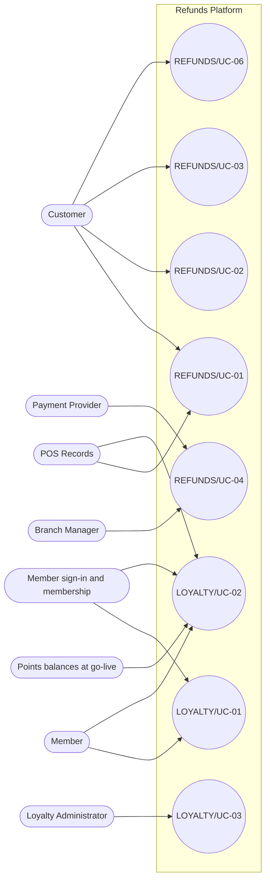

<!--
CHUNK: 03
TITLE: System Users & Use Cases
PROJECT: Refunds Platform
VERSION: 1.5
DEPENDS_ON: 01 (§7.3 also reads 05, 09, 10, 11, and 13x)
PART OF: SDD - Refunds Platform
-->

# 7. System Users & Use Cases

## 7.1 Actors

| Actor | Type (Human / System) | Description | Primary Interface |
|-------|-----------------------|-------------|-------------------|
| Customer | Human | The REFUNDS Customer ([REFUNDS 04 § Personas / Actors](../brd-refunds-portal/04-scope-and-personas.md#personas--actors)), with a portal account. Kept apart from the LOYALTY Member: a different role and a different identity source (R-12). | Refunds Portal web |
| Branch Manager | Human | The REFUNDS Branch Manager ([REFUNDS 04 § Personas / Actors](../brd-refunds-portal/04-scope-and-personas.md#personas--actors)), signing in with access set up outside the portal. Kept apart from the Loyalty Administrator: a different role. | Refunds Portal web |
| Member | Human | The LOYALTY Member ([LOYALTY 04 § Personas / Actors](../brd-loyalty-points/04-scope-and-personas.md#personas--actors)), signing in through the member sign-in. | Loyalty Points web |
| Loyalty Administrator | Human | The LOYALTY Loyalty Administrator ([LOYALTY 04 § Personas / Actors](../brd-loyalty-points/04-scope-and-personas.md#personas--actors)), signing in through the staff sign-in. | Loyalty Points web |
| POS Records | System | Calls in with member purchases ([LOYALTY 08](../brd-loyalty-points/08-integrations.md#integrations)); also called by the platform ([REFUNDS 08](../brd-refunds-portal/08-integrations.md#integrations)). | API-07 |
| Payment Provider (CardPay Ltd) | System | Calls in with payout results ([REFUNDS 08](../brd-refunds-portal/08-integrations.md#integrations)). | API-04 |
| Member sign-in and membership (Customer Accounts team) | System | Calls in with leave and rejoin notices ([LOYALTY 08](../brd-loyalty-points/08-integrations.md#integrations)). | API-08 |
| Points balances at go-live (Marketing team) | System | Delivers each member's opening balance once ([LOYALTY 08](../brd-loyalty-points/08-integrations.md#integrations)). | API-09 |

## 7.2 Use Case Diagram

**Figure 1: Use Case Diagram**

**Summary:** Customers drive the four refund use cases of their own requests and account, and branch managers decide refunds; members view their points and Loyalty Administrators correct them. POS Records supports the receipt check and the points history, the Payment Provider the payout, and the member sign-in and the go-live balances the points views.

## 7.3 Use Case Traceability (BRD → SDD)

| Use case (BRD) | Title | Owner (§17.X) | Entry points | Flows (§8.4 / §8.5) | APIs (§15) | Events (§14) | Status |
|----------------|-------|---------------|--------------|---------------------|------------|--------------|--------|
| **[Refunds Portal v1.9](../brd-refunds-portal/refunds-portal-brd-master.md) (REFUNDS)** | | | | | | | |
| [REFUNDS/UC-01](../brd-refunds-portal/06a-use-cases-customer.md#uc-01-request-a-refund) | Request a Refund | [refund-requests](./13b-service-refund-requests.md) | `POST /v1/receipt-lookups`, `POST /v1/refund-requests` | [§8.4.1](./05-workflows-and-sequences.md#841-workflow-refund-request-to-payout), [§8.5.1](./05-workflows-and-sequences.md#851-sequence-submit-a-refund-request) | API-01, API-02, API-05, API-12 | `RefundRequestSubmitted` | Active |
| [REFUNDS/UC-02](../brd-refunds-portal/06a-use-cases-customer.md#uc-02-track-refund-status) | Track Refund Status | [refund-requests](./13b-service-refund-requests.md) | `GET /v1/refund-requests`, `GET /v1/refund-requests/{refundRequestId}` | - | - | - | Active |
| [REFUNDS/UC-03](../brd-refunds-portal/06a-use-cases-customer.md#uc-03-cancel-a-refund-request) | Cancel a Refund Request | [refund-requests](./13b-service-refund-requests.md) | `POST /v1/refund-requests/{refundRequestId}/cancellation` | [§8.4.1](./05-workflows-and-sequences.md#841-workflow-refund-request-to-payout) | API-02, API-05, API-12 | `RefundRequestCancelled` | Active |
| [REFUNDS/UC-06](../brd-refunds-portal/06a-use-cases-customer.md#uc-06-sign-up-and-sign-in) | Sign Up and Sign In | [customer-accounts](./13a-service-customer-accounts.md) | `POST /v1/sign-ups`, `POST /v1/password-resets` | [§8.4.3](./05-workflows-and-sequences.md#843-workflow-customer-sign-up-and-sign-in), [§8.5.3](./05-workflows-and-sequences.md#853-sequence-sign-up-with-confirmation-codes) | API-05, API-14 | - | Active |
| [REFUNDS/UC-04](../brd-refunds-portal/06b-use-cases-branch-manager.md#uc-04-approve--reject-refund) | Approve / Reject Refund | [refund-requests](./13b-service-refund-requests.md) | `GET /v1/branch-refund-requests`, `POST /v1/refund-requests/{refundRequestId}/decision`, `Schedule: waiting-requests-summary` | [§8.4.1](./05-workflows-and-sequences.md#841-workflow-refund-request-to-payout), [§8.4.2](./05-workflows-and-sequences.md#842-workflow-points-from-purchases-and-paid-refunds), [§8.5.2](./05-workflows-and-sequences.md#852-sequence-refund-decision-payout-and-points-take-back) | API-02, API-03, API-04, API-05, API-06, API-11, API-12, API-13 | `RefundRequestApproved`, `RefundRequestRejected`, `PayoutSucceeded`, `RefundPaid`, `PayoutFailedFinally`, `RefundPayoutFailed`, `WaitingRequestsSummarised` | Active |
| [REFUNDS/UC-05](../brd-refunds-portal/05-user-journeys-overview.md#use-case-summary) | Issue Partial Refund | - | - | - | - | - | Merged into REFUNDS/UC-04 |
| **[Loyalty Points v1.8](../brd-loyalty-points/loyalty-points-brd-master.md) (LOYALTY)** | | | | | | | |
| [LOYALTY/UC-01](../brd-loyalty-points/06a-use-cases-member.md#uc-01-view-points-balance) | View Points Balance | [loyalty-points](./13e-service-loyalty-points.md) | `GET /v1/points-balance` | [§8.5.4](./05-workflows-and-sequences.md#854-sequence-member-views-points) | API-07, API-08, API-09, API-10 | - | Active |
| [LOYALTY/UC-02](../brd-loyalty-points/06a-use-cases-member.md#uc-02-view-points-history) | View Points History | [loyalty-points](./13e-service-loyalty-points.md) | `GET /v1/points-movements`, `Event: RefundPaid` | [§8.4.2](./05-workflows-and-sequences.md#842-workflow-points-from-purchases-and-paid-refunds), [§8.5.2](./05-workflows-and-sequences.md#852-sequence-refund-decision-payout-and-points-take-back), [§8.5.4](./05-workflows-and-sequences.md#854-sequence-member-views-points) | API-07, API-08, API-09, API-10 | - | Active |
| [LOYALTY/UC-03](../brd-loyalty-points/06b-use-cases-loyalty-administrator.md#uc-03-correct-a-members-points) | Correct a Member's Points | [loyalty-points](./13e-service-loyalty-points.md) | `GET /v1/members/{memberNumber}/points`, `POST /v1/members/{memberNumber}/point-corrections` | [§8.5.5](./05-workflows-and-sequences.md#855-sequence-correct-a-members-points) | API-08, API-11 | - | Active |

<!-- MASTER: refunds-platform-sdd-master.md | PREV: 02-ecosystem-overview.md | NEXT: 04-architecture-style-and-diagrams.md -->
