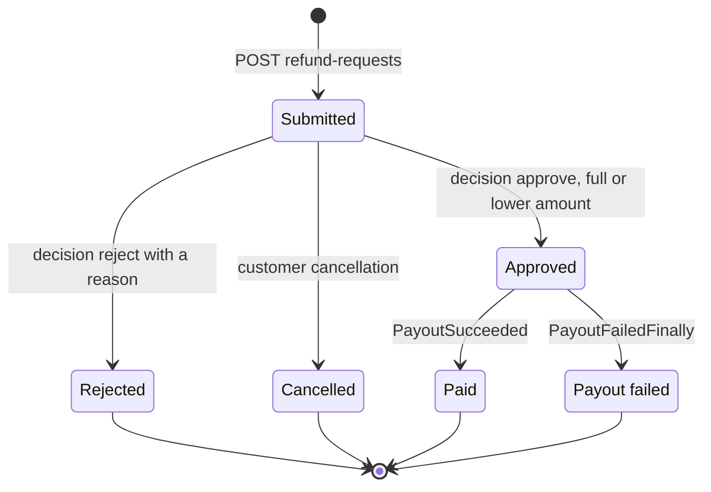
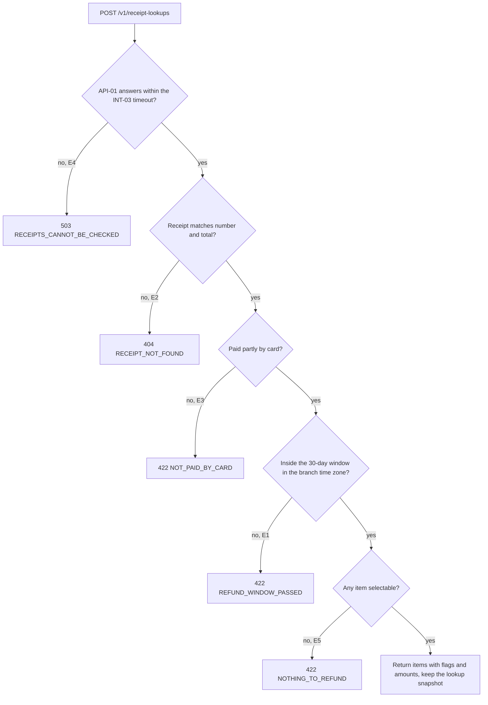
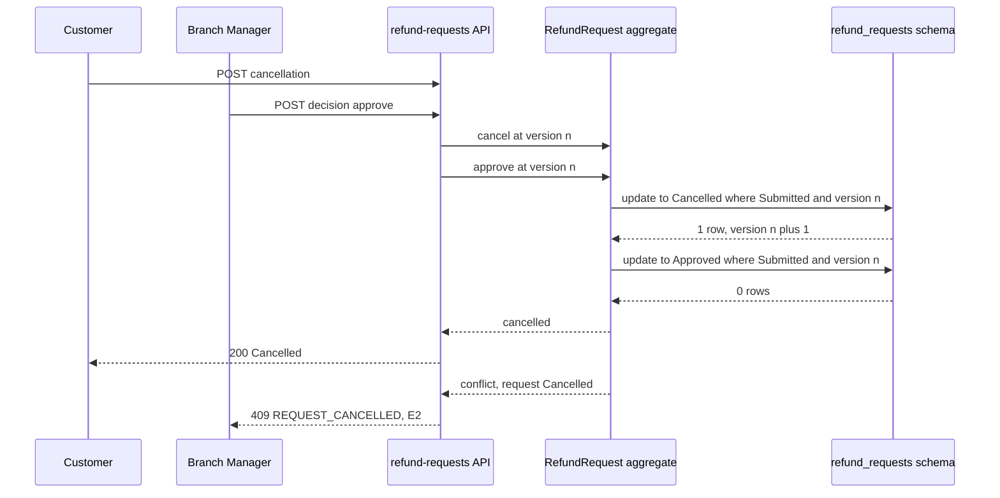

<!--
CHUNK: 13b
TITLE: Detailed Service Spec - refund-requests
PROJECT: Refunds Platform
VERSION: 1.5
DEPENDS_ON: 09, 07, 10 (event hub - topic names, event names, and payload contracts must match chunk 10 verbatim), 11 (API contracts - integration endpoints carry their API ID and match chunk 11 verbatim), 12 (roles - permission tokens match chunk 12 verbatim)
PART OF: SDD - Refunds Platform
-->

# 17. Detailed Service Specs

---

## 17.2 refund-requests

### What

The module that owns the refund request and its lifecycle: the receipt check, submission, tracking, cancellation, the branch manager's decision, and the outcome of the payout, together with the branch reference data and branch assignments that scope decisions, the items notices to POS Records, the daily waiting-requests summary, the branch refund report, and refund record retention. It realises [REFUNDS/UC-01](../brd-refunds-portal/06a-use-cases-customer.md#uc-01-request-a-refund), [REFUNDS/UC-02](../brd-refunds-portal/06a-use-cases-customer.md#uc-02-track-refund-status), [REFUNDS/UC-03](../brd-refunds-portal/06a-use-cases-customer.md#uc-03-cancel-a-refund-request), and [REFUNDS/UC-04](../brd-refunds-portal/06b-use-cases-branch-manager.md#uc-04-approve--reject-refund).

### Boundaries

- **Owns:** refund requests with their items and status history, purchase locks, receipt lookup snapshots, items notice states, branch reference data (country, time zone), branch assignments (manager, cover, contact details), the branch refund report.
- **Does not own:** payouts and their attempts (payouts); messages (notifications); customer accounts (customer-accounts); points (loyalty-points); receipts and purchases (POS Records).
- **Upstream consumers:** Refunds Portal web (customers, branch managers); notifications (port API-13).
- **Downstream dependencies:** POS Records (API-01, API-02); the staff sign-in branch assignments (API-06); in-process events to payouts, notifications, loyalty-points, and customer-accounts.

### Input

| Type | Source | Description |
|------|--------|-------------|
| REST | Refunds Portal web (customer) | Receipt lookup, submission, own list and detail, cancellation |
| REST | Refunds Portal web (branch manager) | Branch queue and detail, decision, branch refund report |
| Event | payouts: `PayoutSucceeded` | Marks the request Paid |
| Event | payouts: `PayoutFailedFinally` | Marks the request Payout failed |
| Event | refund-requests (own): `RefundRequestSubmitted`, `RefundRequestCancelled`, `RefundRequestRejected`, `RefundPayoutFailed` | The POS adapter sends the items notice (API-02) |
| Port | notifications: API-13 | Returns the manager and the active cover of a branch with their contact details |
| Schedule | `waiting-requests-summary`, daily | Daily waiting-requests summary per branch ([REFUNDS/UC-04](../brd-refunds-portal/06b-use-cases-branch-manager.md#uc-04-approve--reject-refund) BR-5) |
| Schedule | `branch-assignment-refresh`, every 15 minutes and at a branch manager's first request in each sign-in session | Refreshes branch managers, covers, and contact details from API-06 |
| Schedule | `items-notice-send`, every minute | The send job of the POS adapter (§11.1) |
| Schedule | `refund-record-retention`, daily | Unlinks requests 7 years after their last status change |

### Business Logic

refund-requests keeps one aggregate, the refund request, whose status follows the lifecycle of [REFUNDS 03 § Refund request lifecycle](../brd-refunds-portal/03-definitions-and-domain-concepts.md#refund-request-lifecycle). Every status change writes a history row with its UTC time, actor, and reason, and publishes its in-process event in the same transaction.

- **Receipt check** ([REFUNDS/UC-01](../brd-refunds-portal/06a-use-cases-customer.md#uc-01-request-a-refund) steps 1-2): `POST /v1/receipt-lookups` takes the receipt number and the receipt total and calls API-01 within the INT-03 timeout (§12). No answer gives E4; a receipt that does not match both details gives E2; no card payment gives E3; a purchase older than the window gives E1. A receipt of a branch the platform does not know answers E4 and raises an alert (§3 Assumption 4). Each item comes back with its refund amount and a selectable flag: an item refunded at a branch (reported by POS Records) or held by another request that is not Cancelled is shown but not selectable (A1); when no item is selectable the answer is E5. The result is kept as a lookup snapshot that the submission uses.
- **Amounts** (BR-4: refund capped at the card-paid amount; BR-5: price paid, receipt discount split by price): an item's refund amount is its price paid after the receipt discount is split across items in proportion to their prices; a request's amount is the sum of its items, capped at the card-paid amount left on the purchase. Only the approved amounts of the purchase's Approved and Paid requests count against the card-paid amount; Submitted, Rejected, Cancelled, and Payout failed requests do not ([REFUNDS/UC-01](../brd-refunds-portal/06a-use-cases-customer.md#uc-01-request-a-refund) BR-4; business acceptance coverage: R-15). The card-paid amount left is the card-paid amount less the amounts that count. The cap is computed under a row lock on a purchase record keyed by (`tenant_id`, purchase reference) that every submission and every approval of that purchase takes in its transaction, so two requests on one receipt are decided one after the other: a submission is capped at the card-paid amount left, and an approval may not exceed it (Decision).
- **Refund window** (BR-1: 30 days; BR-7: day 1 is the day after purchase, calendar days by the branch's date, checked again at submission): the last day is the purchase date plus 30 days, counted in the branch's time zone from the branch reference data.
- **Submission** (steps 3-6): `POST /v1/refund-requests` takes the lookup, the selected items, and the reason. It checks the window again (E1 at step 5) and locks each item with a unique key per purchase and item unit, so an item is refunded only once (BR-2: an item can be refunded only once; BR-6: items in a request that is not Cancelled cannot be selected again). It saves Submitted with a new reference number and publishes `RefundRequestSubmitted`, which drives the customer's email and SMS, the linked-request count, and the items notice to POS Records.
- **Tracking** ([REFUNDS/UC-02](../brd-refunds-portal/06a-use-cases-customer.md#uc-02-track-refund-status) steps 1-4, A1): `GET /v1/refund-requests` lists the caller's own requests (BR-1: own requests only) with reference number, amount, and status, 20 per page and sortable; an empty page is A1. `GET /v1/refund-requests/{refundRequestId}` adds the history with the date of each status change and the reason of a rejection or partial approval.
- **Cancellation** ([REFUNDS/UC-03](../brd-refunds-portal/06a-use-cases-customer.md#uc-03-cancel-a-refund-request) steps 2-5, E1, E2; BR-1: only Submitted can be cancelled): `POST /v1/refund-requests/{refundRequestId}/cancellation` is the confirmed cancel of step 4. A conditional update from Submitted with the aggregate version settles a race with a decision: a request decided before step 2 or during the confirmation is not cancelled. A cancelled request releases its item locks and publishes `RefundRequestCancelled` (the customer's messages and the items freed at POS Records).
- **Branch queue** ([REFUNDS/UC-04](../brd-refunds-portal/06b-use-cases-branch-manager.md#uc-04-approve--reject-refund) steps 1-2, A3): `GET /v1/branch-refund-requests` lists the Submitted requests of the manager's own branch and of each branch they cover today, oldest first, with amount and reason; the status filter `PAYOUT_FAILED` shows the Payout failed requests of the same branches for viewing only (A3; BR-7: Payout failed requests open for viewing).
- **Decision** (steps 3-6, A1, A2, E2): `POST /v1/refund-requests/{refundRequestId}/decision` takes approve or reject, the amount, and a reason. Approval confirms that the items are back (BR-4: approve only after the items are back; no separate return step). A lower amount must be above 0 and below the requested amount and needs a reason (A1; BR-2: partial amount above 0 and below the request); a rejection needs a reason (A2; BR-3: a rejection always has a reason). An approval takes the purchase lock, and its amount may not exceed the card-paid amount left (Amounts; [REFUNDS/UC-01](../brd-refunds-portal/06a-use-cases-customer.md#uc-01-request-a-refund) BR-4: refund capped at the card-paid amount); a larger amount is refused with the most that can still be approved, and the branch manager approves at most that amount with a reason (A1) or rejects the request (A2). The branch scope (BR-1: own or covered branch) and a conditional update from Submitted run in one transaction; a request the customer has cancelled meanwhile is not decided (E2). Approval saves Approved with the amount and publishes `RefundRequestApproved` for payouts; rejection saves Rejected and publishes `RefundRequestRejected` (the customer's messages and the items freed at POS Records). The branch read of a Submitted request carries the most that can still be approved, so step 4 asks the branch manager to confirm an amount that can pass; the 422 covers an approval on the same receipt that commits in between.
- **Payout outcome** (step 7, E1): the listener for `PayoutSucceeded` saves Paid and publishes `RefundPaid`, which drives the customer's message with the amount paid and the reason of a partial approval, and the points take-back in loyalty-points ([LOYALTY/UC-02](../brd-loyalty-points/06a-use-cases-member.md#uc-02-view-points-history) BR-1: take back on paid refunds). The listener for `PayoutFailedFinally` saves Payout failed and publishes `RefundPayoutFailed` (messages to the branch manager, the cover, and the customer, and the items freed at POS Records).
- **Items notice** (API-02; [REFUNDS/UC-01](../brd-refunds-portal/06a-use-cases-customer.md#uc-01-request-a-refund) step 6, [REFUNDS/UC-03](../brd-refunds-portal/06a-use-cases-customer.md#uc-03-cancel-a-refund-request) step 5, [REFUNDS/UC-04](../brd-refunds-portal/06b-use-cases-branch-manager.md#uc-04-approve--reject-refund) A2 and E1): each of the four triggering events marks the request's notice as due. The POS adapter (in the send job of §11.1) derives the wanted item state from the request's current status (held for Submitted, Approved, and Paid; freed for Cancelled, Rejected, and Payout failed), sends it only when it differs from the state POS Records last acknowledged, and records the acknowledgement; a request whose hold was never attempted sends nothing when it is freed. A late or redelivered event therefore leads to the current state, never an older one. A wanted state not acknowledged within 15 minutes raises the INT-03 lag alert.
- **Daily waiting-requests summary** (BR-5: daily message only on days with waiting requests; BR-6: a cover gets the covered branch's messages): the `waiting-requests-summary` job runs once a day at a configured hour in each branch's time zone and publishes `WaitingRequestsSummarised` for each branch with Submitted requests, with their count and the oldest submission time.
- **Branch assignments** ([REFUNDS 02 § Assumptions / Constraints](../brd-refunds-portal/02-glossary-assumptions-facts.md#assumptions--constraints), Assumption 3): the `branch-assignment-refresh` job reads API-06 every 15 minutes. The first branch request of a branch manager's sign-in session that refund-requests has not seen (a session identifier in the token) also reads API-06 for that manager before it answers, within the INT-05 timeout, and falls back to the last synced copy on failure. A cover counts from the start of its first day to the end of its last day in the branch's time zone. The decision gate and API-13 read this copy.
- **Branch refund report** ([REFUNDS 09](../brd-refunds-portal/09-reporting-and-analytics.md#reporting--analytics)): `GET /v1/branch-refund-reports` returns, for each branch the caller manages or covers, the requests per status, the amounts paid, the average time to decision, and the average time from Submitted to Paid, for all of the branch's requests submitted by the end of the previous day in the branch's time zone, as JSON, CSV, or Excel. The status and paid amount are as of that cutoff, taken from the timestamped history. The decision sample contains requests whose first approval or rejection is at or before the cutoff; cancellation without a decision is excluded. The payment sample contains requests whose Paid transition is at or before the cutoff. Each mean is the sum of elapsed hours from Submitted to that transition divided by the sample count; an empty sample returns null. Changes after the cutoff do not enter that report ([REFUNDS 09](../brd-refunds-portal/09-reporting-and-analytics.md#reporting--analytics)).
- **Retention** ([REFUNDS 03 § Refund records](../brd-refunds-portal/03-definitions-and-domain-concepts.md#refund-records)): the `refund-record-retention` job unlinks each request whose last status change is more than 7 years old from its customer account, keeps its amounts and dates for reporting, and publishes `RefundRequestUnlinked`.

**State machine (if applicable):**

**Figure 17: State Machine - refund request**

**Summary:** A request is Submitted at creation and leaves Submitted only by a decision or a cancellation, whichever commits first. An approved request ends Paid or Payout failed on the outcome payouts reports; Rejected, Cancelled, Paid, and Payout failed are end states.

This state machine is the persisted status model. A decision and a cancellation each update the row only from Submitted and only at the version the caller read, in one statement, so exactly one of them commits. Paid and Payout failed are set only from Approved by the two payout listeners, which ignore an event for a request that is not Approved. Every transition writes its history row and its event in the same transaction.

### Output

| Type | Destination | Description |
|------|-------------|-------------|
| REST response | Refunds Portal web | Lookup result, request, list, history, decision result, report |
| Event | notifications | `RefundRequestSubmitted`, `RefundRequestCancelled`, `RefundRequestRejected`, `RefundPaid`, `RefundPayoutFailed`, `WaitingRequestsSummarised` |
| Event | payouts | `RefundRequestApproved` |
| Event | loyalty-points | `RefundPaid` |
| Event | customer-accounts | `RefundRequestSubmitted`, `RefundRequestUnlinked` |
| Outbound call | POS Records (API-02) | The current item state of a request, held or freed |
| Port answer | notifications (API-13) | Branch recipients |

### Integrations

| Integration | Direction | Protocol | Purpose | Contract | Failure Handling |
|-------------|-----------|----------|---------|----------|------------------|
| POS Records | Outbound, sync | Provider API | Receipt lookup | API-01 (§15) | No answer within the INT-03 timeout: [REFUNDS/UC-01](../brd-refunds-portal/06a-use-cases-customer.md#uc-01-request-a-refund) E4 |
| POS Records | Outbound, async, by the module's send job (§11.1) | Provider API | Current item state of a request | API-02 (§15) | Resent with backoff until acknowledged; lag alert after 15 minutes (§12 INT-03) |
| Staff sign-in (branch assignments) | Outbound, sync, scheduled and at a session's first request | Provider API | Managers, covers, contact details | API-06 (§15) | Within the INT-05 timeout; the last synced assignments stay in force (§12 INT-05) |
| payouts | Outbound, async | In-process event | Start the payout | `RefundRequestApproved` (§14.10) | Redelivered from the publication log |
| payouts | Inbound, async | In-process events | Payout outcome | `PayoutSucceeded`, `PayoutFailedFinally` (§14.10) | Redelivered from the publication log |
| notifications | Outbound, async | In-process events | Customer and branch manager messages | `RefundRequestSubmitted`, `RefundRequestCancelled`, `RefundRequestRejected`, `RefundPaid`, `RefundPayoutFailed`, `WaitingRequestsSummarised` (§14.10) | Redelivered from the publication log |
| notifications | Inbound, sync (in-process) | Port | Branch recipients | API-13 (§15) | Typed error to the caller |
| loyalty-points | Outbound, async | In-process event | Points take-back | `RefundPaid` (§14.10) | Redelivered from the publication log |
| customer-accounts | Outbound, async | In-process events | Linked-request count | `RefundRequestSubmitted`, `RefundRequestUnlinked` (§14.10) | Redelivered from the publication log |

### DB Modeling

#### Entity Relationship

**Figure 18: Entity Relationship - refund-requests**

```mermaid
erDiagram
  REFUND_REQUEST ||--|{ REFUND_REQUEST_ITEM : holds
  REFUND_REQUEST ||--|{ REFUND_STATUS_HISTORY : records
  REFUND_REQUEST ||--o| ITEMS_NOTICE : tracks
  RECEIPT_LOOKUP ||--|{ RECEIPT_LOOKUP_ITEM : lists
  BRANCH ||--o{ BRANCH_ASSIGNMENT : staffs
  REFUND_REQUEST {
    uuid tenant_id PK
    uuid id PK
  }
  REFUND_REQUEST_ITEM {
    uuid tenant_id PK
    uuid id PK
    uuid refund_request_id FK
  }
  REFUND_STATUS_HISTORY {
    uuid tenant_id PK
    uuid id PK
    uuid refund_request_id FK
  }
  ITEMS_NOTICE {
    uuid tenant_id PK
    uuid refund_request_id PK, FK
  }
  PURCHASE_LOCK {
    uuid tenant_id PK
    string purchase_reference PK
  }
  RECEIPT_LOOKUP {
    uuid tenant_id PK
    uuid id PK
  }
  RECEIPT_LOOKUP_ITEM {
    uuid tenant_id PK
    uuid id PK
    uuid receipt_lookup_id FK
  }
  BRANCH {
    uuid tenant_id PK
    string branch_id PK
  }
  BRANCH_ASSIGNMENT {
    uuid tenant_id PK
    uuid id PK
    string branch_id FK
  }
  STAFF_SESSION {
    uuid tenant_id PK
    string session_id PK
  }
  ROLE_PERMISSION {
    uuid tenant_id PK
    string role PK
    string permission_token PK
  }
  INBOX_ENTRY {
    uuid tenant_id PK
    string listener PK
    uuid event_id PK
  }
  IDEMPOTENCY_RECORD {
    uuid tenant_id PK
    string idempotency_key PK
  }
```

**Summary:** A refund request holds its items, its status history, and at most one items notice state; a receipt lookup lists its items, and a branch has its assignments. The purchase locks, staff sessions, role permissions, inbox, and idempotency records stand alone.

#### Tables Design

| Table | Column | Type | Constraints | Notes |
|-------|--------|------|-------------|-------|
| `refund_request` | `tenant_id`, `id` | uuid, uuid | PK (`tenant_id`, `id`), NOT NULL | `id` is UUIDv7 |
| `refund_request` | `reference_number` | varchar(16) | NOT NULL until unlinking; unique (`tenant_id`, `reference_number`) when set | The customer's reference and the LOYALTY refund reference |
| `refund_request` | `customer_account_id` | uuid | NULL only after unlinking (`unlinked_at` set); index (`tenant_id`, `customer_account_id`, `submitted_at`) | Not a foreign key: the account lives in customer-accounts |
| `refund_request` | `branch_id` | varchar(32) | NOT NULL; index (`tenant_id`, `branch_id`, `status`, `submitted_at`) | POS Records branch id |
| `refund_request` | `purchase_reference` | varchar(64) | NOT NULL until unlinking; index (`tenant_id`, `purchase_reference`) | From API-01 |
| `refund_request` | `purchase_date` | date | NOT NULL | Branch-local, from API-01 |
| `refund_request` | `original_payment_reference` | varchar(128) | NOT NULL until unlinking | From API-01; format `TBD - external` |
| `refund_request` | `status` | varchar(16) | NOT NULL; SUBMITTED, APPROVED, REJECTED, CANCELLED, PAID, or PAYOUT_FAILED; index (`tenant_id`, `status`, `last_status_change_at`) | |
| `refund_request` | `customer_reason` | varchar(500) | NOT NULL until unlinking, then NULL | Free text |
| `refund_request` | `requested_amount`, `currency` | numeric(19,4), char(3) | NOT NULL; amount above 0 | EUR |
| `refund_request` | `approved_amount` | numeric(19,4) | NULL until APPROVED; not above `requested_amount` | |
| `refund_request` | `decision_reason` | varchar(500) | NULL unless REJECTED or approved below the requested amount; NULL again after unlinking | Free text |
| `refund_request` | `decided_by_staff_id`, `decided_at` | varchar(64), timestamptz | NULL until decided; `decided_by_staff_id` NULL again after unlinking | |
| `refund_request` | `submitted_at`, `last_status_change_at` | timestamptz | NOT NULL | |
| `refund_request` | `paid_at` | timestamptz | NULL until PAID | |
| `refund_request` | `unlinked_at` | timestamptz | NULL until unlinked | |
| `refund_request` | `created_at`, `created_by`, `updated_at`, `updated_by`, `version` | per §11.1 | NOT NULL | `version` guards the transitions |
| `refund_request_item` | `tenant_id`, `id` | uuid, uuid | PK (`tenant_id`, `id`), NOT NULL | |
| `refund_request_item` | `refund_request_id` | uuid | NOT NULL; FK (`tenant_id`, `refund_request_id`) to `refund_request` | |
| `refund_request_item` | `purchase_reference`, `receipt_line_ref`, `unit_index` | varchar(64), varchar(32), integer | NOT NULL, `purchase_reference` until unlinking; unique (`tenant_id`, `purchase_reference`, `receipt_line_ref`, `unit_index`) where `active` | The item lock (BR-2, BR-6) |
| `refund_request_item` | `description`, `refund_amount` | varchar(200), numeric(19,4) | NOT NULL | |
| `refund_request_item` | `active` | boolean | NOT NULL | False once the request is Cancelled |
| `refund_status_history` | `tenant_id`, `id` | uuid, uuid | PK (`tenant_id`, `id`), NOT NULL | |
| `refund_status_history` | `refund_request_id` | uuid | NOT NULL; FK (`tenant_id`, `refund_request_id`) to `refund_request`; index (`tenant_id`, `refund_request_id`, `changed_at`) | |
| `refund_status_history` | `from_status` | varchar(16) | NULL only on the first row | |
| `refund_status_history` | `to_status`, `changed_at`, `actor_type` | varchar(16), timestamptz, varchar(16) | NOT NULL | Actor CUSTOMER, BRANCH_MANAGER, or SYSTEM |
| `refund_status_history` | `actor_id` | varchar(64) | NULL for SYSTEM and after unlinking | |
| `refund_status_history` | `reason` | varchar(500) | NULL unless a rejection or partial approval; NULL after unlinking | |
| `items_notice` | `tenant_id`, `refund_request_id` | uuid, uuid | PK (`tenant_id`, `refund_request_id`); FK to `refund_request`; NOT NULL | |
| `items_notice` | `wanted_state` | varchar(8) | NOT NULL; HELD or FREED | |
| `items_notice` | `acknowledged_state` | varchar(8) | NULL until POS Records acknowledges a state | |
| `items_notice` | `due`, `attempts` | boolean, integer | NOT NULL | |
| `items_notice` | `next_attempt_at` | timestamptz | NULL when not due; index (`tenant_id`, `due`, `next_attempt_at`) | |
| `items_notice` | `last_error_code` | varchar(64) | NULL unless the last try failed | |
| `purchase_lock` | `tenant_id`, `purchase_reference` | uuid, varchar(64) | PK (`tenant_id`, `purchase_reference`), NOT NULL | The purchase lock of Amounts |
| `purchase_lock` | `card_paid_amount` | numeric(19,4) | NOT NULL | From API-01 |
| `receipt_lookup` | `tenant_id`, `id` | uuid, uuid | PK (`tenant_id`, `id`), NOT NULL | |
| `receipt_lookup` | `customer_account_id`, `purchase_reference`, `branch_id`, `purchase_date` | uuid, varchar(64), varchar(32), date | NOT NULL; index (`tenant_id`, `customer_account_id`, `created_at`) | |
| `receipt_lookup` | `card_paid_amount`, `original_payment_reference`, `window_ends_on` | numeric(19,4), varchar(128), date | NOT NULL | |
| `receipt_lookup` | `created_at`, `expires_at` | timestamptz | NOT NULL | Expires 30 minutes after the lookup |
| `receipt_lookup_item` | `tenant_id`, `id` | uuid, uuid | PK (`tenant_id`, `id`), NOT NULL | |
| `receipt_lookup_item` | `receipt_lookup_id` | uuid | NOT NULL; FK (`tenant_id`, `receipt_lookup_id`) to `receipt_lookup` | |
| `receipt_lookup_item` | `receipt_line_ref`, `unit_index`, `description`, `refund_amount`, `selectable` | varchar(32), integer, varchar(200), numeric(19,4), boolean | NOT NULL | |
| `receipt_lookup_item` | `not_selectable_reason` | varchar(24) | NULL when selectable; ALREADY_REFUNDED or IN_ANOTHER_REQUEST | |
| `branch` | `tenant_id`, `branch_id` | uuid, varchar(32) | PK (`tenant_id`, `branch_id`), NOT NULL | Configuration per environment and tenant (§3 Assumption 4) |
| `branch` | `country_code`, `time_zone` | char(2), varchar(64) | NOT NULL | ISO 3166-1 alpha-2; IANA time zone |
| `branch_assignment` | `tenant_id`, `id` | uuid, uuid | PK (`tenant_id`, `id`), NOT NULL | |
| `branch_assignment` | `branch_id` | varchar(32) | NOT NULL; FK (`tenant_id`, `branch_id`) to `branch`; index (`tenant_id`, `branch_id`, `role`) | |
| `branch_assignment` | `staff_id`, `role` | varchar(64), varchar(8) | NOT NULL; role MANAGER or COVER; index (`tenant_id`, `staff_id`, `valid_from`) | |
| `branch_assignment` | `email`, `mobile_number` | varchar(254), varchar(20) | NOT NULL | PII |
| `branch_assignment` | `valid_from`, `synced_at` | date, timestamptz | NOT NULL | |
| `branch_assignment` | `valid_to` | date | NULL for an open-ended assignment | |
| `staff_session` | `tenant_id`, `session_id` | uuid, varchar(64) | PK (`tenant_id`, `session_id`), NOT NULL | Sign-in sessions already refreshed |
| `staff_session` | `staff_id`, `first_seen_at` | varchar(64), timestamptz | NOT NULL | |
| `role_permission` | `tenant_id`, `role`, `permission_token` | uuid, varchar(40), varchar(80) | PK (`tenant_id`, `role`, `permission_token`), NOT NULL | Seed of §16.12.1 |
| `inbox_entry` | `tenant_id`, `listener`, `event_id` | uuid, varchar(80), uuid | PK (`tenant_id`, `listener`, `event_id`), NOT NULL | One row per event a listener handled |
| `inbox_entry` | `status`, `attempts`, `updated_at` | varchar(8), integer, timestamptz | NOT NULL; status DONE or PARKED | |
| `inbox_entry` | `last_error_code` | varchar(64) | NULL unless a run failed | |
| `idempotency_record` | `tenant_id`, `idempotency_key` | uuid, varchar(64) | PK (`tenant_id`, `idempotency_key`), NOT NULL | |
| `idempotency_record` | `request_hash`, `response_status`, `response_body`, `created_at` | varchar(64), integer, jsonb, timestamptz | NOT NULL | The first response, replayed (§11.1); a reused key with another body answers 409 `CONFLICT` |

#### Migration Strategy

- **Tool:** Flyway, versioned SQL in the module's own location for the `refund_requests` schema (§11.1).
- **Backward compatibility:** additive changes; expand, then contract for a breaking change.
- **Data backfill:** a separate versioned migration, run before the code that reads the new column.
- **Rollback:** a forward fix migration; no down scripts.

#### Retention Policy

- `refund_request`, `refund_request_item`, `refund_status_history`: kept 7 years after the last status change, then unlinked ([REFUNDS 03 § Refund records](../brd-refunds-portal/03-definitions-and-domain-concepts.md#refund-records)): the branch, the statuses with their dates, and the amounts with their currency stay for reporting; `customer_account_id`, the free-text reasons, `reference_number`, `purchase_reference` of the request and its items, `original_payment_reference`, `decided_by_staff_id`, and the `actor_id` of every history row are cleared, and `created_by` and `updated_by` values that hold a person's id become the module name. The kept rows identify no one.
- `items_notice`: deleted 30 days after its request reaches an end state and its wanted state is acknowledged.
- `purchase_lock`: deleted when every request of the purchase is unlinked.
- `receipt_lookup`, `receipt_lookup_item`: deleted 1 day after the lookup expires.
- `branch`: kept while configured.
- `branch_assignment`: deleted 30 days after its `valid_to`; decisions keep only the staff id.
- `staff_session`: deleted 24 hours after `first_seen_at`.
- `role_permission`: the seed of the running release.
- `inbox_entry`: DONE rows deleted after 30 days; PARKED rows kept until the §20.1.3 procedure closes them.
- `idempotency_record`: deleted 24 hours after creation.

#### Archival

- **Cold storage:** Not applicable: requests stay in the database for reporting after they are unlinked.
- **Format:** Not applicable.
- **Schedule:** Not applicable.
- **Restore SLA:** Not applicable.

#### Data Encryption

- **At rest:** the database volume encryption of the hosting.
- **In transit:** TLS 1.2 or later (§11.6).
- **Key management:** Vault, rotation per §11.6.
- **PII columns:** the customer account link, the free-text reasons, the reference number, the purchase and original payment references, the actor ids and the audit columns that hold a person's id, branch manager contact details, staff ids; masked in every non-production environment.

### Multi-Tenancy Specifications

- **Strategy override:** None: shared schema with `tenant_id`, PostgreSQL, and the §11.4 instrumentation, as §11 sets.
- **Tenant filter:** `tenant_id` from the token or from the event (§11.2); item locks, purchase locks, and reference numbers are unique within a tenant.
- **Cross-tenant queries:** forbidden; the branch report reads one tenant, and the jobs run per tenant from the tenant registry (§11.2).

### API Standards

- **Style:** REST (ADR-04).
- **Versioning:** URI prefix `/v1`.
- **Authentication:** Keycloak tokens validated at the gateway and in the deployable.
- **Idempotency:** every POST takes an `Idempotency-Key`; a replay returns the first response (§15.1).
- **Pagination:** page and size, 20 rows by default, sortable lists ([REFUNDS 11 § UI/UX Expectations](../brd-refunds-portal/11-summary-and-uiux.md#uiux-expectations)).
- **Error envelope:** per the §15.1 error model.

#### List of APIs (Swagger-friendly)

| Method | Path | Summary | Request Body | Response | Permission token (§16) | API ID (§15) |
|--------|------|---------|--------------|----------|------------------------|--------------|
| POST | `/v1/receipt-lookups` | Check a receipt and list its items ([REFUNDS/UC-01](../brd-refunds-portal/06a-use-cases-customer.md#uc-01-request-a-refund) steps 1-2) | `ReceiptLookupRequest` | `ReceiptLookupResponse` | `refund-requests.receipt.lookup` | - |
| POST | `/v1/refund-requests` | Submit a refund request ([REFUNDS/UC-01](../brd-refunds-portal/06a-use-cases-customer.md#uc-01-request-a-refund) steps 3-6) | `RefundRequestCreateRequest` | `RefundRequestResponse` | `refund-requests.request.create` | - |
| GET | `/v1/refund-requests` | List own requests ([REFUNDS/UC-02](../brd-refunds-portal/06a-use-cases-customer.md#uc-02-track-refund-status) steps 1-2) | - | `RefundRequestPage` | `refund-requests.request.read-own` | - |
| GET | `/v1/refund-requests/{refundRequestId}` | Own request with history ([REFUNDS/UC-02](../brd-refunds-portal/06a-use-cases-customer.md#uc-02-track-refund-status) steps 3-4) | - | `RefundRequestDetailResponse` | `refund-requests.request.read-own` | - |
| POST | `/v1/refund-requests/{refundRequestId}/cancellation` | Cancel a Submitted request ([REFUNDS/UC-03](../brd-refunds-portal/06a-use-cases-customer.md#uc-03-cancel-a-refund-request) steps 2-5) | `CancellationRequest` | `RefundRequestResponse` | `refund-requests.request.cancel-own` | - |
| GET | `/v1/branch-refund-requests` | Branch queue, oldest first ([REFUNDS/UC-04](../brd-refunds-portal/06b-use-cases-branch-manager.md#uc-04-approve--reject-refund) steps 1-2, A3) | - | `BranchRefundRequestPage` | `refund-requests.branch-request.read` | - |
| GET | `/v1/branch-refund-requests/{refundRequestId}` | Branch request with history ([REFUNDS/UC-04](../brd-refunds-portal/06b-use-cases-branch-manager.md#uc-04-approve--reject-refund) step 3, A3) | - | `RefundRequestDetailResponse` | `refund-requests.branch-request.read` | - |
| POST | `/v1/refund-requests/{refundRequestId}/decision` | Approve, approve a lower amount, or reject ([REFUNDS/UC-04](../brd-refunds-portal/06b-use-cases-branch-manager.md#uc-04-approve--reject-refund) steps 3-6, A1, A2) | `DecisionRequest` | `RefundRequestResponse` | `refund-requests.request.decide` | - |
| GET | `/v1/branch-refund-reports` | Branch refund report, JSON, CSV, or Excel ([REFUNDS 09](../brd-refunds-portal/09-reporting-and-analytics.md#reporting--analytics)) | - | `BranchRefundReport` | `refund-requests.branch-report.read` | - |

**Request and response fields**

| Schema | Field | Type | Required | Constraints | Description |
|--------|-------|------|----------|-------------|-------------|
| `ReceiptLookupRequest` | `receiptNumber`, `receiptTotal` | string, `Money` | Yes | Number max 64; total above 0 | The two details of step 1 |
| `ReceiptLookupResponse` | `receiptLookupId`, `branchId`, `purchaseDate`, `windowEndsOn`, `cardPaidAmount` | UUIDv7, string, date, date, `Money` | Yes | - | Snapshot kept 30 minutes |
| `ReceiptLookupResponse` | `items` | array of `ReceiptItem` | Yes | 1 or more | Every item on the receipt (step 2) |
| `ReceiptItem` | `itemRef`, `description`, `refundAmount`, `selectable` | string, string, `Money`, boolean | Yes | - | `itemRef` names the receipt line and unit |
| `ReceiptItem` | `notSelectableReason` | enum ALREADY_REFUNDED, IN_ANOTHER_REQUEST | When not selectable | - | A1 |
| `RefundRequestCreateRequest` | `receiptLookupId`, `itemRefs`, `reason` | UUIDv7, array of string, string | Yes | 1 or more items; reason max 500 | Steps 3 and 5 |
| `RefundRequestResponse` | `refundRequestId`, `referenceNumber`, `status`, `requestedAmount`, `lastStatusChangeAt`, `version` | UUIDv7, string, enum, `Money`, timestamp, integer | Yes | - | |
| `RefundRequestResponse` | `approvedAmount` | `Money` | When approved | - | |
| `RefundRequestPage` | `items`, `page`, `size`, `totalElements` | array, integer, integer, integer | Yes | Size 20 by default; sort by `submittedAt`, `status`, or `amount` | Each item: `refundRequestId`, `referenceNumber`, `amount`, `status`, `submittedAt` |
| `RefundRequestDetailResponse` | `RefundRequestResponse` fields, `items`, `history`, `cancellable` | -, array, array, boolean | Yes | - | History rows: `status`, `changedAt`, `reason` |
| `RefundRequestDetailResponse` | `maxApprovable` | `Money` | On the branch read of a Submitted request | 0 or more | The most an approval can pay now (Amounts): step 4 proposes the lower of it and the requested amount, a lower amount needs a reason (A1), and 0 leaves only a rejection (A2) |
| `CancellationRequest` | `version` | integer | Yes | - | The version the customer saw |
| `BranchRefundRequestPage` | `items`, `page`, `size`, `totalElements` | array, integer, integer, integer | Yes | Query `status` SUBMITTED (default) or PAYOUT_FAILED; oldest first | Each item: `refundRequestId`, `referenceNumber`, `branchId`, `requestedAmount`, `customerReason`, `status`, `submittedAt` |
| `DecisionRequest` | `decision`, `version` | enum APPROVE, REJECT; integer | Yes | - | |
| `DecisionRequest` | `amount` | `Money` | For APPROVE | Above 0, not above the requested amount or the card-paid amount left (Amounts) | A lower amount is A1 |
| `DecisionRequest` | `reason` | string | For REJECT and for a lower amount | Max 500 | A1, A2 |
| `BranchRefundReport` | `branchId`, `cutoffDate`, `requestsPerStatus`, `amountPaid`, `averageHoursToDecision`, `averageHoursSubmittedToPaid` | string, date, map, `Money`, nullable decimal, nullable decimal | Yes | Query `branchId` (optional), `format` json, csv, or xlsx | One block per branch the caller manages or covers; each average is null when its sample is empty, otherwise elapsed hours per the Business Logic cutoff/sample rules; status counts and paid amount use that same cutoff |

### Event-Driven Architecture (If Applicable)

#### Event Model

**Published events:**

Not applicable - no integration events.

**Consumed events:**

Not applicable - no integration events.

**In-process domain events (modules only):**

| Event | Publisher module | Listener modules | Transaction phase (before commit / after commit) | Payload (DTO) | Notes |
|---|---|---|---|---|---|
| `RefundRequestSubmitted` | refund-requests | notifications, customer-accounts, refund-requests (POS adapter) | after commit | `RefundRequestSubmittedDto`: tenantId, correlationId, refundRequestId, referenceNumber, customerAccountId, branchId, branchCountry, purchaseReference, itemRefs, requestedAmount (Money), businessDate, submittedAt | Here: the items notice becomes due |
| `RefundRequestCancelled` | refund-requests | notifications, refund-requests (POS adapter) | after commit | `RefundRequestCancelledDto`: tenantId, correlationId, refundRequestId, referenceNumber, customerAccountId, branchId, branchCountry, businessDate, cancelledAt | Here: the items notice becomes due |
| `RefundRequestApproved` | refund-requests | payouts | after commit | `RefundRequestApprovedDto`: tenantId, correlationId, refundRequestId, referenceNumber, branchId, approvedAmount (Money), originalPaymentReference, approvedAt | - |
| `RefundRequestRejected` | refund-requests | notifications, refund-requests (POS adapter) | after commit | `RefundRequestRejectedDto`: tenantId, correlationId, refundRequestId, referenceNumber, customerAccountId, branchId, branchCountry, reason, businessDate, rejectedAt | Here: the items notice becomes due |
| `RefundPaid` | refund-requests | notifications, loyalty-points | after commit | `RefundPaidDto`: tenantId, correlationId, refundRequestId, referenceNumber, customerAccountId, branchId, branchCountry, purchaseReference, paidAmount (Money), refundDate, partialReason (optional), paidAt | - |
| `RefundPayoutFailed` | refund-requests | notifications, refund-requests (POS adapter) | after commit | `RefundPayoutFailedDto`: tenantId, correlationId, refundRequestId, referenceNumber, customerAccountId, branchId, branchCountry, businessDate, failedAt | Here: the items notice becomes due |
| `WaitingRequestsSummarised` | refund-requests | notifications | after commit | `WaitingRequestsSummarisedDto`: tenantId, correlationId, branchId, branchCountry, summaryDate, waitingCount, oldestSubmittedAt | - |
| `RefundRequestUnlinked` | refund-requests | customer-accounts | after commit | `RefundRequestUnlinkedDto`: tenantId, correlationId, refundRequestId, customerAccountId, unlinkedAt | - |
| `PayoutSucceeded` | payouts | refund-requests | after commit | `PayoutSucceededDto`: tenantId, correlationId, payoutId, refundRequestId, paidAmount (Money), succeededAt | Here: marks the request Paid |
| `PayoutFailedFinally` | payouts | refund-requests | after commit | `PayoutFailedFinallyDto`: tenantId, correlationId, payoutId, refundRequestId, attemptCount, failedAt | Here: marks the request Payout failed |

#### Messaging Infra

Not applicable - no integration events.

### Constraints

- Authorization ([REFUNDS 07](../brd-refunds-portal/07-users-use-cases-matrix.md#users--use-cases-matrix)): [REFUNDS/UC-01](../brd-refunds-portal/06a-use-cases-customer.md#uc-01-request-a-refund) is open to role CUSTOMER with `refund-requests.receipt.lookup` and `refund-requests.request.create`. [REFUNDS/UC-02](../brd-refunds-portal/06a-use-cases-customer.md#uc-02-track-refund-status) and [REFUNDS/UC-03](../brd-refunds-portal/06a-use-cases-customer.md#uc-03-cancel-a-refund-request) are open to role CUSTOMER for its own requests only (matrix footnote 2) with `refund-requests.request.read-own` and `refund-requests.request.cancel-own`. [REFUNDS/UC-04](../brd-refunds-portal/06b-use-cases-branch-manager.md#uc-04-approve--reject-refund) is open to role BRANCH_MANAGER for its own branch or a branch it covers (footnote 1) with `refund-requests.branch-request.read` and `refund-requests.request.decide`; the branch refund report needs `refund-requests.branch-report.read` for the same branches. Port API-13 needs `refund-requests.branch-recipients.read`.
- Only the customer, the branch's manager, and the manager covering the branch can see a request (REFUNDS/NFR-04).
- The customer never enters card details; the payout uses the original payment reference from the receipt lookup ([REFUNDS/UC-01](../brd-refunds-portal/06a-use-cases-customer.md#uc-01-request-a-refund) BR-3: no card details entered).

### Error Handling

- **Synchronous APIs:** Problem Details per §15.1 with a plain-language `detail`.
- **Validation errors:** 400 `VALIDATION_FAILED`, for example a decision without a reason ([REFUNDS/UC-04](../brd-refunds-portal/06b-use-cases-branch-manager.md#uc-04-approve--reject-refund) BR-3: a rejection always has a reason).
- **Domain errors:** [REFUNDS/UC-01](../brd-refunds-portal/06a-use-cases-customer.md#uc-01-request-a-refund) E1 -> 422 `REFUND_WINDOW_PASSED`; E2 -> 404 `RECEIPT_NOT_FOUND`; E3 -> 422 `NOT_PAID_BY_CARD`; E4 -> 503 `RECEIPTS_CANNOT_BE_CHECKED`; E5 -> 422 `NOTHING_TO_REFUND`; [REFUNDS/UC-03](../brd-refunds-portal/06a-use-cases-customer.md#uc-03-cancel-a-refund-request) E1 and E2 -> 409 `REQUEST_ALREADY_DECIDED`; [REFUNDS/UC-04](../brd-refunds-portal/06b-use-cases-branch-manager.md#uc-04-approve--reject-refund) E2 -> 409 `REQUEST_CANCELLED`; A1 outside BR-2 -> 422 `INVALID_PARTIAL_AMOUNT`; an approval above the card-paid amount left ([REFUNDS/UC-01](../brd-refunds-portal/06a-use-cases-customer.md#uc-01-request-a-refund) BR-4: refund capped at the card-paid amount) -> 422 `CARD_PAID_AMOUNT_EXCEEDED` with the most that can still be approved (`maxApprovable`); a decision on a request that is not Submitted (A3) -> 409 `REQUEST_ALREADY_DECIDED`.
- **Auth errors:** 401 `UNAUTHENTICATED`; 403 `FORBIDDEN` for a missing permission token; 404 `NOT_FOUND` for a request outside the caller's own requests or branches, so its existence is not revealed.
- **Server errors:** 500 `INTERNAL_ERROR`.
- **Async consumers:** the two payout listeners and the POS adapter record each event in `inbox_entry` and apply it once; a payout event for a request that is not Approved is ignored and logged.
- **Poison messages:** a listener run that fails is retried by the `publication-resubmit` job (§11.1); after 10 failed runs the listener parks the event (`inbox_entry` PARKED), completes the publication, and raises an alert, and §20.1.3 replays it. The `items-notice-send` job retries with exponential backoff and jitter from 1 minute, doubling to at most 30 minutes, with the per-call timeout of §12 INT-03, and keeps trying until POS Records acknowledges the current state. The `branch-assignment-refresh` job keeps the last synced copy on failure (§12 INT-05). The other jobs work one branch or one request per transaction; a failing one is logged by its id and retried at the next run.

### Observability & Monitoring

#### Logging

- JSON per §11.4.
- Fields: correlation id, refund request id, status transition, outcome; never the customer's contact details or free-text reasons at INFO.
- Retention per §11.4.

#### Metrics

| Metric | Type | Labels | Purpose |
|--------|------|--------|---------|
| `receipt_lookups_total` | counter | `outcome` | Lookups by E1 to E5 outcome or success |
| `receipt_lookup_duration_seconds` | histogram | - | The wait at step 2 (REFUNDS/NFR-05) |
| `refund_transitions_total` | counter | `to_status` | Status changes |
| `branch_oldest_waiting_seconds` | gauge | `branch` | Age of the oldest Submitted request per branch |
| `items_notice_pending` | gauge | - | Notices due and not acknowledged |
| `items_notice_lag_seconds` | gauge | - | Age of the oldest unacknowledged notice (INT-03 lag alert) |
| `branch_assignment_age_seconds` | gauge | - | Time since the last good refresh (INT-05 alert) |

#### Tracing

- OpenTelemetry spans for each endpoint, each API-01, API-02, and API-06 call, and each listener.
- W3C trace context on the outbound calls.
- Sampling per §11.4.

### Developer Notes

- **Recommended patterns:** hexagonal ports `PointOfSalePort` (API-01, API-02) and `StaffDirectoryPort` (API-06); the aggregate enforces every transition; conditional updates with the version settle races; the POS adapter sends the request's current state, never the content of the event that woke it.
- **Avoid:** calling POS Records or any provider inside the business transaction; reading another module's schema; trusting a branch id sent by the client without the branch gate.
- **Testing:** JUnit 5 and Mockito for the window, amount, and item-lock rules; Testcontainers with PostgreSQL for the race between a cancellation and a decision and for two submissions or two approvals on one receipt; a stubbed POS Records for E1 to E5 and for notices out of order.

### Service-Level Diagrams

#### Implementation Flow Chart

**Figure 19: Implementation Flow - refund-requests**

**Summary:** The receipt check stops at the first failing rule, in the order E4, E2, E3, E1, E5, each with its own error code. Otherwise it returns every item with a selectable flag and an amount and keeps the snapshot that the submission uses.

#### Sequence Diagram (Service-Internal)

**Figure 20: Sequence - decision and cancellation race**

**Summary:** A cancellation and a decision on the same request both update from Submitted at the same version, so only the first commit succeeds. The other caller gets a conflict: the branch manager is told the request is Cancelled ([REFUNDS/UC-04](../brd-refunds-portal/06b-use-cases-branch-manager.md#uc-04-approve--reject-refund) E2), or the customer is told it can no longer be cancelled ([REFUNDS/UC-03](../brd-refunds-portal/06a-use-cases-customer.md#uc-03-cancel-a-refund-request) E2).

### Compliance

- **GDPR:** applies: the customer link, the free-text reasons, and the branch manager contact details are personal data of the business whose data protection rules LOYALTY/NFR-07 places under the GDPR. Retention windows: 7 years after the last status change, then unlinked with the free-text reasons removed ([REFUNDS 03 § Refund records](../brd-refunds-portal/03-definitions-and-domain-concepts.md#refund-records)); branch contact details deleted 30 days after an assignment ends. Erasure: the unlinking of the Retention Policy, after which the kept rows identify no one and need no lawful basis. Lawful basis of the customer data: contract (GDPR Art. 6(1)(b)) for handling a refund request, and legal obligation (GDPR Art. 6(1)(c)) for keeping refund records 7 years ([REFUNDS 03 § Refund records](../brd-refunds-portal/03-definitions-and-domain-concepts.md#refund-records)), owned by the Data Protection Officer (LOYALTY/NFR-07); staff data: §11.6. Access and portability requests (GDPR Art. 15 and 20): §20.1.15.
- **PCI-DSS:** Not applicable: the module keeps the original payment reference from POS Records, never a card number.
- **ISO 27001 / SOC 2:** neither BRD requires a certification; the controls of §11.6 apply.
- **Local regulations:** the 7-year keeping period of [REFUNDS 03 § Refund records](../brd-refunds-portal/03-definitions-and-domain-concepts.md#refund-records); consumer-law claims stay at the branch ([REFUNDS 04 § Out of Scope](../brd-refunds-portal/04-scope-and-personas.md#out-of-scope)).

### Deployment Strategy

- **Service-specific override:** None - a module of the one deployable (§11.3).
- **Replicas:** those of the deployable (§11.3); each scheduled job runs on one replica under the job lock.
- **Strategy:** rolling, with the deployable.
- **Health checks:** the deployable's liveness and readiness probes.
- **Rollback:** Helm rollback of the deployable.

### Future Enhancements

- Bulk approval of small refunds ([REFUNDS/UC-04](../brd-refunds-portal/06b-use-cases-branch-manager.md#uc-04-approve--reject-refund) Future Enhancements).

<!-- MASTER: refunds-platform-sdd-master.md | PREV: 13a-service-customer-accounts.md | NEXT: 13c-service-payouts.md -->
